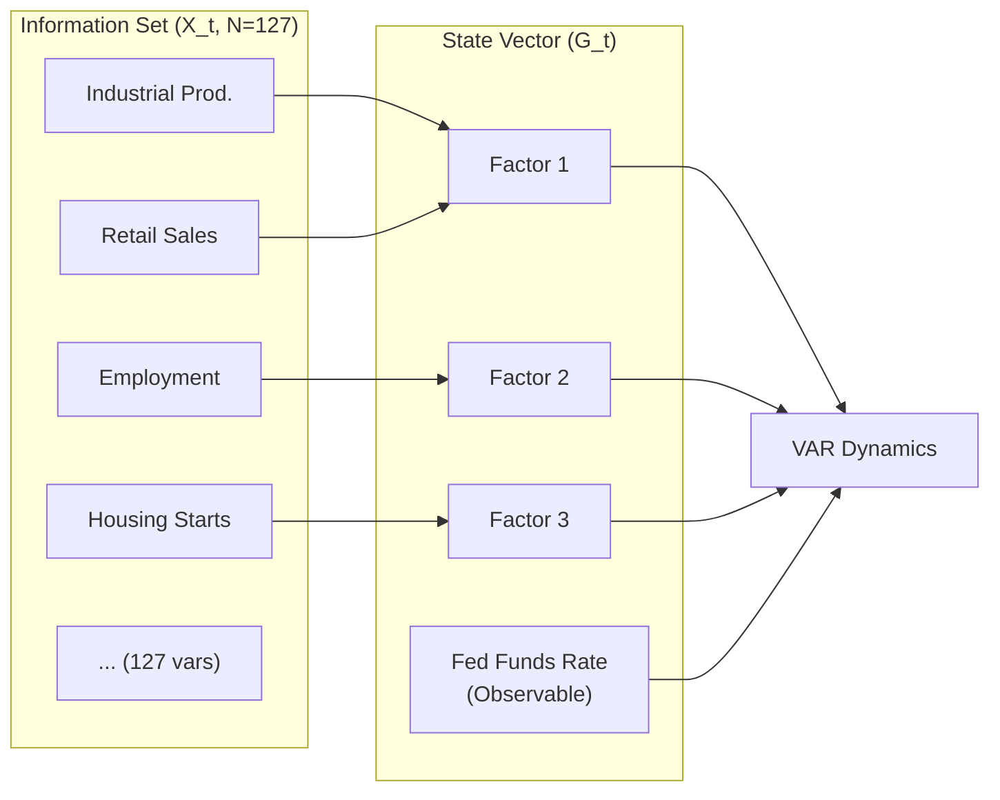
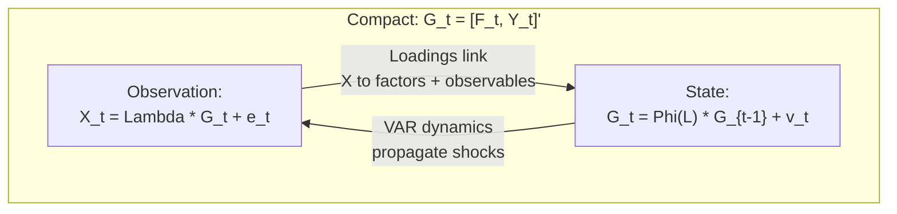
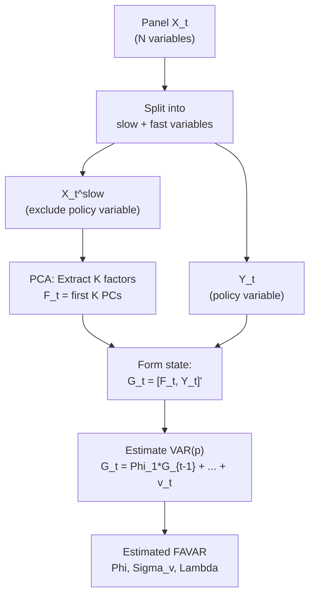
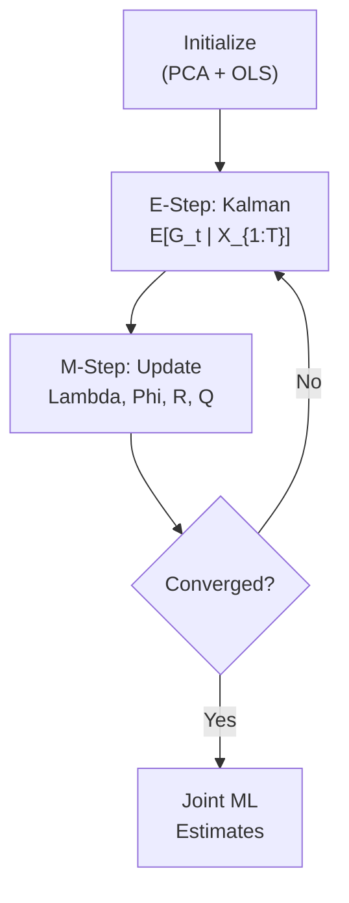
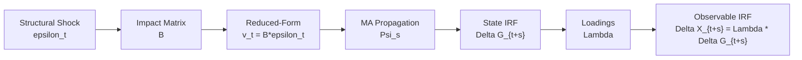
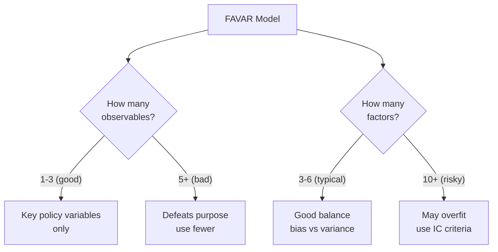
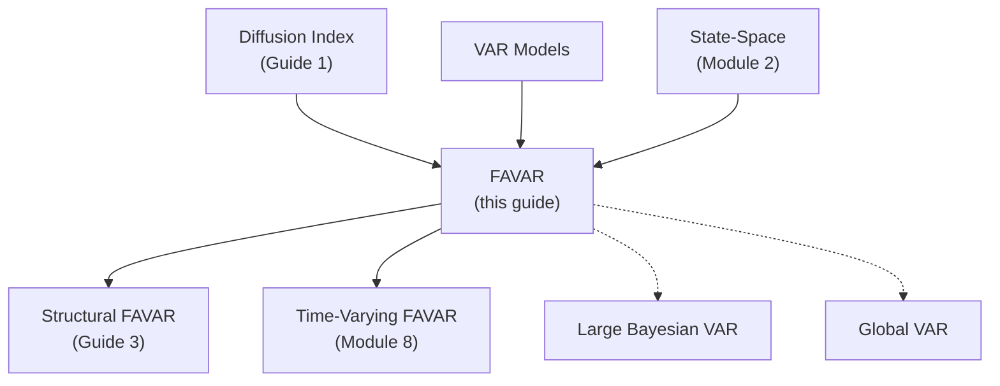

<!-- _class: lead -->

# Factor-Augmented VAR (FAVAR)

## Module 6: Factor-Augmented Models

**Key idea:** Augment a small set of key observables with latent factors from hundreds of variables, combining VAR's structural modeling with factor models' information aggregation.

<!-- Speaker notes: Welcome to Factor-Augmented VAR (FAVAR). This deck is part of Module 06 Factor Augmented. -->
---

# Why FAVAR?

> Traditional VARs use 5-10 variables. FAVAR uses information from 100+ variables while remaining tractable.



<!-- Speaker notes: Continue walking through the implementation. Highlight the key output and how to verify correctness. -->
---

<!-- _class: lead -->

# 1. Model Specification

<!-- Speaker notes: Welcome to 1. Model Specification. This deck is part of Module 06 Factor Augmented. -->
---

# FAVAR Equations

**Observation Equation:**
$$X_t = \Lambda^f F_t + \Lambda^y Y_t + e_t$$

where $X_t$ ($N \times 1$) informational variables, $F_t$ ($K \times 1$) factors, $Y_t$ ($M \times 1$) observables.

**State Equation (VAR):**
$$\begin{bmatrix} F_t \\ Y_t \end{bmatrix} = \Phi(L) \begin{bmatrix} F_{t-1} \\ Y_{t-1} \end{bmatrix} + v_t$$



<!-- Speaker notes: Use this diagram to illustrate the overall flow. Trace through each step with the audience. -->
---

# Special Cases

| Setting | Model | Description |
|---------|-------|-------------|
| $M = 0$ | Pure DFM | No observables, factors only |
| $K = 0$ | Standard VAR | No factors, observables only |
| No lags in $\Phi$ | Static factor model | No dynamics |
| **$K > 0, M > 0$** | **FAVAR** | **Factors + key observables** |

<div class="columns">
<div>

**VAR (small):**
- 5-10 variables
- All observed
- Degrees-of-freedom limited
- Misses information

</div>
<div>

**FAVAR (large):**
- 100+ variables compressed
- Key variables explicit
- Tractable estimation
- Full information set

</div>
</div>

<!-- Speaker notes: Walk through the key rows of this comparison table. Highlight the most important distinctions. -->
---

<!-- _class: lead -->

# 2. Two-Step Estimation

<!-- Speaker notes: Welcome to 2. Two-Step Estimation. This deck is part of Module 06 Factor Augmented. -->
---

# Bernanke-Boivin-Eliasz (2005) Procedure



**Step 1:** $\tilde{F}_t = \text{First } K \text{ PCs of } X_t^{slow}$, normalized $\tilde{F}_t'\tilde{F}_t/T = I_K$

**Step 2:** Estimate VAR on $G_t = [\tilde{F}_t', Y_t']'$ by OLS

<!-- Speaker notes: Use this diagram to illustrate the overall flow. Trace through each step with the audience. -->
---

# Alternative: EM-Based Estimation

**Treat as state-space and iterate:**

**E-step:** Kalman filter/smoother gives $E[G_t | X_{1:T}]$

**M-step:** Update $(\Lambda, \Phi, R, Q)$ via maximum likelihood



**Advantage:** Jointly estimates factors and dynamics, handles missing data.

<!-- Speaker notes: Use this diagram to illustrate the overall flow. Trace through each step with the audience. -->
---

<!-- _class: lead -->

# 3. Impulse Response Analysis

<!-- Speaker notes: Welcome to 3. Impulse Response Analysis. This deck is part of Module 06 Factor Augmented. -->
---

# From Reduced-Form to Structural

**MA representation:** $G_t = \sum_{s=0}^\infty \Psi_s v_{t-s}$

Compute recursively: $\Psi_0 = I, \quad \Psi_s = \sum_{j=1}^{\min(s,p)} \Phi_j \Psi_{s-j}$

**Structural identification:** $v_t = B \varepsilon_t$ where $E[\varepsilon_t \varepsilon_t'] = I$

**Structural IRF:** $\text{SIR}(s) = \Psi_s B$



<!-- Speaker notes: Use this diagram to illustrate the overall flow. Trace through each step with the audience. -->
---

# Mapping Factor IRFs to Observables

Factor IRFs show responses of $F_t$ and $Y_t$. To get original variable responses:

$$\Delta X_{t+s} = \Lambda^f \Delta F_{t+s} + \Lambda^y \Delta Y_{t+s}$$

**Example: Response of IP to monetary shock:**
$$\text{IR}_{IP}(s) = \lambda_{IP}^f \cdot \text{SIR}_F(s) + \lambda_{IP}^y \cdot \text{SIR}_Y(s)$$

> This is the key advantage of FAVAR: trace the effect of one shock through factors to all 100+ observed variables.

<!-- Speaker notes: Explain the notation carefully. Connect each term to its intuitive meaning before moving on. -->
---

# FAVAR Class (Core)

```python
class FAVAR:
    def __init__(self, n_factors=5, n_lags=2, observable_indices=None):
        self.n_factors = n_factors
        self.n_lags = n_lags
        self.observable_indices = observable_indices

    def fit(self, X):
        # Step 1: Extract factors (exclude observables)
        X_slow = np.delete(X, self.observable_indices, axis=1)
        self.factors_ = PCA(n_components=self.n_factors).fit_transform(
            StandardScaler().fit_transform(X_slow))
        self.observables_ = X[:, self.observable_indices]
```

<!-- Speaker notes: Walk through the first part of this code implementation. The code continues on the next slide. -->
---

# FAVAR Class (Core) (continued)

```python
        # Step 2: VAR on [F_t, Y_t]
        G = np.column_stack([self.factors_, self.observables_])
        self.Phi_, self.Sigma_v_ = self._estimate_var(G, self.n_lags)
        return self

    def impulse_response(self, horizon=20, shock_index=0):
        Psi = self._compute_ma_representation(horizon)
        B = linalg.cholesky(self.Sigma_v_, lower=True)
        irf = np.array([Psi[s] @ B[:, shock_index] for s in range(horizon)])
        return irf
```

<!-- Speaker notes: Continue walking through the implementation. Highlight the key output and how to verify correctness. -->
---

# Forecasting and Decomposition

```python
def forecast(self, X_history, h=1):
    """Forecast h periods ahead for ALL N variables."""
    F_hist = self.pca.transform(self.scaler.transform(X_history))
    G_hist = np.column_stack([F_hist, X_history[:, self.observable_indices]])
    G_forecast = self._forecast_var(G_hist, h)
    # Map back: X_forecast = G_forecast @ Lambda'
    return self.scaler.inverse_transform(G_forecast @ self.loadings_.T)

```

<!-- Speaker notes: Walk through the first part of this code implementation. The code continues on the next slide. -->
---

# Forecasting and Decomposition (continued)

```python
def factor_contributions(self, X):
    """Decompose X into factor (common) + idiosyncratic."""
    X_scaled = self.scaler.transform(X)
    F = self.pca.transform(X_scaled)
    X_common = F @ self.loadings_f_.T        # Common component
    X_idio = X_scaled - X_common             # Idiosyncratic
    return {'factors': X_common, 'idiosyncratic': X_idio,
            'explained_variance': self.pca.explained_variance_ratio_}
```

<!-- Speaker notes: Continue walking through the implementation. Highlight the key output and how to verify correctness. -->
---

<!-- _class: lead -->

# 4. Common Pitfalls

<!-- Speaker notes: Welcome to 4. Common Pitfalls. This deck is part of Module 06 Factor Augmented. -->
---

# Pitfalls to Avoid

| Pitfall | Problem | Solution |
|---------|---------|----------|
| Factor identification | Rotation indeterminacy | Consistent normalization; focus on space |
| Too many observables | Defeats dimensionality reduction | Only key variables for structural analysis |
| Wrong lag length | Miss dynamics or overfit | AIC/BIC on state-space VAR |
| Unjustified Cholesky ordering | Order-dependent results | Economic justification or sign restrictions |



<!-- Speaker notes: Emphasize these common mistakes. Ask learners if they have encountered any of these in practice. -->
---

# Practice Problems

**Conceptual:**
1. Why include some variables as observables rather than extracting through factors?
2. In a monetary FAVAR, should the policy rate be observable or factor? Why?
3. How does FAVAR address the degrees-of-freedom problem of large VARs?

**Mathematical:**
4. Derive forecasting equation for $X_{T+h}$ given state $G_T$
5. Show FAVAR likelihood = factor model likelihood $\times$ VAR likelihood
6. Prove $\text{IR}_{X_i, \varepsilon_j}(s) = \lambda_i' \Psi_s B e_j$

**Implementation:**
7. Compare: FAVAR vs small VAR vs diffusion index vs large Bayesian VAR
8. Implement variance decomposition for each structural shock
9. Add fast-moving observable and compare impulse responses

<!-- Speaker notes: Give learners 3-5 minutes to work through these practice problems before discussing solutions. -->
---

# Connections & Summary



| Key Result | Detail |
|------------|--------|
| Model | $X_t = \Lambda G_t + e_t$; $G_t = \Phi(L) G_{t-1} + v_t$ |
| Two-step | PCA on slow variables, then VAR on $[F_t, Y_t]$ |
| IRF mapping | $\Delta X = \Lambda \cdot \Psi_s B$ links shocks to all variables |
| Key advantage | 100+ variable info in tractable $(K+M)$-dim VAR |

**References:** Bernanke, Boivin & Eliasz (2005), Stock & Watson (2005), Doz, Giannone & Reichlin (2012)

<!-- Speaker notes: Summarize the key takeaways and highlight how this topic connects to upcoming material. -->