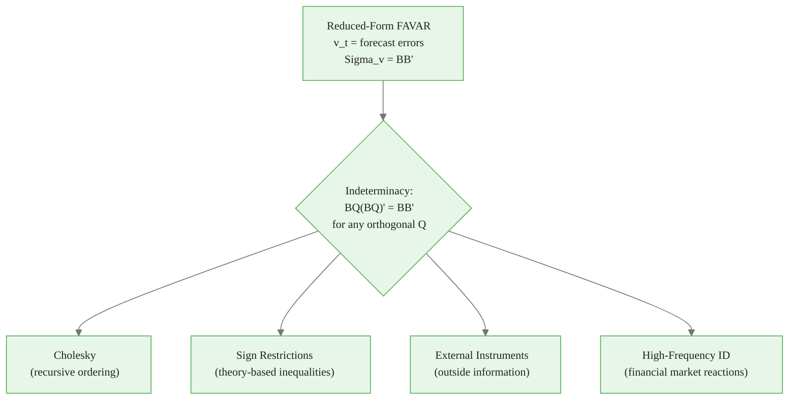
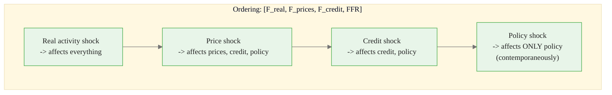
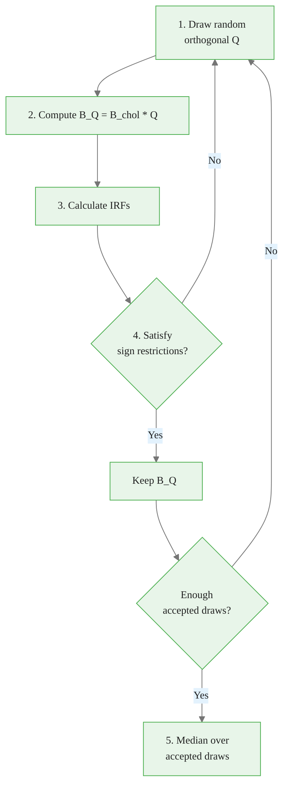
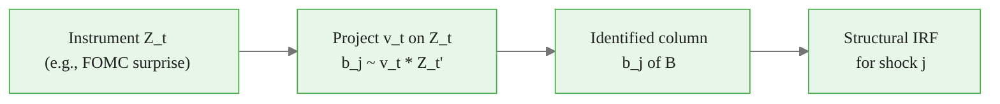
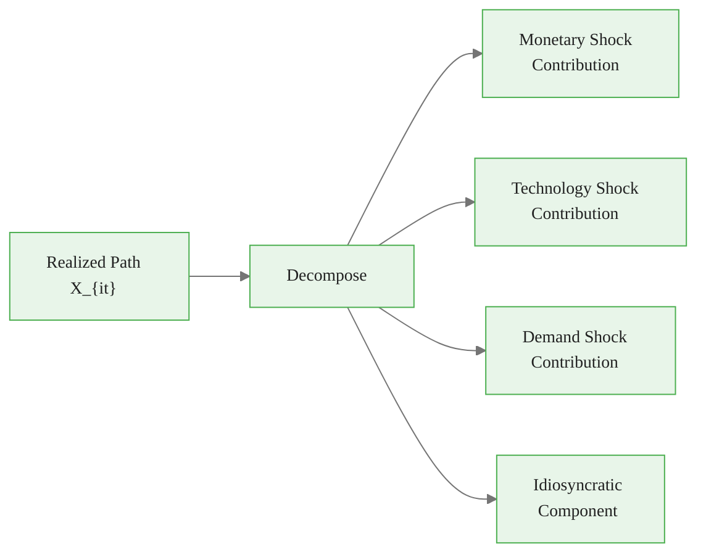
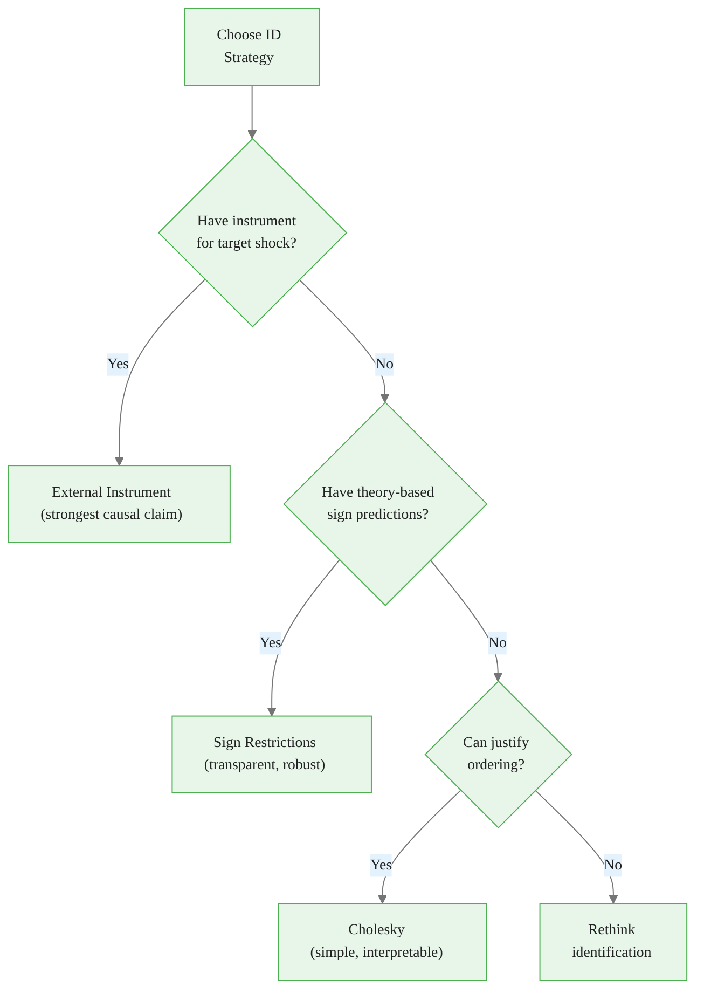
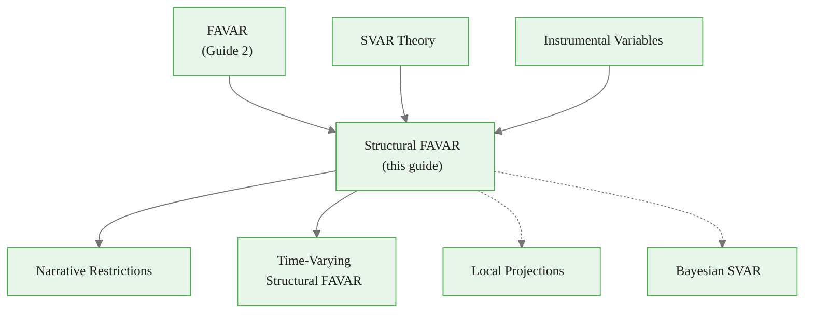

<!-- _class: lead -->

# Structural Identification in FAVARs

## Module 6: Factor-Augmented Models

**Key idea:** Recover economically meaningful shocks from reduced-form innovations by imposing theory-based restrictions -- enabling causal analysis of policy and business cycle shocks across hundreds of variables.

<!-- Speaker notes: Welcome to Structural Identification in FAVARs. This deck is part of Module 06 Factor Augmented. -->
---

# The Identification Problem

> Reduced-form residuals are forecast errors, not economic shocks. Infinitely many structural interpretations exist without restrictions.



<div class="callout-key">

Key implementation detail -- study this pattern carefully.

</div>

**Need:** $(K+M)(K+M-1)/2$ additional restrictions beyond $\Sigma_v = BB'$.

<!-- Speaker notes: Use this diagram to illustrate the overall flow. Trace through each step with the audience. -->
---

<!-- _class: lead -->

# 1. Recursive Identification (Cholesky)

<!-- Speaker notes: Welcome to 1. Recursive Identification (Cholesky). This deck is part of Module 06 Factor Augmented. -->
---

# Cholesky Decomposition

**Assumption:** Shocks have a causal ordering. Variable $i$ responds contemporaneously only to shocks $1, ..., i$.

$$B = \text{cholesky}(\Sigma_v) \quad \text{(lower-triangular)}$$

**Monetary FAVAR Example:**



<div class="callout-insight">

This pattern recurs throughout the course. Understanding it deeply pays dividends later.

</div>

| Advantage | Limitation |
|-----------|-----------|
| Easy to implement | Results sensitive to ordering |
| Exactly identified | Needs economic justification |
| Standard in literature | May miss simultaneous effects |

<!-- Speaker notes: Use this diagram to illustrate the overall flow. Trace through each step with the audience. -->
---

<!-- _class: lead -->

# 2. Sign Restrictions

<!-- Speaker notes: Welcome to 2. Sign Restrictions. This deck is part of Module 06 Factor Augmented. -->
---

# Theory-Based Inequality Constraints

**Approach:** Impose direction of impulse responses from economic theory.

**Contractionary Monetary Shock:**
- Output falls: $\text{IR}_{output}(s) \leq 0$ for $s = 0, ..., S$
- Prices fall: $\text{IR}_{prices}(s) \leq 0$ for $s = 0, ..., S$
- Policy rate rises: $\text{IR}_{rate}(s) \geq 0$ for $s = 0, ..., S$



<div class="callout-warning">

Watch for edge cases with this implementation in production use.

</div>

**Advantage:** Order-invariant, transparent assumptions. **Limitation:** Set identification (range of answers).

<!-- Speaker notes: Use this diagram to illustrate the overall flow. Trace through each step with the audience. -->
---

<!-- _class: lead -->

# 3. External Instruments

<!-- Speaker notes: Welcome to 3. External Instruments. This deck is part of Module 06 Factor Augmented. -->
---

# Proxy VAR / Instrumental Variable Identification

**Idea:** Use outside information correlated with target shock but uncorrelated with others.

**Conditions for instrument $Z_t$:**
- **Relevance:** $E[Z_t \varepsilon_{jt}] \neq 0$ (correlated with shock $j$)
- **Exogeneity:** $E[Z_t \varepsilon_{kt}] = 0$ for $k \neq j$ (uncorrelated with other shocks)

**Estimation:**
$$b_j \propto E[v_t Z_t']$$

where $b_j$ is the $j$th column of impact matrix $B$.



<div class="callout-info">

This approach follows established best practices in the field.

</div>

**Example:** 30-minute Fed funds futures change around FOMC announcement (Gertler-Karadi 2015).

<!-- Speaker notes: Use this diagram to illustrate the overall flow. Trace through each step with the audience. -->
---

<!-- _class: lead -->

# 4. Mathematical Framework

<!-- Speaker notes: Welcome to 4. Mathematical Framework. This deck is part of Module 06 Factor Augmented. -->
---

# Structural IRFs and Variance Decomposition

**Structural IRF:** Response of $G_{t+s}$ to shock $\varepsilon_t$:
$$\text{SIR}_j(s) = \Psi_s b_j$$

**Mapping to all observables:**
$$\text{IR}_{X_i, \varepsilon_j}(s) = \lambda_i' \cdot \Psi_s \cdot b_j$$

**Forecast Error Variance Decomposition:**
$$\text{FEV}_{ij}(h) = \frac{\sum_{s=0}^{h-1} (\lambda_i' \Psi_s b_j)^2}{\sum_{j'=1}^{K+M} \sum_{s=0}^{h-1} (\lambda_i' \Psi_s b_{j'})^2}$$

> FEVD tells you: what fraction of variable $i$'s $h$-period variance is due to shock $j$?

<!-- Speaker notes: Explain the notation carefully. Connect each term to its intuitive meaning before moving on. -->
---

# Historical Decomposition

Decompose realized path into shock contributions:

$$G_t^{(j)} = \sum_{s=0}^{\infty} \Psi_s b_j \varepsilon_{j,t-s}$$

For observables: $X_{it}^{(j)} = \lambda_i' G_t^{(j)}$



> Historical decomposition answers: "How much of the 2020 recession was due to demand shocks vs supply shocks?"

<!-- Speaker notes: Use this diagram to illustrate the overall flow. Trace through each step with the audience. -->
---

# StructuralFAVAR Class (Core)

<div class="code-window">
<div class="code-header">
<div class="dots"><span class="dot-red"></span><span class="dot-yellow"></span><span class="dot-green"></span></div>
<span class="filename">structuralfavar.py</span>
</div>

```python
class StructuralFAVAR:
    def __init__(self, n_factors=5, n_lags=2, observable_indices=None,
                 identification='cholesky'):
        self.identification = identification
        # ... (reduced-form FAVAR setup)

    def fit(self, X, instrument=None, sign_restrictions=None):
        self._estimate_reduced_form(X)
        if self.identification == 'cholesky':
            self.B_ = linalg.cholesky(self.Sigma_v_, lower=True)
        elif self.identification == 'sign_restrictions':
            self.B_ = self._identify_sign_restrictions(sign_restrictions)
        elif self.identification == 'external_instrument':
            self.B_ = self._identify_instrument(instrument)
        return self
```

</div>

<!-- Speaker notes: Walk through the first part of this code implementation. The code continues on the next slide. -->
---

# StructuralFAVAR Class (Core) (continued)

<div class="code-window">
<div class="code-header">
<div class="dots"><span class="dot-red"></span><span class="dot-yellow"></span><span class="dot-green"></span></div>
<span class="filename">structural_irf.py</span>
</div>

```python

    def structural_irf(self, horizon=20, shock_index=0):
        Psi = self._compute_ma_representation(horizon)
        irf_state = np.array([Psi[s] @ self.B_[:, shock_index]
                              for s in range(horizon)])
        irf_observed = irf_state @ self.loadings_.T
        return irf_state, irf_observed
```

</div>

<!-- Speaker notes: Continue walking through the implementation. Highlight the key output and how to verify correctness. -->
---

# Comparing Identification Schemes

| Feature | Cholesky | Sign Restrictions | External Instruments |
|---------|:--------:|:-----------------:|:--------------------:|
| Type | Point ID | Set ID | Point ID |
| Assumptions | Ordering | Inequality (theory) | Instrument validity |
| Robustness | Order-sensitive | Order-invariant | Instrument-dependent |
| Transparency | Low | High | Medium |
| Computation | Fast | Monte Carlo | Moderate |
| Coverage | All shocks | Selected shocks | One shock at a time |

<!-- Speaker notes: Walk through the key rows of this comparison table. Highlight the most important distinctions. -->
---

<!-- _class: lead -->

# 5. Common Pitfalls

<!-- Speaker notes: Welcome to 5. Common Pitfalls. This deck is part of Module 06 Factor Augmented. -->
---

# Pitfalls to Avoid

| Pitfall | Problem | Solution |
|---------|---------|----------|
| Unjustified Cholesky ordering | Order-dependent results | Economic theory or order-invariant methods |
| Weak instruments | Imprecise, biased estimates | F-statistic > 10 |
| Too few sign restrictions | Large identification set | Comprehensive restrictions across variables |
| Mixing incompatible schemes | Over-identification or inconsistency | One coherent strategy per shock |



<!-- Speaker notes: Emphasize these common mistakes. Ask learners if they have encountered any of these in practice. -->
---

# Practice Problems

**Conceptual:**
1. Why is structural identification worse in high-dimensional VARs?
2. Why include policy rate as observable rather than letting factors capture it?
3. What assumptions underlie high-frequency FOMC surprises as monetary instruments?

**Mathematical:**
4. Prove $\Sigma_v = BB' = (BQ)(BQ)'$ for orthogonal $Q$
5. Show FEVD sums to 1 across shocks
6. Show identifying one shock via instrument leaves $(K-1)(K-2)/2$ degrees of freedom

**Implementation:**
7. Implement narrative sign restrictions with historical episodes
8. Bootstrap confidence bands for structural IRFs
9. Test sensitivity to all possible Cholesky orderings

<!-- Speaker notes: Give learners 3-5 minutes to work through these practice problems before discussing solutions. -->
---

# Connections & Summary



| Key Result | Detail |
|------------|--------|
| Identification | $v_t = B\varepsilon_t$ with $BB' = \Sigma_v$ |
| Cholesky | Lower-triangular $B$; order-dependent |
| Sign restrictions | Theory-based inequalities; set identification |
| External instruments | $b_j \propto E[v_t Z_t']$; requires valid instrument |
| IRF to observables | $\text{IR}_{X_i}(s) = \lambda_i' \Psi_s b_j$ |

**References:** Uhlig (2005), Gertler & Karadi (2015), Rubio-Ramirez, Waggoner & Zha (2010), Kilian & Lutkepohl (2017)

<!-- Speaker notes: Summarize the key takeaways and highlight how this topic connects to upcoming material. -->