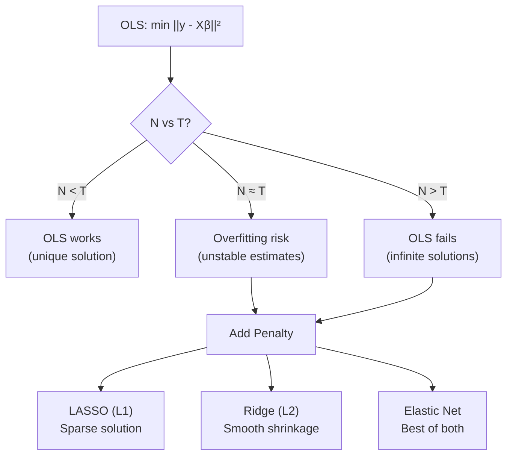
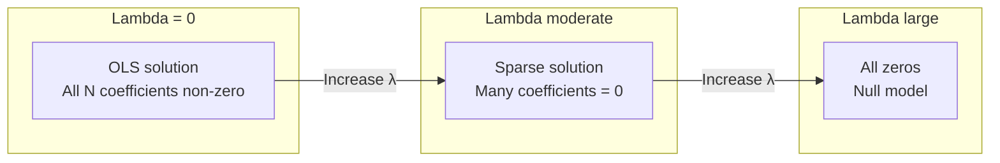
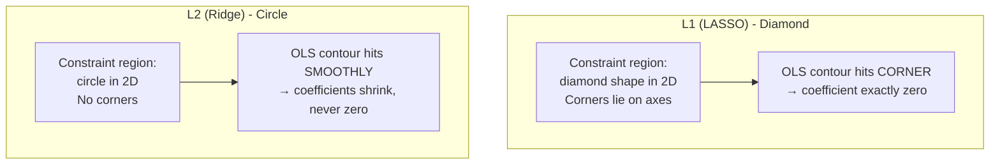
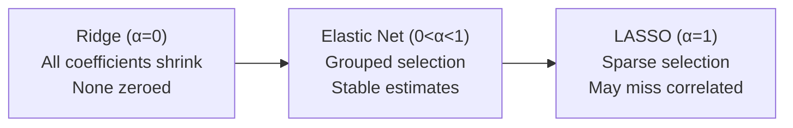
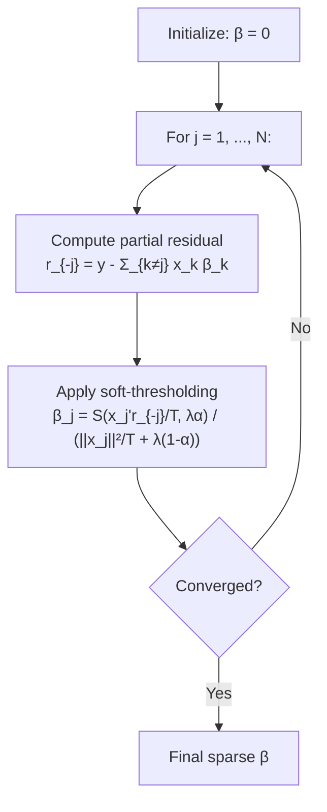
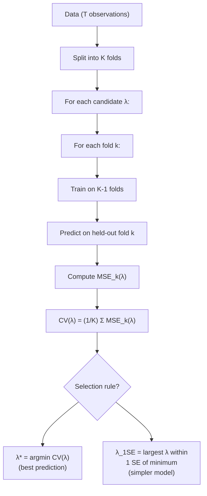
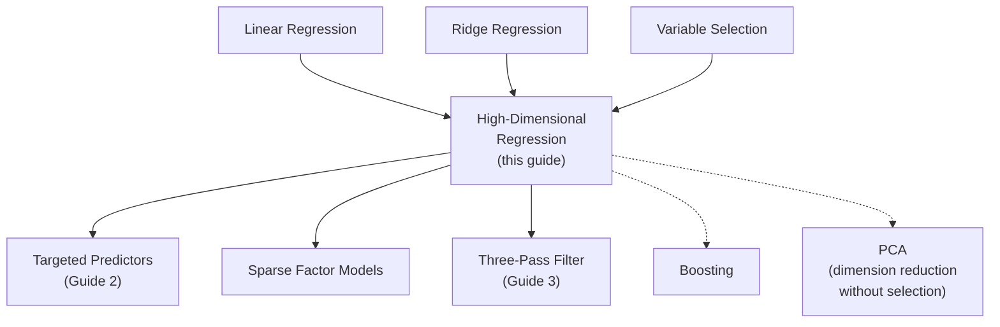

<!-- _class: lead -->

# High-Dimensional Regression: LASSO and Elastic Net

## Module 7: Sparse Methods

**Key idea:** When predictors outnumber observations, add an L1 penalty that shrinks some coefficients exactly to zero -- performing automatic variable selection while avoiding overfitting.

<!-- Speaker notes: Welcome to High-Dimensional Regression: LASSO and Elastic Net. This deck is part of Module 07 Sparse Methods. -->
---

# The High-Dimensional Problem

> With $N$ predictors and $T$ observations, if $N > T$, OLS is infeasible. Penalized regression solves this elegantly.



**Examples:** Forecasting GDP with 100+ indicators, selecting relevant factors, identifying sparse loadings.

<!-- Speaker notes: Use this diagram to illustrate the overall flow. Trace through each step with the audience. -->
---

<!-- _class: lead -->

# 1. LASSO Regression

<!-- Speaker notes: Welcome to 1. LASSO Regression. This deck is part of Module 07 Sparse Methods. -->
---

# LASSO: L1 Penalized Regression

**LASSO estimator:**
$$\hat{\beta}^{\text{LASSO}} = \arg\min_\beta \left\{ \frac{1}{2T} \sum_{t=1}^T (y_t - x_t' \beta)^2 + \lambda \sum_{j=1}^N |\beta_j| \right\}$$

- First term: goodness of fit (residual sum of squares)
- Second term: L1 penalty on coefficient magnitudes
- $\lambda \geq 0$: regularization parameter controlling sparsity



<!-- Speaker notes: Use this diagram to illustrate the overall flow. Trace through each step with the audience. -->
---

# Why L1 Induces Sparsity

**Geometric Intuition:**



**Mathematical reason:** L1 norm $|\beta|$ has a "corner" at zero (non-differentiable), allowing exact zeros in solution.

**Properties:**
- As $\lambda$ increases, more coefficients become exactly zero
- Solution path $\hat{\beta}(\lambda)$ is piecewise linear in $\lambda$
- Under sparsity assumptions, LASSO can recover true zero/non-zero pattern

<!-- Speaker notes: Use this diagram to illustrate the overall flow. Trace through each step with the audience. -->
---

# LASSO Properties

| Property | Detail |
|----------|--------|
| Variable selection | Automatic; $\lambda$ controls how many |
| Bias-variance | Small $\lambda$: low bias, high variance; large $\lambda$: opposite |
| Path continuity | Piecewise linear in $\lambda$ (efficient via LARS) |
| Consistency | Requires "irrepresentable condition" for exact selection |
| Limitation | Selects at most $T$ variables when $N > T$ |
| Limitation | Arbitrarily picks one from correlated group |

**Analogy:** Packing a suitcase with weight limit.
- OLS: Pack everything (overfilled, unstable)
- Subset selection: Pack or leave each item (discrete, unstable)
- LASSO: Include items but pay penalty per item (automatically prioritizes)

<!-- Speaker notes: Walk through the key rows of this comparison table. Highlight the most important distinctions. -->
---

<!-- _class: lead -->

# 2. Elastic Net Regression

<!-- Speaker notes: Welcome to 2. Elastic Net Regression. This deck is part of Module 07 Sparse Methods. -->
---

# Elastic Net: L1 + L2 Penalties

**Motivation:** LASSO limitations with correlated predictors.

**Elastic net combines L1 and L2:**
$$\hat{\beta}^{\text{EN}} = \arg\min_\beta \left\{ \frac{1}{2T} \|y - X\beta\|_2^2 + \lambda \left[ \alpha \|\beta\|_1 + \frac{1-\alpha}{2} \|\beta\|_2^2 \right] \right\}$$

- $\alpha = 1$: pure LASSO
- $\alpha = 0$: pure ridge regression
- $\alpha \in (0,1)$: elastic net



**Grouping effect:** When $x_j \approx x_k$, elastic net assigns $\hat{\beta}_j \approx \hat{\beta}_k$.

<!-- Speaker notes: Use this diagram to illustrate the overall flow. Trace through each step with the audience. -->
---

# Comparing Ridge, LASSO, Elastic Net

<div class="columns">
<div>

**Ridge ($L2$ penalty):**
- Shrinks all coefficients smoothly
- Never exactly zeros coefficients
- Best when many small effects

**LASSO ($L1$ penalty):**
- Zeros out irrelevant coefficients
- Automatic variable selection
- Best when few large effects (sparse truth)

</div>
<div>

**Elastic Net (combination):**
- Combines benefits of both
- Handles correlated predictors well
- Best for factor models (grouped correlations)
- Can select more than $T$ variables

| Feature | Ridge | LASSO | Elastic Net |
|---------|:-----:|:-----:|:-----------:|
| Sparsity | No | Yes | Yes |
| Groups | Stable | Unstable | Stable |
| $N > T$ | OK | ≤ $T$ vars | OK |

</div>
</div>

<!-- Speaker notes: Walk through the key rows of this comparison table. Highlight the most important distinctions. -->
---

<!-- _class: lead -->

# 3. Coordinate Descent Algorithm

<!-- Speaker notes: Welcome to 3. Coordinate Descent Algorithm. This deck is part of Module 07 Sparse Methods. -->
---

# Efficient Optimization

**Coordinate Descent:** Update one coefficient at a time, cycling through all.

$$\beta_j \leftarrow S\left( \frac{x_j' r_{-j}}{T}, \lambda \alpha \right) / \left( \frac{\|x_j\|^2}{T} + \lambda(1-\alpha) \right)$$

where $r_{-j} = y - \sum_{k \neq j} x_k \beta_k$ is partial residual.

**Soft-thresholding operator:**
$$S(z, \gamma) = \begin{cases}
z - \gamma & \text{if } z > \gamma \\
0 & \text{if } |z| \leq \gamma \\
z + \gamma & \text{if } z < -\gamma
\end{cases}$$



**Convergence:** Typically 10-100 iterations. Very fast.

<!-- Speaker notes: Use this diagram to illustrate the overall flow. Trace through each step with the audience. -->
---

<!-- _class: lead -->

# 4. Selecting Regularization Parameter

<!-- Speaker notes: Welcome to 4. Selecting Regularization Parameter. This deck is part of Module 07 Sparse Methods. -->
---

# Cross-Validation and 1-SE Rule

**K-fold CV procedure:**



**Information Criteria (faster alternative):**
$$\text{BIC}_\lambda = T \log(\text{RSS}_\lambda / T) + \log(T) \cdot \text{df}_\lambda$$

where $\text{df}_\lambda$ = number of non-zero coefficients.

**BIC typically selects sparser models** than AIC or CV.

<!-- Speaker notes: Use this diagram to illustrate the overall flow. Trace through each step with the audience. -->
---

# HighDimensionalRegression Class (Core)

```python
class HighDimensionalRegression:
    def __init__(self, method='lasso', alpha=None, l1_ratio=0.5,
                 cv_folds=5, standardize=True):
        self.method = method
        self.alpha = alpha  # If None, use CV
        self.l1_ratio = l1_ratio
        self.scaler = StandardScaler() if standardize else None

```

<!-- Speaker notes: Walk through the first part of this code implementation. The code continues on the next slide. -->
---

# HighDimensionalRegression Class (Core) (continued)

```python
    def fit(self, X, y):
        if self.standardize:
            X = self.scaler.fit_transform(X)
        if self.alpha is None:
            if self.method == 'lasso':
                self.model = LassoCV(cv=self.cv_folds, max_iter=10000)
            elif self.method == 'elasticnet':
                self.model = ElasticNetCV(cv=self.cv_folds,
                                          l1_ratio=self.l1_ratio)
            self.model.fit(X, y)
            self.alpha = self.model.alpha_
        self.selected_features_ = np.where(self.model.coef_ != 0)[0]
        return self
```

<!-- Speaker notes: Continue walking through the implementation. Highlight the key output and how to verify correctness. -->
---

<!-- _class: lead -->

# 5. Common Pitfalls

<!-- Speaker notes: Welcome to 5. Common Pitfalls. This deck is part of Module 07 Sparse Methods. -->
---

# Pitfalls to Avoid

| Pitfall | Problem | Solution |
|---------|---------|----------|
| Forgetting to standardize | Penalty affects variables differently by scale | Always standardize predictors |
| Including intercept in penalty | Intercept should not be penalized | Use `fit_intercept=True` (sklearn default) |
| Evaluating on training data | Overly optimistic performance | Use separate test set or nested CV |
| Interpreting as "causal" | LASSO selects for prediction, not causality | Use for prediction or screening only |
| Pure LASSO with correlated predictors | Arbitrarily picks one from group | Use elastic net ($\alpha < 1$) |

```python
# WRONG: Extract alpha and evaluate on same data
model = LassoCV(cv=5)
model.fit(X_train, y_train)
score = model.score(X_train, y_train)  # Biased!

# CORRECT: Evaluate on held-out test data
model = LassoCV(cv=5)
model.fit(X_train, y_train)
score = model.score(X_test, y_test)  # Honest estimate
```

<!-- Speaker notes: Emphasize these common mistakes. Ask learners if they have encountered any of these in practice. -->
---

# Practice Problems

**Conceptual:**
1. Why does the L1 penalty produce exact zeros while L2 does not? Explain geometrically and analytically.
2. When would you prefer LASSO over elastic net? When would you prefer elastic net?
3. Explain why standardization is crucial for LASSO but not for OLS.

**Mathematical:**
4. Derive the soft-thresholding operator from the LASSO objective for a single coefficient.
5. Show that the LASSO solution path is piecewise linear in $\lambda$.
6. Prove that elastic net with $\alpha = 0$ is equivalent to ridge regression (up to rescaling).

**Implementation:**
7. Compare LASSO, elastic net, and OLS on a dataset with 50 predictors, 100 observations, 5 true non-zero.
8. Implement cross-validation from scratch for LASSO (without `LassoCV`).
9. Create a simulation showing elastic net's advantage with highly correlated groups.

<!-- Speaker notes: Give learners 3-5 minutes to work through these practice problems before discussing solutions. -->
---

# Connections & Summary



| Key Result | Detail |
|------------|--------|
| LASSO | $\min \|y - X\beta\|^2/2T + \lambda \|\beta\|_1$; sparse solutions |
| Elastic net | Combines L1 + L2; handles correlated groups |
| Soft-thresholding | $S(z,\gamma) = \text{sign}(z)(|z|-\gamma)_+$ |
| CV selection | K-fold or 1-SE rule for $\lambda$; BIC for speed |

**References:** Tibshirani (1996), Zou & Hastie (2005), Friedman, Hastie & Tibshirani (2010), Giannone, Lenza & Primiceri (2021)

<!-- Speaker notes: Summarize the key takeaways and highlight how this topic connects to upcoming material. -->