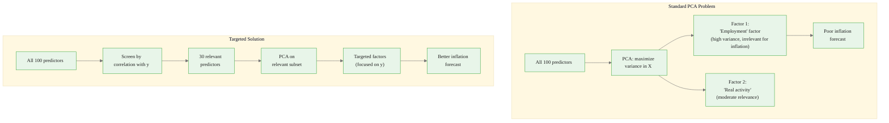
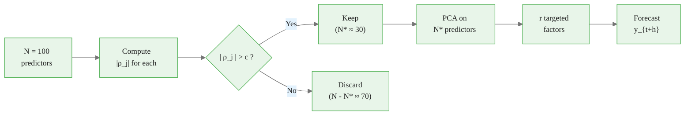
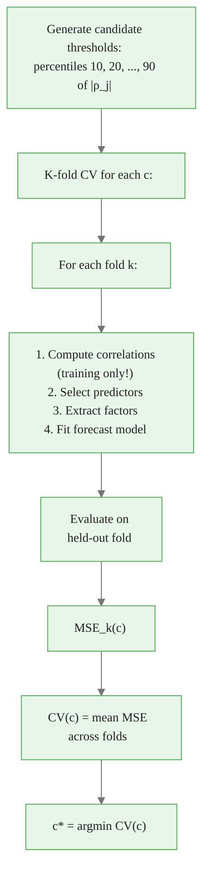
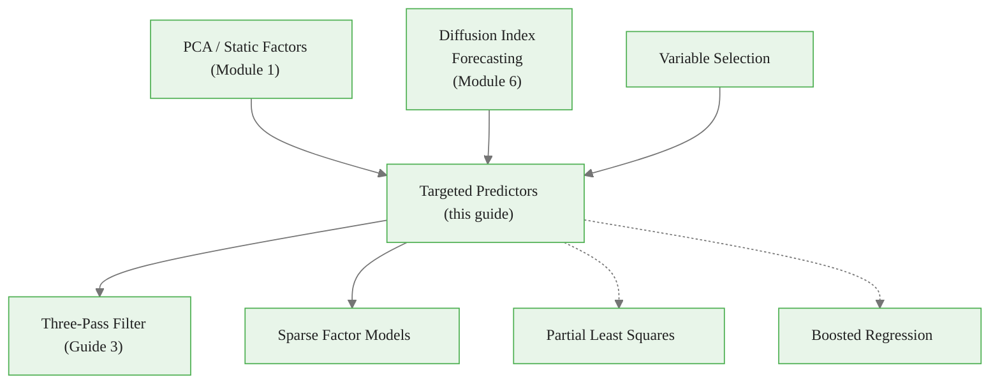

<!-- _class: lead -->

# Targeted Predictors: Bai-Ng Factor Selection

## Module 7: Sparse Methods

**Key idea:** Standard PCA extracts factors explaining maximum variance in predictors $X$, but this does not guarantee good prediction of target $y$. Targeted methods first screen predictors by relevance, then extract factors from the reduced set.

<!-- Speaker notes: Welcome to Targeted Predictors: Bai-Ng Factor Selection. This deck is part of Module 07 Sparse Methods. -->
---

# When PCA Factors Fail

> High-variance predictors dominate PCA factors, but they may be irrelevant for forecasting your target.



<div class="callout-key">

Key implementation detail -- study this pattern carefully.

</div>

<!-- Speaker notes: Use this diagram to illustrate the overall flow. Trace through each step with the audience. -->
---

<!-- _class: lead -->

# 1. Hard Thresholding

<!-- Speaker notes: Welcome to 1. Hard Thresholding. This deck is part of Module 07 Sparse Methods. -->
---

# Hard Thresholding: Select or Discard

**Step 1:** Compute marginal correlation for each predictor:
$$\hat{\rho}_j = \text{Corr}(X_{jt}, y_{t+h})$$

**Step 2:** Select predictors exceeding threshold $c$:
$$\mathcal{S}_{\text{hard}} = \{j : |\hat{\rho}_j| > c\}$$

**Step 3:** Extract factors from selected predictors via PCA.



<div class="callout-insight">

This pattern recurs throughout the course. Understanding it deeply pays dividends later.

</div>

**Threshold choice:** Too high = miss important predictors. Too low = include noise. Typical: select top 20-50%.

<!-- Speaker notes: Use this diagram to illustrate the overall flow. Trace through each step with the audience. -->
---

<!-- _class: lead -->

# 2. Soft Thresholding

<!-- Speaker notes: Welcome to 2. Soft Thresholding. This deck is part of Module 07 Sparse Methods. -->
---

# Soft Thresholding: Weight by Relevance

**Approach:** Instead of binary keep/discard, weight predictors by correlation strength:
$$w_j = \frac{|\hat{\rho}_j|^{\gamma}}{\sum_{k=1}^N |\hat{\rho}_k|^{\gamma}}$$

**Weighted PCA:**
- Transform: $\tilde{X}_{jt} = \sqrt{w_j} \cdot X_{jt}$
- Extract factors from $\tilde{X}$ via standard PCA
- Factors emphasize high-correlation predictors

**Special cases:**

| $\gamma$ | Behavior |
|:--------:|----------|
| $\gamma = 0$ | Equal weights (standard PCA) |
| $\gamma = 1$ | Linear weighting by correlation |
| $\gamma = 2$ | Squared-correlation weighting |
| $\gamma \to \infty$ | Approaches hard thresholding |

**Advantages over hard thresholding:** Smoother, more stable, less sensitive to threshold choice.

<!-- Speaker notes: Explain the notation carefully. Connect each term to its intuitive meaning before moving on. -->
---

# Comparing Standard vs Targeted PCA


<div class="callout-warning">

Watch for edge cases with this implementation in production use.

</div>

<!-- Speaker notes: Continue walking through the implementation. Highlight the key output and how to verify correctness. -->
---

<!-- _class: lead -->

# 3. Theoretical Properties

<!-- Speaker notes: Welcome to 3. Theoretical Properties. This deck is part of Module 07 Sparse Methods. -->
---

# Why Targeting Helps

**Population factor model:**
$$X_{jt} = \lambda_j' F_t + e_{jt}, \quad y_t = \beta' F_t + u_t$$

**If** some factor components are irrelevant for $y$ (corresponding $\beta$ elements zero):

- Predictors loading primarily on irrelevant factors have $\text{Cov}(X_j, y) \approx 0$
- **Targeting removes these predictors** and focuses on relevant factor space

**Consistency (Bai-Ng 2008):**
$$\text{MSE}_{\text{target}} \leq \text{MSE}_{\text{standard}} + o_p(1)$$

Targeting never hurts asymptotically and often helps substantially.

**When targeting helps most:**
- Many predictors unrelated to target
- High-variance predictors are irrelevant
- True factor structure is sparse for target

**When targeting helps least:**
- All predictors relevant for target
- Factors explaining $X$ variance also predict $y$ well

<!-- Speaker notes: Explain the notation carefully. Connect each term to its intuitive meaning before moving on. -->
---

# TargetedPredictors Class (Core)

<div class="code-window">
<div class="code-header">
<div class="dots"><span class="dot-red"></span><span class="dot-yellow"></span><span class="dot-green"></span></div>
<span class="filename">targetedpredictors.py</span>
</div>

```python
class TargetedPredictors:
    def __init__(self, n_factors=5, threshold_type='hard',
                 threshold=None, gamma=1.0, horizon=1):
        self.n_factors = n_factors
        self.threshold_type = threshold_type
        self.threshold = threshold
        self.gamma = gamma
        self.horizon = horizon

    def fit(self, X, y):
        # Step 1: Marginal correlations with y_{t+h}
        for j in range(N):
            self.correlations_[j] = pearsonr(X[:-h, j], y[h:])[0]

```

</div>

<div class="callout-info">

This approach follows established best practices in the field.

</div>

<!-- Speaker notes: Walk through the first part of this code implementation. The code continues on the next slide. -->
---

# TargetedPredictors Class (Core) (continued)

<div class="code-window">
<div class="code-header">
<div class="dots"><span class="dot-red"></span><span class="dot-yellow"></span><span class="dot-green"></span></div>
<span class="filename">example.py</span>
</div>

```python
        # Step 2: Screen/weight predictors
        if self.threshold_type == 'hard':
            self.selected_ = np.where(np.abs(self.correlations_) >= c)[0]
            X_selected = X[:, self.selected_]
        else:  # soft
            weights = np.abs(correlations) ** self.gamma
            X_selected = X * np.sqrt(weights / weights.sum())

        # Step 3: Extract targeted factors
        self.factors_ = PCA(n_factors).fit_transform(X_selected)

        # Step 4: Forecast regression
        self.reg.fit(self.factors_[:-h], y[h:])
        return self
```

</div>

<!-- Speaker notes: Continue walking through the implementation. Highlight the key output and how to verify correctness. -->
---

# Threshold Selection via Cross-Validation



| Threshold too high | Threshold too low |
|-------------------|-------------------|
| Few predictors selected | Many predictors selected |
| May miss information | Noise dilutes signal |
| Underfitting risk | Overfitting risk |

<!-- Speaker notes: Use this diagram to illustrate the overall flow. Trace through each step with the audience. -->
---

<!-- _class: lead -->

# 4. Common Pitfalls

<!-- Speaker notes: Welcome to 4. Common Pitfalls. This deck is part of Module 07 Sparse Methods. -->
---

# Pitfalls to Avoid

| Pitfall | Problem | Solution |
|---------|---------|----------|
| Full-sample correlation | Look-ahead bias in screening | Compute correlations on training data only |
| No standardization | High-variance variables appear more correlated | Standardize before computing correlations |
| Over-aggressive threshold | Discard useful information | Ensure at least $2r$-$3r$ predictors selected |
| Wrong horizon alignment | Screening not matched to forecast task | Use $\text{Corr}(X_t, y_{t+h})$, not $\text{Corr}(X_t, y_t)$ |

<div class="code-window">
<div class="code-header">
<div class="dots"><span class="dot-red"></span><span class="dot-yellow"></span><span class="dot-green"></span></div>
<span class="filename">example.py</span>
</div>

```python
# WRONG for h-step forecast
corr = pearsonr(X[:, j], y)[0]  # Contemporaneous!

# CORRECT
corr = pearsonr(X[:-h, j], y[h:])[0]  # Horizon-aligned
```

</div>

<!-- Speaker notes: Emphasize these common mistakes. Ask learners if they have encountered any of these in practice. -->
---

# Practice Problems

**Conceptual:**
1. Why might the first principal component have poor forecasting power despite explaining the most variance?
2. Compare hard vs soft thresholding. When would you prefer each?
3. Can targeted predictors hurt forecast performance? Under what conditions?

**Mathematical:**
4. Derive soft-thresholding weights for $\gamma = 2$. How do they relate to squared correlations?
5. Show that soft thresholding with $\gamma \to \infty$ converges to hard thresholding.
6. Prove that if all predictors are uncorrelated with $y$, targeting reduces to random selection.

**Implementation:**
7. Compare standard PCA, hard targeting, and soft targeting on data where half the predictors are pure noise.
8. Implement "double targeting": first select by correlation with $y$, then select diverse predictors.
9. Create adaptive threshold selection maximizing out-of-sample $R^2$ with rolling window.

<!-- Speaker notes: Give learners 3-5 minutes to work through these practice problems before discussing solutions. -->
---

# Connections & Summary



| Key Result | Detail |
|------------|--------|
| Hard thresholding | Select $\{j : |\hat{\rho}_j| > c\}$, then PCA on selected |
| Soft thresholding | Weight by $w_j \propto |\hat{\rho}_j|^\gamma$, then weighted PCA |
| Consistency | Targeting never hurts asymptotically |
| Best when | Many irrelevant predictors dominate PCA variance |

**References:** Bai & Ng (2008, 2009), Fan & Lv (2008), Ng (2013), Smeekes & Wijler (2021)

<!-- Speaker notes: Summarize the key takeaways and highlight how this topic connects to upcoming material. -->