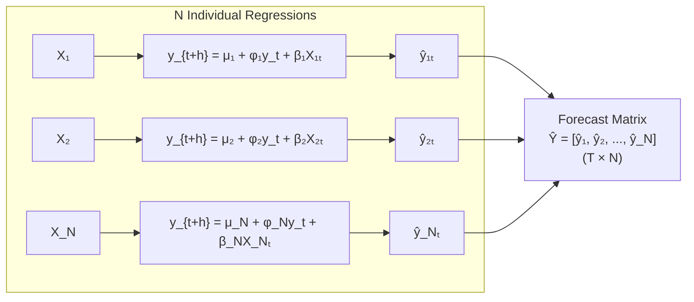
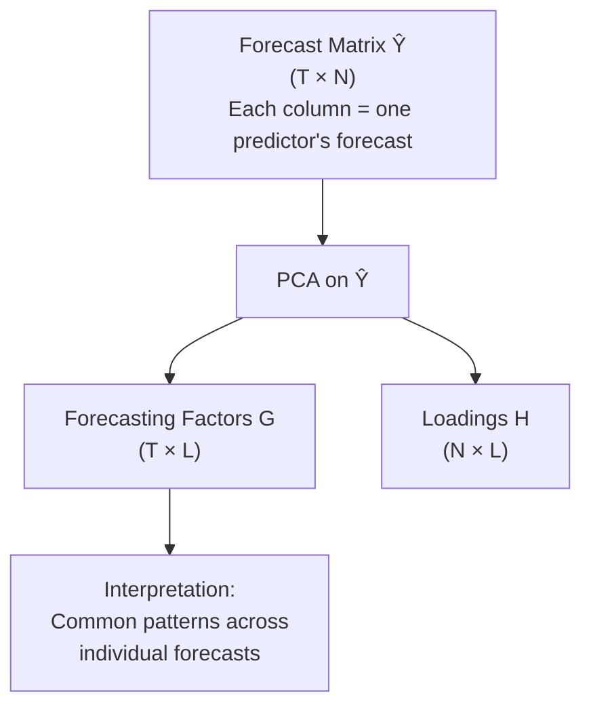
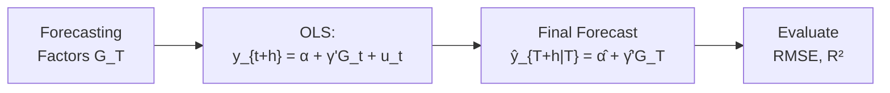
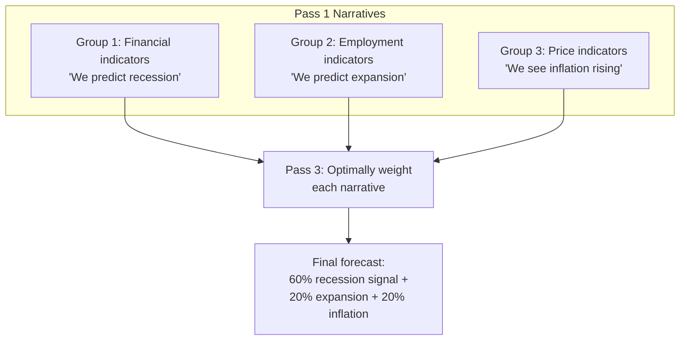
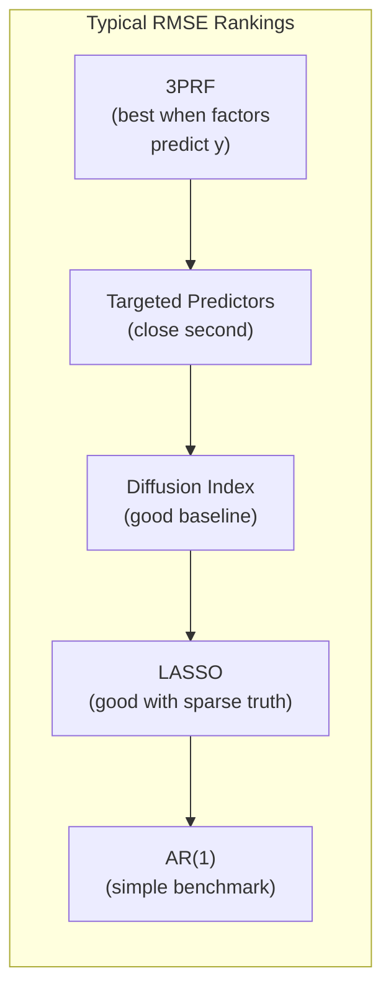
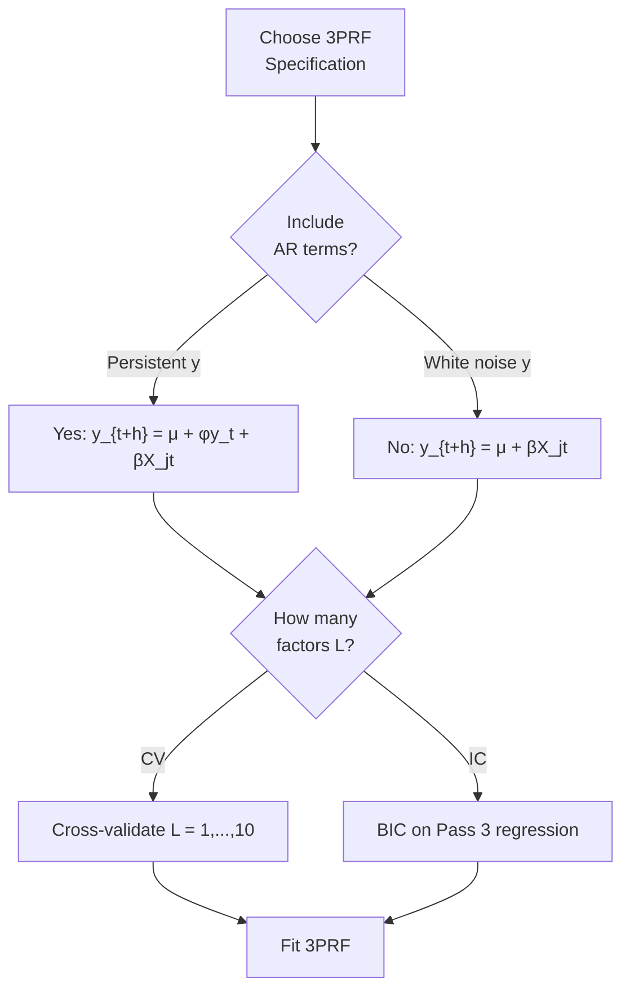
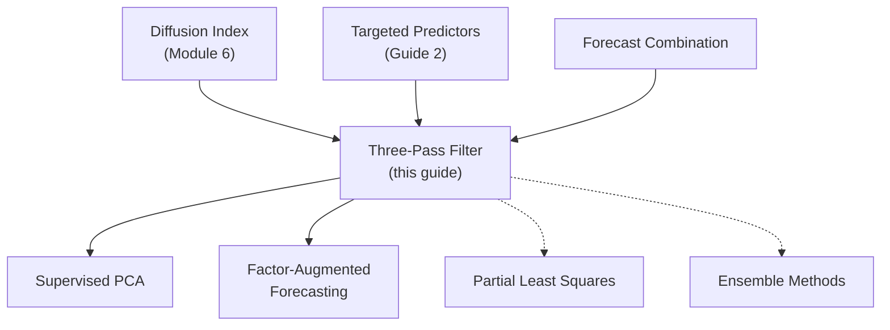

<!-- _class: lead -->

# Three-Pass Regression Filter

## Module 7: Sparse Methods

**Key idea:** Extract factors not from predictor space $X$, but from the space of individual forecasts of $y$ -- ensuring factors are "supervised" and specifically designed for the forecasting task.

<!-- Speaker notes: Welcome to Three-Pass Regression Filter. This deck is part of Module 07 Sparse Methods. -->
---

# Limitations of Existing Methods

> Standard PCA extracts factors from $X$ without using $y$. 3PRF innovates by using $y$ in all three passes.

```mermaid
flowchart TD
    subgraph "Standard Diffusion Index"
        A1["X (predictors)"] --> A2["PCA on X"]
        A2 --> A3["Factors F"]
        A3 --> A4["Regress y on F"]
        A4 --> A5["Forecast"]
    end
    subgraph "Targeted Predictors (Bai-Ng)"
        B1["X (predictors)"] --> B2["Screen by\ncorr(X_j, y)"]
        B2 --> B3["PCA on selected X"]
        B3 --> B4["Targeted F"]
        B4 --> B5["Regress y on F"]
        B5 --> B6["Forecast"]
    end
    subgraph "Three-Pass Filter (Kelly-Pruitt)"
        C1["X (predictors)"] --> C2["Pass 1: Regress\ny on each X_j"]
        C2 --> C3["Pass 2: PCA on\nindividual forecasts"]
        C3 --> C4["Forecasting\nfactors G"]
        C4 --> C5["Pass 3: Regress\ny on G"]
        C5 --> C6["Forecast"]
    end
```



**Key difference:** 3PRF factors are extracted from forecast space, not predictor space.

<!-- Speaker notes: Continue walking through the implementation. Highlight the key output and how to verify correctness. -->
---

<!-- _class: lead -->

# 1. The Three Passes

<!-- Speaker notes: Welcome to 1. The Three Passes. This deck is part of Module 07 Sparse Methods. -->
---

# Pass 1: Univariate Forecasting Regressions

For each predictor $j = 1, ..., N$, run:
$$y_{t+h} = \mu_j + \phi_j y_t + \beta_j X_{jt} + \varepsilon_{jt}$$



**Purpose:** Quantify each predictor's individual forecasting power.

**Output:** $\hat{Y}_{tj} = \hat{\mu}_j + \hat{\phi}_j y_t + \hat{\beta}_j X_{jt}$ -- predictor $j$'s forecast of $y_{t+h}$.

<!-- Speaker notes: Use this diagram to illustrate the overall flow. Trace through each step with the audience. -->
---

# Pass 2: Cross-Sectional Factor Extraction

**Extract factors from forecast matrix $\hat{Y}$ via PCA:**
$$\hat{Y} = \hat{G} \hat{H}' + \text{residuals}$$

- $\hat{G}$: $T \times L$ matrix of "forecasting factors"
- $\hat{H}$: $N \times L$ matrix of loadings
- $L$: number of factors (typically 2-5)



**Intuition:** If multiple predictors forecast $y$ similarly, they share an underlying factor. Pass 2 finds these common "narratives."

<!-- Speaker notes: Use this diagram to illustrate the overall flow. Trace through each step with the audience. -->
---

# Pass 3: Forecast Combination

**Use extracted factors $\hat{G}$ in final forecasting regression:**
$$y_{t+h} = \alpha + \gamma' \hat{G}_t + u_t$$

**Final forecast:**
$$\hat{y}_{T+h|T} = \hat{\alpha} + \hat{\gamma}' \hat{G}_T$$



**Optional extension:** Include both factors and selected individual predictors:
$$y_{t+h} = \alpha + \gamma' \hat{G}_t + \sum_{j \in S} \delta_j X_{jt} + u_t$$

<!-- Speaker notes: Use this diagram to illustrate the overall flow. Trace through each step with the audience. -->
---

<!-- _class: lead -->

# 2. Why 3PRF Beats Alternatives

<!-- Speaker notes: Welcome to 2. Why 3PRF Beats Alternatives. This deck is part of Module 07 Sparse Methods. -->
---

# Intuitive Comparison

**Think of forecasting $y$ with 100 predictors:**

| Pass | Analogy | What Happens |
|------|---------|-------------|
| **Pass 1** | Individual interviews | Ask each predictor: "What's your forecast?" |
| **Pass 2** | Finding consensus groups | Group similar forecasts into "narratives" |
| **Pass 3** | Final decision | Weight narratives by historical accuracy |



**vs Standard PCA:** "What varies most in $X$?"
**vs 3PRF:** "What common patterns exist in predictions of $y$?"

<!-- Speaker notes: Use this diagram to illustrate the overall flow. Trace through each step with the audience. -->
---

# Theoretical Justification

**Suppose true model:**
$$y_{t+h} = F_t' \beta + u_t, \quad X_{jt} = F_t' \lambda_j + e_{jt}$$

**Pass 1 estimates:** $\hat{y}_{jt} \approx E[y_{t+h} | X_{jt}] \approx \lambda_j' F_t$

**Pass 2 extracts:** Factors from $\hat{Y}$ recover the space spanned by $F_t' \Lambda$

**Pass 3 projects:** $y_{t+h}$ onto estimated factor space

**Result:** Consistent estimation of forecast function under regularity conditions.

| Feature | Diffusion Index | Targeted | 3PRF |
|---------|:--------------:|:--------:|:----:|
| Uses $y$ in factor extraction | No | Partially | Fully |
| Factors optimized for $y$ | No | Partially | Yes |
| Supervised | No | Partially | Yes |

<!-- Speaker notes: Explain the notation carefully. Connect each term to its intuitive meaning before moving on. -->
---

<!-- _class: lead -->

# 3. Code Implementation

<!-- Speaker notes: Welcome to 3. Code Implementation. This deck is part of Module 07 Sparse Methods. -->
---

# ThreePassRegressionFilter Class (Core)

```python
class ThreePassRegressionFilter:
    def __init__(self, n_factors=3, horizon=1, include_ar=True):
        self.n_factors = n_factors
        self.horizon = horizon
        self.include_ar = include_ar

    def fit(self, X, y):
        T, N = X.shape
        T_eff = T - self.horizon

```

<!-- Speaker notes: Walk through the first part of this code implementation. The code continues on the next slide. -->
---

# ThreePassRegressionFilter Class (Core) (continued)

```python
        # PASS 1: N univariate regressions
        pass1_forecasts = np.zeros((T_eff, N))
        for j in range(N):
            X_j = X[:T_eff, j].reshape(-1, 1)
            y_ahead = y[self.horizon:T_eff + self.horizon]
            if self.include_ar:
                X_aug = np.column_stack([y[:T_eff], X_j])
            model_j = LinearRegression().fit(X_aug, y_ahead)
            pass1_forecasts[:, j] = model_j.predict(X_aug)

        # PASS 2: PCA on forecast matrix
        self.factors_ = PCA(self.n_factors).fit_transform(pass1_forecasts)

        # PASS 3: Final forecast regression
        self.pass3_model_ = LinearRegression()
        self.pass3_model_.fit(self.factors_, y_ahead)
        return self
```

<!-- Speaker notes: Continue walking through the implementation. Highlight the key output and how to verify correctness. -->
---

# Method Comparison Results



```python
def compare_methods(X_train, y_train, X_test, y_test):
    results = {}
    # Three-pass filter
    tprf = ThreePassRegressionFilter(n_factors=5, horizon=1)
    tprf.fit(X_train, y_train)
    results['3PRF'] = compute_rmse(tprf.predict(X_test), y_test)
    # Diffusion index, LASSO, AR(1) ...
    return results
```

> Rankings vary by dataset. Always compare to simple benchmarks.

<!-- Speaker notes: Walk through this code step by step. Highlight the key lines and explain the output. -->
---

<!-- _class: lead -->

# 4. Common Pitfalls

<!-- Speaker notes: Welcome to 4. Common Pitfalls. This deck is part of Module 07 Sparse Methods. -->
---

# Pitfalls to Avoid

| Pitfall | Problem | Solution |
|---------|---------|----------|
| Too many factors | Overfitting in Pass 2 | CV or IC; typically $L = 2$-$5$ |
| Wrong horizon alignment | Pass 1 model doesn't match task | Regress $y_{t+h}$ on $X_t$, not $y_t$ on $X_t$ |
| Omitting AR terms | Miss autoregressive information | Include lagged $y$ in Pass 1 |
| Inconsistent standardization | Scale mismatch in prediction | Apply same transforms in fit and predict |



<!-- Speaker notes: Emphasize these common mistakes. Ask learners if they have encountered any of these in practice. -->
---

# Practice Problems

**Conceptual:**
1. Why does extracting factors from forecasts (Pass 2) differ from extracting factors from predictors?
2. Can 3PRF perform worse than standard diffusion index? Under what conditions?
3. How does 3PRF handle multicollinearity among predictors?

**Mathematical:**
4. Show that Pass 1 fitted values are projections of $y_{t+h}$ onto $(1, y_t, X_{jt})$.
5. Prove that if all Pass 1 forecasts are identical, Pass 2 extracts only one factor.
6. Derive the relationship between Pass 3 coefficients and the "consensus" among Pass 1 forecasts.

**Implementation:**
7. Implement "adaptive 3PRF" that selects $L$ via cross-validation automatically.
8. Extend 3PRF to handle missing data in predictor panel during Pass 1.
9. Create a "sparse 3PRF" using LASSO in Pass 3 instead of OLS.

<!-- Speaker notes: Give learners 3-5 minutes to work through these practice problems before discussing solutions. -->
---

# Connections & Summary



| Key Result | Detail |
|------------|--------|
| Pass 1 | $N$ univariate regressions: $y_{t+h} = \mu_j + \phi_j y_t + \beta_j X_{jt}$ |
| Pass 2 | PCA on forecast matrix $\hat{Y}$ to extract $L$ factors |
| Pass 3 | $y_{t+h} = \alpha + \gamma' \hat{G}_t + u_t$ |
| Key advantage | Factors optimized for forecasting $y$, not summarizing $X$ |

**References:** Kelly & Pruitt (2015, 2013), Giglio, Kelly & Pruitt (2016), Ng (2013)

<!-- Speaker notes: Summarize the key takeaways and highlight how this topic connects to upcoming material. -->