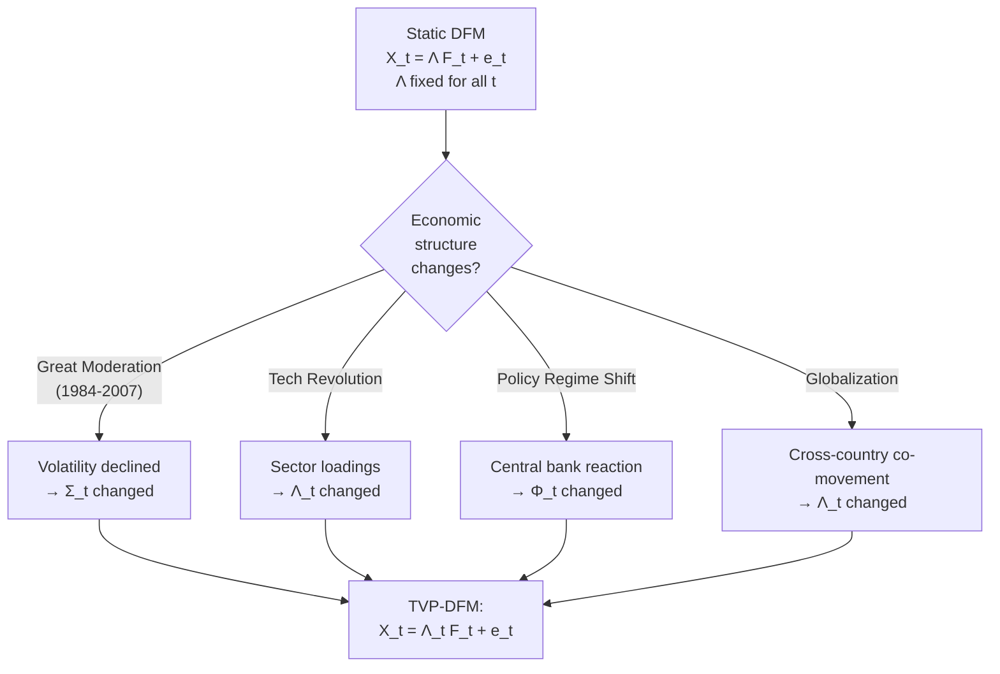
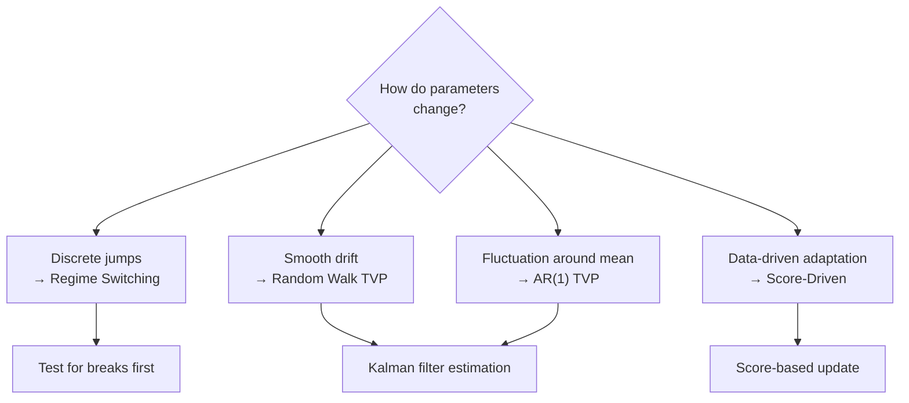
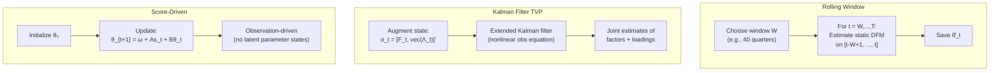
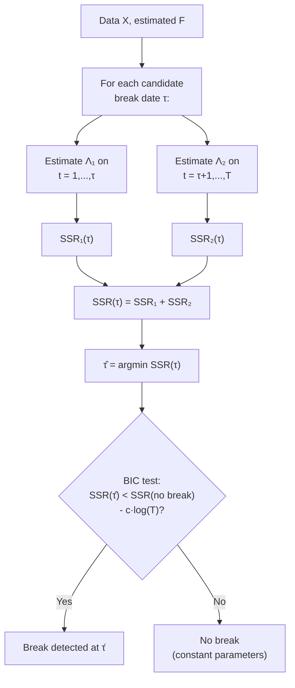
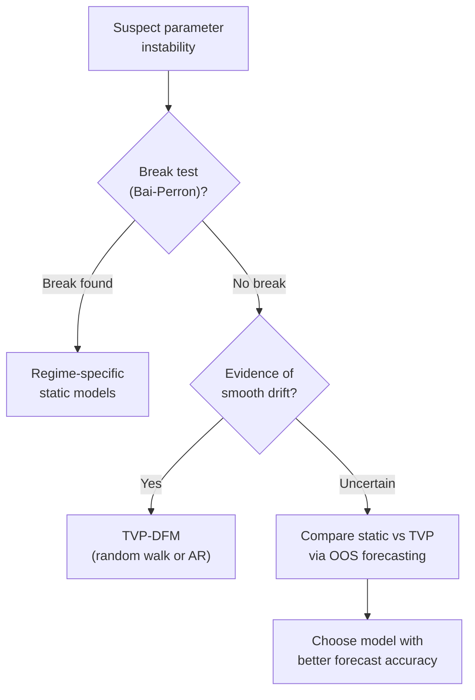
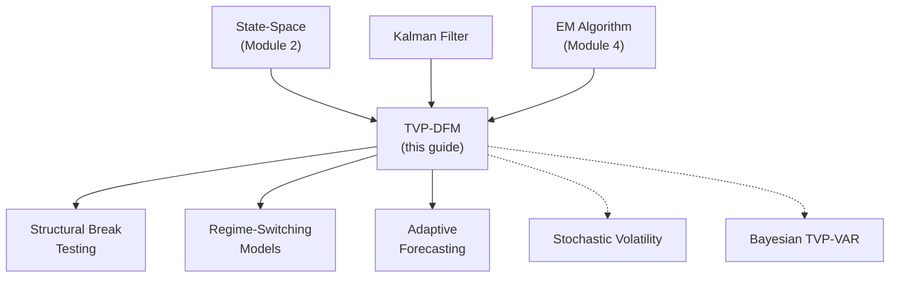

<!-- _class: lead -->

# Time-Varying Parameters in Dynamic Factor Models

## Module 8: Advanced Topics

**Key idea:** Economic structure evolves -- factor loadings and dynamics change with policy regimes, technological innovation, and structural transformations. TVP-DFMs allow parameters to drift smoothly or shift discretely.

<!-- Speaker notes: Welcome to Time-Varying Parameters in Dynamic Factor Models. This deck is part of Module 08 Advanced Topics. -->
---

# Why Parameters Change

> Static parameters assume stable economic relationships indefinitely. Reality shows the factor structure has changed substantially over decades.



<!-- Speaker notes: Use this diagram to illustrate the overall flow. Trace through each step with the audience. -->
---

<!-- _class: lead -->

# 1. Approaches to Time-Variation

<!-- Speaker notes: Welcome to 1. Approaches to Time-Variation. This deck is part of Module 08 Advanced Topics. -->
---

# Four TVP Specifications

| Approach | Evolution | Use When |
|----------|-----------|----------|
| **Regime Switching** | $\theta_t = \theta_{s_t}$, $s_t \in \{1,...,K\}$ | Discrete policy changes |
| **Random Walk** | $\theta_t = \theta_{t-1} + \nu_t$ | Smooth permanent drift |
| **Stationary AR(1)** | $\theta_t = (1-\rho)\bar{\theta} + \rho\theta_{t-1} + \nu_t$ | Mean-reverting fluctuation |
| **Score-Driven** | $\theta_t = \omega + As_{t-1} + B\theta_{t-1}$ | Adaptive, robust |



<!-- Speaker notes: Use this diagram to illustrate the overall flow. Trace through each step with the audience. -->
---

# Random Walk TVP-DFM

**Model:**
$$X_t = \Lambda_t F_t + e_t$$
$$F_t = \Phi F_{t-1} + \eta_t$$
$$\Lambda_t = \Lambda_{t-1} + \nu_t, \quad \nu_t \sim N(0, Q_\Lambda)$$

**$Q_\Lambda$ controls smoothness:**
- Large $Q_\Lambda$: loadings change rapidly (noisy)
- Small $Q_\Lambda$: loadings change slowly (smooth)
- $Q_\Lambda = 0$: constant parameters (static model)

**Score-Driven Alternative:**
$$\lambda_{i,t+1} = (1-b)\bar{\lambda}_i + a \cdot \underbrace{\frac{1}{\sigma_i^2}(X_{it} - \lambda_i'F_t)F_t}_{\text{scaled score}} + b \cdot \lambda_{i,t}$$

Parameters update based on how surprising recent data is. Outliers have bounded influence.

<!-- Speaker notes: Explain the notation carefully. Connect each term to its intuitive meaning before moving on. -->
---

<!-- _class: lead -->

# 2. Estimation Methods

<!-- Speaker notes: Welcome to 2. Estimation Methods. This deck is part of Module 08 Advanced Topics. -->
---

# Estimation Approaches Compared



| Method | Pros | Cons |
|--------|------|------|
| Rolling window | Simple, no assumptions | Discrete jumps, inefficient |
| Kalman TVP | Principled, smooth | High-dimensional, nonlinear |
| Score-driven | Fast, robust | Limited flexibility |

<!-- Speaker notes: Continue walking through the implementation. Highlight the key output and how to verify correctness. -->
---

# TVPDynamicFactorModel Class (Core)

```python
class TVPDynamicFactorModel:
    def __init__(self, n_factors, tvp_type='loading', Q_scale=0.01):
        self.n_factors = n_factors
        self.tvp_type = tvp_type
        self.Q_scale = Q_scale  # Controls smoothness

    def fit(self, X, n_iter=10):
        # Initialize with static PCA
        pca = PCA(n_components=r)
        self.Lambda_t = np.tile(pca.components_.T[:,:,None], (1,1,T))
        self.F_t = pca.fit_transform(X)
```

<!-- Speaker notes: Walk through the first part of this code implementation. The code continues on the next slide. -->
---

# TVPDynamicFactorModel Class (Core) (continued)

```python

        # EM loop with TVP
        for iteration in range(n_iter):
            # E-step: Kalman filter for factors
            self.F_t = self._kalman_filter_factors(X)
            # M-step: Update time-varying loadings
            self._update_tvp_loadings(X)
            # Update dynamics
            self.Phi = self._estimate_var_dynamics(self.F_t)
        return self
```

<!-- Speaker notes: Continue walking through the implementation. Highlight the key output and how to verify correctness. -->
---

<!-- _class: lead -->

# 3. Change-Point Detection

<!-- Speaker notes: Welcome to 3. Change-Point Detection. This deck is part of Module 08 Advanced Topics. -->
---

# Detecting Structural Breaks

**Alternative to smooth TVP:** Test for discrete breaks.



**Decision rule:** Test for breaks first. If rejected, use smooth TVP. If found, estimate regime-specific parameters.

<!-- Speaker notes: Use this diagram to illustrate the overall flow. Trace through each step with the audience. -->
---

# State-Space TVP Formulation

**Augmented state vector:**
$$\alpha_t = \begin{bmatrix} F_t \\ \text{vec}(\Lambda_t) \end{bmatrix}$$

**State evolution:**
$$\begin{bmatrix} F_t \\ \text{vec}(\Lambda_t) \end{bmatrix} = \begin{bmatrix} \Phi & 0 \\ 0 & I \end{bmatrix} \begin{bmatrix} F_{t-1} \\ \text{vec}(\Lambda_{t-1}) \end{bmatrix} + \begin{bmatrix} \eta_t \\ \nu_t \end{bmatrix}$$

**Observation equation:**
$$X_t = \Lambda_t F_t + e_t \quad \text{(NONLINEAR in augmented state!)}$$

**Challenge:** $\Lambda_t F_t$ is product of two state variables.

**Solutions:** Extended Kalman filter (linearize), particle filter (Monte Carlo), or alternating estimation (fix one, estimate other).

**Dimensionality:** $r + Nr$ state elements. Requires strong regularization (small $Q_\Lambda$), shrinkage priors, or sparsity constraints.

<!-- Speaker notes: Explain the notation carefully. Connect each term to its intuitive meaning before moving on. -->
---

<!-- _class: lead -->

# 4. Common Pitfalls

<!-- Speaker notes: Welcome to 4. Common Pitfalls. This deck is part of Module 08 Advanced Topics. -->
---

# Pitfalls to Avoid

| Pitfall | Problem | Solution |
|---------|---------|----------|
| Over-parameterization | Model chases noise, poor OOS | Start with subset of TVP, tune $Q$ via CV |
| Identification issues | Rotation ambiguity with TVP in both $\Lambda_t$ and $F_t$ | Impose normalization each period |
| Confusing breaks with smooth drift | Slow adaptation near break point | Test for breaks first, then decide TVP type |
| Ignoring parameter uncertainty | Underestimated forecast uncertainty | Include $P_{t|t}$ covariance in forecast distributions |



<!-- Speaker notes: Emphasize these common mistakes. Ask learners if they have encountered any of these in practice. -->
---

# Practice Problems

**Conceptual:**
1. Why might factor loadings change over time in macroeconomic data? Give three economic reasons.
2. Compare random walk TVP with mean-reverting TVP. When would you prefer each?
3. Explain why $X_t = \Lambda_t F_t + e_t$ is nonlinear when both $\Lambda_t$ and $F_t$ are states.

**Implementation:**
4. Modify TVPDynamicFactorModel to allow variable-specific $Q_\Lambda$ (heterogeneous smoothness).
5. Implement rolling window estimation and compare to Kalman filter approach on simulated data.
6. Create OOS forecast comparison: static DFM vs TVP-DFM.

**Extension:**
7. Derive Kalman filter update when $\Phi_t$ (not $\Lambda_t$) varies as random walk.
8. Research "forgetting factor" methods in recursive least squares and their relation to TVP.
9. Implement score-driven loading update and compare convergence to Kalman filter TVP.

<!-- Speaker notes: Give learners 3-5 minutes to work through these practice problems before discussing solutions. -->
---

# Connections & Summary



| Key Result | Detail |
|------------|--------|
| TVP-DFM | $X_t = \Lambda_t F_t + e_t$; loadings/dynamics evolve |
| Random walk | $\Lambda_t = \Lambda_{t-1} + \nu_t$; $Q$ controls smoothness |
| Score-driven | $\theta_{t+1} = \omega + As_t + B\theta_t$; adaptive, robust |
| Change-point | Bai-Perron test for discrete breaks in loadings |

**References:** Primiceri (2005), Koop & Korobilis (2014), Creal, Koopman & Lucas (2013), Bai, Han & Shi (2020)

<!-- Speaker notes: Summarize the key takeaways and highlight how this topic connects to upcoming material. -->