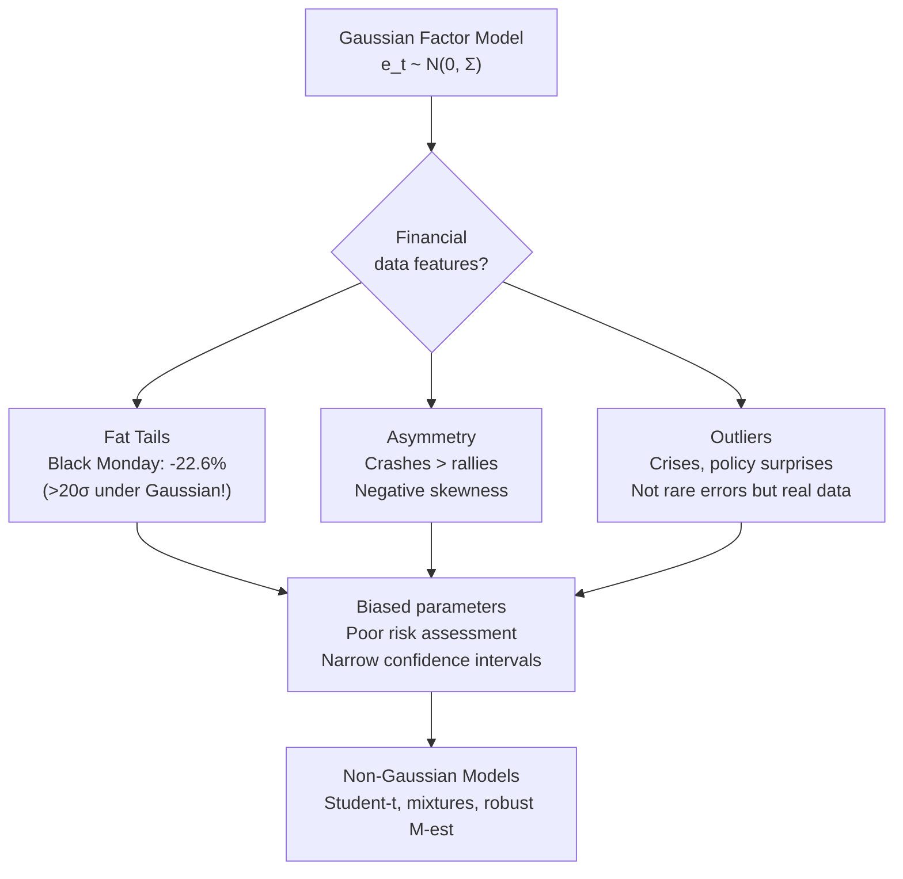
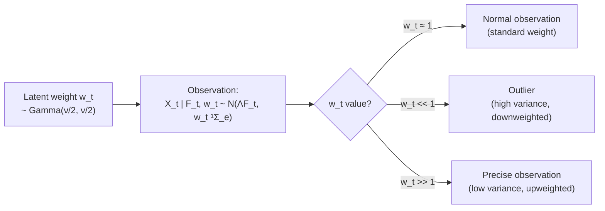
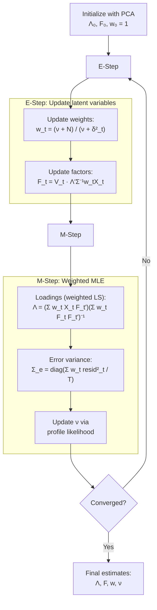
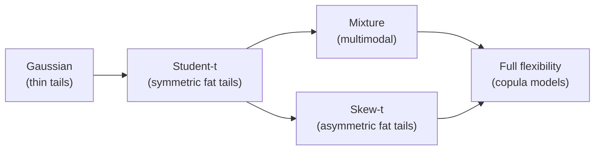
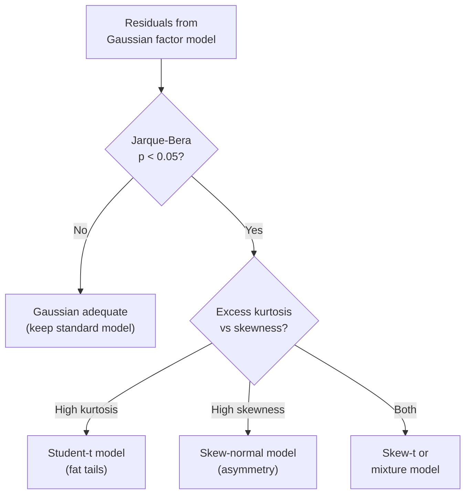
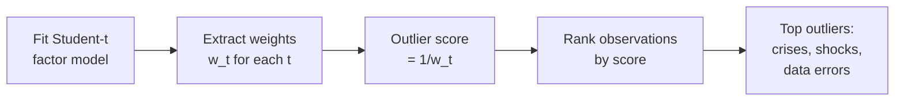
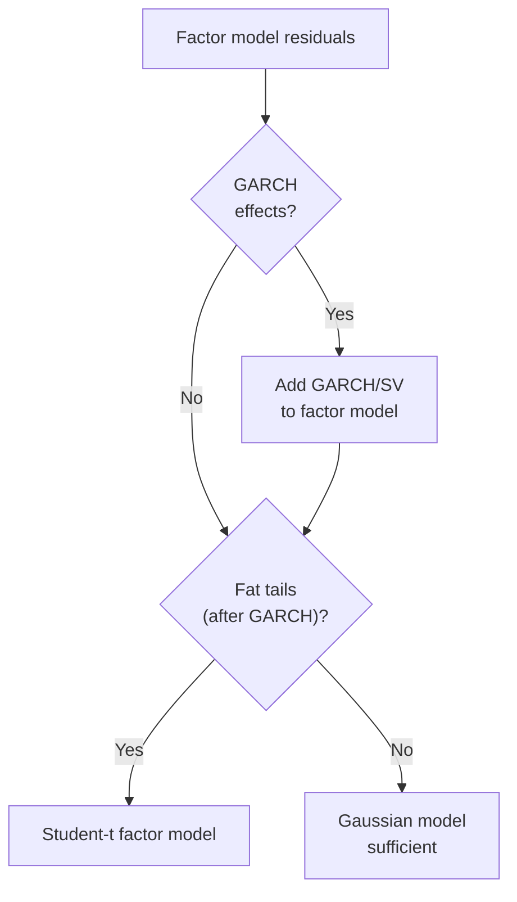
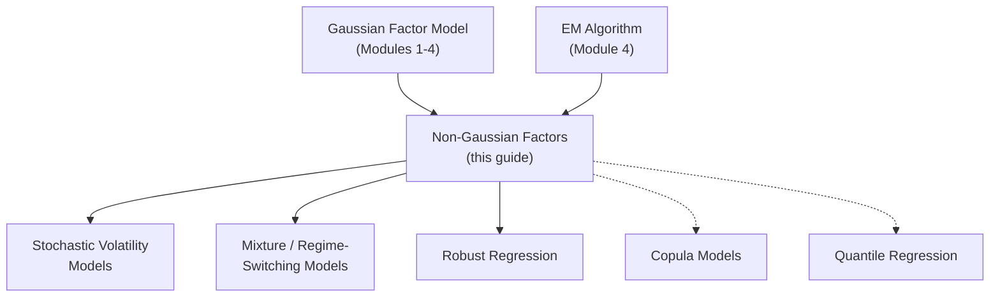

<!-- _class: lead -->

# Non-Gaussian Factor Models

## Module 8: Advanced Topics

**Key idea:** Financial data exhibit fat tails, asymmetry, and extreme outliers inconsistent with Gaussian assumptions. Student-t distributions with low degrees of freedom automatically downweight outliers, producing stable estimates via EM algorithms.

<!-- Speaker notes: Welcome to Non-Gaussian Factor Models. This deck is part of Module 08 Advanced Topics. -->
---

# Why Gaussian Fails for Financial Data

> A single outlier under Gaussian assumptions can distort all loadings. Non-Gaussian models provide automatic robustness.



<!-- Speaker notes: Use this diagram to illustrate the overall flow. Trace through each step with the audience. -->
---

<!-- _class: lead -->

# 1. Student-t Factor Model

<!-- Speaker notes: Welcome to 1. Student-t Factor Model. This deck is part of Module 08 Advanced Topics. -->
---

# Student-t Distribution

**PDF:**
$$f(x; \nu, \mu, \sigma^2) = \frac{\Gamma((\nu+1)/2)}{\Gamma(\nu/2)\sqrt{\nu \pi \sigma^2}} \left(1 + \frac{(x-\mu)^2}{\nu \sigma^2}\right)^{-(\nu+1)/2}$$

**Degrees of freedom $\nu$ controls tail thickness:**

| $\nu$ | Behavior | Kurtosis |
|:------:|----------|:--------:|
| $\nu \to \infty$ | Approaches Gaussian | 3 |
| $\nu = 10$ | Mild fat tails | 4 |
| $\nu = 5$ | Moderate fat tails | 9 |
| $\nu = 3$ | Heavy tails (infinite 4th moment) | $\infty$ |
| $\nu = 1$ | Cauchy (no mean!) | $\infty$ |

**Financial data typically:** $\nu \in [4, 10]$.

**Kurtosis formula:** $\kappa = 3 + \frac{6}{\nu - 4}$ for $\nu > 4$.

<!-- Speaker notes: Explain the notation carefully. Connect each term to its intuitive meaning before moving on. -->
---

# Scale Mixture Representation

**Key insight:** Student-t is a Gaussian scale mixture.

$$X_t | F_t, w_t \sim N(\Lambda F_t, w_t^{-1} \Sigma_e)$$
$$w_t \sim \text{Gamma}(\nu/2, \nu/2)$$



**EM algorithm treats $w_t$ as missing data:**
- E-step: $E[w_t | X_t] = \frac{\nu + N}{\nu + \delta_t^2}$
- Large Mahalanobis distance $\delta_t^2$ (outlier) $\Rightarrow$ small $w_t$ $\Rightarrow$ automatic downweighting

<!-- Speaker notes: Use this diagram to illustrate the overall flow. Trace through each step with the audience. -->
---

# EM Algorithm for Student-t Factors



**Key property:** M-step is weighted least squares. Outliers get small weights automatically.

<!-- Speaker notes: Continue walking through the implementation. Highlight the key output and how to verify correctness. -->
---

# StudentTFactorModel Class (Core)

```python
class StudentTFactorModel:
    def __init__(self, n_factors, df_init=5):
        self.n_factors = n_factors
        self.df = df_init

    def fit(self, X, n_iter=50, update_df=True):
        # Initialize with PCA
        pca = PCA(n_components=self.n_factors)
        self.F = pca.fit_transform(X)
        self.Lambda = pca.components_.T
        self.weights = np.ones(T)
```

<!-- Speaker notes: Walk through the first part of this code implementation. The code continues on the next slide. -->
---

# StudentTFactorModel Class (Core) (continued)

```python

        for iteration in range(n_iter):
            self._e_step(X)   # Update w_t and F_t
            self._m_step(X)   # Update Lambda, Sigma_e (weighted)
            if update_df:
                self._update_df()  # Estimate nu
        return self

    def _e_step(self, X):
        for t in range(T):
            delta_sq = (X[t] - self.Lambda @ self.F[t]) @ inv(Sigma_e) @ ...
            self.weights[t] = (self.df + N) / (self.df + delta_sq)

    def get_outlier_scores(self):
        return 1 / self.weights  # Low weight = outlier
```

<!-- Speaker notes: Continue walking through the implementation. Highlight the key output and how to verify correctness. -->
---

<!-- _class: lead -->

# 2. Alternative Heavy-Tailed Specifications

<!-- Speaker notes: Welcome to 2. Alternative Heavy-Tailed Specifications. This deck is part of Module 08 Advanced Topics. -->
---

# Beyond Student-t

<div class="columns">
<div>

**Mixture of Gaussians:**
$$X_t | z_t=k \sim N(\Lambda F_t, \Sigma_{e,k})$$
$$P(z_t = k) = \pi_k$$

- $K=2$: "normal" vs "crisis" periods
- Captures multimodality
- EM via posterior component probabilities

**Skew-Normal:**
$$X_t | F_t \sim \text{SN}(\Lambda F_t, \Sigma_e, \alpha)$$

- Captures negative skewness in returns
- Asymmetric responses to shocks

</div>
<div>

**Huber M-Estimation:**
$$\min_{\Lambda, F} \sum_{i,t} \rho\left(\frac{X_{it} - \lambda_i' F_t}{\sigma_i}\right)$$

$$\rho(u) = \begin{cases}
\frac{1}{2} u^2 & |u| \leq k \\
k|u| - \frac{1}{2}k^2 & |u| > k
\end{cases}$$

- Quadratic for small residuals (efficient)
- Linear for large residuals (bounded influence)
- Threshold $k$ controls robustness

</div>
</div>



<!-- Speaker notes: Use this diagram to illustrate the overall flow. Trace through each step with the audience. -->
---

<!-- _class: lead -->

# 3. Detecting Non-Gaussianity

<!-- Speaker notes: Welcome to 3. Detecting Non-Gaussianity. This deck is part of Module 08 Advanced Topics. -->
---

# Diagnostic Tests

**Test battery for each variable and residual:**

| Test | Null Hypothesis | What It Detects |
|------|----------------|-----------------|
| Jarque-Bera | $H_0$: skew = 0, kurtosis = 3 | Any departure from normality |
| Shapiro-Wilk | $H_0$: data is Gaussian | General non-normality |
| Kolmogorov-Smirnov | $H_0$: matches fitted distribution | Distribution mismatch |
| Likelihood Ratio | $H_0$: Gaussian vs Student-t | Heavy tails specifically |



<!-- Speaker notes: Use this diagram to illustrate the overall flow. Trace through each step with the audience. -->
---

# Outlier Detection via Weights

**Student-t model provides automatic outlier identification:**



**Interpretation:**
- $w_t \approx 1$: Normal observation (Gaussian-like)
- $w_t \ll 1$: Outlier (downweighted in estimation)
- $w_t \gg 1$: Unusually precise observation

**Comparison: Gaussian vs Student-t estimates:**
- Gaussian PCA: Outliers pull loadings toward extreme observations
- Student-t: Outliers downweighted, loadings reflect bulk of data

<!-- Speaker notes: Use this diagram to illustrate the overall flow. Trace through each step with the audience. -->
---

<!-- _class: lead -->

# 4. Common Pitfalls

<!-- Speaker notes: Welcome to 4. Common Pitfalls. This deck is part of Module 08 Advanced Topics. -->
---

# Pitfalls to Avoid

| Pitfall | Problem | Solution |
|---------|---------|----------|
| Over-estimating tail thickness | Model too conservative, poor fit to bulk | Check df estimate; consider mixtures |
| Ignoring parameter uncertainty | Understate forecast uncertainty | Bootstrap or Bayesian methods |
| Confusing fat tails with heteroskedasticity | Spurious heavy tails from GARCH effects | Test for GARCH first; combine t + SV |
| Assuming Student-t always better | Added complexity without improvement | Compare OOS forecasts, cross-validate |



<!-- Speaker notes: Emphasize these common mistakes. Ask learners if they have encountered any of these in practice. -->
---

# Practice Problems

**Conceptual:**
1. Explain why Student-t with low df automatically downweights outliers in EM algorithm.
2. How does kurtosis relate to degrees of freedom? What df gives kurtosis of 6?
3. Compare Student-t factors vs Student-t idiosyncratic errors for robust loading estimation.

**Implementation:**
4. Extend StudentTFactorModel for different df per variable (heterogeneous tail thickness).
5. Implement a two-component Gaussian mixture factor model and compare to Student-t.
6. Create diagnostic plots: QQ-plot of standardized residuals, histogram with fitted Student-t overlay.

**Extension:**
7. Derive posterior $p(w_t | X_t, F_t, \nu)$ for precision weight in Student-t mixture representation.
8. Research multivariate Student-t. How does it differ from univariate t applied to each dimension?
9. Implement Huber M-estimator for factor loadings and compare convergence to EM Student-t.

<!-- Speaker notes: Give learners 3-5 minutes to work through these practice problems before discussing solutions. -->
---

# Connections & Summary



| Key Result | Detail |
|------------|--------|
| Student-t model | $X_t | F_t, w_t \sim N(\Lambda F_t, w_t^{-1}\Sigma_e)$; $w_t \sim \text{Gamma}(\nu/2, \nu/2)$ |
| EM weights | $E[w_t] = (\nu+N)/(\nu+\delta_t^2)$; outliers get small weights |
| M-step | Weighted least squares for $\Lambda$; automatic robustness |
| df estimation | Profile likelihood; typical financial data: $\nu \in [4, 10]$ |

**References:** Lange, Little & Taylor (1989), Zhou, Liu & Huang (2009), Lucas, Koopman & Klaassen (2006), Oh & Patton (2017)

<!-- Speaker notes: Summarize the key takeaways and highlight how this topic connects to upcoming material. -->