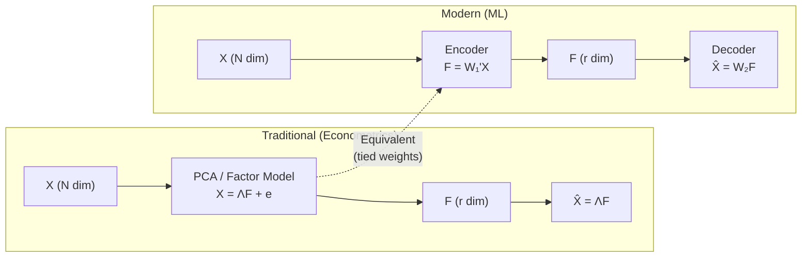
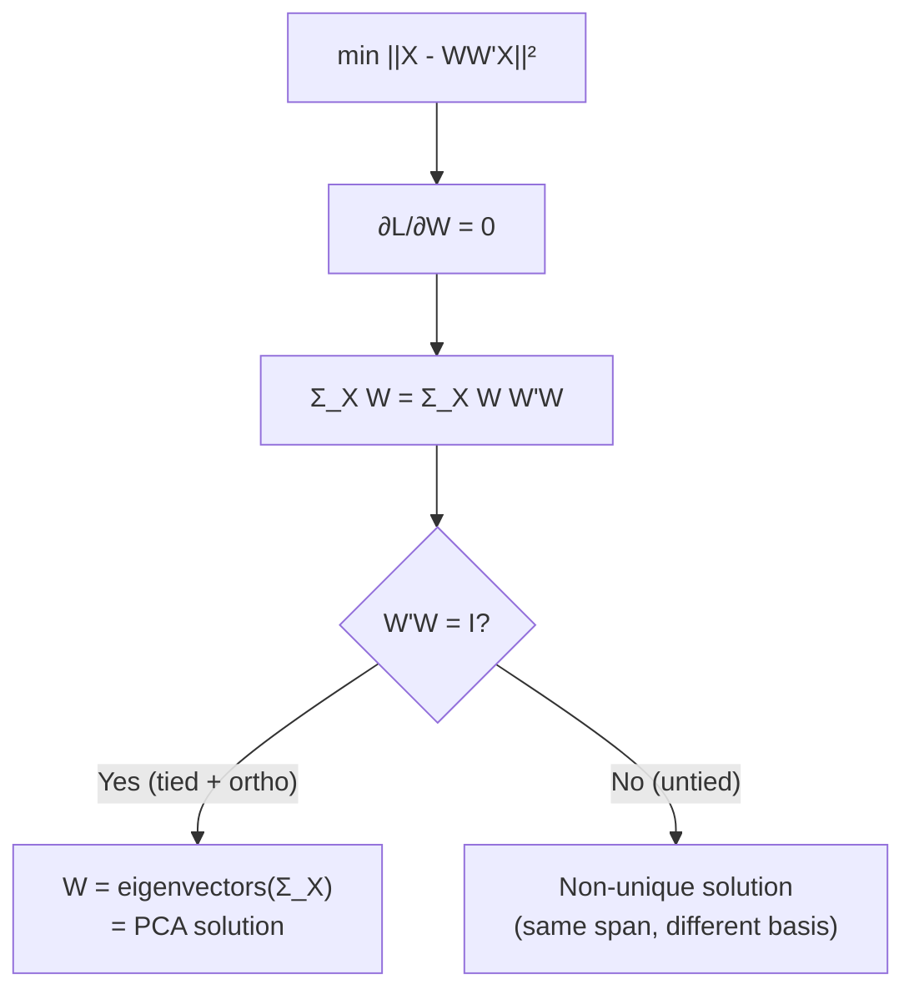
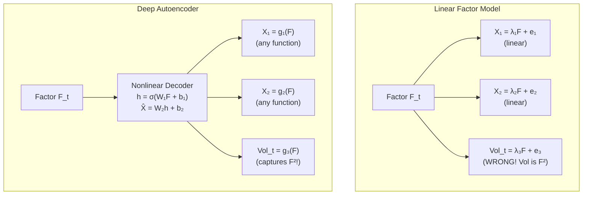
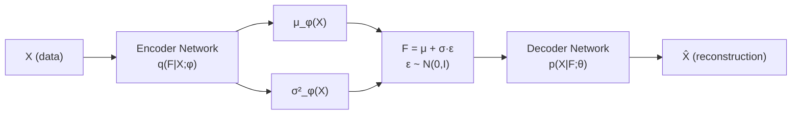
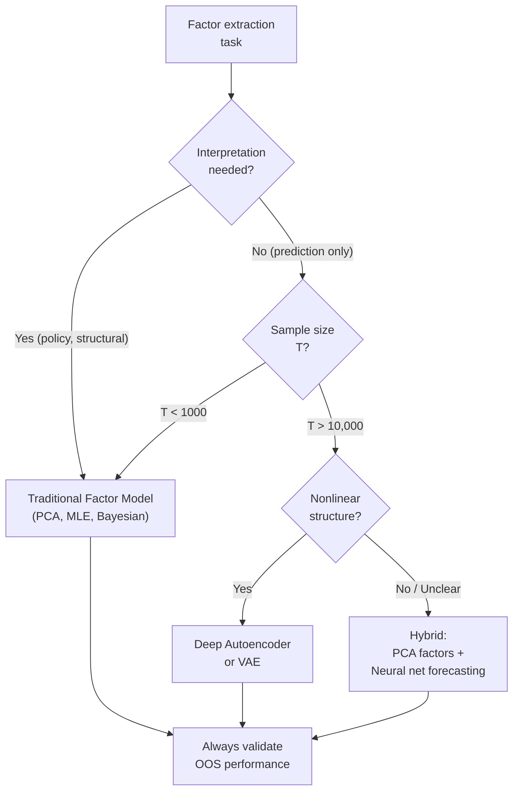
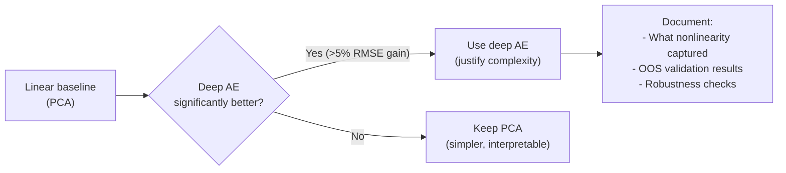
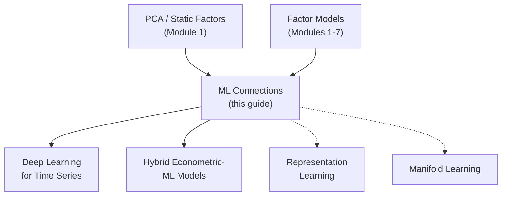

<!-- _class: lead -->

# Machine Learning Connections to Factor Models

## Module 8: Advanced Topics

**Key idea:** Linear autoencoders with tied weights are mathematically equivalent to PCA. Deep neural networks generalize this to nonlinear factor structures, while variational autoencoders add probabilistic interpretations.

<!-- Speaker notes: Welcome to Machine Learning Connections to Factor Models. This deck is part of Module 08 Advanced Topics. -->
---

# The Fundamental Connection

> Factor models and neural networks solve the same problem: find low-dimensional structure in high-dimensional data.



**Trade-off:** Traditional methods provide statistical theory (SEs, tests, interpretability). ML relaxes linearity but sacrifices interpretability.

<!-- Speaker notes: Summarize the key takeaways and highlight how this topic connects to upcoming material. -->
---

<!-- _class: lead -->

# 1. Linear Autoencoders = PCA

<!-- Speaker notes: Welcome to 1. Linear Autoencoders = PCA. This deck is part of Module 08 Advanced Topics. -->
---

# Mathematical Equivalence

**Linear Autoencoder (tied weights):**
$$\text{Encoder: } F_t = W^T X_t, \quad \text{Decoder: } \hat{X}_t = W F_t$$
$$\min_W \sum_t \|X_t - W W^T X_t\|^2$$

**PCA:**
$$\min_{\Lambda, F} \sum_t \|X_t - \Lambda F_t\|^2 \quad \text{s.t. } \Lambda^T\Lambda = I$$

**Theorem:** With tied weights ($W_2 = W_1$) and orthogonality on $W_1$, these are equivalent. Columns of $W$ are eigenvectors of $\Sigma_X$.



<!-- Speaker notes: Use this diagram to illustrate the overall flow. Trace through each step with the audience. -->
---

# Key Differences Without Constraints

| Feature | PCA | Linear AE (unconstrained) |
|---------|-----|---------------------------|
| Weight constraint | $W^TW = I$ | None |
| Encoder/decoder | Tied ($W_2 = W_1$) | Separate |
| Solution | Unique (up to rotation) | Non-unique |
| Interpretation | Variance maximization | Reconstruction minimization |
| Theory | Complete (SEs, tests) | Limited |

```python
class LinearAutoencoder(nn.Module):
    def __init__(self, n_input, n_latent, tied_weights=True):
        super().__init__()
        self.encoder = nn.Linear(n_input, n_latent, bias=False)
        self.tied_weights = tied_weights
        if not tied_weights:
            self.decoder = nn.Linear(n_latent, n_input, bias=False)

    def forward(self, x):
        latent = self.encoder(x)
        if self.tied_weights:
            reconstructed = torch.matmul(latent, self.encoder.weight)
        else:
            reconstructed = self.decoder(latent)
        return reconstructed, latent
```

<!-- Speaker notes: Walk through this code step by step. Highlight the key lines and explain the output. -->
---

<!-- _class: lead -->

# 2. Deep Autoencoders: Nonlinear Factors

<!-- Speaker notes: Welcome to 2. Deep Autoencoders: Nonlinear Factors. This deck is part of Module 08 Advanced Topics. -->
---

# Why Nonlinearity Matters

**Linear limitation:** $X_t = \Lambda F_t + e_t$ assumes linear combinations.

**Nonlinear reality in finance:**
- Volatility is quadratic in returns: $\text{Vol}_t \propto F_t^2$
- Regime-dependent relationships
- Interaction effects and thresholds



<!-- Speaker notes: Use this diagram to illustrate the overall flow. Trace through each step with the audience. -->
---

# Deep Autoencoder Architecture

**Encoder:** $X \xrightarrow{W_1,\sigma} h_1 \xrightarrow{W_2,\sigma} h_2 \xrightarrow{W_3} F$ (bottleneck)

**Decoder:** $F \xrightarrow{W_4,\sigma} h_3 \xrightarrow{W_5,\sigma} h_4 \xrightarrow{W_6} \hat{X}$

```python
class DeepAutoencoder(nn.Module):
    def __init__(self, n_input, n_latent, hidden_dims=[64, 32]):
        super().__init__()
        # Encoder: X -> h1 -> h2 -> F
        encoder_layers = []
        prev_dim = n_input
        for h_dim in hidden_dims:
            encoder_layers += [nn.Linear(prev_dim, h_dim),
```

<!-- Speaker notes: Walk through the first part of this code implementation. The code continues on the next slide. -->
---

# Deep Autoencoder Architecture (continued)

```python
                               nn.ReLU(), nn.BatchNorm1d(h_dim),
                               nn.Dropout(0.2)]
            prev_dim = h_dim
        encoder_layers.append(nn.Linear(prev_dim, n_latent))
        self.encoder = nn.Sequential(*encoder_layers)

        # Decoder: F -> h3 -> h4 -> X_hat (mirror architecture)
        # ... (symmetric to encoder)
```

**Objective:** $\min \sum_t \|X_t - \hat{X}_t\|^2 + \lambda R(W)$ with regularization.

<!-- Speaker notes: Continue walking through the implementation. Highlight the key output and how to verify correctness. -->
---

<!-- _class: lead -->

# 3. Variational Autoencoders (VAE)

<!-- Speaker notes: Welcome to 3. Variational Autoencoders (VAE). This deck is part of Module 08 Advanced Topics. -->
---

# Probabilistic Factor Interpretation

**Traditional factor model (probabilistic):**
$$p(X | F, \Lambda, \Sigma) = N(X; \Lambda F, \Sigma), \quad p(F) = N(0, I)$$

**VAE generalizes with neural networks:**
$$p(X | F; \theta) = N(X; \mu_\theta(F), \Sigma_\theta(F))$$
$$q(F | X; \phi) = N(F; \mu_\phi(X), \Sigma_\phi(X))$$



**ELBO objective:**
$$\log p(X) \geq \underbrace{E_q[\log p(X|F)]}_{\text{Reconstruction}} - \underbrace{D_{KL}(q(F|X) \| p(F))}_{\text{Regularization}}$$

<!-- Speaker notes: Use this diagram to illustrate the overall flow. Trace through each step with the audience. -->
---

# VAE Benefits for Factor Analysis

**Compared to standard autoencoder:**

| Feature | Standard AE | VAE |
|---------|:----------:|:---:|
| Uncertainty quantification | No | Yes ($\sigma^2_\phi(X)$) |
| Regularization | Manual (dropout, L2) | Built-in (KL term) |
| Generative capability | No | Yes (sample from $p(F)$) |
| Overfitting resistance | Moderate | Good |
| Latent space structure | Arbitrary | Smooth (regularized) |

```python
class VariationalAutoencoder(nn.Module):
    def loss_function(self, x_reconstructed, x, mu, log_var):
        # Reconstruction: how well do we rebuild X?
        recon_loss = F.mse_loss(x_reconstructed, x, reduction='sum')
        # KL divergence: how close is q(F|X) to N(0,I)?
        kl_loss = -0.5 * torch.sum(1 + log_var - mu**2 - log_var.exp())
        return recon_loss + kl_loss
```

<!-- Speaker notes: Walk through this code step by step. Highlight the key lines and explain the output. -->
---

<!-- _class: lead -->

# 4. When to Use ML vs Traditional Methods

<!-- Speaker notes: Welcome to 4. When to Use ML vs Traditional Methods. This deck is part of Module 08 Advanced Topics. -->
---

# Decision Framework



<!-- Speaker notes: Use this diagram to illustrate the overall flow. Trace through each step with the audience. -->
---

# Comparison Table

| Criterion | Traditional FM | Neural Net AE |
|-----------|:--------------:|:-------------:|
| Linearity | Assumes linear | Can capture nonlinearity |
| Interpretability | High | Low (black box) |
| Statistical theory | Complete (SEs, tests) | Limited/none |
| Sample needs | Moderate ($T > N$) | Large ($T \gg N$) |
| Computation | Low (closed form) | High (iterative) |
| Overfitting risk | Low | High (needs regularization) |
| OOS performance | Generally good | Can be poor without care |

**Hybrid approaches often best:**
1. PCA + Neural net prediction
2. Economic constraints in neural nets (monotonicity, sparsity)
3. Ensemble: average forecasts from both
4. Neural net screening + interpretable model on subset

<!-- Speaker notes: Walk through the key rows of this comparison table. Highlight the most important distinctions. -->
---

<!-- _class: lead -->

# 5. Common Pitfalls

<!-- Speaker notes: Welcome to 5. Common Pitfalls. This deck is part of Module 08 Advanced Topics. -->
---

# Pitfalls to Avoid

| Pitfall | Problem | Solution |
|---------|---------|----------|
| Overfitting deep AE on small T | Perfect in-sample, poor OOS | Regularization, early stopping, simpler architecture |
| Ignoring temporal dependence | Overstated accuracy, data snooping | Time-series CV, respect ordering |
| Equating reconstruction with prediction | Overfitting to in-sample | Evaluate on OOS forecasting task |
| Sacrificing interpretability for marginal gains | Lost insights, no performance gain | Always compare to linear baseline |



<!-- Speaker notes: Emphasize these common mistakes. Ask learners if they have encountered any of these in practice. -->
---

# Practice Problems

**Conceptual:**
1. Prove linear autoencoder with tied weights and orthonormal encoder = PCA.
2. Explain why VAE's KL divergence acts as regularization. What happens without it?
3. When would nonlinear factors be essential for macroeconomic forecasting?

**Implementation:**
4. Implement a "denoising autoencoder" that adds noise to inputs during training.
5. Create hybrid: PCA factors as inputs to neural network forecasting model.
6. Extend VAE to predict $X_{t+1}$ given latent factors $F_t$.

**Extension:**
7. Research "disentangled representations" in VAE. How could this improve factor interpretability?
8. Implement attention mechanism in autoencoder to identify which variables contribute to each factor.
9. Compare computational cost: PCA vs linear AE (SGD) vs deep AE. Plot time vs $(T, N)$.

<!-- Speaker notes: Give learners 3-5 minutes to work through these practice problems before discussing solutions. -->
---

# Connections & Summary



| Key Result | Detail |
|------------|--------|
| PCA = Linear AE | Tied weights + orthogonality $\Rightarrow$ eigenvector solution |
| Deep AE | Nonlinear encoder/decoder; captures $X = g(F) + e$ |
| VAE | Probabilistic; ELBO = reconstruction - KL divergence |
| Decision | Traditional for interpretation/theory; ML for prediction with big data |

**Course Complete:** Static factors $\to$ dynamic factors $\to$ sparse methods $\to$ mixed-frequency $\to$ advanced topics (TVP, non-Gaussian, ML connections).

**References:** Goodfellow, Bengio & Courville (2016), Kingma & Welling (2014), Gu, Kelly & Xiu (2020), Chen, Pelger & Zhu (2023)

<!-- Speaker notes: Summarize the key takeaways and highlight how this topic connects to upcoming material. -->