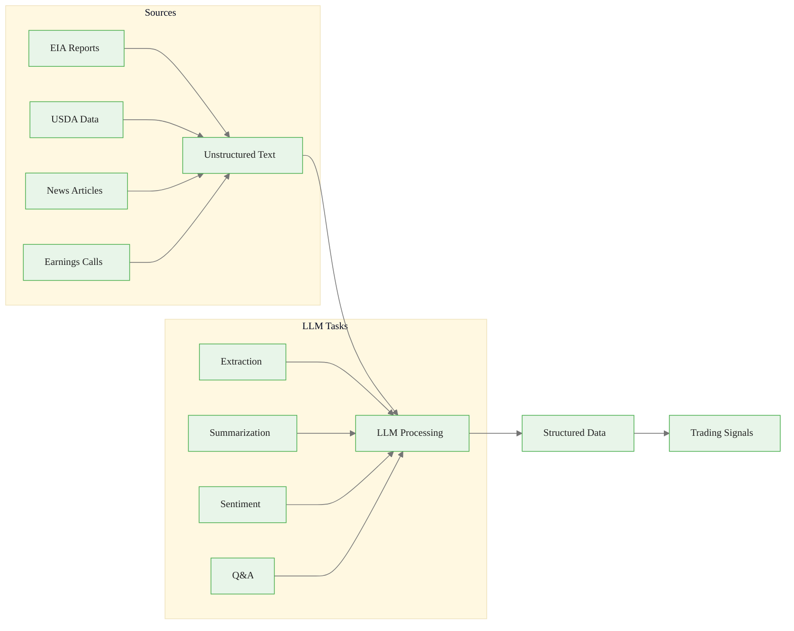
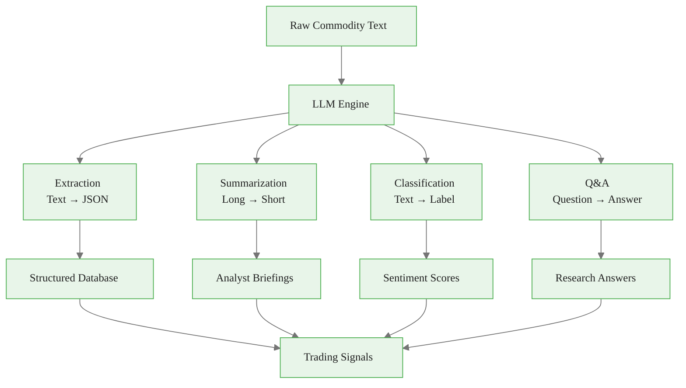
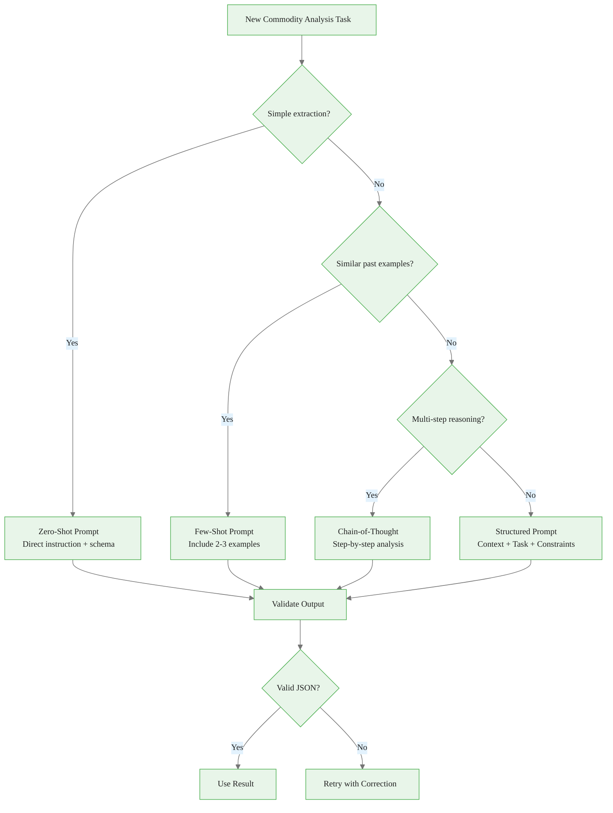
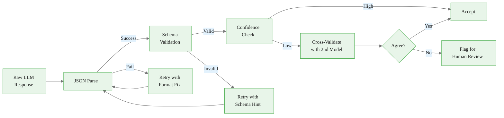
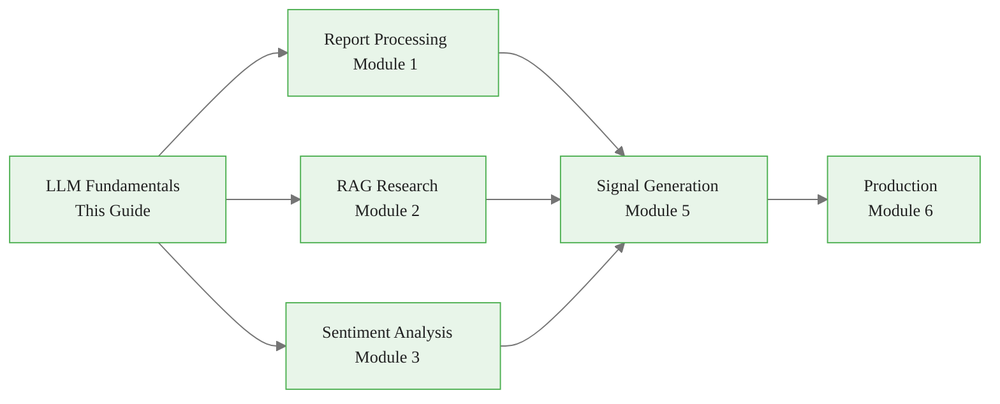

<!-- _class: lead -->

# LLM Fundamentals for Commodities

**Module 0: Foundations**

Applying Large Language Models to commodity market analysis

<!-- Speaker notes: Section transition. Briefly preview what this section covers before diving into details. -->

---

## Why LLMs for Commodities?

### The Unstructured Data Challenge

Commodity markets generate vast amounts of text:

- Government reports (EIA, USDA, IEA)
- Earnings call transcripts
- News articles and press releases
- Analyst reports
- Social media and forums
- Weather reports and forecasts

<!-- Speaker notes: Present the key concepts on this slide. Pause for questions before moving to the next topic. -->

---

## Traditional NLP vs. LLMs

<div class="columns">
<div>

### Traditional NLP Required
- Custom parsers for each document type
- Extensive labeled training data
- Brittle rule-based systems

</div>
<div>

### LLMs Provide
- Zero-shot extraction capabilities
- Flexible schema adaptation
- Reasoning about context

</div>
</div>

<!-- Speaker notes: Present the key concepts on this slide. Pause for questions before moving to the next topic. -->

---

## LLM Commodity Data Pipeline



<div class="callout-key">

Key implementation detail -- study this pattern carefully.

</div>

<!-- Speaker notes: Walk through the diagram step by step. Highlight the key decision points and data flow. -->

---

<!-- _class: lead -->

# Core LLM Capabilities

Four key capabilities for commodity analysis

<!-- Speaker notes: Section transition. Briefly preview what this section covers before diving into details. -->

---

## Capability 1: Information Extraction

Convert unstructured text to structured data:

```python
from anthropic import Anthropic

client = Anthropic()

eia_text = """
U.S. commercial crude oil inventories decreased by 5.2 million barrels
from the previous week. At 430.0 million barrels, U.S. crude oil
inventories are about 3% below the five year average for this time of year.
"""
```

<div class="callout-insight">

This pattern recurs throughout the course. Understanding it deeply pays dividends later.

</div>

<!-- Speaker notes: Walk through the code, emphasizing the key patterns. Highlight which parts learners should customize for their own use cases. -->

---

<!-- Speaker notes: Cover the key points about Information Extraction (continued). Emphasize practical implications and connect to previous material. -->

## Information Extraction (continued)

```python
response = client.messages.create(
    model="claude-sonnet-4-20250514",
    max_tokens=1024,
    messages=[{
        "role": "user",
        "content": f"""Extract structured data from this EIA report excerpt:

{eia_text}
```

<div class="callout-warning">

Watch for edge cases with this implementation in production use.

</div>

---

```python

Return JSON with fields:
- metric_name
- current_value
- change_value
- change_unit
- comparison_to_average
"""
    }]
)

print(response.content[0].text)

```

<div class="callout-info">

This approach follows established best practices in the field.

</div>

<!-- Speaker notes: Walk through the code, emphasizing the key patterns. Highlight which parts learners should customize for their own use cases. -->

---

<!-- Speaker notes: Cover the key points about Capability 2: Summarization. Emphasize practical implications and connect to previous material. -->

## Capability 2: Summarization

Condense lengthy reports:

```python
def summarize_report(report_text, focus_areas=None):
    """Summarize commodity report with optional focus areas."""
    focus_instruction = ""
    if focus_areas:
        focus_instruction = (
            f"\nFocus particularly on: {', '.join(focus_areas)}"
        )
```

---

```python

    response = client.messages.create(
        model="claude-sonnet-4-20250514",
        max_tokens=1024,
        messages=[{
            "role": "user",
            "content": f"""Summarize this commodity market report
in 3-5 bullet points. Include key figures and directional
changes.{focus_instruction}

Report:
{report_text}"""
        }]
    )
    return response.content[0].text

```

<!-- Speaker notes: Walk through the code, emphasizing the key patterns. Highlight which parts learners should customize for their own use cases. -->

---

## Summarization Usage

```python
summary = summarize_report(
    long_wasde_report,
    focus_areas=["corn production", "ending stocks", "exports"]
)
```

> Focus areas let you guide the LLM toward the most relevant information for your analysis.

<!-- Speaker notes: Walk through the code, emphasizing the key patterns. Highlight which parts learners should customize for their own use cases. -->

---

<!-- Speaker notes: Cover the key points about Capability 3: Classification and Sentiment. Emphasize practical implications and connect to previous material. -->

## Capability 3: Classification and Sentiment

```python
def classify_commodity_sentiment(headline):
    """
    Classify commodity news headline sentiment.
    Returns: bullish, bearish, or neutral with confidence.
    """
    response = client.messages.create(
        model="claude-sonnet-4-20250514",
        max_tokens=256,
        messages=[{
            "role": "user",
            "content": f"""Classify this commodity news headline:

"{headline}"
```

---

```python

Return JSON:
{{
  "commodity": "<identified commodity>",
  "sentiment": "bullish|bearish|neutral",
  "confidence": <0-1>,
  "reasoning": "<brief explanation>"
}}"""
        }]
    )
    return response.content[0].text

```

<!-- Speaker notes: Walk through the code, emphasizing the key patterns. Highlight which parts learners should customize for their own use cases. -->

---

## Sentiment Classification Examples

```python
headlines = [
    "OPEC+ agrees to extend production cuts through Q2",
    "Brazil soybean harvest reaches record levels",
    "LNG exports remain steady amid mild winter demand"
]

for h in headlines:
    print(classify_commodity_sentiment(h))
```

| Headline | Expected Sentiment |
|----------|-------------------|
| OPEC+ production cuts | Bullish (oil) |
| Record Brazil soy harvest | Bearish (soybeans) |
| Steady LNG exports | Neutral (natural gas) |

<!-- Speaker notes: Walk through the code, emphasizing the key patterns. Highlight which parts learners should customize for their own use cases. -->

---

## Capability 4: Question Answering

Query documents directly:

```python
def query_report(report_text, question):
    """Answer questions about commodity reports."""
    response = client.messages.create(
        model="claude-sonnet-4-20250514",
        max_tokens=512,
        messages=[{
            "role": "user",
            "content": f"""Based on this report, answer the
following question. If the information is not in the report,
say "Not found in report."

Report:
{report_text}

Question: {question}"""
        }]
    )
    return response.content[0].text
```

<!-- Speaker notes: Walk through the code, emphasizing the key patterns. Highlight which parts learners should customize for their own use cases. -->

---

## Four Capabilities Overview



<!-- Speaker notes: Walk through the diagram step by step. Highlight the key decision points and data flow. -->

---

<!-- _class: lead -->

# Prompt Engineering for Commodities

Techniques for reliable LLM outputs

<!-- Speaker notes: Section transition. Briefly preview what this section covers before diving into details. -->

---

## Structured Output Prompts

Always request structured formats:

```python
EXTRACTION_PROMPT = """
Extract supply/demand data from this text.

Return a JSON object with this exact structure:
{
  "commodity": string,
  "region": string,
  "metric": "production" | "consumption" | "imports"
            | "exports" | "stocks",
  "value": number,
  "unit": string,
  "period": string,
  "year_over_year_change": number | null,
  "source": string
}

Text: {text}
"""
```

<!-- Speaker notes: Walk through the code, emphasizing the key patterns. Highlight which parts learners should customize for their own use cases. -->

---

## Few-Shot Examples

Provide examples for complex extractions:

```python
FEW_SHOT_PROMPT = """
Extract price forecasts from analyst commentary.

Example 1:
Input: "We expect WTI to average $75/bbl in Q1 2024,
        rising to $80 by year-end"
Output: {
  "commodity": "WTI Crude",
  "forecasts": [
    {"period": "Q1 2024", "value": 75, "unit": "USD/bbl"},
    {"period": "Q4 2024", "value": 80, "unit": "USD/bbl"}
  ]
}
```

<!-- Speaker notes: Walk through the code, emphasizing the key patterns. Highlight which parts learners should customize for their own use cases. -->

---

## Few-Shot Examples (continued)

```python
Example 2:
Input: "Natural gas prices may test $3.50/MMBtu support
        before recovering"
Output: {
  "commodity": "Natural Gas",
  "forecasts": [
    {"period": "near-term", "value": 3.50,
     "unit": "USD/MMBtu", "direction": "support"}
  ]
}

Now extract from:
{text}
"""
```

> Few-shot examples dramatically improve extraction accuracy for domain-specific content.

<!-- Speaker notes: Walk through the code, emphasizing the key patterns. Highlight which parts learners should customize for their own use cases. -->

---

## Chain of Thought Prompting

For complex reasoning:

```python
REASONING_PROMPT = """
Analyze this supply/demand data and determine the likely
price impact.

Data: {data}

Think through this step by step:
1. Identify the key supply factors
2. Identify the key demand factors
3. Calculate the implied balance change
4. Consider seasonal patterns
5. Determine net price impact

Provide your analysis followed by a conclusion with:
- Direction: bullish/bearish/neutral
- Magnitude: strong/moderate/weak
- Timeframe: immediate/near-term/medium-term
"""
```

<!-- Speaker notes: Walk through the code, emphasizing the key patterns. Highlight which parts learners should customize for their own use cases. -->

---

## Prompt Strategy Decision Flow



<!-- Speaker notes: Walk through the diagram step by step. Highlight the key decision points and data flow. -->

---

<!-- _class: lead -->

# Token Efficiency

Managing costs at scale

<!-- Speaker notes: Section transition. Briefly preview what this section covers before diving into details. -->

---

## Cost Considerations

API costs accumulate quickly with long documents:

| Model | Input Cost | Output Cost |
|-------|------------|-------------|
| Claude 3.5 Sonnet | $3/1M tokens | $15/1M tokens |
| GPT-4o | $2.50/1M tokens | $10/1M tokens |

### Optimization Strategies

1. **Pre-filter content** -- Remove boilerplate before sending
2. **Chunk long documents** -- Process in sections
3. **Use smaller models** -- For simple tasks
4. **Cache responses** -- Avoid duplicate processing

<!-- Speaker notes: Review the table contents. Ask learners which rows are most relevant to their use case. -->

---

## Caching LLM Responses

```python
import hashlib
import json
from functools import lru_cache

def get_cache_key(text, prompt_template):
    """Generate cache key for LLM requests."""
    content = f"{prompt_template}:{text}"
    return hashlib.md5(content.encode()).hexdigest()

@lru_cache(maxsize=1000)
def cached_extraction(cache_key, text, prompt_template):
    """Cache LLM extraction results."""
    # Actual LLM call here
    pass
```

> Caching can reduce API costs by 50-80% when processing recurring report types.

<!-- Speaker notes: Walk through the code, emphasizing the key patterns. Highlight which parts learners should customize for their own use cases. -->

---

<!-- _class: lead -->

# Validation and Error Handling

Ensuring reliable outputs

<!-- Speaker notes: Section transition. Briefly preview what this section covers before diving into details. -->

---

## Schema Validation with Pydantic

<div class="code-window">
<div class="code-header">
<div class="dots"><span class="dot-red"></span><span class="dot-yellow"></span><span class="dot-green"></span></div>
<span class="filename">inventoryreport.py</span>
</div>

```python
from pydantic import BaseModel, validator
from typing import Optional, List

class InventoryReport(BaseModel):
    commodity: str
    change_value: float
    change_unit: str
    total_inventory: Optional[float]
    vs_five_year_avg: Optional[float]

    @validator('change_unit')
    def valid_unit(cls, v):
        valid_units = [
            'million_barrels', 'bcf', 'thousand_tons'
        ]
        if v not in valid_units:
            raise ValueError(f'Unit must be one of {valid_units}')
        return v
```

</div>

<!-- Speaker notes: Walk through the code, emphasizing the key patterns. Highlight which parts learners should customize for their own use cases. -->

---

## Extract with Validation

<div class="code-window">
<div class="code-header">
<div class="dots"><span class="dot-red"></span><span class="dot-yellow"></span><span class="dot-green"></span></div>
<span class="filename">extract_with_validation.py</span>
</div>

```python
def extract_with_validation(text):
    """Extract and validate inventory data."""
    raw_response = llm_extract(text)

    try:
        parsed = json.loads(raw_response)
        validated = InventoryReport(**parsed)
        return validated.dict()
    except (json.JSONDecodeError, ValueError) as e:
        # Retry or fallback logic
        return None
```

</div>

> Always validate LLM outputs before feeding them into downstream systems.

<!-- Speaker notes: Walk through the code, emphasizing the key patterns. Highlight which parts learners should customize for their own use cases. -->

---

## Handling Hallucinations

LLMs may fabricate data. Mitigate with:

1. **Explicit instructions** -- "Only extract information explicitly stated"
2. **Source attribution** -- "Quote the exact text supporting each value"
3. **Confidence scores** -- "Rate your confidence 0-1 for each extraction"
4. **Cross-validation** -- Compare multiple model outputs

<div class="code-window">
<div class="code-header">
<div class="dots"><span class="dot-red"></span><span class="dot-yellow"></span><span class="dot-green"></span></div>
<span class="filename">example.py</span>
</div>

```python
ANTI_HALLUCINATION_PROMPT = """
Extract data from this report. Follow these rules strictly:
1. ONLY include information explicitly stated in the text
2. If a value is not clearly stated, use null
3. For each extracted value, include the exact quote
4. If uncertain, mark confidence as "low"

Text: {text}
"""
```

</div>

<!-- Speaker notes: Walk through the code, emphasizing the key patterns. Highlight which parts learners should customize for their own use cases. -->

---

## Validation Pipeline



<!-- Speaker notes: Walk through the diagram step by step. Highlight the key decision points and data flow. -->

---

## Key Takeaways

1. **LLMs excel at unstructured data** -- converting text to tradeable signals

2. **Prompt engineering matters** -- structured outputs, few-shot examples, and chain-of-thought improve quality

3. **Validate everything** -- LLMs can hallucinate; use schemas and verification

4. **Manage costs** -- cache results, chunk documents, use appropriate model sizes

5. **Commodity domain knowledge** -- incorporate commodity-specific context into prompts

<!-- Speaker notes: Recap the main points. Ask learners which takeaway they found most surprising or useful. -->

---

## Connections



> These fundamentals are the foundation for every subsequent module in this course.

<!-- Speaker notes: Show how this content connects to other modules. Point learners to the next recommended deck. -->
