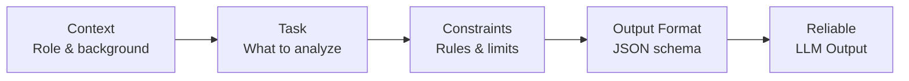
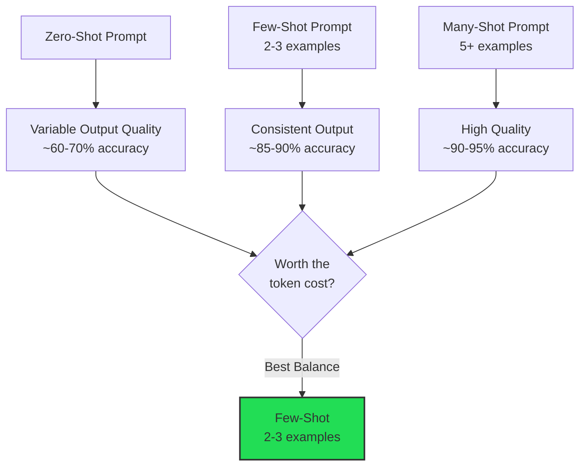
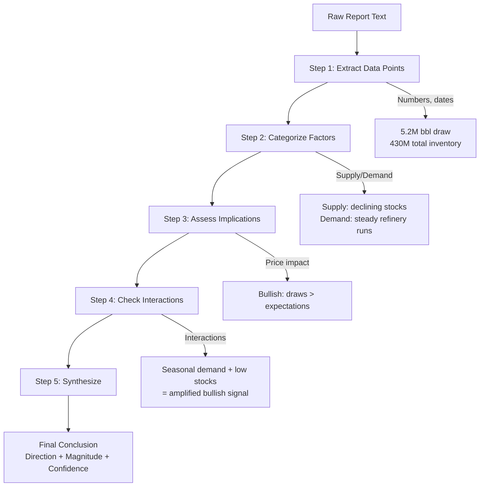
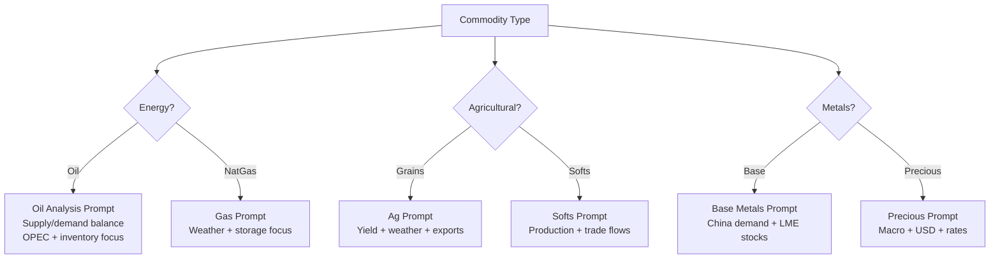
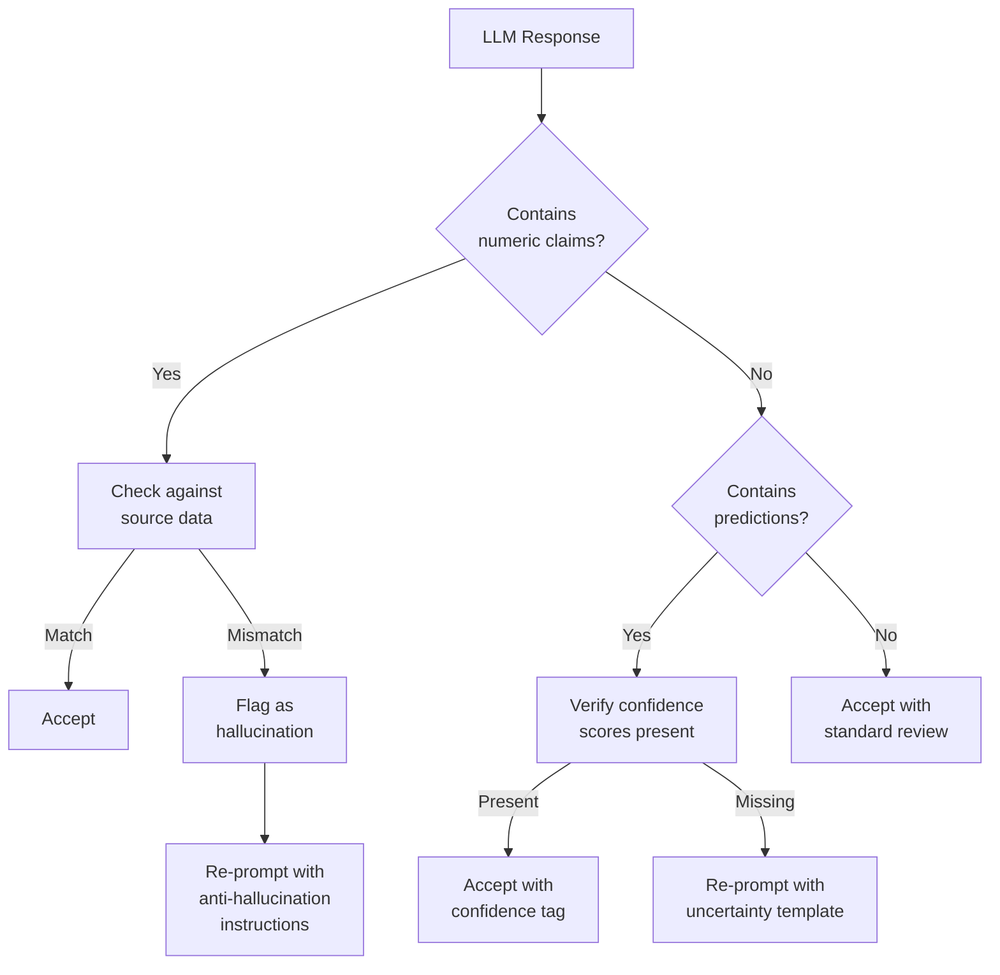
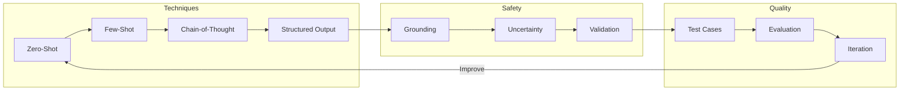

<!-- _class: lead -->

# Prompt Engineering for Commodity Analysis

**Module 0: Foundations**

Techniques for extracting accurate, actionable insights from LLMs

<!-- Speaker notes: Section transition. Briefly preview what this section covers before diving into details. -->

---

## The Anatomy of a Good Prompt

### Structure

```
[Context] + [Task] + [Constraints] + [Output Format]
```



> Every well-engineered prompt follows this four-part structure.

<!-- Speaker notes: Walk through the diagram step by step. Highlight the key decision points and data flow. -->

---

## Commodity Analysis Prompt Template

```python
prompt_template = """
You are a senior commodity analyst specializing in {commodity}.

Context:
{market_context}

Task:
Analyze the following news article and extract key information
that could impact {commodity} prices in the {timeframe} term.

Article:
{article_text}

Constraints:
- Focus only on supply/demand factors
- Quantify impacts where possible
- Rate confidence (low/medium/high)
```

<!-- Speaker notes: Walk through the code, emphasizing the key patterns. Highlight which parts learners should customize for their own use cases. -->

---

## Prompt Template (Output Format)

```python
Output Format:
{
    "summary": "One sentence summary",
    "factors": [
        {
            "type": "supply|demand|geopolitical|weather",
            "description": "...",
            "direction": "bullish|bearish|neutral",
            "magnitude": "minor|moderate|major",
            "confidence": "low|medium|high"
        }
    ],
    "price_impact_estimate": "X% to Y%",
    "timeframe": "short|medium|long"
}
"""
```

<!-- Speaker notes: Walk through the code, emphasizing the key patterns. Highlight which parts learners should customize for their own use cases. -->

---

<!-- _class: lead -->

# Few-Shot Prompting

Dramatically improve output quality with examples

<!-- Speaker notes: Section transition. Briefly preview what this section covers before diving into details. -->

---

## Few-Shot: Oil Supply Example

```python
def create_few_shot_prompt(article, commodity):
    """Create a few-shot prompt for commodity news analysis."""

    examples = """
Example 1:
Article: "Saudi Arabia announces 1 million barrel per day
          production cut starting next month"
Analysis: {
    "summary": "Major supply reduction from top producer",
    "factors": [{
        "type": "supply",
        "description": "1M bpd cut from Saudi Arabia",
        "direction": "bullish",
        "magnitude": "major",
        "confidence": "high"
    }],
    "price_impact_estimate": "+5% to +10%",
    "timeframe": "short"
}
```

<!-- Speaker notes: Walk through the code, emphasizing the key patterns. Highlight which parts learners should customize for their own use cases. -->

---

## Few-Shot: Demand and Weather Examples

```python
Example 2:
Article: "China steel demand shows signs of weakening as
          property sector struggles"
Analysis: {
    "summary": "Demand concerns from largest consumer",
    "factors": [{
        "type": "demand",
        "description": "China steel demand weakening",
        "direction": "bearish",
        "magnitude": "moderate",
        "confidence": "medium"
    }],
    "price_impact_estimate": "-3% to -7%",
    "timeframe": "medium"
}
```

---

```python

Example 3:
Article: "Severe drought in Brazil threatens soybean harvest"
Analysis: {
    "summary": "Weather risk to major soy producer",
    "factors": [{
        "type": "weather",
        "description": "Drought reducing expected soybean yield",
        "direction": "bullish",
        "magnitude": "moderate",
        "confidence": "medium"
    }],
    "price_impact_estimate": "+8% to +15%",
    "timeframe": "short"
}
"""

```

<!-- Speaker notes: Walk through the code, emphasizing the key patterns. Highlight which parts learners should customize for their own use cases. -->

---

## Few-Shot: Assembling the Prompt

```python
    prompt = f"""You are an expert commodity analyst.

Based on the examples below, analyze the given article
for {commodity} market impact.

{examples}

Now analyze this article:
Article: "{article}"
Analysis:"""

    return prompt

# Example usage
article = "OPEC+ members agree to extend production cuts
           through Q2, citing weak global demand"
prompt = create_few_shot_prompt(article, "crude oil")
```

<!-- Speaker notes: Walk through the code, emphasizing the key patterns. Highlight which parts learners should customize for their own use cases. -->

---

## How Few-Shot Improves Accuracy



> 2-3 well-chosen examples provide the best accuracy-to-cost ratio.

<!-- Speaker notes: Walk through the diagram step by step. Highlight the key decision points and data flow. -->

---

<!-- _class: lead -->

# Chain-of-Thought Prompting

Guiding the model through complex analytical reasoning

<!-- Speaker notes: Section transition. Briefly preview what this section covers before diving into details. -->

---

## Chain-of-Thought Structure

```python
cot_prompt = """
Analyze this commodity market report step by step.

Report:
{report_text}

Step 1: Identify the key data points mentioned
List all specific numbers, dates, and quantities.

Step 2: Categorize by impact type
For each data point, classify as supply, demand, or other.
```

---

```python

Step 3: Assess market implications
What does each factor mean for prices?

Step 4: Consider interactions
Do any factors amplify or offset each other?

Step 5: Synthesize conclusion
Provide overall market outlook with confidence level.

Begin your analysis:
"""

```

<!-- Speaker notes: Walk through the code, emphasizing the key patterns. Highlight which parts learners should customize for their own use cases. -->

---

## Chain-of-Thought Implementation

```python
def analyze_with_cot(report_text, llm_client):
    """Use chain-of-thought for commodity report analysis."""
    formatted_prompt = cot_prompt.format(
        report_text=report_text
    )

    response = llm_client.generate(
        prompt=formatted_prompt,
        temperature=0.3,  # Lower temperature for analytics
        max_tokens=2000
    )

    return response
```

> Lower temperature (0.1-0.3) produces more consistent analytical outputs. Use higher values only for creative tasks.

<!-- Speaker notes: Walk through the code, emphasizing the key patterns. Highlight which parts learners should customize for their own use cases. -->

---

## Chain-of-Thought Analysis Flow



<!-- Speaker notes: Walk through the diagram step by step. Highlight the key decision points and data flow. -->

---

<!-- _class: lead -->

# Structured Output Extraction

Ensuring programmatic processing with JSON mode

<!-- Speaker notes: Section transition. Briefly preview what this section covers before diving into details. -->

---

## JSON Extraction: EIA Reports

```python
json_extraction_prompt = """
Extract information from this EIA petroleum report in JSON.

Report excerpt:
{report_excerpt}

Extract to this exact schema:
{
    "report_date": "YYYY-MM-DD",
    "crude_oil": {
```

---

```python
        "production_mbpd": number,
        "production_change_pct": number,
        "imports_mbpd": number,
        "exports_mbpd": number
    },
    "inventory": {
        "crude_stocks_mb": number,
        "stocks_change_mb": number,
        "days_supply": number
    },

```

<!-- Speaker notes: Walk through the code, emphasizing the key patterns. Highlight which parts learners should customize for their own use cases. -->

---

## JSON Extraction: Schema (continued)

```python
    "refinery": {
        "utilization_pct": number,
        "runs_mbpd": number
    },
    "products": {
        "gasoline_stocks_mb": number,
        "distillate_stocks_mb": number
    }
}

Return only valid JSON, no additional text.
"""
```

<!-- Speaker notes: Walk through the code, emphasizing the key patterns. Highlight which parts learners should customize for their own use cases. -->

---

## JSON Extraction Implementation

```python
def extract_eia_data(report_excerpt, llm_client):
    """Extract structured data from EIA report."""
    import json

    prompt = json_extraction_prompt.format(
        report_excerpt=report_excerpt
    )

    response = llm_client.generate(
        prompt=prompt,
        temperature=0.0,  # Zero temp for extraction
        response_format={"type": "json_object"}
    )
```

---

```python

    try:
        return json.loads(response)
    except json.JSONDecodeError:
        return {
            "error": "Failed to parse JSON",
            "raw": response
        }

```

<!-- Speaker notes: Walk through the code, emphasizing the key patterns. Highlight which parts learners should customize for their own use cases. -->

---

<!-- _class: lead -->

# Commodity-Specific Prompts

Tailored prompts for oil and agricultural markets

<!-- Speaker notes: Section transition. Briefly preview what this section covers before diving into details. -->

---

## Oil Market Analysis Prompt

```python
oil_analysis_prompt = """
You are a petroleum market analyst. Analyze this oil data.

Current Data:
- WTI Price: ${wti_price}/bbl
- Brent-WTI Spread: ${spread}/bbl
- US Crude Inventory: {inventory} million barrels
  ({inventory_delta})
- OPEC Production: {opec_production} mbpd
- US Production: {us_production} mbpd
```

---

```python

Recent News: {news_summary}

Provide analysis covering:
1. Supply-demand balance assessment
2. Key price drivers for the next 2 weeks
3. Technical levels to watch (support/resistance)
4. Risk factors (upside and downside)
5. Trading recommendation with rationale
"""

```

<!-- Speaker notes: Walk through the code, emphasizing the key patterns. Highlight which parts learners should customize for their own use cases. -->

---

## Agricultural Commodities Prompt

```python
ag_analysis_prompt = """
You are an agricultural commodities analyst
specializing in {crop}.

Current conditions:
- USDA Crop Progress: {crop_progress}
- Weather Outlook: {weather_forecast}
- Export Sales: {export_data}
- Ending Stocks Estimate: {stocks}
```

---

```python

Seasonal Context:
- Current growth stage: {growth_stage}
- Days to harvest: {days_to_harvest}
- Historical yields at this stage: {historical_yields}

Analyze:
1. Yield risk assessment (scale 1-10)
2. Demand outlook (domestic + export)
3. Price forecast range for next month
4. Key events/reports to watch
"""

```

<!-- Speaker notes: Walk through the code, emphasizing the key patterns. Highlight which parts learners should customize for their own use cases. -->

---

## Commodity Prompt Selection Matrix



<!-- Speaker notes: Walk through the diagram step by step. Highlight the key decision points and data flow. -->

---

<!-- _class: lead -->

# Handling Model Limitations

Uncertainty, hallucinations, and grounding

<!-- Speaker notes: Section transition. Briefly preview what this section covers before diving into details. -->

---

## Uncertainty-Aware Prompts

```python
uncertainty_aware_prompt = """
Analyze this commodity market scenario.
Be explicit about uncertainty.

Data: {data}

In your analysis:
- Distinguish between facts and inferences
- Rate confidence for each conclusion
- Identify what additional data would help
- Provide a range of outcomes, not point estimates
- Note any assumptions you're making
```

---

```python

Format your response as:
FACTS (from the data):
- ...
INFERENCES (with confidence):
- [HIGH] ...
- [MEDIUM] ...
- [LOW] ...
ASSUMPTIONS:
- ...
DATA GAPS:
- ...
"""

```

<!-- Speaker notes: Walk through the code, emphasizing the key patterns. Highlight which parts learners should customize for their own use cases. -->

---

## Hallucination Prevention

```python
def create_grounded_prompt(data, question):
    """Create a prompt that grounds responses in data."""

    return f"""
Answer the following question using ONLY the information
provided below.
If the data doesn't contain enough information to answer,
say "Insufficient data."
Do not make up numbers or facts not present in the data.

DATA:
{data}

QUESTION: {question}

ANSWER (cite specific data points):
"""
```

> Grounding prompts reduce hallucination rates by explicitly constraining the model to provided data.

<!-- Speaker notes: Walk through the code, emphasizing the key patterns. Highlight which parts learners should customize for their own use cases. -->

---

## Hallucination Mitigation Strategies



<!-- Speaker notes: Walk through the diagram step by step. Highlight the key decision points and data flow. -->

---

<!-- _class: lead -->

# Evaluation and Testing

Systematic prompt quality measurement

<!-- Speaker notes: Section transition. Briefly preview what this section covers before diving into details. -->

---

## Prompt Evaluation Framework

```python
def evaluate_prompt_quality(prompt, test_cases, llm_client):
    """Evaluate prompt performance across test cases."""
    results = []

    for test in test_cases:
        response = llm_client.generate(
            prompt=prompt.format(**test['input']),
            temperature=0.0
        )

        score = {
            'accuracy': calculate_accuracy(
                response, test['expected']
            ),
            'format_correct': check_format(
```

---

```python
                response, test['expected_format']
            ),
            'completeness': check_completeness(
                response, test['required_fields']
            )
        }

        results.append({
            'test_id': test['id'],
            'scores': score,
            'response': response
        })

    return results

```

<!-- Speaker notes: Walk through the code, emphasizing the key patterns. Highlight which parts learners should customize for their own use cases. -->

---

## Test Case Structure

```python
test_cases = [
    {
        'id': 'oil_supply_cut',
        'input': {
            'article': 'OPEC announces 2mbpd production cut',
            'commodity': 'crude oil'
        },
        'expected': {
            'direction': 'bullish',
            'magnitude': 'major',
            'factor_type': 'supply'
        },
        'expected_format': 'json',
        'required_fields': [
            'summary', 'factors', 'price_impact_estimate'
        ]
    }
]
```

> Build a test suite of at least 10-20 cases per prompt template to ensure robustness.

<!-- Speaker notes: Walk through the code, emphasizing the key patterns. Highlight which parts learners should customize for their own use cases. -->

---

## Key Takeaways

1. **Structure prompts clearly** -- Context + Task + Constraints + Output Format

2. **Use few-shot examples** -- 2-3 examples dramatically improve quality

3. **Chain-of-thought** -- Essential for complex analytical tasks

4. **Structured outputs (JSON)** -- Enable programmatic processing

5. **Ground responses in data** -- Prevent hallucinations

6. **Test systematically** -- Evaluate across representative cases

<!-- Speaker notes: Recap the main points. Ask learners which takeaway they found most surprising or useful. -->

---

## Visual Summary: Prompt Engineering Toolkit



> Iterate: build prompts, test them, refine based on results.

<!-- Speaker notes: Walk through the diagram step by step. Highlight the key decision points and data flow. -->
