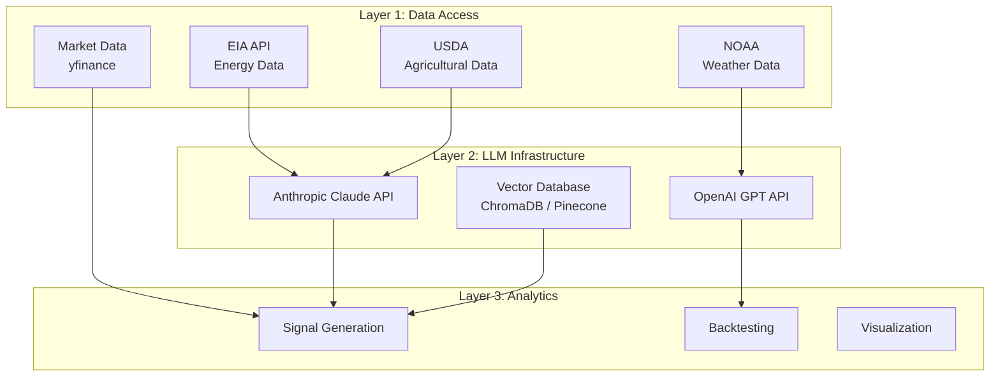
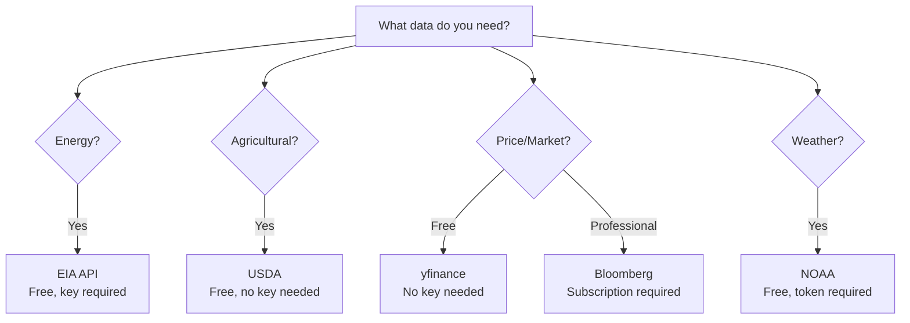
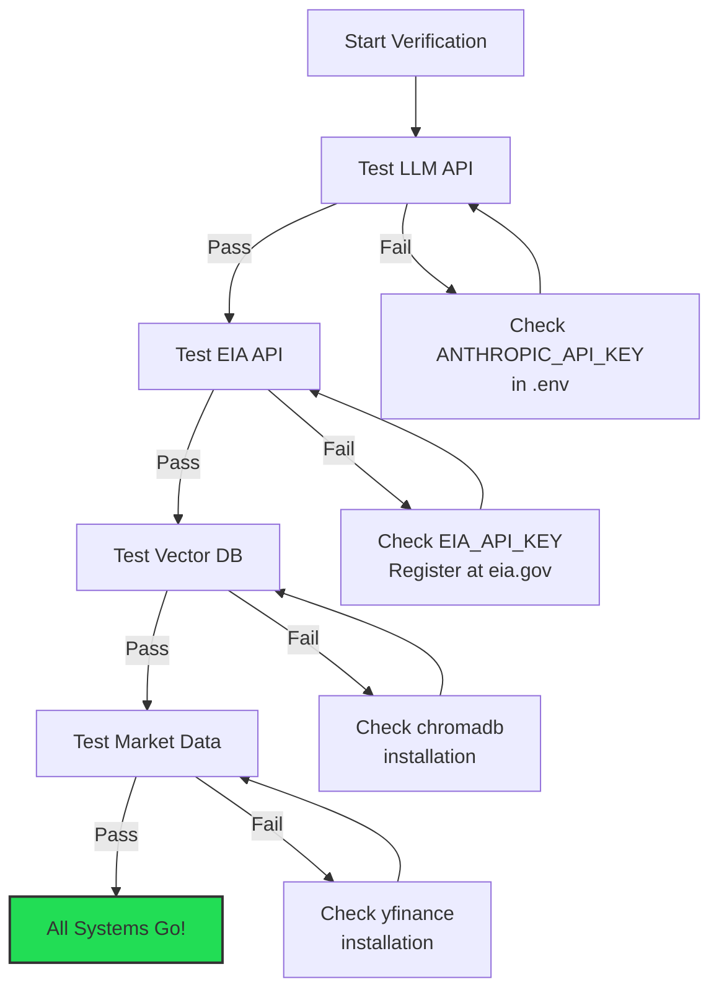
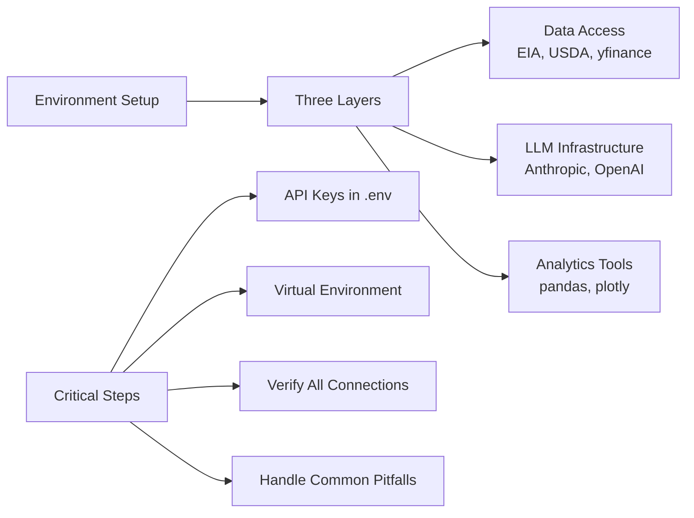

<!-- _class: lead -->

# Environment Setup for GenAI Commodities Trading

**Module 0: Foundations**

Setting up your development environment for LLM-powered commodity analysis

<!-- Speaker notes: Section transition. Briefly preview what this section covers before diving into details. -->

---

## In Brief

Setting up the development environment requires:
1. API access to LLM providers
2. Commodity data source connections
3. Python libraries for data processing and ML

> Most failures stem from inadequate API setup or missing dependencies.

<!-- Speaker notes: Present the key concepts on this slide. Pause for questions before moving to the next topic. -->

---

## Three-Layer Architecture



<!-- Speaker notes: Walk through the diagram step by step. Highlight the key decision points and data flow. -->

---

<!-- _class: lead -->

# Layer 1: LLM API Access

Connecting to language model providers

<!-- Speaker notes: Section transition. Briefly preview what this section covers before diving into details. -->

---

## Primary: Anthropic Claude

```bash
# Sign up at: https://console.anthropic.com/
# Set environment variable
export ANTHROPIC_API_KEY="sk-ant-api..."
```

## Alternative: OpenAI GPT

```bash
# Sign up at: https://platform.openai.com/
export OPENAI_API_KEY="sk-..."
```

<!-- Speaker notes: Present the key concepts on this slide. Pause for questions before moving to the next topic. -->

---

## Cost Considerations

| Provider | Input Cost | Output Cost |
|----------|-----------|-------------|
| Anthropic Claude 3.5 Sonnet | $3/1M tokens | $15/1M tokens |
| OpenAI GPT-4o | $2.50/1M tokens | $10/1M tokens |

**Budget for development:** $50-100/month for moderate usage

> Start with Claude for complex analysis tasks, use GPT-4o for simpler extractions to optimize costs.

<!-- Speaker notes: Review the table contents. Ask learners which rows are most relevant to their use case. -->

---

<!-- _class: lead -->

# Layer 2: Commodity Data APIs

Connecting to government and market data sources

<!-- Speaker notes: Section transition. Briefly preview what this section covers before diving into details. -->

---

## Energy Information Administration (EIA)

```bash
# Free registration: https://www.eia.gov/opendata/register.php
export EIA_API_KEY="your_eia_key"
```

**Key datasets:**
- Weekly Petroleum Status Report (WPSR)
- Natural Gas Weekly Update
- Short-Term Energy Outlook (STEO)

<!-- Speaker notes: Present the key concepts on this slide. Pause for questions before moving to the next topic. -->

---

## USDA Agricultural Data

```bash
# No API key required for most reports
# Key sources:
# - WASDE (World Agricultural Supply and Demand Estimates)
# - Crop Progress Reports
# - Export Sales Reports
# Direct download URLs available
```

## NOAA Weather Data (Optional)

```bash
# For weather-dependent commodities (natural gas, agriculture)
# Register at: https://www.ncdc.noaa.gov/cdo-web/token
export NOAA_TOKEN="your_token"
```

<!-- Speaker notes: Present the key concepts on this slide. Pause for questions before moving to the next topic. -->

---

## Market Data Options

<div class="columns">
<div>

### Free
- **Yahoo Finance** (via yfinance)
- No API key required

```bash
pip install yfinance
```

</div>
<div>

### Paid
- **Bloomberg API** (subscription)
- **Quandl/Nasdaq Data Link**

```bash
export QUANDL_API_KEY="your_key"
```

</div>
</div>

<!-- Speaker notes: Present the key concepts on this slide. Pause for questions before moving to the next topic. -->

---

## Data Source Decision Tree



<!-- Speaker notes: Walk through the diagram step by step. Highlight the key decision points and data flow. -->

---

<!-- _class: lead -->

# Installation

Python environment and dependencies

<!-- Speaker notes: Section transition. Briefly preview what this section covers before diving into details. -->

---

## Create Virtual Environment

```bash
# Using venv
python -m venv genai-commodities
source genai-commodities/bin/activate
# On Windows: genai-commodities\Scripts\activate

# Using conda
conda create -n genai-commodities python=3.11
conda activate genai-commodities
```

**Requirements:** Python 3.9+

<!-- Speaker notes: Present the key concepts on this slide. Pause for questions before moving to the next topic. -->

---

## Core Dependencies: LLM & Data

```txt
# LLM Frameworks
anthropic>=0.25.0
openai>=1.30.0
langchain>=0.2.0
langchain-anthropic>=0.1.0

# Vector Databases
chromadb>=0.4.0
pinecone-client>=3.0.0

# Data Processing
pandas>=2.0.0
numpy>=1.24.0
requests>=2.31.0
beautifulsoup4>=4.12.0
```

<!-- Speaker notes: Present the key concepts on this slide. Pause for questions before moving to the next topic. -->

---

## Core Dependencies: Viz, Utils, Testing

```txt
# Visualization
matplotlib>=3.7.0
plotly>=5.14.0
seaborn>=0.12.0

# Utilities
python-dotenv>=1.0.0
pydantic>=2.0.0
feedparser>=6.0.0

# Testing
pytest>=7.4.0
pytest-cov>=4.1.0

# Optional: Advanced features
langsmith>=0.1.0     # LLM observability
instructor>=0.2.0    # Structured outputs
```

```bash
pip install -r requirements.txt
```

<!-- Speaker notes: Present the key concepts on this slide. Pause for questions before moving to the next topic. -->

---

## Configuration: .env File

```bash
# .env (never commit this file!)
ANTHROPIC_API_KEY=sk-ant-api...
OPENAI_API_KEY=sk-...
EIA_API_KEY=your_eia_key
NOAA_TOKEN=your_noaa_token
QUANDL_API_KEY=your_quandl_key

# Vector database (if using Pinecone)
PINECONE_API_KEY=your_pinecone_key
PINECONE_ENVIRONMENT=us-west1-gcp

# Optional: LangSmith for monitoring
LANGCHAIN_API_KEY=your_langsmith_key
LANGCHAIN_TRACING_V2=true
LANGCHAIN_PROJECT=genai-commodities
```

<!-- Speaker notes: Present the key concepts on this slide. Pause for questions before moving to the next topic. -->

---

## Loading Configuration in Python

```python
from dotenv import load_dotenv
import os

load_dotenv()

ANTHROPIC_API_KEY = os.getenv('ANTHROPIC_API_KEY')
EIA_API_KEY = os.getenv('EIA_API_KEY')
```

> Always call `load_dotenv()` before `os.getenv()` -- a common source of "key not found" errors.

<!-- Speaker notes: Walk through the code, emphasizing the key patterns. Highlight which parts learners should customize for their own use cases. -->

---

<!-- _class: lead -->

# Verification

Testing that everything works

<!-- Speaker notes: Section transition. Briefly preview what this section covers before diving into details. -->

---

## Test LLM Access

```python
from anthropic import Anthropic

client = Anthropic()

response = client.messages.create(
    model="claude-sonnet-4-20250514",
    max_tokens=100,
    messages=[{
        "role": "user",
        "content": "What are the main factors affecting "
                   "crude oil prices?"
    }]
)

print(response.content[0].text)
# Should return a coherent response about oil price drivers
```

<!-- Speaker notes: Walk through the code, emphasizing the key patterns. Highlight which parts learners should customize for their own use cases. -->

---

## Test EIA API Access

```python
import requests
import os

EIA_API_KEY = os.getenv('EIA_API_KEY')

response = requests.get(
    "https://api.eia.gov/v2/petroleum/sum/sndw/data",
    params={
        'api_key': EIA_API_KEY,
        'frequency': 'weekly',
        'data[0]': 'value',
        'facets[series][]': 'WCESTUS1',  # Crude oil stocks
        'length': 1
    }
)
```

---

```python

if response.status_code == 200:
    data = response.json()
    latest = data['response']['data'][0]['value']
    print(f"Latest US crude stocks: {latest} thousand bbl")
else:
    print(f"Error: {response.status_code}")

```

<!-- Speaker notes: Walk through the code, emphasizing the key patterns. Highlight which parts learners should customize for their own use cases. -->

---

## Test Vector Database

```python
import chromadb

client = chromadb.Client()
collection = client.create_collection("test")
collection.add(
    documents=["Crude oil inventories declined"],
    ids=["test1"]
)

results = collection.query(
    query_texts=["oil stocks"],
    n_results=1
)
print(results)
# Should return the document
```

> ChromaDB runs locally with no API key needed -- ideal for development and testing.

<!-- Speaker notes: Walk through the code, emphasizing the key patterns. Highlight which parts learners should customize for their own use cases. -->

---

## Verification Checklist



<!-- Speaker notes: Walk through the diagram step by step. Highlight the key decision points and data flow. -->

---

## Recommended Directory Structure

```
genai-commodities/
├── .env                    # API keys (gitignored)
├── .gitignore
├── requirements.txt
├── README.md
├── data/                   # Raw and processed data
│   ├── raw/
│   ├── processed/
│   └── cache/
├── notebooks/              # Jupyter notebooks
├── src/                    # Source code
│   ├── data/              # Data fetching
│   ├── llm/               # LLM utilities
│   ├── analysis/          # Analysis functions
│   └── signals/           # Signal generation
├── tests/                  # Unit tests
└── outputs/                # Results and reports
```

<!-- Speaker notes: Present the key concepts on this slide. Pause for questions before moving to the next topic. -->

---

<!-- _class: lead -->

# Common Pitfalls

And how to fix them

<!-- Speaker notes: Section transition. Briefly preview what this section covers before diving into details. -->

---

## Pitfall 1: API Rate Limits

**Issue:** Exceeding free tier limits or hitting rate limits

```python
import time
from functools import wraps

def retry_with_backoff(max_retries=3):
    def decorator(func):
        @wraps(func)
        def wrapper(*args, **kwargs):
            for attempt in range(max_retries):
                try:
                    return func(*args, **kwargs)
                except Exception as e:
                    if attempt == max_retries - 1:
                        raise
                    wait = 2 ** attempt
                    print(f"Retry {attempt+1}/{max_retries}"
                          f" after {wait}s")
                    time.sleep(wait)
        return wrapper
    return decorator
```

<!-- Speaker notes: Walk through the code, emphasizing the key patterns. Highlight which parts learners should customize for their own use cases. -->

---

## Pitfall 2: Environment Variables Not Loading

**Issue:** API keys not found even after setting in .env

```python
from dotenv import load_dotenv
load_dotenv()  # Must be called before os.getenv()
```

## Pitfall 3: ChromaDB Persistence Issues

**Issue:** Vector database data lost between sessions

```python
import chromadb

# Use persistent client instead of in-memory
client = chromadb.PersistentClient(path="./chroma_db")
```

<!-- Speaker notes: Walk through the code, emphasizing the key patterns. Highlight which parts learners should customize for their own use cases. -->

---

## Pitfall 4: Large Response Truncation

**Issue:** LLM responses cut off mid-sentence

```python
response = client.messages.create(
    model="claude-sonnet-4-20250514",
    max_tokens=4096,  # Increase from default 1024
    messages=[...]
)
```

## Pitfall 5: JSON Parsing Failures

**Issue:** LLM returns malformed JSON

```python
def safe_json_parse(text):
    """Extract and parse JSON from LLM response."""
    try:
        return json.loads(text)
    except json.JSONDecodeError:
        import re
        json_match = re.search(
            r'```json\n(.*?)\n```', text, re.DOTALL
        )
        if json_match:
            return json.loads(json_match.group(1))
        raise ValueError("No valid JSON found")
```

<!-- Speaker notes: Walk through the code, emphasizing the key patterns. Highlight which parts learners should customize for their own use cases. -->

---

## Connections

<div class="columns">
<div>

### Builds On
- Python programming fundamentals
- REST API concepts
- Environment variable management

</div>
<div>

### Leads To
- Module 1: Report Processing
- Module 2: RAG Research
- All subsequent modules

</div>
</div>

<!-- Speaker notes: Show how this content connects to other modules. Point learners to the next recommended deck. -->

---

## Practice Problems

1. **Basic Setup** -- Set up environment, verify APIs, create a script that fetches crude oil data and summarizes it with an LLM

2. **Error Handling** -- Implement robust data fetching with retry logic, logging, and handling for missing/invalid API keys

3. **Cost Tracking** -- Build a token usage tracker, estimate monthly costs, and design a caching strategy

<!-- Speaker notes: Present the key concepts on this slide. Pause for questions before moving to the next topic. -->

---

## Key Takeaways



> A well-configured environment is the foundation for everything that follows in this course.

<!-- Speaker notes: Recap the main points. Ask learners which takeaway they found most surprising or useful. -->
