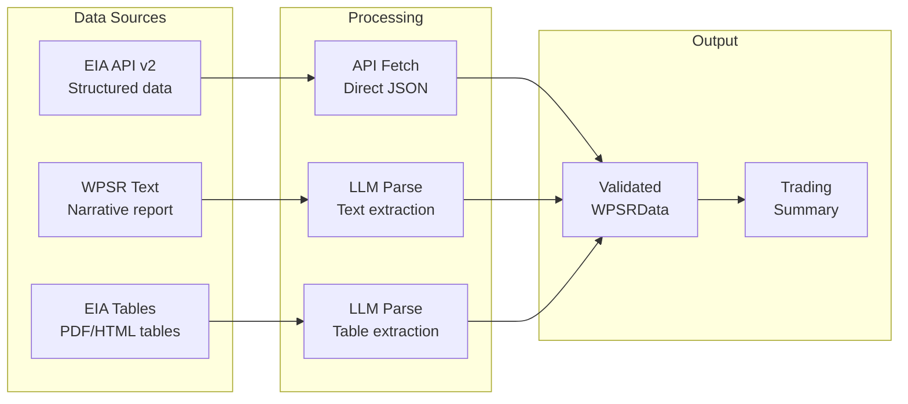
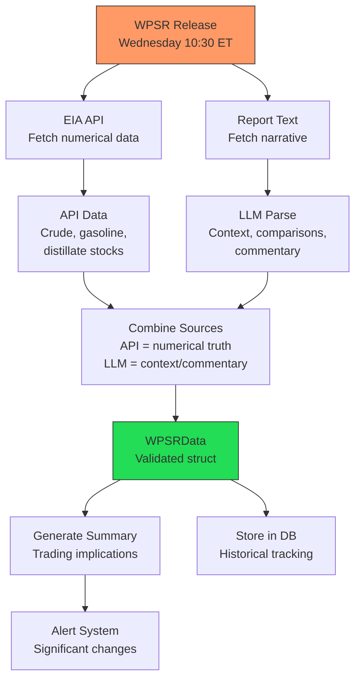
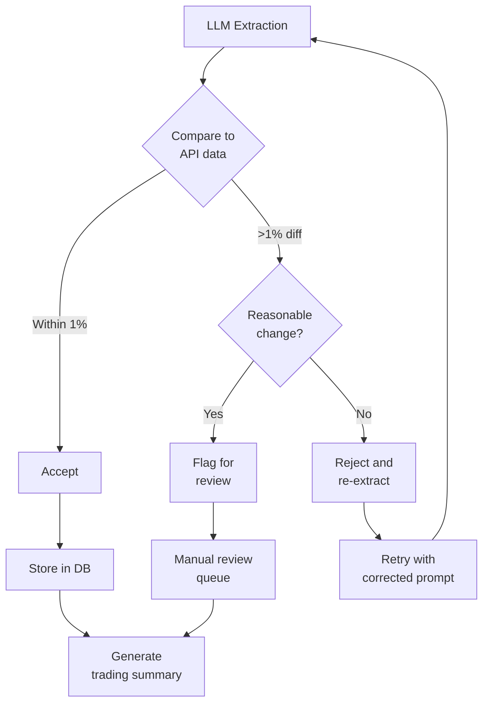
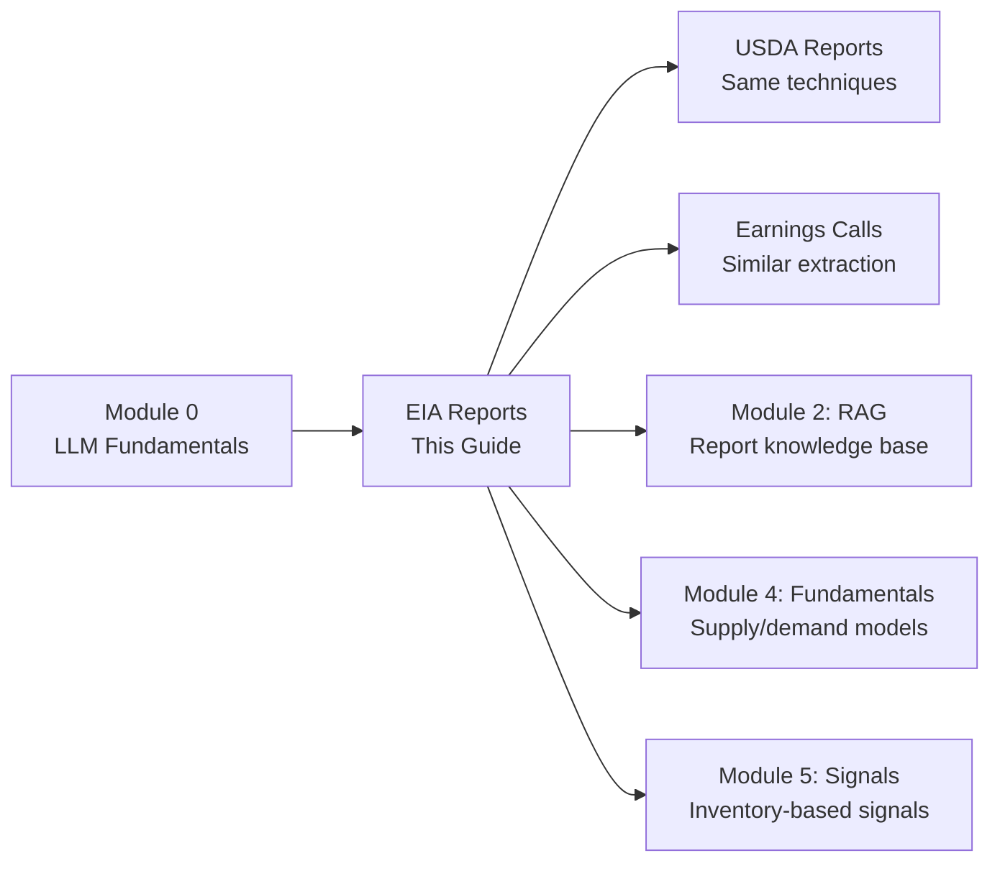

<!-- _class: lead -->

# Parsing EIA Petroleum Reports

**Module 1: Report Processing**

Automated extraction from the most important energy market data source

<!-- Speaker notes: Section transition. Briefly preview what this section covers before diving into details. -->

---

## Key EIA Reports

<div class="columns">
<div>

### Weekly Petroleum Status Report (WPSR)
**Released:** Every Wednesday 10:30 AM ET

- Crude oil inventories
- Gasoline and distillate stocks
- Refinery utilization
- Product supplied (demand proxy)
- Imports and exports

</div>
<div>

### Short-Term Energy Outlook (STEO)
**Released:** Monthly

- Price forecasts
- Production projections
- Demand estimates
- Global supply/demand balances

</div>
</div>

<!-- Speaker notes: Present the key concepts on this slide. Pause for questions before moving to the next topic. -->

---

## EIA Report Processing Pipeline



<!-- Speaker notes: Walk through the diagram step by step. Highlight the key decision points and data flow. -->

---

## EIA API Access

```python
import os
import requests

# Register at: https://www.eia.gov/opendata/register.php
EIA_API_KEY = os.environ.get('EIA_API_KEY')
BASE_URL = "https://api.eia.gov/v2"

def eia_request(endpoint, params=None):
    """Make authenticated request to EIA API v2."""
    params = params or {}
    params['api_key'] = EIA_API_KEY

    response = requests.get(
        f"{BASE_URL}/{endpoint}", params=params
    )
    response.raise_for_status()
    return response.json()
```

<!-- Speaker notes: Walk through the code, emphasizing the key patterns. Highlight which parts learners should customize for their own use cases. -->

---

## Key Series IDs

| Series ID | Description |
|-----------|-------------|
| PET.WCESTUS1.W | Weekly US Crude Oil Stocks |
| PET.WGTSTUS1.W | Weekly US Gasoline Stocks |
| PET.WDISTUS1.W | Weekly US Distillate Stocks |
| PET.WCRFPUS2.W | Weekly US Refinery Utilization |
| PET.WTTNTUS2.W | Weekly US Total Products Supplied |

> These five series cover the core data points that move petroleum markets every Wednesday.

<!-- Speaker notes: Review the table contents. Ask learners which rows are most relevant to their use case. -->

---

## Fetching Weekly Inventory Data

```python
def get_weekly_inventory(series_id, periods=52):
    """Fetch weekly inventory data from EIA."""
    endpoint = f"petroleum/sum/sndw/data"
    params = {
        'frequency': 'weekly',
        'data[0]': 'value',
        'sort[0][column]': 'period',
        'sort[0][direction]': 'desc',
        'length': periods
    }

    data = eia_request(endpoint, params)
    return data['response']['data']

# Example: Get crude oil inventory
crude_stocks = get_weekly_inventory('WCESTUS1')
print(f"Latest crude stocks: "
      f"{crude_stocks[0]['value']} thousand barrels")
```

<!-- Speaker notes: Walk through the code, emphasizing the key patterns. Highlight which parts learners should customize for their own use cases. -->

---

<!-- _class: lead -->

# LLM-Based Report Parsing

Extracting structured data from narrative text

<!-- Speaker notes: Section transition. Briefly preview what this section covers before diving into details. -->

---

## Parsing WPSR Narrative Text

```python
from anthropic import Anthropic

client = Anthropic()

def parse_wpsr_narrative(report_text):
    """Extract structured data from WPSR narrative text."""
    prompt = """Extract petroleum inventory data from this
EIA report text.
```

---

```python

Return JSON with this structure:
{
  "report_date": "YYYY-MM-DD",
  "crude_oil": {
    "stocks_mmb": <total in million barrels>,
    "weekly_change_mmb": <change from last week>,
    "vs_5yr_avg_pct": <percent vs 5-year average>,
    "days_supply": <if mentioned>
  },
  "gasoline": {
    "stocks_mmb": <total>,
    "weekly_change_mmb": <change>,
    "vs_5yr_avg_pct": <percent vs average>
  },

```

<!-- Speaker notes: Walk through the code, emphasizing the key patterns. Highlight which parts learners should customize for their own use cases. -->

---

## Parsing WPSR Narrative (continued)

```python
  "distillates": {
    "stocks_mmb": <total>,
    "weekly_change_mmb": <change>,
    "vs_5yr_avg_pct": <percent vs average>
  },
  "refinery_utilization_pct": <if mentioned>,
  "products_supplied_mbd": <million barrels per day>
}

Use null for values not explicitly stated.

Report text:
"""
```

---

```python

    response = client.messages.create(
        model="claude-sonnet-4-20250514",
        max_tokens=1024,
        messages=[{
            "role": "user",
            "content": prompt + report_text
        }]
    )
    return response.content[0].text

```

<!-- Speaker notes: Walk through the code, emphasizing the key patterns. Highlight which parts learners should customize for their own use cases. -->

---

## Example: Parsing Real WPSR Text

```python
sample_text = """
This Week in Petroleum - November 15, 2024

U.S. commercial crude oil inventories (excluding those in
the Strategic Petroleum Reserve) decreased by 5.2 million
barrels from the previous week. At 430.0 million barrels,
U.S. crude oil inventories are about 3% below the five year
average for this time of year.

Total motor gasoline inventories increased by 2.1 million
barrels last week and are about 2% below the five year
average for this time of year.
```

---

```python

Distillate fuel inventories decreased by 1.4 million barrels
last week and are about 6% below the five year average.

Refinery capacity utilization averaged 90.4 percent.
Total products supplied over the last four-week period
averaged 20.8 million barrels a day.
"""

result = parse_wpsr_narrative(sample_text)

```

<!-- Speaker notes: Walk through the code, emphasizing the key patterns. Highlight which parts learners should customize for their own use cases. -->

---

## Parsing EIA Tables

```python
def parse_eia_table(table_text, table_type='inventory'):
    """Extract structured data from EIA report tables."""
    prompts = {
        'inventory': """Parse this EIA inventory table.
Return JSON array with entries:
[{
  "category": <product category>,
  "current_week": <value>,
  "prior_week": <value>,
  "year_ago": <value>,
  "unit": "thousand_barrels"
}]""",
        'supply': """Parse this EIA supply/demand table.
Return JSON array with entries:
[{
  "category": <supply/demand item>,
  "current_week": <value>,
```

---

```python
  "4wk_average": <value>,
  "year_ago": <value>,
  "unit": "thousand_barrels_per_day"
}]"""
    }

    response = client.messages.create(
        model="claude-sonnet-4-20250514",
        max_tokens=2048,
        messages=[{
            "role": "user",
            "content": f"{prompts[table_type]}\n\n"
                       f"Table:\n{table_text}"
        }]
    )
    return response.content[0].text

```

<!-- Speaker notes: Walk through the code, emphasizing the key patterns. Highlight which parts learners should customize for their own use cases. -->

---

<!-- _class: lead -->

# Building a Complete Pipeline

End-to-end WPSR processing

<!-- Speaker notes: Section transition. Briefly preview what this section covers before diving into details. -->

---

## WPSRData Dataclass

```python
import json
from datetime import datetime
from dataclasses import dataclass
from typing import Optional, List

@dataclass
class WPSRData:
    """Structured WPSR data."""
    report_date: datetime
    crude_stocks_mmb: float
    crude_change_mmb: float
    gasoline_stocks_mmb: float
    gasoline_change_mmb: float
    distillate_stocks_mmb: float
    distillate_change_mmb: float
    refinery_utilization_pct: Optional[float]
    products_supplied_mbd: Optional[float]
```

<!-- Speaker notes: Walk through the code, emphasizing the key patterns. Highlight which parts learners should customize for their own use cases. -->

---

## WPSRProcessor: Fetch and Parse

```python
class WPSRProcessor:
    """Process EIA Weekly Petroleum Status Reports."""

    def __init__(self, api_key: str):
        self.api_key = api_key
        self.client = Anthropic()

    def fetch_latest_api_data(self) -> dict:
        """Fetch latest data from EIA API."""
        series_map = {
            'crude_stocks': 'WCESTUS1',
            'gasoline_stocks': 'WGTSTUS1',
            'distillate_stocks': 'WDISTUS1',
```

---

```python
            'refinery_util': 'WCRFPUS2'
        }
        results = {}
        for name, series in series_map.items():
            data = get_weekly_inventory(series, periods=2)
            results[name] = {
                'current': data[0]['value'],
                'prior': data[1]['value'],
                'change': (float(data[0]['value'])
                           - float(data[1]['value']))
            }
        return results

```

<!-- Speaker notes: Walk through the code, emphasizing the key patterns. Highlight which parts learners should customize for their own use cases. -->

---

## WPSRProcessor: Combine and Summarize

```python
    def combine_sources(self, api_data, parsed_text):
        """Combine API and text-parsed data.
        Prefer API for numerical accuracy."""
        return WPSRData(
            report_date=datetime.now(),
            crude_stocks_mmb=float(
                api_data['crude_stocks']['current']) / 1000,
            crude_change_mmb=
                api_data['crude_stocks']['change'] / 1000,
            gasoline_stocks_mmb=float(
                api_data['gasoline_stocks']['current']) / 1000,
```

---

```python
            gasoline_change_mmb=
                api_data['gasoline_stocks']['change'] / 1000,
            distillate_stocks_mmb=float(
                api_data['distillate_stocks']['current']) / 1000,
            distillate_change_mmb=
                api_data['distillate_stocks']['change'] / 1000,
            refinery_utilization_pct=parsed_text.get(
                'refinery_utilization_pct'),
            products_supplied_mbd=parsed_text.get(
                'products_supplied_mbd')
        )

```

<!-- Speaker notes: Walk through the code, emphasizing the key patterns. Highlight which parts learners should customize for their own use cases. -->

---

## WPSRProcessor: Trading Summary

```python
    def generate_summary(self, data: WPSRData) -> str:
        """Generate trading-relevant summary."""
        prompt = f"""Given this petroleum inventory data,
generate a brief trading summary:

Crude: {data.crude_stocks_mmb:.1f} MMB
  ({data.crude_change_mmb:+.1f} vs prior week)
Gasoline: {data.gasoline_stocks_mmb:.1f} MMB
  ({data.gasoline_change_mmb:+.1f})
Distillate: {data.distillate_stocks_mmb:.1f} MMB
  ({data.distillate_change_mmb:+.1f})
Refinery Util: {data.refinery_utilization_pct}%
```

---

```python

Provide:
1. Overall supply assessment (bullish/bearish/neutral)
2. Key takeaway for crude traders
3. Key takeaway for products traders
Keep it concise (3-4 sentences total)."""

        response = self.client.messages.create(
            model="claude-sonnet-4-20250514",
            max_tokens=256,
            messages=[{"role": "user", "content": prompt}]
        )
        return response.content[0].text

```

<!-- Speaker notes: Walk through the code, emphasizing the key patterns. Highlight which parts learners should customize for their own use cases. -->

---

## Pipeline Data Flow



<!-- Speaker notes: Walk through the diagram step by step. Highlight the key decision points and data flow. -->

---

<!-- _class: lead -->

# Validation and Quality Control

Ensuring extraction accuracy

<!-- Speaker notes: Section transition. Briefly preview what this section covers before diving into details. -->

---

## Cross-Checking Extractions

```python
def validate_wpsr_extraction(extracted, api_data):
    """Validate LLM extraction against API data."""
    issues = []

    if extracted.get('crude_oil', {}).get('stocks_mmb'):
        llm_value = extracted['crude_oil']['stocks_mmb']
        api_value = (float(
            api_data['crude_stocks']['current']) / 1000)
```

---

```python

        diff_pct = (
            abs(llm_value - api_value) / api_value * 100
        )
        if diff_pct > 1:  # More than 1% difference
            issues.append({
                'field': 'crude_stocks',
                'llm_value': llm_value,
                'api_value': api_value,
                'diff_pct': diff_pct
            })

    return {
        'valid': len(issues) == 0,
        'issues': issues
    }

```

<!-- Speaker notes: Walk through the code, emphasizing the key patterns. Highlight which parts learners should customize for their own use cases. -->

---

## Historical Reasonableness Check

```python
def check_reasonable_change(
    current: float,
    change: float,
    commodity: str
) -> bool:
    """Check if weekly change is within reasonable bounds."""
    # Historical max weekly changes (million barrels)
    max_changes = {
        'crude': 15,
        'gasoline': 8,
        'distillate': 6
    }
    return abs(change) <= max_changes.get(commodity, 10)
```

> Flag any extraction where weekly changes exceed historical bounds -- these likely indicate parsing errors.

<!-- Speaker notes: Walk through the code, emphasizing the key patterns. Highlight which parts learners should customize for their own use cases. -->

---

## Validation Decision Flow



<!-- Speaker notes: Walk through the diagram step by step. Highlight the key decision points and data flow. -->

---

## Key Takeaways

1. **EIA API is primary source** -- Use API for numerical accuracy

2. **LLMs augment API data** -- Extract context, comparisons, and unstructured commentary

3. **Validate extractions** -- Cross-check LLM outputs against API data

4. **Build pipelines** -- Combine multiple sources into structured, validated outputs

5. **Track release timing** -- WPSR release at 10:30 ET is a market-moving event

<!-- Speaker notes: Recap the main points. Ask learners which takeaway they found most surprising or useful. -->

---

## Connections



<!-- Speaker notes: Show how this content connects to other modules. Point learners to the next recommended deck. -->
