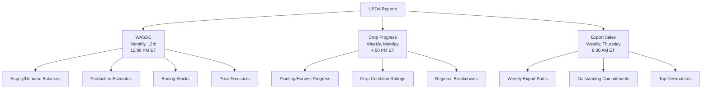
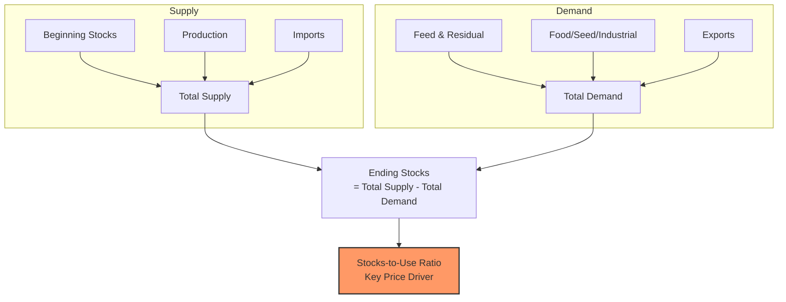
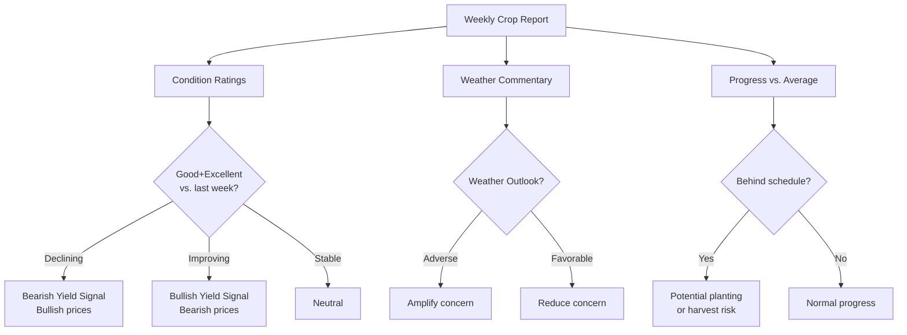
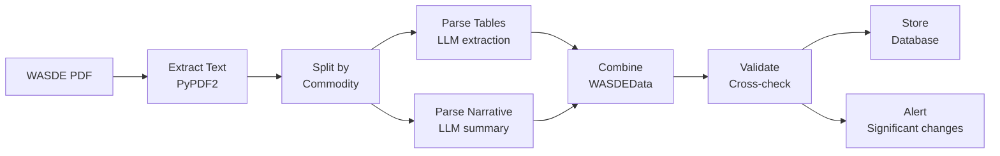
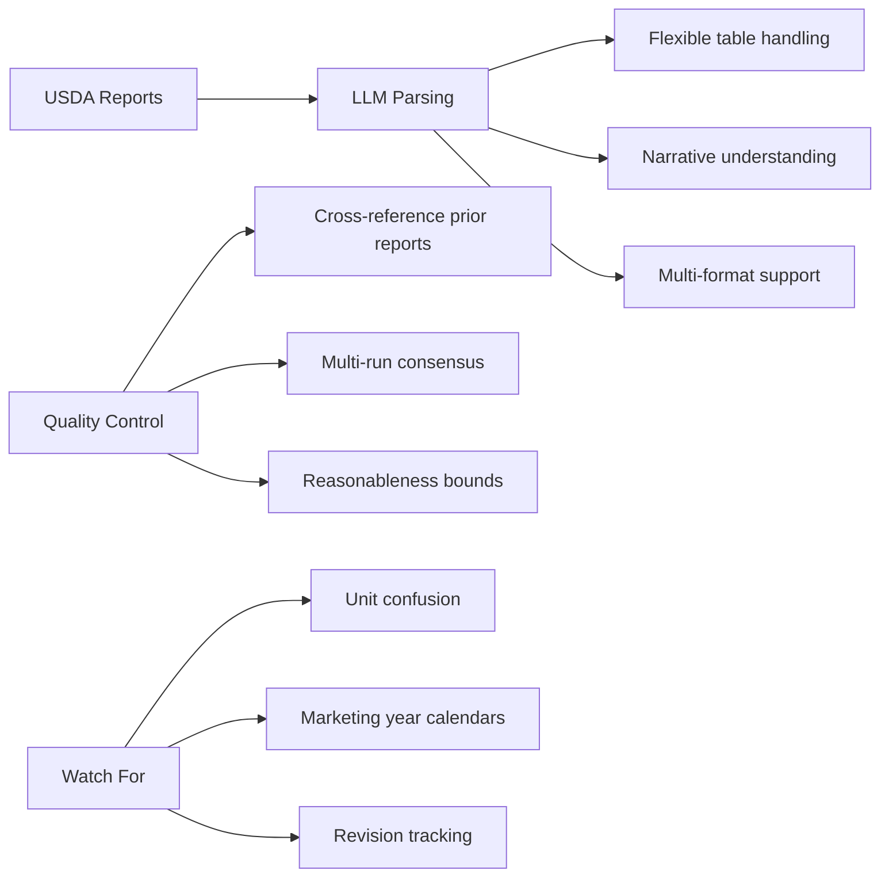

<!-- _class: lead -->

# Parsing USDA Agricultural Reports

**Module 1: Report Processing**

Automated extraction from WASDE, Crop Progress, and Export Sales

<!-- Speaker notes: Section transition. Briefly preview what this section covers before diving into details. -->

---

## In Brief

USDA reports drive agricultural commodity markets but are published as PDFs with inconsistent table formats. LLMs excel at flexible table parsing where traditional parsers fail.

> LLMs enable automated processing of monthly WASDE updates and weekly crop reports at scale.

<!-- Speaker notes: Present the key concepts on this slide. Pause for questions before moving to the next topic. -->

---

## Key USDA Reports



<!-- Speaker notes: Walk through the diagram step by step. Highlight the key decision points and data flow. -->

---

## WASDE Report Details

**Release:** Monthly (typically 12th at 12:00 PM ET)
**Market Impact:** Extreme -- major price movements

**Commodities Covered:**

| Category | Commodities |
|----------|-------------|
| Grains | Corn, wheat, soybeans |
| Oilseeds | Soybean oil, soybean meal |
| Soft | Cotton, sugar, rice |

<!-- Speaker notes: Review the table contents. Ask learners which rows are most relevant to their use case. -->

---

## Crop Progress and Export Sales

<div class="columns">
<div>

### Crop Progress Reports
**Release:** Weekly (Mon 4:00 PM ET)

- Planting progress (% complete)
- Crop condition ratings (poor to excellent)
- Harvest progress
- Regional breakdowns

</div>
<div>

### Export Sales Report
**Release:** Weekly (Thu 8:30 AM ET)

- Weekly export sales by commodity
- Outstanding sales (commitments)
- Net changes in commitments
- Destination breakdown

</div>
</div>

<!-- Speaker notes: Present the key concepts on this slide. Pause for questions before moving to the next topic. -->

---

<!-- _class: lead -->

# Data Access Methods

PDF downloads and USDA Quick Stats API

<!-- Speaker notes: Section transition. Briefly preview what this section covers before diving into details. -->

---

## Direct PDF Downloads

```python
import requests
from datetime import datetime

def download_wasde_report(year: int, month: int) -> bytes:
    """Download WASDE PDF for specified month."""
    month_str = f"{month:02d}"
    url = (f"https://www.usda.gov/oce/commodity/wasde/"
           f"wasde{month_str}{year}.pdf")

    response = requests.get(url)
    response.raise_for_status()
    return response.content

# Example: Download January 2024 WASDE
pdf_content = download_wasde_report(2024, 1)
with open("wasde_jan_2024.pdf", "wb") as f:
    f.write(pdf_content)
```

<!-- Speaker notes: Walk through the code, emphasizing the key patterns. Highlight which parts learners should customize for their own use cases. -->

---

## USDA Quick Stats API

```python
import requests
import os

USDA_API_KEY = os.getenv('USDA_QUICKSTATS_KEY')
# Free from: https://quickstats.nass.usda.gov/api

def query_quick_stats(commodity: str, year: int):
    """Query USDA Quick Stats for production data."""
    params = {
        'key': USDA_API_KEY,
        'commodity_desc': commodity,
        'year': year,
        'statisticcat_desc': 'PRODUCTION',
        'agg_level_desc': 'NATIONAL',
        'format': 'JSON'
    }
```

---

```python

    response = requests.get(
        'https://quickstats.nass.usda.gov/api/api_GET/',
        params=params
    )
    response.raise_for_status()
    return response.json()

# Example: Corn production
data = query_quick_stats('CORN', 2024)

```

<!-- Speaker notes: Walk through the code, emphasizing the key patterns. Highlight which parts learners should customize for their own use cases. -->

---

<!-- _class: lead -->

# LLM-Based WASDE Parsing

Extracting supply/demand tables and narrative summaries

<!-- Speaker notes: Section transition. Briefly preview what this section covers before diving into details. -->

---

## PDF Text Extraction

```python
from anthropic import Anthropic
import PyPDF2

client = Anthropic()

def extract_text_from_pdf(pdf_path: str) -> str:
    """Extract text from WASDE PDF."""
    with open(pdf_path, 'rb') as file:
        reader = PyPDF2.PdfReader(file)
        text = ""
        for page in reader.pages:
            text += page.extract_text()
    return text
```

> PyPDF2 handles basic text extraction; for complex tables with merged cells, consider pdfplumber as a backup.

<!-- Speaker notes: Walk through the code, emphasizing the key patterns. Highlight which parts learners should customize for their own use cases. -->

---

## WASDE Table Parsing with LLM

```python
def parse_wasde_table(table_text: str, commodity: str):
    """Parse WASDE supply/demand table."""
    prompt = f"""Extract the US supply and demand data
for {commodity} from this WASDE table.

Return JSON with this exact structure:
{{
  "commodity": "{commodity}",
  "marketing_year": "YYYY/YY",
  "supply": {{
    "beginning_stocks": <million bushels>,
    "production": <value>,
```

---

```python
    "imports": <value>,
    "total_supply": <value>
  }},
  "demand": {{
    "domestic_use": {{
      "feed_and_residual": <value>,
      "food_seed_industrial": <value>,
      "total_domestic": <value>
    }},
    "exports": <value>,
    "total_demand": <value>
  }},

```

<!-- Speaker notes: Walk through the code, emphasizing the key patterns. Highlight which parts learners should customize for their own use cases. -->

---

## WASDE Table Parsing (continued)

```python
  "ending_stocks": <value>,
  "stocks_to_use_ratio": <percentage>,
  "average_farm_price": {{
    "value": <dollars per bushel>,
    "range_low": <low end>,
    "range_high": <high end>
  }}
}}

Important rules:
1. Extract values as numbers without commas
2. Use null for any values not present
3. Include units in a separate "units" field
4. Note if this is a forecast or actual
```

---

```python

Table text:
{table_text}
"""

    response = client.messages.create(
        model="claude-sonnet-4-20250514",
        max_tokens=2048,
        messages=[{"role": "user", "content": prompt}]
    )
    return response.content[0].text

```

<!-- Speaker notes: Walk through the code, emphasizing the key patterns. Highlight which parts learners should customize for their own use cases. -->

---

## WASDE Supply/Demand Balance



> The stocks-to-use ratio is the single most important metric for agricultural commodity pricing.

<!-- Speaker notes: Walk through the diagram step by step. Highlight the key decision points and data flow. -->

---

## Narrative Summary Extraction

```python
def extract_wasde_summary(narrative_text, commodity):
    """Extract key points from WASDE narrative."""
    prompt = f"""Analyze this WASDE narrative for
{commodity} and extract trading-relevant information.

Return JSON:
{{
  "key_changes": [
    {{
      "metric": "production|exports|ending_stocks",
      "direction": "increased|decreased|unchanged",
      "magnitude": <value change>,
      "previous_estimate": <prior value>,
      "current_estimate": <new value>,
      "explanation": "brief reason for change"
    }}
  ],
  "outlook": {{
```

---

```python
    "overall_sentiment": "bullish|bearish|neutral",
    "price_pressure": "upward|downward|neutral",
    "key_factors": ["factor 1", "factor 2"],
    "uncertainty_level": "high|medium|low"
  }},
  "market_impact": "major|moderate|minor"
}}

Narrative:
{narrative_text}
"""

    response = client.messages.create(
        model="claude-sonnet-4-20250514",
        max_tokens=1024,
        messages=[{"role": "user", "content": prompt}]
    )
    return response.content[0].text

```

<!-- Speaker notes: Walk through the code, emphasizing the key patterns. Highlight which parts learners should customize for their own use cases. -->

---

<!-- _class: lead -->

# Crop Progress Report Parsing

Weekly condition ratings and weather impacts

<!-- Speaker notes: Section transition. Briefly preview what this section covers before diving into details. -->

---

## Condition Ratings Extraction

```python
def parse_crop_progress(report_text: str) -> dict:
    """Extract crop condition and progress data."""
    prompt = """Extract crop condition data from this
USDA Crop Progress report.

Return JSON:
{
  "report_date": "YYYY-MM-DD",
  "crops": [{
    "commodity": "corn|soybeans|wheat|cotton",
    "state": "US|IL|IA|etc",
    "progress": {
      "planted_pct": <percentage>,
      "emerged_pct": <percentage>,
      "harvested_pct": <percentage>,
      "vs_last_year": <difference>,
      "vs_5yr_avg": <difference>
    },
    "condition": {
      "very_poor_pct": <pct>,
```

---

```python
      "poor_pct": <pct>,
      "fair_pct": <pct>,
      "good_pct": <pct>,
      "excellent_pct": <pct>,
      "good_to_excellent_pct": <sum>,
      "vs_last_week": <change>
    }
  }]
}

Report:
""" + report_text

    response = client.messages.create(
        model="claude-sonnet-4-20250514",
        max_tokens=2048,
        messages=[{"role": "user", "content": prompt}]
    )
    return response.content[0].text

```

<!-- Speaker notes: Walk through the code, emphasizing the key patterns. Highlight which parts learners should customize for their own use cases. -->

---

## Weather Impact Extraction

```python
def extract_weather_impact(report_text: str) -> dict:
    """Extract weather-related crop impacts."""
    prompt = """Analyze the weather commentary in this
crop report.

Extract:
{
  "regions_affected": ["state or region"],
  "weather_events": [{
    "event_type": "drought|rain|heat|frost|etc",
    "severity": "severe|moderate|minor",
    "location": "specific states/regions",
    "crop_impact": "description of impact",
    "potential_yield_effect": "positive|negative|neutral"
  }],
```

---

```python
  "overall_weather_assessment":
    "favorable|unfavorable|mixed",
  "yield_implications":
    "brief summary of likely yield impact"
}

Report:
""" + report_text

    response = client.messages.create(
        model="claude-sonnet-4-20250514",
        max_tokens=1024,
        messages=[{"role": "user", "content": prompt}]
    )
    return response.content[0].text

```

<!-- Speaker notes: Walk through the code, emphasizing the key patterns. Highlight which parts learners should customize for their own use cases. -->

---

## Crop Progress Analysis Flow



<!-- Speaker notes: Walk through the diagram step by step. Highlight the key decision points and data flow. -->

---

<!-- _class: lead -->

# Export Sales Parsing

Weekly trade flow data

<!-- Speaker notes: Section transition. Briefly preview what this section covers before diving into details. -->

---

## Export Sales Extraction

```python
def parse_export_sales(report_text: str) -> dict:
    """Extract weekly export sales data."""
    prompt = """Parse this USDA Export Sales report.

Return JSON for each commodity:
{
  "report_week_ending": "YYYY-MM-DD",
  "commodities": [{
    "commodity": "corn|soybeans|wheat",
    "marketing_year": "YYYY/YY",
    "new_sales": <metric tons>,
    "cumulative_sales": <metric tons>,
    "outstanding_sales": <metric tons>,
    "cumulative_exports": <metric tons>,
    "vs_last_year": {
      "new_sales_pct": <pct change>,
      "cumulative_pct": <pct change>
    },
```

---

```python
    "top_destinations": [
      {"country": "name", "quantity": <MT>}
    ],
    "notable_changes":
      "any significant shifts in buyer patterns"
  }]
}

Report:
""" + report_text

    response = client.messages.create(
        model="claude-sonnet-4-20250514",
        max_tokens=2048,
        messages=[{"role": "user", "content": prompt}]
    )
    return response.content[0].text

```

<!-- Speaker notes: Walk through the code, emphasizing the key patterns. Highlight which parts learners should customize for their own use cases. -->

---

<!-- _class: lead -->

# Complete WASDE Pipeline

End-to-end processing for multiple commodities

<!-- Speaker notes: Section transition. Briefly preview what this section covers before diving into details. -->

---

## WASDEData Structure

```python
from dataclasses import dataclass
from typing import List, Optional
import json

@dataclass
class WASDEData:
    """Structured WASDE output."""
    report_date: str
    commodity: str
    production: float
    production_change: float
    ending_stocks: float
    stocks_change: float
    exports: float
    price_forecast_midpoint: float
    sentiment: str
    key_factors: List[str]
```

<!-- Speaker notes: Walk through the code, emphasizing the key patterns. Highlight which parts learners should customize for their own use cases. -->

---

## WASDEProcessor Class

```python
class WASDEProcessor:
    """End-to-end WASDE report processor."""

    def __init__(self, anthropic_api_key: str):
        self.client = Anthropic(api_key=anthropic_api_key)

    def process_report(
        self, pdf_path: str, commodities: List[str]
    ) -> List[WASDEData]:
        """Process WASDE PDF for specified commodities."""
        full_text = extract_text_from_pdf(pdf_path)
```

---

```python

        results = []
        for commodity in commodities:
            table_text = self._extract_commodity_section(
                full_text, commodity)
            table_data = parse_wasde_table(
                table_text, commodity)
            narrative = self._extract_narrative(
                full_text, commodity)
            summary_data = extract_wasde_summary(
                narrative, commodity)

            parsed_table = json.loads(table_data)
            parsed_summary = json.loads(summary_data)

            # ... combine into WASDEData
            results.append(wasde_data)
        return results

```

<!-- Speaker notes: Walk through the code, emphasizing the key patterns. Highlight which parts learners should customize for their own use cases. -->

---

## WASDE Processing Pipeline



<!-- Speaker notes: Walk through the diagram step by step. Highlight the key decision points and data flow. -->

---

<!-- _class: lead -->

# Validation Strategies

Cross-referencing and consensus approaches

<!-- Speaker notes: Section transition. Briefly preview what this section covers before diving into details. -->

---

## Cross-Reference with Prior Reports

```python
def validate_wasde_changes(current, previous):
    """Validate by checking month-over-month changes."""
    issues = []

    production_change_pct = abs(
        (current.production - previous.production)
        / previous.production * 100
    )
```

---

```python

    if production_change_pct > 20:  # >20% unusual
        issues.append({
            'field': 'production',
            'current': current.production,
            'previous': previous.production,
            'change_pct': production_change_pct,
            'severity': ('high'
                if production_change_pct > 30
                else 'medium')
        })

    return {
        'valid': len(issues) == 0,
        'issues': issues
    }

```

<!-- Speaker notes: Walk through the code, emphasizing the key patterns. Highlight which parts learners should customize for their own use cases. -->

---

## Multi-Model Consensus

```python
def consensus_parsing(table_text, commodity, n_runs=3):
    """Run extraction multiple times, take consensus."""
    results = []

    for _ in range(n_runs):
        result = parse_wasde_table(table_text, commodity)
        results.append(json.loads(result))

    consensus = {
        'production': sum(
            r['supply']['production'] for r in results
        ) / n_runs,
        'ending_stocks': sum(
            r['ending_stocks'] for r in results
        ) / n_runs,
        'confidence': ('high'
            if all_agree(results) else 'medium')
    }
    return consensus
```

> Running extraction 3 times and comparing results catches most parsing errors.

<!-- Speaker notes: Walk through the code, emphasizing the key patterns. Highlight which parts learners should customize for their own use cases. -->

---

## Common Pitfalls

<div class="columns">
<div>

### PDF Table Errors
PyPDF2 mangles complex tables

```python
import pdfplumber

def robust_table_extract(pdf_path):
    with pdfplumber.open(pdf_path) as pdf:
        tables = []
        for page in pdf.pages:
            page_tables = page.extract_tables()
            tables.extend(page_tables)
    return tables
```

### Unit Confusion
WASDE uses different units per commodity

```python
UNIT_CONVERSIONS = {
    'corn': {'bushel_to_mt': 0.0254},
    'soybeans': {'bushel_to_mt': 0.027216},
    'wheat': {'bushel_to_mt': 0.027216}
}
```

</div>
<div>

### Marketing Year Confusion
Different commodities, different calendars

```python
MARKETING_YEARS = {
    'corn': {'start_month': 9},
    'soybeans': {'start_month': 9},
    'wheat': {'start_month': 6}
}
```

### Revision Handling
USDA frequently revises prior estimates

```python
@dataclass
class WASDERevision:
    metric: str
    prior_estimate: float
    revised_estimate: float
    revision_magnitude: float
    revision_direction: str
```

</div>
</div>

<!-- Speaker notes: Walk through each pitfall with a real-world example. Ask learners if they have encountered any of these in their own work. -->

---

## Connections

<div class="columns">
<div>

### Builds On
- Module 0: LLM fundamentals
- PDF processing libraries
- Data validation techniques

</div>
<div>

### Leads To
- Module 2: RAG systems from historical WASDE
- Module 3: Sentiment + USDA data
- Module 4: Fundamentals modeling

</div>
</div>

<!-- Speaker notes: Show how this content connects to other modules. Point learners to the next recommended deck. -->

---

## Practice Problems

1. **Basic Extraction** -- Download the most recent WASDE and extract corn supply/demand data. Verify against the official USDA summary.

2. **Change Detection** -- Compare two consecutive WASDE reports, identify metrics that changed by more than 5%.

3. **Multi-Commodity Pipeline** -- Process corn, soybeans, and wheat from one WASDE simultaneously.

4. **Validation System** -- Create validation checking extracted values against reasonable ranges (US corn production: 10-15 billion bushels).

<!-- Speaker notes: Present the key concepts on this slide. Pause for questions before moving to the next topic. -->

---

## Key Takeaways



<!-- Speaker notes: Recap the main points. Ask learners which takeaway they found most surprising or useful. -->
