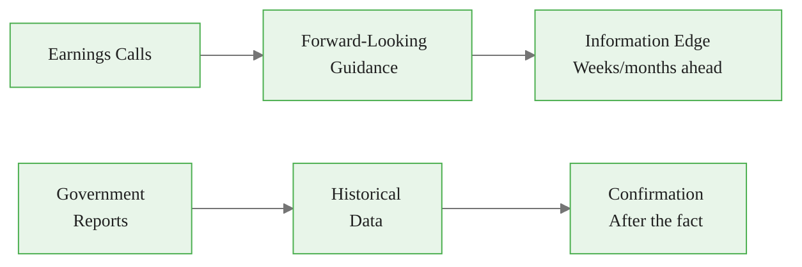
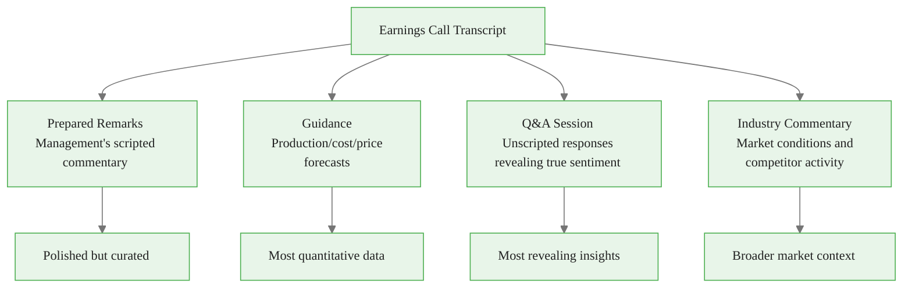
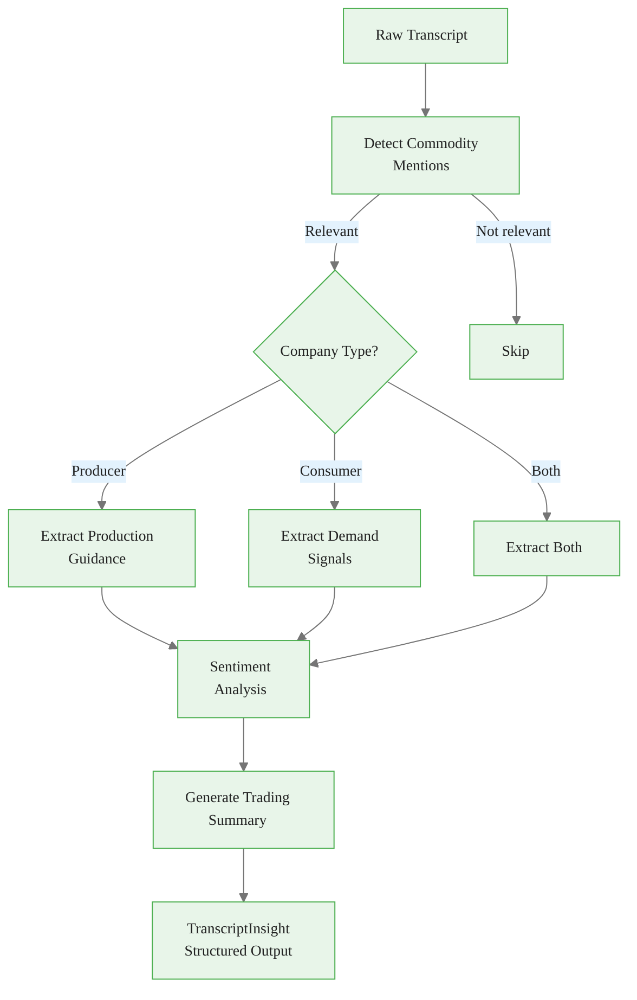
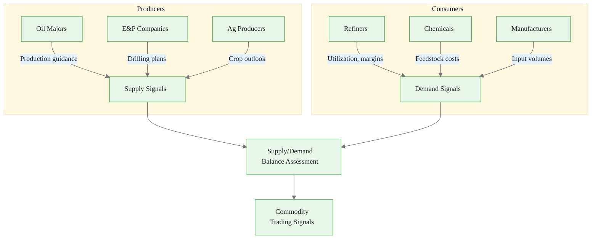
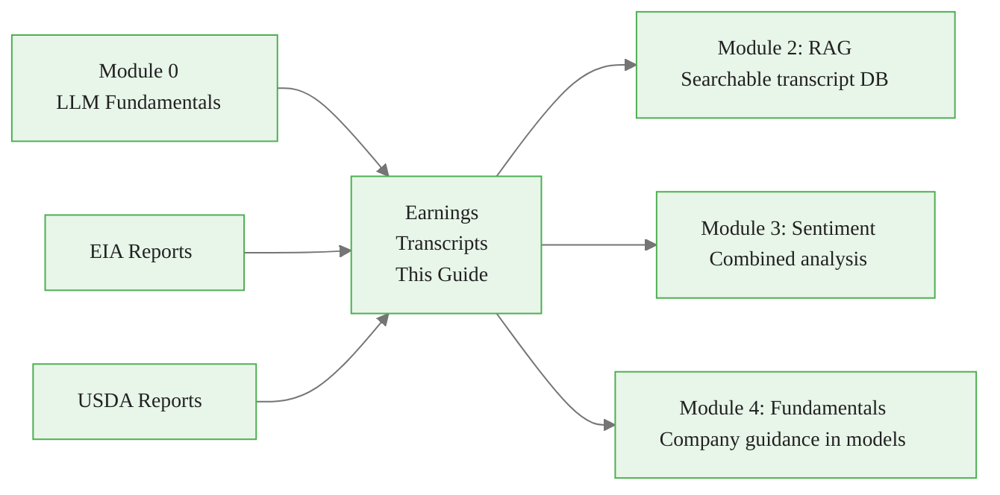

<!-- _class: lead -->

# Processing Earnings Call Transcripts for Commodity Mentions

**Module 1: Report Processing**

Extracting forward-looking commodity signals from corporate communications

<!-- Speaker notes: Section transition. Briefly preview what this section covers before diving into details. -->

---

## Why Earnings Calls Matter

**Traditional Data:** Government reports are lagging indicators (weeks/months old)
**Earnings Calls:** Forward-looking guidance from primary sources



<div class="callout-key">

Key implementation detail -- study this pattern carefully.

</div>

> Companies discuss supply/demand factors weeks or months before they appear in official statistics.

<!-- Speaker notes: Walk through the diagram step by step. Highlight the key decision points and data flow. -->

---

## Company Types and Commodity Insights

| Company Type | Commodity Insights |
|--------------|-------------------|
| Oil Majors (XOM, CVX) | Production guidance, capex, finding costs |
| Refiners (VLO, MPC) | Crack spreads, utilization, inventory |
| Chemical (DOW, LYB) | Feedstock costs, demand trends, margins |
| Agriculture (ADM, BG) | Grain merchandising, export flows, crush |
| Miners (FCX, SCCO) | Production forecasts, cost curves, demand |

<!-- Speaker notes: Review the table contents. Ask learners which rows are most relevant to their use case. -->

---

## Key Sections to Analyze



<div class="callout-insight">

This pattern recurs throughout the course. Understanding it deeply pays dividends later.

</div>

<!-- Speaker notes: Walk through the diagram step by step. Highlight the key decision points and data flow. -->

---

## Data Sources

<div class="columns">
<div>

### Free Options
- Seeking Alpha (with delay)
- SEC 8-K filings (some companies)
- Company investor relations pages

```python
def get_sec_8k_filings(ticker):
    """Some companies file transcripts
    as 8-K exhibits."""
    from sec_edgar_downloader import Downloader
    dl = Downloader(
        "Company", "email@example.com"
    )
    dl.get("8-K", ticker, limit=10)
```

<div class="callout-warning">

Watch for edge cases with this implementation in production use.

</div>

</div>
<div>

### Paid Options
- **Bloomberg** -- Full historical
- **FactSet** -- With analytics
- **Refinitiv/AlphaSense** -- Search
- **Motley Fool** -- Subscription

</div>
</div>

<!-- Speaker notes: Walk through the code, emphasizing the key patterns. Highlight which parts learners should customize for their own use cases. -->

---

<!-- _class: lead -->

# LLM-Based Extraction

From commodity mention detection to full analysis

<!-- Speaker notes: Section transition. Briefly preview what this section covers before diving into details. -->

---

<!-- Speaker notes: Cover the key points about Step 1: Commodity Mention Detection. Emphasize practical implications and connect to previous material. -->

## Step 1: Commodity Mention Detection

```python
from anthropic import Anthropic
client = Anthropic()

def detect_commodity_mentions(transcript: str) -> dict:
    """Scan transcript for commodity content."""
    prompt = """Analyze this earnings call transcript
for commodity-related information.

Return JSON:
{
  "has_commodity_content": true/false,
  "commodities_mentioned": ["crude_oil", "natural_gas"...],
  "relevance_score": 0.0-1.0,
  "key_sections": [{
    "section": "prepared_remarks|qa",
```

<div class="callout-info">

This approach follows established best practices in the field.

</div>

---

```python
    "page_or_time": "location",
    "topic": "what was discussed"
  }],
  "worth_detailed_analysis": true/false
}

Transcript excerpt (first 2000 words):
""" + transcript[:8000]

    response = client.messages.create(
        model="claude-sonnet-4-20250514",
        max_tokens=512,
        messages=[{"role": "user", "content": prompt}]
    )
    return response.content[0].text

```

<!-- Speaker notes: Walk through the code, emphasizing the key patterns. Highlight which parts learners should customize for their own use cases. -->

---

<!-- Speaker notes: Cover the key points about Step 2: Production Guidance Extraction. Emphasize practical implications and connect to previous material. -->

## Step 2: Production Guidance Extraction

```python
def extract_production_guidance(
    transcript: str, company_type: str
) -> dict:
    """Extract production forecasts and targets."""
    prompt = f"""Extract production guidance from this
{company_type} earnings call.

Return JSON:
{{
  "company": "ticker or name",
  "production": [{{
    "commodity": "crude_oil|natural_gas|copper",
    "period": "Q1 2024|FY 2024|etc",
    "guidance": {{
      "volume": <number>,
      "unit": "bpd|bcf/d|tonnes",
      "range_low": <if provided>,
```

---

```python
      "range_high": <if provided>,
      "previous_guidance": <prior estimate>,
      "change_vs_previous": <if updated>
    }},
    "confidence_level": "firm|guidance|target",
    "conditions": "assumptions mentioned"
  }}],
  "capex_plans": {{
    "total": <USD millions>,
    "period": "quarter|year"
  }},
  "key_changes": ["guidance revisions or surprises"]
}}

Transcript:
{transcript}
"""

```

<!-- Speaker notes: Walk through the code, emphasizing the key patterns. Highlight which parts learners should customize for their own use cases. -->

---

<!-- Speaker notes: Cover the key points about Step 3: Demand Signal Extraction. Emphasize practical implications and connect to previous material. -->

## Step 3: Demand Signal Extraction

```python
def extract_demand_signals(
    transcript: str, industry: str
) -> dict:
    """Extract demand indicators from consumers."""
    prompt = f"""Analyze this {industry} company earnings
call for commodity demand signals.

Focus on:
1. Input costs and feedstock prices
2. Volume/utilization trends
3. Inventory levels and strategies
4. Forward demand commentary
5. Geographic demand patterns
```

---

```python

Return JSON:
{{
  "commodity_inputs": [{{
    "commodity": "crude_oil|natural_gas|steel",
    "cost_trend": "increasing|decreasing|stable",
    "volume_consumed": {{
      "current": <value>,
      "period": "quarter/year",
      "unit": "unit"
    }},
    "commentary": "direct quote"
  }}],
  "demand_indicators": {{
    "overall_demand_trend":
      "strong|moderate|weak|declining",
    "capacity_utilization_pct": <percentage>,
    "inventory_status": "high|normal|low"
  }}
}}
"""

```

<!-- Speaker notes: Walk through the code, emphasizing the key patterns. Highlight which parts learners should customize for their own use cases. -->

---

## Transcript Processing Pipeline



<!-- Speaker notes: Walk through the diagram step by step. Highlight the key decision points and data flow. -->

---

<!-- Speaker notes: Cover the key points about Step 4: Sentiment and Tone Analysis. Emphasize practical implications and connect to previous material. -->

## Step 4: Sentiment and Tone Analysis

```python
def analyze_management_sentiment(transcript):
    """Assess management sentiment and confidence."""
    prompt = """Analyze management's tone and sentiment.

Focus on:
1. Confidence level in guidance
2. Optimism about market conditions
3. Concern about risks or headwinds
4. Changes in language vs. prior quarters

Return JSON:
{
  "overall_sentiment":
    "very_positive|positive|neutral|negative",
  "confidence_level": "high|medium|low",
```

---

```python
  "tone_shifts": [{
    "topic": "topic area",
    "tone": "description",
    "significance": "why this matters"
  }],
  "telling_phrases": [{
    "quote": "exact quote",
    "interpretation": "what this suggests",
    "context": "who said it and when"
  }],
  "red_flags": ["concerning statements"]
}

Transcript:
""" + transcript

```

> The Q&A section reveals the most about true management sentiment -- unscripted responses are harder to spin.

<!-- Speaker notes: Walk through the code, emphasizing the key patterns. Highlight which parts learners should customize for their own use cases. -->

---

<!-- _class: lead -->

# Sector-Specific Extraction

Tailored prompts for energy, refining, and agriculture

<!-- Speaker notes: Section transition. Briefly preview what this section covers before diving into details. -->

---

## Energy Sector Prompts

```python
ENERGY_EXTRACTION_PROMPT = """Extract commodity-relevant
data from this energy company earnings call.

Key metrics to find:
- Production volumes (oil, gas, NGLs) in bpd, bcf/d
- Production costs per barrel
- Reserve replacement ratios
- Drilling plans and rig counts
- Hedging positions
- M&A commentary

Return structured JSON with all numerical data and units.

Transcript:
{transcript}
"""
```

<!-- Speaker notes: Walk through the code, emphasizing the key patterns. Highlight which parts learners should customize for their own use cases. -->

---

## Refining and Agriculture Prompts

<div class="columns">
<div>

### Refining Sector

```python
REFINING_PROMPT = """Extract:
- Throughput (bpd)
- Utilization rates (%)
- Crack spreads
  (3-2-1, 5-3-2, etc.)
- Turnaround schedules
- Inventory levels
- Margin by product
  (gasoline, diesel, jet)

Transcript:
{transcript}
"""
```

</div>
<div>

### Agriculture

```python
AG_PROMPT = """Extract:
- Grain origination volumes
- Crush margins
- Export flows/destinations
- Storage/inventory strategy
- Commodity hedging
- Forward contract coverage
- Weather impact commentary

Transcript:
{transcript}
"""
```

</div>
</div>

<!-- Speaker notes: Walk through the code, emphasizing the key patterns. Highlight which parts learners should customize for their own use cases. -->

---

## Sector Signal Flow



<!-- Speaker notes: Walk through the diagram step by step. Highlight the key decision points and data flow. -->

---

<!-- _class: lead -->

# Complete Pipeline

End-to-end transcript processing system

<!-- Speaker notes: Section transition. Briefly preview what this section covers before diving into details. -->

---

## TranscriptInsight Dataclass

```python
from dataclasses import dataclass
from typing import List, Optional
from datetime import datetime

@dataclass
class TranscriptInsight:
    """Structured output from transcript analysis."""
    company: str
    ticker: str
    report_date: datetime
    commodities: List[str]
    production_guidance: dict
    demand_signals: dict
    sentiment: str
    key_quotes: List[str]
    trading_implications: str
```

<!-- Speaker notes: Walk through the code, emphasizing the key patterns. Highlight which parts learners should customize for their own use cases. -->

---

<!-- Speaker notes: Cover the key points about TranscriptProcessor. Emphasize practical implications and connect to previous material. -->

## TranscriptProcessor

```python
class TranscriptProcessor:
    """End-to-end earnings transcript processor."""

    def __init__(self, anthropic_api_key: str):
        self.client = Anthropic(api_key=anthropic_api_key)

    def process_transcript(
        self, transcript, company_name,
        ticker, company_type
    ) -> TranscriptInsight:
        # Step 1: Detect commodity relevance
        mention_check = json.loads(
            detect_commodity_mentions(transcript))

        if not mention_check['worth_detailed_analysis']:
            return None  # Skip non-relevant

```

---

```python
        # Step 2: Extract by company type
        if company_type in [
            'oil_producer', 'gas_producer', 'integrated'
        ]:
            production = extract_production_guidance(
                transcript, company_type)
            demand = {}
        elif company_type in [
            'refiner', 'chemical', 'manufacturer'
        ]:
            production = {}
            demand = extract_demand_signals(
                transcript, company_type)

        # Steps 3-5: Sentiment + Summary + Structure
        ...

```

<!-- Speaker notes: Walk through the code, emphasizing the key patterns. Highlight which parts learners should customize for their own use cases. -->

---

<!-- Speaker notes: Cover the key points about Batch Processing. Emphasize practical implications and connect to previous material. -->

## Batch Processing

```python
    def batch_process(
        self, transcripts: List[dict]
    ) -> List[TranscriptInsight]:
        """Process multiple transcripts efficiently."""
        insights = []

        for t in transcripts:
            try:
                insight = self.process_transcript(
                    t['transcript'],
                    t['company'],
```

---

```python
                    t['ticker'],
                    t['company_type']
                )
                if insight:
                    insights.append(insight)
            except Exception as e:
                print(f"Error processing "
                      f"{t['ticker']}: {e}")
                continue

        return insights

```

> Batch processing enables systematic analysis across entire earnings seasons.

<!-- Speaker notes: Walk through the code, emphasizing the key patterns. Highlight which parts learners should customize for their own use cases. -->

---

## Common Pitfalls

<div class="columns">
<div>

### Context Window Limits
Full transcripts often exceed limits

```python
def chunk_transcript(transcript):
    """Split into logical sections."""
    sections = {
        'prepared_remarks':
            extract_prepared_remarks(transcript),
        'qa_session':
            extract_qa(transcript),
        'forward_looking':
            extract_guidance_section(transcript)
    }
    return sections
```

### Industry Jargon
LLMs may misinterpret terms

<div class="code-window">
<div class="code-header">
<div class="dots"><span class="dot-red"></span><span class="dot-yellow"></span><span class="dot-green"></span></div>
<span class="filename">example.py</span>
</div>

```python
INDUSTRY_GLOSSARY = """
- bpd: barrels per day
- bcf/d: billion cubic feet per day
- 3-2-1 crack: refining margin
- turnaround: planned maintenance
"""
```

</div>

</div>
<div>

### Temporal Confusion
Mixing past results with guidance

<div class="code-window">
<div class="code-header">
<div class="dots"><span class="dot-red"></span><span class="dot-yellow"></span><span class="dot-green"></span></div>
<span class="filename">example.py</span>
</div>

```python
prompt = """
Distinguish between:
- ACTUAL RESULTS (past quarter)
- GUIDANCE (future periods)
- LONG-TERM TARGETS (multi-year)

Tag each data point with timeframe.
"""
```

</div>

### Inconsistent Formatting
Companies express guidance differently

<div class="code-window">
<div class="code-header">
<div class="dots"><span class="dot-red"></span><span class="dot-yellow"></span><span class="dot-green"></span></div>
<span class="filename">normalize_guidance.py</span>
</div>

```python
def normalize_guidance(raw_value):
    """Convert various formats to
    standard structure."""
    # "100-120 million barrels" →
    # {"low": 100, "high": 120}
    # "~500 bpd" →
    # {"point": 500, "approximate": True}
    pass
```

</div>

</div>
</div>

<!-- Speaker notes: Walk through each pitfall with a real-world example. Ask learners if they have encountered any of these in their own work. -->

---

## Connections



<!-- Speaker notes: Show how this content connects to other modules. Point learners to the next recommended deck. -->

---

## Practice Problems

1. **Basic Extraction** -- Find a recent energy company transcript. Extract production guidance for crude oil and natural gas.

2. **Comparative Analysis** -- Analyze 3 oil majors from the same quarter. Compare capex guidance and production outlooks.

3. **Demand Signal Detection** -- Process a chemical company transcript. Extract feedstock cost commentary and demand trends.

4. **Sentiment Tracking** -- Track one company's sentiment about a commodity across 4 quarters.

5. **Automated Pipeline** -- Build a system processing top 10 energy companies each quarter.

<!-- Speaker notes: Present the key concepts on this slide. Pause for questions before moving to the next topic. -->

---

## Key Takeaways

1. **Forward-looking edge** -- Earnings calls reveal supply/demand factors before official data

2. **Company type determines extraction** -- Producers yield supply signals; consumers yield demand signals

3. **Q&A is most revealing** -- Unscripted responses show true management sentiment

4. **Chunk long transcripts** -- Process by section to stay within context limits

5. **Normalize guidance formats** -- Standardize ranges, point estimates, and units for comparison

<!-- Speaker notes: Recap the main points. Ask learners which takeaway they found most surprising or useful. -->
