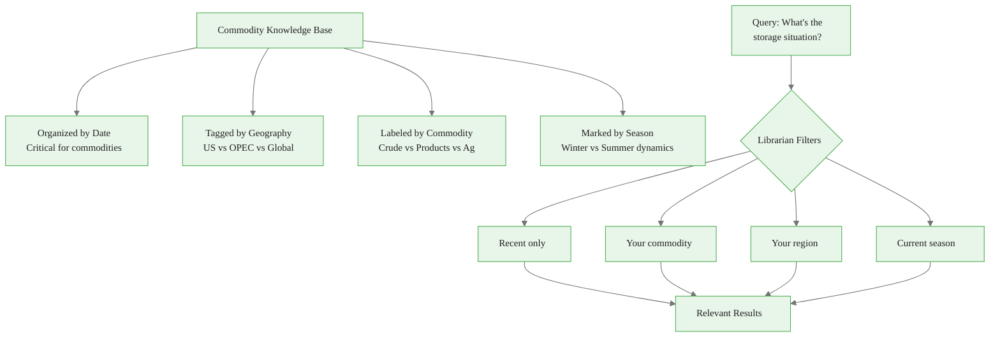
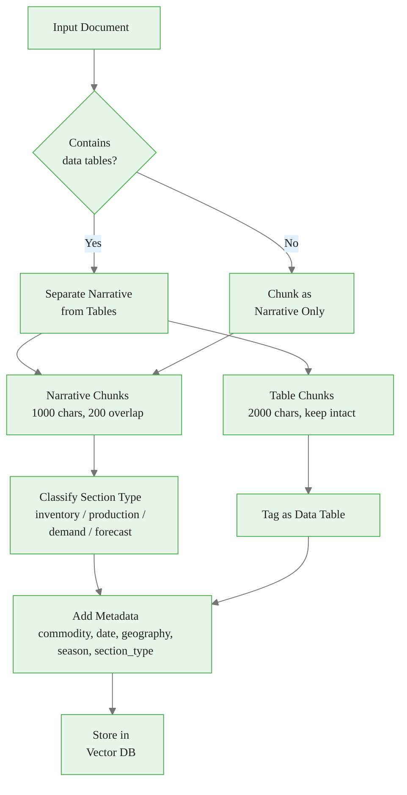
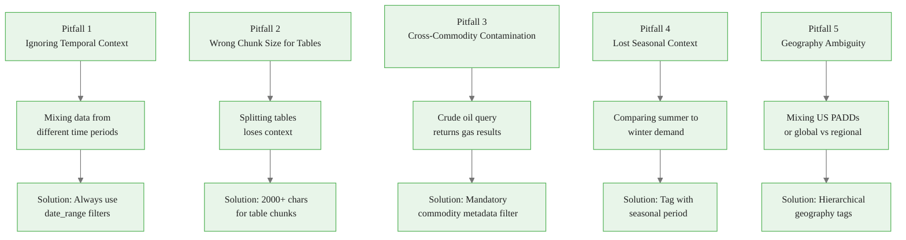
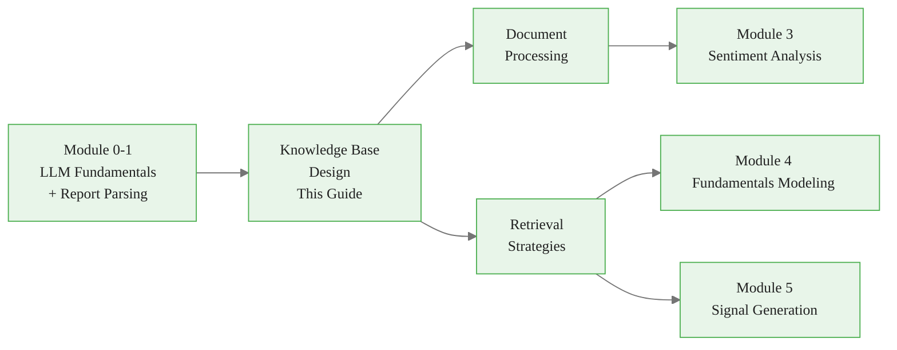

<!-- _class: lead -->

# Knowledge Base Design for Commodity Research

**Module 2: RAG Research**

Structuring commodity data for intelligent retrieval

<!-- Speaker notes: Section transition. Briefly preview what this section covers before diving into details. -->

---

## In Brief

A commodity knowledge base structures unstructured data (EIA reports, weather forecasts, corporate filings) into retrievable chunks optimized for LLM context windows while preserving temporal, geographical, and commodity-specific relationships.

> Commodity data requires time-aware chunking because "crude oil inventory" has drastically different meanings based on date, location, and market context.

<!-- Speaker notes: Present the key concepts on this slide. Pause for questions before moving to the next topic. -->

---

## Formal Definition

A commodity knowledge base is a tuple $KB = (D, C, E, M)$ where:

- $D$ = set of source documents (reports, transcripts, news)
- $C$ = chunking strategy mapping $D \to$ text segments with metadata
- $E$ = embedding function mapping chunks $\to$ vector space
- $M$ = metadata schema \{commodity, date, location, report\_type, seasonality\}

**Retrieval function:** $R(query, k) \to$ top-k chunks by semantic similarity + metadata filters

<!-- Speaker notes: Present the formal definition but keep focus on practical implications. Reference back to the intuitive explanation. -->

---

## The Commodity Library Analogy



<div class="callout-key">

Key implementation detail -- study this pattern carefully.

</div>

<!-- Speaker notes: Walk through the diagram step by step. Highlight the key decision points and data flow. -->

---

## Design Principles

1. **Temporal coherence** -- Preserve time relationships
2. **Commodity separation** -- Avoid cross-contamination
3. **Geography awareness** -- Regional variations matter
4. **Data vs. narrative separation** -- Different chunking for tables

<!-- Speaker notes: Present the key concepts on this slide. Pause for questions before moving to the next topic. -->

---

<!-- _class: lead -->

# Core Data Structures

Enums, documents, and chunks

<!-- Speaker notes: Section transition. Briefly preview what this section covers before diving into details. -->

---

<!-- Speaker notes: Cover the key points about Type Definitions. Emphasize practical implications and connect to previous material. -->

## Type Definitions

```python
from dataclasses import dataclass
from datetime import datetime
from typing import List, Dict, Optional
from enum import Enum

class CommodityType(Enum):
    CRUDE_OIL = "crude_oil"
    NATURAL_GAS = "natural_gas"
    GASOLINE = "gasoline"
    DISTILLATES = "distillates"
    CORN = "corn"
    WHEAT = "wheat"
    SOYBEANS = "soybeans"
    GOLD = "gold"
    COPPER = "copper"
```

<div class="callout-insight">

This pattern recurs throughout the course. Understanding it deeply pays dividends later.

</div>

---

```python

class ReportType(Enum):
    EIA_WPSR = "eia_wpsr"
    EIA_NGSR = "eia_natural_gas_storage"
    USDA_WASDE = "usda_wasde"
    USDA_CROP_PROGRESS = "usda_crop_progress"
    EARNINGS_CALL = "earnings_call"
    NEWS_ARTICLE = "news_article"

```

<div class="callout-warning">

Watch for edge cases with this implementation in production use.

</div>

<!-- Speaker notes: Walk through the code, emphasizing the key patterns. Highlight which parts learners should customize for their own use cases. -->

---

## CommodityDocument and CommodityChunk

<div class="columns">
<div>

```python
@dataclass
class CommodityDocument:
    """Source document with metadata."""
    doc_id: str
    content: str
    commodity: CommodityType
    report_type: ReportType
    report_date: datetime
    geography: str
    source_url: Optional[str]
```

<div class="callout-info">

This approach follows established best practices in the field.

</div>

</div>
<div>

```python
@dataclass
class CommodityChunk:
    """Text chunk with rich metadata."""
    chunk_id: str
    text: str
    commodity: CommodityType
    report_type: ReportType
    report_date: datetime
    geography: str
    section_type: str
    contains_data_table: bool
    seasonal_period: str
```

</div>
</div>

> Chunks carry all the metadata needed for intelligent filtering at query time.

<!-- Speaker notes: Walk through the code, emphasizing the key patterns. Highlight which parts learners should customize for their own use cases. -->

---

<!-- _class: lead -->

# CommodityKnowledgeBase Class

Initialization, chunking, and retrieval

<!-- Speaker notes: Section transition. Briefly preview what this section covers before diving into details. -->

---

<!-- Speaker notes: Cover the key points about Initialization. Emphasize practical implications and connect to previous material. -->

## Initialization

```python
import chromadb
from langchain.text_splitter import (
    RecursiveCharacterTextSplitter
)
from anthropic import Anthropic

class CommodityKnowledgeBase:
    def __init__(self, collection_name="commodity_kb"):
        self.client = chromadb.Client()
        self.collection = self.client.create_collection(
            name=collection_name,
            metadata={
                "description": "Commodity market intelligence"
            }
        )
        self.anthropic_client = Anthropic()
```

---

```python

        # Different splitters for different content
        self.narrative_splitter = (
            RecursiveCharacterTextSplitter(
                chunk_size=1000, chunk_overlap=200,
                separators=["\n\n", "\n", ". ", " "]
            ))
        self.table_splitter = (
            RecursiveCharacterTextSplitter(
                chunk_size=2000, chunk_overlap=100,
                separators=["\n\n", "\n"]
            ))

```

<!-- Speaker notes: Walk through the code, emphasizing the key patterns. Highlight which parts learners should customize for their own use cases. -->

---

## Chunking Strategy



<!-- Speaker notes: Walk through the diagram step by step. Highlight the key decision points and data flow. -->

---

## Adding Documents

```python
    def add_document(self, doc: CommodityDocument):
        """Add document with intelligent chunking."""
        has_tables = self._detect_tables(doc.content)

        if has_tables:
            narrative, tables = self._separate_tables(
                doc.content)
            chunks = self._chunk_narrative(narrative, doc)
            chunks.extend(self._chunk_tables(tables, doc))
        else:
            chunks = self._chunk_narrative(
                doc.content, doc)

        for chunk in chunks:
            self._add_chunk(chunk)
```

<!-- Speaker notes: Walk through the code, emphasizing the key patterns. Highlight which parts learners should customize for their own use cases. -->

---

<!-- Speaker notes: Cover the key points about Table Detection and Separation. Emphasize practical implications and connect to previous material. -->

## Table Detection and Separation

<div class="columns">
<div>

```python
    def _detect_tables(self, text):
        """Detect data tables using LLM."""
        prompt = f"""Does this text contain
data tables with numerical values?
Reply with only "yes" or "no".

Text:
{text[:500]}..."""
```

---

<!-- Speaker notes: Cover the key points about this slide. Emphasize practical implications and connect to previous material. -->

```python

        response = (
            self.anthropic_client
            .messages.create(
                model="claude-sonnet-4-20250514",
                max_tokens=10,
                messages=[{
                    "role": "user",
                    "content": prompt
                }]
            ))
        return "yes" in (
            response.content[0].text.lower()
        )

```

</div>
<div>

```python
    def _separate_tables(self, text):
        """Separate narrative from tables."""
        prompt = f"""Separate into:
1. Narrative analysis (prose)
2. Data tables (structured data)

Return as JSON:
{{
  "narrative": "...",
  "tables": ["table1", ...]
}}

Report:
{text}"""
```

---

```python

        response = (
            self.anthropic_client
            .messages.create(
                model="claude-sonnet-4-20250514",
                max_tokens=4096,
                messages=[{
                    "role": "user",
                    "content": prompt
                }]
            ))
        result = json.loads(
            response.content[0].text)
        return (result["narrative"],
                result["tables"])

```

</div>
</div>

<!-- Speaker notes: Walk through the code, emphasizing the key patterns. Highlight which parts learners should customize for their own use cases. -->

---

<!-- Speaker notes: Cover the key points about Section Classification and Seasonality. Emphasize practical implications and connect to previous material. -->

## Section Classification and Seasonality

```python
    def _classify_section(self, text: str) -> str:
        """Classify section type for targeted retrieval."""
        prompt = f"""What is the primary focus of this text?
Choose ONE: inventory, production, demand, forecast,
            price_analysis, geopolitical

Text: {text[:300]}..."""

        response = self.anthropic_client.messages.create(
            model="claude-sonnet-4-20250514",
            max_tokens=20,
            messages=[{"role": "user", "content": prompt}]
        )
        return response.content[0].text.strip()
```

---

```python

    def _infer_season(self, report_date: datetime) -> str:
        """Infer seasonal period (critical for commodities)."""
        month = report_date.month
        if month in [12, 1, 2]:
            return "winter"
        elif month in [3, 4, 5]:
            return "spring"
        elif month in [6, 7, 8]:
            return "summer"
        else:
            return "fall"

```

<!-- Speaker notes: Walk through the code, emphasizing the key patterns. Highlight which parts learners should customize for their own use cases. -->

---

## Storing Chunks with Metadata

```python
    def _add_chunk(self, chunk: CommodityChunk):
        """Add chunk to vector store with metadata."""
        metadata = {
            "commodity": chunk.commodity.value,
            "report_type": chunk.report_type.value,
            "report_date": chunk.report_date.isoformat(),
            "geography": chunk.geography,
            "section_type": chunk.section_type,
            "contains_table": chunk.contains_data_table,
            "season": chunk.seasonal_period,
            "year": chunk.report_date.year,
            "month": chunk.report_date.month
        }

        self.collection.add(
            documents=[chunk.text],
            metadatas=[metadata],
            ids=[chunk.chunk_id]
        )
```

> Rich metadata enables precise filtering at query time -- the key advantage over naive RAG.

<!-- Speaker notes: Walk through the code, emphasizing the key patterns. Highlight which parts learners should customize for their own use cases. -->

---

<!-- _class: lead -->

# Retrieval with Filters

Querying the knowledge base

<!-- Speaker notes: Section transition. Briefly preview what this section covers before diving into details. -->

---

<!-- Speaker notes: Cover the key points about Filtered Retrieval. Emphasize practical implications and connect to previous material. -->

## Filtered Retrieval

```python
    def retrieve(
        self,
        query: str,
        commodity: Optional[CommodityType] = None,
        date_range: Optional[tuple] = None,
        geography: Optional[str] = None,
        top_k: int = 5
    ) -> List[CommodityChunk]:
        """Retrieve with metadata filtering."""
        where = {}
        if commodity:
            where["commodity"] = commodity.value
        if geography:
            where["geography"] = geography
```

---

<div class="code-window">
<div class="code-header">
<div class="dots"><span class="dot-red"></span><span class="dot-yellow"></span><span class="dot-green"></span></div>
<span class="filename">example.py</span>
</div>

```python
        if date_range:
            where["report_date"] = {
                "$gte": date_range[0].isoformat(),
                "$lte": date_range[1].isoformat()
            }

        results = self.collection.query(
            query_texts=[query],
            n_results=top_k,
            where=where if where else None
        )
        # ... reconstruct CommodityChunk objects
        return chunks

```

</div>

<!-- Speaker notes: Walk through the code, emphasizing the key patterns. Highlight which parts learners should customize for their own use cases. -->

---

<!-- Speaker notes: Cover the key points about Example Usage. Emphasize practical implications and connect to previous material. -->

## Example Usage

<div class="code-window">
<div class="code-header">
<div class="dots"><span class="dot-red"></span><span class="dot-yellow"></span><span class="dot-green"></span></div>
<span class="filename">example.py</span>
</div>

```python
from datetime import datetime, timedelta

kb = CommodityKnowledgeBase()

# Add an EIA weekly petroleum report
wpsr_doc = CommodityDocument(
    doc_id="wpsr_2024_11_13",
    content="U.S. commercial crude oil inventories...",
    commodity=CommodityType.CRUDE_OIL,
    report_type=ReportType.EIA_WPSR,
    report_date=datetime(2024, 11, 13),
    geography="US",
    source_url="https://www.eia.gov/..."
)
kb.add_document(wpsr_doc)
```

</div>

---

<div class="code-window">
<div class="code-header">
<div class="dots"><span class="dot-red"></span><span class="dot-yellow"></span><span class="dot-green"></span></div>
<span class="filename">example.py</span>
</div>

```python

# Retrieve with filters
results = kb.retrieve(
    query="crude oil inventory situation",
    commodity=CommodityType.CRUDE_OIL,
    date_range=(datetime(2024, 11, 1),
                datetime(2024, 11, 30)),
    geography="US", top_k=3
)

```

</div>

<!-- Speaker notes: Walk through the code, emphasizing the key patterns. Highlight which parts learners should customize for their own use cases. -->

---

## Common Pitfalls



<!-- Speaker notes: Walk through each pitfall with a real-world example. Ask learners if they have encountered any of these in their own work. -->

---

## Key Takeaways

1. **Temporal coherence is critical** -- Commodity data without dates is meaningless

2. **Separate tables from narrative** -- Different content types need different chunking

3. **Rich metadata enables precision** -- Commodity, date, geography, season, section type

4. **Filter before similarity** -- Metadata filters prevent cross-contamination

5. **Seasonality matters** -- Winter gas storage is not comparable to summer

<!-- Speaker notes: Recap the main points. Ask learners which takeaway they found most surprising or useful. -->

---

## Connections



<!-- Speaker notes: Show how this content connects to other modules. Point learners to the next recommended deck. -->
