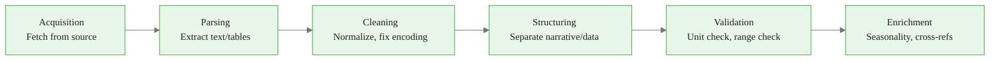
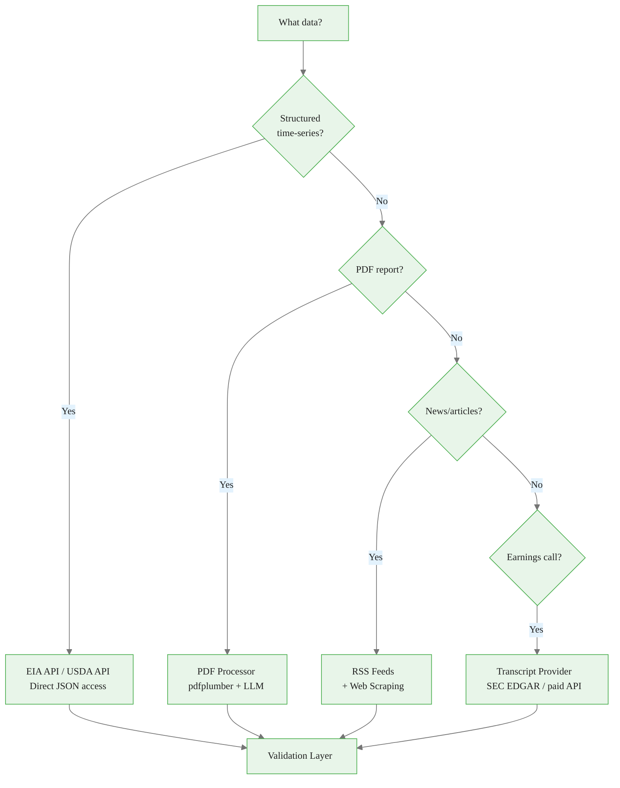
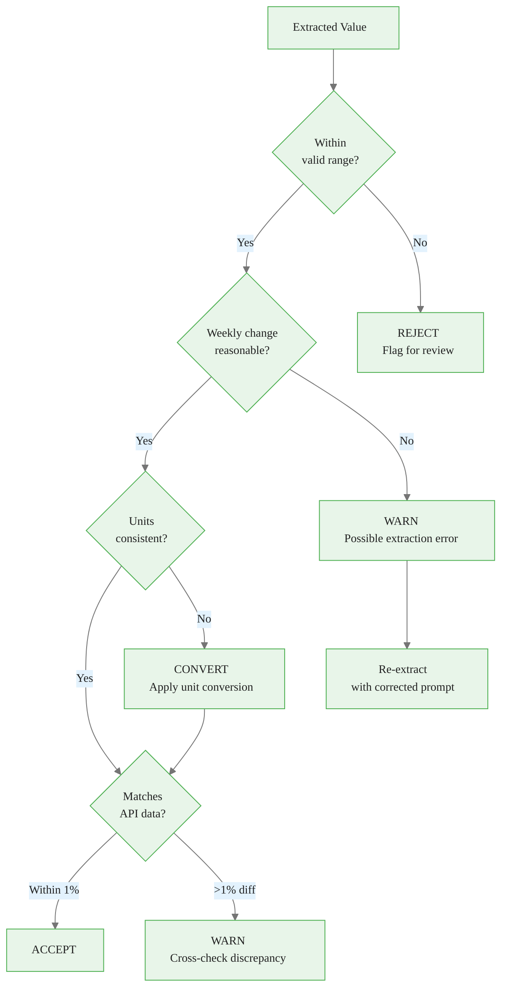
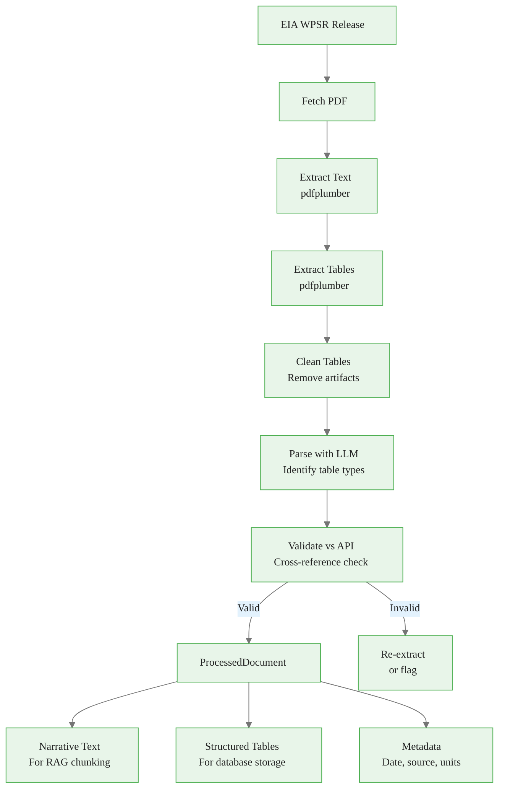
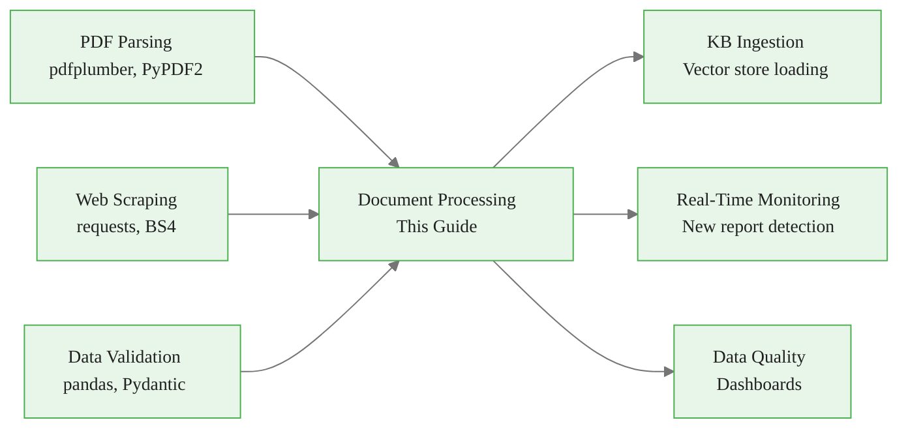

<!-- _class: lead -->

# Processing Commodity Documents for RAG Systems

**Module 2: RAG Research**

Transforming heterogeneous reports into LLM-ready formats

<!-- Speaker notes: Section transition. Briefly preview what this section covers before diving into details. -->

---

## In Brief

Commodity document processing transforms heterogeneous reports (PDFs, HTML tables, time-series data) into LLM-ready formats while preserving critical metadata (timestamps, units, geographies) and handling commodity-specific challenges.

> The value isn't just in the text -- it's in the structured data. A crude oil inventory number without its date, unit, and geography is meaningless.

<!-- Speaker notes: Present the key concepts on this slide. Pause for questions before moving to the next topic. -->

---

## Processing Pipeline Definition

$P: D_{raw} \to D_{structured}$ where:

**Input:** $D_{raw}$ = raw document (PDF, HTML, CSV, API response)

**Output:** $D_{structured}$ = (text, data\_tables, metadata, validation\_status)



<div class="callout-key">

Key implementation detail -- study this pattern carefully.

</div>

<!-- Speaker notes: Walk through the diagram step by step. Highlight the key decision points and data flow. -->

---

## Cooking Analogy

Think of processing commodity documents like preparing ingredients:

- **Raw ingredients** (PDFs, HTML) arrive in different packaging
- **Unpack** them (parsing), **wash** them (cleaning), **prep** them (structuring)
- **Liquids** (narrative text) and **solids** (data tables) -- handle differently
- **Check for spoilage** (validation) -- bad data ruins the whole dish
- **Label everything** (metadata) -- you need to know what and when

> Commodity reports are like IKEA instructions in multiple languages with missing pages and tables spanning multiple sheets.

<!-- Speaker notes: Use the analogy to build intuition before diving into the formal definition. Ask learners if the analogy resonates. -->

---

<!-- _class: lead -->

# Document Acquisition Layer

Fetching from EIA, USDA, news, and more

<!-- Speaker notes: Section transition. Briefly preview what this section covers before diving into details. -->

---

<!-- Speaker notes: Cover the key points about Source Types and Data Structures. Emphasize practical implications and connect to previous material. -->

## Source Types and Data Structures

```python
from enum import Enum
from dataclasses import dataclass
from datetime import datetime
from typing import Dict

class DocumentSource(Enum):
    EIA_API = "eia_api"
    EIA_PDF = "eia_pdf"
    USDA_REPORT = "usda_report"
    EARNINGS_TRANSCRIPT = "earnings_transcript"
    NEWS_RSS = "news_rss"
```

<div class="callout-insight">

This pattern recurs throughout the course. Understanding it deeply pays dividends later.

</div>

---

```python

@dataclass
class RawDocument:
    """Raw document before processing."""
    source: DocumentSource
    content: bytes | str
    url: str
    fetch_date: datetime
    metadata: Dict

```

<div class="callout-warning">

Watch for edge cases with this implementation in production use.

</div>

<!-- Speaker notes: Walk through the code, emphasizing the key patterns. Highlight which parts learners should customize for their own use cases. -->

---

<!-- Speaker notes: Cover the key points about Fetching EIA Reports. Emphasize practical implications and connect to previous material. -->

## Fetching EIA Reports

```python
class DocumentAcquisition:
    def __init__(self, eia_api_key: str):
        self.eia_api_key = eia_api_key

    def fetch_eia_report(self, report_type, report_date=None):
        """Fetch EIA report from their website."""
        if report_type == "wpsr":
            if report_date is None:
                report_date = self._get_last_wednesday()
            url = ("https://www.eia.gov/petroleum/"
                   "supply/weekly/pdf/wpsrall.pdf")
            response = requests.get(url)
```

<div class="callout-info">

This approach follows established best practices in the field.

</div>

---

```python
            response.raise_for_status()
            return RawDocument(
                source=DocumentSource.EIA_PDF,
                content=response.content,
                url=url,
                fetch_date=datetime.now(),
                metadata={
                    "report_type": report_type,
                    "report_date": report_date,
                    "commodity": "petroleum"
                }
            )

```

<!-- Speaker notes: Walk through the code, emphasizing the key patterns. Highlight which parts learners should customize for their own use cases. -->

---

<!-- Speaker notes: Cover the key points about Fetching EIA API Time-Series. Emphasize practical implications and connect to previous material. -->

## Fetching EIA API Time-Series

```python
    def fetch_eia_api_data(
        self, series_id, start_date, end_date
    ):
        """Fetch time-series data from EIA API.

        Common series IDs:
        - PET.WCESTUS1.W: Weekly crude oil stocks
        - NG.NW2_EPG0_SWO_R48_BCF.W: Gas storage
        """
        base_url = "https://api.eia.gov/v2"
        params = {
            "api_key": self.eia_api_key,
            "frequency": "weekly",
            "data[0]": "value",
            "start": start_date.strftime("%Y-%m-%d"),
            "end": end_date.strftime("%Y-%m-%d"),
            "sort[0][column]": "period",
            "sort[0][direction]": "desc"
        }
```

---

```python

        if series_id.startswith("PET"):
            endpoint = f"{base_url}/petroleum/sum/sndw/data"
        elif series_id.startswith("NG"):
            endpoint = f"{base_url}/natural-gas/sum/sndw/data"

        params["facets[series][]"] = series_id
        response = requests.get(endpoint, params=params)
        response.raise_for_status()
        return RawDocument(...)

```

<!-- Speaker notes: Walk through the code, emphasizing the key patterns. Highlight which parts learners should customize for their own use cases. -->

---

<!-- Speaker notes: Cover the key points about Fetching USDA and News. Emphasize practical implications and connect to previous material. -->

## Fetching USDA and News

<div class="columns">
<div>

### USDA Reports
```python
    def fetch_usda_report(self, report_type):
        if report_type == "wasde":
            url = ("https://www.usda.gov/oce/"
                   "commodity/wasde/latest.pdf")
            response = requests.get(url)
            return RawDocument(
                source=DocumentSource.USDA_REPORT,
                content=response.content,
                url=url,
                fetch_date=datetime.now(),
                metadata={
                    "report_type": "wasde",
                    "commodity": "agriculture"
                }
            )
```

</div>
<div>

### Commodity News (RSS)
```python
    def fetch_commodity_news(
        self, commodity, hours_back=24
    ):
        feeds = {
            "energy": [
                "rigzone.com/news/rss.aspx",
                "naturalgasintel.com/feed/"
            ],
            "agriculture": [
                "agriculture.com/rss"
            ]
        }
```

---

```python

        documents = []
        for feed_url in feeds.get(
            commodity, []
        ):
            feed = feedparser.parse(feed_url)
            for entry in feed.entries:
                # Filter by recency
                ...
                documents.append(
                    RawDocument(...))
        return documents

```

</div>
</div>

<!-- Speaker notes: Walk through the code, emphasizing the key patterns. Highlight which parts learners should customize for their own use cases. -->

---

## Document Source Decision Tree



<!-- Speaker notes: Walk through the diagram step by step. Highlight the key decision points and data flow. -->

---

<!-- _class: lead -->

# PDF Processing with Table Extraction

Handling the most challenging commodity document format

<!-- Speaker notes: Section transition. Briefly preview what this section covers before diving into details. -->

---

<!-- Speaker notes: Cover the key points about PDFProcessor Class. Emphasize practical implications and connect to previous material. -->

## PDFProcessor Class

```python
from anthropic import Anthropic
import pdfplumber
import pandas as pd

class PDFProcessor:
    """Process commodity PDF reports."""

    def __init__(self):
        self.anthropic_client = Anthropic()

    def process_pdf(self, pdf_bytes: bytes) -> Dict:
        """Extract text and tables from PDF."""
        with pdfplumber.open(io.BytesIO(pdf_bytes)) as pdf:
            full_text = ""
            tables = []
            for page in pdf.pages:
                page_text = page.extract_text()
                full_text += page_text + "\n\n"
```

---

```python

                page_tables = page.extract_tables()
                for table in page_tables:
                    if table:
                        df = pd.DataFrame(
                            table[1:], columns=table[0])
                        tables.append(df)

        return {
            "text": full_text,
            "tables": tables,
            "page_count": len(pdf.pages)
        }

```

<!-- Speaker notes: Walk through the code, emphasizing the key patterns. Highlight which parts learners should customize for their own use cases. -->

---

<!-- Speaker notes: Cover the key points about Table Cleaning. Emphasize practical implications and connect to previous material. -->

## Table Cleaning

```python
    def clean_table(self, df: pd.DataFrame):
        """Clean extracted table data."""
        # Remove empty rows/columns
        df = df.dropna(how='all').dropna(
            axis=1, how='all')

        # Strip whitespace
        for col in df.columns:
            if df[col].dtype == 'object':
                df[col] = df[col].str.strip()
```

---

```python

        # Convert numeric columns
        for col in df.columns:
            try:
                df[col] = pd.to_numeric(
                    df[col], errors='ignore')
            except:
                pass

        return df

```

<!-- Speaker notes: Walk through the code, emphasizing the key patterns. Highlight which parts learners should customize for their own use cases. -->

---

<!-- Speaker notes: Cover the key points about LLM-Assisted Table Parsing. Emphasize practical implications and connect to previous material. -->

## LLM-Assisted Table Parsing

```python
    def parse_eia_wpsr_table(self, table_df):
        """Parse EIA WPSR tables using LLM."""
        table_text = table_df.to_string()

        prompt = f"""Identify this EIA table type
and extract data.

Table:
{table_text}

Return JSON:
{{
  "table_type":
    "inventory|supply|demand|imports|exports",
  "unit":
    "thousand_barrels|million_barrels|bpd",
```

---

```python
  "time_columns":
    ["current_week", "prior_week", "year_ago"],
  "products": [
    {{"product": "crude_oil",
      "current_week": 430000,
      "prior_week": 435200}}
  ]
}}"""

        response = self.anthropic_client.messages.create(
            model="claude-sonnet-4-20250514",
            max_tokens=2048,
            messages=[{"role": "user", "content": prompt}]
        )
        return json.loads(response.content[0].text)

```

<!-- Speaker notes: Walk through the code, emphasizing the key patterns. Highlight which parts learners should customize for their own use cases. -->

---

<!-- _class: lead -->

# Data Validation Layer

Ensuring extraction accuracy and consistency

<!-- Speaker notes: Section transition. Briefly preview what this section covers before diving into details. -->

---

<!-- Speaker notes: Cover the key points about DataValidator Class. Emphasize practical implications and connect to previous material. -->

## DataValidator Class

```python
class DataValidator:
    """Validate commodity data quality."""

    def __init__(self):
        self.valid_ranges = {
            "crude_oil_inventory_mmb": (200, 600),
            "gasoline_inventory_mmb": (180, 260),
            "natural_gas_storage_bcf": (1000, 4500),
            "corn_production_million_bu": (8000, 16000),
            "refinery_utilization_pct": (70, 100)
        }
```

---

```python

        self.max_weekly_changes = {
            "crude_oil_inventory_mmb": 20,
            "gasoline_inventory_mmb": 10,
            "natural_gas_storage_bcf": 150
        }

    def validate_value(self, metric, value, commodity):
        """Check if value is within reasonable range."""
        if metric not in self.valid_ranges:
            return True, ""
        min_val, max_val = self.valid_ranges[metric]
        if not (min_val <= value <= max_val):
            return False, f"{metric} {value} outside [{min_val}, {max_val}]"
        return True, ""

```

<!-- Speaker notes: Walk through the code, emphasizing the key patterns. Highlight which parts learners should customize for their own use cases. -->

---

## Validation Checks



<!-- Speaker notes: Walk through the diagram step by step. Highlight the key decision points and data flow. -->

---

<!-- Speaker notes: Cover the key points about Cross-Reference Validation. Emphasize practical implications and connect to previous material. -->

## Cross-Reference Validation

```python
    def cross_reference_api_vs_pdf(
        self, api_value, pdf_value, tolerance_pct=1.0
    ):
        """Validate that API matches PDF report."""
        diff_pct = (
            abs(api_value - pdf_value) / api_value * 100
        )
        if diff_pct > tolerance_pct:
            return False, (
                f"API/PDF mismatch: {api_value} vs "
                f"{pdf_value} ({diff_pct:.1f}% diff)")
        return True, ""

```

---

```python
    def validate_weekly_change(
        self, metric, current, prior
    ):
        """Check if weekly change is reasonable."""
        if metric not in self.max_weekly_changes:
            return True, ""
        change = abs(current - prior)
        max_change = self.max_weekly_changes[metric]
        if change > max_change:
            return False, (
                f"Weekly change {change} exceeds "
                f"max {max_change}")
        return True, ""

```

<!-- Speaker notes: Walk through the code, emphasizing the key patterns. Highlight which parts learners should customize for their own use cases. -->

---

<!-- _class: lead -->

# Complete Processing Pipeline

End-to-end document processing

<!-- Speaker notes: Section transition. Briefly preview what this section covers before diving into details. -->

---

## ProcessedDocument Structure

```python
@dataclass
class ProcessedDocument:
    """Fully processed commodity document."""
    original_source: DocumentSource
    narrative_text: str
    data_tables: List[pd.DataFrame]
    metadata: Dict
    validation_results: Dict
    processing_date: datetime
```

<!-- Speaker notes: Walk through the code, emphasizing the key patterns. Highlight which parts learners should customize for their own use cases. -->

---

<!-- Speaker notes: Cover the key points about CommodityDocumentProcessor. Emphasize practical implications and connect to previous material. -->

## CommodityDocumentProcessor

<div class="code-window">
<div class="code-header">
<div class="dots"><span class="dot-red"></span><span class="dot-yellow"></span><span class="dot-green"></span></div>
<span class="filename">commoditydocumentprocessor.py</span>
</div>

```python
class CommodityDocumentProcessor:
    """End-to-end processing pipeline."""

    def __init__(self, eia_api_key: str):
        self.acquisition = DocumentAcquisition(
            eia_api_key)
        self.pdf_processor = PDFProcessor()
        self.validator = DataValidator()

    def process_eia_wpsr(self, report_date=None):
        """Process complete EIA WPSR."""
        # Step 1: Acquire
        raw_pdf = self.acquisition.fetch_eia_report(
            "wpsr", report_date)
```

</div>

---

<div class="code-window">
<div class="code-header">
<div class="dots"><span class="dot-red"></span><span class="dot-yellow"></span><span class="dot-green"></span></div>
<span class="filename">example.py</span>
</div>

```python
        # Step 2: Extract
        extracted = self.pdf_processor.process_pdf(
            raw_pdf.content)
        # Step 3: Clean and structure tables
        processed_tables = []
        for table_df in extracted["tables"]:
            cleaned = self.pdf_processor.clean_table(
                table_df)
            if not cleaned.empty:
                structured = (
                    self.pdf_processor
                    .parse_eia_wpsr_table(cleaned))
                processed_tables.append(structured)
        # Steps 4-5: Validate and return
        ...

```

</div>

<!-- Speaker notes: Walk through the code, emphasizing the key patterns. Highlight which parts learners should customize for their own use cases. -->

---

## Full Pipeline Flow



<!-- Speaker notes: Walk through the diagram step by step. Highlight the key decision points and data flow. -->

---

## Common Pitfalls

<div class="columns">
<div>

### PDF Extraction Errors
Tables span multiple pages or have merged cells

**Solution:** Use LLM to reconstruct broken tables; validate against API

### Unit Confusion
Mixing thousand barrels with million barrels

**Solution:** Mandatory unit extraction and validation; convert to standard units

### Assuming Clean Data
OCR errors, typos, missing values

**Solution:** Range validation, cross-referencing, outlier detection

</div>
<div>

### Missing Revisions
Historical data gets revised

**Solution:** Track revision numbers; update KB when revisions published

### Timezone Issues
Mixing UTC with local times

**Solution:** Store all timestamps in UTC with timezone metadata

<div class="code-window">
<div class="code-header">
<div class="dots"><span class="dot-red"></span><span class="dot-yellow"></span><span class="dot-green"></span></div>
<span class="filename">example.py</span>
</div>

```python
# EIA releases at 10:30 AM ET
# USDA times vary by report
# Always normalize to UTC
from pytz import timezone
eastern = timezone('US/Eastern')
```

</div>

</div>
</div>

<!-- Speaker notes: Walk through each pitfall with a real-world example. Ask learners if they have encountered any of these in their own work. -->

---

## Key Takeaways

1. **Multiple acquisition sources** -- EIA API, PDFs, USDA, RSS feeds each need specific handlers

2. **Tables need special treatment** -- pdfplumber + LLM for robust extraction

3. **Validate everything** -- Range checks, unit checks, API cross-references

4. **Metadata is essential** -- Date, source, units, geography must travel with the data

5. **Build for revision handling** -- Commodity data gets revised; track versions

<!-- Speaker notes: Recap the main points. Ask learners which takeaway they found most surprising or useful. -->

---

## Connections



<!-- Speaker notes: Show how this content connects to other modules. Point learners to the next recommended deck. -->
