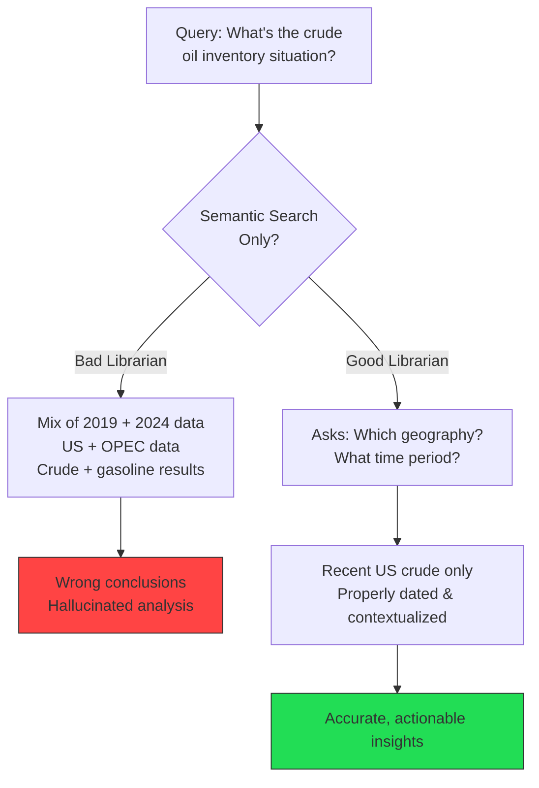
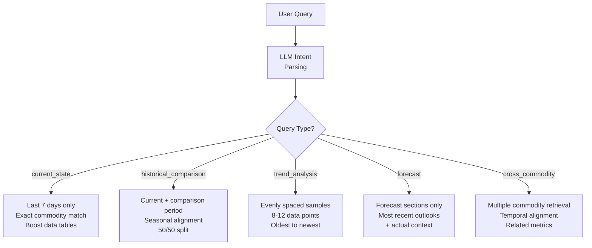
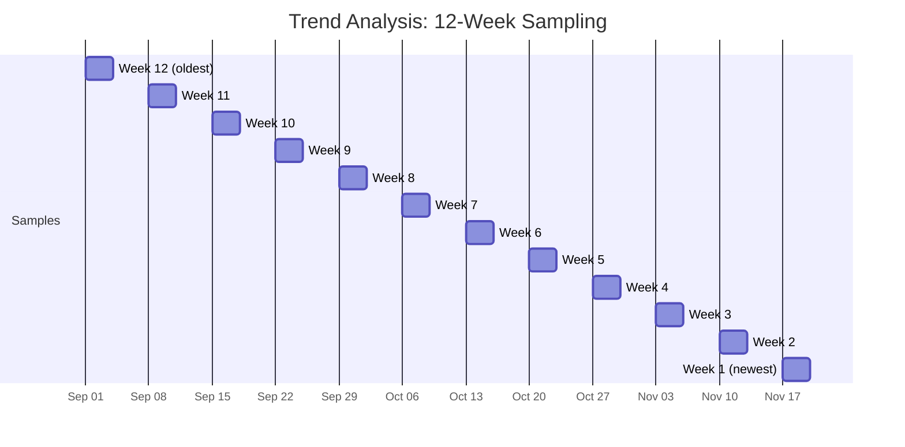
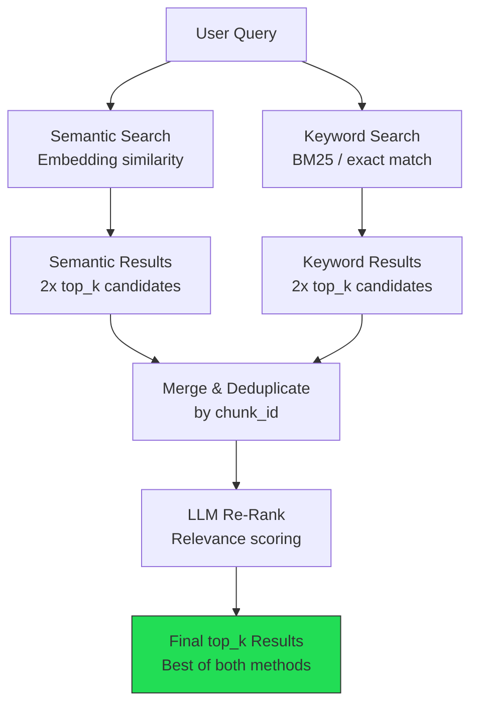
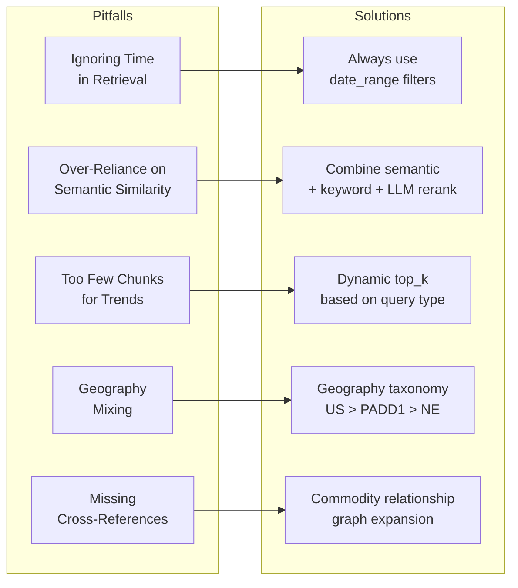
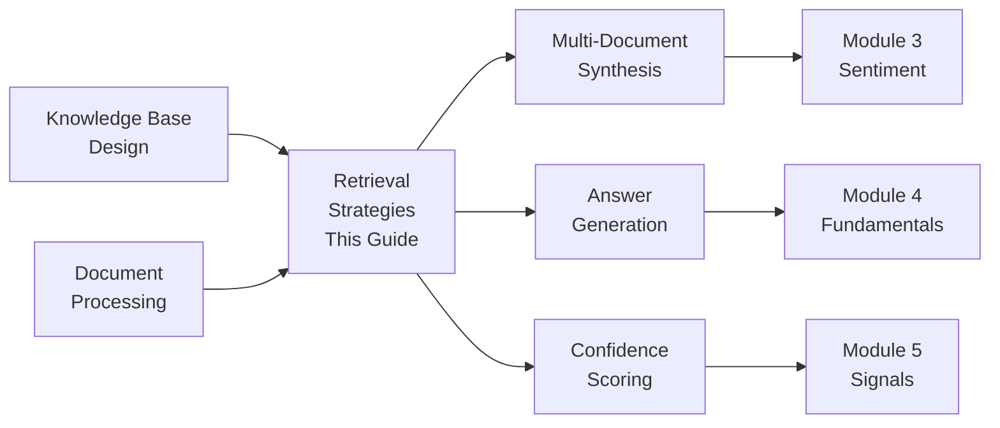

<!-- _class: lead -->

# Retrieval Strategies for Commodity Analysis

**Module 2: RAG Research**

Multi-dimensional retrieval that respects time, space, and domain boundaries

<!-- Speaker notes: Section transition. Briefly preview what this section covers before diving into details. -->

---

## Why Standard RAG Fails for Commodities

Standard RAG retrieval fails because semantic similarity alone cannot distinguish:

- "Crude oil storage was high in January 2024"
- "Crude oil storage was high in January 2020"

Both are semantically identical but lead to **opposite trading conclusions**.

> Effective commodity retrieval requires multi-dimensional filtering that respects time, space, and domain boundaries.

<!-- Speaker notes: Present the key concepts on this slide. Pause for questions before moving to the next topic. -->

---

## Bad Librarian vs. Good Librarian



<!-- Speaker notes: Walk through the diagram step by step. Highlight the key decision points and data flow. -->

---

## Formal Retrieval Definition

**Retrieval function:** $R: (Q, KB, F) \to C$

**Relevance score:**
$$S(q, c) = \alpha \cdot sim(q, c) + \beta \cdot temporal(c) + \gamma \cdot specificity(c)$$

- $sim(q, c)$: semantic similarity (cosine distance)
- $temporal(c)$: recency weighting (newer = higher)
- $specificity(c)$: exact commodity/geography match bonus

**Constraints:**
- Temporal coherence: $\max(date(c_i)) - \min(date(c_k)) \leq$ acceptable window
- Commodity consistency: all chunks reference same commodity
- Geography consistency: maintain regional specificity

<!-- Speaker notes: Present the formal definition but keep focus on practical implications. Reference back to the intuitive explanation. -->

---

<!-- _class: lead -->

# Query Intent Classification

Parsing queries into structured retrieval strategies

<!-- Speaker notes: Section transition. Briefly preview what this section covers before diving into details. -->

---

## Query Types

```python
class QueryType(Enum):
    CURRENT_STATE = "current_state"
    # "What is inventory now?"
    HISTORICAL_COMPARISON = "historical_comparison"
    # "Compare to year ago"
    TREND_ANALYSIS = "trend_analysis"
    # "What's the trend?"
    FORECAST = "forecast"
    # "What's expected?"
    CROSS_COMMODITY = "cross_commodity"
    # "How does X affect Y?"
```

---

```python

@dataclass
class QueryIntent:
    original_query: str
    query_type: QueryType
    commodity: str
    geography: Optional[str]
    time_reference: str
    specific_metrics: List[str]
    comparison_needed: bool

```

<!-- Speaker notes: Walk through the code, emphasizing the key patterns. Highlight which parts learners should customize for their own use cases. -->

---

## LLM-Powered Intent Parsing

```python
def _parse_query_intent(self, query: str):
    """Use LLM to parse query and extract intent."""
    prompt = f"""Parse this commodity market query.

Query: "{query}"

Return JSON:
{{
  "query_type": "current_state | historical_comparison
    | trend_analysis | forecast | cross_commodity",
  "commodity": "crude_oil | natural_gas | corn | etc",
  "geography": "US | PADD1 | Europe | Global | null",
  "time_reference": "current | last_week | year_ago",
  "specific_metrics": ["inventory", "production"],
  "comparison_needed": true/false
}}
```

---

```python

Examples:
- "What's the crude inventory?" → current_state
- "How does storage compare to last year?"
    → historical_comparison
- "What's the trend in gas production?"
    → trend_analysis"""

```

<!-- Speaker notes: Walk through the code, emphasizing the key patterns. Highlight which parts learners should customize for their own use cases. -->

---

## Query Type to Strategy Mapping



<!-- Speaker notes: Walk through the diagram step by step. Highlight the key decision points and data flow. -->

---

<!-- _class: lead -->

# Strategy-Specific Retrieval

Detailed implementation for each query type

<!-- Speaker notes: Section transition. Briefly preview what this section covers before diving into details. -->

---

## Current State Retrieval

```python
def _retrieve_current_state(self, context):
    """Retrieve most recent data.

    Strategy:
    1. Strict recency filter (last 7 days)
    2. Exact commodity match
    3. Prefer inventory/production sections
    4. Boost chunks with data tables
    """
    intent = context.query_intent
    end_date = context.current_date
    start_date = end_date - timedelta(days=7)
```

---

```python

    where_filter = {
        "commodity": intent.commodity,
        "report_date": {
            "$gte": start_date.isoformat(),
            "$lte": end_date.isoformat()
        }
    }
    if intent.geography:
        where_filter["geography"] = intent.geography

    results = self.kb.collection.query(
        query_texts=[intent.original_query],
        n_results=context.max_chunks,
        where=where_filter
    )
    return self._rerank_for_current_state(
        results, intent)

```

<!-- Speaker notes: Walk through the code, emphasizing the key patterns. Highlight which parts learners should customize for their own use cases. -->

---

## Historical Comparison Retrieval

```python
def _retrieve_historical_comparison(self, context):
    """Retrieve data for historical comparison.

    Strategy:
    1. Get current period data (this week)
    2. Get comparison period (year ago same week)
    3. Ensure seasonal alignment
    4. Return 50% current, 50% historical
    """
    intent = context.query_intent

    if "year ago" in intent.original_query.lower():
        offset = timedelta(days=365)
    elif "month ago" in intent.original_query.lower():
        offset = timedelta(days=30)
    else:
        offset = timedelta(days=365)  # Default YoY

```

---

```python
    # Current period
    current_chunks = self._retrieve_time_period(
        intent,
        context.current_date - timedelta(days=7),
        context.current_date,
        max_chunks=context.max_chunks // 2
    )

    # Comparison period
    comparison_chunks = self._retrieve_time_period(
        intent,
        context.current_date - offset - timedelta(days=7),
        context.current_date - offset,
        max_chunks=context.max_chunks // 2
    )

    # Label and combine
    ...

```

<!-- Speaker notes: Walk through the code, emphasizing the key patterns. Highlight which parts learners should customize for their own use cases. -->

---

## Trend Analysis Retrieval

```python
def _retrieve_trend_analysis(self, context):
    """Retrieve data showing trends over time.

    Strategy:
    1. Evenly spaced samples over time window
    2. Prioritize chunks with numerical data
    3. Ensure temporal ordering
    4. Minimum 8-10 data points
    """
    intent = context.query_intent

    if intent.commodity in ["crude_oil", "gasoline"]:
        interval = timedelta(days=7)  # Weekly
        num_samples = 12  # 3 months
    else:
        interval = timedelta(days=30)  # Monthly
        num_samples = 6
```

---

```python

    chunks = []
    for i in range(num_samples):
        sample_end = (
            context.current_date - (i * interval))
        sample_start = sample_end - timedelta(days=3)

        sample = self._retrieve_time_period(
            intent, sample_start, sample_end,
            max_chunks=1  # One chunk per sample
        )
        if sample:
            chunks.extend(sample)

    # Sort oldest to newest for trend display
    chunks.sort(
        key=lambda x: x["metadata"]["report_date"])
    return chunks

```

<!-- Speaker notes: Walk through the code, emphasizing the key patterns. Highlight which parts learners should customize for their own use cases. -->

---

## Trend Retrieval Sampling



<!-- Speaker notes: Walk through the diagram step by step. Highlight the key decision points and data flow. -->

---

## Cross-Commodity Retrieval

```python
def _retrieve_cross_commodity(self, context):
    """Retrieve data for cross-commodity analysis.

    Strategy:
    1. Identify both commodities from query
    2. Retrieve relevant data for each
    3. Focus on related metrics
    4. Ensure temporal alignment
    """
    commodities = self._extract_commodities(
        context.query_intent.original_query)

    if len(commodities) < 2:
        return self._retrieve_current_state(context)

    per_commodity = (
        context.max_chunks // len(commodities))
    all_chunks = []
```

---

```python

    for commodity in commodities:
        commodity_intent = QueryIntent(
            original_query=
                context.query_intent.original_query,
            query_type=QueryType.CURRENT_STATE,
            commodity=commodity,
            geography=context.query_intent.geography,
            time_reference="current",
            specific_metrics=
                context.query_intent.specific_metrics,
            comparison_needed=False
        )
        chunks = self._retrieve_current_state(...)
        all_chunks.extend(chunks)

    return all_chunks

```

<!-- Speaker notes: Walk through the code, emphasizing the key patterns. Highlight which parts learners should customize for their own use cases. -->

---

<!-- _class: lead -->

# Re-Ranking and Hybrid Retrieval

Improving result quality beyond semantic similarity

<!-- Speaker notes: Section transition. Briefly preview what this section covers before diving into details. -->

---

## Re-Ranking for Current State

```python
def _rerank_for_current_state(self, results, intent):
    """Re-rank with commodity-specific boosting.

    Boosting factors:
    - Contains data tables: +0.2
    - Exact metric match: +0.3
    - More recent: +0.1 per day
    """
    chunks = self._format_results(results)

    for chunk in chunks:
        boost = 0.0

        if chunk["metadata"].get("contains_table"):
            boost += 0.2
```

---

```python

        for metric in intent.specific_metrics:
            if metric in chunk["text"].lower():
                boost += 0.3
                break

        report_date = datetime.fromisoformat(
            chunk["metadata"]["report_date"])
        days_old = (datetime.now() - report_date).days
        recency_boost = max(0, 0.5 - (days_old * 0.01))
        boost += recency_boost

        chunk["boosted_score"] = (
            chunk["similarity_score"] + boost)

    chunks.sort(
        key=lambda x: x["boosted_score"], reverse=True)
    return chunks

```

<!-- Speaker notes: Walk through the code, emphasizing the key patterns. Highlight which parts learners should customize for their own use cases. -->

---

## Hybrid Retrieval Architecture



<!-- Speaker notes: Walk through the diagram step by step. Highlight the key decision points and data flow. -->

---

## LLM-Based Re-Ranking

```python
class HybridRetrieval:
    def _llm_rerank(self, query, chunks, top_k):
        """Use LLM to re-rank retrieved chunks."""
        chunk_texts = []
        for i, chunk in enumerate(chunks[:20]):
            chunk_texts.append(
                f"[{i}] {chunk['text'][:300]}...")

        prompt = f"""Rank these commodity chunks by
relevance to the query.

Query: "{query}"

Chunks:
{chr(10).join(chunk_texts)}
```

---

```python

Return JSON array of chunk indices in order
of relevance (most relevant first):
{{"ranked_indices": [3, 7, 1, ...]}}"""

        response = self.anthropic_client.messages.create(
            model="claude-sonnet-4-20250514",
            max_tokens=512,
            messages=[{
                "role": "user", "content": prompt
            }]
        )
        ranking = json.loads(
            response.content[0].text)
        return [chunks[i]
                for i in ranking["ranked_indices"][:top_k]]

```

<!-- Speaker notes: Walk through the code, emphasizing the key patterns. Highlight which parts learners should customize for their own use cases. -->

---

## Common Pitfalls



<!-- Speaker notes: Walk through each pitfall with a real-world example. Ask learners if they have encountered any of these in their own work. -->

---

## Key Takeaways

1. **Query intent drives strategy** -- Different question types need different retrieval approaches

2. **Temporal filtering is mandatory** -- Never rely on semantic similarity alone for commodity data

3. **Re-ranking improves quality** -- Boost data tables, recency, and metric matches

4. **Hybrid retrieval outperforms single-method** -- Combine semantic, keyword, and LLM re-ranking

5. **Adjust top_k dynamically** -- Trends need 10-15 points; current state needs 3-5

<!-- Speaker notes: Recap the main points. Ask learners which takeaway they found most surprising or useful. -->

---

## Connections



<!-- Speaker notes: Show how this content connects to other modules. Point learners to the next recommended deck. -->
