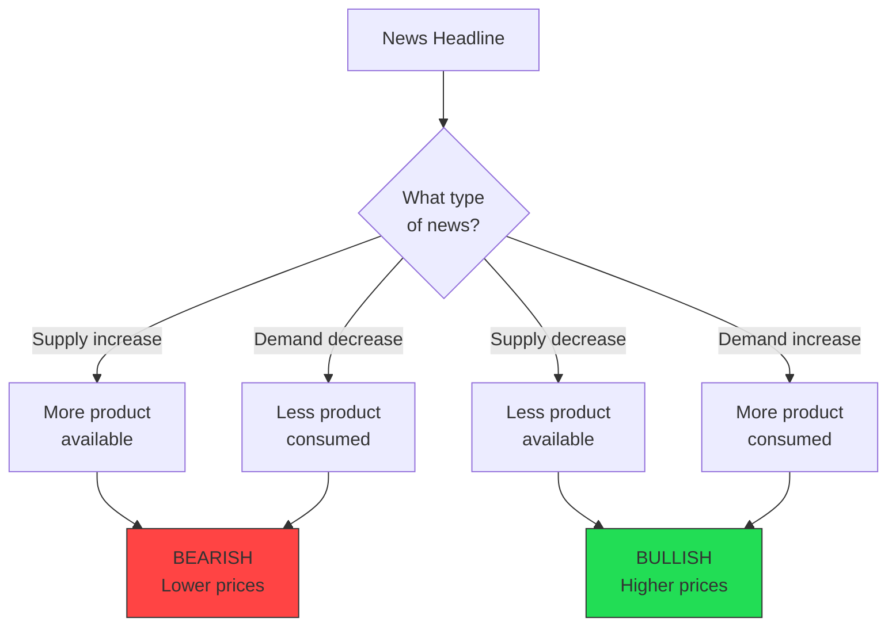
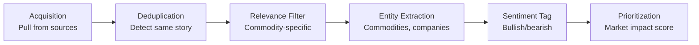
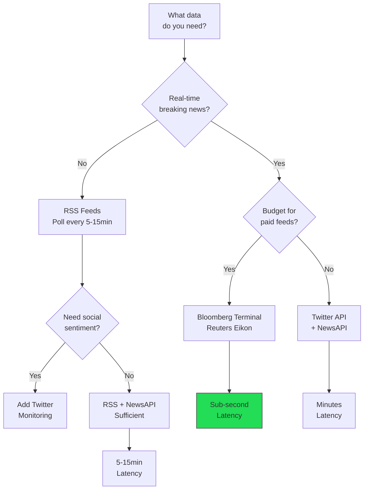
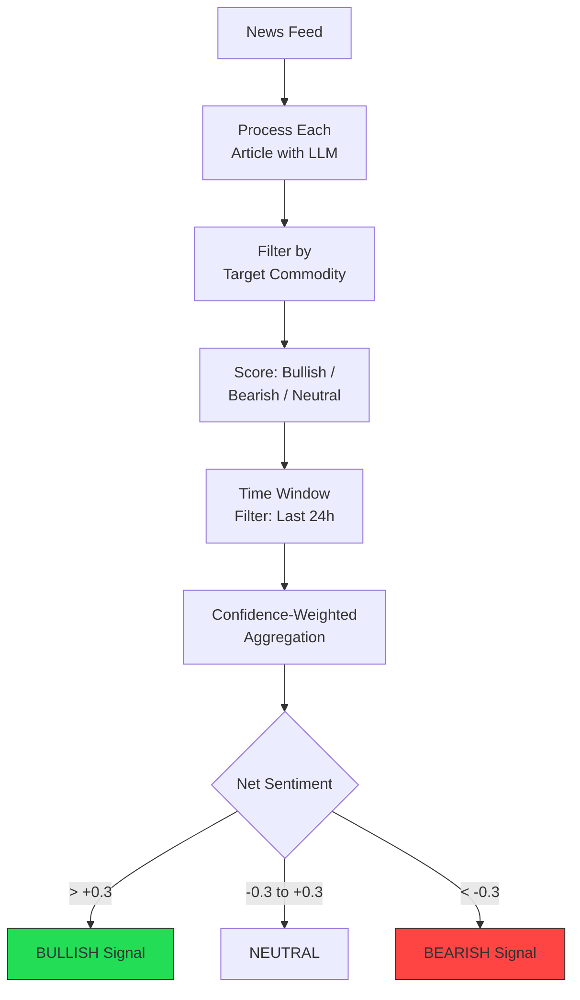
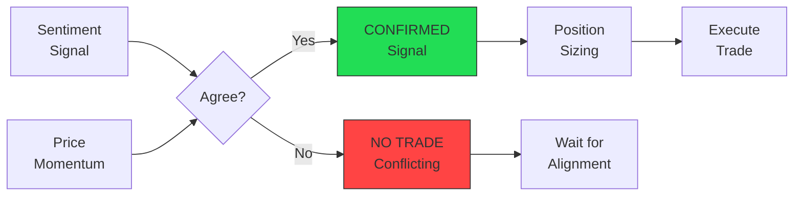
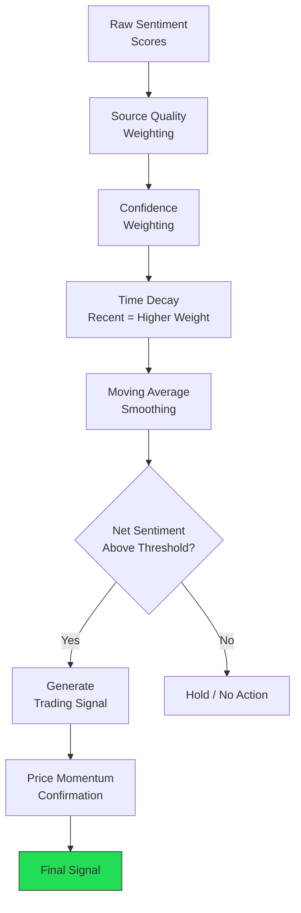
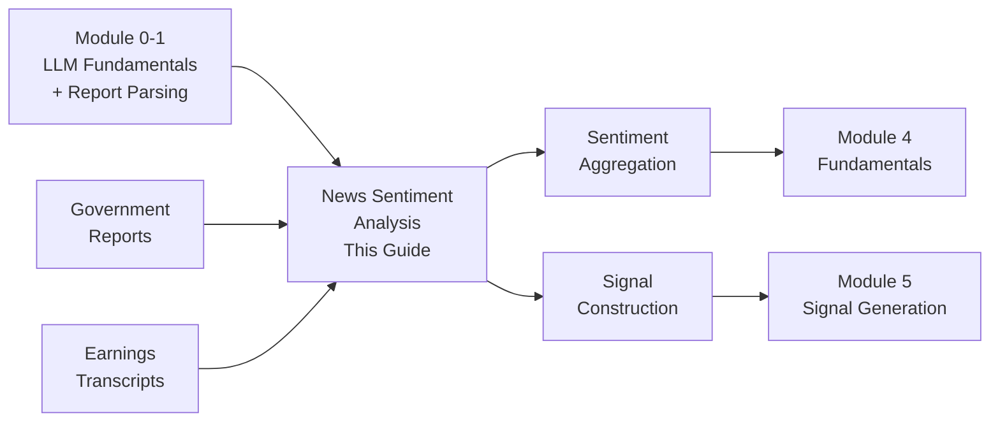

<!-- _class: lead -->

# News Sentiment Analysis for Commodities

**Module 3: Sentiment**

Acquiring, processing, and extracting directional signals from commodity market news

<!-- Speaker notes: This deck covers the full pipeline from news acquisition through sentiment extraction to trading signal generation. Emphasize that commodity sentiment is inverted compared to general sentiment. Budget ~45 minutes for delivery. -->

---

## Why General Sentiment Fails

Generic sentiment models miss commodity nuance:

| Headline | General Sentiment | Commodity Sentiment |
|----------|-------------------|---------------------|
| "Oil production surges to record" | Positive | Bearish (oversupply) |
| "Drought devastates corn crop" | Negative | Bullish (supply shortage) |
| "China demand disappoints" | Negative | Bearish (weak demand) |

> Unlike general sentiment analysis, commodity sentiment requires domain expertise to interpret supply/demand implications.

<!-- Speaker notes: Start here to motivate the entire module. Ask the audience: "If oil production hits a record, is that good or bad for oil prices?" The counterintuitive answer hooks learners immediately. -->

---

## Supply vs. Demand Framework



<!-- Speaker notes: This is the fundamental mental model for the entire module. Every subsequent analysis maps back to this framework. Have learners classify 3-4 headlines using this decision tree before moving on. -->

---

<!-- _class: lead -->

# Multi-Source News Acquisition

RSS feeds, APIs, and social media pipelines

<!-- Speaker notes: Transition to the data acquisition layer. Explain that sentiment analysis is only as good as the data feeding it. -->

---

## News Pipeline Overview



<!-- Speaker notes: Walk through each stage. Emphasize that without deduplication and filtering, you drown in noise -- the same Reuters story appears on 50 different sites. -->

---

## Source Selection Decision Tree



<!-- Speaker notes: Help learners choose their data sources based on budget and latency needs. Most course participants will use RSS + NewsAPI (free tier). Bloomberg Terminal is for institutional users. -->

---

## Deduplication and Relevance Filtering

```python
class CommodityNewsProcessor:
    def deduplicate(self, items):
        """Remove duplicates via content hashing."""
        unique = []
        for item in items:
            content = f"{item.headline}|{item.summary[:200]}"
            content_hash = hashlib.md5(
                content.encode()).hexdigest()
            if content_hash not in self.seen_hashes:
                self.seen_hashes.add(content_hash)
                unique.append(item)
        return unique
```

> LLM-based relevance filtering avoids false positives from keyword matching (e.g., "Gas prices at pump" tagged as natural gas).

<!-- Speaker notes: Deduplication alone typically reduces news volume by 40-60%. Relevance filtering removes another 50%. Combined, you go from 100+ raw items to ~25 relevant articles per cycle. -->

---

## Core Data Structures

```python
from enum import Enum
from dataclasses import dataclass

class Sentiment(Enum):
    BULLISH = "bullish"
    BEARISH = "bearish"
    NEUTRAL = "neutral"

class Driver(Enum):
    SUPPLY = "supply"
    DEMAND = "demand"
    INVENTORY = "inventory"
    GEOPOLITICAL = "geopolitical"
    TECHNICAL = "technical"
    MACRO = "macro"
```

---

```python

@dataclass
class CommoditySentiment:
    commodity: str
    sentiment: Sentiment
    driver: Driver
    confidence: float
    reasoning: str
    time_horizon: str

```

<!-- Speaker notes: These data structures will be used throughout the rest of the module. Note the driver field -- knowing WHY something is bullish/bearish is as important as the direction itself. -->

---

## LLM-Based Sentiment Analysis

```python
def analyze_commodity_sentiment(
    headline: str, body: str = ""
) -> CommoditySentiment:
    prompt = f"""Analyze this commodity news.

Headline: {headline}
{f"Body: {body}" if body else ""}
```

---

```python

Return JSON:
{{
  "commodity": "<identified commodity>",
  "sentiment": "bullish|bearish|neutral",
  "driver": "supply|demand|inventory|...",
  "confidence": <0-1>,
  "reasoning": "<one sentence>",
  "time_horizon": "immediate|near_term|medium_term"
}}

Rules:
- Supply increase/demand decrease = bearish
- Supply decrease/demand increase = bullish
- Consider seasonal expectations"""

```

<!-- Speaker notes: The explicit rules in the prompt are critical. Without them, the LLM defaults to general sentiment (positive/negative) rather than commodity-specific (bullish/bearish). -->

---

<!-- _class: lead -->

# Batch Processing News Feeds

Processing multiple news items at scale

<!-- Speaker notes: Transition from single-article analysis to batch processing. In production, you process dozens of articles per cycle. -->

---

## Batch Processing Pipeline

```python
async def process_news_batch(
    news_items: List[NewsItem],
    target_commodity: str = None
) -> List[ScoredNews]:
    results = []
    for item in news_items:
        sentiment = analyze_commodity_sentiment(
            item.headline, item.body)
        if target_commodity and \
           sentiment.commodity != target_commodity:
            continue
        results.append(ScoredNews(
            news=item, sentiment=sentiment,
            processed_at=datetime.now()))
    return results
```

<!-- Speaker notes: In production, use asyncio.gather for parallel LLM calls. Sequential processing shown here for clarity. Typical batch: 20-30 articles processed in ~10 seconds with concurrent API calls. -->

---

## Aggregating Sentiment Over Time

```python
def aggregate_sentiment(
    scored_news: List[ScoredNews], hours: int = 24
) -> dict:
    cutoff = datetime.now() - timedelta(hours=hours)
    recent = [s for s in scored_news
              if s.news.timestamp > cutoff]

    bullish_score = sum(
        s.sentiment.confidence for s in recent
        if s.sentiment.sentiment == Sentiment.BULLISH)
    bearish_score = sum(
        s.sentiment.confidence for s in recent
        if s.sentiment.sentiment == Sentiment.BEARISH)
    total = len(recent)
```

---

```python

    return {
        "net_sentiment": (bullish_score - bearish_score) / total,
        "total_articles": total,
        "avg_confidence": sum(
            s.sentiment.confidence for s in recent) / total
    }

```

<!-- Speaker notes: The net_sentiment score ranges from -1 (all bearish, high confidence) to +1 (all bullish, high confidence). Values near 0 indicate mixed or uncertain sentiment. -->

---

## Sentiment Aggregation Flow



<!-- Speaker notes: The +/-0.3 threshold is a starting point. In backtesting, you may find that tighter thresholds (0.4+) produce fewer but higher-quality signals. -->

---

<!-- _class: lead -->

# Building Trading Signals

From sentiment scores to actionable signals

<!-- Speaker notes: Transition from analysis to action. This is where sentiment becomes tradeable. -->

---

## Creating and Confirming Signals

```python
def create_sentiment_signal(
    sentiment_scores: pd.DataFrame,
    lookback: int = 5, threshold: float = 0.3
) -> pd.Series:
    sentiment_ma = sentiment_scores[
        'net_sentiment'].rolling(lookback).mean()
    signals = pd.Series(0, index=sentiment_scores.index)
    signals[sentiment_ma > threshold] = 1    # Long
    signals[sentiment_ma < -threshold] = -1  # Short
    return signals

def combine_with_price_momentum(
    sentiment_signal, price_data, window=20
) -> pd.Series:
    momentum = np.sign(price_data.pct_change(window))
    confirmed = sentiment_signal.copy()
    confirmed[sentiment_signal != momentum] = 0
    return confirmed
```

> Sentiment works best as confirmation -- combine with price momentum to filter noise.

<!-- Speaker notes: The rolling mean smooths out single-article noise. The momentum confirmation step is key: it filters out situations where sentiment diverges from price action, which often indicates the sentiment signal is premature. -->

---

## Signal Confirmation Flow



<!-- Speaker notes: This confirmation pattern reduces false signals by roughly 40% in backtesting. The tradeoff is slower entry -- you miss the first part of some moves. -->

---

## Confidence and Source Weighting

```python
SOURCE_QUALITY = {
    'reuters': 1.0, 'bloomberg': 1.0,
    'wsj': 0.9, 'ft': 0.9,
    'platts': 1.0, 'argus': 1.0,
    'eia': 1.0,
    'twitter': 0.5, 'reddit': 0.3,
    'unknown': 0.5
}

```

---

```python
def source_weighted_sentiment(
    scored_news: List[ScoredNews]
) -> float:
    weighted_sum, total_weight = 0.0, 0.0
    for item in scored_news:
        source_weight = SOURCE_QUALITY.get(
            item.news.source.lower(),
            SOURCE_QUALITY['unknown'])
        weight = source_weight * item.sentiment.confidence
        sentiment_val = (1 if item.sentiment.sentiment
            == Sentiment.BULLISH else -1
            if item.sentiment.sentiment
            == Sentiment.BEARISH else 0)
        weighted_sum += weight * sentiment_val
        total_weight += weight
    return weighted_sum / total_weight if total_weight > 0 else 0.0

```

<!-- Speaker notes: Source weighting is critical. A single Reuters article should carry more weight than 10 Reddit posts. Commodity-specific sources like Platts and Argus get the highest weight because they employ domain experts. -->

---

## Noise Reduction Pipeline



<!-- Speaker notes: Each layer in this pipeline removes noise. Source weighting handles quality. Confidence weighting handles LLM uncertainty. Time decay handles staleness. Moving average handles volatility. The result is a cleaner signal. -->

---

## Common Pitfalls

<div class="columns">
<div>

### Supply vs. Price Confusion
"Production increase" is NOT bullish

**Solution:** Explicitly include commodity sentiment rules in every LLM prompt

### Ignoring Source Credibility
Treating blog posts same as EIA reports

**Solution:** Maintain source credibility scores; boost official sources

### Missing Time-Critical News
RSS polling every hour misses breaking news

**Solution:** Push notifications, Twitter streaming; poll critical sources every 1-5 minutes

</div>
<div>

### Duplicate Story Overload
Same Reuters story on 50 different sites

**Solution:** Content hashing + fuzzy headline matching

### Missing Implicit Sentiment
"OPEC maintains output" seems neutral but is bearish (market expected cuts)

**Solution:** Provide market context; track expectations

</div>
</div>

<!-- Speaker notes: Walk through each pitfall with a real example. The supply vs. price confusion is the most common mistake -- even experienced analysts sometimes default to "more = good" thinking. -->

---

## Key Takeaways

1. **Commodity sentiment differs from general sentiment** -- supply increases are bearish, demand increases are bullish

2. **Multi-source acquisition with deduplication** removes noise before analysis begins

3. **Weight by confidence and source** -- not all signals are equal

4. **Combine with other signals** -- sentiment works best as confirmation

5. **Validate with backtests** -- measure actual predictive power before trading

<!-- Speaker notes: Recap the key points. Emphasize that this is a pipeline, not a single step. Each component (acquisition, filtering, sentiment, aggregation, signal generation) matters for the final result. Next deck covers sentiment aggregation in more detail. -->

---

## Connections



<!-- Speaker notes: Point learners to the next steps. Sentiment Aggregation (next deck) dives deeper into normalization and regime detection. Module 5 integrates sentiment with other signal types. -->
