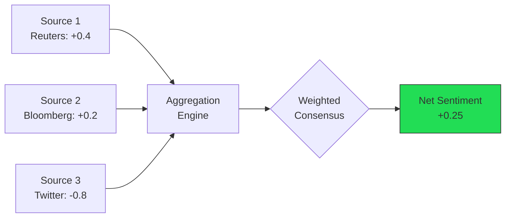
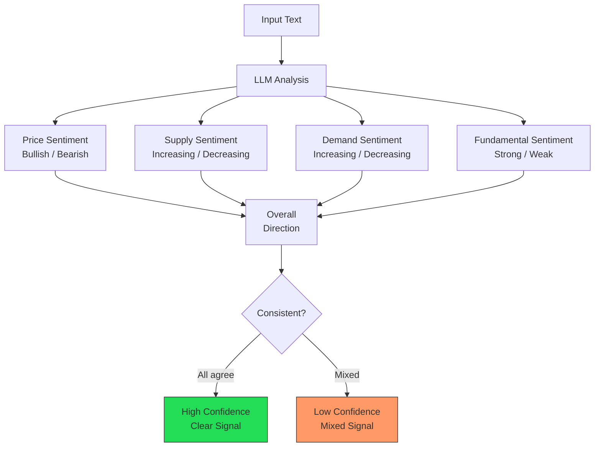
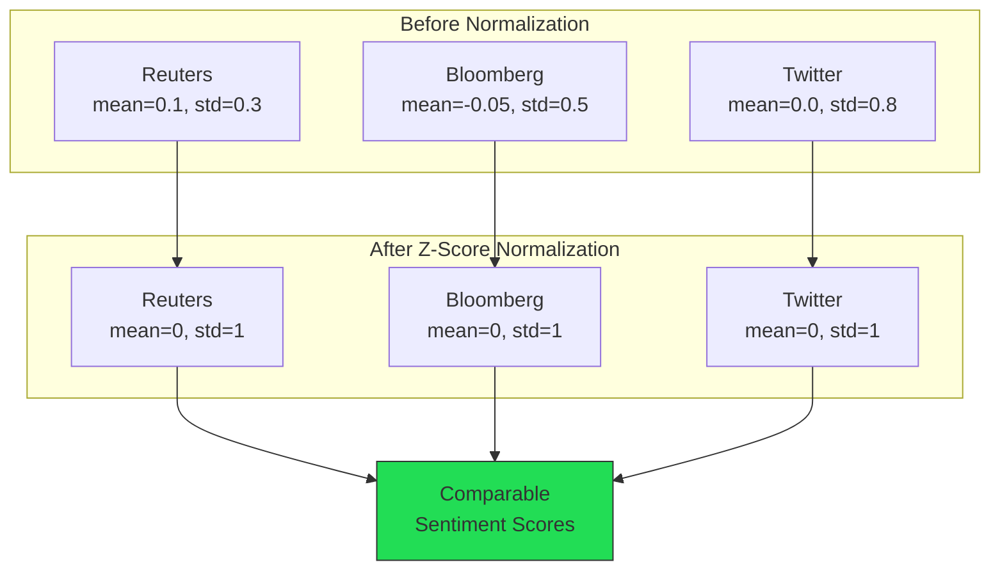
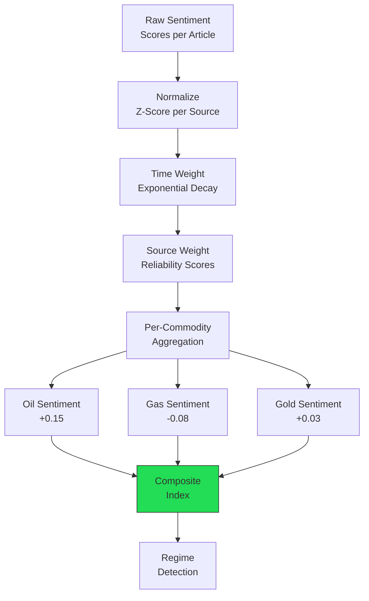
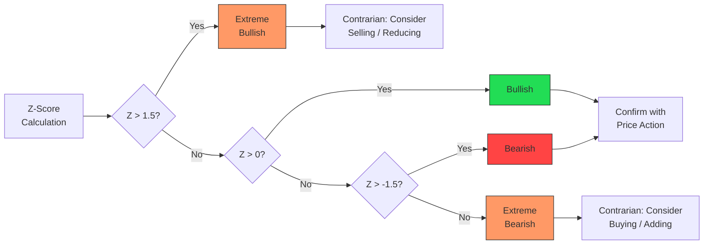
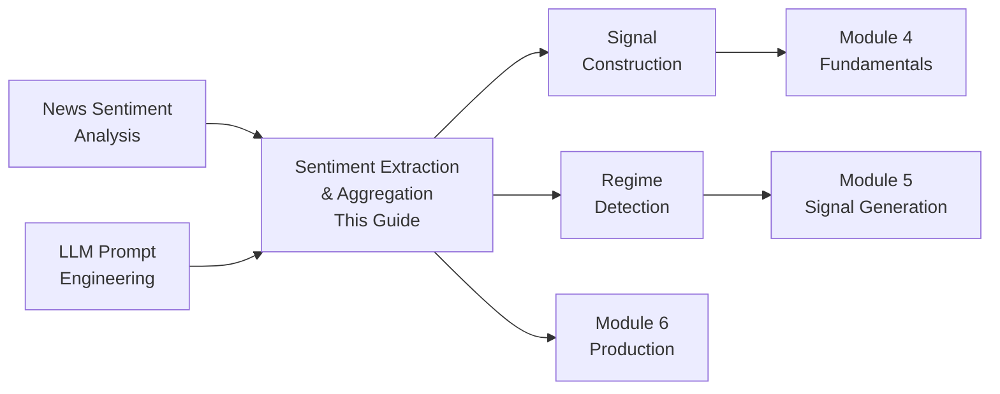

<!-- _class: lead -->

# Sentiment Extraction and Aggregation

**Module 3: Sentiment**

Multi-dimensional extraction, normalization, and aggregation into coherent market views

<!-- Speaker notes: This deck covers two connected topics: extracting rich multi-dimensional sentiment, then aggregating across sources and time. Budget ~40 minutes. Prerequisite: learners should have completed the News Sentiment deck. -->

---

## From Extraction to Aggregation

Individual news sentiment scores are noisy. We need to extract rich dimensions and then aggregate them into actionable signals.



> Raw scores from different sources have different scales, noise levels, and reliability -- aggregation normalizes and combines them.

<!-- Speaker notes: Motivate aggregation with a concrete example: three sources give wildly different scores. Which one do you trust? Aggregation is the answer. -->

---

## Multi-Dimensional Sentiment

Price sentiment alone misses nuance. Extract four dimensions:



<!-- Speaker notes: The key insight is that supply, demand, and price can point in different directions simultaneously. "Supply increasing AND demand increasing" might be neutral for prices. Multi-dimensional extraction captures this. -->

---

## Data Structures for Multi-Dimensional Analysis

```python
class SentimentDirection(Enum):
    BULLISH = "bullish"
    BEARISH = "bearish"
    NEUTRAL = "neutral"
    MIXED = "mixed"

@dataclass
class DimensionalSentiment:
    direction: SentimentDirection
    confidence: float
    reasoning: str

@dataclass
```

---

```python
class CommoditySentiment:
    overall_direction: SentimentDirection
    confidence: float
    price_sentiment: DimensionalSentiment
    supply_sentiment: DimensionalSentiment
    demand_sentiment: DimensionalSentiment
    time_horizon: str
    key_factors: Dict[str, List[str]]
    implicit_sentiment: bool
    caveat_phrases: List[str]

```

<!-- Speaker notes: Note the implicit_sentiment flag -- this catches cases where the LLM detects sentiment that isn't explicitly stated (e.g., "OPEC maintains output" is implicitly bearish if cuts were expected). The caveat_phrases field catches hedging language. -->

---

## Aspect-Based Sentiment Extraction

```python
class AspectSentimentExtractor:
    """Extract sentiment for specific aspects."""

    def extract_aspect_sentiments(
        self, text: str, aspects: List[str]
    ) -> Dict[str, DimensionalSentiment]:
        prompt = f"""Analyze sentiment per aspect.

Text: {text}
Aspects: {', '.join(aspects)}
```

---

```python

Return JSON:
{{
  "production": {{
    "direction": "bullish|bearish|neutral",
    "confidence": 0.0-1.0,
    "reasoning": "...",
    "mentioned": true/false
  }},
  "inventory": {{...}},
  "demand": {{...}}
}}

Rules:
- Production increase -> bearish for prices
- Inventory decrease -> generally bullish
- Demand increase -> bullish for prices"""

```

<!-- Speaker notes: Aspect-based analysis is useful when a single article covers multiple market factors. For example, an OPEC report might discuss production cuts (bullish) but also weakening demand (bearish). Aspect extraction separates these. -->

---

## Aspect Analysis Example

<div class="columns">
<div>

**Input Text:**
"OPEC+ announced a surprise production cut of 1.16 million bpd. U.S. crude inventories have fallen for four consecutive weeks, driven by strong refinery demand."

</div>
<div>

**Aspect Results:**

| Aspect | Direction | Confidence |
|--------|-----------|------------|
| Production | Bullish | 0.95 |
| Inventory | Bullish | 0.85 |
| Demand | Bullish | 0.80 |

**Overall:** Strongly Bullish

</div>
</div>

<!-- Speaker notes: This is a "triple bullish" scenario -- all three aspects agree. When all aspects align, confidence in the overall signal is much higher than when they conflict. -->

---

<!-- _class: lead -->

# Normalization and Aggregation

Putting all sources on the same scale

<!-- Speaker notes: Transition from extraction to aggregation. The challenge: different sources use different scoring scales and have different biases. -->

---

## Sentiment Score Normalization

```python
class SentimentNormalizer:
    """Normalize scores from different sources."""

    def fit(self, sentiment_df, source_column='source',
            score_column='score'):
        for source in sentiment_df[source_column].unique():
            source_data = sentiment_df[
                sentiment_df[source_column] == source
            ][score_column]
            self.source_stats[source] = {
                'mean': source_data.mean(),
                'std': source_data.std()
            }
```

---

```python

    def transform(self, score, source, method='zscore'):
        stats = self.source_stats[source]
        if method == 'zscore':
            return (score - stats['mean']) / stats['std']
        elif method == 'minmax':
            range_val = stats['max'] - stats['min']
            return 2 * (score - stats['min']) / range_val - 1

```

> Z-score normalization puts all sources on the same scale regardless of their native range.

<!-- Speaker notes: Without normalization, a source that produces scores in [0, 1] would be dominated by a source producing scores in [-5, 5]. Z-score normalization fixes this by centering and scaling each source independently. -->

---

## Normalization Effect



<!-- Speaker notes: The visual makes the concept intuitive. After normalization, a score of +2 from Reuters and +2 from Twitter both mean "2 standard deviations above that source's average" -- now they are comparable. -->

---

## Time-Weighted Aggregation

Recent sentiment matters more than old sentiment.

$$w(t) = e^{-\frac{\ln(2) \cdot \Delta t}{t_{1/2}}}$$

Where $\Delta t$ = hours since publication, $t_{1/2}$ = half-life (e.g., 24 hours)

```python
class TimeWeightedSentiment:
    def __init__(self, half_life_hours=24):
        self.half_life = half_life_hours

    def calculate_weights(self, timestamps, reference_time):
        hours_ago = (
            reference_time - timestamps
        ).dt.total_seconds() / 3600
        decay = np.exp(
            -np.log(2) * hours_ago / self.half_life)
        return decay / decay.sum()
```

**Effect:** Article from 24h ago gets half the weight. From 48h ago, 1/4 the weight.

<!-- Speaker notes: The half-life parameter is tunable. For fast-moving markets (energy), 12-24 hours works well. For slower markets (agriculture), 48-72 hours may be more appropriate. -->

---

## Source Quality Weighting

```python
class SourceWeightedSentiment:
    def __init__(self, source_weights=None):
        self.source_weights = source_weights or {
            'reuters': 1.0, 'bloomberg': 1.0,
            'wsj': 0.9, 'ft': 0.9,
            'specialized_commodity': 1.2,
            'social_media': 0.3, 'unknown': 0.5
        }

    def aggregate(self, df, source_col='source',
                  score_col='score'):
        weights = df[source_col].apply(self.get_weight)
        weighted_sum = (df[score_col] * weights).sum()
        total_weight = weights.sum()
        return {
            'weighted_sentiment':
                weighted_sum / total_weight
        }
```

<!-- Speaker notes: Note that specialized_commodity sources (Platts, Argus) get a 1.2x weight -- higher than even Reuters. These services employ commodity analysts who understand the market context that general financial media often misses. -->

---

## Aggregation Architecture



<!-- Speaker notes: This diagram shows the full pipeline. Each layer adds signal quality. By the time you reach regime detection, you have a robust, multi-source, time-weighted, source-weighted composite signal. -->

---

<!-- _class: lead -->

# Sentiment Regime Detection

Identifying market sentiment extremes

<!-- Speaker notes: Transition to regime detection. This is where aggregated sentiment becomes most useful for trading -- at extremes. -->

---

## SentimentRegimeDetector

```python
class SentimentRegimeDetector:
    def __init__(self, lookback_short=5,
                 lookback_long=20, threshold=1.5):
        self.lookback_short = lookback_short
        self.lookback_long = lookback_long
        self.threshold = threshold

    def detect_regime(self, sentiment_series):
        short_ma = sentiment_series.rolling(
            self.lookback_short).mean()
        long_ma = sentiment_series.rolling(
            self.lookback_long).mean()
        long_std = sentiment_series.rolling(
            self.lookback_long).std()
```

---

```python

        z_score = (short_ma - long_ma) / long_std

        regime = pd.Series(index=sentiment_series.index,
                           dtype='object')
        regime[z_score > self.threshold] = 'extreme_bullish'
        regime[z_score <= 0] = 'bearish'
        regime[z_score < -self.threshold] = 'extreme_bearish'
        return regime, z_score

```

<!-- Speaker notes: The z-score approach compares recent sentiment to its own history. When short-term sentiment diverges significantly from the long-term average, we are in an extreme regime. These extremes often precede reversals. -->

---

## Regime Classification



<!-- Speaker notes: Extreme bullish sentiment often precedes corrections (everyone is already long). Extreme bearish sentiment can signal buying opportunities. This is the contrarian use of sentiment data. -->

---

## Common Pitfalls

<div class="columns">
<div>

### Supply vs. Price Confusion
Multi-dimensional extraction solves this

**Solution:** Explicitly separate supply/demand from price sentiment dimensions

### Ignoring Time Horizon
"Long-term bearish, short-term bullish" collapsed

**Solution:** Extract time_horizon; allow conflicting short/long-term views

### Overconfidence in Mixed Signals
Article mentions both bullish and bearish factors

**Solution:** Allow "mixed" sentiment; report both key factors

</div>
<div>

### Cross-Source Scale Mismatch
Comparing raw scores across different sources

**Solution:** Z-score normalization before aggregation

### Equal Weighting of All Sources
Treating Twitter posts same as Reuters articles

**Solution:** Source quality weights based on domain expertise

### Stale Sentiment
Yesterday's news given same weight as breaking news

**Solution:** Exponential time decay with configurable half-life

</div>
</div>

<!-- Speaker notes: These pitfalls cover both extraction and aggregation. The most costly in practice is supply vs. price confusion -- it can lead to positions in exactly the wrong direction. -->

---

## Key Takeaways

1. **Multi-dimensional extraction** -- price, supply, demand sentiment can diverge; extract all four

2. **Aspect-based analysis** provides granular insights per market dimension

3. **Normalize scores** across sources before aggregating

4. **Time-weight and source-weight** to emphasize recent, reliable sentiment

5. **Detect regimes** -- sentiment extremes often precede price reversals

6. **Validate** aggregated signals against price movements

<!-- Speaker notes: Summarize both extraction and aggregation. The combination of rich extraction with robust aggregation produces signals that are far more reliable than either alone. Next: Signal Construction (deck 03) puts everything together. -->

---

## Connections



<!-- Speaker notes: This deck feeds directly into Signal Construction (03) which combines sentiment with other factors. The regime detection concepts resurface in Module 5 for signal frameworks. -->
