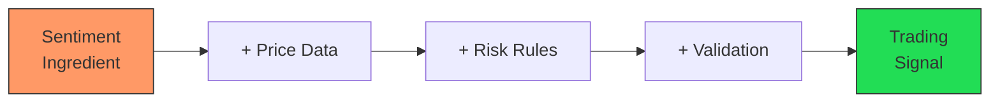
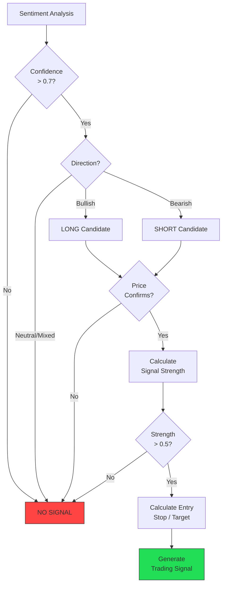
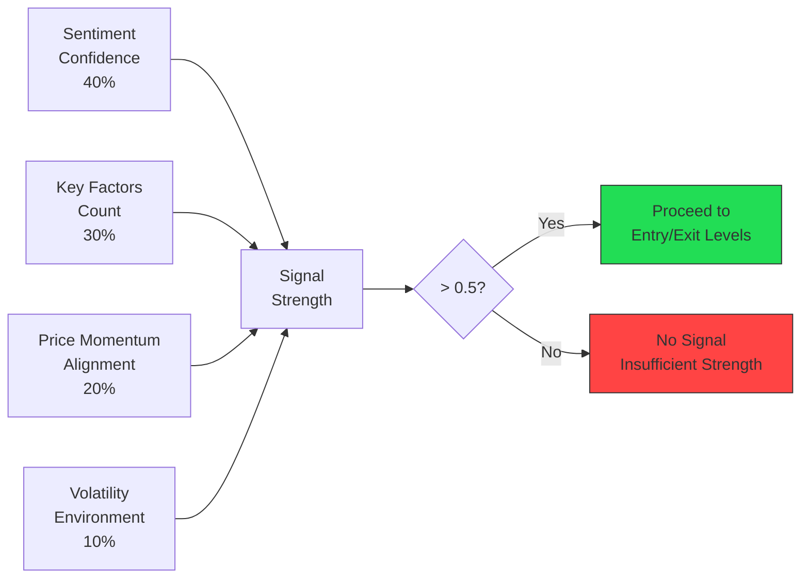
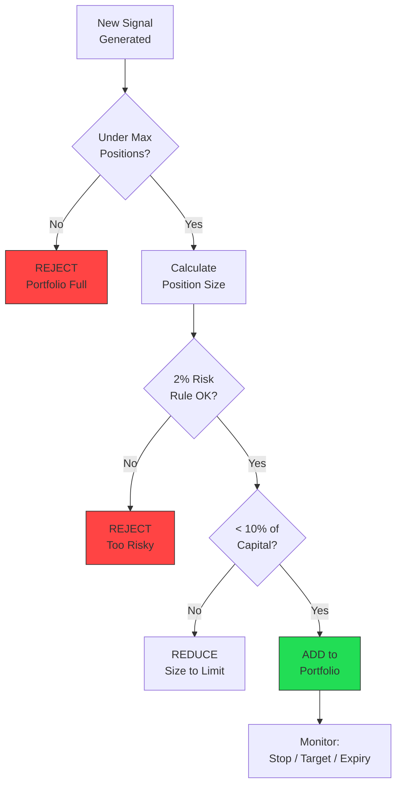
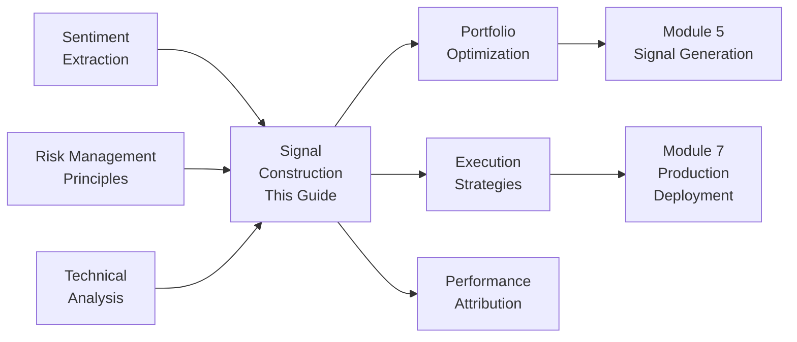

<!-- _class: lead -->

# Building Trading Signals from Commodity Sentiment

**Module 3: Sentiment**

Transforming sentiment into actionable trading recommendations

<!-- Speaker notes: Section transition. Briefly preview what this section covers before diving into details. -->

---

## Sentiment is Not a Signal

> "Bullish sentiment" alone doesn't tell you whether to buy now, how much to buy, or when to exit.

**Missing pieces:**
- Price action confirmation
- Position sizing based on confidence
- Stop-loss and take-profit levels
- Historical backtesting validation



<!-- Speaker notes: Walk through the diagram step by step. Highlight the key decision points and data flow. -->

---

## Formal Definition

**SIG: (Sent, Price, Risk) -> Action** where:

- **Sent** = sentiment {direction, confidence, key_factors}
- **Price** = market data {current_price, trend, volatility}
- **Risk** = risk parameters {max_position, stop_loss, target}

**Output:**
```
Action = {
  signal_type: {long | short | flat | reduce},
  strength: [0, 1],
  entry_price, stop_loss, take_profit,
  time_horizon, confidence, rationale
}
```

<!-- Speaker notes: Present the formal definition but keep focus on practical implications. Reference back to the intuitive explanation. -->

---

## The Pilot's Checklist Analogy

<div class="columns">
<div>

### Bad Approach (Sentiment Only)
- Pilot sees "weather looks good"
- Takes off immediately
- No fuel, instrument, or path checks
- **Result: Dangerous**

</div>
<div>

### Good Approach (Complete Signal)
- Sentiment is bullish (weather good)
- Price confirms (instruments working)
- Volatility acceptable (safe conditions)
- Position size calculated (fuel sufficient)
- Stop-loss set (emergency plan)
- **Then enter trade**

</div>
</div>

<!-- Speaker notes: Use the analogy to build intuition before diving into the formal definition. Ask learners if the analogy resonates. -->

---

<!-- _class: lead -->

# Signal Generator Implementation

From sentiment to structured trading signals

<!-- Speaker notes: Section transition. Briefly preview what this section covers before diving into details. -->

---

## Core Data Structures

```python
class SignalType(Enum):
    LONG = "long"      # Buy/bullish position
    SHORT = "short"    # Sell/bearish position
    FLAT = "flat"      # No position
    REDUCE = "reduce"  # Reduce existing position
    ADD = "add"        # Add to existing position

@dataclass
class MarketData:
    current_price: float
    daily_high: float
    daily_low: float
    volume: float
    atr_20: float    # 20-period Average True Range
    sma_50: float    # 50-day moving average
    sma_200: float   # 200-day moving average
    rsi_14: float    # 14-period RSI
```

---

```python

@dataclass
class TradingSignal:
    signal_type: SignalType
    strength: float          # 0-1 position sizing
    entry_price: float
    stop_loss: float
    take_profit: float
    time_horizon: TimeHorizon
    confidence: float
    rationale: str
    risk_reward_ratio: float
    max_loss_pct: float
    expected_gain_pct: float

```

<!-- Speaker notes: Walk through the code, emphasizing the key patterns. Highlight which parts learners should customize for their own use cases. -->

---

## SignalConstructor Class

```python
class SignalConstructor:
    def __init__(
        self,
        min_sentiment_confidence=0.7,
        min_signal_strength=0.5,
        default_risk_reward=2.0,
        max_position_pct=0.1
    ):
        ...

    def construct_signal(
        self, sentiment, market_data,
        current_position=None
    ) -> Optional[TradingSignal]:
```

---

```python
        # Step 1: Check confidence threshold
        if sentiment.confidence < self.min_sentiment_confidence:
            return None

        # Step 2: Determine direction
        if sentiment.overall_direction == SentimentDirection.BULLISH:
            base_direction = SignalType.LONG
        elif sentiment.overall_direction == SentimentDirection.BEARISH:
            base_direction = SignalType.SHORT
        else:
            return None  # No signal on neutral/mixed

```

<!-- Speaker notes: Walk through the code, emphasizing the key patterns. Highlight which parts learners should customize for their own use cases. -->

---

## Signal Construction Pipeline



<!-- Speaker notes: Walk through the diagram step by step. Highlight the key decision points and data flow. -->

---

## Price Confirmation Logic

```python
def _check_price_confirmation(
    self, sentiment_direction, market_data
) -> bool:
    price = market_data.current_price

    if sentiment_direction == SentimentDirection.BULLISH:
        # Bullish confirmation
        if price > market_data.sma_50:
            return True
        # Recent breakout (near daily high)
        if price > market_data.daily_high * 0.98:
            return True
```

---

```python
        # Don't go long in strong downtrend
        if price < market_data.sma_200 * 0.95:
            return False

    elif sentiment_direction == SentimentDirection.BEARISH:
        # Bearish confirmation
        if price < market_data.sma_50:
            return True
        # Don't go short in strong uptrend
        if price > market_data.sma_200 * 1.05:
            return False

    return True  # Default: confirmed

```

<!-- Speaker notes: Walk through the code, emphasizing the key patterns. Highlight which parts learners should customize for their own use cases. -->

---

## Signal Strength Calculation

```python
def _calculate_signal_strength(
    self, sentiment, market_data
) -> float:
    strength = 0.0

    # 1. Sentiment confidence (40%)
    strength += sentiment.confidence * 0.4

    # 2. Number of key factors (30%)
    bullish = len(
        sentiment.key_factors.get('bullish', []))
    factor_score = min(1.0, bullish / 5)
    strength += factor_score * 0.3

```

---

```python
    # 3. Price momentum alignment (20%)
    rsi = market_data.rsi_14
    if 40 < rsi < 70:  # Not overbought
        momentum_score = 1.0
    else:
        momentum_score = 0.5
    strength += momentum_score * 0.2

    # 4. Volatility factor (10%)
    vol_pct = market_data.atr_20 / market_data.current_price
    if vol_pct < 0.02:
        vol_score = 1.0
    elif vol_pct < 0.05:
        vol_score = 0.7
    else:
        vol_score = 0.4
    strength += vol_score * 0.1

    return min(1.0, strength)

```

<!-- Speaker notes: Walk through the code, emphasizing the key patterns. Highlight which parts learners should customize for their own use cases. -->

---

## Strength Weighting Breakdown



<!-- Speaker notes: Walk through the diagram step by step. Highlight the key decision points and data flow. -->

---

## Entry, Stop-Loss, and Target Levels

```python
def _calculate_levels(
    self, signal_type, market_data, sentiment
) -> tuple[float, float, float]:
    price = market_data.current_price
    atr = market_data.atr_20

    if signal_type == SignalType.LONG:
        entry = price
        stop = entry - (2 * atr)      # 2x ATR below
        risk = entry - stop
        target = entry + (risk * 2.0)  # 2:1 reward

    else:  # SHORT
        entry = price
        stop = entry + (2 * atr)      # 2x ATR above
        risk = stop - entry
        target = entry - (risk * 2.0)  # 2:1 reward

    return entry, stop, target
```

> Stop-loss at 2x ATR provides adaptive risk management -- wider stops in volatile markets, tighter in calm markets.

<!-- Speaker notes: Walk through the code, emphasizing the key patterns. Highlight which parts learners should customize for their own use cases. -->

---

<!-- _class: lead -->

# Signal Validation and Backtesting

Proving signals work before trading

<!-- Speaker notes: Section transition. Briefly preview what this section covers before diving into details. -->

---

## SignalValidator

```python
class SignalValidator:
    def backtest_signal(
        self, signal, historical_prices,
        holding_period_days=5
    ) -> Dict:
        entry_price = signal.entry_price
        stop_loss = signal.stop_loss
        take_profit = signal.take_profit

        # Simulate trade over holding period
        for date, row in period_data.iterrows():
            if signal.signal_type == SignalType.LONG:
                if row['Low'] <= stop_loss:
                    exit_price = stop_loss  # Stopped out
                    break
                if row['High'] >= take_profit:
                    exit_price = take_profit  # Target hit
                    break
```

---

```python

        # Calculate P&L
        if signal.signal_type == SignalType.LONG:
            pnl_pct = (exit_price - entry_price) / entry_price
        else:
            pnl_pct = (entry_price - exit_price) / entry_price

        return {'pnl_pct': pnl_pct,
                'stopped_out': stopped_out,
                'target_hit': target_hit}

```

<!-- Speaker notes: Walk through the code, emphasizing the key patterns. Highlight which parts learners should customize for their own use cases. -->

---

## Maximum Favorable/Adverse Excursion

```python
def _calculate_mfe(self, period_data, signal):
    """Best price achieved during hold."""
    if signal.signal_type == SignalType.LONG:
        best = period_data['High'].max()
        return (best - signal.entry_price) / signal.entry_price
    else:
        best = period_data['Low'].min()
        return (signal.entry_price - best) / signal.entry_price

def _calculate_mae(self, period_data, signal):
    """Worst price achieved during hold."""
    if signal.signal_type == SignalType.LONG:
        worst = period_data['Low'].min()
        return (worst - signal.entry_price) / signal.entry_price
    else:
        worst = period_data['High'].max()
        return (signal.entry_price - worst) / signal.entry_price
```

> MFE/MAE analysis reveals whether stops are too tight (cutting winners) or too wide (allowing large losses).

<!-- Speaker notes: Walk through the code, emphasizing the key patterns. Highlight which parts learners should customize for their own use cases. -->

---

<!-- _class: lead -->

# Signal Portfolio Management

Managing multiple signals across commodities

<!-- Speaker notes: Section transition. Briefly preview what this section covers before diving into details. -->

---

## SignalPortfolio Class

```python
class SignalPortfolio:
    def __init__(self, total_capital, max_positions=5):
        self.total_capital = total_capital
        self.max_positions = max_positions
        self.active_signals = []

    def add_signal(self, signal, commodity) -> bool:
        if len(self.active_signals) >= self.max_positions:
            return False
```

---

```python

        position_size = self._calculate_position_size(
            signal)
        if position_size == 0:
            return False

        self.active_signals.append({
            'signal': signal,
            'commodity': commodity,
            'position_size': position_size,
            'entry_date': datetime.now()
        })
        return True

```

<!-- Speaker notes: Walk through the code, emphasizing the key patterns. Highlight which parts learners should customize for their own use cases. -->

---

## Position Sizing

```python
def _calculate_position_size(self, signal):
    """Fixed fractional: risk 2% of capital per trade."""
    # Risk per trade (2% of capital)
    risk_per_trade = self.total_capital * 0.02

    # Risk per unit
    risk_per_unit = abs(
        signal.entry_price - signal.stop_loss)
    if risk_per_unit == 0:
        return 0

```

---

```python
    # Base position from risk management
    base_position = risk_per_trade / risk_per_unit

    # Adjust by signal strength
    adjusted = base_position * signal.strength

    # Cap at 10% of capital
    max_value = self.total_capital * 0.10
    max_units = max_value / signal.entry_price

    return min(adjusted, max_units)

```

<!-- Speaker notes: Walk through the code, emphasizing the key patterns. Highlight which parts learners should customize for their own use cases. -->

---

## Portfolio Risk Management



<!-- Speaker notes: Walk through the diagram step by step. Highlight the key decision points and data flow. -->

---

## Common Pitfalls

<div class="columns">
<div>

### Acting on Low Confidence
Trading every signal regardless

**Solution:** Minimum 0.7 confidence threshold; quality over quantity

### Ignoring Price Confirmation
Going long while price is crashing

**Solution:** Require price trend alignment, breakouts

### No Stop-Loss Discipline
Hoping losing trades will recover

**Solution:** Calculate stops before entry; use automated orders

</div>
<div>

### Oversizing Positions
Risking too much on single signal

**Solution:** Fixed fractional sizing (1-2% risk per trade)

### Ignoring Time Decay
Holding positions based on old sentiment

**Solution:** Set signal expiry times; re-evaluate with fresh sentiment

</div>
</div>

<!-- Speaker notes: Walk through each pitfall with a real-world example. Ask learners if they have encountered any of these in their own work. -->

---

## Key Takeaways

1. **Sentiment is an ingredient, not a signal** -- combine with price, risk, and validation

2. **Require price confirmation** -- don't fight strong opposite trends

3. **Calculate signal strength** from confidence, factors, momentum, and volatility

4. **Use ATR-based stops** for adaptive risk management

5. **Backtest everything** -- prove signals work before trading real capital

<!-- Speaker notes: Recap the main points. Ask learners which takeaway they found most surprising or useful. -->

---

## Connections



<!-- Speaker notes: Show how this content connects to other modules. Point learners to the next recommended deck. -->
