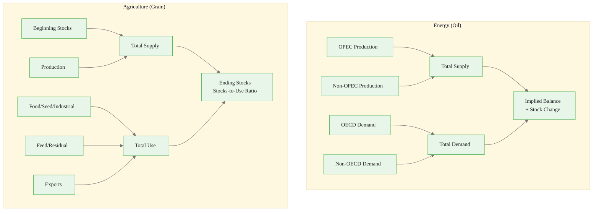
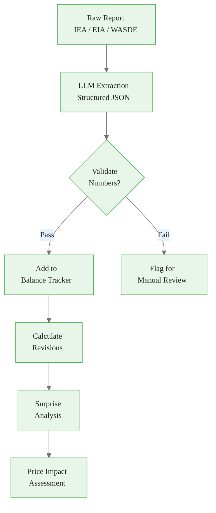
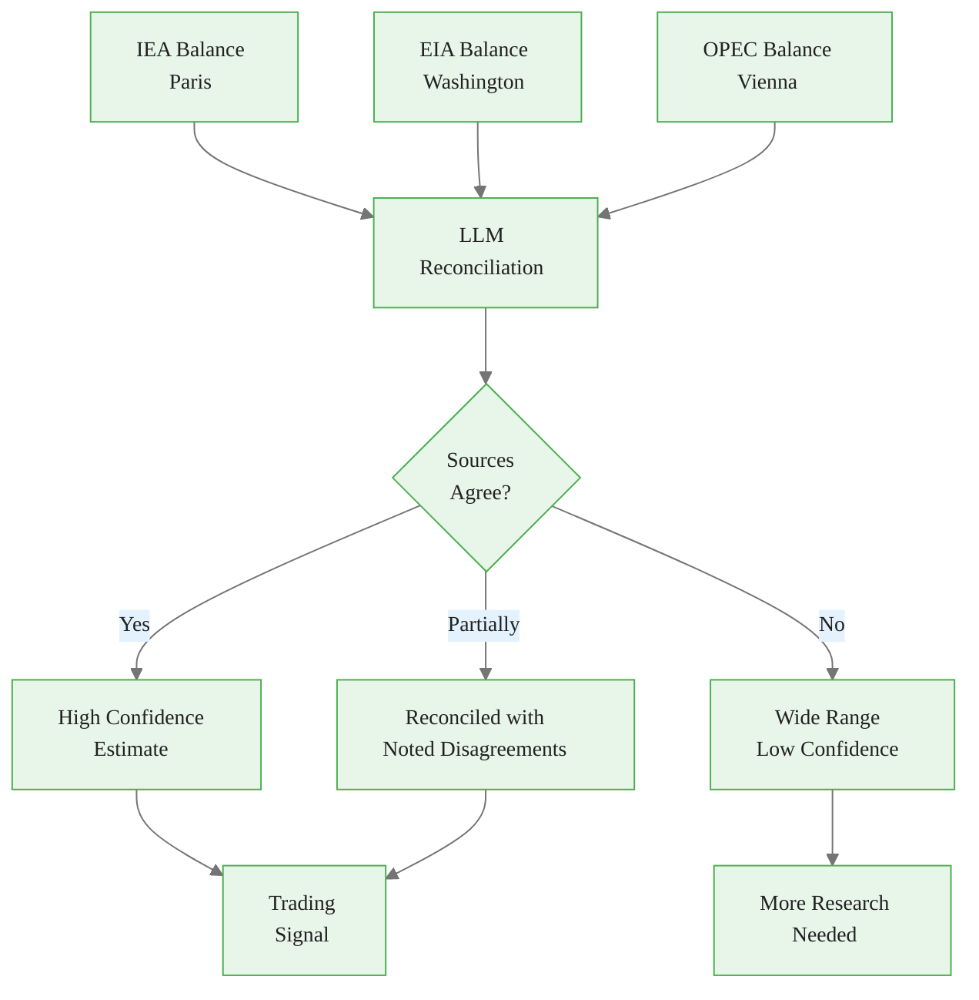
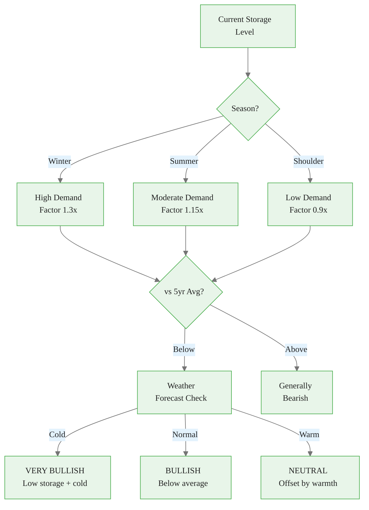
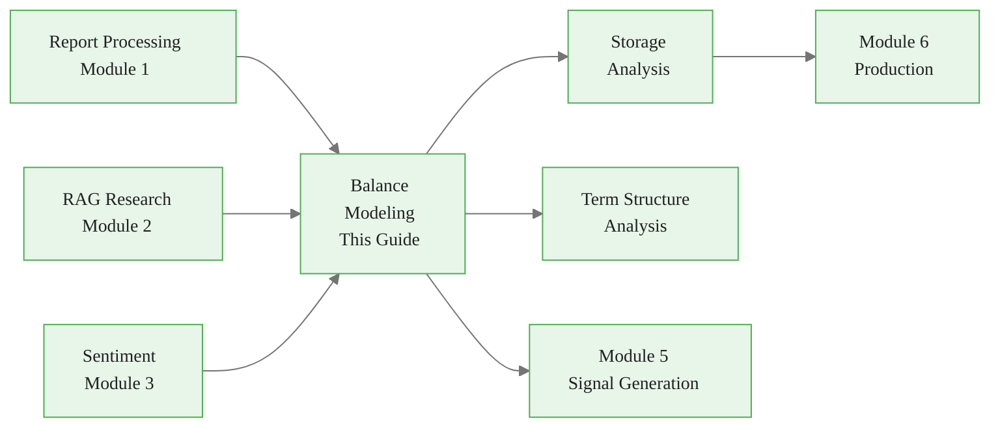

<!-- _class: lead -->

# Supply/Demand Balance Modeling with LLMs

**Module 4: Fundamentals**

Extracting, tracking, and forecasting commodity balance sheets

<!-- Speaker notes: This deck covers the core of commodity fundamental analysis -- balance sheets. LLMs bridge the gap between structured data (EIA/USDA numbers) and unstructured context (news, analyst commentary). Budget ~45 minutes. -->

---

## The Balance Framework

Commodity prices are driven by the supply/demand balance:

$$\text{Balance} = \text{Supply} - \text{Demand}$$

$$\text{Ending Stocks} = \text{Beginning Stocks} + \text{Production} + \text{Imports} - \text{Consumption} - \text{Exports}$$

**LLMs help by:**
1. Extracting balance components from reports
2. Identifying revisions and surprises
3. Generating balance sheet projections
4. Integrating qualitative factors that move markets

<!-- Speaker notes: This is the foundational equation for all commodity analysis. Every report from EIA, IEA, OPEC, and USDA is ultimately about estimating these components. LLMs help by reading those reports and extracting the numbers automatically. -->

---

## The Home Heating Analogy

<div class="columns">
<div>

### Traditional Approach
- Look at last year's gas usage
- Apply inflation adjustment
- Done

**Misses:**
- Added insulation (less demand)
- Polar vortex forecast (more demand)
- Pipeline construction (more supply)

</div>
<div>

### LLM-Augmented
- Get historical usage data (structured)
- LLM reads: "New pipeline +15% supply"
- LLM processes: "Colder winter expected"
- LLM notes: "Insulation project completed"
- **Combines all factors into a complete picture**

</div>
</div>

<!-- Speaker notes: This analogy makes the LLM value proposition concrete. Traditional models only see the numbers. LLMs can read the accompanying commentary and factor in qualitative information that analysts would normally process manually. -->

---

## Energy vs. Agricultural Balances



<div class="callout-key">

Key implementation detail -- study this pattern carefully.

</div>

<!-- Speaker notes: Two different balance sheet structures. Energy uses flow rates (million barrels per day). Agriculture uses stocks (million bushels). The key metric differs too: oil uses implied balance (surplus/deficit), grains use stocks-to-use ratio. Below 10% stocks-to-use is considered tight for grains. -->

---

<!-- Speaker notes: Cover the key points about OilBalance Data Structure. Emphasize practical implications and connect to previous material. -->

## OilBalance Data Structure

```python
@dataclass
class OilBalance:
    """Global oil supply/demand balance."""
    period: str  # Q1 2024, 2024, etc.

    # Supply
    opec_production: float  # mb/d
    non_opec_production: float
    total_supply: float

    # Demand
    oecd_demand: float
    non_oecd_demand: float
    total_demand: float
```

<div class="callout-insight">

This pattern recurs throughout the course. Understanding it deeply pays dividends later.

</div>

---

```python

    # Balance
    implied_balance: float  # supply - demand
    stock_change: float
    days_cover: Optional[float] = None

    @property
    def is_in_deficit(self) -> bool:
        return self.implied_balance < 0

```

<div class="callout-warning">

Watch for edge cases with this implementation in production use.

</div>

<!-- Speaker notes: This dataclass represents one row in a quarterly oil balance table. The is_in_deficit property is the most important signal: when supply is less than demand, inventories fall and prices tend to rise. -->

---

<!-- Speaker notes: Cover the key points about GrainBalance Data Structure. Emphasize practical implications and connect to previous material. -->

## GrainBalance Data Structure

```python
@dataclass
class GrainBalance:
    """USDA-style grain balance sheet."""
    commodity: str
    marketing_year: str

    # Supply
    beginning_stocks: float
    production: float
    imports: float
    total_supply: float

```

<div class="callout-info">

This approach follows established best practices in the field.

</div>

---

```python
    # Demand
    food_seed_industrial: float
    feed_residual: float
    exports: float
    total_demand: float

    # Ending Position
    ending_stocks: float
    stocks_to_use: float  # Key ratio

    @property
    def is_tight(self) -> bool:
        """Stocks-to-use below 10% is tight."""
        return self.stocks_to_use < 0.10

```

<!-- Speaker notes: The stocks_to_use ratio is the single most important number in agricultural commodity markets. Below 10% historically triggers price spikes. The WASDE report updates these monthly and markets react within seconds of release. -->

---

<!-- _class: lead -->

# Extracting Balance Data with LLMs

From reports to structured data

<!-- Speaker notes: Now we move from data structures to actually using LLMs to extract balance data from government reports. This is where the practical value really kicks in. -->

---

<!-- Speaker notes: Cover the key points about Extracting Oil Balance from IEA/EIA. Emphasize practical implications and connect to previous material. -->

## Extracting Oil Balance from IEA/EIA

```python
def extract_oil_balance(report_text: str) -> dict:
    prompt = """Extract the oil supply/demand balance.

Return JSON:
{
  "report_source": "IEA|EIA|OPEC",
  "period": "Q1 2024",
  "supply": {
    "opec_crude": <mb/d>,
    "non_opec": <mb/d>,
    "total_supply": <mb/d>
  },
  "demand": {
    "oecd_americas": <mb/d>,
    "total_demand": <mb/d>
```

---

```python
  },
  "balance": {
    "implied_balance": <supply - demand>,
    "stock_change": <if mentioned>
  },
  "revisions": [{
    "category": "...",
    "direction": "up|down",
    "magnitude": <kb/d>,
    "reason": "..."
  }]
}

Report:
""" + report_text

```

<!-- Speaker notes: The revisions field is crucial. Markets move on changes from previous estimates, not on absolute levels. A 100 kb/d upward revision to demand is bullish even if total demand is still below supply. -->

---

## Extraction Pipeline



<!-- Speaker notes: Validation is important because LLMs can hallucinate numbers. Cross-check extracted values against known ranges (e.g., global oil production should be 95-105 mb/d in 2024). Flag anything outside 2 standard deviations for manual review. -->

---

<!-- Speaker notes: Cover the key points about Surprise Analysis. Emphasize practical implications and connect to previous material. -->

## Surprise Analysis

```python
def analyze_balance_surprise(
    actual, consensus, commodity
) -> dict:
    prompt = f"""Compare actual {commodity} balance
vs consensus.

Actual: {actual}
Consensus: {consensus}

Analyze:
1. Which components surprised?
2. Is net balance tighter or looser?
3. Likely price impact?
```

---

<div class="code-window">
<div class="code-header">
<div class="dots"><span class="dot-red"></span><span class="dot-yellow"></span><span class="dot-green"></span></div>
<span class="filename">example.py</span>
</div>

```python

Return JSON:
{{
  "surprises": [{{
    "component": "...",
    "actual": <value>,
    "expected": <value>,
    "surprise_pct": <percentage>,
    "significance": "high|medium|low"
  }}],
  "net_balance_surprise": "tighter|looser|inline",
  "price_impact": {{
    "direction": "bullish|bearish|neutral",
    "magnitude": "large|moderate|small"
  }}
}}"""

```

</div>

> Surprises move markets -- actual vs. expected matters more than absolute levels.

<!-- Speaker notes: This is the most actionable analysis in the deck. When EIA reports a 5 million barrel draw vs. an expected 2 million barrel draw, the 3 million barrel surprise is what moves prices. The absolute level of inventories matters less than the delta from expectations. -->

---

## Cross-Source Reconciliation



<!-- Speaker notes: IEA, EIA, and OPEC publish separate oil balance estimates that often disagree by 0.5-1.0 mb/d. The LLM identifies where they disagree (typically non-OECD demand and OPEC supply) and generates a reconciled best estimate. When all three agree, confidence is high. -->

---

<!-- _class: lead -->

# Seasonal Balance Modeling

Natural gas and agricultural seasonality

<!-- Speaker notes: Transition to seasonal models. Natural gas is the most seasonal commodity -- winter heating demand can be 30% higher than shoulder months. -->

---

<!-- Speaker notes: Cover the key points about Natural Gas Seasonal Factors. Emphasize practical implications and connect to previous material. -->

## Natural Gas Seasonal Factors

<div class="code-window">
<div class="code-header">
<div class="dots"><span class="dot-red"></span><span class="dot-yellow"></span><span class="dot-green"></span></div>
<span class="filename">naturalgassdanalyzer.py</span>
</div>

```python
class NaturalGasSDAnalyzer:
    def build_seasonal_balance(
        self, eia_storage, weather_forecast,
        current_month
    ):
        if current_month in [12, 1, 2]:
            season = "winter"
            seasonal_demand_factor = 1.3  # +30%
        elif current_month in [6, 7, 8]:
            season = "summer"
            seasonal_demand_factor = 1.15  # +15%
        else:
            season = "shoulder"
            seasonal_demand_factor = 0.9
```

</div>

---

<div class="code-window">
<div class="code-header">
<div class="dots"><span class="dot-red"></span><span class="dot-yellow"></span><span class="dot-green"></span></div>
<span class="filename">example.py</span>
</div>

```python

        # Storage vs 5-year average
        storage_vs_avg = (
            (current_storage - five_year_avg)
            / five_year_avg * 100)

        return self._interpret_storage_seasonally(
            current_storage, five_year_avg,
            season, weather_forecast)

```

</div>

<!-- Speaker notes: The seasonal demand factors are approximate starting points. Winter demand is 30% higher due to heating. Summer demand spikes 15% due to power generation for air conditioning. Shoulder months (spring/fall) are the lowest demand periods. -->

---

## Seasonal Storage Interpretation



<!-- Speaker notes: The combination of low storage + winter + cold weather forecast is the most bullish scenario in natural gas. Conversely, high storage + warm winter forecast is very bearish. This decision tree is how experienced gas traders think about the market. -->

---

## Common Pitfalls

<div class="columns">
<div>

### Ignoring Data Quality
Treating preliminary = final data

**Solution:** Weight by source quality; EIA > industry > news

### Missing Seasonal Adjustments
Comparing winter to summer demand

**Solution:** Use seasonal adjustments; compare to same period in prior years

### Static Models
Last week's balance to forecast next month

**Solution:** LLM extracts forecasts from news and reports

</div>
<div>

### Ignoring Inventory Levels
Focusing only on flow, not stock

**Solution:** Include inventory changes as S/D component

### No Uncertainty
Single-point forecasts without confidence

**Solution:** Generate scenarios (base, upside, downside); report confidence

### Cross-Source Disagreement Ignored
Using only one agency's numbers

**Solution:** Reconcile IEA, EIA, OPEC for best estimates with noted disagreements

</div>
</div>

<!-- Speaker notes: The most costly pitfall for traders is ignoring revisions. Balance estimates get revised frequently. Tracking the direction of revisions (are they tightening or loosening the balance?) is often more informative than the absolute level. -->

---

## Key Takeaways

1. **Balance = Price** -- supply/demand balances are the fundamental driver of commodity prices

2. **LLMs extract structure** -- convert narrative reports to usable balance sheet data

3. **Track revisions** -- the direction of revision signals market dynamics

4. **Surprises move markets** -- actual vs. expected matters most for trading

5. **Multiple sources** -- reconcile IEA, EIA, OPEC for best estimates

6. **Seasonal context is critical** -- especially for natural gas and agriculture

<!-- Speaker notes: Emphasize that this is the quantitative backbone of commodity trading. Sentiment (Module 3) and signals (Module 5) build on top of these balance sheet foundations. Next decks cover Storage Analysis and Term Structure. -->

---

## Connections



<!-- Speaker notes: Balance modeling feeds directly into storage analysis (next deck) and term structure analysis. It also provides the fundamental signals that Module 5 combines with sentiment signals. -->
