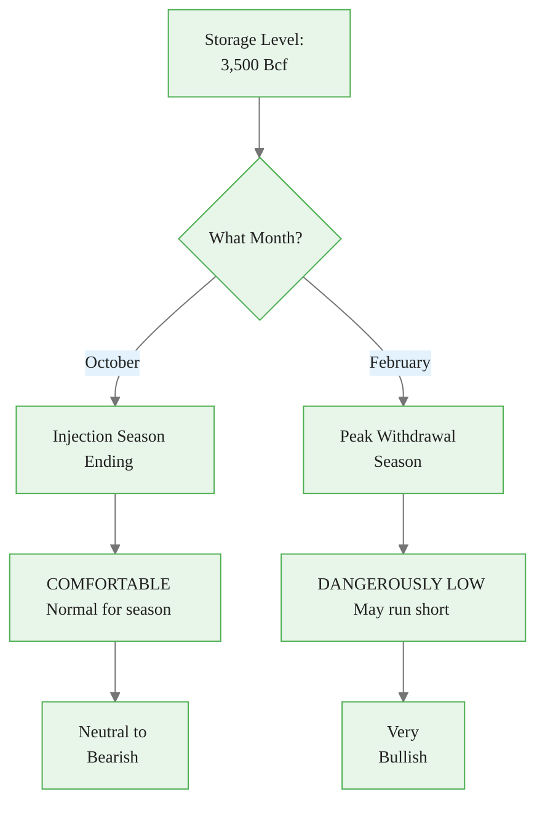
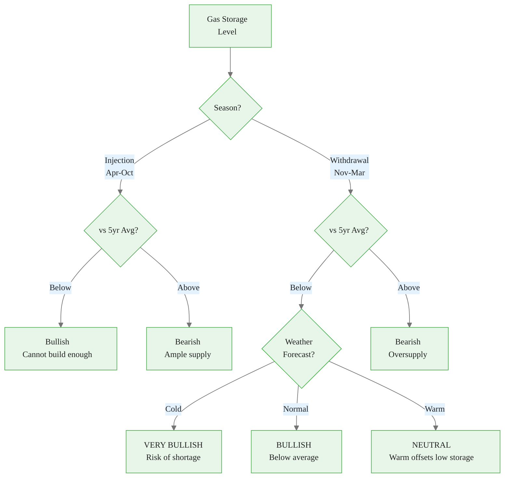
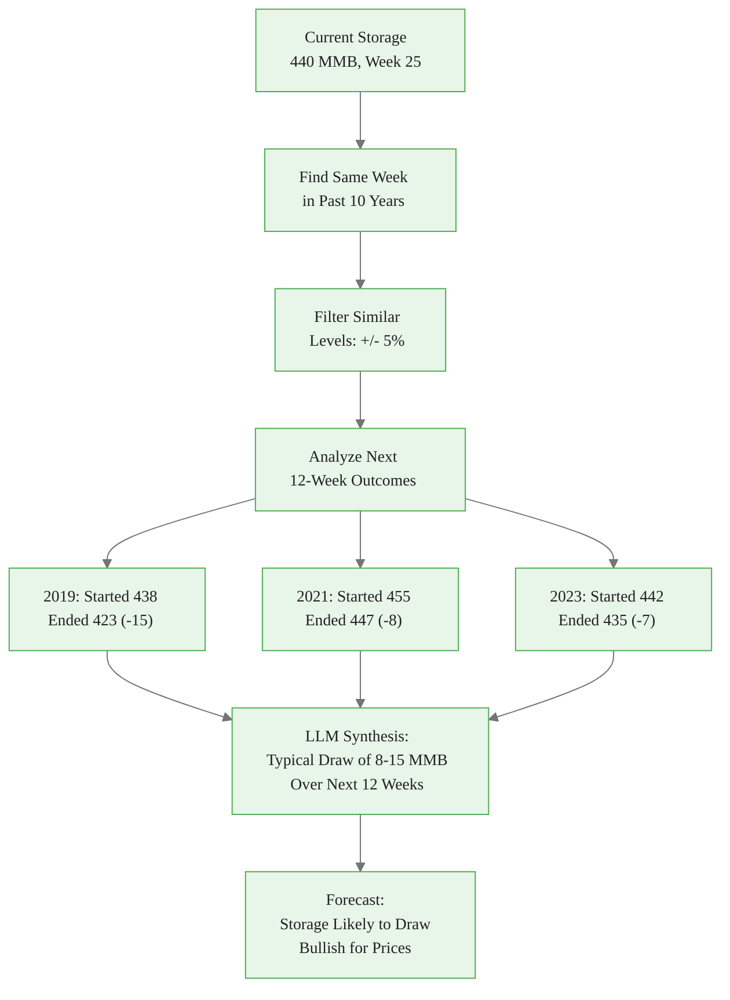
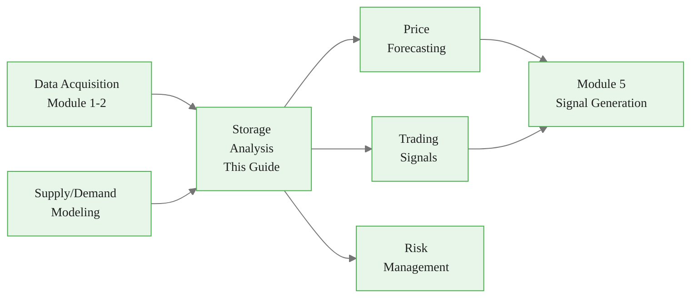

```mermaid
%%{init: {"theme": "base", "themeVariables": {"primaryColor": "#e8f5e9", "primaryBorderColor": "#4caf50", "primaryTextColor": "#212121", "secondaryColor": "#e3f2fd", "tertiaryColor": "#fff8e1", "lineColor": "#757575", "fontFamily": "Inter, sans-serif", "fontSize": "14px"}}}%%
gantt
    title Crude Oil Seasonal Calendar
    dateFormat  MM
    axisFormat  %b

    section Demand
    Refinery Maintenance :a1, 03, 60d
    Driving Season       :a2, 05, 150d
    Winter Distillate    :a3, 11, 120d
```

<!-- _class: lead -->

# Storage Analysis for Commodities with LLMs

**Module 4: Fundamentals**

Context-dependent interpretation of inventory data

<!-- Speaker notes: Section transition. Briefly preview what this section covers before diving into details. -->

---

## Storage Without Context is Meaningless

> 3,500 Bcf of natural gas storage is comfortable in October but dangerously low in February.



<div class="callout-key">

Key implementation detail -- study this pattern carefully.

</div>

<!-- Speaker notes: Walk through the diagram step by step. Highlight the key decision points and data flow. -->

---

## The Phone Battery Analogy

<div class="columns">
<div>

### Simple View (Wrong)
- 50% battery = good
- 20% battery = concerning

### Context-Dependent (Correct)
- 50% at 9 AM with charger = fine
- 50% at 9 PM, no charger, heavy usage ahead = concerning
- 20% at 10 PM at home = no problem
- 20% at midnight in unfamiliar city = very concerning

</div>
<div>

### Commodity Equivalent
- 400 MMB crude in March = comfortable (maintenance season)
- 400 MMB crude in July = tight (driving season)
- 3,200 Bcf gas in November = below average but OK
- 3,200 Bcf gas in January = dangerously low (peak heating)

</div>
</div>

<!-- Speaker notes: Use the analogy to build intuition before diving into the formal definition. Ask learners if the analogy resonates. -->

---

## Formal Definition

**SA: (S, C, T) -> Assessment**

- **S** = storage metrics {level, change, vs_5yr_avg, days_of_supply}
- **C** = context {season, weather, production, demand}
- **T** = time horizon {current, 1/3/6 month}

**Key relationships:**
- Low storage + High demand forecast = **Bullish**
- High storage + Weak demand = **Bearish**
- Seasonal pattern deviation = **Signal of imbalance**

<!-- Speaker notes: Present the formal definition but keep focus on practical implications. Reference back to the intuitive explanation. -->

---

<!-- _class: lead -->

# Storage Data Structures

Metrics and assessments

<!-- Speaker notes: Section transition. Briefly preview what this section covers before diving into details. -->

---

<!-- Speaker notes: Cover the key points about StorageMetrics and StorageAssessment. Emphasize practical implications and connect to previous material. -->

## StorageMetrics and StorageAssessment

```python
@dataclass
class StorageMetrics:
    commodity: str
    absolute_level: float
    unit: str
    reporting_date: datetime
    prior_week_level: float
    weekly_change: float
    five_year_avg: float
    five_year_min: float
    five_year_max: float
    vs_5yr_avg_pct: float
    percentile_rank: float  # 0-100
```

<div class="callout-insight">

This pattern recurs throughout the course. Understanding it deeply pays dividends later.

</div>

---

```python

@dataclass
class StorageAssessment:
    metrics: StorageMetrics
    absolute_interpretation: str  # "tight"/"comfortable"/"surplus"
    seasonal_interpretation: str
    days_of_supply: float
    price_implication: str
    confidence: float
    narrative: str
    risk_scenarios: Dict[str, str]

```

<div class="callout-warning">

Watch for edge cases with this implementation in production use.

</div>

<!-- Speaker notes: Walk through the code, emphasizing the key patterns. Highlight which parts learners should customize for their own use cases. -->

---

<!-- Speaker notes: Cover the key points about StorageAnalyzer: Crude Oil. Emphasize practical implications and connect to previous material. -->

## StorageAnalyzer: Crude Oil

```python
class StorageAnalyzer:
    def analyze_crude_storage(
        self, current_storage, historical_data,
        refinery_utilization, news_context=None
    ) -> StorageAssessment:
        # Calculate metrics
        metrics = self._calculate_storage_metrics(
            "crude_oil", current_storage,
            historical_data)

        # Days of supply
        daily_demand = refinery_utilization / 100 * 17
        days_of_supply = current_storage / daily_demand

```

<div class="callout-info">

This approach follows established best practices in the field.

</div>

---

```python
        # Seasonal context
        month = datetime.now().month
        seasonal = self._get_crude_seasonal_context(month)

        # LLM interpretation
        interpretation = self._llm_interpret_storage(
            metrics, days_of_supply, seasonal,
            {"refinery_utilization": refinery_utilization,
             "news": news_context or []})

        return StorageAssessment(
            metrics=metrics,
            days_of_supply=days_of_supply,
            **interpretation)

```

<!-- Speaker notes: Walk through the code, emphasizing the key patterns. Highlight which parts learners should customize for their own use cases. -->

---

## Crude Oil Seasonal Context

```python
def _get_crude_seasonal_context(self, month):
    if month in [5, 6, 7, 8, 9]:
        return "driving_season"   # High gasoline demand
    elif month in [11, 12, 1, 2]:
        return "winter"           # High distillate demand
    elif month in [3, 4]:
        return "refinery_maintenance"  # Lower crude demand
    else:
        return "shoulder"
```



<!-- Speaker notes: Walk through the diagram step by step. Highlight the key decision points and data flow. -->

---

<!-- Speaker notes: Cover the key points about LLM Storage Interpretation Prompt. Emphasize practical implications and connect to previous material. -->

## LLM Storage Interpretation Prompt

```python
prompt = f"""Analyze crude oil storage.

STORAGE METRICS:
- Current: {metrics.absolute_level:.1f} {metrics.unit}
- Weekly Change: {metrics.weekly_change:+.1f}
- 5-Year Avg: {metrics.five_year_avg:.1f}
- Vs Average: {metrics.vs_5yr_avg_pct:+.1f}%
- Percentile: {metrics.percentile_rank:.0f}th

CONTEXT:
- Days of Supply: {days_of_supply:.1f}
- Season: {seasonal_context}
- Refinery Util: {refinery_utilization}%
```

---

```python

INTERPRETATION GUIDELINES:
- Above 5yr avg = Generally bearish
- Below 5yr avg = Generally bullish
- Days of supply: <25 = concerning, >35 = comfortable
- High refinery util = bullish (strong demand)

Return JSON with: absolute, seasonal,
  price_implication, narrative, risk_scenarios"""

```

<!-- Speaker notes: Walk through the code, emphasizing the key patterns. Highlight which parts learners should customize for their own use cases. -->

---

<!-- _class: lead -->

# Natural Gas Storage

Weather-dependent and highly seasonal

<!-- Speaker notes: Section transition. Briefly preview what this section covers before diving into details. -->

---

<!-- Speaker notes: Cover the key points about Natural Gas Seasonal Analysis. Emphasize practical implications and connect to previous material. -->

## Natural Gas Seasonal Analysis

```python
def analyze_natural_gas_storage(
    self, current_storage, historical_data,
    weather_forecast
) -> StorageAssessment:
    metrics = self._calculate_storage_metrics(
        "natural_gas", current_storage, historical_data)

    month = datetime.now().month
    if month in [11, 12, 1, 2, 3]:
        season = "withdrawal_season"
        typical_weekly_change = -100  # Bcf/week
        daily_demand = 140  # Bcf/day
    elif month in [4, 5, 6, 7, 8, 9, 10]:
```

---

<div class="code-window">
<div class="code-header">
<div class="dots"><span class="dot-red"></span><span class="dot-yellow"></span><span class="dot-green"></span></div>
<span class="filename">example.py</span>
</div>

```python
        season = "injection_season"
        typical_weekly_change = 80
        daily_demand = 80
    else:
        season = "shoulder"
        daily_demand = 80

    days_of_supply = current_storage / daily_demand

    interpretation = self._llm_interpret_gas_storage(
        metrics, season, weather_forecast,
        days_of_supply)

```

</div>

<!-- Speaker notes: Walk through the code, emphasizing the key patterns. Highlight which parts learners should customize for their own use cases. -->

---

## Natural Gas Storage Decision Matrix



<!-- Speaker notes: Walk through the diagram step by step. Highlight the key decision points and data flow. -->

---

<!-- _class: lead -->

# Historical Pattern Comparison

Finding analogous periods

<!-- Speaker notes: Section transition. Briefly preview what this section covers before diving into details. -->

---

<!-- Speaker notes: Cover the key points about StoragePatternAnalyzer. Emphasize practical implications and connect to previous material. -->

## StoragePatternAnalyzer

<div class="code-window">
<div class="code-header">
<div class="dots"><span class="dot-red"></span><span class="dot-yellow"></span><span class="dot-green"></span></div>
<span class="filename">storagepatternanalyzer.py</span>
</div>

```python
class StoragePatternAnalyzer:
    def compare_to_historical_patterns(
        self, current_metrics, historical_data
    ):
        # Find similar periods
        similar = self._find_similar_periods(
            current_metrics, historical_data)

        # Analyze outcomes
        outcomes = self._analyze_outcomes(
            similar, historical_data)

        # LLM synthesizes
        return self._llm_pattern_synthesis(
            current_metrics, similar, outcomes)

```

</div>

---

<div class="code-window">
<div class="code-header">
<div class="dots"><span class="dot-red"></span><span class="dot-yellow"></span><span class="dot-green"></span></div>
<span class="filename">_find_similar_periods.py</span>
</div>

```python
    def _find_similar_periods(
        self, current_metrics, historical_data,
        tolerance=5.0
    ):
        """Find same week of year with similar level."""
        current_week = current_metrics.reporting_date \
            .isocalendar()[1]
        same_week = historical_data[
            historical_data.index.isocalendar().week
            == current_week]

        return [row for row in same_week
                if abs(row['storage'] -
                       current_metrics.absolute_level)
                / current_metrics.absolute_level * 100
                <= tolerance]

```

</div>

<!-- Speaker notes: Walk through the code, emphasizing the key patterns. Highlight which parts learners should customize for their own use cases. -->

---

## Pattern Analysis Flow



<!-- Speaker notes: Walk through the diagram step by step. Highlight the key decision points and data flow. -->

---

## Common Pitfalls

<div class="columns">
<div>

### Absolute Levels Across Seasons
3,200 Bcf is fine in October, dangerous in February

**Solution:** Always compare to same period in prior years

### Ignoring Rate of Change
Focusing on level, not whether building or drawing

**Solution:** Track weekly changes vs. seasonal pattern

### No Weather Adjustment (Gas)
"Comfortable" without checking weather forecast

**Solution:** Always incorporate weather for natural gas

</div>
<div>

### Crude Without Refinery Context
High crude storage during maintenance season

**Solution:** Check refinery utilization rates

### Percentile Misinterpretation
80th percentile = surplus?

**Solution:** Calculate percentile within same season/month

</div>
</div>

<!-- Speaker notes: Walk through each pitfall with a real-world example. Ask learners if they have encountered any of these in their own work. -->

---

## Key Takeaways

1. **Context is everything** -- same storage level means different things in different seasons

2. **Days of supply** is more informative than absolute level

3. **Weather is critical for natural gas** -- cold snaps can drain storage rapidly

4. **Rate of change matters** -- is storage building or drawing, and how fast?

5. **Historical patterns** provide probabilistic forecasts for future storage trajectory

<!-- Speaker notes: Recap the main points. Ask learners which takeaway they found most surprising or useful. -->

---

## Connections



<!-- Speaker notes: Show how this content connects to other modules. Point learners to the next recommended deck. -->
