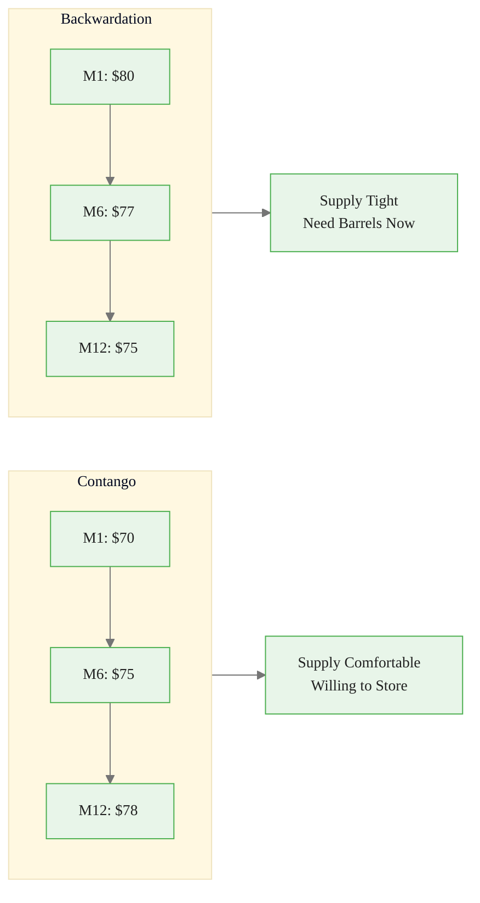
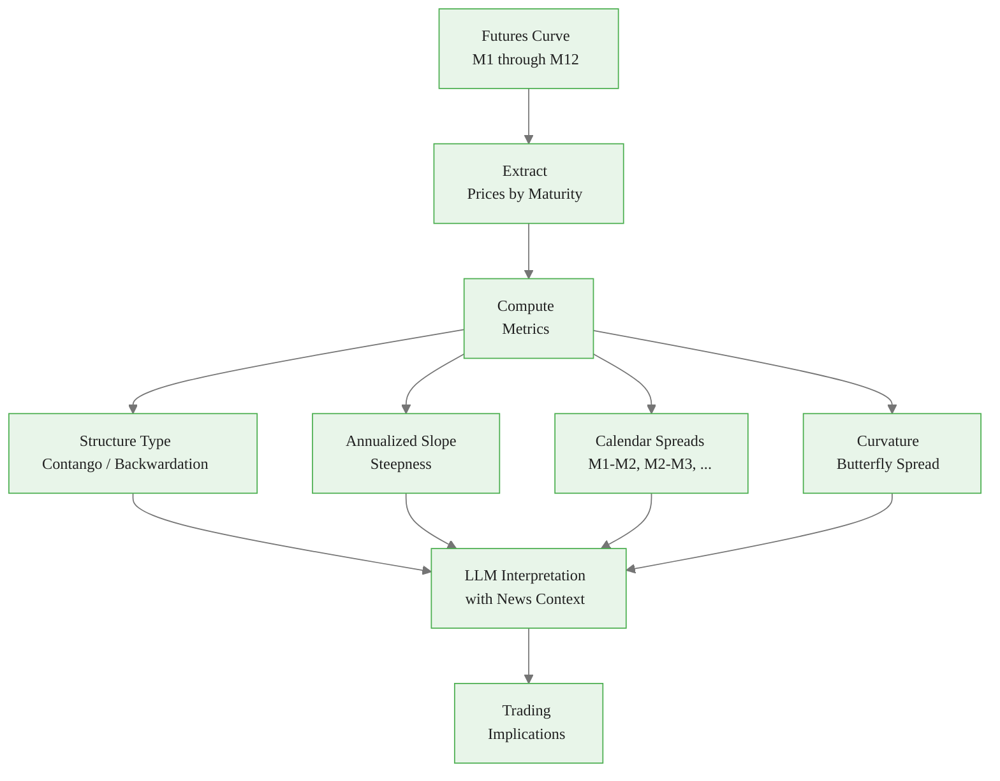
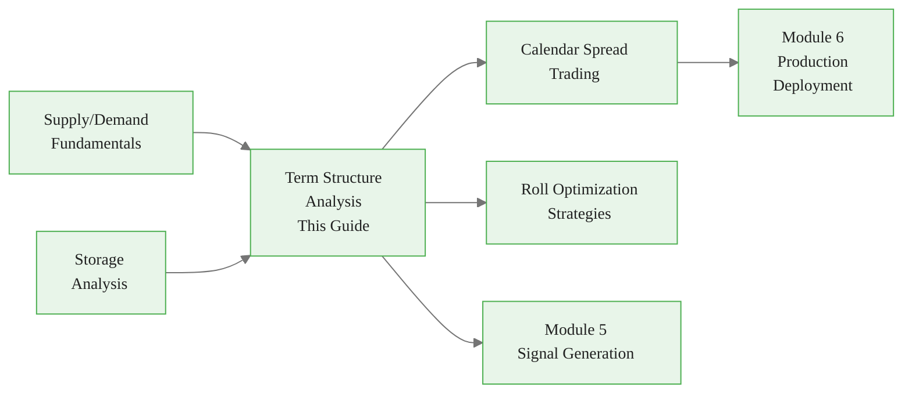

<!-- _class: lead -->

# Term Structure Analysis with LLMs

**Module 4: Fundamentals**

Interpreting futures curves to reveal market expectations

<!-- Speaker notes: Section transition. Briefly preview what this section covers before diving into details. -->

---

## What the Futures Curve Tells You

**Contango** = plentiful supply (willing to pay storage)
**Backwardation** = scarcity (immediate need outweighs future value)



<div class="callout-key">

Key implementation detail -- study this pattern carefully.

</div>

<!-- Speaker notes: Walk through the diagram step by step. Highlight the key decision points and data flow. -->

---

## Formal Definition

**Futures prices at time t for delivery at T:**
$$F(t, T_1), F(t, T_2), ..., F(t, T_n) \quad \text{where } T_1 < T_2 < ... < T_n$$

**Spot-futures relationship:**
$$F(t, T) = S_t \cdot e^{(r + c - y)(T - t)}$$

Where:
- $S_t$: Spot price
- $r$: Risk-free rate
- $c$: Storage cost
- $y$: Convenience yield

**Contango:** $F(t, T_2) > F(t, T_1)$ -- carrying cost > convenience yield
**Backwardation:** $F(t, T_2) < F(t, T_1)$ -- convenience yield > carrying cost

<!-- Speaker notes: Present the formal definition but keep focus on practical implications. Reference back to the intuitive explanation. -->

---

## Key Metrics

**Slope (front-to-back spread):**
$$\text{Slope} = \frac{F(t, T_n) - F(t, T_1)}{T_n - T_1}$$

**Curvature (butterfly):**
$$\text{Butterfly} = F(t, T_2) - \frac{F(t, T_1) + F(t, T_3)}{2}$$

**Roll yield** (for long position in near contract):
$$\text{Roll Yield} = \frac{F(t, T_1) - F(t-\Delta t, T_1 + \Delta t)}{F(t-\Delta t, T_1 + \Delta t)}$$

- Positive in backwardation (earns money rolling)
- Negative in contango (costs money rolling)

<!-- Speaker notes: Present the key concepts on this slide. Pause for questions before moving to the next topic. -->

---

## The Airline Ticket Analogy

<div class="columns">
<div>

### Contango (Normal)
- Today's flight: $200
- Flight in 3 months: $300
- "Storage cost" = uncertainty
- Airlines charge more for future flexibility

### Oil Contango
- Front month: $70
- 12-month: $75
- No immediate shortage
- Market pays to store oil

</div>
<div>

### Backwardation (Unusual)
- Today's flight: $500 (urgent trip!)
- Flight in 3 months: $250
- Immediate need drives price up

### Oil Backwardation
- Front month: $80
- 12-month: $75
- Shortage NOW, expected relief later
- Market values immediate barrels highly

</div>
</div>

<!-- Speaker notes: Use the analogy to build intuition before diving into the formal definition. Ask learners if the analogy resonates. -->

---

<!-- _class: lead -->

# TermStructureAnalyzer

Extracting, computing, and interpreting curves

<!-- Speaker notes: Section transition. Briefly preview what this section covers before diving into details. -->

---

<!-- Speaker notes: Cover the key points about Curve Extraction and Metrics. Emphasize practical implications and connect to previous material. -->

## Curve Extraction and Metrics

```python
class TermStructureAnalyzer:
    def extract_curve(self, futures_data, date):
        """Extract term structure for specific date."""
        curve = futures_data[
            futures_data['date'] == date].copy()
        curve['days_to_expiry'] = (
            pd.to_datetime(curve['maturity'])
            - pd.to_datetime(date)).dt.days
        return curve.sort_values('days_to_expiry')

    def compute_metrics(self, curve):
        prices = curve['price'].values
        days = curve['days_to_expiry'].values

        front, back = prices[0], prices[-1]
        spread = back - front
        structure = 'contango' if spread > 0 \
            else 'backwardation'

```

<div class="callout-insight">

This pattern recurs throughout the course. Understanding it deeply pays dividends later.

</div>

---

```python
        # Annualized slope
        days_diff = days[-1] - days[0]
        slope = (spread / front) * (365 / days_diff)

        # Calendar spreads
        cal_spreads = {
            f"M{i+1}-M{i+2}": prices[i+1] - prices[i]
            for i in range(len(prices) - 1)}

        # Curvature (butterfly)
        curvature = prices[1] - (
            prices[0] + prices[2]) / 2 \
            if len(prices) >= 3 else None

        return {'structure': structure,
                'slope_annualized': slope,
                'calendar_spreads': cal_spreads,
                'curvature': curvature, ...}

```

<div class="callout-warning">

Watch for edge cases with this implementation in production use.

</div>

<!-- Speaker notes: Walk through the code, emphasizing the key patterns. Highlight which parts learners should customize for their own use cases. -->

---

## Term Structure Metrics Visualization



<div class="callout-info">

This approach follows established best practices in the field.

</div>

<!-- Speaker notes: Walk through the diagram step by step. Highlight the key decision points and data flow. -->

---

<!-- Speaker notes: Cover the key points about LLM Curve Interpretation. Emphasize practical implications and connect to previous material. -->

## LLM Curve Interpretation

```python
def llm_interpret_structure(
    self, curve, metrics, news_context
):
    prompt = f"""Analyze futures term structure.

METRICS:
- Type: {metrics['structure']}
- Front: ${metrics['front_price']:.2f}
- Back: ${metrics['back_price']:.2f}
- Spread: ${metrics['front_back_spread']:.2f}
- Slope: {metrics['slope_annualized']*100:.2f}%

NEWS CONTEXT:
{news_str}
```

---

<!-- Speaker notes: Cover the key points about this slide. Emphasize practical implications and connect to previous material. -->

<div class="code-window">
<div class="code-header">
<div class="dots"><span class="dot-red"></span><span class="dot-yellow"></span><span class="dot-green"></span></div>
<span class="filename">example.py</span>
</div>

```python

Return JSON:
{{
  "structure_interpretation": {{
    "current_state": "What curve indicates",
    "strength": "How strong is the signal?",
    "historical_context": "Normal or extreme?"
  }},
  "fundamental_drivers": [
    "Key factors driving the structure"
  ],
```

</div>

---

<div class="code-window">
<div class="code-header">
<div class="dots"><span class="dot-red"></span><span class="dot-yellow"></span><span class="dot-green"></span></div>
<span class="filename">example.py</span>
</div>

```python
  "forward_outlook": {{
    "expected_direction":
      "steepening|flattening|inverting",
    "catalysts": ["Events that could shift"]
  }},
  "trading_implications": {{
    "calendar_spreads": "Opportunities?",
    "roll_yield": "Positive or negative?",
    "positioning": "Long front or back?"
  }}
}}"""

```

</div>

<!-- Speaker notes: Walk through the code, emphasizing the key patterns. Highlight which parts learners should customize for their own use cases. -->

---

## Curve Evolution Over Time

<div class="code-window">
<div class="code-header">
<div class="dots"><span class="dot-red"></span><span class="dot-yellow"></span><span class="dot-green"></span></div>
<span class="filename">analyze_curve_evolution.py</span>
</div>

```python
def analyze_curve_evolution(futures_data, dates):
    """Track how term structure evolves."""
    evolution = []
    for date in dates:
        curve = analyzer.extract_curve(
            futures_data, date)
        metrics = analyzer.compute_metrics(curve)
        evolution.append({
            'date': date,
            'structure': metrics['structure'],
            'front_price': metrics['front_price'],
            'spread': metrics['front_back_spread'],
            'slope': metrics['slope_annualized']
        })

    df = pd.DataFrame(evolution)
    # Visualize: front price, spread, slope over time
    return df
```

</div>

> Tracking curve evolution reveals structural shifts -- the transition from contango to backwardation signals fundamental change.

<!-- Speaker notes: Walk through the code, emphasizing the key patterns. Highlight which parts learners should customize for their own use cases. -->

---

## Common Pitfalls

<div class="columns">
<div>

### Ignoring Roll Costs
Trading front-month without considering negative roll yield in contango

**Solution:** Calculate roll yield; consider calendar spread trades

### Mis-Interpreting Curve Shape
Backwardation always = bullish?

**Solution:** LLM contextual analysis -- backwardation can reflect expected supply increase

### Static Analysis
Analyzing curve at single point

**Solution:** Track curve evolution; monitor slope changes

</div>
<div>

### Ignoring Seasonality
Comparing curves across seasons without adjustment

**Solution:** Natural gas contango in summer is normal; compare to seasonal patterns

### Confusing Spread Direction
Wrong position despite correct fundamental view

**Solution:** Clearly define spread convention; verify contango/backwardation direction

</div>
</div>

<!-- Speaker notes: Walk through each pitfall with a real-world example. Ask learners if they have encountered any of these in their own work. -->

---

## Key Takeaways

1. **Contango = comfortable supply**, backwardation = scarcity -- curve shape reveals market expectations

2. **Roll yield matters** -- negative in contango (costs money), positive in backwardation (earns money)

3. **LLMs explain WHY** -- combine curve data with news to understand drivers

4. **Track evolution** -- the transition between structures is the signal

5. **Seasonal patterns** -- natural gas and agricultural curves have predictable seasonal shapes

<!-- Speaker notes: Recap the main points. Ask learners which takeaway they found most surprising or useful. -->

---

## Connections



<!-- Speaker notes: Show how this content connects to other modules. Point learners to the next recommended deck. -->
