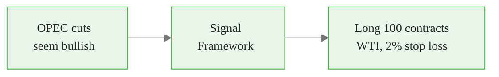
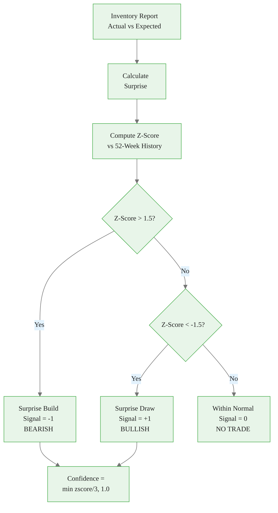
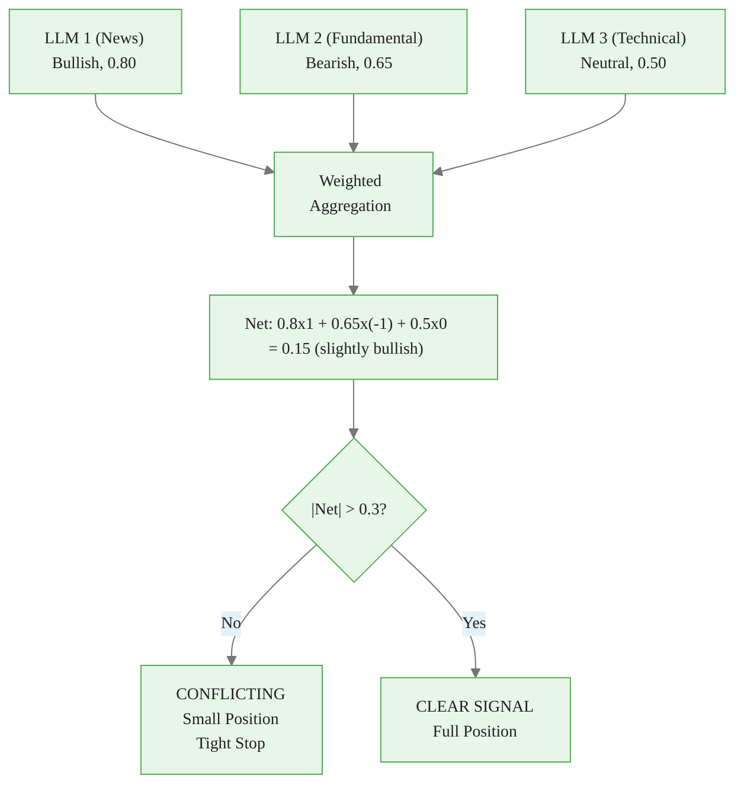
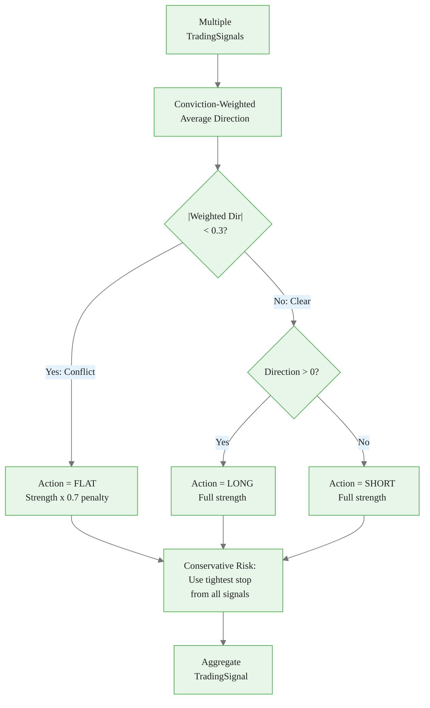
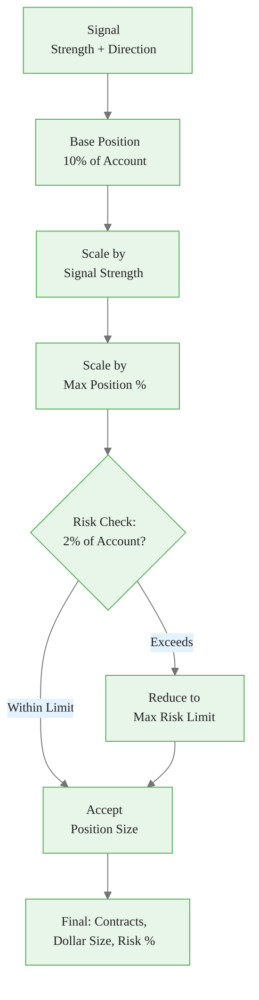
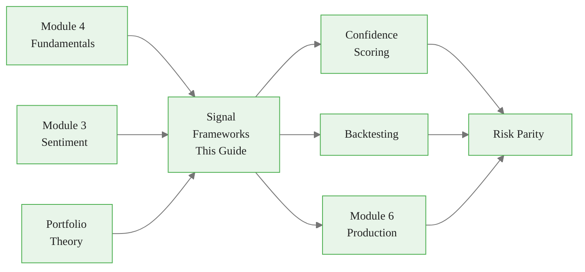

<!-- _class: lead -->

# Signal Generation Frameworks with LLMs

**Module 5: Signals**

Systematic transformation of LLM outputs into actionable trading signals

<!-- Speaker notes: This is the core deck for Module 5. It covers the full pipeline from raw LLM outputs to risk-managed positions. Budget ~50 minutes. Prerequisite: Modules 3-4 (Sentiment and Fundamentals). -->

---

## The Core Problem

LLMs understand context but don't naturally output tradeable signals.



<div class="callout-key">

Key implementation detail -- study this pattern carefully.

</div>

**A signal framework bridges the gap by:**
1. Structuring LLM outputs into standardized formats
2. Mapping narrative conviction to position sizes
3. Combining multiple signals with conflict resolution
4. Tracking signal performance for continuous improvement

<!-- Speaker notes: Open by stating the problem clearly. LLMs are great at understanding text but terrible at producing tradeable outputs without structure. This deck provides that structure. -->

---

## Formal Definition

**A trading signal is a tuple:**
$$\text{Signal} = (A, D, S, C, H, R)$$

Where:
- $A$: Action $\in$ {Long, Short, Flat}
- $D$: Direction $\in$ {Bullish, Bearish, Neutral}
- $S$: Strength $\in [0, 1]$ (conviction level)
- $C$: Catalyst (event or condition triggering signal)
- $H$: Time horizon $\in$ {Intraday, Short-term, Medium-term, Long-term}
- $R$: Risk parameters {stop_loss, take_profit, max_position}

<!-- Speaker notes: This formal definition is the standard that ALL signals in the system must conform to. Whether the signal comes from inventory data, news sentiment, or LLM analysis, it gets converted into this tuple. This standardization is what makes combination possible. -->

---

## Signal Types

| Signal Type | Description | Example |
|-------------|-------------|---------|
| **Event** | Binary trigger from specific news | OPEC cut announcement |
| **Sentiment** | Aggregated directional view | News sentiment score |
| **Fundamental** | Supply/demand derived | Inventory surprise |
| **Comparative** | Cross-commodity | Relative value |

> Each signal type captures a different market dimension -- combining them creates a more complete picture.

<!-- Speaker notes: Walk through each type with a concrete example. Event signals are the most time-sensitive. Fundamental signals are the most reliable. Sentiment signals provide context. Comparative signals identify mispricings. -->

---

## The Trading Team Analogy

<div class="columns">
<div>

### Without Framework
- Analyst A: "I think oil is bullish"
- Analyst B: "Oil looks bearish to me"
- Analyst C: "Maybe neutral?"
- **Trader: Confused, no position taken**

</div>
<div>

### With Signal Framework
- A: Bullish, 75%, 1-month (Supply cut)
- B: Bearish, 60%, 1-week (Oversupply)
- C: Neutral, 50%, long-term

**Resolution:**
1. Separate by horizon: A vs B -> Compatible
2. Weight by conviction: A (75%) > B (60%)
3. Position: Small long (conflicts reduce size)
4. Risk: Tight stop (uncertainty present)

</div>
</div>

<!-- Speaker notes: This analogy makes the framework concrete. Without structure, conflicting views lead to paralysis. With structure, conflicts are resolvable because you can compare like-for-like (same horizon, weighted by conviction). -->

---

<!-- _class: lead -->

# Fundamental Signals

Inventory surprises and production forecasts

<!-- Speaker notes: Transition to concrete signal implementations. Start with fundamental signals because they are the most reliable for commodity trading. -->

---

<!-- Speaker notes: Cover the key points about Inventory Surprise Signal. Emphasize practical implications and connect to previous material. -->

## Inventory Surprise Signal

```python
@dataclass
class InventorySignal:
    commodity: str
    report_date: pd.Timestamp
    actual: float
    expected: float
    surprise: float
    surprise_zscore: float
    signal: int  # -1, 0, 1
    confidence: float

```

<div class="callout-insight">

This pattern recurs throughout the course. Understanding it deeply pays dividends later.

</div>

---

```python
def generate_inventory_signal(
    self, actual, expected, threshold=1.5
) -> InventorySignal:
    surprise = actual - expected
    hist = [h['surprise']
            for h in self.surprise_history[-52:]]
    zscore = ((surprise - np.mean(hist))
              / np.std(hist))

    if zscore > threshold:
        signal, conf = -1, min(abs(zscore) / 3, 1.0)
    elif zscore < -threshold:
        signal, conf = 1, min(abs(zscore) / 3, 1.0)
    else:
        signal, conf = 0, 0.0
    return InventorySignal(...)

```

<div class="callout-warning">

Watch for edge cases with this implementation in production use.

</div>

<!-- Speaker notes: The z-score approach is key. It compares the current surprise to the distribution of past surprises. A z-score of 2.0 means the surprise is 2 standard deviations from the norm -- significant enough to trade on. Build = bearish (more supply), Draw = bullish (less supply). -->

---

## Inventory Signal Decision Flow



<div class="callout-info">

This approach follows established best practices in the field.

</div>

<!-- Speaker notes: The 1.5 z-score threshold filters out normal variation. Only truly surprising reports generate signals. This prevents overtrading on noise. The confidence scales linearly with z-score magnitude up to a cap. -->

---

<!-- Speaker notes: Cover the key points about Sentiment-Based Signal. Emphasize practical implications and connect to previous material. -->

## Sentiment-Based Signal

```python
class NewsSentimentSignal:
    def __init__(self, lookback_hours=24,
                 signal_threshold=0.3, min_articles=5):
        self.lookback = lookback_hours
        self.threshold = signal_threshold
        self.min_articles = min_articles

    def generate_signal(self) -> dict:
        recent = [s for s in self.sentiment_cache
                  if s['timestamp'] > cutoff]
        if len(recent) < self.min_articles:
            return {'signal': 0, 'reason': 'Insufficient'}
```

---

```python

        for s in recent:
            weight = s.get('confidence', 0.5)
            val = (1 if s['sentiment'] == 'bullish'
                   else -1 if s['sentiment'] == 'bearish'
                   else 0)
            weighted_sentiment += weight * val

        net = weighted_sentiment / total_weight
        signal = (1 if net > 0.3
                  else -1 if net < -0.3 else 0)
        return {'signal': signal, 'net': net}

```

<!-- Speaker notes: The minimum articles check (5) prevents acting on insufficient data. The confidence weighting ensures that high-confidence sentiment carries more influence. The 0.3 threshold means you need clear directional consensus before generating a signal. -->

---

## Multi-Signal Aggregation

**Given N signals $\{(A_i, D_i, S_i)\}_{i=1}^N$:**

$$D_{\text{agg}} = \frac{\sum_{i=1}^N S_i \cdot \text{sign}(D_i)}{\sum_{i=1}^N S_i}$$

**Conflict detection:** If $|D_{\text{agg}}| < \theta$ -> signals conflict -> reduce position



<!-- Speaker notes: Walk through the math with the example. 0.8 x 1 + 0.65 x (-1) + 0.5 x 0 = 0.15. Since |0.15| < 0.3, signals conflict. The framework correctly identifies this as uncertain and reduces position size. This is much better than either ignoring the conflict or not trading at all. -->

---

<!-- Speaker notes: Cover the key points about SignalAggregator Implementation. Emphasize practical implications and connect to previous material. -->

## SignalAggregator Implementation

```python
class SignalAggregator:
    def aggregate(self, signals: List[TradingSignal]
    ) -> TradingSignal:
        total_weight = sum(s.strength for s in signals)
        weighted_direction = sum(
            s.strength * s.direction.value
            for s in signals) / total_weight

        has_conflict = abs(weighted_direction) < 0.3
```

---

<div class="code-window">
<div class="code-header">
<div class="dots"><span class="dot-red"></span><span class="dot-yellow"></span><span class="dot-green"></span></div>
<span class="filename">example.py</span>
</div>

```python

        if has_conflict:
            action = Action.FLAT
            strength = 0.0
        elif weighted_direction > 0:
            action = Action.LONG
            strength = min(weighted_direction, 1.0)
        else:
            action = Action.SHORT
            strength = min(abs(weighted_direction), 1.0)

        # Conflict penalty
        strength *= 0.7 if has_conflict else 1.0

```

</div>

<!-- Speaker notes: The 0.7 conflict penalty reduces position size by 30% when signals disagree. This is a conservative approach -- some traders would stay completely flat on conflicts. The key insight is that conflicts should always reduce, never increase, position sizing. -->

---

## Conflict Resolution Pipeline



<!-- Speaker notes: The conservative risk management is important: when conflicts exist, use the tightest stop loss from any individual signal. This ensures that the most cautious risk view prevails during uncertain periods. -->

---

<!-- _class: lead -->

# Position Sizing

Converting signals to risk-managed positions

<!-- Speaker notes: Transition from signal generation to position sizing. This is where theory meets money. -->

---

<!-- Speaker notes: Cover the key points about Position Sizing from Signals. Emphasize practical implications and connect to previous material. -->

## Position Sizing from Signals

**Position Size:**
$$\text{Position} = \text{Base Size} \times S \times \min(1, \text{Kelly Fraction})$$

<div class="code-window">
<div class="code-header">
<div class="dots"><span class="dot-red"></span><span class="dot-yellow"></span><span class="dot-green"></span></div>
<span class="filename">positionsizer.py</span>
</div>

```python
class PositionSizer:
    def size_position(self, signal) -> Dict:
        base = self.account_value * self.base_position_pct
        adjusted = base * signal.strength

        # Risk constraint (2% rule)
        risk_per_unit = abs(
            signal.entry_price - signal.stop_loss)
        max_risk = self.account_value * 0.02
        max_contracts = max_risk / risk_per_unit
```

</div>

---

<div class="code-window">
<div class="code-header">
<div class="dots"><span class="dot-red"></span><span class="dot-yellow"></span><span class="dot-green"></span></div>
<span class="filename">example.py</span>
</div>

```python

        contracts = min(
            adjusted / signal.entry_price,
            max_contracts)

        return {
            'contracts': int(contracts),
            'dollar_size': contracts * signal.entry_price,
            'risk_pct': (contracts * risk_per_unit
                         / self.account_value)
        }

```

</div>

<!-- Speaker notes: The 2% rule is the safety net: never risk more than 2% of account value on a single trade, regardless of signal strength. This prevents a single wrong signal from causing catastrophic losses. The Kelly fraction provides a theoretical optimal, but in practice you should use half-Kelly or less. -->

---

## Position Sizing Guards



**Adjustments stack multiplicatively:**
- Base: 1.0 x max_position
- After confidence: 0.8 x max (if strength = 0.8)
- After vol adjustment: 0.6 x max (if vol is high)

<!-- Speaker notes: Multiple guard rails prevent oversizing. Even if the signal is very strong (1.0), the risk constraint caps the position. This layered approach means you need to violate multiple constraints to take an oversized position -- which should never happen in production. -->

---

## Common Pitfalls

<div class="columns">
<div>

### Over-Trusting LLM Conviction
LLM says "very strong bullish" without calibration

**Solution:** Calibrate LLM outputs against historical performance; track hit rates

### Ignoring Signal Conflicts
Taking signals in isolation

**Solution:** Implement conflict detection; reduce size when signals disagree

### No Time Horizon Separation
Mixing intraday with monthly signals

**Solution:** Separate signal pipelines by horizon; aggregate only within horizon

</div>
<div>

### Static Risk Parameters
Same stop loss % for all signals

**Solution:** Dynamically adjust risk based on signal strength and confidence

### No Signal Performance Tracking
Not measuring if LLM signals work

**Solution:** Log all signals, track P&L attribution, iterate prompts

### Single Signal Dependency
Relying on just one signal type

**Solution:** Combine fundamental, sentiment, and event signals with appropriate weights

</div>
</div>

<!-- Speaker notes: The most dangerous pitfall is over-trusting LLM conviction. LLMs are notoriously overconfident. Always track actual hit rates and calibrate accordingly. If an LLM says "90% confident" but is right only 60% of the time, adjust the strength mapping. -->

---

## Key Takeaways

1. **Signal = (Action, Direction, Strength, Catalyst, Horizon, Risk)** -- standardized structure for all LLM outputs

2. **Multiple signal sources** -- combine fundamental, sentiment, and event signals for robustness

3. **Conflict detection is critical** -- when signals disagree, reduce size or stay flat

4. **Position sizing follows strength** -- higher conviction = larger position, with Kelly fraction constraints

5. **Track performance** -- log every signal and measure which sources generate alpha

<!-- Speaker notes: This deck provides the framework that all subsequent signal work builds on. Confidence Scoring (next deck) addresses the LLM overconfidence problem. Backtesting (deck 03) provides the validation framework. -->

---

## Connections



<!-- Speaker notes: Point learners to Confidence Scoring as the immediate next step -- it directly addresses the LLM overconfidence problem flagged in the pitfalls. Backtesting validates whether signals actually work before deploying to production. -->
