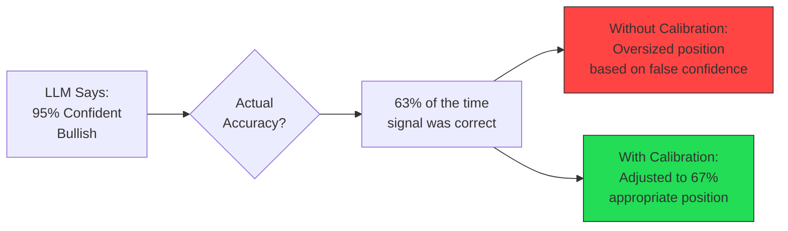
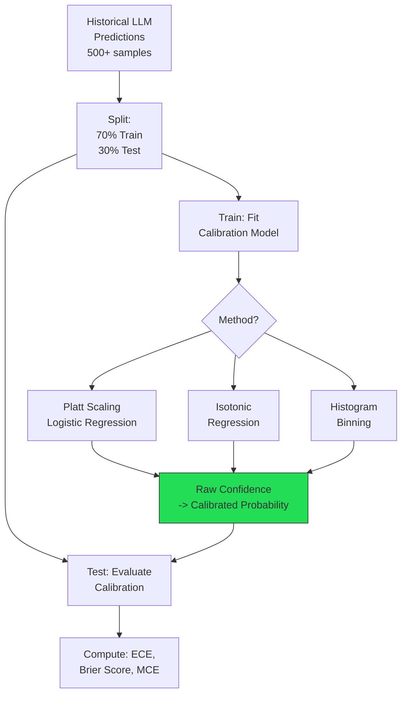
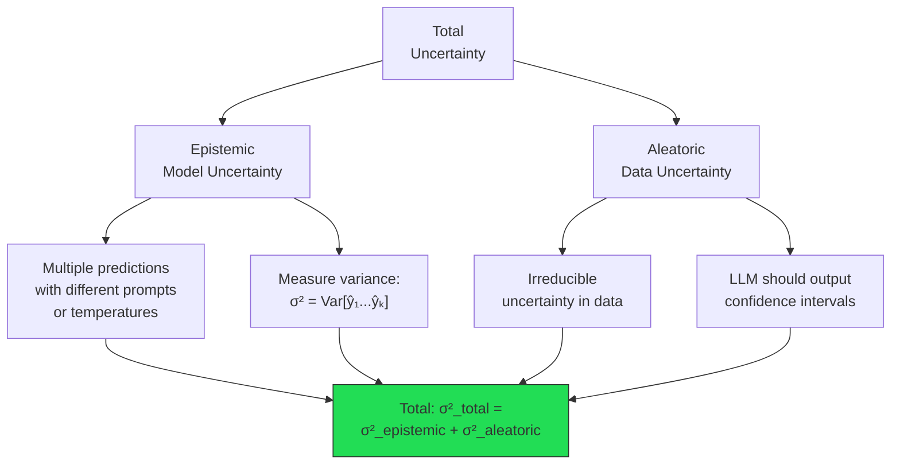
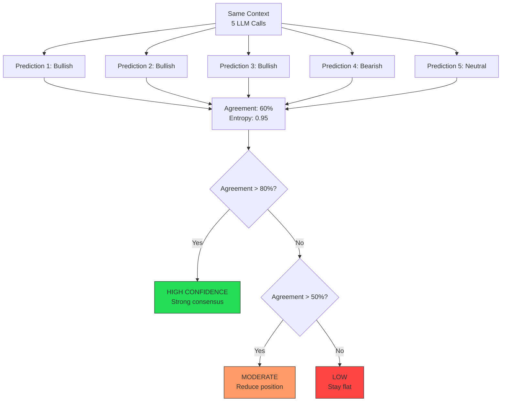
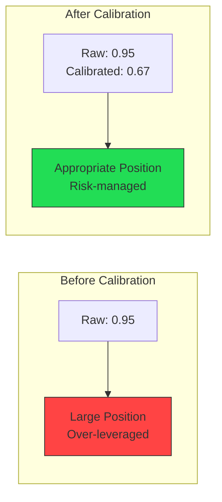
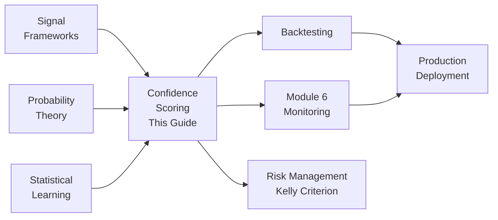

<!-- _class: lead -->

# LLM Confidence Calibration

**Module 5: Signals**

Quantifying reliability of LLM-generated trading signals

<!-- Speaker notes: Section transition. Briefly preview what this section covers before diving into details. -->

---

## The Overconfidence Problem

LLMs are notoriously overconfident -- claiming 90% certainty on predictions correct only 60% of the time.



<!-- Speaker notes: Walk through the diagram step by step. Highlight the key decision points and data flow. -->

---

## Why Calibration Matters

| Signal | Raw Confidence | Calibrated | Position Size | Outcome |
|--------|----------------|------------|---------------|---------|
| A | 0.90 | 0.60 | 60% of base | Correct sizing |
| B | 0.95 | 0.65 | 65% of base | Correct sizing |
| C | 0.70 | 0.55 | 55% of base | Avoid over-risk |

> Without calibration, all signals appear highly confident -- leading to an over-leveraged portfolio.

**Calibrated confidence of 0.75 means:** historically, signals with this confidence were correct 75% of the time.

<!-- Speaker notes: Review the table contents. Ask learners which rows are most relevant to their use case. -->

---

## Formal Definition: Expected Calibration Error

**Given N predictions with confidence scores $\{(c_i, y_i, \hat{y}_i)\}_{i=1}^N$:**

1. Partition into M bins: $B_m = \{i : c_i \in [\frac{m-1}{M}, \frac{m}{M})\}$

2. Bin accuracy: $\text{acc}(B_m) = \frac{1}{|B_m|} \sum_{i \in B_m} \mathbb{1}[\hat{y}_i = y_i]$

3. Bin confidence: $\text{conf}(B_m) = \frac{1}{|B_m|} \sum_{i \in B_m} c_i$

4. **ECE:** $\text{ECE} = \sum_{m=1}^M \frac{|B_m|}{N} |\text{acc}(B_m) - \text{conf}(B_m)|$

**Perfect calibration:** ECE = 0

<!-- Speaker notes: Present the formal definition but keep focus on practical implications. Reference back to the intuitive explanation. -->

---

## Calibration Methods

<div class="columns">
<div>

### 1. Platt Scaling
Logistic calibration:
$$P(y=1|c) = \frac{1}{1 + \exp(A \cdot c + B)}$$

Fit A, B on validation set.
**Best for:** Parametric, smooth mapping.

### 2. Isotonic Regression
Non-parametric monotonic mapping:
$$f: [0,1] \rightarrow [0,1]$$

**Best for:** Arbitrary relationships.

</div>
<div>

### 3. Temperature Scaling
For logit-based confidence:
$$\text{conf}_{\text{cal}} = \text{softmax}\left(\frac{\text{logit}}{T}\right)$$

Single parameter T.
**Best for:** Simplicity.

### 4. Histogram Binning
Bin predictions, replace confidence with bin accuracy.
**Best for:** Interpretability.

</div>
</div>

<!-- Speaker notes: Present the key concepts on this slide. Pause for questions before moving to the next topic. -->

---

## Calibration Pipeline



<!-- Speaker notes: Walk through the diagram step by step. Highlight the key decision points and data flow. -->

---

<!-- _class: lead -->

# Confidence Calibrator Implementation

Platt scaling, isotonic, and histogram methods

<!-- Speaker notes: Section transition. Briefly preview what this section covers before diving into details. -->

---

## ConfidenceCalibrator Class

```python
class ConfidenceCalibrator:
    def __init__(self, method='platt'):
        self.method = method  # platt|isotonic|histogram

    def fit(self, confidences, outcomes):
        if self.method == 'platt':
            self.calibrator = LogisticRegression()
            self.calibrator.fit(
                confidences.reshape(-1, 1), outcomes)
        elif self.method == 'isotonic':
            self.calibrator = IsotonicRegression(
                out_of_bounds='clip')
            self.calibrator.fit(confidences, outcomes)
```

---

```python

    def predict(self, confidences):
        if self.method == 'platt':
            return self.calibrator.predict_proba(
                confidences.reshape(-1, 1))[:, 1]
        elif self.method == 'isotonic':
            return self.calibrator.predict(confidences)

```

<!-- Speaker notes: Walk through the code, emphasizing the key patterns. Highlight which parts learners should customize for their own use cases. -->

---

## Evaluation Metrics

```python
def evaluate(self, confidences, outcomes) -> Dict:
    # Expected Calibration Error (ECE)
    bins = np.linspace(0, 1, 11)
    bin_indices = np.digitize(confidences, bins) - 1

    ece = 0
    mce = 0
    for i in range(10):
        mask = bin_indices == i
        if mask.sum() > 0:
```

---

```python
            bin_conf = confidences[mask].mean()
            bin_acc = outcomes[mask].mean()
            bin_weight = mask.sum() / len(confidences)
            ece += bin_weight * abs(bin_acc - bin_conf)
            mce = max(mce, abs(bin_acc - bin_conf))

    # Brier score (lower is better)
    brier = brier_score_loss(outcomes, confidences)

    return {'ece': ece, 'mce': mce, 'brier_score': brier}

```

<!-- Speaker notes: Walk through the code, emphasizing the key patterns. Highlight which parts learners should customize for their own use cases. -->

---

## Uncertainty Decomposition



<!-- Speaker notes: Walk through the diagram step by step. Highlight the key decision points and data flow. -->

---

<!-- _class: lead -->

# Ensemble Confidence

Using disagreement as an uncertainty measure

<!-- Speaker notes: Section transition. Briefly preview what this section covers before diving into details. -->

---

## Ensemble Approach

Generate 5 signals for the same context:

```python
class EnsembleConfidence:
    def __init__(self, n_samples=5):
        self.n_samples = n_samples

    def generate_ensemble(self, prompt, temp=0.8):
        predictions = []
        for i in range(self.n_samples):
            response = client.messages.create(
                model="claude-sonnet-4-20250514",
                temperature=temp,
                messages=[{"role": "user",
                           "content": prompt}])
            predictions.append(parse(response))
        return predictions
```

---

```python

    def compute_confidence(self, predictions):
        directions = [p['direction'] for p in predictions]
        agreement = max(Counter(directions).values()) / len(directions)
        entropy = -sum(p * log(p) for p in probs)
        return {'agreement_rate': agreement, 'entropy': entropy}

```

<!-- Speaker notes: Walk through the code, emphasizing the key patterns. Highlight which parts learners should customize for their own use cases. -->

---

## Ensemble Interpretation



<!-- Speaker notes: Walk through the diagram step by step. Highlight the key decision points and data flow. -->

---

<!-- _class: lead -->

# Calibrated Position Sizing

Kelly criterion with calibrated confidence

<!-- Speaker notes: Section transition. Briefly preview what this section covers before diving into details. -->

---

## CalibratedPositionSizer

```python
class CalibratedPositionSizer:
    def __init__(self, account_value,
                 max_risk_per_trade=0.02,
                 kelly_fraction=0.25):  # 1/4 Kelly
        ...

    def kelly_size(self, win_prob,
                   win_loss_ratio=2.0) -> float:
        kelly = (win_prob * win_loss_ratio
                 - (1 - win_prob)) / win_loss_ratio
        return max(0, kelly * self.kelly_fraction)

```

---

```python
    def size_from_confidence(self, calibrated_confidence,
                             entry_price, stop_loss):
        risk_per_unit = abs(entry_price - stop_loss)
        kelly_pct = self.kelly_size(calibrated_confidence)
        kelly_dollars = self.account_value * kelly_pct
        target_units = kelly_dollars / entry_price

        # Risk constraint
        max_risk = self.account_value * self.max_risk_per_trade
        max_units = max_risk / risk_per_unit

        return min(target_units, max_units)

```

<!-- Speaker notes: Walk through the code, emphasizing the key patterns. Highlight which parts learners should customize for their own use cases. -->

---

## Calibration Impact on Position Sizing



**Position Sizing Comparison ($1M account):**
| Signal | Raw Conf | Calibrated | Uncal Position | Cal Position | Reduction |
|--------|----------|------------|----------------|--------------|-----------|
| High | 0.95 | 0.68 | $142K | $87K | 39% |
| Medium | 0.75 | 0.60 | $95K | $62K | 35% |
| Low | 0.60 | 0.52 | $57K | $31K | 46% |

<!-- Speaker notes: Walk through the diagram step by step. Highlight the key decision points and data flow. -->

---

## Common Pitfalls

<div class="columns">
<div>

### Insufficient Calibration Data
Calibrating on 50 samples yields unstable mapping

**Solution:** Collect at least 200-500 historical predictions before calibrating

### Non-Stationary Confidence
LLM confidence drifts as market regime changes

**Solution:** Recalibrate monthly, use rolling window validation

### Ignoring Epistemic Uncertainty
Single LLM call without measuring model uncertainty

**Solution:** Generate ensemble predictions for critical decisions

</div>
<div>

### Overfitting Calibration
Complex calibration on small dataset

**Solution:** Use simple methods (Platt, isotonic) unless data abundant

### Conflating Calibration with Discrimination
Well-calibrated model can still have poor accuracy

**Solution:** Monitor both calibration (ECE) and discrimination (accuracy, AUC)

</div>
</div>

<!-- Speaker notes: Walk through each pitfall with a real-world example. Ask learners if they have encountered any of these in their own work. -->

---

## Key Takeaways

1. **LLMs are overconfident** -- raw confidence of 0.95 may correspond to only 63% accuracy

2. **Calibration transforms subjective confidence** into objective probability estimates

3. **ECE measures calibration quality** -- lower is better, zero is perfect

4. **Ensemble disagreement** provides a model-free uncertainty measure

5. **Kelly criterion with calibrated confidence** enables optimal, risk-managed position sizing

<!-- Speaker notes: Recap the main points. Ask learners which takeaway they found most surprising or useful. -->

---

## Connections



<!-- Speaker notes: Show how this content connects to other modules. Point learners to the next recommended deck. -->
