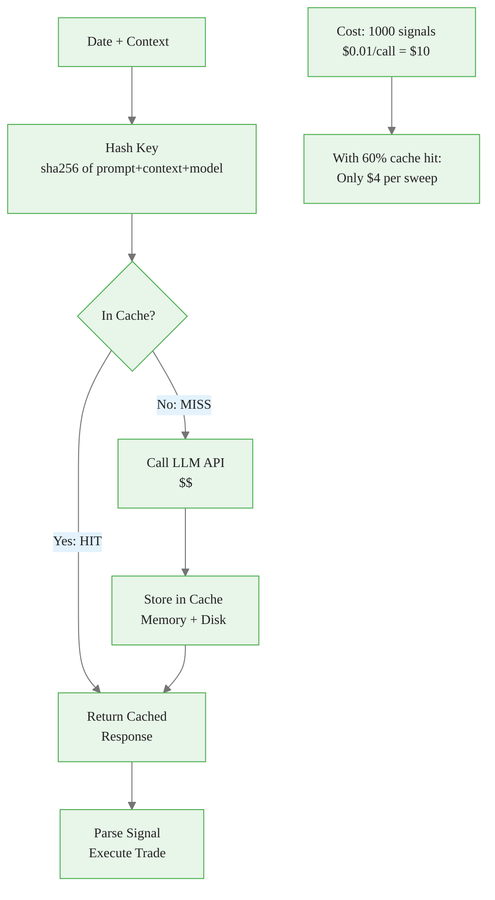
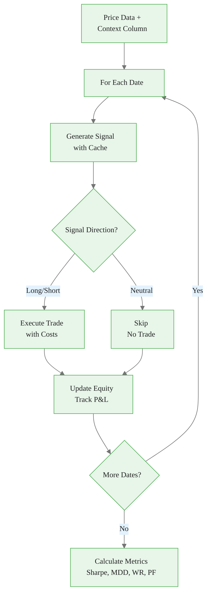
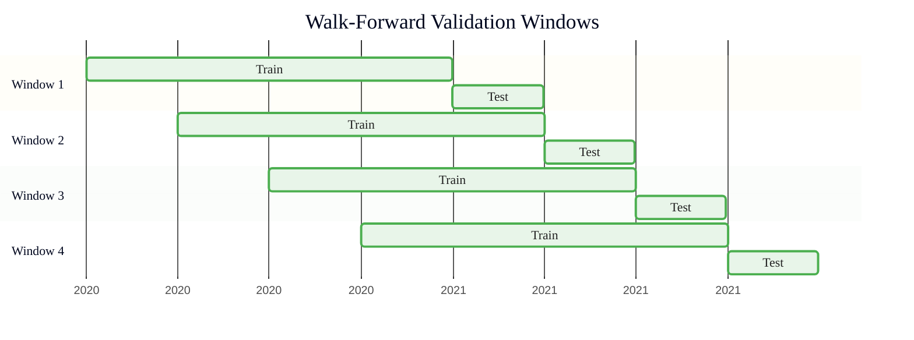
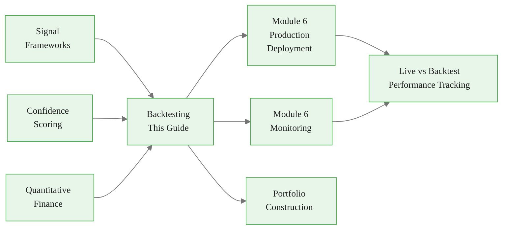

<!-- _class: lead -->

# Backtesting LLM-Generated Signals

**Module 5: Signals**

Validating signal performance with historical data

<!-- Speaker notes: Section transition. Briefly preview what this section covers before diving into details. -->

---

## Why LLM Backtesting is Different

<div class="columns">
<div>

### Traditional (Fast)
```python
# Compute indicator once
indicator = compute_RSI(prices)
# Test thousands of parameters
for threshold in range(20, 80):
    signals = indicator > threshold
    pnl = backtest(signals, prices)
```

<div class="callout-key">

Key implementation detail -- study this pattern carefully.

</div>
**Time:** Seconds for thousands of tests

</div>
<div>

### LLM-Based (Expensive)
```python
# Must call LLM for each signal
for date in dates:
    context = get_context(date)
    signal = LLM(context)  # $$$
    pnl = execute(signal, prices)
```
**Time:** Hours for a single test

</div>
</div>

> Key challenges: non-deterministic outputs, computational cost, temporal data leakage, prompt stability.

<!-- Speaker notes: Walk through the code, emphasizing the key patterns. Highlight which parts learners should customize for their own use cases. -->

---

## Formal Definition

**Signal Generation:**
$$s_t = \text{LLM}(C_t, \theta)$$

- $s_t$: Signal at time t
- $C_t$: Context available at time t (must enforce causality)
- $\theta$: LLM parameters (model, temperature, prompt)

**P&L Calculation (long signal):**
$$\text{PnL}_t = n_t \times (p_{t+1} - p_t) - \text{TC}_t - \text{Slip}_t$$

**No look-ahead bias:**
$$C_t = \{x_s : s \leq t\}$$

Only information available at time t can be used in prompt.

<!-- Speaker notes: Present the formal definition but keep focus on practical implications. Reference back to the intuitive explanation. -->

---

## Performance Metrics

| Metric | Formula | Good Target |
|--------|---------|-------------|
| **Sharpe Ratio** | $\frac{\mu_r}{\sigma_r} \sqrt{252}$ | > 1.5 |
| **Max Drawdown** | $\max_t \frac{\text{Peak}_t - \text{Value}_t}{\text{Peak}_t}$ | < 20% |
| **Win Rate** | $\frac{\text{Wins}}{\text{Total Trades}}$ | > 55% |
| **Profit Factor** | $\frac{\sum \text{Wins}}{\sum |\text{Losses}|}$ | > 1.5 |
| **Calmar Ratio** | $\frac{\text{Annual Return}}{\text{MDD}}$ | > 1.0 |

<!-- Speaker notes: Review the table contents. Ask learners which rows are most relevant to their use case. -->

---

## The Caching Solution



<div class="callout-insight">

This pattern recurs throughout the course. Understanding it deeply pays dividends later.

</div>

<!-- Speaker notes: Walk through the diagram step by step. Highlight the key decision points and data flow. -->

---

<!-- _class: lead -->

# Backtest Engine Implementation

Cache, execute, and measure

<!-- Speaker notes: Section transition. Briefly preview what this section covers before diving into details. -->

---

<!-- Speaker notes: Cover the key points about LLMSignalCache. Emphasize practical implications and connect to previous material. -->

## LLMSignalCache

```python
class LLMSignalCache:
    def __init__(self, cache_dir='./llm_backtest_cache'):
        self.cache_dir = Path(cache_dir)
        self.cache_dir.mkdir(exist_ok=True)
        self.cache = {}  # In-memory
        self.hits = 0
        self.misses = 0

    def _hash_key(self, prompt, context, model):
        content = f"{model}|{prompt}|{context}"
        return hashlib.sha256(content.encode()).hexdigest()

```

<div class="callout-warning">

Watch for edge cases with this implementation in production use.

</div>

---

```python
    def get(self, prompt, context, model):
        key = self._hash_key(prompt, context, model)
        if key in self.cache:  # Memory first
            self.hits += 1
            return self.cache[key]
        cache_file = self.cache_dir / f"{key}.pkl"
        if cache_file.exists():  # Then disk
            self.hits += 1
            return pickle.load(open(cache_file, 'rb'))
        self.misses += 1
        return None

```

<div class="callout-info">

This approach follows established best practices in the field.

</div>

<!-- Speaker notes: Walk through the code, emphasizing the key patterns. Highlight which parts learners should customize for their own use cases. -->

---

<!-- Speaker notes: Cover the key points about LLMBacktester Core. Emphasize practical implications and connect to previous material. -->

## LLMBacktester Core

```python
class LLMBacktester:
    def __init__(self, initial_capital=1_000_000,
                 commission_rate=0.0005,  # 5 bps
                 slippage_bps=2.0):
        self.cache = LLMSignalCache()

    def generate_signal(self, date, context,
                        prompt_template, model):
        full_prompt = prompt_template.format(
            date=date, context=context)

        # Check cache first
        cached = self.cache.get(full_prompt, context, model)
        if cached is not None:
            return cached
```

---

```python

        # Call LLM (expensive)
        response = client.messages.create(
            model=model, max_tokens=512,
            messages=[{"role": "user",
                       "content": full_prompt}])
        signal = json.loads(response.content[0].text)

        # Cache for future use
        self.cache.set(full_prompt, context, model, signal)
        return signal

```

<!-- Speaker notes: Walk through the code, emphasizing the key patterns. Highlight which parts learners should customize for their own use cases. -->

---

<!-- Speaker notes: Cover the key points about Trade Execution with Costs. Emphasize practical implications and connect to previous material. -->

## Trade Execution with Costs

```python
def execute_trade(self, signal, entry_price,
                  exit_price, capital) -> Trade:
    direction = signal.get('direction', 'neutral')
    strength = signal.get('strength', 0.5)

    # Position sizing: max 10% x strength
    position_value = capital * 0.10 * strength
    size = position_value / entry_price

```

---

```python
    # Transaction costs
    commission = position_value * self.commission_rate * 2
    entry_slip = entry_price * (self.slippage_bps / 10000)
    exit_slip = exit_price * (self.slippage_bps / 10000)

    # P&L with realistic friction
    if direction == 'long':
        gross_pnl = size * (
            (exit_price - exit_slip)
            - (entry_price + entry_slip))
    net_pnl = gross_pnl - commission

```

<!-- Speaker notes: Walk through the code, emphasizing the key patterns. Highlight which parts learners should customize for their own use cases. -->

---

## Backtest Execution Flow



<!-- Speaker notes: Walk through the diagram step by step. Highlight the key decision points and data flow. -->

---

<!-- _class: lead -->

# Walk-Forward Validation

Preventing overfitting with time-series cross-validation

<!-- Speaker notes: Section transition. Briefly preview what this section covers before diving into details. -->

---

## Walk-Forward vs In-Sample

<div class="columns">
<div>

### Bad: In-Sample Overfitting
```
[==== Training (5 years) ====]
Test hundreds of prompt variants
Pick best → Report performance
on SAME 5 years → OVERFITTED
```

**Result:** 80% win rate in backtest, 45% live

</div>
<div>

### Good: Walk-Forward
```
Year 1-3: Train → Yr 4: Val → Yr 5: Test
Year 2-4: Train → Yr 5: Val → Yr 6: Test
...
Report: Average of out-of-sample periods
```

**Result:** Realistic expectations

</div>
</div>

<!-- Speaker notes: Present the key concepts on this slide. Pause for questions before moving to the next topic. -->

---

<!-- Speaker notes: Cover the key points about Walk-Forward Implementation. Emphasize practical implications and connect to previous material. -->

## Walk-Forward Implementation

```python
def walk_forward_validation(
    self, data, prompt_template,
    train_days=252,   # 1 year train
    test_days=63,     # 3 months test
    step_days=21      # Roll monthly
) -> List[BacktestResult]:
    results = []
    start_idx = train_days

    while start_idx + test_days < len(data):
        # Training data (for calibration)
        train = data.iloc[start_idx - train_days:start_idx]
```

---

<div class="code-window">
<div class="code-header">
<div class="dots"><span class="dot-red"></span><span class="dot-yellow"></span><span class="dot-green"></span></div>
<span class="filename">example.py</span>
</div>

```python

        # Test data (out-of-sample)
        test = data.iloc[start_idx:start_idx + test_days]

        # Run backtest on test period only
        result = self.run_backtest(test, prompt_template)
        results.append(result)

        # Step forward
        start_idx += step_days

    return results

```

</div>

<!-- Speaker notes: Walk through the code, emphasizing the key patterns. Highlight which parts learners should customize for their own use cases. -->

---

## Walk-Forward Visualization



> Each test window is truly out-of-sample -- the model never sees test data during training.

<!-- Speaker notes: Walk through the diagram step by step. Highlight the key decision points and data flow. -->

---

<!-- Speaker notes: Cover the key points about Performance Metrics Calculation. Emphasize practical implications and connect to previous material. -->

## Performance Metrics Calculation

<div class="code-window">
<div class="code-header">
<div class="dots"><span class="dot-red"></span><span class="dot-yellow"></span><span class="dot-green"></span></div>
<span class="filename">_calculate_metrics.py</span>
</div>

```python
def _calculate_metrics(self, trades, equity_curve):
    # Sharpe ratio (annualized)
    returns = equity_series.pct_change().dropna()
    sharpe = (returns.mean() / returns.std()) * np.sqrt(252)

    # Maximum drawdown
    cummax = equity_series.cummax()
    drawdown = (equity_series - cummax) / cummax
    max_drawdown = drawdown.min()

    # Win rate
    win_rate = len([t for t in trades if t.pnl > 0]) / len(trades)
```

</div>

---

<div class="code-window">
<div class="code-header">
<div class="dots"><span class="dot-red"></span><span class="dot-yellow"></span><span class="dot-green"></span></div>
<span class="filename">example.py</span>
</div>

```python

    # Profit factor
    total_wins = sum(t.pnl for t in trades if t.pnl > 0)
    total_losses = abs(sum(t.pnl for t in trades if t.pnl < 0))
    profit_factor = total_wins / total_losses

    return BacktestResult(
        sharpe_ratio=sharpe, max_drawdown=max_drawdown,
        win_rate=win_rate, profit_factor=profit_factor, ...)

```

</div>

<!-- Speaker notes: Walk through the code, emphasizing the key patterns. Highlight which parts learners should customize for their own use cases. -->

---

## Common Pitfalls

<div class="columns">
<div>

### Temporal Data Leakage
LLM trained on data from backtest period

**Solution:** Test on data post-LLM training cutoff; use older LLM versions for historical tests

### Look-Ahead Bias
Context includes future information

**Solution:** Strict timestamp checks -- only use data published before signal date

### Survivor Bias
Testing only on commodities that still trade

**Solution:** Include delisted contracts; test across multiple commodities

</div>
<div>

### Ignoring Transaction Costs
No slippage or commissions modeled

**Solution:** Conservative estimates: 5-10 bps slippage, realistic commissions

### Prompt Instability
Slight prompt changes cause wildly different signals

**Solution:** Test prompt robustness with paraphrased versions; use temperature=0 for determinism

</div>
</div>

<!-- Speaker notes: Walk through each pitfall with a real-world example. Ask learners if they have encountered any of these in their own work. -->

---

## Computational Cost Management

**Cost per backtest:**
$$\text{Cost} = n_{\text{signals}} \times c_{\text{LLM}} \times n_{\text{variants}}$$

| Scenario | Signals | Cost/Call | Variants | Total |
|----------|---------|-----------|----------|-------|
| Single test | 1,000 | $0.01 | 1 | $10 |
| Parameter sweep | 1,000 | $0.01 | 10 | $100 |
| With 60% cache | 1,000 | $0.01 | 10 | $40 |

> Response caching reduces cost by 60-95% for parameter sweeps. Always cache.

<!-- Speaker notes: Review the table contents. Ask learners which rows are most relevant to their use case. -->

---

## Key Takeaways

1. **LLM backtesting is expensive** -- cache responses to reduce API costs by 60-95%

2. **Walk-forward validation prevents overfitting** -- never test on training data

3. **Model realistic costs** -- slippage and commissions can destroy apparent profitability

4. **Enforce causality** -- only use information available at signal generation time

5. **Test prompt robustness** -- if paraphrased prompts give wildly different results, the signal is fragile

<!-- Speaker notes: Recap the main points. Ask learners which takeaway they found most surprising or useful. -->

---

## Connections



<!-- Speaker notes: Show how this content connects to other modules. Point learners to the next recommended deck. -->
