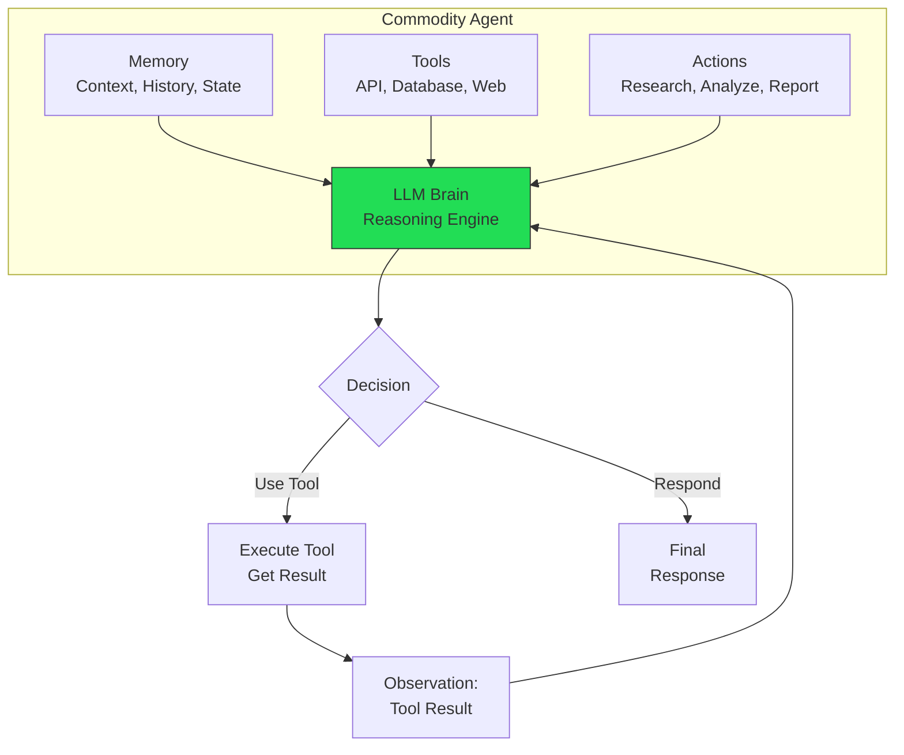
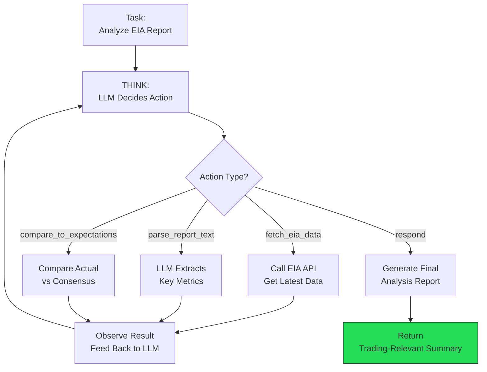
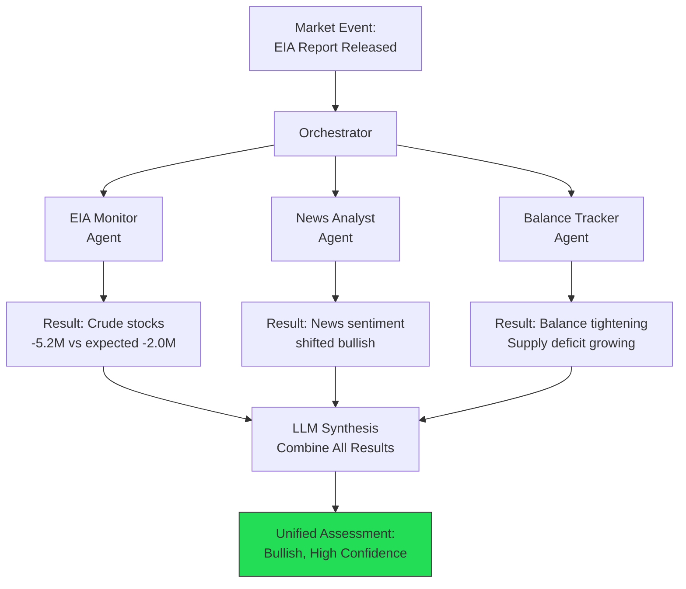
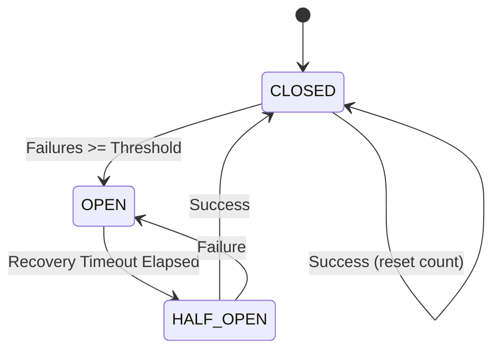
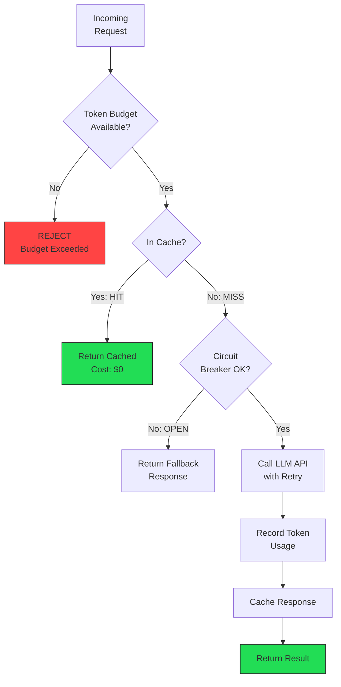
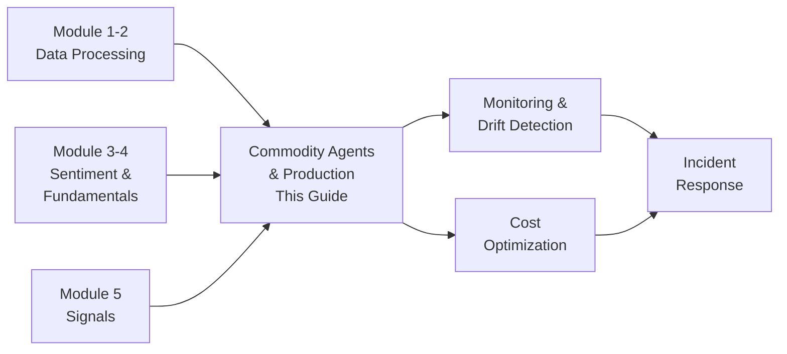

<!-- _class: lead -->

# Building Commodity Trading Agents for Production

**Module 6: Production**

Autonomous research-to-signal pipelines with reliability, cost control, and monitoring

<!-- Speaker notes: This deck combines agent architecture with production deployment patterns. It covers the think-act-observe loop, multi-agent orchestration, AND the production infrastructure (retries, circuit breakers, caching) needed to run agents reliably. Budget ~50 minutes. -->

---

## Agent Architecture



> Agents combine LLM reasoning with tool execution in a think-act-observe loop.

<!-- Speaker notes: This is the core concept. Unlike simple LLM calls that process text and return text, agents can take actions in the world: calling APIs, querying databases, fetching web data. The loop continues until the agent decides it has enough information to respond. -->

---

## Agent Types

| Agent Type | Purpose | Data Sources |
|------------|---------|--------------|
| **Report Monitor** | Parse government reports | EIA, USDA, IEA |
| **News Analyst** | Sentiment analysis | Reuters, Bloomberg |
| **Balance Tracker** | Supply/demand modeling | Multiple agencies |
| **Signal Generator** | Trading signals | All above |

Each agent is specialized -- combining them creates a comprehensive analysis system.

<!-- Speaker notes: Specialization is key. A single monolithic agent would need a huge context window and would be slow. Four specialized agents can run in parallel, each focused on their domain expertise. -->

---

## AgentMemory and CommodityAgent

```python
@dataclass
class AgentMemory:
    context: List[Dict] = field(default_factory=list)
    reports_processed: List[str] = field(
        default_factory=list)
    max_context: int = 20

    def add_context(self, role, content):
        self.context.append(
            {"role": role, "content": content})
        if len(self.context) > self.max_context:
            self.context = (
                self.context[:1]
                + self.context[-(self.max_context-1):])
```

---

```python

class CommodityAgent:
    def __init__(self, name, commodity,
                 system_prompt, tools):
        self.name = name
        self.commodity = commodity
        self.client = Anthropic()
        self.memory = AgentMemory()
        self.tools = tools  # Dict[str, Callable]

```

<!-- Speaker notes: The sliding window memory management is critical. Without it, the context window fills up and the agent stops working. The strategy keeps the system prompt (index 0) and the most recent N-1 entries. -->

---

## Think-Act-Observe Loop

```python
def run(self, task, max_steps=5) -> str:
    observation = task
    for step in range(max_steps):
        # THINK: LLM decides what to do
        thought = self.think(observation)
        decision = json.loads(thought)

        # ACT: Execute tool or respond
        result = self.act(
            decision.get('action', 'respond'),
            decision.get('action_input', ''))

        # OBSERVE: Check if done
        if decision.get('action') == 'respond':
            return result

        observation = f"Tool result: {result}"

    return final_response
```

<!-- Speaker notes: The max_steps parameter prevents infinite loops. Most tasks complete in 2-3 steps. If the agent hasn't converged after 5 steps, something is wrong and we return whatever partial result we have. -->

---

## Agent Decision Flow



<!-- Speaker notes: Walk through a concrete example: the EIA report comes out. Step 1: agent fetches the data. Step 2: agent parses key metrics. Step 3: agent compares to consensus. Step 4: agent generates analysis. Each step builds on the previous observation. -->

---

<!-- _class: lead -->

# Multi-Agent Orchestration

Coordinating specialized agents

<!-- Speaker notes: Transition from single agent to multi-agent systems. This is where the real power comes in -- parallel, specialized analysis. -->

---

## AgentOrchestrator

```python
class AgentOrchestrator:
    def __init__(self):
        self.agents: Dict[str, CommodityAgent] = {}

    def register_agent(self, name, agent):
        self.agents[name] = agent

    def run_all(self, task) -> Dict[str, str]:
        outputs = {}
        for name, agent in self.agents.items():
            try:
                result = agent.run(task)
                outputs[name] = result
            except Exception as e:
                outputs[name] = f"Error: {str(e)}"
        return outputs
```

---

```python

    def synthesize_results(self, outputs) -> str:
        prompt = f"""Synthesize commodity analysis:
        {json.dumps(outputs, indent=2)}
        Provide: key findings, agreement/disagreement,
        overall assessment, recommended action."""
        return self.client.messages.create(...)

```

<!-- Speaker notes: The try/except per agent is critical. If the EIA agent fails, the news and balance agents still produce results. The synthesis step combines all available results into a unified view, noting which agents failed. -->

---

## Multi-Agent Orchestration Flow



<!-- Speaker notes: This example shows a bullish confluence: surprise draw + bullish sentiment + tightening balance. When all three agents agree, confidence is highest. When they disagree, the synthesis step flags the conflict. -->

---

## Event-Driven Agent Calendar

```mermaid
gantt
    title Commodity Agent Schedule
    dateFormat HH:mm
    axisFormat %H:%M

    section Wednesday
    EIA WPSR Release     :a1, 10:30, 5min
    Agent Analysis        :a2, 10:35, 15min
    Signal Generation     :a3, 10:50, 10min

    section Monthly (WASDE)
    WASDE Release         :b1, 12:00, 5min
    Agent Analysis        :b2, 12:05, 20min
    Signal Generation     :b3, 12:25, 10min

    section Daily
    Morning News Scan     :c1, 06:00, 30min
    End-of-Day Summary    :c3, 16:30, 20min
```



<!-- Speaker notes: Timing matters in commodity trading. EIA reports drop at exactly 10:30 AM ET every Wednesday. The agent needs to start processing by 10:35 and have signals ready by 10:50. WASDE reports are monthly and less time-sensitive but still important. Daily news scans run at market open and close. -->

---

<!-- _class: lead -->

# Production Infrastructure

Reliability, cost control, and monitoring

<!-- Speaker notes: Transition from agent logic to production infrastructure. Running agents in production requires retry logic, circuit breakers, cost controls, and monitoring that don't exist in a notebook environment. -->

---

## Reliability: Retry with Backoff

```python
def retry_with_backoff(
    max_retries=3, base_delay=1.0,
    max_delay=60.0, exponential_base=2.0
):
    def decorator(func):
        @wraps(func)
        def wrapper(*args, **kwargs):
            for attempt in range(max_retries):
                try:
                    return func(*args, **kwargs)
                except Exception as e:
                    if attempt == max_retries - 1:
```

---

```python
                        raise
                    delay = min(
                        base_delay * (exponential_base
                                      ** attempt),
                        max_delay)
                    delay *= (0.5 + random.random())
                    time.sleep(delay)
        return wrapper
    return decorator

@retry_with_backoff(max_retries=3)
def call_llm_api(prompt): ...

```

<!-- Speaker notes: Exponential backoff prevents hammering a struggling API. Jitter (random factor) prevents correlated retries from multiple workers hitting the API simultaneously. This is standard practice for any production API integration. -->

---

## Circuit Breaker Pattern



> Circuit breaker prevents cascading failures -- when the LLM API is down, stop hammering it and use fallback responses.

<!-- Speaker notes: The state machine is intuitive: normal operation (CLOSED), stop trying (OPEN), test if recovered (HALF_OPEN). The key parameter is the failure threshold -- typically 5 consecutive failures triggers OPEN. Recovery timeout is typically 30-60 seconds. -->

---

## Cost Control Architecture



<!-- Speaker notes: This diagram shows the full request lifecycle. Three layers of cost protection: token budget prevents runaway spending, cache avoids redundant calls, and circuit breaker prevents wasting tokens on a broken API. Caching alone typically reduces costs by 60-80%. -->

---

## Monitoring and Alerting

```python
class MetricsCollector:
    def get_summary(self, hours=24) -> dict:
        recent = [m for m in self.metrics
                  if m.timestamp > cutoff]
        return {
            'total_calls': len(recent),
            'success_rate': successful / total,
            'cache_hit_rate': cache_hits / total,
            'total_tokens': total_tokens,
            'avg_latency_ms': avg_latency,
            'estimated_cost_usd':
                total_tokens * 0.000003
        }
```

---

```python

alert_manager.add_rule(AlertRule(
    name="high_error_rate",
    condition=lambda m: m['success_rate'] < 0.95,
    severity="critical",
    message="LLM error rate above 5%"))
alert_manager.add_rule(AlertRule(
    name="token_budget_warning",
    condition=lambda m: m['total_tokens'] > 800_000,
    severity="warning",
    message="Approaching daily token limit"))

```

<!-- Speaker notes: Monitor four key metrics: success rate, cache hit rate, latency, and cost. Alert on success rate below 95% (critical), latency above 5 seconds (warning), and token budget above 80% (warning). These thresholds should be tuned based on your specific usage patterns. -->

---

## Common Pitfalls

<div class="columns">
<div>

### Unbounded Agent Loops
Agent keeps calling tools without converging

**Solution:** Set max_steps limit; implement convergence checks

### Context Window Overflow
Memory grows beyond LLM context limit

**Solution:** Sliding window with priority retention

### No Graceful Degradation
System crashes when LLM API is down

**Solution:** Circuit breaker + fallback responses (cached or rule-based)

</div>
<div>

### Unbounded Costs
Runaway token usage during high-volume events

**Solution:** Token budgets with hourly and daily limits

### Single Point of Failure
One LLM provider goes down, entire system fails

**Solution:** Multi-provider fallback (Claude -> OpenAI -> local model)

### Missing Observability
Can't diagnose production issues

**Solution:** Log every LLM call with latency, tokens, cost, success/failure

</div>
</div>

<!-- Speaker notes: These pitfalls combine agent-specific issues (loops, memory) with production-specific issues (degradation, costs). Address them all before deploying to production. The most costly mistake is unbounded costs during a high-volume news event like an OPEC meeting. -->

---

## Key Takeaways

1. **Agents automate research** -- tools + LLM reasoning = autonomous commodity analysis

2. **Multi-agent orchestration** -- specialized agents run in parallel and results are synthesized

3. **Event-driven scheduling** -- trigger agents around market-moving releases (EIA Wednesday, WASDE monthly)

4. **Reliability first** -- retries with backoff, circuit breakers, and graceful degradation

5. **Cost control** -- token budgets, Redis caching, and usage monitoring prevent runaway costs

6. **Observability** -- metrics, logging, and alerting for production visibility

<!-- Speaker notes: This deck combined two critical topics: how to build agents and how to run them reliably. The next decks (Monitoring and Optimization) go deeper into production operations. -->

---

## Connections



<!-- Speaker notes: This deck is the integration point where all previous modules come together in a production system. Monitoring (next deck) covers how to detect when agents start producing poor results. Optimization (deck 03) covers how to reduce costs while maintaining quality. -->
