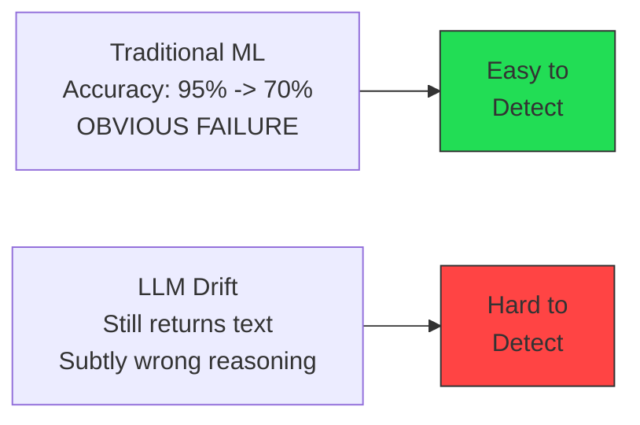
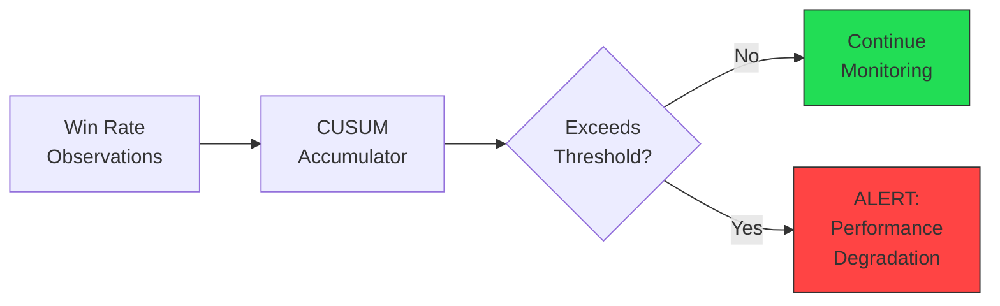
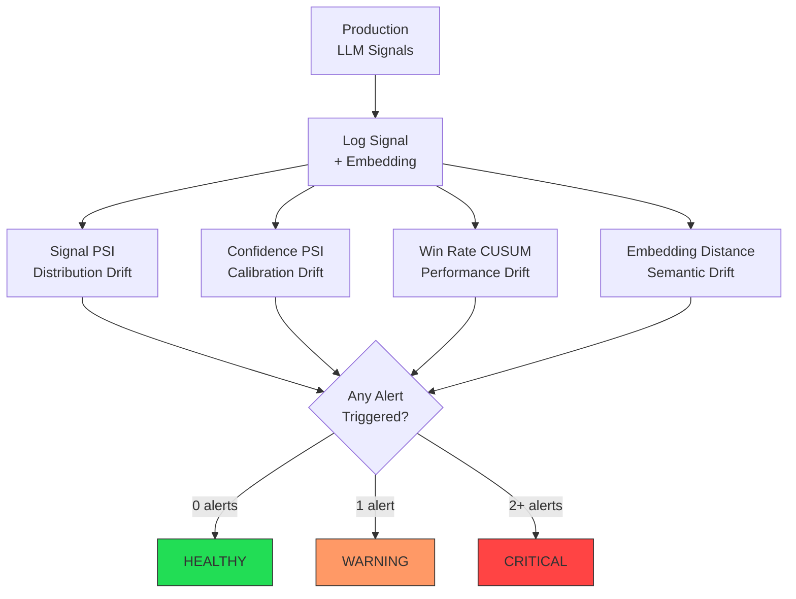
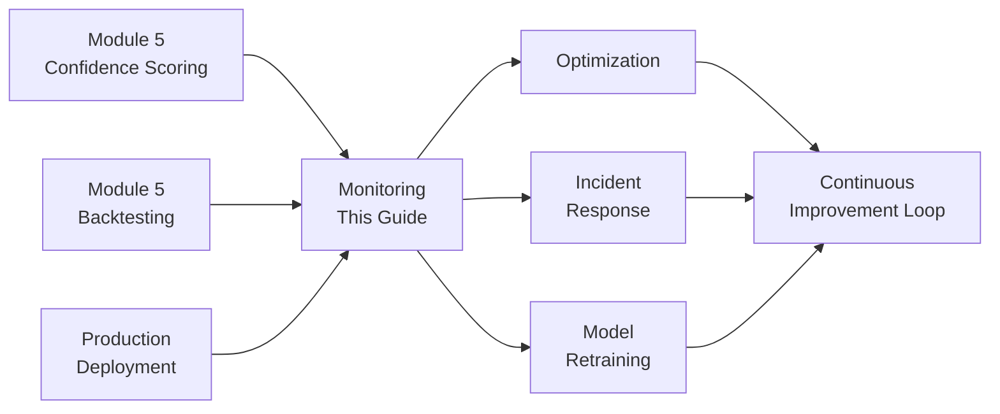

<!-- _class: lead -->

# Production LLM Monitoring and Drift Detection

**Module 6: Production**

Detecting when model behavior degrades before losses accumulate

<!-- Speaker notes: Section transition. Briefly preview what this section covers before diving into details. -->

---

## LLMs Fail Silently

> Unlike traditional ML where accuracy drops visibly, LLM degradation manifests as subtle shifts: slightly lower conviction, different reasoning patterns, or increased uncertainty.



**Production monitoring must measure:**
- Semantic drift (meaning changes)
- Performance drift (accuracy decline)
- Input drift (market regime changes)

<!-- Speaker notes: Walk through the diagram step by step. Highlight the key decision points and data flow. -->

---

## Types of Drift

<div class="columns">
<div>

### 1. Input Drift (Covariate Shift)
$$P_{\text{prod}}(X) \neq P_{\text{train}}(X)$$

Backtest on normal volatility, production sees VIX > 50

### 2. Prediction Drift (Concept Drift)
$$P_{\text{prod}}(Y|X) \neq P_{\text{train}}(Y|X)$$

"OPEC cut" historically bullish, now bearish due to recession

</div>
<div>

### 3. Performance Drift
$$\text{Accuracy}_{\text{prod}}(t) < \text{Accuracy}_{\text{train}} - \epsilon$$

Win rate drops from 65% to 50%

### 4. Semantic Drift
Same text ("bullish") but meaning/quality changes over time

Hedge language creeps into reasoning

</div>
</div>

<!-- Speaker notes: Present the key concepts on this slide. Pause for questions before moving to the next topic. -->

---

## Population Stability Index (PSI)

**Detection metric for distribution drift:**

$$\text{PSI} = \sum_{i=1}^{k} (\text{Expected}_i - \text{Actual}_i) \times \ln\left(\frac{\text{Expected}_i}{\text{Actual}_i}\right)$$

| PSI Value | Interpretation | Action |
|-----------|----------------|--------|
| < 0.10 | No significant drift | Continue monitoring |
| 0.10 - 0.20 | Moderate drift | Investigate |
| > 0.20 | Significant drift | Retrain/recalibrate |

<!-- Speaker notes: Review the table contents. Ask learners which rows are most relevant to their use case. -->

---

## CUSUM for Performance Detection

**Cumulative Sum detects sustained shifts:**

$$S_t = \max(0, S_{t-1} + (x_t - \mu - k))$$

Where $k$ is allowance (half the shift size to detect)



<!-- Speaker notes: Walk through the diagram step by step. Highlight the key decision points and data flow. -->

---

## Monitoring Metrics by Timescale

| Timescale | Metrics | Purpose |
|-----------|---------|---------|
| **Real-Time** | Latency p50/p95/p99, Error rate, Confidence distribution | Operational health |
| **Daily** | Win rate, Calibration error, Signal diversity, Prompt success rate | Signal quality |
| **Weekly** | Rolling Sharpe, Drawdown, Benchmark correlation, Feature importance | Strategy health |

<!-- Speaker notes: Review the table contents. Ask learners which rows are most relevant to their use case. -->

---

<!-- _class: lead -->

# Drift Detection Implementation

PSI, CUSUM, and semantic monitoring

<!-- Speaker notes: Section transition. Briefly preview what this section covers before diving into details. -->

---

## PopulationStabilityIndex

```python
class PopulationStabilityIndex:
    def __init__(self, n_bins=10):
        self.n_bins = n_bins

    def fit(self, baseline_data):
        self.bin_edges = np.percentile(
            baseline_data, np.linspace(0, 100, self.n_bins + 1))
        baseline_counts, _ = np.histogram(
            baseline_data, bins=self.bin_edges)
        self.baseline_dist = np.maximum(
            baseline_counts / len(baseline_data), 1e-10)
```

---

```python

    def calculate(self, current_data) -> float:
        current_counts, _ = np.histogram(
            current_data, bins=self.bin_edges)
        current_dist = np.maximum(
            current_counts / len(current_data), 1e-10)

        psi = np.sum(
            (current_dist - self.baseline_dist)
            * np.log(current_dist / self.baseline_dist))
        return psi  # > 0.2 = significant drift

```

<!-- Speaker notes: Walk through the code, emphasizing the key patterns. Highlight which parts learners should customize for their own use cases. -->

---

## CUSUMDetector

```python
class CUSUMDetector:
    def __init__(self, baseline_mean, threshold, allowance=None):
        self.baseline_mean = baseline_mean
        self.threshold = threshold
        self.allowance = allowance or threshold / 2
        self.cusum_pos = 0
        self.cusum_neg = 0

    def update(self, value) -> bool:
```

---

```python
        # Positive CUSUM (detecting increase)
        self.cusum_pos = max(0,
            self.cusum_pos + (value - self.baseline_mean - self.allowance))

        # Negative CUSUM (detecting decrease)
        self.cusum_neg = max(0,
            self.cusum_neg - (value - self.baseline_mean + self.allowance))

        # Alert if either exceeds threshold
        return (self.cusum_pos > self.threshold
                or self.cusum_neg > self.threshold)

```

<!-- Speaker notes: Walk through the code, emphasizing the key patterns. Highlight which parts learners should customize for their own use cases. -->

---

## SemanticDriftDetector

```python
class SemanticDriftDetector:
    def __init__(self, window_size=100):
        self.window_size = window_size
        self.baseline_mean = None

    def fit(self, embeddings):
        """Fit baseline from embeddings."""
        self.baseline_mean = embeddings.mean(axis=0)

    def calculate(self, current_embeddings) -> float:
        """Cosine distance between baseline and current."""
        current_mean = current_embeddings.mean(axis=0)
        cosine_sim = np.dot(self.baseline_mean, current_mean) / (
            np.linalg.norm(self.baseline_mean)
            * np.linalg.norm(current_mean))
        return 1 - cosine_sim  # 0 = no drift, 1+ = significant
```

> Semantic drift catches cases where LLM outputs look syntactically correct but carry different meaning.

<!-- Speaker notes: Walk through the code, emphasizing the key patterns. Highlight which parts learners should customize for their own use cases. -->

---

## Drift Detection Architecture



<!-- Speaker notes: Walk through the diagram step by step. Highlight the key decision points and data flow. -->

---

<!-- _class: lead -->

# LLMProductionMonitor

Comprehensive monitoring system

<!-- Speaker notes: Section transition. Briefly preview what this section covers before diving into details. -->

---

## Monitor Setup and Baseline

```python
class LLMProductionMonitor:
    def __init__(self, baseline_win_rate=0.60,
                 psi_threshold=0.20, cusum_threshold=5.0,
                 semantic_threshold=0.25):
        # Drift detectors
        self.signal_psi = PopulationStabilityIndex()
        self.confidence_psi = PopulationStabilityIndex()
        self.win_rate_cusum = CUSUMDetector(
            baseline_mean=baseline_win_rate,
            threshold=cusum_threshold)
        self.semantic_detector = SemanticDriftDetector()
```

---

```python

        # Rolling storage
        self.recent_signals = deque(maxlen=1000)
        self.recent_confidences = deque(maxlen=1000)

    def fit_baseline(self, baseline_signals,
                     baseline_confidences, baseline_embeddings=None):
        self.signal_psi.fit(baseline_signals)
        self.confidence_psi.fit(baseline_confidences)
        if baseline_embeddings is not None:
            self.semantic_detector.fit(baseline_embeddings)

```

<!-- Speaker notes: Walk through the code, emphasizing the key patterns. Highlight which parts learners should customize for their own use cases. -->

---

## Health Score Computation

```python
def get_status(self) -> Dict:
    drift_metrics = self.check_drift()
    return {
        'timestamp': datetime.now().isoformat(),
        'drift': {name: {'psi': m.psi, 'alert': m.alert_triggered}
                  for name, m in drift_metrics.items()},
        'health': self._compute_health_score(drift_metrics)
    }

def _compute_health_score(self, drift_metrics):
    alerts = sum(1 for m in drift_metrics.values()
                 if m.alert_triggered)
    if alerts == 0: return 'healthy'
    elif alerts <= 1: return 'warning'
    else: return 'critical'
```

<!-- Speaker notes: Walk through the code, emphasizing the key patterns. Highlight which parts learners should customize for their own use cases. -->

---

## Why Drift Happens

<div class="columns">
<div>

### Market Regime Change
- **Training:** Bull market 2019-2021
- **Production:** Bear market 2022
- **Issue:** Bullish signals over-generated
- **Detection:** Signal distribution shifts

### Data Source Quality
- **Training:** Curated news sources
- **Production:** Noisy social media
- **Issue:** Sentiment polarity weakens
- **Detection:** Confidence scores decline

</div>
<div>

### Prompt Staleness
- **Training:** "OPEC cuts are bullish"
- **Production:** Market now expects cuts
- **Issue:** Historical relationship breaks
- **Detection:** Win rate drops

### Model Updates
- **Training:** Claude Sonnet v1
- **Production:** Claude Sonnet v2 (different behavior)
- **Issue:** Outputs change subtly
- **Detection:** Semantic embedding shift

</div>
</div>

<!-- Speaker notes: Present the key concepts on this slide. Pause for questions before moving to the next topic. -->

---

## Common Pitfalls

<div class="columns">
<div>

### Monitoring Lag
Daily metrics not caught until week of losses

**Solution:** Multi-timescale monitoring (hourly, daily, weekly) with early warning thresholds

### Alert Fatigue
Too many false positive alerts

**Solution:** Tune thresholds on historical data; use severity levels (info, warning, critical)

### Insufficient Baseline Data
PSI calculated on only 50 samples

**Solution:** Collect 200+ baseline samples; use rolling baselines

</div>
<div>

### Ignoring Market Regimes
Single baseline for all conditions

**Solution:** Regime-conditional baselines (bull/bear/high vol)

### No Semantic Monitoring
Only tracking numeric metrics

**Solution:** Sample and manually review LLM reasoning weekly; track embedding distances

</div>
</div>

<!-- Speaker notes: Walk through each pitfall with a real-world example. Ask learners if they have encountered any of these in their own work. -->

---

## Key Takeaways

1. **LLMs fail silently** -- they always return plausible text, even when wrong

2. **Monitor four types of drift:** input, prediction, performance, and semantic

3. **PSI for distributions, CUSUM for trends** -- use the right tool for each drift type

4. **Multi-timescale monitoring** -- real-time for ops, daily for quality, weekly for strategy

5. **Health scores aggregate alerts** -- 0 alerts = healthy, 1 = warning, 2+ = critical action needed

<!-- Speaker notes: Recap the main points. Ask learners which takeaway they found most surprising or useful. -->

---

## Connections



<!-- Speaker notes: Show how this content connects to other modules. Point learners to the next recommended deck. -->
