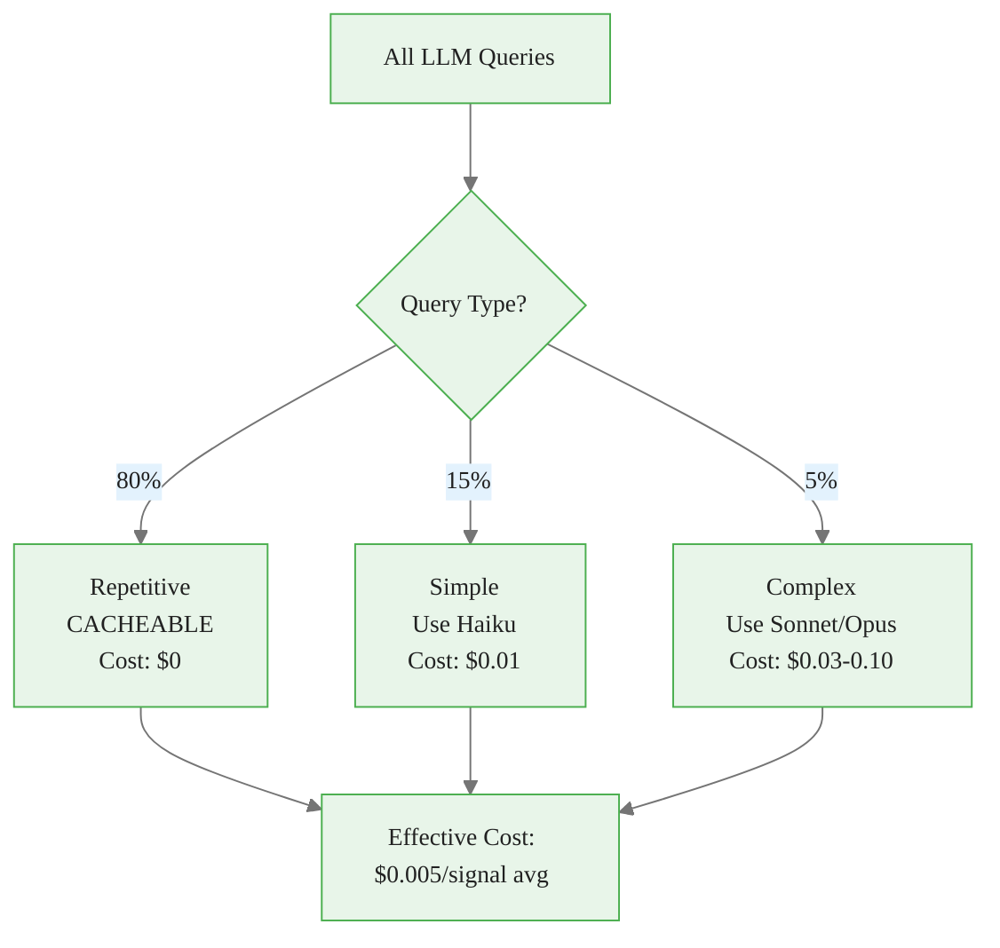
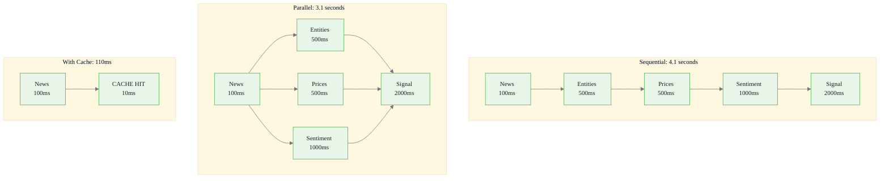
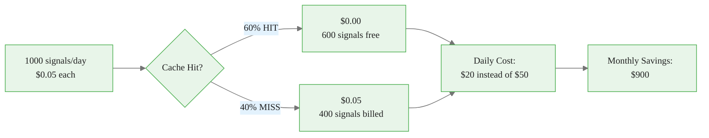
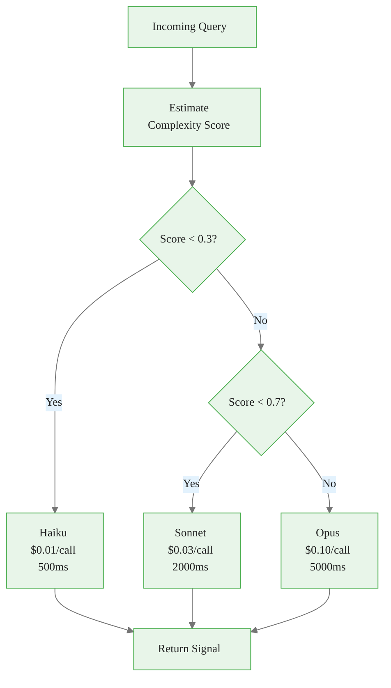
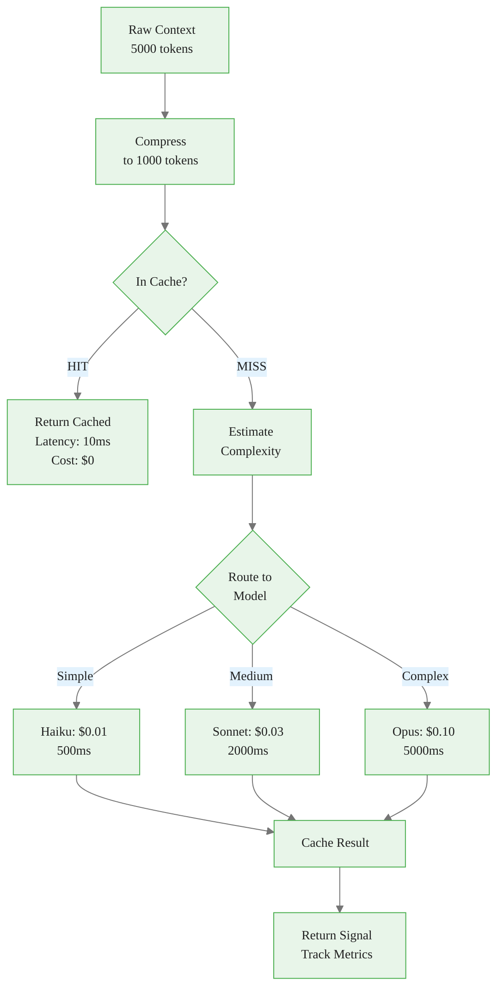
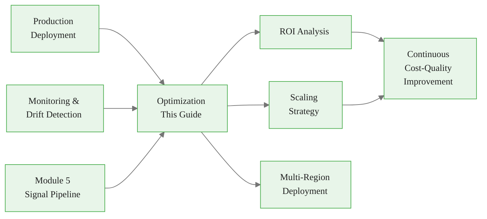

<!-- _class: lead -->

# LLM Cost Optimization, Latency, and Caching

**Module 6: Production**

The triple constraint: cost, latency, and quality

<!-- Speaker notes: Section transition. Briefly preview what this section covers before diving into details. -->

---

## The 80/15/5 Rule



<div class="callout-key">

Key implementation detail -- study this pattern carefully.

</div>

> 80% of queries are repetitive (cacheable), 15% can use smaller models, and only 5% require the full frontier model.

<!-- Speaker notes: Walk through the diagram step by step. Highlight the key decision points and data flow. -->

---

## Cost Model

**Total Cost per Signal:**
$$C_{\text{total}} = n_{\text{input}} \times p_{\text{input}} + n_{\text{output}} \times p_{\text{output}}$$

**Example (1000 signals/day):**

| Component | Tokens | Price/1M | Daily Cost |
|-----------|--------|----------|------------|
| Input | 2,000/signal | $3.00 | $6.00 |
| Output | 500/signal | $15.00 | $7.50 |
| **Total** | | | **$13.50/day** |

**Monthly: $405** (before optimization)

**With caching (60% hit rate): $162/month** (60% reduction)

<!-- Speaker notes: Review the table contents. Ask learners which rows are most relevant to their use case. -->

---

## Latency Breakdown

$$L_{\text{total}} = L_{\text{network}} + L_{\text{queue}} + L_{\text{inference}} + L_{\text{processing}}$$

| Component | Typical | Optimized |
|-----------|---------|-----------|
| Network | 100-200ms | 100ms (edge) |
| Queue | 0-500ms | 0ms (priority) |
| Inference | 1000-3000ms | 500ms (Haiku) |
| Processing | 100-500ms | 50ms (compiled) |
| **Total** | **1.2-4.2s** | **650ms** |

**Target SLA:** p50 < 500ms, p95 < 2000ms, p99 < 5000ms

<!-- Speaker notes: Review the table contents. Ask learners which rows are most relevant to their use case. -->

---

## Naive vs Optimized Implementation

<div class="columns">
<div>

### Naive ($3000/month)
```python
for news in news_feed:
    context = get_full_context(news)  # 5000 tokens
    signal = claude_opus(context)     # $0.10/call
    # 1000 calls/day → $100/day
```

<div class="callout-insight">

This pattern recurs throughout the course. Understanding it deeply pays dividends later.

</div>

</div>
<div>

### Optimized ($300/month)
```python
for news in news_feed:
    if news in cache:           # 60% hit
        signal = cache[news]    # $0.00
    else:
        context = compress(news)  # 1000 tokens
        if is_simple(news):
            signal = haiku(context)   # $0.01
        else:
            signal = sonnet(context)  # $0.03
        cache[news] = signal
    # Effective: $10/day
```

**90% cost reduction**

</div>
</div>

<!-- Speaker notes: Walk through the code, emphasizing the key patterns. Highlight which parts learners should customize for their own use cases. -->

---

## Parallel Processing for Latency



<div class="callout-warning">

Watch for edge cases with this implementation in production use.

</div>

<!-- Speaker notes: Walk through the diagram step by step. Highlight the key decision points and data flow. -->

---

<!-- _class: lead -->

# Semantic Cache Implementation

Intelligent caching with TTL and statistics

<!-- Speaker notes: Section transition. Briefly preview what this section covers before diving into details. -->

---

<!-- Speaker notes: Cover the key points about SemanticCache. Emphasize practical implications and connect to previous material. -->

## SemanticCache

```python
class SemanticCache:
    def __init__(self, redis_client, similarity_threshold=0.95, ttl=3600):
        self.redis = redis_client
        self.ttl = ttl
        self.hits = 0
        self.misses = 0
        self.saves_usd = 0

```

<div class="callout-info">

This approach follows established best practices in the field.

</div>

---

```python
    def get(self, prompt, cost_saved=0.05):
        key = f"semantic_cache:{hashlib.sha256(prompt.encode()).hexdigest()}"
        cached = self.redis.get(key)
        if cached:
            self.hits += 1
            self.saves_usd += cost_saved
            return json.loads(cached)
        self.misses += 1
        return None

    def set(self, prompt, response):
        key = f"semantic_cache:{hashlib.sha256(prompt.encode()).hexdigest()}"
        self.redis.setex(key, self.ttl, json.dumps(response))

```

<!-- Speaker notes: Walk through the code, emphasizing the key patterns. Highlight which parts learners should customize for their own use cases. -->

---

## Cache Hit Rate Impact

$$C_{\text{effective}} = C_{\text{total}} \times (1 - r_{\text{cache}})$$



<!-- Speaker notes: Walk through the diagram step by step. Highlight the key decision points and data flow. -->

---

<!-- _class: lead -->

# Model Routing

Automatic model selection based on query complexity

<!-- Speaker notes: Section transition. Briefly preview what this section covers before diving into details. -->

---

<!-- Speaker notes: Cover the key points about ModelRouter. Emphasize practical implications and connect to previous material. -->

## ModelRouter

```python
class ModelRouter:
    def estimate_complexity(self, prompt, context) -> float:
        score = 0.0
        # Context length
        score += min(len(prompt.split()) / 1000, 0.3)
        # Conflicting signals
        if context.get('conflicting_signals'):
            score += 0.3
        # High uncertainty
        if context.get('uncertainty_high'):
            score += 0.2
```

---

<div class="code-window">
<div class="code-header">
<div class="dots"><span class="dot-red"></span><span class="dot-yellow"></span><span class="dot-green"></span></div>
<span class="filename">select_model.py</span>
</div>

```python
        # Multi-asset analysis
        if context.get('multi_asset'):
            score += 0.2
        return min(score, 1.0)

    def select_model(self, complexity) -> str:
        if complexity < 0.3: return 'haiku'    # Fast, cheap
        elif complexity < 0.7: return 'sonnet'  # Balanced
        else: return 'opus'                      # Best quality

```

</div>

<!-- Speaker notes: Walk through the code, emphasizing the key patterns. Highlight which parts learners should customize for their own use cases. -->

---

## Model Routing Decision



**Quality-Aware Routing:**
$$\text{Model} = \begin{cases}
\text{Haiku} & \text{if } q < 0.3 \\
\text{Sonnet} & \text{if } 0.3 \leq q < 0.7 \\
\text{Opus} & \text{if } q \geq 0.7
\end{cases}$$

<!-- Speaker notes: Walk through the diagram step by step. Highlight the key decision points and data flow. -->

---

<!-- Speaker notes: Cover the key points about Prompt Compression. Emphasize practical implications and connect to previous material. -->

## Prompt Compression

<div class="code-window">
<div class="code-header">
<div class="dots"><span class="dot-red"></span><span class="dot-yellow"></span><span class="dot-green"></span></div>
<span class="filename">promptcompressor.py</span>
</div>

```python
class PromptCompressor:
    def compress_context(self, context, max_tokens=1000):
        lines = context.split('\n')

        # Priority scoring (recency + keyword importance)
        scored_lines = []
        for i, line in enumerate(lines):
            score = 1.0 - (i / len(lines)) * 0.5
            # Boost important keywords
            if any(kw in line.lower()
                   for kw in ['price', 'supply', 'demand', 'opec']):
                score += 0.3
            scored_lines.append((score, line))
```

</div>

---

<div class="code-window">
<div class="code-header">
<div class="dots"><span class="dot-red"></span><span class="dot-yellow"></span><span class="dot-green"></span></div>
<span class="filename">example.py</span>
</div>

```python

        # Take highest-scoring lines within budget
        scored_lines.sort(reverse=True, key=lambda x: x[0])
        compressed = []
        token_count = 0
        for score, line in scored_lines:
            if token_count + len(line)/4 <= max_tokens:
                compressed.append(line)
                token_count += len(line)/4
        return '\n'.join(compressed)

```

</div>

<!-- Speaker notes: Walk through the code, emphasizing the key patterns. Highlight which parts learners should customize for their own use cases. -->

---

## Full Optimization Pipeline



<!-- Speaker notes: Walk through the diagram step by step. Highlight the key decision points and data flow. -->

---

## Common Pitfalls

<div class="columns">
<div>

### Over-Aggressive Caching
Caching market data for too long

**Solution:** Short TTL (10-30 min) for time-sensitive data; longer for static analysis

### Premature Model Downgrade
Routing too many queries to cheap models

**Solution:** A/B test routing thresholds; monitor quality metrics by model tier

### Compression Losing Critical Info
Aggressive compression removes key context

**Solution:** Preserve high-importance sentences; test compression ratios against signal quality

</div>
<div>

### Cache Key Collisions
Different prompts hash to same key

**Solution:** Include timestamp, asset ID, and model version in cache key

### Ignoring Latency Long Tail
Optimizing average but ignoring p99

**Solution:** Set timeouts; implement fallback responses; monitor all percentiles

</div>
</div>

<!-- Speaker notes: Walk through each pitfall with a real-world example. Ask learners if they have encountered any of these in their own work. -->

---

## Optimization Results Summary

| Metric | Before | After | Improvement |
|--------|--------|-------|-------------|
| Cost/signal | $0.05 | $0.005 | 90% reduction |
| Latency p50 | 2000ms | 300ms | 85% faster |
| Latency p99 | 8000ms | 3000ms | 63% faster |
| Cache hit rate | 0% | 65% | From zero |
| Monthly cost | $1500 | $150 | $1350 saved |

> The goal: maintain signal quality while reducing cost from $0.05 to $0.005 and latency from 3s to 300ms.

<!-- Speaker notes: Review the table contents. Ask learners which rows are most relevant to their use case. -->

---

## Key Takeaways

1. **Cache aggressively** -- 80% of queries are repetitive, cache hit rates of 60-80% are achievable

2. **Route intelligently** -- use Haiku for simple queries, Sonnet for medium, Opus only when needed

3. **Compress ruthlessly** -- reduce input tokens from 5000 to 1000 with priority-based compression

4. **Parallelize everything** -- independent data fetches should run concurrently

5. **Monitor the tradeoffs** -- cost optimization must not degrade signal quality below acceptable thresholds

<!-- Speaker notes: Recap the main points. Ask learners which takeaway they found most surprising or useful. -->

---

## Connections



<!-- Speaker notes: Show how this content connects to other modules. Point learners to the next recommended deck. -->
