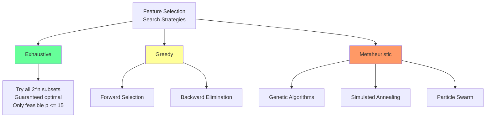
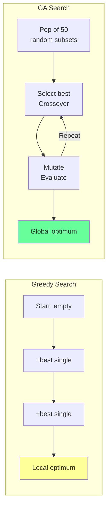
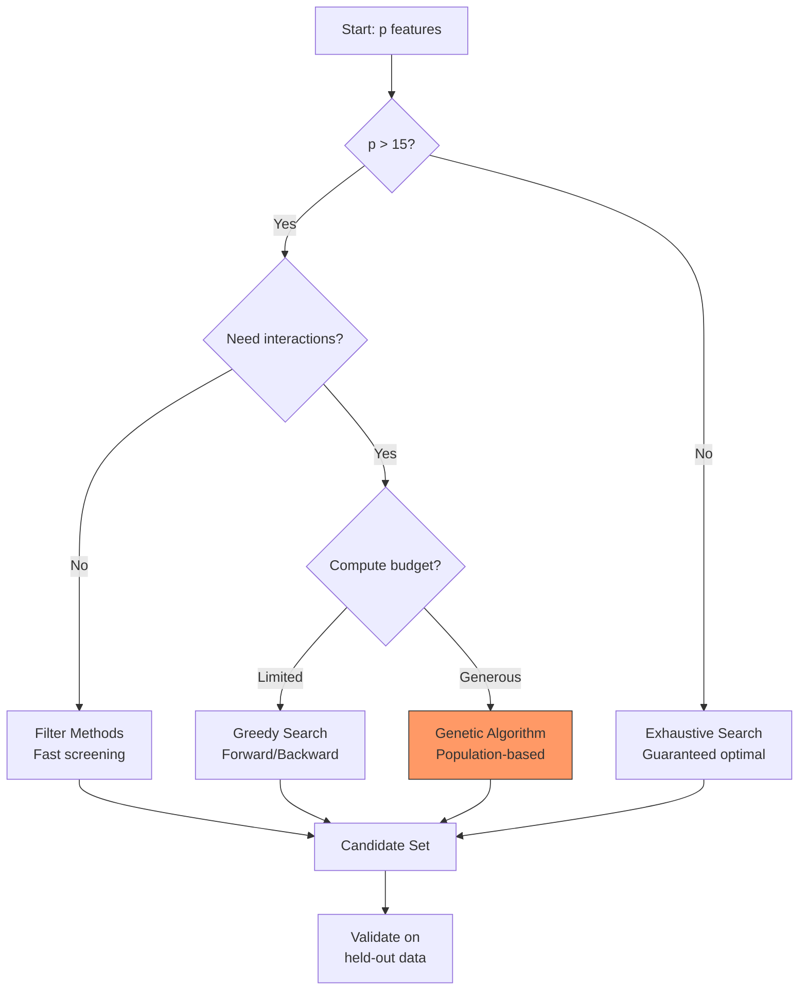

<!-- _class: lead -->
<!-- Speaker notes: This is the opening deck for Module 00 -- set the stage by explaining WHY feature selection matters and WHY it is hard. Emphasize the combinatorial explosion early to motivate the need for GAs. -->

# The Feature Selection Challenge
## From Exponential Search Spaces to Intelligent Optimization

### Module 00 — Foundations

Why feature selection is NP-hard and how metaheuristics help

---

<!-- Speaker notes: Ground the problem in practical terms. The key message: feature selection is critical for time series forecasting where observations are limited relative to feature count. -->

## In Brief

Feature selection is the process of identifying the **most relevant subset** of features from a larger feature space to:

- Improve model performance
- Reduce overfitting
- Enhance interpretability

> In time series forecasting with many potential features and limited observations, this becomes **critical for generalization**.

---

<!-- Speaker notes: This is the "wow" moment -- show how quickly the search space grows. Pause on the table and let the numbers sink in. The jump from 20 to 30 features is particularly dramatic. -->

## The Combinatorial Explosion

With $p$ features, there are $2^p$ possible subsets to evaluate.

| Features ($p$) | Possible Subsets ($2^p$) | Evaluation Time* |
|:-:|:-:|:-:|
| 10 | 1,024 | ~1 second |
| 20 | 1,048,576 | ~17 minutes |
| 30 | ~1 billion | ~12 days |
| 50 | ~1 quadrillion | ~35,000 years |
| 100 | ~10^30 | Heat death of universe |

*Assuming 1ms per evaluation

> This combinatorial explosion makes exhaustive search infeasible for real problems.

---

<!-- Speaker notes: Walk through the formal definition slowly. Emphasize that lambda controls the tradeoff between accuracy and simplicity. This is the objective function the GA will optimize. -->

## Formal Definition

**Given:** Feature matrix $X \in \mathbb{R}^{n \times p}$, target $y \in \mathbb{R}^n$, model $M$, metric $L$

**Find:** Binary selection vector $s \in \{0,1\}^p$ that minimizes:

$$s^* = \argmin_{s \in \{0,1\}^p} L(M(X_s), y) + \lambda \cdot ||s||_0$$

Where:
- $X_s$ contains only columns where $s_i = 1$
- $\lambda$ controls the complexity-accuracy tradeoff
- $k_{min} \leq ||s||_0 \leq k_{max}$ (feature count bounds)

---

<!-- Speaker notes: Use the weather expert analogy to build intuition. This helps learners who are less comfortable with math. Ask the audience: "Would you rather have 5 great experts or 100 mediocre ones?" -->

## Intuitive Explanation

Imagine building a **weather forecasting model** with 100 potential features.

Using all 100 is like asking 100 experts and weighing them all equally -- you'd be overwhelmed by irrelevant signals.

Feature selection = assembling the right team:

- **Relevant experts** -- features that actually help predict
- **Diverse perspectives** -- features providing unique information
- **Manageable team** -- not so many that noise dominates

> With 100 features: $2^{100} \approx 10^{30}$ possible teams!

---

<!-- Speaker notes: Explain the curse of dimensionality using concrete numbers. The p/n ratio of 0.4 is a red flag in practice. This motivates why we MUST reduce features. -->

## The Curse of Dimensionality

For time series with $n$ observations and $p$ features:

$$\text{Overfitting Risk} \propto \frac{p}{n}$$

**Example -- Stock price prediction:**
- $n = 250$ trading days (1 year)
- $p = 100$ technical indicators
- Ratio: $p/n = 0.4$ (HIGH RISK)

When $p \approx n$ or $p > n$, models learn **noise instead of signal**.

---

<!-- Speaker notes: Walk through the diagram from left to right. Emphasize that each strategy trades off computational cost against solution quality. The GA path is what this course focuses on. -->

## Search Strategy Overview



---

<!-- Speaker notes: This is a key argument for GAs. The XOR problem shows that greedy methods fundamentally cannot find features whose value only emerges in combination. Walk through the correlations and ask: "Would forward selection ever pick A or B?" -->

## Why Greedy Fails: The XOR Problem

```python
np.random.seed(42)
n = 1000

A = np.random.randint(0, 2, n)
B = np.random.randint(0, 2, n)
C = np.random.randn(n)  # Noise feature

y = (A ^ B) + 0.1 * np.random.randn(n)
X = np.column_stack([A, B, C])
```

**The problem:**
- A alone: correlation with y $\approx$ 0
- B alone: correlation with y $\approx$ 0
- {A, B} together: **high predictive power**

> Greedy evaluates features individually and misses the interaction!

---

<!-- Speaker notes: Use this diagram to contrast the single-path nature of greedy search with the parallel exploration of GAs. This is the core motivation for the entire course. -->

## Greedy vs. Population-Based Search



---

<!-- Speaker notes: Briefly introduce metaheuristics as a class of optimization methods. The key point is that GAs are one of several options, but are particularly well-suited to feature selection because of binary encoding. -->

## Why GAs for Feature Selection?

1. **Natural encoding**: Binary chromosome = feature mask
   ```
   [1, 0, 1, 1, 0, 0, 1, 0] = features {0, 2, 3, 6} selected
   ```

2. **Population-based**: Explore multiple solutions simultaneously

3. **Crossover**: Combine good feature subsets from different parents

4. **No Free Lunch**: No single algorithm is best for all problems -- GAs are strong for combinatorial binary search

---

<!-- Speaker notes: The multi-objective formulation is important because in practice we almost always care about both accuracy AND simplicity. Introduce the Pareto frontier concept here; it will be covered in depth in Module 02. -->

## Multi-Objective Formulation

Feature selection often balances competing goals:

$$\min_{s} \begin{cases}
f_1(s) = \text{Prediction Error}(X_s, y) \\
f_2(s) = ||s||_0 = \text{Number of Features}
\end{cases}$$

```
Prediction Error
    |  *  Dominated
    |   *
    |    o---o---o  Pareto Frontier
    |         o--o
    |             o
    +-----------------> # Features
```

> Each point on the Pareto frontier is optimal -- improving one objective worsens the other.

---

<!-- _class: lead -->
<!-- Speaker notes: Transition to the practical pitfalls section. These are the mistakes that even experienced practitioners make. -->

# Common Pitfalls

---

<!-- Speaker notes: Data leakage is the most common and most dangerous pitfall. Show both code snippets side-by-side and emphasize that the WRONG version looks simpler but gives optimistic results. -->

## Pitfall 1: Selection on Full Dataset

<div class="columns">
<div>

**WRONG** -- data leakage:

```python
# Uses ALL data for selection
selected = select_features(X, y)
cv_score = cross_val_score(
    model, X[:, selected], y, cv=5
)
```

</div>
<div>

**RIGHT** -- selection inside CV:

```python
tscv = TimeSeriesSplit(n_splits=5)
scores = []
for train_idx, test_idx in tscv.split(X):
    X_train = X[train_idx]
    y_train = y[train_idx]
    selected = select_features(
        X_train, y_train
    )
    model.fit(X_train[:, selected],
              y_train)
    score = model.score(
        X[test_idx][:, selected],
        y[test_idx]
    )
    scores.append(score)
```

</div>
</div>

---

<!-- Speaker notes: Explain that correlated features waste model capacity. The correlation penalty in the fitness function is a preview of Module 02 content. -->

## Pitfall 2: Ignoring Feature Redundancy

Selecting multiple highly correlated features wastes degrees of freedom.

```python
def fitness_with_diversity(features, X, y):
    X_selected = X[:, features == 1]
    error = cross_val_mse(X_selected, y)

    # Correlation penalty
    if X_selected.shape[1] > 1:
        corr = np.corrcoef(X_selected.T)
        avg_corr = (np.sum(np.abs(corr)) -
                    X_selected.shape[1]) / \
                   (X_selected.shape[1]**2 -
                    X_selected.shape[1])
    else:
        avg_corr = 0

    return -error - 0.1 * avg_corr
```

> Add correlation penalty to promote diverse feature sets.

---

<!-- Speaker notes: This decision flow is a practical reference the audience can use. Walk through each branch and give examples of when you'd take that path. -->

## Decision Flow for Feature Selection



---

<!-- Speaker notes: Wrap up with the connections slide. Emphasize that this deck sets the foundation -- the rest of the course builds on these concepts. -->

## Connections & What's Next

<div class="columns">
<div>

**Builds On:**
- Linear algebra (feature spaces)
- Optimization theory
- Probability (overfitting)
- Time series fundamentals

</div>
<div>

**Leads To:**
- **Module 1**: GA fundamentals
- **Module 2**: Fitness function design
- **Module 3**: Time series CV strategies
- **Module 5**: Multi-objective optimization

</div>
</div>

---

<!-- Speaker notes: Use this summary as a quick reference card. Emphasize the two key takeaways: 1) Feature selection is NP-hard, and 2) GAs are a powerful tool for this problem. -->

## Key Takeaways

| Insight | Detail |
|---------|--------|
| **NP-hard** | Exhaustive search infeasible for $p > 15$ |
| **Greedy fails** | Gets stuck in local optima, misses interactions |
| **Curse of dimensionality** | $p/n > 0.3$ leads to overfitting |
| **Metaheuristics** | Explore search space more effectively |
| **GAs well-suited** | Binary encoding maps directly to feature masks |
| **Multi-objective** | Balance accuracy vs. parsimony on Pareto frontier |

> **Next**: Feature selection approaches -- filter, wrapper, and embedded methods.
