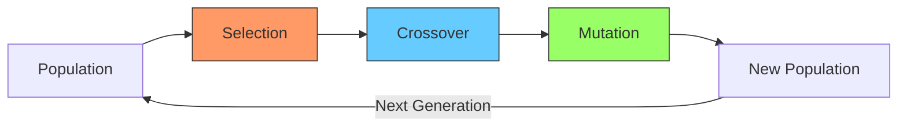
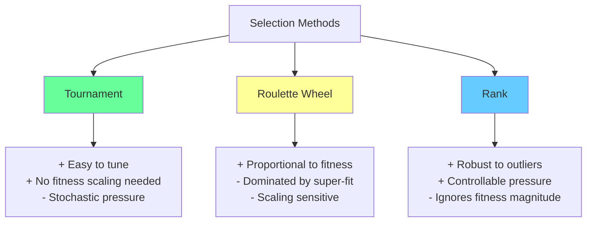
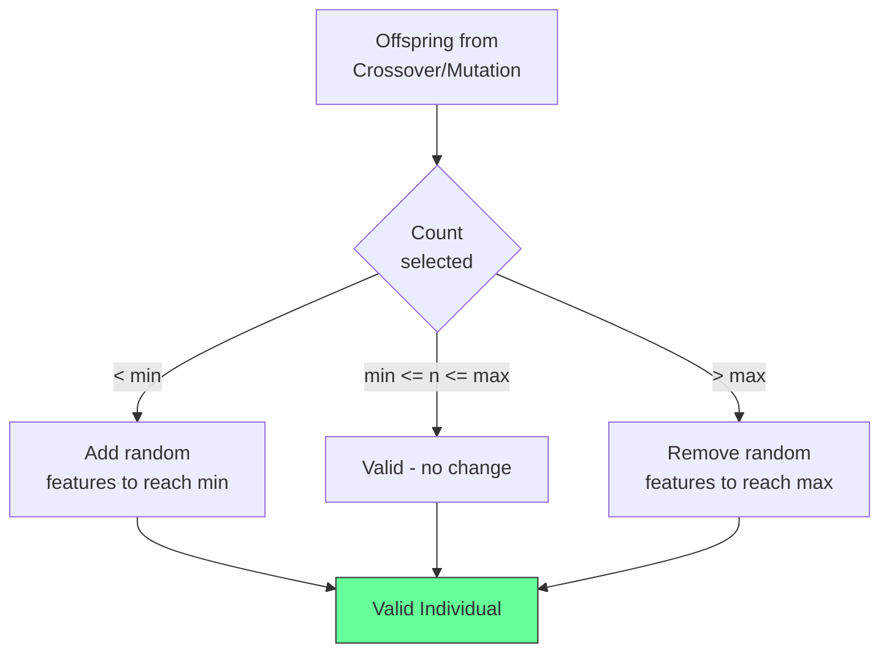
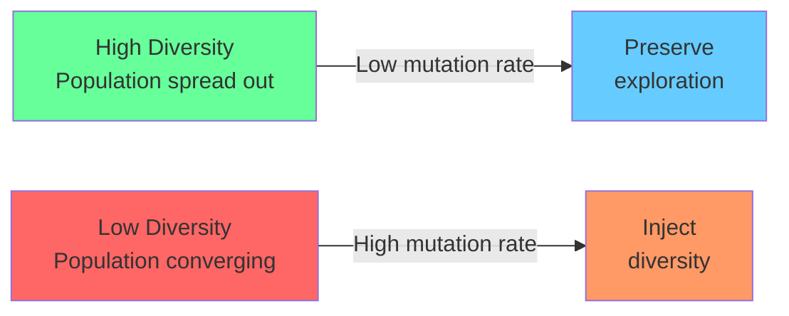

<!-- _class: lead -->
<!-- Speaker notes: This deck previews the three fundamental GA operators. Module 01 covers each in full depth -- here we focus on building intuition and seeing the operators in action. -->

# Evolutionary Operators
## Selection, Crossover, and Mutation

### Module 00 — Foundations

The three fundamental operators that drive genetic algorithm evolution

---

<!-- Speaker notes: Use the flowchart to show the cyclical nature of GAs. Each operator has a distinct role: selection chooses WHO breeds, crossover combines WHAT they have, mutation adds randomness. -->

## The Three Operators



1. **Selection** — Choose parents for reproduction
2. **Crossover** — Combine parent traits to create offspring
3. **Mutation** — Introduce random variation

---

<!-- _class: lead -->
<!-- Speaker notes: Selection determines which individuals get to reproduce. The key design choice is selection pressure: too high and you converge prematurely, too low and you waste evaluations. -->

# Selection Operators

Choosing which individuals reproduce

---

<!-- Speaker notes: Tournament selection is the default choice for most GA applications. The tournament size k is the main tuning knob. Point learners to Module 01 for full implementations and comparisons. -->

## Tournament Selection (Preview)

Pick $k$ random individuals, return the fittest:

```python
def tournament_selection(pop, fitness, k=3):
    """Select best from random tournament."""
    idx = random.sample(range(len(pop)), k)
    return pop[max(idx, key=lambda i: fitness[i])]
```

> Larger $k$ = stronger selection pressure. Full implementation in **Module 01: Selection Operators**.

---

<!-- Speaker notes: Roulette wheel is the classic selection method but has practical issues with fitness scaling. The epsilon offset prevents division by zero. -->

## Roulette Wheel Selection (Preview)

Selection probability proportional to fitness:

$$P(i) = \frac{f_i}{\sum_j f_j}$$

```python
def roulette_selection(pop, fitness):
    """Higher fitness = higher selection probability."""
    adjusted = [f - min(fitness) + 1e-6
                for f in fitness]
    probs = [f / sum(adjusted) for f in adjusted]
    return pop[np.random.choice(len(pop), p=probs)]
```

> Sensitive to fitness scaling. Full implementation in **Module 01: Selection Operators**.

---

<!-- Speaker notes: Rank selection solves the scaling problem by using ranks instead of raw fitness values. The selection_pressure parameter controls the spread between best and worst selection probabilities. -->

## Rank Selection (Preview)

```python
def rank_selection(pop, fitness, pressure=1.5):
    """Probability based on rank, not raw fitness."""
    n = len(pop)
    ranked = np.argsort(fitness)
    ranks = np.empty_like(ranked)
    ranks[ranked] = np.arange(1, n + 1)
    s = pressure
    probs = (2 - s + 2*(s-1)*(ranks-1)/(n-1)) / n
    probs = probs / probs.sum()
    return pop[np.random.choice(n, p=probs)]
```

> More robust to fitness scaling issues than roulette wheel.

---

<!-- Speaker notes: This comparison tree is a key reference. Tournament is the default recommendation for GA beginners. Roulette and Rank have specific use cases. -->

## Selection Methods Compared



---

<!-- _class: lead -->
<!-- Speaker notes: Now we move to crossover -- the main mechanism for combining good solutions. Crossover is what makes GAs different from random search. -->

# Crossover Operators

Combining parent genetic material

---

<!-- Speaker notes: Single-point crossover is the simplest. Show the ASCII visualization and point out how features on the same side of the cut point stay together -- this is positional bias. -->

## Single-Point Crossover

```python
def single_point_crossover(parent1, parent2):
    n = len(parent1)
    point = random.randint(1, n - 1)
    child1 = parent1[:point] + parent2[point:]
    child2 = parent2[:point] + parent1[point:]
    return child1, child2
```

```
Parent 1: [1 1 1 1 1 | 0 0 0 0 0]
Parent 2: [0 0 0 0 0 | 1 1 1 1 1]
                      ^
                  cut point
Child 1:  [1 1 1 1 1 | 1 1 1 1 1]
Child 2:  [0 0 0 0 0 | 0 0 0 0 0]
```

---

<!-- Speaker notes: Two-point crossover swaps a segment between parents. It introduces more mixing than single-point but still has some positional bias. -->

## Two-Point Crossover

```python
def two_point_crossover(parent1, parent2):
    n = len(parent1)
    pt1, pt2 = sorted(random.sample(range(1, n), 2))
    child1 = parent1[:pt1] + parent2[pt1:pt2] + parent1[pt2:]
    child2 = parent2[:pt1] + parent1[pt1:pt2] + parent2[pt2:]
    return child1, child2
```

```
Parent 1: [1 1 | 1 1 1 0 | 0 0 0 0]
Parent 2: [0 0 | 0 0 0 1 | 1 1 1 1]
               ^           ^
           cut 1       cut 2
Child 1:  [1 1 | 0 0 0 1 | 0 0 0 0]
Child 2:  [0 0 | 1 1 1 0 | 1 1 1 1]
```

---

<!-- Speaker notes: Uniform crossover is the recommended default for feature selection because feature order does not matter. Each gene is independently chosen from either parent, giving maximum mixing. -->

## Uniform Crossover

```python
def uniform_crossover(parent1, parent2, swap_prob=0.5):
    child1, child2 = [], []
    for g1, g2 in zip(parent1, parent2):
        if random.random() < swap_prob:
            child1.append(g2); child2.append(g1)
        else:
            child1.append(g1); child2.append(g2)
    return child1, child2
```

```
Parent 1: [1  1  1  1  1  0  0  0  0  0]
Mask:     [0  1  0  1  1  0  1  0  1  0]  (random)
Child 1:  [1  0  1  0  0  0  1  0  1  0]
```

> Each gene swapped independently -- maximum mixing.

---

<!-- Speaker notes: This table is a quick reference for choosing crossover type. For feature selection, always start with uniform crossover. -->

## Crossover Comparison

| Method | Mixing | Positional Bias | Best For |
|--------|--------|----------------|----------|
| Single-point | Low | High (preserves blocks) | Ordered features |
| Two-point | Medium | Medium | General purpose |
| Uniform | High | None | Feature selection |

> For feature selection, **uniform crossover** is often preferred since feature order doesn't matter.

---

<!-- _class: lead -->
<!-- Speaker notes: Mutation is the source of new genetic material. Without mutation, the GA can only recombine what already exists in the initial population. -->

# Mutation Operators

Introducing random variation to maintain diversity

---

<!-- Speaker notes: Bit flip is the standard mutation for binary chromosomes. The typical rate of 1/p ensures roughly one flip per individual, which is a good balance between exploration and preservation. -->

## Bit Flip Mutation

```python
def bit_flip_mutation(individual, mutation_rate=0.1):
    mutant = individual.copy()
    for i in range(len(mutant)):
        if random.random() < mutation_rate:
            mutant[i] = 1 - mutant[i]  # Flip bit
    return mutant
```

```
Original: [1 1 1 1 1 1 1 1 1 1]
                ^       ^
            (flipped)  (flipped)
Mutated:  [1 1 0 1 1 1 0 1 1 1]
```

> Typical rate: $1/p$ where $p$ = chromosome length

---

<!-- Speaker notes: These are two alternative mutation types for non-binary encodings. Gaussian mutation is used for real-valued genes, swap mutation for permutation-based encodings. -->

## Other Mutation Types

<div class="columns">
<div>

**Gaussian (real-valued):**
```python
def gaussian_mutation(individual,
                      rate=0.1, sigma=0.1):
    mutant = individual.copy()
    for i in range(len(mutant)):
        if random.random() < rate:
            mutant[i] += np.random.normal(
                0, sigma
            )
    return mutant
```

</div>
<div>

**Swap (permutations):**
```python
def swap_mutation(individual):
    mutant = individual.copy()
    i, j = random.sample(
        range(len(mutant)), 2
    )
    mutant[i], mutant[j] = (
        mutant[j], mutant[i]
    )
    return mutant
```

</div>
</div>

---

<!-- _class: lead -->
<!-- Speaker notes: Feature selection has specific constraints that generic GA operators do not handle. This section shows how to enforce minimum and maximum feature counts. -->

# Feature Selection Operators

Specialized operators with constraints

---

<!-- Speaker notes: The constraint enforcement function is applied AFTER crossover and mutation. It ensures that every individual has a valid number of features -- never empty, never too many. -->

## Constrained Feature Selection

```python
class FeatureSelectionOperators:
    def __init__(self, n_features,
                 min_features=1, max_features=None):
        self.min_features = min_features
        self.max_features = max_features or n_features
```

```python
    def _enforce_constraints(self, individual):
        n_selected = sum(individual)
        if n_selected < self.min_features:
            zeros = [i for i, x in enumerate(individual) if x == 0]
            for i in random.sample(zeros,
                    self.min_features - n_selected):
                individual[i] = 1
        elif n_selected > self.max_features:
            ones = [i for i, x in enumerate(individual) if x == 1]
            for i in random.sample(ones,
                    n_selected - self.max_features):
                individual[i] = 0
        return individual
```

---

<!-- Speaker notes: This flowchart shows the constraint enforcement logic visually. Walk through each branch with a concrete example. -->

## Constraint Enforcement Flow



---

<!-- Speaker notes: Adaptive mutation is an advanced concept that responds to the current state of the population. When diversity is low (population is converging), mutation rate increases to inject new variation. -->

## Adaptive Mutation: Diversity Measurement

```python
class AdaptiveMutation:
    """Mutation rate adapts based on population diversity."""
    def __init__(self, base_rate=0.1,
                 min_rate=0.01, max_rate=0.5):
        self.base_rate = base_rate
        self.min_rate = min_rate
        self.max_rate = max_rate
```

```python
    def get_rate(self, population):
        n = len(population)
        total_distance, count = 0, 0
        for i in range(n):
            for j in range(i + 1, n):
                total_distance += sum(
                    a != b for a, b
                    in zip(population[i], population[j]))
                count += 1
        avg_diversity = total_distance / count if count else 0
        diversity_ratio = avg_diversity / len(population[0])
```

---

<!-- Speaker notes: The interpolation formula maps diversity to mutation rate. Low diversity pushes rate toward max_rate, high diversity pushes toward base_rate. The clip ensures we stay within bounds. -->

## Adaptive Mutation: Rate Computation

```python
        # Low diversity -> high mutation
        # High diversity -> low mutation
        rate = self.base_rate + \
               (self.max_rate - self.base_rate) * \
               (1 - diversity_ratio)
        return np.clip(rate, self.min_rate, self.max_rate)
```



> Adaptive mutation prevents **premature convergence** while allowing fine-tuning near optima.

---

<!-- Speaker notes: This experiment compares how much offspring diversity each crossover type produces. Uniform crossover produces the most diverse offspring, confirming it as the best choice for feature selection. -->

## Operator Comparison: Offspring Diversity

```python
def compare_operators(n_trials=100):
    results = {'single_point': [], 'two_point': [], 'uniform': []}
    for _ in range(n_trials):
        p1 = [random.randint(0, 1) for _ in range(100)]
        p2 = [random.randint(0, 1) for _ in range(100)]
        c1_sp, _ = single_point_crossover(p1, p2)
        c1_tp, _ = two_point_crossover(p1, p2)
        c1_u, _ = uniform_crossover(p1, p2)
        for name, child in [('single_point', c1_sp),
                             ('two_point', c1_tp),
                             ('uniform', c1_u)]:
            d = sum(a != b for a, b in zip(child, p1))
            results[name].append(d)
```

> Uniform crossover produces the **most diverse** offspring.

---

<!-- Speaker notes: Summarize the key principles from this deck. The main takeaway is that selection pressure, crossover type, and mutation rate are the three most important GA parameters. -->

## Key Takeaways

| Principle | Detail |
|-----------|--------|
| **Selection pressure** | Controls exploitation vs exploration balance |
| **Tournament selection** | Robust, easy to tune via tournament size |
| **Crossover operators** | Differ in how they mix parent material |
| **Mutation rate** | Low enough to preserve, high enough for diversity |
| **Constraint handling** | Essential for feature selection problems |
| **Adaptive operators** | Respond to population state dynamically |

> **Next**: Feature selection approaches -- filter, wrapper, and embedded methods.
