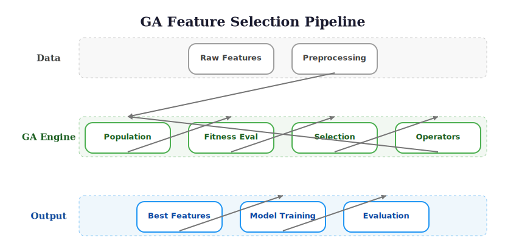

# Optimization Foundations for Feature Selection

> **Reading time:** ~5 min | **Module:** 0 — Foundations | **Prerequisites:** Calculus, basic Python

<div class="callout-key">
<strong>Key Concept:</strong> Feature selection is an NP-hard combinatorial optimization problem. Exhaustive search is provably infeasible beyond ~20 features. Greedy methods are fast but miss feature interactions (the XOR problem). Genetic algorithms occupy the sweet spot: they explore multiple solutions simultaneously, escape local optima via crossover and mutation, and naturally encode feature inclusion as binary chromosomes.
</div>

## The Feature Selection Problem

### Problem Definition

Given a dataset with $n$ features, find the subset $S \subseteq \{1, 2, ..., n\}$ that optimizes model performance:

$$S^* = \argmin_{S \subseteq \{1,...,n\}} L(f_S, D_{train}, D_{test})$$

where:
- $f_S$ is a model trained using only features in $S$
- $L$ is a loss function (e.g., MSE, MAE)
- $D_{train}, D_{test}$ are training and test data

### The Search Space

For $n$ features, there are $2^n$ possible subsets:

| Features | Possible Subsets | Exhaustive Search Time* |
|----------|------------------|------------------------|
| 10 | 1,024 | < 1 second |
| 20 | 1,048,576 | ~17 minutes |
| 30 | ~1 billion | ~317 years |
| 50 | ~1 quadrillion | Heat death of universe |

*Assuming 1ms per evaluation

This combinatorial explosion makes exhaustive search infeasible.

<div class="callout-warning">

⚠️ **Warning:** Even with parallelization across 1000 cores, exhaustive search for 30+ features is physically impossible. Any feature selection method that promises to evaluate all subsets at this scale is either approximating or lying.

</div>



## Search Strategies

### Exhaustive Search

<div class="code-window">
<div class="code-header">
<div class="dots"><span class="dot-red"></span><span class="dot-yellow"></span><span class="dot-green"></span></div>
<span class="filename">exhaustive_search.py</span>
</div>

```python
from itertools import combinations
import numpy as np

def exhaustive_search(X, y, model_fn, n_features):
    """
    Try all feature combinations (only for small n).
    """
    best_score = float('inf')
    best_features = None

    # Try all subsets
    for k in range(1, n_features + 1):
        for feature_subset in combinations(range(n_features), k):
            X_subset = X[:, feature_subset]
            score = evaluate_model(model_fn, X_subset, y)

            if score < best_score:
                best_score = score
                best_features = feature_subset

    return best_features, best_score

def evaluate_model(model_fn, X, y, cv_folds=5):
    """Evaluate model with cross-validation."""
    from sklearn.model_selection import cross_val_score
    model = model_fn()
    scores = cross_val_score(model, X, y, cv=cv_folds, scoring='neg_mean_squared_error')
    return -scores.mean()
```
</div>


### Greedy Search (Forward Selection)

<div class="code-window">
<div class="code-header">
<div class="dots"><span class="dot-red"></span><span class="dot-yellow"></span><span class="dot-green"></span></div>
<span class="filename">forward_selection.py</span>
</div>

```python
def forward_selection(X, y, model_fn, max_features=None):
    """
    Greedy forward feature selection.
    """
    n_features = X.shape[1]
    max_features = max_features or n_features

    selected = []
    remaining = list(range(n_features))

    best_score = float('inf')

    while len(selected) < max_features and remaining:
        scores = []

        # Try adding each remaining feature
        for feature in remaining:
            candidate = selected + [feature]
            X_subset = X[:, candidate]
            score = evaluate_model(model_fn, X_subset, y)
            scores.append((feature, score))

        # Select best addition
        best_feature, feature_score = min(scores, key=lambda x: x[1])

        # Check for improvement
        if feature_score >= best_score:
            break  # No improvement, stop

        selected.append(best_feature)
        remaining.remove(best_feature)
        best_score = feature_score

    return selected, best_score
```

</div>

### Why Greedy Fails

Greedy search can get stuck in local optima:

```
Feature Importance Landscape:

Global
Optimum    ↓              Local
   │    ████████          Optimum
   │  ████████████    ↓    │
   │████████████████  ████████
   │████████████████████████████
   └────────────────────────────→
                    Features

Greedy follows steepest descent → lands in local optimum
```

**Example: XOR Problem**

```python
# Features A and B are useless alone
# But A XOR B is highly predictive

np.random.seed(42)
n = 1000

A = np.random.randint(0, 2, n)
B = np.random.randint(0, 2, n)
C = np.random.randn(n)  # Noise feature

y = (A ^ B) + 0.1 * np.random.randn(n)  # XOR with noise

X = np.column_stack([A, B, C])

# Greedy selection would struggle because:
# - A alone: correlation with y ≈ 0
# - B alone: correlation with y ≈ 0
# - C alone: correlation with y ≈ 0
# - {A, B} together: high predictive power
```

## Metaheuristic Optimization

### What are Metaheuristics?

General-purpose optimization strategies that:
- Don't require gradient information
- Can escape local optima
- Work on complex, non-convex landscapes

### Common Metaheuristics

| Method | Inspiration | Key Idea |
|--------|-------------|----------|
| **Genetic Algorithms** | Evolution | Selection, crossover, mutation |
| **Simulated Annealing** | Metallurgy | Accept worse solutions probabilistically |
| **Particle Swarm** | Bird flocking | Social information sharing |
| **Ant Colony** | Foraging ants | Pheromone-based path selection |

<div class="compare">
<div class="compare-card">
<div class="header red">Greedy Methods</div>
<ul>
<li>Fast convergence to local optima</li>
<li>Cannot escape poor solutions</li>
<li>Miss feature interactions (XOR problem)</li>
<li>Deterministic -- same result every run</li>
</ul>
</div>
<div class="compare-card">
<div class="header green">Metaheuristic Methods (GAs)</div>
<ul>
<li>Explore multiple regions simultaneously</li>
<li>Escape local optima via crossover/mutation</li>
<li>Discover non-obvious feature combinations</li>
<li>Stochastic -- population-based diversity</li>
</ul>
</div>
</div>

### Why GAs for Feature Selection?

<div class="callout-insight">

💡 **Key Insight:** GAs are uniquely suited for feature selection because the binary chromosome directly maps to feature inclusion/exclusion -- no encoding transformation needed. This natural representation means standard crossover and mutation operators work out of the box.

</div>

1. **Natural encoding**: Binary chromosome = feature mask
2. **Population-based**: Explore multiple solutions simultaneously
3. **Crossover**: Combine good feature subsets
4. **Proven effectiveness**: Decades of successful applications

## Fitness Landscape Concepts

### Understanding the Landscape

The fitness landscape maps solutions to fitness values:

```python
import numpy as np
import matplotlib.pyplot as plt

def visualize_fitness_landscape():
    """
    Visualize a simple 2D fitness landscape.
    """
    x = np.linspace(-2, 2, 100)
    y = np.linspace(-2, 2, 100)
    X, Y = np.meshgrid(x, y)

    # Multi-modal fitness function
    Z = (
        np.sin(3*X) * np.cos(3*Y) +  # Local optima
        0.5 * np.exp(-((X-1)**2 + (Y-1)**2))  # Global optimum
    )

    plt.figure(figsize=(10, 8))
    plt.contour(X, Y, Z, levels=20)
    plt.colorbar(label='Fitness')
    plt.xlabel('Parameter 1')
    plt.ylabel('Parameter 2')
    plt.title('Fitness Landscape with Multiple Optima')
    plt.show()
```

### Landscape Properties

| Property | Description | Impact on GA |
|----------|-------------|--------------|
| **Ruggedness** | Many local optima | Need diverse population |
| **Neutrality** | Flat regions | Genetic drift |
| **Epistasis** | Feature interactions | Crossover effectiveness |
| **Deception** | Misleading gradients | May require larger population |

<div class="callout-danger">
<strong>Danger:</strong> Never trust a GA configuration without validating it on your specific problem. A setup that works brilliantly for one dataset may completely fail on another -- this is a mathematical guarantee, not just practical advice.
</div>

## No Free Lunch Theorem

### The Theorem

**No single optimization algorithm is best for all problems.**

For any algorithm A that outperforms algorithm B on some problems,
there exist other problems where B outperforms A.

### Implications for Feature Selection

1. **Problem-specific tuning** matters
2. **No universal GA configuration** works best
3. **Domain knowledge** improves performance
4. **Hybrid approaches** often work best

## Choosing Your Feature Selection Strategy

The No Free Lunch Theorem tells us no single algorithm dominates, but **practical heuristics** narrow the choice considerably. The decision depends primarily on the number of features and your computational budget.

### Decision Framework

```
How many candidate features?
│
├─ < 20 features
│   → Exhaustive search is feasible (2^20 ≈ 1 million subsets)
│   → Use exhaustive if compute allows; otherwise forward/backward selection
│
├─ 20–100 features
│   → Exhaustive is infeasible (2^50 ≈ 10^15 subsets)
│   → Greedy methods (forward, backward, RFE) are fast but miss interactions
│   → GA shines here: discovers interactions, escapes local optima
│   → Lasso/Elastic Net as fast embedded alternative if model is linear
│
└─ > 100 features
    → Even GAs struggle with very high-dimensional spaces
    → Use a two-stage approach:
      1. Filter (MI, correlation) to reduce from 1000+ to ~50-100
      2. GA on the reduced set for fine-grained selection
```

### Comparison of Approaches

| Method | Handles Interactions? | Computational Cost | Optimality Guarantee | Best For |
|--------|:--------------------:|:------------------:|:-------------------:|----------|
| Exhaustive search | Yes | $O(2^p)$ -- infeasible for p > 20 | Global optimum | Small feature sets |
| Forward selection | No (greedy) | $O(p^2)$ | Local optimum only | Quick baseline |
| Backward elimination | Partial | $O(p^2)$ | Local optimum only | When most features are relevant |
| RFE | Partial (model-dependent) | $O(p \cdot T_{model})$ | No guarantee | Model-specific importance |
| Lasso / Elastic Net | Within linear model | $O(n \cdot p^2)$ | Convex optimum | Linear models, interpretability |
| **Genetic Algorithm** | **Yes** | **$O(G \cdot N \cdot T_{eval})$** | **No guarantee, but robust** | **20-100 features, interaction detection** |
| Filter then GA | Yes (in GA stage) | Filter: $O(n \cdot p)$ + GA | No guarantee | > 100 features |

Where $G$ = generations, $N$ = population size, $T_{eval}$ = fitness evaluation time.

<div class="callout-insight">
<strong>Practical rule:</strong> If you have 20-100 features and suspect feature interactions matter (they usually do in time series), start with a GA. If you have > 100, filter first to ~50-100, then apply a GA. If you have < 20, exhaustive search gives you the guaranteed-best answer.
</div>

## Mathematical Framework

### Optimization Formulation

**Objective Function:**
$$f(\mathbf{x}) = L(M_\mathbf{x}) + \lambda \cdot |\mathbf{x}|_1$$

where:
- $\mathbf{x} \in \{0,1\}^n$ is binary feature mask
- $L(M_\mathbf{x})$ is model loss with selected features
- $|\mathbf{x}|_1 = \sum_i x_i$ is number of selected features
- $\lambda$ is regularization parameter (parsimony pressure)

**Constraints:**
- $k_{min} \leq |\mathbf{x}|_1 \leq k_{max}$ (feature count bounds)
- Problem-specific constraints

### Multi-Objective Formulation

Often we have competing objectives:

$$\min_{\mathbf{x}} \begin{pmatrix} L(M_\mathbf{x}) \\ |\mathbf{x}|_1 \end{pmatrix}$$

This creates a **Pareto frontier** of non-dominated solutions:

```
Prediction Error
    │
    │  ●  Dominated
    │   ●
    │    ○───○───○  Pareto Frontier
    │         ○──○
    │             ○
    └────────────────→
              # Features
```

## Key Takeaways

<div class="callout-key">
🔑 **Key Points**

1. **Feature selection is NP-hard** - exhaustive search is infeasible for real problems

2. **Greedy methods** are fast but get stuck in local optima

3. **Metaheuristics** explore the search space more effectively

4. **GAs are well-suited** for binary feature selection problems

5. **No free lunch** - algorithm choice depends on problem structure
</div>

## Practice Problems

### Problem 1: Conceptual — Greedy vs GA

**Question:** Explain why forward selection fails on the XOR problem but a genetic algorithm can solve it. What specific property of forward selection prevents it from discovering that features A and B are useful together but useless individually?

### Problem 2: Conceptual — Choosing a Strategy

**Question:** You have a dataset with 80 candidate features, 500 observations, and you suspect that several pairs of features have interaction effects. Your model training takes 2 seconds. Which feature selection strategy would you choose, and why? Consider computational cost and ability to detect interactions.

---

**Next:** [Notebook](../notebooks/01_selection_comparison.ipynb)
