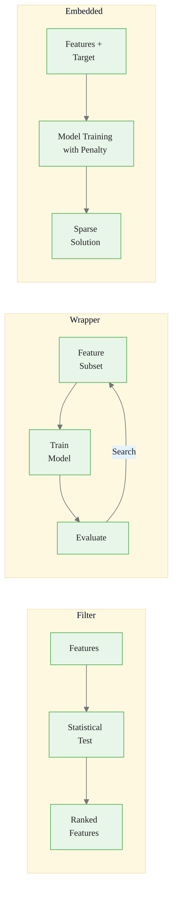
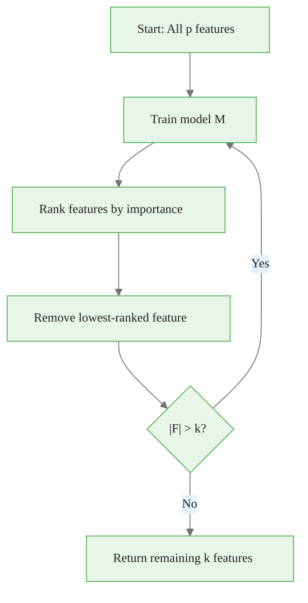
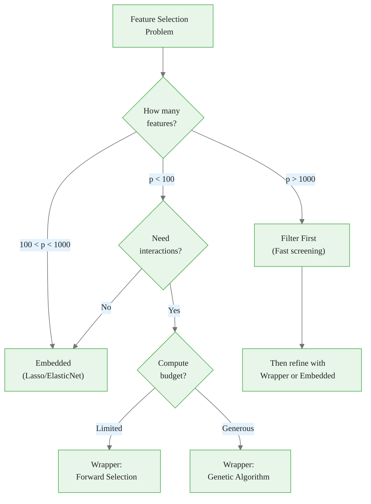

<!-- _class: lead -->
<!-- Speaker notes: This deck covers the three paradigms for feature selection. By the end, learners should understand when to use each approach and why GAs (a wrapper method) are the focus of this course. -->

# Feature Selection Approaches
## Filter, Wrapper, and Embedded Methods

### Module 00 — Foundations

Three paradigms for choosing the right features

---

<!-- Speaker notes: The Mermaid diagram shows the fundamental difference between methods. Filters evaluate features independently of models, wrappers use a model in a loop, and embedded methods build selection into training. Walk through each subgraph. -->

## Three Categories at a Glance



---

<!-- Speaker notes: This table is a quick reference for comparing methods. The key tradeoff is computation versus optimization quality. Filters are fast but miss interactions. Wrappers are slow but find the best subsets. Embedded methods sit in between. -->

## Overview

| Method | Speed | Accuracy | Model Dependency |
|--------|:-----:|:--------:|:----------------:|
| **Filter** | Fast | Lower | None |
| **Wrapper** | Slow | Higher | Full |
| **Embedded** | Medium | Medium-High | Specific model |

<div class="callout-info">

ℹ️ **Key tradeoff**: computational cost vs. optimization quality

</div>

---

<!-- Speaker notes: Use the hiring analogy to build intuition. Filters are like screening resumes -- fast but crude. Wrappers are like trial work periods -- accurate but expensive. Embedded methods are like built-in performance tracking. Ask the audience which they would use in different scenarios. -->

## Intuitive Explanation

**Filter** = Reviewing resumes before interviews
- Screen based on measurable criteria (GPA, experience)
- Fast, but might miss or keep wrong candidates

**Wrapper** = Trial work periods
- Test different team combinations on real projects
- Most accurate, but expensive

**Embedded** = Built-in performance tracking
- Work process naturally reveals who contributes
- Balanced, but model-specific

---

<!-- _class: lead -->
<!-- Speaker notes: Now we dive into filter methods. These are the fastest approach -- they evaluate features using statistical measures without training any model. Good for initial screening on very high-dimensional datasets. -->

# Filter Methods

Statistical tests independent of models

---

<!-- Speaker notes: Walk through each score function. Correlation captures linear relationships. Mutual information captures nonlinear ones. Chi-squared works for categorical features. ANOVA F-statistic compares group means. The cost is O(n*p), making filters the cheapest option by far. -->

## Filter: Formal Definition

Evaluate features using statistical measures:

$$S_{\text{filter}} = \{f_i : \text{score}(f_i, y) > \theta\}$$

**Score functions:**
- **Correlation**: $|\text{corr}(f_i, y)|$
- **Mutual Information**: $I(f_i; y) = \sum \sum p(f_i, y) \log \frac{p(f_i, y)}{p(f_i)p(y)}$
- **Chi-squared**: $\chi^2 = \sum \frac{(O - E)^2}{E}$
- **ANOVA F-statistic**: $F = \frac{\text{Between-group variance}}{\text{Within-group variance}}$

**Cost**: $O(n \cdot p)$ for $n$ samples, $p$ features

---

<!-- Speaker notes: Mutual information is the most versatile filter metric because it captures nonlinear relationships. The key property: I(X;Y) = 0 means X and Y are independent. Unlike correlation, MI detects any type of dependency. The downside: harder to compute and estimate from finite samples. -->

## Mutual Information

For feature $f_i$ and target $y$:

$$I(f_i; y) = H(y) - H(y | f_i)$$

Where:
- $H(y) = -\sum p(y) \log p(y)$ is entropy
- $H(y|f_i)$ is conditional entropy

**Properties:**
- $I(f_i; y) \geq 0$ (zero = independent)
- Captures **non-linear** relationships (unlike correlation)

---

<!-- Speaker notes: This is a complete working example using sklearn's mutual information. SelectKBest handles the ranking and threshold. The example creates synthetic data with 5 informative features and 15 noise features. Run this in a notebook to see MI correctly identifies the informative ones. -->

## Filter Implementation


<div class="code-window">
<div class="code-header">
<div class="dots"><span class="dot-red"></span><span class="dot-yellow"></span><span class="dot-green"></span></div>
<span class="filename">filter_selection_mi.py</span>
</div>

```python
from sklearn.feature_selection import mutual_info_regression, SelectKBest

def filter_selection_mi(X, y, k=10):
    """Select top k features using mutual information."""
    mi_scores = mutual_info_regression(X, y, random_state=42)
    selector = SelectKBest(score_func=mutual_info_regression, k=k)
    selector.fit(X, y)
    selected_indices = selector.get_support(indices=True)
    return selected_indices, mi_scores
```

</div>


<div class="code-window">
<div class="code-header">
<div class="dots"><span class="dot-red"></span><span class="dot-yellow"></span><span class="dot-green"></span></div>
<span class="filename">example.py</span>
</div>

```python
# Example
np.random.seed(42)
n, p = 200, 20
X = np.random.randn(n, p)
y = (X[:, 0]**2 + 2*X[:, 1] + np.sin(X[:, 2]) +
     np.exp(X[:, 3]/2) + X[:, 4] + np.random.randn(n)*0.1)
selected, mi_scores = filter_selection_mi(X, y, k=10)
```

</div>

---

<!-- _class: lead -->
<!-- Speaker notes: Wrapper methods use a predictive model to evaluate feature subsets. They are more accurate than filters because they test actual predictive performance, but much more expensive. This is where GAs come in -- as an efficient search strategy for the wrapper approach. -->

# Wrapper Methods

Model-based evaluation of feature subsets

---

<!-- Speaker notes: The formal definition shows that wrappers search for the subset that minimizes cross-validated error. The search strategies differ in how they explore the combinatorial space. Forward selection is greedy (start empty, add one at a time). GAs are population-based (explore many subsets simultaneously). -->

## Wrapper: Formal Definition

Use a predictive model to evaluate subsets:

$$S_{\text{wrapper}} = \argmin_{S \subseteq F} \text{CV\_Error}(M_S, S)$$

**Search strategies:**
- **Forward selection**: Start empty, add best feature iteratively
- **Backward elimination**: Start full, remove worst feature iteratively
- **RFE**: Backward with feature ranking
- **Genetic algorithms**: Population-based stochastic search

**Cost**: $O(p \cdot k \cdot T(M))$ for cross-validated RFE

---

<!-- Speaker notes: Forward selection is the simplest wrapper. At each step, try adding every remaining feature and keep the one that improves CV score the most. The inner loop evaluates p-k candidates at each of max_features steps. This is O(p^2) model trainings -- much more expensive than filters but finds better subsets. Note: this code block is intentionally long to show the complete algorithm; in practice, use sklearn's SequentialFeatureSelector. -->

## Wrapper: Forward Selection


<div class="code-window">
<div class="code-header">
<div class="dots"><span class="dot-red"></span><span class="dot-yellow"></span><span class="dot-green"></span></div>
<span class="filename">forward_selection_wrapper.py</span>
</div>

```python
def forward_selection_wrapper(X, y, max_features=10, cv=5):
    n_features = X.shape[1]
    selected, remaining = [], list(range(n_features))
    scores = []

    for step in range(max_features):
        best_score, best_feature = -np.inf, None
        for feature in remaining:
            trial_features = selected + [feature]
            X_trial = X[:, trial_features]
            model = LinearRegression()
            cv_scores = cross_val_score(
                model, X_trial, y, cv=cv,
                scoring='neg_mean_squared_error'
            )
            score = cv_scores.mean()
            if score > best_score:
                best_score = score
                best_feature = feature

        if best_feature is not None:
            selected.append(best_feature)
            remaining.remove(best_feature)
            scores.append(best_score)

    return selected, scores
```

</div>

---

<!-- Speaker notes: RFE is an alternative to forward selection that works backward. It trains the model, ranks features by importance, and removes the least important one. Repeat until you have k features left. The diagram shows this iterative pruning process. -->

## RFE Algorithm



---

<!-- _class: lead -->
<!-- Speaker notes: Embedded methods build feature selection into the model training process itself. The most common example is Lasso (L1 regularization), which drives coefficients to exactly zero. This is elegant because selection happens as a byproduct of training. -->

# Embedded Methods

Selection during model training

---

<!-- Speaker notes: Lasso minimizes squared error plus an L1 penalty. As lambda increases, more coefficients are driven to exactly zero. The code shows LassoCV which automatically finds the best lambda via cross-validation. The key insight: the selected features depend on the model structure (linear assumptions). -->

## Embedded: Lasso (L1 Regularization)

$$\min_{\beta} \frac{1}{2n} ||y - X\beta||_2^2 + \lambda ||\beta||_1$$

As $\lambda$ increases from 0 to $\infty$:
- $\lambda = 0$: All features (OLS solution)
- $\lambda \to \infty$: No features ($\beta = 0$)
- Intermediate: **Sparse solutions**


<div class="code-window">
<div class="code-header">
<div class="dots"><span class="dot-red"></span><span class="dot-yellow"></span><span class="dot-green"></span></div>
<span class="filename">lasso_selection.py</span>
</div>

```python
from sklearn.linear_model import LassoCV
from sklearn.preprocessing import StandardScaler

def lasso_selection(X, y, n_alphas=100):
    scaler = StandardScaler()
    X_scaled = scaler.fit_transform(X)
    lasso_cv = LassoCV(cv=5, n_alphas=n_alphas, random_state=42)
    lasso_cv.fit(X_scaled, y)
    selected = np.where(lasso_cv.coef_ != 0)[0]
    return selected, lasso_cv.coef_, lasso_cv.alpha_
```

</div>

---

<!-- Speaker notes: The regularization path shows how coefficients evolve as lambda increases. Features that survive longer (stay non-zero at higher lambda) are more important. This visualization is a powerful diagnostic tool. Point out that the path reveals feature importance ordering naturally. -->

## Regularization Path

```
Coefficient
    |
    |  ----  Feature 1 (stays)
    |   ---- Feature 3 (stays)
    |    ..... Feature 7 (drops at lambda=0.1)
    |     ..... Feature 2 (drops at lambda=0.05)
    |0 --------- rest are zero -----------
    +---------------------------------------->
    0       0.05     0.1     0.5     1.0
                   lambda (regularization)
```

> The path shows which features survive as regularization increases.

---

<!-- Speaker notes: This decision flow helps practitioners choose the right method. For very high-dimensional problems (p > 1000), start with a filter to screen down. For interaction effects, you need a wrapper. GAs are the advanced wrapper for generous compute budgets. The highlighted node shows where this course focuses. -->

## Method Decision Flow



---

<!-- Speaker notes: This comparison function runs all three methods and evaluates them on a held-out test set. This pattern is useful for benchmarking. Point out the train/test split prevents overfitting the method comparison. In practice, always compare methods on YOUR data -- no single method is universally best. -->

## Comparing All Three


<div class="code-window">
<div class="code-header">
<div class="dots"><span class="dot-red"></span><span class="dot-yellow"></span><span class="dot-green"></span></div>
<span class="filename">compare_selection_methods.py</span>
</div>

```python
def compare_selection_methods(X, y, n_features=10):
    X_train, X_test, y_train, y_test = train_test_split(
        X, y, test_size=0.3, random_state=42)
    results = {}

    # Filter
    selected_filter, _ = filter_selection_mi(X_train, y_train, k=n_features)
    model = LinearRegression()
    model.fit(X_train[:, selected_filter], y_train)
    y_pred = model.predict(X_test[:, selected_filter])
    results['Filter'] = {
        'mse': mean_squared_error(y_test, y_pred),
        'n_features': len(selected_filter)
    }

    # Wrapper (forward selection) and Embedded (Lasso)
    # ... similar evaluation pattern ...

    return results
```

</div>

---

<!-- _class: lead -->
<!-- Speaker notes: These are the mistakes that even experienced practitioners make. Understanding pitfalls is as important as understanding the methods themselves. -->

# Common Pitfalls

---

<!-- Speaker notes: This is the most dangerous pitfall. Filters evaluate features individually and will miss any feature whose value only emerges in combination with others. The XOR problem is the classic example: neither A nor B alone predicts y, but together they have perfect predictive power. This is why wrappers and GAs are needed for interaction-heavy problems. -->

## Pitfall 1: Filters Miss Interactions


<div class="code-window">
<div class="code-header">
<div class="dots"><span class="dot-red"></span><span class="dot-yellow"></span><span class="dot-green"></span></div>
<span class="filename">example.py</span>
</div>

```python
# XOR problem: y = x1 XOR x2
X = np.random.randint(0, 2, size=(1000, 2))
y = (X[:, 0] != X[:, 1]).astype(int)

# Individual correlations are ZERO
print(f"Corr(x1, y): {np.corrcoef(X[:, 0], y)[0, 1]:.4f}")  # ~0
print(f"Corr(x2, y): {np.corrcoef(X[:, 1], y)[0, 1]:.4f}")  # ~0
# But BOTH features are necessary!
```

</div>

> **Fix**: Use wrapper methods for problems with known interactions, or add interaction terms.

---

<!-- Speaker notes: Wrapper overfitting happens when you evaluate subsets on test data repeatedly. Each evaluation leaks information from the test set. The correct approach is nested CV: the inner loop selects features, the outer loop evaluates selection quality. The side-by-side comparison makes the issue clear. -->

## Pitfall 2: Wrapper Overfitting

<div class="compare">
<div>

**WRONG** -- overfit to test set:

<div class="code-window">
<div class="code-header">
<div class="dots"><span class="dot-red"></span><span class="dot-yellow"></span><span class="dot-green"></span></div>
<span class="filename">example.py</span>
</div>

```python
X_train, X_test, y_train, y_test = \
    train_test_split(X, y)

for subset in generate_subsets():
    score = evaluate(X_test, y_test,
                     subset)
    # Overfitting X_test!
```

</div>

</div>
<div>

**RIGHT** -- nested CV:

<div class="code-window">
<div class="code-header">
<div class="dots"><span class="dot-red"></span><span class="dot-yellow"></span><span class="dot-green"></span></div>
<span class="filename">example.py</span>
</div>

```python
for train, test in KFold(5).split(X):
    X_tr, X_te = X[train], X[test]
    y_tr, y_te = y[train], y[test]

    # Select on training only
    best = optimize(X_tr, y_tr)

    # Evaluate on held-out
    score = evaluate(X_te, y_te, best)
```

</div>

</div>
</div>

---

<!-- Speaker notes: Lasso selects features based on linear model assumptions. Tree importance selects based on split gains. These can disagree because they reflect different model biases. The fix is to combine multiple embedded methods and take the union or intersection. This gives a more model-agnostic feature set. -->

## Pitfall 3: Embedded Methods Are Model-Specific

Lasso and tree importance assume specific model structures.

**Fix**: Combine multiple embedded methods:


<div class="code-window">
<div class="code-header">
<div class="dots"><span class="dot-red"></span><span class="dot-yellow"></span><span class="dot-green"></span></div>
<span class="filename">example.py</span>
</div>

```python
from sklearn.ensemble import RandomForestRegressor

# Lasso selection
lasso = LassoCV(cv=5)
lasso.fit(X, y)
lasso_features = np.where(lasso.coef_ != 0)[0]

# Random Forest importance
rf = RandomForestRegressor(n_estimators=100, random_state=42)
rf.fit(X, y)
rf_features = np.argsort(rf.feature_importances_)[-10:]

# Union of both methods
combined = np.union1d(lasso_features, rf_features)
```

</div>

---

<!-- Speaker notes: Stability analysis measures how consistently a method selects the same features across bootstrap resamples. The Jaccard similarity metric compares feature sets pairwise. Stable methods produce high similarity (close to 1.0). Unstable selection should not be trusted. -->

## Stability Analysis


<div class="code-window">
<div class="code-header">
<div class="dots"><span class="dot-red"></span><span class="dot-yellow"></span><span class="dot-green"></span></div>
<span class="filename">evaluate_stability.py</span>
</div>

```python
from sklearn.utils import resample

def evaluate_stability(X, y, method, n_iterations=20):
    """Measure selection stability using bootstrap."""
    selected_sets = []
    for i in range(n_iterations):
        X_boot, y_boot = resample(X, y, random_state=i)
        if method == 'filter':
            selected, _ = filter_selection_mi(X_boot, y_boot, k=10)
        elif method == 'wrapper':
            selected, _ = forward_selection_wrapper(
                X_boot, y_boot, max_features=10)
        elif method == 'embedded':
            selected, _, _ = lasso_selection(X_boot, y_boot)
        selected_sets.append(set(selected))

    # Pairwise Jaccard similarity
    similarities = []
    for i in range(len(selected_sets)):
        for j in range(i+1, len(selected_sets)):
            inter = len(selected_sets[i] & selected_sets[j])
            union = len(selected_sets[i] | selected_sets[j])
            if union > 0:
                similarities.append(inter / union)
    return np.mean(similarities)
```

</div>

---

<!-- Speaker notes: Wrap up with the connections slide. This deck establishes the landscape of feature selection methods. The rest of the course focuses on GAs as an advanced wrapper method. Emphasize that GAs explore the search space more effectively than greedy approaches. -->

## Connections

<div class="compare">
<div>

**Builds On:**
- Feature selection problem
- Statistical testing
- Cross-validation
- Regularization theory

</div>
<div>

**Leads To:**
- **Module 1**: GAs as advanced wrapper
- **Module 2**: Fitness function design
- **Module 4**: DEAP implementation

</div>
</div>

**Related**: Hyperparameter tuning, model selection, ensemble methods, dimensionality reduction (PCA)

---

<!-- Speaker notes: Use this ASCII diagram as a quick reference card. It summarizes all three approaches, their costs, strengths, and weaknesses. The key insight is that GAs are a powerful wrapper method. -->

<div class="flow">
<div class="flow-step blue">Filter</div>
<div class="flow-arrow">→</div>
<div class="flow-step amber">Embedded</div>
<div class="flow-arrow">→</div>
<div class="flow-step mint">Wrapper (GA)</div>
</div>

## Visual Summary

```
FEATURE SELECTION APPROACHES
==============================

         Filter              Wrapper             Embedded
      (Statistics)         (Model-based)       (During training)
           |                    |                    |
     Score features       Try subsets in       Train with penalty
     independently         model + CV          (L1 / tree importance)
           |                    |                    |
     Fast O(n*p)          Slow O(p*k*T)        Medium O(n*p^2)
           |                    |                    |
     Misses interactions   Can overfit          Model-specific
           |                    |                    |
           +--------+-----------+----------+---------+
                    |                      |
              GA = Advanced           Combine multiple
              Wrapper Method          for robustness
```

<div class="callout-insight">

💡 **Key insight**: GAs are a powerful wrapper method that explores the search space more effectively than greedy approaches.

</div>
