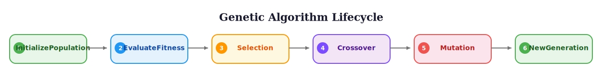

# Encoding Strategies for Feature Selection

> **Reading time:** ~11 min | **Module:** 1 — GA Fundamentals | **Prerequisites:** Module 0 foundations

## In Brief

Binary and integer encoding schemes transform the feature selection problem into a representation suitable for genetic algorithm manipulation. Binary encoding maps each feature to a bit (0=excluded, 1=included), while integer encoding stores indices of selected features.

<div class="callout-insight">
The choice of encoding determines what genetic operators can do. Binary encoding enables standard crossover/mutation operators and naturally handles variable-length feature sets, while integer encoding can be more compact but requires specialized operators to maintain validity.
</div>

<div class="callout-key">
<strong>Key Concept:</strong> Encoding is the bridge between the problem domain (which features to select) and the GA's machinery (chromosomes, crossover, mutation). Binary encoding is the natural default for feature selection because it directly maps to inclusion/exclusion -- no transformation needed, and standard operators work out of the box.
</div>



## Intuitive Explanation

Think of binary encoding like a **light switch panel** where each switch controls one feature. All switches are always present, but can be ON (1) or OFF (0). This makes it easy to flip switches (mutation) or exchange switch settings between two panels (crossover).

```
Light Switch Panel (Binary Encoding):

Feature:  [Price_Lag1] [RSI] [MACD] [VIX] [Gold] [Rig_Count]
Switch:   [  ON  ]    [ OFF ] [ ON ] [ ON ] [ OFF ] [  ON  ]
Binary:   [  1   ]    [  0  ] [  1 ] [  1 ] [  0  ] [  1   ]

Selected features: {Price_Lag1, MACD, VIX, Rig_Count}
```

Integer encoding is like a **list of which lights are ON**. The list can grow or shrink, and you need special care to avoid listing the same light twice. This is more compact when selecting few features from many, but requires more complex operations to maintain validity.

**When to use each:**
- **Binary encoding**: Default choice, simpler operators, works for any feature count
- **Integer encoding**: When selecting very few features from many (e.g., 10 from 10,000)

## Formal Definition

### Binary Encoding

A solution is represented as a binary vector $\mathbf{x} \in \{0,1\}^n$ where:

$$x_i = \begin{cases} 1 & \text{if feature } i \text{ is selected} \\ 0 & \text{if feature } i \text{ is excluded} \end{cases}$$

The selected feature set is: $S = \{i : x_i = 1, i \in \{1, ..., n\}\}$

### Integer Encoding

A solution is represented as a variable-length vector $\mathbf{v} = [i_1, i_2, ..., i_k]$ where:
- $i_j \in \{1, ..., n\}$ are feature indices
- $k = |S|$ is the number of selected features
- All $i_j$ are unique

### Constraints

- **Minimum features**: $|\mathbf{x}|_1 \geq k_{min}$ (typically $k_{min} = 1$)
- **Maximum features**: $|\mathbf{x}|_1 \leq k_{max}$ (problem-dependent)
- **Uniqueness**: In integer encoding, no duplicate indices

<div class="compare">
<div class="compare-card">
<div class="header red">Binary Encoding</div>
<ul>
<li>Fixed-length chromosome (n bits)</li>
<li>Standard crossover/mutation operators</li>
<li>Memory: O(n) always</li>
<li>Best when selecting many features</li>
</ul>
</div>
<div class="compare-card">
<div class="header green">Integer Encoding</div>
<ul>
<li>Variable-length chromosome (k indices)</li>
<li>Requires specialized operators</li>
<li>Memory: O(k) -- compact when k &lt;&lt; n</li>
<li>Best when selecting very few features</li>
</ul>
</div>
</div>

## Code Implementation

### Binary Encoding Implementation

<div class="code-window">
<div class="code-header">
<div class="dots"><span class="dot-red"></span><span class="dot-yellow"></span><span class="dot-green"></span></div>
<span class="filename">__post_init__.py</span>
</div>

```python
import numpy as np
from typing import List, Optional, Tuple
from dataclasses import dataclass

@dataclass
class BinaryIndividual:
    """Binary encoded individual for feature selection."""
    chromosome: np.ndarray  # Binary vector [0,1,0,1,...]
    fitness: Optional[float] = None

    def __post_init__(self):
        """Validate encoding."""
        assert self.chromosome.dtype in [np.int32, np.int64, int], "Must be integer array"
        assert np.all(np.isin(self.chromosome, [0, 1])), "Must be binary"

    @classmethod
    def random(cls, n_features: int, init_prob: float = 0.5,
               min_features: int = 1) -> 'BinaryIndividual':
        """
        Create random individual with binary encoding.

        Parameters
        ----------
        n_features : int
            Total number of features in dataset
        init_prob : float
            Probability of each feature being selected initially
        min_features : int
            Minimum number of features to select

        Returns
        -------
        BinaryIndividual
            Random valid individual
        """
        chromosome = (np.random.random(n_features) < init_prob).astype(int)

        # Ensure minimum features selected
        while chromosome.sum() < min_features:
            idx = np.random.randint(n_features)
            chromosome[idx] = 1

        return cls(chromosome=chromosome)

    @property
    def selected_features(self) -> np.ndarray:
        """Get indices of selected features."""
        return np.where(self.chromosome == 1)[0]

    @property
    def n_selected(self) -> int:
        """Count of selected features."""
        return int(self.chromosome.sum())

    def copy(self) -> 'BinaryIndividual':
        """Deep copy of individual."""
        return BinaryIndividual(
            chromosome=self.chromosome.copy(),
            fitness=self.fitness
        )

    def to_mask(self) -> np.ndarray:
        """Convert to boolean mask for indexing."""
        return self.chromosome.astype(bool)


# Binary encoding operators
def binary_mutate(individual: BinaryIndividual,
                  mutation_rate: float = 0.01,
                  min_features: int = 1) -> BinaryIndividual:
    """
    Bit-flip mutation for binary encoding.

    Each bit flipped with probability mutation_rate.
    Maintains minimum feature constraint.
    """
    mutant = individual.copy()

    for i in range(len(mutant.chromosome)):
        if np.random.random() < mutation_rate:
            mutant.chromosome[i] = 1 - mutant.chromosome[i]

    # Enforce minimum features
    while mutant.n_selected < min_features:
        zero_idx = np.where(mutant.chromosome == 0)[0]
        if len(zero_idx) > 0:
            mutant.chromosome[np.random.choice(zero_idx)] = 1
        else:
            break

    mutant.fitness = None  # Invalidate fitness
    return mutant


def binary_crossover(parent1: BinaryIndividual,
                     parent2: BinaryIndividual,
                     method: str = 'uniform') -> Tuple[BinaryIndividual, BinaryIndividual]:
    """
    Crossover for binary encoding.

    Parameters
    ----------
    parent1, parent2 : BinaryIndividual
        Parent individuals
    method : str
        'uniform', 'single_point', or 'two_point'

    Returns
    -------
    tuple of BinaryIndividual
        Two offspring
    """
    n = len(parent1.chromosome)

    if method == 'uniform':
        # Each gene inherited from random parent
        mask = np.random.randint(0, 2, n, dtype=bool)
        child1_chrom = np.where(mask, parent1.chromosome, parent2.chromosome)
        child2_chrom = np.where(mask, parent2.chromosome, parent1.chromosome)

    elif method == 'single_point':
        point = np.random.randint(1, n)
        child1_chrom = np.concatenate([parent1.chromosome[:point],
                                       parent2.chromosome[point:]])
        child2_chrom = np.concatenate([parent2.chromosome[:point],
                                       parent1.chromosome[point:]])

    elif method == 'two_point':
        point1, point2 = sorted(np.random.choice(n, 2, replace=False))
        child1_chrom = parent1.chromosome.copy()
        child1_chrom[point1:point2] = parent2.chromosome[point1:point2]
        child2_chrom = parent2.chromosome.copy()
        child2_chrom[point1:point2] = parent1.chromosome[point1:point2]

    else:
        raise ValueError(f"Unknown crossover method: {method}")

    return (BinaryIndividual(child1_chrom),
            BinaryIndividual(child2_chrom))


# Example usage
def demo_binary_encoding():
    """Demonstrate binary encoding operations."""
    print("Binary Encoding Demo")
    print("=" * 60)

    # Create random individual
    n_features = 10
    ind = BinaryIndividual.random(n_features, init_prob=0.3)

    print(f"\nOriginal chromosome: {ind.chromosome}")
    print(f"Selected features: {ind.selected_features}")
    print(f"Number selected: {ind.n_selected}")

    # Mutation
    mutant = binary_mutate(ind, mutation_rate=0.2)
    print(f"\nAfter mutation: {mutant.chromosome}")
    print(f"Selected features: {mutant.selected_features}")

    # Crossover
    parent1 = BinaryIndividual.random(n_features, init_prob=0.4)
    parent2 = BinaryIndividual.random(n_features, init_prob=0.4)

    print(f"\nParent 1: {parent1.chromosome}")
    print(f"Parent 2: {parent2.chromosome}")

    child1, child2 = binary_crossover(parent1, parent2, method='uniform')
    print(f"Child 1:  {child1.chromosome}")
    print(f"Child 2:  {child2.chromosome}")
```
</div>


### Integer Encoding Implementation

<div class="code-window">
<div class="code-header">
<div class="dots"><span class="dot-red"></span><span class="dot-yellow"></span><span class="dot-green"></span></div>
<span class="filename">integer_encoding.py</span>
</div>

```python
@dataclass
class IntegerIndividual:
    """Integer encoded individual for feature selection."""
    chromosome: np.ndarray  # Array of selected feature indices
    n_features: int  # Total features available
    fitness: Optional[float] = None

    def __post_init__(self):
        """Validate encoding."""
        # Check for duplicates
        assert len(self.chromosome) == len(np.unique(self.chromosome)), \
            "Duplicate features not allowed"
        # Check valid range
        assert np.all(self.chromosome >= 0) and np.all(self.chromosome < self.n_features), \
            f"Feature indices must be in [0, {self.n_features})"

    @classmethod
    def random(cls, n_features: int, n_selected: Optional[int] = None,
               min_features: int = 1, max_features: Optional[int] = None) -> 'IntegerIndividual':
        """
        Create random individual with integer encoding.

        Parameters
        ----------
        n_features : int
            Total number of features available
        n_selected : int, optional
            Exact number of features to select (random if None)
        min_features : int
            Minimum features to select
        max_features : int, optional
            Maximum features to select (n_features if None)
        """
        max_features = max_features or n_features

        if n_selected is None:
            n_selected = np.random.randint(min_features, max_features + 1)

        # Random sample without replacement
        chromosome = np.random.choice(n_features, size=n_selected, replace=False)

        return cls(chromosome=chromosome, n_features=n_features)

    @property
    def n_selected(self) -> int:
        """Count of selected features."""
        return len(self.chromosome)

    def to_binary(self) -> np.ndarray:
        """Convert to binary encoding."""
        binary = np.zeros(self.n_features, dtype=int)
        binary[self.chromosome] = 1
        return binary

    def to_mask(self) -> np.ndarray:
        """Convert to boolean mask."""
        return self.to_binary().astype(bool)

    def copy(self) -> 'IntegerIndividual':
        """Deep copy."""
        return IntegerIndividual(
            chromosome=self.chromosome.copy(),
            n_features=self.n_features,
            fitness=self.fitness
        )


def integer_mutate(individual: IntegerIndividual,
                   mutation_rate: float = 0.1,
                   min_features: int = 1) -> IntegerIndividual:
    """
    Mutation for integer encoding.

    Randomly adds, removes, or replaces features.
    """
    mutant = individual.copy()

    if np.random.random() < mutation_rate:
        operation = np.random.choice(['add', 'remove', 'replace'])

        if operation == 'add' and mutant.n_selected < mutant.n_features:
            # Add a new feature
            available = np.setdiff1d(np.arange(mutant.n_features), mutant.chromosome)
            if len(available) > 0:
                new_feature = np.random.choice(available)
                mutant.chromosome = np.append(mutant.chromosome, new_feature)

        elif operation == 'remove' and mutant.n_selected > min_features:
            # Remove a feature
            idx_to_remove = np.random.randint(mutant.n_selected)
            mutant.chromosome = np.delete(mutant.chromosome, idx_to_remove)

        elif operation == 'replace':
            # Replace a feature
            idx_to_replace = np.random.randint(mutant.n_selected)
            available = np.setdiff1d(np.arange(mutant.n_features), mutant.chromosome)
            if len(available) > 0:
                new_feature = np.random.choice(available)
                mutant.chromosome[idx_to_replace] = new_feature

    mutant.fitness = None
    return mutant


def integer_crossover(parent1: IntegerIndividual,
                      parent2: IntegerIndividual) -> Tuple[IntegerIndividual, IntegerIndividual]:
    """
    Crossover for integer encoding.

    Creates children by combining parent feature sets.
    """
    # Combine features from both parents
    combined = np.unique(np.concatenate([parent1.chromosome, parent2.chromosome]))

    # Each child gets random subset
    np.random.shuffle(combined)

    # Split roughly in half
    split = len(combined) // 2
    split = max(1, split)  # At least one feature

    child1_features = combined[:split]
    child2_features = combined[split:] if split < len(combined) else combined[:1]

    return (
        IntegerIndividual(chromosome=child1_features, n_features=parent1.n_features),
        IntegerIndividual(chromosome=child2_features, n_features=parent2.n_features)
    )


def demo_integer_encoding():
    """Demonstrate integer encoding operations."""
    print("\nInteger Encoding Demo")
    print("=" * 60)

    n_features = 20

    # Create random individual
    ind = IntegerIndividual.random(n_features, n_selected=5)
    print(f"\nOriginal chromosome: {ind.chromosome}")
    print(f"Binary equivalent: {ind.to_binary()}")
    print(f"Number selected: {ind.n_selected}")

    # Mutation
    mutant = integer_mutate(ind, mutation_rate=0.5)
    print(f"\nAfter mutation: {mutant.chromosome}")
    print(f"Number selected: {mutant.n_selected}")

    # Crossover
    parent1 = IntegerIndividual.random(n_features, n_selected=4)
    parent2 = IntegerIndividual.random(n_features, n_selected=6)

    print(f"\nParent 1: {parent1.chromosome}")
    print(f"Parent 2: {parent2.chromosome}")

    child1, child2 = integer_crossover(parent1, parent2)
    print(f"Child 1:  {child1.chromosome}")
    print(f"Child 2:  {child2.chromosome}")


# Performance comparison
def compare_encodings():
    """Compare memory usage and operation speed."""
    import sys
    import time

    n_features = 1000
    n_selected = 10
    n_operations = 1000

    print("\nEncoding Comparison")
    print("=" * 60)
    print(f"Features: {n_features}, Selected: {n_selected}")

    # Binary encoding
    binary_ind = BinaryIndividual.random(n_features, init_prob=n_selected/n_features)
    binary_size = sys.getsizeof(binary_ind.chromosome)

    start = time.time()
    for _ in range(n_operations):
        binary_mutate(binary_ind, mutation_rate=0.01)
    binary_time = time.time() - start

    # Integer encoding
    integer_ind = IntegerIndividual.random(n_features, n_selected=n_selected)
    integer_size = sys.getsizeof(integer_ind.chromosome)

    start = time.time()
    for _ in range(n_operations):
        integer_mutate(integer_ind, mutation_rate=0.1)
    integer_time = time.time() - start

    print(f"\nMemory usage:")
    print(f"  Binary:  {binary_size:,} bytes")
    print(f"  Integer: {integer_size:,} bytes")
    print(f"  Ratio:   {binary_size/integer_size:.2f}x")

    print(f"\nMutation time ({n_operations} operations):")
    print(f"  Binary:  {binary_time:.4f} seconds")
    print(f"  Integer: {integer_time:.4f} seconds")


if __name__ == "__main__":
    demo_binary_encoding()
    demo_integer_encoding()
    compare_encodings()
```

</div>

## Common Pitfalls

### 1. Allowing Empty Solutions

**Problem**: Mutation or crossover can create individuals with no features selected.

**Solution**: Always enforce minimum feature constraint.

```python
# Bad
def bad_mutation(individual):
    mutant = individual.copy()
    for i in range(len(mutant.chromosome)):
        if np.random.random() < 0.5:  # High rate!
            mutant.chromosome[i] = 1 - mutant.chromosome[i]
    return mutant  # Might have all zeros

# Good
def good_mutation(individual, min_features=1):
    mutant = individual.copy()
    for i in range(len(mutant.chromosome)):
        if np.random.random() < 0.01:
            mutant.chromosome[i] = 1 - mutant.chromosome[i]

    # Enforce constraint
    while mutant.chromosome.sum() < min_features:
        zero_idx = np.where(mutant.chromosome == 0)[0]
        mutant.chromosome[np.random.choice(zero_idx)] = 1

    return mutant
```

<div class="callout-danger">
<strong>Danger:</strong> Choosing the wrong encoding for your problem size can make the GA 100x slower. If selecting 5 features from 100,000, binary encoding wastes 99.995% of the chromosome on zeros. Use integer encoding instead.
</div>

### 2. Integer Encoding Duplicates

**Problem**: Crossover or mutation creates duplicate feature indices.

**Solution**: Always validate uniqueness after operations.

```python
# Bad
def bad_integer_mutation(individual):
    mutant = individual.copy()
    idx = np.random.randint(len(mutant.chromosome))
    mutant.chromosome[idx] = np.random.randint(individual.n_features)
    return mutant  # Might create duplicate!

# Good
def good_integer_mutation(individual):
    mutant = individual.copy()
    idx = np.random.randint(len(mutant.chromosome))

    # Only choose from available features
    available = np.setdiff1d(np.arange(individual.n_features), mutant.chromosome)
    if len(available) > 0:
        mutant.chromosome[idx] = np.random.choice(available)

    return mutant
```

<div class="callout-warning">
<strong>Warning:</strong> Always validate uniqueness after integer crossover or mutation. Two parents with overlapping feature indices can produce children with duplicate entries, violating the encoding constraint.
</div>

### 3. Inefficient Binary Operations

**Problem**: Using Python loops instead of NumPy vectorization.

```python
# Bad - 100x slower
def slow_crossover(parent1, parent2):
    child = []
    for i in range(len(parent1.chromosome)):
        if np.random.random() < 0.5:
            child.append(parent1.chromosome[i])
        else:
            child.append(parent2.chromosome[i])
    return BinaryIndividual(np.array(child))

# Good - vectorized
def fast_crossover(parent1, parent2):
    mask = np.random.random(len(parent1.chromosome)) < 0.5
    child_chrom = np.where(mask, parent1.chromosome, parent2.chromosome)
    return BinaryIndividual(child_chrom)
```

### 4. Wrong Encoding Choice

**When binary is wrong**: Selecting 5 features from 100,000 (99.995% zeros)

**When integer is wrong**: Complex crossover/mutation logic needed

## Connections

<div class="callout-info">
ℹ️ **How this connects to the rest of the course:**
</div>

### Prerequisites
- Basic understanding of genetic algorithms
- NumPy array operations
- Python object-oriented programming

### Leads To
- Selection operators (tournament, roulette, rank)
- Genetic operators (crossover, mutation)
- Fitness function design
- Population management

### Related Concepts
- Permutation encoding (for ordered problems)
- Real-valued encoding (for continuous parameters)
- Tree encoding (for genetic programming)

## Practice Problems

### Problem 1: Constrained Binary Encoding

Implement a binary encoding that enforces both minimum and maximum feature counts.

```python
def constrained_binary_individual(n_features: int,
                                  min_features: int = 5,
                                  max_features: int = 20) -> BinaryIndividual:
    """
    Create random individual respecting feature count constraints.

    Your implementation here.
    """
    pass

# Test
ind = constrained_binary_individual(100, min_features=10, max_features=30)
assert 10 <= ind.n_selected <= 30
```

### Problem 2: Hybrid Encoding

Create an encoding that combines binary representation with feature weights.

```python
@dataclass
class WeightedIndividual:
    """Binary selection + continuous weights for selected features."""
    chromosome: np.ndarray  # Binary [0,1,0,...]
    weights: np.ndarray     # Weights for selected features

    # Implement: random initialization, mutation that maintains consistency
```

### Problem 3: Integer to Binary Conversion

Implement efficient conversion between encodings.

```python
def integer_to_binary(integer_ind: IntegerIndividual) -> BinaryIndividual:
    """Convert integer encoding to binary encoding."""
    pass

def binary_to_integer(binary_ind: BinaryIndividual,
                     n_features: int) -> IntegerIndividual:
    """Convert binary encoding to integer encoding."""
    pass

# Test round-trip
original = IntegerIndividual.random(50, n_selected=10)
binary = integer_to_binary(original)
recovered = binary_to_integer(binary, 50)
assert np.array_equal(np.sort(original.chromosome), np.sort(recovered.chromosome))
```

### Problem 4: Adaptive Encoding

Implement encoding that automatically chooses binary or integer based on sparsity.

```python
class AdaptiveIndividual:
    """Automatically uses binary or integer encoding based on sparsity."""

    def __init__(self, n_features: int, selected_features: np.ndarray):
        """
        Choose encoding based on sparsity.
        If < 30% features selected, use integer; otherwise binary.
        """
        pass

    def mutate(self, mutation_rate: float):
        """Mutation using appropriate encoding."""
        pass
```

### Problem 5: Memory-Efficient Sparse Binary

Implement a binary encoding that uses bit-packing for memory efficiency.

```python
class SparseBinaryIndividual:
    """Uses bit-packing to reduce memory by 8x."""

    def __init__(self, n_features: int, selected_indices: np.ndarray):
        """Store as packed bits using np.packbits."""
        pass

    @property
    def selected_features(self) -> np.ndarray:
        """Unpack and return selected feature indices."""
        pass
```

### Problem 6: Conceptual — Encoding Choice

**Question:** You need to select 5 features from a pool of 50,000 genomic markers. Explain why binary encoding would be wasteful here, and describe how integer encoding addresses the inefficiency. What new challenge does integer encoding introduce for the crossover operator?

### Problem 7: Conceptual — Constraint Enforcement

**Question:** After crossover, an offspring chromosome might have zero features selected (all zeros). Explain why this is a problem beyond just "the model won't train," and describe two strategies for handling it: repair (fix the invalid solution) vs. penalty (let it survive with bad fitness). What are the tradeoffs?

## Further Reading

### Academic Papers
- Holland, J.H. (1992). "Genetic Algorithms". Scientific American, 267(1), 66-72.
  - Original formulation of binary encoding in GAs

- Cervantes, L., et al. (2020). "A comprehensive survey on support vector machine classification: Applications, challenges and trends". Neurocomputing, 408, 189-215.
  - Section on encoding strategies for feature selection

### Books
- Goldberg, D.E. (1989). "Genetic Algorithms in Search, Optimization, and Machine Learning"
  - Chapter 2: Binary vs. other encodings

- Eiben, A.E., & Smith, J.E. (2015). "Introduction to Evolutionary Computing" (2nd ed.)
  - Chapter 3: Representation

### Online Resources
- DEAP Documentation: https://deap.readthedocs.io/en/master/tutorials/basic/part1.html
  - Practical encoding examples

- GA Feature Selection Tutorial: https://github.com/scikit-learn-contrib/sklearn-genetic
  - Real-world implementations

### Implementation Libraries
- **DEAP**: Distributed Evolutionary Algorithms in Python
- **geneticalgorithm2**: Modern GA implementation with multiple encodings
- **sklearn-genetic**: Scikit-learn compatible GA feature selection
---

**Next:** [Companion Slides](./01_encoding_slides.md) | [Notebook](../notebooks/01_basic_ga.ipynb)
