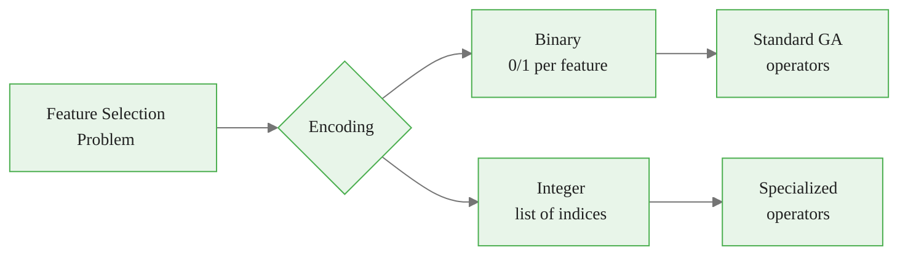
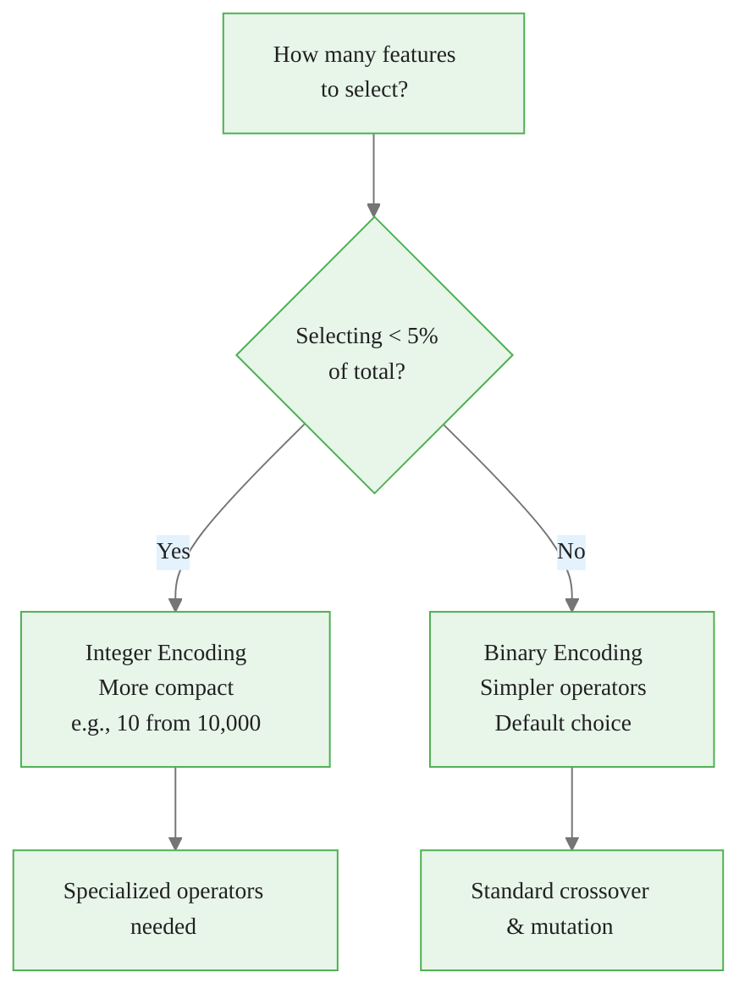
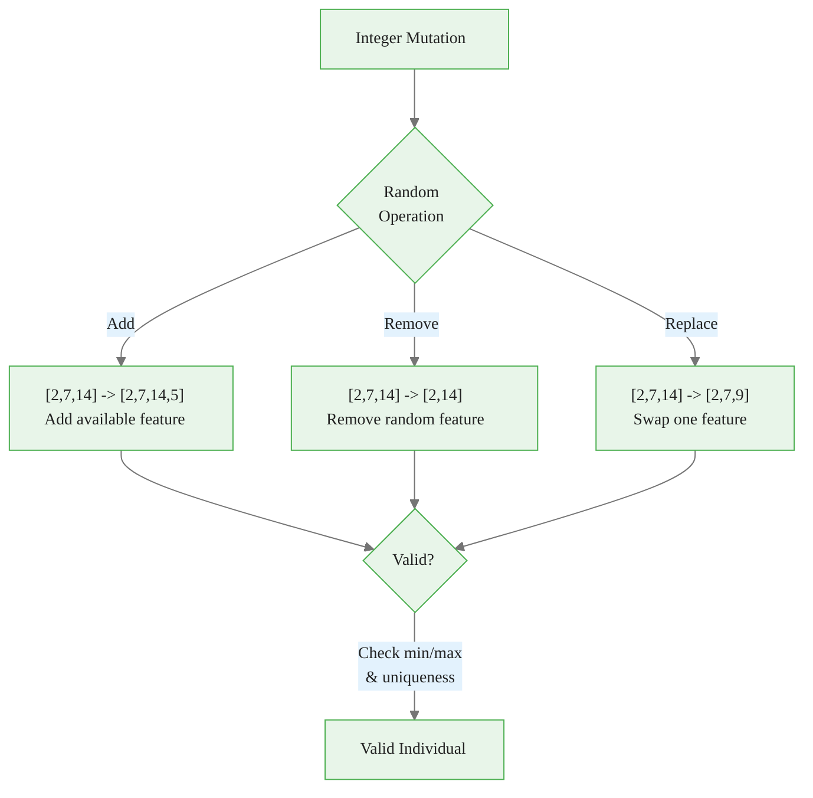

<!-- _class: lead -->
<!-- Speaker notes: This deck covers the two main encoding strategies for feature selection GAs. Binary is the default choice; integer encoding is more compact when selecting very few features from a large pool. -->

# Encoding Strategies for Feature Selection

## Module 01 — GA Fundamentals

Binary and integer representations for genetic algorithm manipulation

---

<!-- Speaker notes: The encoding choice determines everything downstream -- what operators you can use, how efficient the representation is, and what constraints need enforcement. The decision tree shows the simple rule: binary by default, integer only when selecting less than 5% of features. -->

## Why Encoding Matters

The choice of encoding determines:
- What genetic operators can do
- How efficiently solutions are represented
- What constraints need enforcement



---

<!-- Speaker notes: Binary encoding is the most natural for feature selection. Each bit is a light switch for one feature. The math is simple -- x_i=1 means include feature i. The ASCII diagram shows the mapping from chromosome to selected feature set. This is the representation used throughout the rest of the course. -->

## Binary Encoding

A solution is a binary vector $\mathbf{x} \in \{0,1\}^n$:

$$x_i = \begin{cases} 1 & \text{if feature } i \text{ is selected} \\ 0 & \text{if feature } i \text{ is excluded} \end{cases}$$

```
Chromosome: [1, 0, 1, 1, 0, 0, 1, 0]

Features:   [f1,f2,f3,f4,f5,f6,f7,f8]

Selected:   {f1, f3, f4, f7}
```

> Like a light switch panel -- each switch controls one feature (ON/OFF).

---

<!-- Speaker notes: Integer encoding stores only the indices of selected features. This is more compact when selecting few features from many. For example, selecting 10 from 10,000 features: binary needs 10,000 bits, integer needs only 10 indices. The tradeoff: you need specialized operators to maintain uniqueness. -->

## Integer Encoding

A variable-length vector $\mathbf{v} = [i_1, i_2, ..., i_k]$:

- $i_j \in \{1, ..., n\}$ are feature indices
- $k = |S|$ is the number selected
- All indices must be unique

```
Chromosome: [2, 7, 14, 3]   (4 features selected from 20)

Binary equivalent: [0,0,1,1,0,0,0,1,0,0,0,0,0,0,1,0,0,0,0,0]
```

> Like a list of which lights are ON -- more compact when few selected.

---

<!-- Speaker notes: The decision tree makes the choice simple. If you are selecting less than 5% of all features (e.g., 10 from 10,000), integer encoding saves significant memory. Otherwise, binary is simpler and lets you use standard crossover and mutation operators without modification. -->

## When to Use Each



---

<!-- Speaker notes: The BinaryIndividual dataclass wraps a numpy array with convenience properties. The random factory method initializes with a given probability and enforces a minimum feature count. The selected_features property returns indices where the chromosome is 1. -->

## Binary Encoding: Implementation


<div class="code-window">
<div class="code-header">
<div class="dots"><span class="dot-red"></span><span class="dot-yellow"></span><span class="dot-green"></span></div>
<span class="filename">binaryindividual.py</span>
</div>

```python
@dataclass
class BinaryIndividual:
    chromosome: np.ndarray  # Binary vector [0,1,0,1,...]
    fitness: Optional[float] = None

    @classmethod
    def random(cls, n_features: int, init_prob: float = 0.5,
               min_features: int = 1) -> 'BinaryIndividual':
        chromosome = (np.random.random(n_features) < init_prob).astype(int)
        while chromosome.sum() < min_features:
            idx = np.random.randint(n_features)
            chromosome[idx] = 1
        return cls(chromosome=chromosome)

    @property
    def selected_features(self) -> np.ndarray:
        return np.where(self.chromosome == 1)[0]

    @property
    def n_selected(self) -> int:
        return int(self.chromosome.sum())
```

</div>

---

<!-- Speaker notes: Bit-flip mutation is the standard mutation for binary encoding. Each bit independently flips with probability mutation_rate. The while loop at the end enforces the minimum feature constraint -- critical to prevent empty chromosomes that crash the fitness function. Invalidating fitness (setting to None) forces re-evaluation. -->

## Binary Mutation


<div class="code-window">
<div class="code-header">
<div class="dots"><span class="dot-red"></span><span class="dot-yellow"></span><span class="dot-green"></span></div>
<span class="filename">binary_mutate.py</span>
</div>

```python
def binary_mutate(individual: BinaryIndividual,
                  mutation_rate: float = 0.01,
                  min_features: int = 1) -> BinaryIndividual:
    """Bit-flip mutation with minimum feature constraint."""
    mutant = individual.copy()
    for i in range(len(mutant.chromosome)):
        if np.random.random() < mutation_rate:
            mutant.chromosome[i] = 1 - mutant.chromosome[i]

    # Enforce minimum features
    while mutant.n_selected < min_features:
        zero_idx = np.where(mutant.chromosome == 0)[0]
        if len(zero_idx) > 0:
            mutant.chromosome[np.random.choice(zero_idx)] = 1
        else:
            break
    mutant.fitness = None  # Invalidate fitness
    return mutant
```

</div>

---

<!-- Speaker notes: Binary crossover supports both uniform and single-point modes. Uniform is preferred for feature selection because it has no positional bias. The mask determines which parent contributes each gene. NumPy vectorization makes this very fast. -->

## Binary Crossover


<div class="code-window">
<div class="code-header">
<div class="dots"><span class="dot-red"></span><span class="dot-yellow"></span><span class="dot-green"></span></div>
<span class="filename">binary_crossover.py</span>
</div>

```python
def binary_crossover(parent1, parent2, method='uniform'):
    n = len(parent1.chromosome)

    if method == 'uniform':
        mask = np.random.randint(0, 2, n, dtype=bool)
        child1 = np.where(mask, parent1.chromosome,
                          parent2.chromosome)
        child2 = np.where(mask, parent2.chromosome,
                          parent1.chromosome)

    elif method == 'single_point':
        point = np.random.randint(1, n)
        child1 = np.concatenate([parent1.chromosome[:point],
                                 parent2.chromosome[point:]])
        child2 = np.concatenate([parent2.chromosome[:point],
                                 parent1.chromosome[point:]])

    return BinaryIndividual(child1), BinaryIndividual(child2)
```

</div>

---

<!-- _class: lead -->
<!-- Speaker notes: Integer encoding is more specialized. It stores only the indices of selected features, making it compact for sparse selections. However, it requires custom operators that maintain uniqueness of indices. -->

# Integer Encoding

For sparse feature selection

---

<!-- Speaker notes: The IntegerIndividual stores selected feature indices directly. The random factory method chooses n_selected random indices without replacement. The to_binary method converts back to a binary vector for compatibility with standard fitness functions. -->

## Integer Encoding: Implementation


<div class="code-window">
<div class="code-header">
<div class="dots"><span class="dot-red"></span><span class="dot-yellow"></span><span class="dot-green"></span></div>
<span class="filename">integerindividual.py</span>
</div>

```python
@dataclass
class IntegerIndividual:
    chromosome: np.ndarray  # Array of selected feature indices
    n_features: int         # Total features available
    fitness: Optional[float] = None

    @classmethod
    def random(cls, n_features, n_selected=None,
               min_features=1, max_features=None):
        max_features = max_features or n_features
        if n_selected is None:
            n_selected = np.random.randint(min_features,
                                            max_features + 1)
        chromosome = np.random.choice(n_features,
                                       size=n_selected, replace=False)
        return cls(chromosome=chromosome, n_features=n_features)

    def to_binary(self) -> np.ndarray:
        binary = np.zeros(self.n_features, dtype=int)
        binary[self.chromosome] = 1
        return binary
```

</div>

---

<!-- Speaker notes: Integer mutation has three operations: add a new feature, remove an existing one, or replace one with another. Each operation maintains uniqueness by only choosing from available (unselected) features. The mutation_rate controls how often any operation fires. This is more complex than binary mutation but preserves the integer encoding structure. -->

## Integer Mutation


<div class="code-window">
<div class="code-header">
<div class="dots"><span class="dot-red"></span><span class="dot-yellow"></span><span class="dot-green"></span></div>
<span class="filename">integer_mutate.py</span>
</div>

```python
def integer_mutate(individual: IntegerIndividual,
                   mutation_rate: float = 0.1,
                   min_features: int = 1) -> IntegerIndividual:
    """Randomly adds, removes, or replaces features."""
    mutant = individual.copy()
    if np.random.random() < mutation_rate:
        operation = np.random.choice(['add', 'remove', 'replace'])

        if operation == 'add' and mutant.n_selected < mutant.n_features:
            available = np.setdiff1d(
                np.arange(mutant.n_features), mutant.chromosome)
            if len(available) > 0:
                mutant.chromosome = np.append(
                    mutant.chromosome, np.random.choice(available))
        elif operation == 'remove' and mutant.n_selected > min_features:
            idx = np.random.randint(mutant.n_selected)
            mutant.chromosome = np.delete(mutant.chromosome, idx)
        elif operation == 'replace':
            available = np.setdiff1d(
                np.arange(mutant.n_features), mutant.chromosome)
            if len(available) > 0:
                idx = np.random.randint(mutant.n_selected)
                mutant.chromosome[idx] = np.random.choice(available)
    return mutant
```

</div>

---

<!-- Speaker notes: This Mermaid diagram shows the three mutation operations visually. Each operation has a different effect on the chromosome. The validity check at the end ensures min/max constraints and uniqueness are satisfied. -->

## Integer Mutation Operations



---

<!-- Speaker notes: This comparison table is a quick reference. Binary is fixed-size and uses simple operators. Integer is variable-size and needs set-based operators. The decision rule is simple: use integer when selecting less than 5% of features, binary otherwise. -->

## Encoding Comparison

| Aspect | Binary | Integer |
|--------|--------|---------|
| **Size** | Fixed ($n$ bits) | Variable ($k$ indices) |
| **Memory** | $O(n)$ | $O(k)$ where $k \ll n$ |
| **Mutation** | Simple bit flip | Add/remove/replace |
| **Crossover** | Standard operators | Needs set operations |
| **Constraints** | Count enforcement | Uniqueness enforcement |
| **Best when** | $k/n > 5\%$ | $k/n < 5\%$ |

---

<!-- _class: lead -->
<!-- Speaker notes: These pitfalls are common implementation mistakes. Understanding them will save debugging time. -->

# Common Pitfalls

---

<!-- Speaker notes: The most common pitfall is allowing all-zero chromosomes. Without the constraint check, mutation can flip all bits to 0, causing a crash when you try to train a model on zero features. The right approach enforces a minimum by randomly turning on features until the constraint is met. -->

## Pitfall 1: Allowing Empty Solutions

<div class="compare">
<div>

**Bad** -- no constraint:


<div class="code-window">
<div class="code-header">
<div class="dots"><span class="dot-red"></span><span class="dot-yellow"></span><span class="dot-green"></span></div>
<span class="filename">bad_mutation.py</span>
</div>

```python
def bad_mutation(individual):
    mutant = individual.copy()
    for i in range(len(mutant.chromosome)):
        if np.random.random() < 0.5:
            mutant.chromosome[i] = 1 - \
                mutant.chromosome[i]
    return mutant
    # Might have ALL zeros!
```

</div>

</div>
<div>

**Good** -- enforced minimum:


<div class="code-window">
<div class="code-header">
<div class="dots"><span class="dot-red"></span><span class="dot-yellow"></span><span class="dot-green"></span></div>
<span class="filename">good_mutation.py</span>
</div>

```python
def good_mutation(individual,
                  min_features=1):
    mutant = individual.copy()
    for i in range(len(mutant.chromosome)):
        if np.random.random() < 0.01:
            mutant.chromosome[i] = 1 - \
                mutant.chromosome[i]
    while mutant.chromosome.sum() < min_features:
        zeros = np.where(
            mutant.chromosome == 0)[0]
        mutant.chromosome[
            np.random.choice(zeros)] = 1
    return mutant
```

</div>

</div>
</div>

---

<!-- Speaker notes: Integer encoding has a unique pitfall: duplicate indices. If you randomly replace a feature index with any random integer, you might pick one that is already in the chromosome. The fix is to only choose from features NOT already selected, using np.setdiff1d. -->

## Pitfall 2: Integer Encoding Duplicates


<div class="code-window">
<div class="code-header">
<div class="dots"><span class="dot-red"></span><span class="dot-yellow"></span><span class="dot-green"></span></div>
<span class="filename">bad_integer_mutation.py</span>
</div>

```python
# BAD -- might create duplicate feature index
def bad_integer_mutation(individual):
    mutant = individual.copy()
    idx = np.random.randint(len(mutant.chromosome))
    mutant.chromosome[idx] = np.random.randint(individual.n_features)
    return mutant  # Could have [3, 7, 3] -- duplicate!

# GOOD -- only choose from available features
def good_integer_mutation(individual):
    mutant = individual.copy()
    idx = np.random.randint(len(mutant.chromosome))
    available = np.setdiff1d(
        np.arange(individual.n_features), mutant.chromosome)
    if len(available) > 0:
        mutant.chromosome[idx] = np.random.choice(available)
    return mutant
```

</div>

---

<!-- Speaker notes: Python loops over individual array elements are extremely slow compared to NumPy vectorized operations. The bad example uses a for loop with per-element random calls. The good example uses np.random.random to generate all random values at once and np.where for the selection. This can be 100x faster for large chromosomes. -->

## Pitfall 3: Inefficient Binary Operations


<div class="code-window">
<div class="code-header">
<div class="dots"><span class="dot-red"></span><span class="dot-yellow"></span><span class="dot-green"></span></div>
<span class="filename">slow_crossover.py</span>
</div>

```python
# BAD -- Python loops (100x slower)
def slow_crossover(parent1, parent2):
    child = []
    for i in range(len(parent1.chromosome)):
        if np.random.random() < 0.5:
            child.append(parent1.chromosome[i])
        else:
            child.append(parent2.chromosome[i])
    return BinaryIndividual(np.array(child))

# GOOD -- NumPy vectorized
def fast_crossover(parent1, parent2):
    mask = np.random.random(len(parent1.chromosome)) < 0.5
    child = np.where(mask, parent1.chromosome, parent2.chromosome)
    return BinaryIndividual(child)
```

</div>

<div class="callout-key">

🔑 Always vectorize with NumPy for binary encoding operations.

</div>

---

<!-- Speaker notes: This deck covers the foundation of encoding. Binary encoding leads into selection operators and genetic operators. Integer encoding is used in specialized scenarios. The related encodings (permutation, real-valued, tree) are used for other problem types beyond feature selection. -->

## Connections & What's Next

<div class="compare">
<div>

**Prerequisites:**
- Basic GA concepts
- NumPy array operations
- Python OOP

</div>
<div>

**Leads To:**
- Selection operators (tournament, roulette)
- Genetic operators (crossover, mutation)
- Fitness function design
- Population management

</div>
</div>

**Related:** Permutation encoding (ordered problems), real-valued encoding (continuous), tree encoding (GP)

<div class="callout-key">

🔑 **Key Point:** Binary encoding is the default for feature selection. Use integer encoding only when selecting less than 5% of features.

</div>

---

<!-- Speaker notes: This ASCII summary is a quick reference for the two encoding strategies. The decision rule at the bottom is the key takeaway: use binary when selecting more than 5% of features, integer otherwise. Most feature selection problems use binary encoding. -->

<div class="flow">
<div class="flow-step mint">Binary (Default)</div>
<div class="flow-arrow">vs</div>
<div class="flow-step blue">Integer (Sparse)</div>
</div>

## Visual Summary

```
ENCODING STRATEGIES
===================

Binary Encoding (DEFAULT):
  [1, 0, 1, 1, 0, 0, 1, 0]    Fixed-length
   ^     ^  ^        ^          Standard operators
   f1    f3 f4       f7         O(n) memory

Integer Encoding (SPARSE):
  [0, 2, 3, 6]                  Variable-length
   ^  ^  ^  ^                   Set-based operators
   f1 f3 f4 f7                  O(k) memory

Decision Rule:
  k/n > 5%  --> Binary  (simpler, standard ops)
  k/n < 5%  --> Integer (compact, less memory)
```
