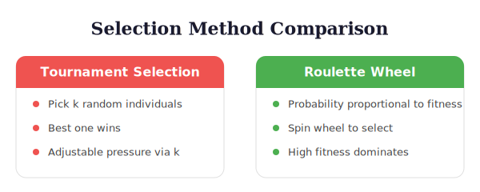

# Genetic Algorithm Components

> **Reading time:** ~6 min | **Module:** 1 — GA Fundamentals | **Prerequisites:** Module 0 foundations

## The GA Framework

Genetic algorithms simulate natural evolution to solve optimization problems:

```
┌─────────────────────────────────────────────────────────────┐
│                    Genetic Algorithm                         │
├─────────────────────────────────────────────────────────────┤
│                                                              │
│  1. INITIALIZATION                                           │
│     Generate random population                               │
│           │                                                  │
│           ▼                                                  │
│  2. EVALUATION ◄──────────────────────────┐                 │
│     Calculate fitness for each individual  │                 │
│           │                                │                 │
│           ▼                                │                 │
│  3. SELECTION                              │                 │
│     Choose parents based on fitness        │                 │
│           │                                │                 │
│           ▼                                │                 │
│  4. CROSSOVER                              │                 │
│     Combine parents to create offspring    │                 │
│           │                                │                 │
│           ▼                                │                 │
│  5. MUTATION                               │                 │
│     Introduce random changes               │                 │
│           │                                │                 │
│           ▼                                │                 │
│  6. REPLACEMENT ───────────────────────────┘                │
│     Form new generation                     (if not converged)│
│                                                              │
└─────────────────────────────────────────────────────────────┘
```




<div class="callout-insight">

💡 **Key Insight:** The six-step GA loop (initialize, evaluate, select, crossover, mutate, replace) is the same for every GA application. What changes between problems is the chromosome encoding and the fitness function -- everything else is reusable infrastructure.

</div>

## Chromosome Representation

### Binary Encoding for Feature Selection

Each feature is represented by a bit:

```
Chromosome:  [1, 0, 1, 1, 0, 0, 1, 0, 1, 1]
Features:    [f1,f2,f3,f4,f5,f6,f7,f8,f9,f10]

Selected:    {f1, f3, f4, f7, f9, f10}
Not Selected: {f2, f5, f6, f8}
```

### Implementation

<div class="code-window">
<div class="code-header">
<div class="dots"><span class="dot-red"></span><span class="dot-yellow"></span><span class="dot-green"></span></div>
<span class="filename">selected_features.py</span>
</div>

```python
import numpy as np
from dataclasses import dataclass
from typing import List, Tuple

@dataclass
class Individual:
    """Represents a solution in the GA."""
    chromosome: np.ndarray
    fitness: float = None

    @property
    def selected_features(self) -> List[int]:
        """Get indices of selected features."""
        return np.where(self.chromosome == 1)[0].tolist()

    @property
    def num_features(self) -> int:
        """Count of selected features."""
        return self.chromosome.sum()

    def copy(self) -> 'Individual':
        """Create a copy of this individual."""
        return Individual(
            chromosome=self.chromosome.copy(),
            fitness=self.fitness
        )

class Population:
    """Collection of individuals."""

    def __init__(self, individuals: List[Individual]):
        self.individuals = individuals

    @classmethod
    def random(cls, pop_size: int, n_features: int,
               init_prob: float = 0.5) -> 'Population':
        """Create random initial population."""
        individuals = []
        for _ in range(pop_size):
            chromosome = (np.random.random(n_features) < init_prob).astype(int)
            # Ensure at least one feature selected
            if chromosome.sum() == 0:
                chromosome[np.random.randint(n_features)] = 1
            individuals.append(Individual(chromosome=chromosome))
        return cls(individuals)

    @property
    def best(self) -> Individual:
        """Get best individual by fitness."""
        return min(self.individuals, key=lambda x: x.fitness or float('inf'))

    def average_fitness(self) -> float:
        """Calculate average fitness."""
        fitnesses = [ind.fitness for ind in self.individuals if ind.fitness is not None]
        return np.mean(fitnesses) if fitnesses else float('inf')
```
</div>


## Selection Operators

### Tournament Selection

```python
def tournament_selection(
    population: Population,
    tournament_size: int = 3
) -> Individual:
    """
    Select individual via tournament.
    Smaller fitness = better (minimization).
    """
    # Random tournament participants
    participants = np.random.choice(
        population.individuals,
        size=tournament_size,
        replace=False
    )

    # Return best (lowest fitness)
    return min(participants, key=lambda x: x.fitness)

def select_parents(
    population: Population,
    n_parents: int,
    tournament_size: int = 3
) -> List[Individual]:
    """Select multiple parents."""
    return [
        tournament_selection(population, tournament_size)
        for _ in range(n_parents)
    ]
```

### Roulette Wheel Selection

```python
def roulette_selection(population: Population) -> Individual:
    """
    Select individual proportional to fitness.
    For minimization, invert fitness.
    """
    fitnesses = np.array([ind.fitness for ind in population.individuals])

    # Invert for minimization (lower fitness = higher selection probability)
    max_fit = fitnesses.max()
    inverted = max_fit - fitnesses + 1e-6  # Avoid zero

    # Normalize to probabilities
    probs = inverted / inverted.sum()

    # Select
    idx = np.random.choice(len(population.individuals), p=probs)
    return population.individuals[idx]
```

### Rank Selection

```python
def rank_selection(population: Population) -> Individual:
    """
    Select based on rank rather than raw fitness.
    More stable than roulette wheel.
    """
    # Sort by fitness (ascending for minimization)
    sorted_pop = sorted(population.individuals, key=lambda x: x.fitness)

    # Assign ranks (best = highest rank)
    n = len(sorted_pop)
    ranks = np.arange(n, 0, -1)  # [n, n-1, ..., 1]

    # Select proportional to rank
    probs = ranks / ranks.sum()
    idx = np.random.choice(n, p=probs)

    return sorted_pop[idx]
```

## Crossover Operators

### Single-Point Crossover

```python
def single_point_crossover(
    parent1: Individual,
    parent2: Individual,
    crossover_prob: float = 0.8
) -> Tuple[Individual, Individual]:
    """
    Single-point crossover.
    """
    if np.random.random() > crossover_prob:
        return parent1.copy(), parent2.copy()

    n = len(parent1.chromosome)
    point = np.random.randint(1, n)

    child1_chrom = np.concatenate([
        parent1.chromosome[:point],
        parent2.chromosome[point:]
    ])
    child2_chrom = np.concatenate([
        parent2.chromosome[:point],
        parent1.chromosome[point:]
    ])

    return Individual(child1_chrom), Individual(child2_chrom)
```

### Uniform Crossover

```python
def uniform_crossover(
    parent1: Individual,
    parent2: Individual,
    crossover_prob: float = 0.8,
    swap_prob: float = 0.5
) -> Tuple[Individual, Individual]:
    """
    Uniform crossover - each gene swapped independently.
    Often better for feature selection.
    """
    if np.random.random() > crossover_prob:
        return parent1.copy(), parent2.copy()

    mask = np.random.random(len(parent1.chromosome)) < swap_prob

    child1_chrom = np.where(mask, parent2.chromosome, parent1.chromosome)
    child2_chrom = np.where(mask, parent1.chromosome, parent2.chromosome)

    return Individual(child1_chrom), Individual(child2_chrom)
```

### Two-Point Crossover

```python
def two_point_crossover(
    parent1: Individual,
    parent2: Individual,
    crossover_prob: float = 0.8
) -> Tuple[Individual, Individual]:
    """
    Two-point crossover.
    """
    if np.random.random() > crossover_prob:
        return parent1.copy(), parent2.copy()

    n = len(parent1.chromosome)
    point1, point2 = sorted(np.random.choice(n, 2, replace=False))

    child1_chrom = parent1.chromosome.copy()
    child1_chrom[point1:point2] = parent2.chromosome[point1:point2]

    child2_chrom = parent2.chromosome.copy()
    child2_chrom[point1:point2] = parent1.chromosome[point1:point2]

    return Individual(child1_chrom), Individual(child2_chrom)
```

## Mutation Operators

<div class="callout-warning">

⚠️ **Warning:** After any mutation or crossover operation, always validate that at least one feature is selected. An all-zeros chromosome is invalid and will crash most fitness functions.

</div>

### Bit-Flip Mutation

```python
def bit_flip_mutation(
    individual: Individual,
    mutation_prob: float = 0.01
) -> Individual:
    """
    Flip each bit with given probability.
    """
    mutant = individual.copy()

    for i in range(len(mutant.chromosome)):
        if np.random.random() < mutation_prob:
            mutant.chromosome[i] = 1 - mutant.chromosome[i]

    # Ensure at least one feature
    if mutant.chromosome.sum() == 0:
        mutant.chromosome[np.random.randint(len(mutant.chromosome))] = 1

    mutant.fitness = None  # Reset fitness
    return mutant
```

### Adaptive Mutation

```python
def adaptive_mutation(
    individual: Individual,
    generation: int,
    max_generations: int,
    min_rate: float = 0.001,
    max_rate: float = 0.1
) -> Individual:
    """
    Mutation rate decreases over generations.
    High exploration early, fine-tuning later.
    """
    # Linear decrease
    progress = generation / max_generations
    mutation_rate = max_rate - progress * (max_rate - min_rate)

    return bit_flip_mutation(individual, mutation_rate)
```

### Feature Count Preserving Mutation

```python
def swap_mutation(
    individual: Individual,
    n_swaps: int = 1
) -> Individual:
    """
    Swap selected/unselected features.
    Preserves feature count.
    """
    mutant = individual.copy()

    selected = np.where(mutant.chromosome == 1)[0]
    unselected = np.where(mutant.chromosome == 0)[0]

    for _ in range(n_swaps):
        if len(selected) > 0 and len(unselected) > 0:
            # Turn off one selected feature
            turn_off = np.random.choice(selected)
            mutant.chromosome[turn_off] = 0
            selected = np.delete(selected, np.where(selected == turn_off))

            # Turn on one unselected feature
            turn_on = np.random.choice(unselected)
            mutant.chromosome[turn_on] = 1
            unselected = np.delete(unselected, np.where(unselected == turn_on))

    mutant.fitness = None
    return mutant
```

## Replacement Strategies

### Generational Replacement

```python
def generational_replacement(
    old_population: Population,
    offspring: List[Individual],
    elitism: int = 1
) -> Population:
    """
    Replace entire population with offspring.
    Keep best individuals from old population (elitism).
    """
    # Sort old population by fitness
    old_sorted = sorted(
        old_population.individuals,
        key=lambda x: x.fitness
    )

    # Keep elite individuals
    elite = [ind.copy() for ind in old_sorted[:elitism]]

    # Fill rest with offspring
    new_pop = elite + offspring[:len(old_population.individuals) - elitism]

    return Population(new_pop)
```

### Steady-State Replacement

```python
def steady_state_replacement(
    population: Population,
    offspring: List[Individual]
) -> Population:
    """
    Replace worst individuals with offspring.
    More gradual population change.
    """
    # Combine population and offspring
    combined = population.individuals + offspring

    # Sort by fitness
    combined_sorted = sorted(combined, key=lambda x: x.fitness)

    # Keep best individuals
    new_pop = combined_sorted[:len(population.individuals)]

    return Population(new_pop)
```

## Key Takeaways

<div class="callout-key">
🔑 **Key Points**

1. **Binary encoding** is natural for feature selection - each bit represents a feature

2. **Tournament selection** is robust and tunable via tournament size

3. **Uniform crossover** often works best for feature selection problems

4. **Mutation rate** should be low (0.01-0.1) to maintain good solutions

5. **Elitism** preserves best solutions across generations
</div>
---

**Next:** [Companion Slides](./01_ga_components_slides.md) | [Notebook](../notebooks/01_basic_ga.ipynb)
