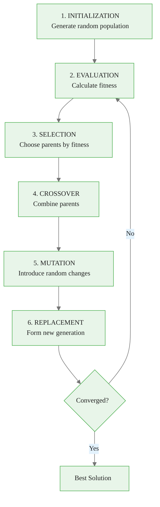
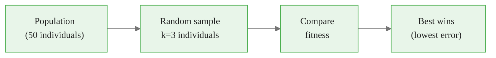
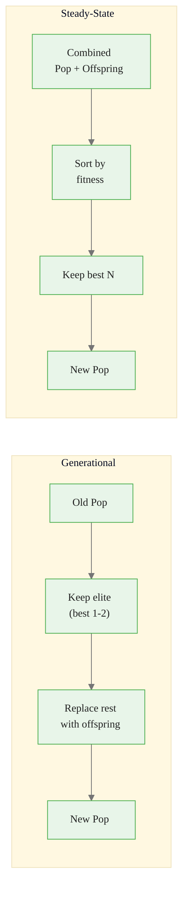
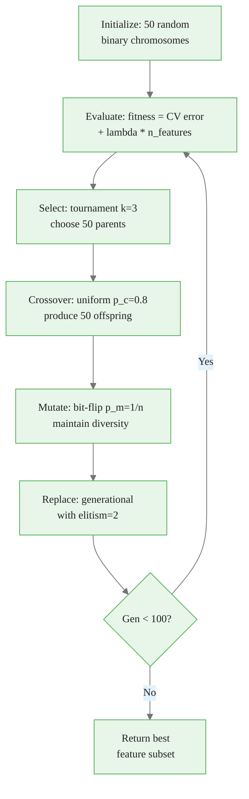

<!-- _class: lead -->
<!-- Speaker notes: This deck covers the complete GA framework for feature selection. Walk through all six components and how they fit together. Point learners to the specialized decks (02_selection, 03_genetic_operators) for deep dives on individual components. -->

# Genetic Algorithm Components

## Module 01 — GA Fundamentals

The complete framework: initialization, evaluation, selection, crossover, mutation, replacement

---

<!-- Speaker notes: Use this flowchart to establish the cyclical nature of GAs. Each step feeds into the next, and the cycle repeats until convergence. Emphasize that this is an iterative process -- typically 50-200 generations. -->

## The GA Framework



---

<!-- Speaker notes: Binary encoding is the most natural representation for feature selection. Each bit is a yes/no decision for one feature. The search space is 2^p where p is the number of features. -->

## Chromosome Representation

Binary encoding for feature selection -- each bit represents a feature:

```
Chromosome:  [1, 0, 1, 1, 0, 0, 1, 0, 1, 1]
Features:    [f1,f2,f3,f4,f5,f6,f7,f8,f9,f10]

Selected:    {f1, f3, f4, f7, f9, f10}    (6 features)
Not Selected: {f2, f5, f6, f8}             (4 features)
```

> Each possible binary vector represents a different feature subset.

---

<!-- Speaker notes: The Individual dataclass wraps a chromosome with its fitness. The Population class factory method ensures at least one feature is selected (no empty chromosomes). The init_prob parameter controls sparsity -- 0.5 means roughly half features selected initially. -->

## Individual & Population

```python
@dataclass
class Individual:
    chromosome: np.ndarray
    fitness: float = None

    @property
    def selected_features(self) -> List[int]:
        return np.where(self.chromosome == 1)[0].tolist()

    @property
    def num_features(self) -> int:
        return self.chromosome.sum()
```

```python
class Population:
    @classmethod
    def random(cls, pop_size, n_features, init_prob=0.5):
        individuals = []
        for _ in range(pop_size):
            chromosome = (np.random.random(n_features) < init_prob).astype(int)
            if chromosome.sum() == 0:
                chromosome[np.random.randint(n_features)] = 1
            individuals.append(Individual(chromosome=chromosome))
        return cls(individuals)
```

---

<!-- _class: lead -->
<!-- Speaker notes: Selection determines which individuals reproduce. The key design choice is selection pressure: too high leads to premature convergence, too low wastes evaluations. See 02_selection_slides for the full comparison of all methods. -->

# Selection Operators

Choosing who reproduces

---

<!-- Speaker notes: Tournament selection is the default choice. Pick k random individuals, best wins. The Mermaid diagram shows the flow. Larger k means stronger pressure. This is a preview -- the full analysis with roulette, rank, and SUS is in 02_selection_slides. -->

## Tournament Selection



```python
def tournament_selection(pop, k=3):
    """Select best from random tournament."""
    participants = np.random.choice(
        pop.individuals, size=k, replace=False
    )
    return min(participants, key=lambda x: x.fitness)
```

> Larger tournament = stronger pressure. See **02_selection_slides** for full comparison of all methods.

---

<!-- Speaker notes: Roulette wheel selection assigns probability proportional to fitness. For minimization, we invert fitness so lower error gets higher probability. The epsilon (1e-6) prevents division by zero. Main weakness: one super-fit individual can dominate the entire selection. -->

## Roulette Wheel Selection

```python
def roulette_selection(population):
    """Selection proportional to fitness (inverted for minimization)."""
    fitnesses = np.array([ind.fitness for ind in population.individuals])
    max_fit = fitnesses.max()
    inverted = max_fit - fitnesses + 1e-6  # Lower fitness -> higher prob
    probs = inverted / inverted.sum()
    idx = np.random.choice(len(population.individuals), p=probs)
    return population.individuals[idx]
```

$$P(i) = \frac{f_{max} - f_i + \epsilon}{\sum_j (f_{max} - f_j + \epsilon)}$$

---

<!-- Speaker notes: Rank selection solves roulette wheel's scaling sensitivity by using rank position instead of raw fitness values. This prevents a single dominant individual from taking over. The tradeoff: it ignores the actual magnitude of fitness differences between individuals. -->

## Rank Selection

```python
def rank_selection(population):
    """Selection based on rank, not raw fitness."""
    sorted_pop = sorted(population.individuals, key=lambda x: x.fitness)
    n = len(sorted_pop)
    ranks = np.arange(n, 0, -1)  # Best = highest rank
    probs = ranks / ranks.sum()
    idx = np.random.choice(n, p=probs)
    return sorted_pop[idx]
```

> Robust to fitness outliers -- prevents super-fit individuals from dominating.

---

<!-- _class: lead -->
<!-- Speaker notes: Now we move to crossover -- the main mechanism for combining good solutions. Crossover is what makes GAs different from random search: it exploits structure in good solutions. -->

# Crossover Operators

Combining parent genetic material

---

<!-- Speaker notes: Show all three crossover types visually. Single-point preserves blocks (good for ordered features). Two-point swaps a segment. Uniform has no positional bias -- each gene independently from either parent. For feature selection, uniform is recommended because feature ordering is arbitrary. -->

## Three Crossover Types

<div class="compare">
<div>

**Single-Point:**
```
P1: [1 1 1 1 1 | 0 0 0]
P2: [0 0 0 0 0 | 1 1 1]
              cut
C1: [1 1 1 1 1 | 1 1 1]
C2: [0 0 0 0 0 | 0 0 0]
```

**Two-Point:**
```
P1: [1 1 | 1 1 1 | 0 0 0]
P2: [0 0 | 0 0 0 | 1 1 1]
         ^       ^
C1: [1 1 | 0 0 0 | 0 0 0]
C2: [0 0 | 1 1 1 | 1 1 1]
```

</div>
<div>

**Uniform (best for FS):**
```
P1:   [1 1 1 1 1 0 0 0]
P2:   [0 0 0 0 0 1 1 1]
Mask: [0 1 0 1 1 0 1 0]
C1:   [1 0 1 0 0 0 1 0]
C2:   [0 1 0 1 1 1 0 1]
```

Each gene randomly from either parent.

</div>
</div>

---

<!-- Speaker notes: This is the recommended crossover implementation for feature selection. The crossover_prob parameter controls whether crossover happens at all (80% of the time). The swap_prob controls per-gene swap probability (50% by default). NumPy's np.where makes this very efficient. -->

## Crossover Implementation

```python
def uniform_crossover(parent1, parent2,
                      crossover_prob=0.8, swap_prob=0.5):
    """Best crossover for feature selection."""
    if np.random.random() > crossover_prob:
        return parent1.copy(), parent2.copy()

    mask = np.random.random(len(parent1.chromosome)) < swap_prob
    child1_chrom = np.where(mask, parent2.chromosome, parent1.chromosome)
    child2_chrom = np.where(mask, parent1.chromosome, parent2.chromosome)

    return Individual(child1_chrom), Individual(child2_chrom)
```

> Applied with probability $p_c \in [0.6, 0.95]$, typically 0.8

---

<!-- _class: lead -->
<!-- Speaker notes: Mutation is the source of new genetic material. Without mutation, the GA can only recombine what already exists in the initial population. It prevents premature convergence but must be kept low enough to preserve good solutions. -->

# Mutation Operators

Maintaining diversity

---

<!-- Speaker notes: Bit-flip is the standard mutation for binary chromosomes. The rate of 1/n ensures roughly one bit flips per individual, which is a good balance. The constraint enforcement at the end prevents empty solutions -- a critical safety check for feature selection. -->

## Bit-Flip Mutation

```python
def bit_flip_mutation(individual, mutation_prob=0.01):
    """Flip each bit with given probability."""
    mutant = individual.copy()
    for i in range(len(mutant.chromosome)):
        if np.random.random() < mutation_prob:
            mutant.chromosome[i] = 1 - mutant.chromosome[i]

    # Ensure at least one feature
    if mutant.chromosome.sum() == 0:
        mutant.chromosome[np.random.randint(len(mutant.chromosome))] = 1
    mutant.fitness = None
    return mutant
```

> Rule of thumb: $p_m = 1/n$ (one bit flip per individual on average)

---

<!-- Speaker notes: Two alternative mutation strategies. Adaptive mutation starts with high rate (exploration) and decreases linearly to low rate (exploitation). Swap mutation is special: it maintains the same feature count by turning one off and another on. Use swap when you want to explore different combinations of the same number of features. -->

## Adaptive & Swap Mutation

<div class="compare">
<div>

**Adaptive** -- decreases over time:

```python
def adaptive_mutation(individual,
                      generation,
                      max_generations,
                      min_rate=0.001,
                      max_rate=0.1):
    progress = generation / max_generations
    rate = max_rate - progress * \
           (max_rate - min_rate)
    return bit_flip_mutation(
        individual, rate)
```

</div>
<div>

**Swap** -- preserves feature count:

```python
def swap_mutation(individual,
                  n_swaps=1):
    mutant = individual.copy()
    selected = np.where(
        mutant.chromosome == 1)[0]
    unselected = np.where(
        mutant.chromosome == 0)[0]
    for _ in range(n_swaps):
        if len(selected) > 0 and \
           len(unselected) > 0:
            off = np.random.choice(selected)
            on = np.random.choice(unselected)
            mutant.chromosome[off] = 0
            mutant.chromosome[on] = 1
    return mutant
```

</div>
</div>

---

<!-- _class: lead -->
<!-- Speaker notes: Replacement determines how the new generation is formed from the old population and offspring. The two main strategies are generational (replace most of the population) and steady-state (replace only a few). -->

# Replacement Strategies

Forming the next generation

---

<!-- Speaker notes: Generational replacement replaces the entire population except for elite individuals. Steady-state combines parents and offspring, keeping the best N. Generational is more exploratory; steady-state is more conservative. The Mermaid diagram contrasts both flows. -->

## Generational vs. Steady-State



---

<!-- Speaker notes: Both implementations are straightforward. Generational keeps the best 1-2 individuals (elitism) and fills the rest with offspring. Steady-state merges all individuals and keeps the top N. Elitism is critical -- without it, the best solution can be lost. -->

## Replacement Implementation

```python
def generational_replacement(old_population, offspring, elitism=1):
    """Replace population, keeping best (elitism)."""
    old_sorted = sorted(old_population.individuals,
                        key=lambda x: x.fitness)
    elite = [ind.copy() for ind in old_sorted[:elitism]]
    new_pop = elite + offspring[:len(old_population.individuals) - elitism]
    return Population(new_pop)

def steady_state_replacement(population, offspring):
    """Replace worst with offspring if better."""
    combined = population.individuals + offspring
    combined_sorted = sorted(combined, key=lambda x: x.fitness)
    new_pop = combined_sorted[:len(population.individuals)]
    return Population(new_pop)
```

---

<!-- Speaker notes: This diagram shows all the components together with typical parameter values for feature selection. Walk through the cycle: 50 chromosomes initialized, evaluated with CV error + complexity penalty, parents selected by tournament, crossed over with p_c=0.8, mutated with p_m=1/n, and replaced with elitism=2. Repeat for 100 generations. -->

## Complete GA Cycle



---

<!-- Speaker notes: Summarize the key recommendations. Binary encoding is natural for feature selection. Tournament with k=3 is robust and easy to tune. Uniform crossover avoids positional bias. Bit-flip mutation at rate 1/n maintains good solutions. Generational replacement with elitism prevents losing the best solution. -->

## Key Takeaways

| Component | Recommendation |
|-----------|---------------|
| **Encoding** | Binary -- natural for feature selection |
| **Selection** | Tournament (k=3) -- robust and tunable |
| **Crossover** | Uniform (p_c=0.8) -- best for unordered features |
| **Mutation** | Bit-flip (p_m=1/n) -- maintains good solutions |
| **Replacement** | Generational with elitism (1-2) |

---

<!-- Speaker notes: This ASCII summary is a quick reference card. It shows the end-to-end pipeline from chromosome to best feature subset. Encourage learners to keep this as a reference while building their own GA implementations. -->

## Visual Summary

```
GA COMPONENTS FOR FEATURE SELECTION
====================================

   [1,0,1,1,0,0,1,0]  Chromosome (binary)
         |
    Fitness = f(selected features, model, data)
         |
    Tournament (k=3) -> Select parents
         |
    Uniform crossover (p_c=0.8)
         |
    Bit-flip mutation (p_m=1/n)
         |
    Elitism keeps best 1-2 solutions
         |
    REPEAT for 50-200 generations
         |
    BEST FEATURE SUBSET FOUND
```
