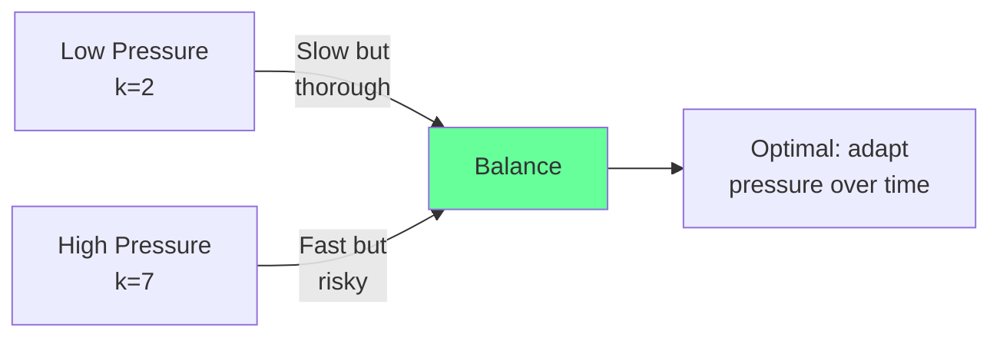
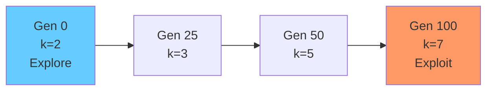
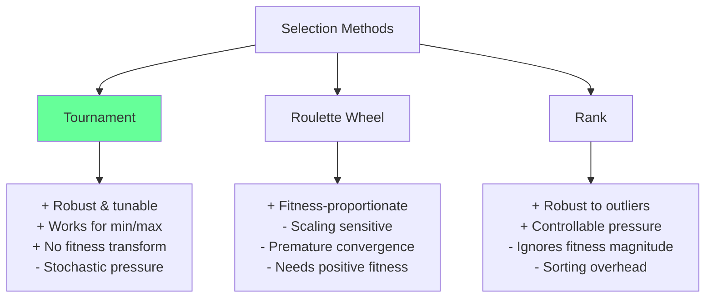
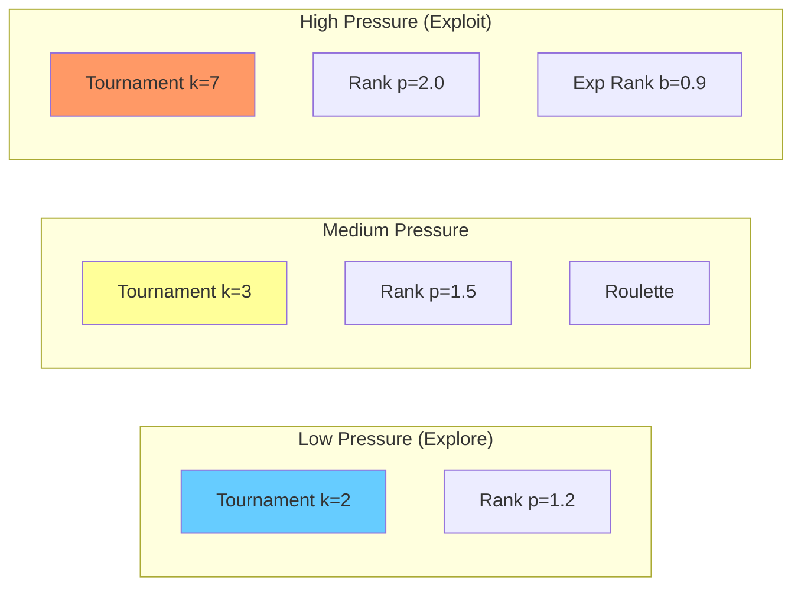

<!-- _class: lead -->
<!-- Speaker notes: This is the canonical selection operators deck. It covers tournament, roulette wheel, rank, and SUS in full detail. Other decks reference this one for the complete comparison. -->

# Selection Operators for Genetic Algorithms

## Module 01 — GA Fundamentals

Balancing exploitation of good solutions with exploration of the search space

---

<!-- Speaker notes: Selection pressure is the most important concept in this deck. It controls the exploitation-exploration tradeoff. High pressure means the best individuals dominate reproduction, leading to fast convergence but risk of premature convergence. Low pressure maintains diversity but converges slowly. -->

## Selection Pressure

Selection pressure controls the trade-off:

- **High pressure** (large tournaments) = fast convergence, risk premature convergence
- **Low pressure** (small tournaments) = maintain diversity, may converge slowly

$$s = \frac{E[\text{offspring of best}]}{E[\text{offspring per individual}]} = N \cdot P(\text{best})$$



---

<!-- Speaker notes: These formulas are the mathematical foundation. The key difference: roulette uses raw fitness values (sensitive to scaling), rank uses position (robust), and tournament uses local comparison (simplest to implement). Point out that tournament does not need to compute probabilities for the whole population. -->

## Selection Probability Formulas

**Roulette Wheel:**
$$P(i) = \frac{w(f_i)}{\sum_{j=1}^{N} w(f_j)}$$

**Rank-Based:**
$$P(i) = \frac{r_i}{\sum_{j=1}^{N} r_j}$$

**Tournament** (deterministic, size $k$):
$$P_{\text{win}}(i) = \begin{cases} 1 & \text{if } f_i = \min_{j \in T} f_j \\ 0 & \text{otherwise} \end{cases}$$

---

<!-- Speaker notes: Use these analogies to build intuition. The sports playoff analogy for tournament is particularly effective -- ask the audience what happens when you make playoffs larger (more teams competing). Roulette's lottery analogy shows why one dominant individual can take over. The medal system for rank shows how it normalizes differences. -->

## Intuitive Explanation

**Tournament** = Sports playoff
- Pick $k$ random individuals, best advances
- Larger $k$ = stronger pressure

**Roulette** = Lottery with weighted tickets
- Better fitness = more tickets
- Problem: one dominant individual can take over

**Rank** = Medal system
- 1st gets $N$ points, 2nd gets $N-1$, etc.
- Ignores actual performance gap -- prevents domination

---

<!-- _class: lead -->
<!-- Speaker notes: Tournament selection is the recommended default. It is simple, robust, works for both minimization and maximization, and does not require fitness transformation. The tournament size k is the only tuning parameter. -->

# Tournament Selection

The default choice for GAs

---

<!-- Speaker notes: Walk through the implementation line by line. The replace=False is critical -- without it, the same individual can appear multiple times in the tournament, weakening selection pressure. The minimize flag allows reuse for both minimization (error) and maximization (accuracy) problems. -->

## Tournament Selection Implementation

```python
def tournament_selection(population, tournament_size=3,
                         minimize=True):
    """Select best from random tournament."""
    if tournament_size > len(population):
        tournament_size = len(population)

    tournament = np.random.choice(
        population, size=tournament_size, replace=False
    )

    if minimize:
        winner = min(tournament, key=lambda ind: ind.fitness)
    else:
        winner = max(tournament, key=lambda ind: ind.fitness)

    return winner
```

> **Typical values**: $k \in \{2, 3, 5, 7\}$. Selection pressure $\approx k$ for large populations.

---

<!-- Speaker notes: Adaptive tournament size is a powerful technique. Start with small tournaments (k=2) for broad exploration in early generations, then increase to large tournaments (k=7) for exploitation as the population converges. The linear interpolation based on progress ratio is the simplest schedule. -->

## Adaptive Tournament Size

```python
def adaptive_tournament_selection(population, generation,
                                   max_generations,
                                   min_size=2, max_size=7):
    """Start with small tournaments (explore), increase (exploit)."""
    progress = generation / max_generations
    size = int(min_size + progress * (max_size - min_size))
    return tournament_selection(population, tournament_size=size)
```



---

<!-- _class: lead -->
<!-- Speaker notes: Roulette wheel selection is the classic fitness-proportionate method. It has theoretical appeal but practical issues with fitness scaling. One super-fit individual can dominate, and negative fitnesses require transformation. -->

# Roulette Wheel Selection

Fitness-proportionate selection

---

<!-- Speaker notes: The key implementation detail is the fitness transformation for minimization. We invert fitnesses so that lower error gets higher selection probability. The epsilon (1e-10) prevents division by zero when all fitnesses are equal. Note the sensitivity issue: if one individual has fitness 0.01 and others have 1.0, the best individual gets ~99% selection probability. -->

## Roulette Wheel Implementation

```python
def roulette_wheel_selection(population, minimize=True):
    fitnesses = np.array([ind.fitness for ind in population])

    if minimize:
        max_fitness = fitnesses.max()
        transformed = max_fitness - fitnesses + 1e-10
    else:
        min_fitness = fitnesses.min()
        transformed = fitnesses - min(0, min_fitness) + 1e-10

    probabilities = transformed / transformed.sum()
    idx = np.random.choice(len(population), p=probabilities)
    return population[idx]
```

> **Key issue**: sensitive to fitness scaling. One super-fit individual can dominate.

---

<!-- Speaker notes: SUS is a significant improvement over repeated roulette wheel spins. A single spin with evenly-spaced pointers ensures that individuals get selected proportional to their fitness without the variance of repeated independent draws. It is particularly important when selecting many parents at once. The cumulative sum and pointer math are the core mechanism. -->

## Stochastic Universal Sampling (SUS)

Better than repeated roulette -- single spin with evenly-spaced pointers:

```python
def stochastic_universal_sampling(population, n_select, minimize=True):
    fitnesses = np.array([ind.fitness for ind in population])
    if minimize:
        transformed = fitnesses.max() - fitnesses + 1e-10
    else:
        transformed = fitnesses - min(0, fitnesses.min()) + 1e-10

    cumulative = np.cumsum(transformed)
    total = cumulative[-1]

    pointer_distance = total / n_select
    start = np.random.uniform(0, pointer_distance)
    pointers = [start + i * pointer_distance for i in range(n_select)]

    selected = []
    for pointer in pointers:
        idx = min(np.searchsorted(cumulative, pointer), len(population) - 1)
        selected.append(population[idx])
    return selected
```

---

<!-- _class: lead -->
<!-- Speaker notes: Rank selection addresses the main weakness of roulette wheel: sensitivity to fitness scaling. By using rank position instead of raw fitness values, it prevents any single individual from dominating selection regardless of how much better its fitness is. -->

# Rank Selection

Robust to fitness scaling issues

---

<!-- Speaker notes: Linear rank selection assigns probabilities based on sorted position. The selection_pressure parameter in [1.0, 2.0] controls the spread: at 2.0, the best individual gets probability 2/N and the worst gets 0. At 1.0, all individuals have equal probability 1/N (no selection pressure). The formula ensures probabilities sum to 1. -->

## Linear Rank Selection

```python
def rank_selection(population, minimize=True, selection_pressure=2.0):
    """Linear ranking: P(rank r) proportional to rank weight."""
    if minimize:
        sorted_pop = sorted(population, key=lambda ind: ind.fitness)
    else:
        sorted_pop = sorted(population, key=lambda ind: ind.fitness,
                            reverse=True)
    N = len(population)

    probabilities = np.zeros(N)
    for i in range(N):
        rank = i + 1
        probabilities[i] = (1/N) * (
            selection_pressure - 2*(selection_pressure-1)*(rank-1)/(N-1)
        )
    probabilities = probabilities / probabilities.sum()
    idx = np.random.choice(N, p=probabilities)
    return sorted_pop[idx]
```

> `selection_pressure` in $[1.0, 2.0]$: at 2.0, best gets $2/N$ probability, worst gets 0.

---

<!-- Speaker notes: Exponential rank selection provides stronger selection pressure than linear rank. The base parameter controls the decay rate: lower base means stronger pressure (the best individual gets much more probability than the rest). Typical range is [0.9, 0.99]. This is useful when you want aggressive exploitation. -->

## Exponential Rank Selection

```python
def exponential_rank_selection(population, minimize=True, base=0.95):
    """Stronger pressure: P(rank r) proportional to base^(r-1)."""
    sorted_pop = sorted(population,
                        key=lambda ind: ind.fitness,
                        reverse=not minimize)
    N = len(population)
    weights = base ** np.arange(N)
    probabilities = weights / weights.sum()
    idx = np.random.choice(N, p=probabilities)
    return sorted_pop[idx]
```

> Lower `base` = higher pressure. Typical range: $[0.9, 0.99]$.

---

<!-- Speaker notes: This Mermaid comparison summarizes the strengths and weaknesses of each method. The green highlight on Tournament indicates it is the recommended default. Roulette is fitness-proportionate but fragile. Rank is robust but loses magnitude information. Tournament is the best general-purpose choice. -->

## Method Comparison



---

<!-- _class: lead -->
<!-- Speaker notes: These pitfalls are the most common implementation mistakes with selection operators. Understanding them will prevent hours of debugging. -->

# Common Pitfalls

---

<!-- Speaker notes: The most dangerous pitfall is forgetting to invert fitness for minimization. Without inversion, roulette wheel gives HIGHER selection probability to WORSE individuals (higher error). The fix is simple: subtract from max fitness. Always test that your best individual actually gets selected most often. -->

## Pitfall 1: Wrong Fitness Transform

```python
# BAD -- higher fitness gets MORE selection (wrong for minimization!)
def bad_roulette(population):
    fitnesses = np.array([ind.fitness for ind in population])
    probs = fitnesses / fitnesses.sum()
    return np.random.choice(population, p=probs)

# GOOD -- invert for minimization
def good_roulette(population):
    fitnesses = np.array([ind.fitness for ind in population])
    max_fit = fitnesses.max()
    inverted = max_fit - fitnesses + 1e-10
    probs = inverted / inverted.sum()
    return np.random.choice(population, p=probs)
```

---

<!-- Speaker notes: Tournament with replacement allows the same individual to appear multiple times, which weakens selection pressure and can cause the tournament to always select the same dominant individual. Premature convergence from excessive pressure is equally dangerous -- start with small tournaments and increase over time. -->

## Pitfall 2: Tournament with Replacement

```python
# BAD -- same individual can appear twice in tournament
tournament = [population[np.random.randint(len(population))]
              for _ in range(k)]

# GOOD -- sample without replacement
tournament = np.random.choice(population, size=k, replace=False)
```

## Pitfall 3: Premature Convergence

```python
# BAD -- tournament too large from start
winner = tournament_selection(population, tournament_size=10)

# GOOD -- start small, increase over time
def adaptive_pressure(population, gen, max_gen):
    k = int(2 + 5 * (gen / max_gen))
    return tournament_selection(population, tournament_size=k)
```

---

<!-- Speaker notes: This spectrum diagram is a practical reference for tuning selection pressure. Low pressure methods like tournament k=2 are good for early exploration. Medium pressure like tournament k=3 is the standard default. High pressure like tournament k=7 or exponential rank is for late-stage exploitation. Encourage learners to match pressure to the search phase. -->

## Selection Pressure Across Methods



---

<!-- Speaker notes: Wrap up with connections to other topics. Emphasize the three key literature insights: tournament is most robust, pressure should adapt, and SUS beats repeated roulette. These findings are well-established across decades of GA research. -->

## Connections

<div class="columns">
<div>

**Prerequisites:**
- Basic probability/statistics
- Population-based optimization
- Fitness function concepts

</div>
<div>

**Leads To:**
- Crossover operators
- Mutation operators
- Replacement strategies
- Multi-objective (Pareto) selection

</div>
</div>

**Key insights from literature:**
1. Tournament selection is most robust across fitness landscapes
2. Selection pressure should adapt over the run
3. SUS is superior to repeated roulette for proportionate selection

---

<!-- Speaker notes: This ASCII summary is a quick reference card. The key recommendation at the bottom is the main takeaway: start with tournament k=2-3, increase over time, use rank if you have fitness outliers. -->

## Visual Summary

```
SELECTION OPERATORS
====================

Tournament (DEFAULT):
  Random k -> Best wins -> Larger k = more pressure
  Pros: Simple, robust, no fitness transform needed

Roulette Wheel:
  P(i) = fitness(i) / total_fitness
  Pros: Proportional  |  Cons: Scaling sensitive

Rank:
  P(i) = rank(i) / total_ranks
  Pros: Robust to outliers  |  Cons: Ignores magnitudes

RECOMMENDATION:
  Start with Tournament k=2-3
  Increase to k=5-7 as generations progress
  Use Rank if fitness has outliers
```
