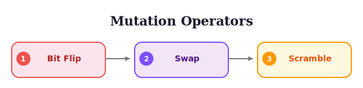

# Genetic Operators: Crossover and Mutation

> **Reading time:** ~14 min | **Module:** 1 — GA Fundamentals | **Prerequisites:** 02 Selection Operators

## In Brief

Crossover combines genetic material from two parents to create offspring, enabling the exchange of beneficial feature combinations. Mutation introduces random changes to maintain diversity and explore new regions of the search space. Together, these operators balance exploitation (crossover) with exploration (mutation).

<div class="callout-insight">

The effectiveness of genetic operators depends on the problem structure. For feature selection, uniform crossover often outperforms single-point crossover because feature interactions are typically non-positional. Mutation rate should be inversely proportional to chromosome length to maintain approximately one change per individual.

</div>

<div class="callout-key">

<strong>Key Concept:</strong> Crossover and mutation serve fundamentally different purposes. Crossover *exploits* existing knowledge by combining proven feature groups from different parents. Mutation *explores* new territory by introducing features no one has tried. A GA without crossover is a random search with selection; a GA without mutation converges prematurely and stalls. The balance between them -- controlled by crossover probability and mutation rate -- is the most important parameter decision you will make.

</div>




## Formal Definition

### Crossover

Given parents $\mathbf{p}_1, \mathbf{p}_2 \in \{0,1\}^n$, crossover produces offspring $\mathbf{o}_1, \mathbf{o}_2$ by recombining genetic material:

**Single-Point Crossover** at position $k$:
$$\mathbf{o}_1 = [\mathbf{p}_1[1:k], \mathbf{p}_2[k+1:n]]$$
$$\mathbf{o}_2 = [\mathbf{p}_2[1:k], \mathbf{p}_1[k+1:n]]$$

**Uniform Crossover** with swap probability $p_{swap}$:
$$o_{1,i} = \begin{cases} p_{2,i} & \text{with probability } p_{swap} \\ p_{1,i} & \text{otherwise} \end{cases}$$

**Applied with probability** $p_c \in [0.6, 0.95]$ (typically 0.8)

### Mutation

Given individual $\mathbf{x} \in \{0,1\}^n$, mutation produces $\mathbf{x}'$:

**Bit-Flip Mutation** at rate $p_m$:
$$x'_i = \begin{cases} 1 - x_i & \text{with probability } p_m \\ x_i & \text{otherwise} \end{cases}$$

**Typical mutation rate**: $p_m = 1/n$ (one bit flip per individual on average)

### The Building Block Hypothesis

The Building Block Hypothesis is the theoretical foundation for *why crossover works* and why GAs are more than random search with selection.

**The core idea:** Crossover succeeds by combining **building blocks** -- small groups of genes (features) that work well together. Over generations, selection increases the frequency of good building blocks in the population, and crossover assembles them into complete solutions.

A **schema** $H$ is a template with fixed and wildcard positions: $H = [1, *, 0, *, *]$ matches any chromosome with a 1 in position 1 and a 0 in position 3, regardless of positions 2, 4, and 5.

**Building blocks in action -- a feature selection example:**

Consider a 10-feature commodity forecasting problem. Two parents have each discovered a useful feature cluster:

```
Parent A:  [1, 1, 0, 0, 0, 0, 0, 1, 1, 0]   Fitness: 0.35
           ^^^^                 ^^^^
           Building Block 1:    Building Block 2:
           {Price_Lag, RSI}     {VIX, Gold}
           (captures momentum)  (captures risk sentiment)

Parent B:  [0, 0, 1, 1, 1, 0, 0, 0, 0, 0]   Fitness: 0.38
                 ^^^^^^^
                 Building Block 3:
                 {MACD, Bollinger, ATR}
                 (captures volatility regime)
```

Parent A discovered that momentum features (Price_Lag + RSI) and risk sentiment features (VIX + Gold) work well together. Parent B discovered that volatility regime features (MACD + Bollinger + ATR) are predictive. Neither parent has both insights.

After uniform crossover:

```
Offspring: [1, 1, 1, 1, 1, 0, 0, 1, 1, 0]   Fitness: 0.28 (BETTER)
            ^^^^  ^^^^^^^       ^^^^
            Block 1 + Block 3 + Block 2 combined!
```

The offspring inherits all three building blocks and outperforms both parents. This is the power of crossover: it did not discover any new features -- it assembled existing discoveries into a superior combination. No single-step mutation could have achieved this.

<div class="callout-insight">

<strong>Why this matters for feature selection:</strong> Building blocks in feature selection are groups of features that interact beneficially. Momentum indicators work together. Volatility measures reinforce each other. Cross-commodity spreads capture related signals. Crossover's ability to combine these groups is what makes GAs outperform single-solution methods like hill climbing.

</div>

**When building blocks break:** Single-point crossover can disrupt building blocks by cutting through them. If the crossover point falls between positions 0 and 1 (splitting Block 1), the offspring inherits only half of the momentum signal. Uniform crossover is more robust because each position is independently inherited, so building blocks are not disrupted by a single cut point -- though they can still be partially inherited by chance.

## Intuitive Explanation

**Crossover** is like combining recipes from two chefs. If Chef A makes great appetizers and Chef B makes great desserts, combining their recipes might yield a meal that's great overall. In feature selection, one parent might have good features for capturing linear trends, another for capturing seasonality—their child might capture both.

**Mutation** is like random experimentation. Occasionally change an ingredient to try something new. Without mutation, you can only recombine existing ingredients—you might miss discovering that cilantro (a feature not in any parent) makes the dish perfect.

**Crossover vs. Mutation trade-off:**
- High crossover, low mutation: Fast convergence, may get stuck (all recipes become similar)
- Low crossover, high mutation: Slow convergence, maintains diversity (random search)
- Balanced (typical): Crossover exploits known good solutions, mutation explores new ones

## Code Implementation

### Crossover Operators


<div class="code-window">
<div class="code-header">
<div class="dots"><span class="dot-red"></span><span class="dot-yellow"></span><span class="dot-green"></span></div>
<span class="filename">copy.py</span>

```python
import numpy as np
from typing import Tuple, Protocol, Optional, Callable
from dataclasses import dataclass
from enum import Enum

class Individual(Protocol):
    """Protocol for binary-encoded individual."""
    chromosome: np.ndarray
    fitness: Optional[float]
    def copy(self) -> 'Individual': ...


@dataclass
class BinaryIndividual:
    """Concrete implementation for examples."""
    chromosome: np.ndarray
    fitness: Optional[float] = None

    def copy(self) -> 'BinaryIndividual':
        return BinaryIndividual(
            chromosome=self.chromosome.copy(),
            fitness=self.fitness
        )


class CrossoverType(Enum):
    """Supported crossover types."""
    SINGLE_POINT = "single_point"
    TWO_POINT = "two_point"
    UNIFORM = "uniform"
    SCATTERED = "scattered"


def single_point_crossover(
    parent1: Individual,
    parent2: Individual,
    crossover_prob: float = 0.8
) -> Tuple[Individual, Individual]:
    """
    Single-point crossover.

    Parameters
    ----------
    parent1, parent2 : Individual
        Parent individuals
    crossover_prob : float
        Probability of performing crossover (vs. returning clones)

    Returns
    -------
    Tuple[Individual, Individual]
        Two offspring

    Examples
    --------
    >>> p1 = BinaryIndividual(np.array([1,1,1,1,1]))
    >>> p2 = BinaryIndividual(np.array([0,0,0,0,0]))
    >>> # Crossover at position 2: [1,1|1,1,1] × [0,0|0,0,0]
    >>> # Offspring: [1,1,0,0,0] and [0,0,1,1,1]
    """
    # Apply crossover with probability
    if np.random.random() > crossover_prob:
        return parent1.copy(), parent2.copy()

    n = len(parent1.chromosome)

    # Choose random crossover point (not at extremes)
    point = np.random.randint(1, n)

    # Create offspring
    child1_chrom = np.concatenate([
        parent1.chromosome[:point],
        parent2.chromosome[point:]
    ])
    child2_chrom = np.concatenate([
        parent2.chromosome[:point],
        parent1.chromosome[point:]
    ])

    return (
        BinaryIndividual(chromosome=child1_chrom),
        BinaryIndividual(chromosome=child2_chrom)
    )


def two_point_crossover(
    parent1: Individual,
    parent2: Individual,
    crossover_prob: float = 0.8
) -> Tuple[Individual, Individual]:
    """
    Two-point crossover.

    Swaps the segment between two random points.

    Examples
    --------
    >>> # [1,1|1,1|1] × [0,0|0,0|0]
    >>> # Swap middle segment
    >>> # Offspring: [1,1,0,0,1] and [0,0,1,1,0]
    """
    if np.random.random() > crossover_prob:
        return parent1.copy(), parent2.copy()

    n = len(parent1.chromosome)

    # Choose two distinct crossover points
    points = sorted(np.random.choice(n, size=2, replace=False))
    point1, point2 = points[0], points[1]

    # Create offspring by swapping middle segment
    child1_chrom = parent1.chromosome.copy()
    child1_chrom[point1:point2] = parent2.chromosome[point1:point2]

    child2_chrom = parent2.chromosome.copy()
    child2_chrom[point1:point2] = parent1.chromosome[point1:point2]

    return (
        BinaryIndividual(chromosome=child1_chrom),
        BinaryIndividual(chromosome=child2_chrom)
    )


def uniform_crossover(
    parent1: Individual,
    parent2: Individual,
    crossover_prob: float = 0.8,
    swap_prob: float = 0.5
) -> Tuple[Individual, Individual]:
    """
    Uniform crossover (best for feature selection).

    Each gene independently inherited from random parent.

    Parameters
    ----------
    swap_prob : float
        Probability of swapping each gene
        0.5 = equal inheritance from both parents

    Notes
    -----
    Uniform crossover is most effective for feature selection because:
    1. No positional bias (features can be reordered)
    2. Can combine any subset of features from parents
    3. Maximum mixing of genetic material

    Examples
    --------
    >>> # Each position randomly inherits from p1 or p2
    >>> # [1,1,1,1,1] × [0,0,0,0,0]
    >>> # Possible offspring: [1,0,1,0,1], [0,1,1,0,0], etc.
    """
    if np.random.random() > crossover_prob:
        return parent1.copy(), parent2.copy()

    n = len(parent1.chromosome)

    # Create random swap mask
    mask = np.random.random(n) < swap_prob

    # Apply mask
    child1_chrom = np.where(mask, parent2.chromosome, parent1.chromosome)
    child2_chrom = np.where(mask, parent1.chromosome, parent2.chromosome)

    return (
        BinaryIndividual(chromosome=child1_chrom),
        BinaryIndividual(chromosome=child2_chrom)
    )


def scattered_crossover(
    parent1: Individual,
    parent2: Individual,
    crossover_prob: float = 0.8,
    n_points: Optional[int] = None
) -> Tuple[Individual, Individual]:
    """
    Scattered (multi-point) crossover.

    Generalizes two-point to k-point crossover.

    Parameters
    ----------
    n_points : int, optional
        Number of crossover points
        If None, chooses random number between 2 and n/2
    """
    if np.random.random() > crossover_prob:
        return parent1.copy(), parent2.copy()

    n = len(parent1.chromosome)

    # Choose number of points
    if n_points is None:
        n_points = np.random.randint(2, max(3, n // 2))

    # Choose random crossover points
    points = sorted(np.random.choice(n, size=min(n_points, n-1), replace=False))

    # Alternate between parents at each point
    child1_chrom = parent1.chromosome.copy()
    child2_chrom = parent2.chromosome.copy()

    swap = False
    prev_point = 0

    for point in points:
        if swap:
            child1_chrom[prev_point:point] = parent2.chromosome[prev_point:point]
            child2_chrom[prev_point:point] = parent1.chromosome[prev_point:point]
        swap = not swap
        prev_point = point

    # Handle last segment
    if swap:
        child1_chrom[prev_point:] = parent2.chromosome[prev_point:]
        child2_chrom[prev_point:] = parent1.chromosome[prev_point:]

    return (
        BinaryIndividual(chromosome=child1_chrom),
        BinaryIndividual(chromosome=child2_chrom)
    )
```

</div>
</div>


## The Exploitation-Exploration Duality

Now that we have seen crossover in detail, pause before examining mutation to understand how these two operators play complementary roles.

**Crossover is exploitation.** It recombines genetic material that *already exists* in the population. If no individual currently includes the Copper/Gold ratio feature, no amount of crossover will introduce it. Crossover's strength is assembling known building blocks into better combinations. It is fast and directed -- it leverages the population's accumulated knowledge.

**Mutation is exploration.** It introduces genetic material that *does not exist* in the population. A single bit flip can add a feature no one has tried or remove a feature everyone has been using. Mutation's strength is preventing the population from getting trapped in a local optimum where crossover can only produce minor variations of the same solution.

**The interplay:** Early in the GA, the population is diverse and crossover is highly productive -- there are many different building blocks to combine. As the GA progresses and selection narrows the population, crossover becomes less effective (parents are increasingly similar). This is when mutation becomes critical: it injects the diversity that crossover needs to stay productive.

| Phase | Crossover Role | Mutation Role | What Dominates |
|-------|---------------|--------------|----------------|
| Early (gen 1-20) | Rapidly combines diverse solutions | Minor perturbations | Crossover |
| Middle (gen 20-60) | Refines promising regions | Maintains diversity | Both equally |
| Late (gen 60+) | Diminishing returns (similar parents) | Prevents stagnation | Mutation |

This is why adaptive mutation rates (higher later in the run) can be effective: they compensate for the natural decline in crossover productivity as the population converges.

### Mutation Operators


<div class="code-window">
<div class="code-header">
<div class="dots"><span class="dot-red"></span><span class="dot-yellow"></span><span class="dot-green"></span></div>
<span class="filename">mutation_operators.py</span>

```python
def bit_flip_mutation(
    individual: Individual,
    mutation_rate: Optional[float] = None,
    min_features: int = 1
) -> Individual:
    """
    Standard bit-flip mutation.

    Parameters
    ----------
    individual : Individual
        Individual to mutate
    mutation_rate : float, optional
        Probability of flipping each bit
        If None, uses 1/n (one flip per individual on average)
    min_features : int
        Minimum number of features that must be selected

    Returns
    -------
    Individual
        Mutated individual (new instance)

    Notes
    -----
    Rule of thumb: mutation_rate = 1/n
    This ensures approximately 1 bit flip per individual
    """
    mutant = individual.copy()
    n = len(mutant.chromosome)

    if mutation_rate is None:
        mutation_rate = 1.0 / n

    # Flip each bit with probability mutation_rate
    for i in range(n):
        if np.random.random() < mutation_rate:
            mutant.chromosome[i] = 1 - mutant.chromosome[i]

    # Enforce minimum features constraint
    while np.sum(mutant.chromosome) < min_features:
        # Turn on a random bit
        zero_indices = np.where(mutant.chromosome == 0)[0]
        if len(zero_indices) > 0:
            mutant.chromosome[np.random.choice(zero_indices)] = 1
        else:
            break

    mutant.fitness = None  # Invalidate fitness
    return mutant


def swap_mutation(
    individual: Individual,
    n_swaps: int = 1
) -> Individual:
    """
    Swap mutation - preserves number of selected features.

    Swaps n_swaps pairs of (selected, unselected) features.
    Useful when target feature count is important.

    Parameters
    ----------
    n_swaps : int
        Number of feature pairs to swap

    Examples
    --------
    >>> ind = BinaryIndividual(np.array([1,1,0,0,1,0]))  # 3 features
    >>> mutant = swap_mutation(ind, n_swaps=1)
    >>> np.sum(mutant.chromosome)  # Still 3 features
    3
    """
    mutant = individual.copy()

    for _ in range(n_swaps):
        selected = np.where(mutant.chromosome == 1)[0]
        unselected = np.where(mutant.chromosome == 0)[0]

        if len(selected) > 0 and len(unselected) > 0:
            # Choose one selected and one unselected feature
            turn_off = np.random.choice(selected)
            turn_on = np.random.choice(unselected)

            # Swap them
            mutant.chromosome[turn_off] = 0
            mutant.chromosome[turn_on] = 1

    mutant.fitness = None
    return mutant
```

</div>
</div>

Mutation rates can also be **adapted over time**, starting high for exploration and decreasing as the population converges.

```python
def adaptive_mutation(
    individual: Individual,
    generation: int,
    max_generations: int,
    min_rate: float = 0.001,
    max_rate: float = 0.1,
    schedule: str = 'linear'
) -> Individual:
    """
    Adaptive mutation with decreasing rate.

    Parameters
    ----------
    generation : int
        Current generation number
    max_generations : int
        Total number of generations
    min_rate, max_rate : float
        Mutation rate bounds
    schedule : str
        'linear', 'exponential', or 'cosine'

    Notes
    -----
    High mutation early: broad exploration
    Low mutation late: fine-tuning
    """
    progress = generation / max_generations

    if schedule == 'linear':
        rate = max_rate - progress * (max_rate - min_rate)
    elif schedule == 'exponential':
        rate = max_rate * np.exp(-5 * progress)
        rate = max(rate, min_rate)
    elif schedule == 'cosine':
        rate = min_rate + 0.5 * (max_rate - min_rate) * (1 + np.cos(np.pi * progress))
    else:
        raise ValueError(f"Unknown schedule: {schedule}")

    return bit_flip_mutation(individual, mutation_rate=rate)


def inversion_mutation(
    individual: Individual,
    mutation_prob: float = 0.1
) -> Individual:
    """
    Inversion mutation - reverses a random segment.

    Less common for feature selection, more useful for
    permutation-based problems.

    Examples
    --------
    >>> # [1,1,0,0,1,0]
    >>> # Invert positions 1-4: [1,0,0,1,1,0]
    """
    if np.random.random() > mutation_prob:
        return individual.copy()

    mutant = individual.copy()
    n = len(mutant.chromosome)

    if n > 1:
        # Choose two points
        points = sorted(np.random.choice(n, size=2, replace=False))
        start, end = points[0], points[1]

        # Reverse segment
        mutant.chromosome[start:end+1] = mutant.chromosome[start:end+1][::-1]

    mutant.fitness = None
    return mutant
```

### Combined Operators and Analysis


<div class="code-window">
<div class="code-header">
<div class="dots"><span class="dot-red"></span><span class="dot-yellow"></span><span class="dot-green"></span></div>
<span class="filename">combined_operators.py</span>

```python
def apply_genetic_operators(
    parent1: Individual,
    parent2: Individual,
    crossover_type: CrossoverType = CrossoverType.UNIFORM,
    crossover_prob: float = 0.8,
    mutation_rate: Optional[float] = None,
    min_features: int = 1
) -> Tuple[Individual, Individual]:
    """
    Apply crossover followed by mutation (standard GA).

    Parameters
    ----------
    parent1, parent2 : Individual
        Parent individuals
    crossover_type : CrossoverType
        Type of crossover to apply
    crossover_prob : float
        Probability of crossover
    mutation_rate : float, optional
        Mutation rate (default: 1/n)
    min_features : int
        Minimum features to select

    Returns
    -------
    Tuple[Individual, Individual]
        Two offspring after crossover and mutation
    """
    # Crossover
    if crossover_type == CrossoverType.SINGLE_POINT:
        child1, child2 = single_point_crossover(parent1, parent2, crossover_prob)
    elif crossover_type == CrossoverType.TWO_POINT:
        child1, child2 = two_point_crossover(parent1, parent2, crossover_prob)
    elif crossover_type == CrossoverType.UNIFORM:
        child1, child2 = uniform_crossover(parent1, parent2, crossover_prob)
    elif crossover_type == CrossoverType.SCATTERED:
        child1, child2 = scattered_crossover(parent1, parent2, crossover_prob)
    else:
        raise ValueError(f"Unknown crossover type: {crossover_type}")

    # Mutation
    child1 = bit_flip_mutation(child1, mutation_rate, min_features)
    child2 = bit_flip_mutation(child2, mutation_rate, min_features)

    return child1, child2
```

</div>
</div>

The following function measures how different crossover operators affect offspring diversity, providing empirical guidance for operator selection.

```python
def analyze_operator_effects():
    """
    Analyze effects of different operators on offspring diversity.
    """
    import matplotlib.pyplot as plt

    n_features = 20
    n_trials = 1000

    # Create two distinct parents
    parent1 = BinaryIndividual(np.zeros(n_features, dtype=int))
    parent1.chromosome[:10] = 1  # First half selected

    parent2 = BinaryIndividual(np.zeros(n_features, dtype=int))
    parent2.chromosome[10:] = 1  # Second half selected

    print("Parent Analysis")
    print("=" * 60)
    print(f"Parent 1: {parent1.chromosome}")
    print(f"Parent 2: {parent2.chromosome}")
    print(f"Hamming distance: {np.sum(parent1.chromosome != parent2.chromosome)}")

    # Test different crossover operators
    operators = {
        'Single-Point': lambda: single_point_crossover(parent1, parent2, 1.0),
        'Two-Point': lambda: two_point_crossover(parent1, parent2, 1.0),
        'Uniform': lambda: uniform_crossover(parent1, parent2, 1.0),
        'Scattered': lambda: scattered_crossover(parent1, parent2, 1.0),
    }

    results = {}

    for name, op_func in operators.items():
        offspring_patterns = []
        num_selected = []

        for _ in range(n_trials):
            child1, child2 = op_func()
            offspring_patterns.append(child1.chromosome.tobytes())
            num_selected.append(child1.chromosome.sum())

        unique_offspring = len(set(offspring_patterns))
        avg_selected = np.mean(num_selected)
        std_selected = np.std(num_selected)

        results[name] = {
            'unique': unique_offspring,
            'avg_selected': avg_selected,
            'std_selected': std_selected
        }

    # Print results
    print(f"\n{'Operator':<15} {'Unique':<10} {'Avg Selected':<15} {'Std Selected':<15}")
    print("-" * 60)
    for name, stats in results.items():
        print(f"{name:<15} {stats['unique']:<10} "
              f"{stats['avg_selected']:<15.2f} {stats['std_selected']:<15.2f}")


def test_mutation_rates():
    """
    Test effect of mutation rate on diversity and fitness preservation.
    """
    n_features = 50
    n_trials = 1000

    # Create individual
    original = BinaryIndividual(np.zeros(n_features, dtype=int))
    original.chromosome[np.random.choice(n_features, size=10, replace=False)] = 1

    mutation_rates = [0.001, 0.01, 0.02, 0.05, 0.1, 0.2]

    print("\nMutation Rate Analysis")
    print("=" * 70)
    print(f"{'Rate':<10} {'Avg Changes':<15} {'Std Changes':<15} {'Avg Selected':<15}")
    print("-" * 70)

    for rate in mutation_rates:
        changes = []
        num_selected = []

        for _ in range(n_trials):
            mutant = bit_flip_mutation(original, mutation_rate=rate)
            n_changes = np.sum(original.chromosome != mutant.chromosome)
            changes.append(n_changes)
            num_selected.append(mutant.chromosome.sum())

        print(f"{rate:<10.3f} {np.mean(changes):<15.2f} "
              f"{np.std(changes):<15.2f} {np.mean(num_selected):<15.2f}")


def visualize_building_blocks():
    """
    Visualize how crossover preserves building blocks.
    """
    import matplotlib.pyplot as plt

    # Create parents with complementary building blocks
    n_features = 30

    parent1 = BinaryIndividual(np.zeros(n_features, dtype=int))
    parent1.chromosome[0:10] = 1  # Building block 1
    parent1.chromosome[20:25] = 1  # Building block 3

    parent2 = BinaryIndividual(np.zeros(n_features, dtype=int))
    parent2.chromosome[10:20] = 1  # Building block 2
    parent2.chromosome[25:30] = 1  # Building block 4

    # Generate offspring with uniform crossover
    n_offspring = 20
    offspring = []

    for _ in range(n_offspring):
        child1, child2 = uniform_crossover(parent1, parent2, crossover_prob=1.0)
        offspring.append(child1.chromosome)
        offspring.append(child2.chromosome)

    # Visualize
    fig, axes = plt.subplots(3, 1, figsize=(12, 8))

    # Plot parents
    axes[0].imshow([parent1.chromosome, parent2.chromosome], cmap='binary', aspect='auto')
    axes[0].set_yticks([0, 1])
    axes[0].set_yticklabels(['Parent 1', 'Parent 2'])
    axes[0].set_title('Parents with Building Blocks')
    axes[0].axvline(9.5, color='red', linewidth=2)
    axes[0].axvline(19.5, color='red', linewidth=2)
    axes[0].axvline(24.5, color='red', linewidth=2)

    # Plot offspring
    axes[1].imshow(offspring, cmap='binary', aspect='auto')
    axes[1].set_title('Offspring from Uniform Crossover')
    axes[1].set_ylabel('Offspring Index')
    axes[1].axvline(9.5, color='red', linewidth=1, alpha=0.3)
    axes[1].axvline(19.5, color='red', linewidth=1, alpha=0.3)
    axes[1].axvline(24.5, color='red', linewidth=1, alpha=0.3)

    # Plot building block preservation
    block_counts = np.zeros((4, len(offspring)))
    for i, child in enumerate(offspring):
        block_counts[0, i] = np.all(child[0:10] == parent1.chromosome[0:10])
        block_counts[1, i] = np.all(child[10:20] == parent2.chromosome[10:20])
        block_counts[2, i] = np.all(child[20:25] == parent1.chromosome[20:25])
        block_counts[3, i] = np.all(child[25:30] == parent2.chromosome[25:30])

    axes[2].imshow(block_counts, cmap='RdYlGn', aspect='auto')
    axes[2].set_yticks([0, 1, 2, 3])
    axes[2].set_yticklabels(['Block 1', 'Block 2', 'Block 3', 'Block 4'])
    axes[2].set_title('Building Block Preservation (green = preserved)')
    axes[2].set_xlabel('Offspring Index')

    plt.tight_layout()
    plt.savefig('building_blocks.png', dpi=150, bbox_inches='tight')
    plt.close()

    print("\nBuilding Block Preservation:")
    print(f"Block 1 (parent 1): {np.mean(block_counts[0]) * 100:.1f}%")
    print(f"Block 2 (parent 2): {np.mean(block_counts[1]) * 100:.1f}%")
    print(f"Block 3 (parent 1): {np.mean(block_counts[2]) * 100:.1f}%")
    print(f"Block 4 (parent 2): {np.mean(block_counts[3]) * 100:.1f}%")


if __name__ == "__main__":
    analyze_operator_effects()
    test_mutation_rates()
    visualize_building_blocks()
```

## Common Pitfalls

<div class="callout-danger">

<strong>Danger:</strong> A mutation rate of 0.5 means half of all bits flip each generation -- this is random search, not evolution. The GA loses all memory of good solutions. Always verify that the Hamming distance between parent and child is small (1-2 bits).

</div>

### 1. Mutation Rate Too High

**Problem**: High mutation rate destroys good solutions (becomes random search).

```python

# Bad - mutation rate of 0.5 means 50% of bits flip!
mutant = bit_flip_mutation(individual, mutation_rate=0.5)

# Good - rule of thumb: 1/n
n = len(individual.chromosome)
mutant = bit_flip_mutation(individual, mutation_rate=1/n)
```

**Empirical test**: Average Hamming distance between parent and child should be ~1-2.

### 2. Always Applying Crossover

**Problem**: No clones preserved, loses good solutions.

```python

# Bad - always crossover
child1, child2 = uniform_crossover(p1, p2, crossover_prob=1.0)

# Good - probabilistic application
child1, child2 = uniform_crossover(p1, p2, crossover_prob=0.8)

# 20% of time, returns clones of parents
```

<div class="callout-warning">

<strong>Warning:</strong> Single-point crossover introduces positional bias -- features near each other in the chromosome tend to stay together. For feature selection, features have no natural ordering, so this bias is harmful. Use uniform crossover as the default.

</div>

### 3. Wrong Crossover for Problem Structure

**Problem**: Using single-point for unordered features.

```python

# Bad for feature selection (positional bias)
child1, child2 = single_point_crossover(p1, p2)

# Good - no positional assumptions
child1, child2 = uniform_crossover(p1, p2)
```

### 4. Not Enforcing Constraints After Mutation

```python

# Bad - might create invalid solution
def bad_mutation(individual):
    mutant = individual.copy()
    for i in range(len(mutant.chromosome)):
        if np.random.random() < 0.01:
            mutant.chromosome[i] = 1 - mutant.chromosome[i]
    return mutant  # Might have 0 features!

# Good - enforce constraints
def good_mutation(individual, min_features=1):
    mutant = bit_flip_mutation(individual, mutation_rate=0.01)
    # Constraint enforcement happens inside bit_flip_mutation
    return mutant
```

## Connections

<div class="callout-info">

ℹ️ **How this connects to the rest of the course:**

</div>

### Prerequisites
- Encoding strategies (binary, integer)
- Selection operators
- Basic probability

### Leads To
- Replacement strategies
- Parameter tuning
- Adaptive operators
- Multi-objective optimization

### Related Concepts
- Schema theorem and building blocks
- Linkage learning
- Island models (migration as crossover-like operator)
- Memetic algorithms (local search as "smart mutation")

## Practice Problems

### Problem 1: Parameterized Crossover

Implement a crossover operator that interpolates between single-point and uniform.

```python
def hybrid_crossover(parent1: Individual, parent2: Individual,
                    alpha: float = 0.5) -> Tuple[Individual, Individual]:
    """
    Hybrid crossover.

    alpha = 0.0 → single-point crossover
    alpha = 1.0 → uniform crossover
    alpha = 0.5 → blend

    Hint: With probability alpha, use uniform; otherwise single-point.
    Or: Use uniform with swap_prob = alpha.
    """
    pass
```

### Problem 2: Smart Mutation

Implement mutation that's less likely to flip important features.

```python
def feature_importance_mutation(individual: Individual,
                                feature_importances: np.ndarray,
                                base_rate: float = 0.01) -> Individual:
    """
    Mutation rate inversely proportional to feature importance.

    Less important features mutated more frequently.
    Helps preserve good building blocks.
    """
    pass
```

### Problem 3: Comparison on Test Problem

Compare crossover operators on a synthetic feature selection problem.

```python
def compare_crossover_operators():
    """
    Create a test problem where:
    - 4 groups of 5 highly correlated features
    - Optimal solution: 1 feature from each group

    Test which crossover operator finds solution fastest.
    Measure: generations to convergence, success rate
    """
    pass
```

### Problem 4: Self-Adaptive Operators

Implement operators that adapt their parameters based on fitness improvement.

```python
class AdaptiveOperatorSet:
    """
    Maintains multiple operators and adapts their usage based on success.

    Track which operators produce fit offspring, use them more.
    """

    def __init__(self):
        self.operators = [single_point_crossover, two_point_crossover, uniform_crossover]
        self.success_counts = [0, 0, 0]
        self.usage_counts = [0, 0, 0]

    def select_operator(self) -> Callable:
        """Select operator based on success rates."""
        pass

    def update_success(self, operator_idx: int, improved: bool):
        """Update statistics when offspring evaluated."""
        pass
```

### Problem 5: Linkage-Learning Crossover

Implement crossover that learns which features should stay together.

```python
def ltga_crossover(parent1: Individual, parent2: Individual,
                  linkage_groups: List[List[int]]) -> Tuple[Individual, Individual]:
    """
    Linkage-Tree Genetic Algorithm crossover.

    Swaps entire linkage groups (features that work well together)
    rather than individual features.

    Parameters
    ----------
    linkage_groups : List[List[int]]
        Groups of feature indices that should be kept together
        Example: [[0,1,2], [3,4], [5,6,7,8]]

    Hint: For each group, decide randomly whether to inherit
    from parent1 or parent2, but keep the group intact.
    """
    pass
```

### Problem 6: Conceptual — Building Block Disruption

**Question:** Explain why single-point crossover is more likely to disrupt a building block that spans positions 1-8 in a 20-gene chromosome than a building block that spans positions 1-3. How does uniform crossover change this analysis?

### Problem 7: Conceptual — Exploitation-Exploration Balance

**Question:** A GA has been running for 100 generations. The best individual has fitness 0.25 and has not improved for 40 generations. The average population fitness is 0.27, very close to the best. Diagnose the problem and recommend specific parameter changes to the crossover probability and mutation rate, explaining your reasoning.

## Further Reading

### Academic Papers

- De Jong, K.A., & Spears, W.M. (1992). "A formal analysis of the role of multi-point crossover in genetic algorithms". Annals of Mathematics and Artificial Intelligence, 5(1), 1-26.
  - Theoretical analysis of crossover operators

- Spears, W.M., & De Jong, K.A. (1991). "On the virtues of parameterized uniform crossover". Naval Research Laboratory.
  - Shows uniform crossover advantages for feature selection

- Syswerda, G. (1989). "Uniform crossover in genetic algorithms". ICGA, 89, 2-9.
  - Introduction of uniform crossover

- Bäck, T. (1992). "Self-adaptation in genetic algorithms". EuroConf. Parallel Problem Solving from Nature, 263-271.
  - Adaptive mutation rates

### Books

- Eiben, A.E., & Smith, J.E. (2015). "Introduction to Evolutionary Computing" (2nd ed.)
  - Chapter 5: Variation operators

- Mitchell, M. (1998). "An Introduction to Genetic Algorithms"
  - Chapter 4: Theoretical foundations (Schema Theorem)

### Implementation Resources

- DEAP Variation Operators: https://deap.readthedocs.io/en/master/api/tools.html#crossover
- Genetic Algorithm Parameter Guide: http://www.geatbx.com/docu/algindex-02.html#P300_19505

### Key Empirical Findings

1. **Uniform crossover typically best for feature selection** (no positional structure)
2. **Mutation rate of 1/n is robust** across many problems
3. **Crossover rate 0.6-0.9** is standard (0.8 is common default)
4. **Building block preservation** matters: use crossover that respects problem structure
5. **Adaptive rates** can improve performance, especially adaptive mutation
---

**Next:** [Companion Slides](./03_genetic_operators_slides.md) | [Notebook](../notebooks/02_operator_analysis.ipynb)
