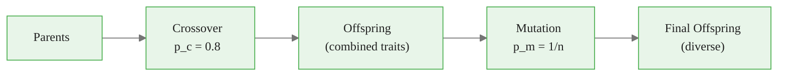
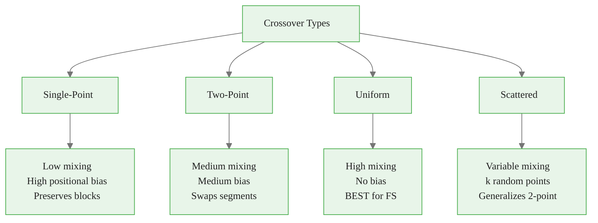
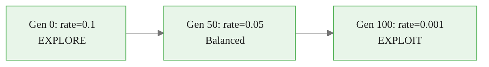
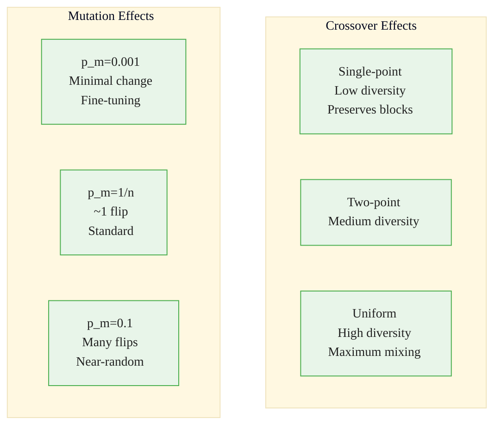

<!-- _class: lead -->
<!-- Speaker notes: This deck covers crossover and mutation operators in detail. The key message: crossover exploits known good solutions by combining them, mutation explores new regions by introducing random changes. The balance between these two drives GA performance. -->

# Genetic Operators: Crossover and Mutation

## Module 01 — GA Fundamentals

Balancing exploitation (crossover) with exploration (mutation)

---

<!-- Speaker notes: Use the flowchart to show the operator pipeline. Parents go through crossover first, then mutation. The probabilities p_c=0.8 and p_m=1/n are the standard defaults. The bottom text summarizes the key tradeoff: too much crossover with too little mutation converges fast but gets stuck; the opposite is slow but diverse. -->

## Crossover + Mutation = Evolution



**Crossover** = exploitation (combine known good solutions)
**Mutation** = exploration (discover new regions)

> High crossover + low mutation = fast convergence, may get stuck
> Low crossover + high mutation = slow convergence, high diversity

---

<!-- Speaker notes: The formal definitions establish the mathematical framework. Single-point crossover splits at position k. Uniform crossover independently swaps each gene with probability p_swap. Bit-flip mutation independently flips each bit with probability p_m. The typical parameter ranges at the bottom are the key practical guidance. -->

## Formal Definitions

**Single-Point Crossover** at position $k$:
$$\mathbf{o}_1 = [\mathbf{p}_1[1:k], \mathbf{p}_2[k+1:n]]$$

**Uniform Crossover** with swap probability $p_{swap}$:
$$o_{1,i} = \begin{cases} p_{2,i} & \text{with probability } p_{swap} \\ p_{1,i} & \text{otherwise} \end{cases}$$

**Bit-Flip Mutation** at rate $p_m$:
$$x'_i = \begin{cases} 1 - x_i & \text{with probability } p_m \\ x_i & \text{otherwise} \end{cases}$$

> Typical: $p_c \in [0.6, 0.95]$, $p_m = 1/n$

---

<!-- Speaker notes: The chef analogy makes crossover concrete. Chef A has great appetizers, Chef B has great desserts -- their child might inherit the best of both. For feature selection, this means combining good feature subsets from different parents. Mutation is random experimentation -- trying a new ingredient that neither parent used. Without mutation, the GA can only recombine what exists in the initial population. -->

## Intuitive Explanation

**Crossover** = Combining recipes from two chefs
- Chef A: great appetizers, Chef B: great desserts
- Child might get the best of both
- In feature selection: combine good feature subsets from different parents

**Mutation** = Random experimentation
- Occasionally change an ingredient to try something new
- Discover features not in any parent
- Without it, you can only recombine existing material

---

<!-- _class: lead -->
<!-- Speaker notes: Now we dive into the specific crossover operators. The choice of crossover type matters significantly for feature selection because feature ordering is arbitrary -- operators with positional bias are suboptimal. -->

# Crossover Operators

---

<!-- Speaker notes: Single-point crossover is the simplest: choose a random cut point, swap everything after it. The ASCII diagram shows how all features before the cut come from parent 1 and all after come from parent 2. The problem for feature selection: features near each other in the chromosome stay together, creating positional bias that is meaningless when feature order is arbitrary. -->

## Single-Point Crossover


<div class="code-window">
<div class="code-header">
<div class="dots"><span class="dot-red"></span><span class="dot-yellow"></span><span class="dot-green"></span></div>
<span class="filename">single_point_crossover.py</span>
</div>

```python
def single_point_crossover(parent1, parent2, crossover_prob=0.8):
    if np.random.random() > crossover_prob:
        return parent1.copy(), parent2.copy()

    n = len(parent1.chromosome)
    point = np.random.randint(1, n)

    child1 = np.concatenate([parent1.chromosome[:point],
                              parent2.chromosome[point:]])
    child2 = np.concatenate([parent2.chromosome[:point],
                              parent1.chromosome[point:]])

    return BinaryIndividual(child1), BinaryIndividual(child2)
```

</div>

```
P1: [1 1 1 1 1 | 0 0 0 0 0]     C1: [1 1 1 1 1 | 1 1 1 1 1]
P2: [0 0 0 0 0 | 1 1 1 1 1]     C2: [0 0 0 0 0 | 0 0 0 0 0]
              ^cut
```

---

<!-- Speaker notes: Two-point crossover swaps a segment between the two cut points. It produces more mixing than single-point because the swapped region can be anywhere. The implementation uses sorted random points to ensure point1 < point2. Still has some positional bias since genes within the swapped segment travel together. -->

## Two-Point Crossover


<div class="code-window">
<div class="code-header">
<div class="dots"><span class="dot-red"></span><span class="dot-yellow"></span><span class="dot-green"></span></div>
<span class="filename">two_point_crossover.py</span>
</div>

```python
def two_point_crossover(parent1, parent2, crossover_prob=0.8):
    if np.random.random() > crossover_prob:
        return parent1.copy(), parent2.copy()

    n = len(parent1.chromosome)
    points = sorted(np.random.choice(n, size=2, replace=False))
    point1, point2 = points

    child1 = parent1.chromosome.copy()
    child1[point1:point2] = parent2.chromosome[point1:point2]
    child2 = parent2.chromosome.copy()
    child2[point1:point2] = parent1.chromosome[point1:point2]

    return BinaryIndividual(child1), BinaryIndividual(child2)
```

</div>

```
P1: [1 1 | 1 1 1 0 | 0 0 0 0]   C1: [1 1 | 0 0 0 1 | 0 0 0 0]
P2: [0 0 | 0 0 0 1 | 1 1 1 1]   C2: [0 0 | 1 1 1 0 | 1 1 1 1]
         ^         ^
```

---

<!-- Speaker notes: Uniform crossover is the recommended default for feature selection. Each gene is independently chosen from either parent with probability swap_prob (typically 0.5). This gives maximum mixing with zero positional bias -- critical when feature ordering is arbitrary, which is always the case in feature selection. The NumPy implementation with np.where is very efficient. -->

## Uniform Crossover (Best for Feature Selection)


<div class="code-window">
<div class="code-header">
<div class="dots"><span class="dot-red"></span><span class="dot-yellow"></span><span class="dot-green"></span></div>
<span class="filename">uniform_crossover.py</span>
</div>

```python
def uniform_crossover(parent1, parent2,
                      crossover_prob=0.8, swap_prob=0.5):
    if np.random.random() > crossover_prob:
        return parent1.copy(), parent2.copy()

    n = len(parent1.chromosome)
    mask = np.random.random(n) < swap_prob

    child1 = np.where(mask, parent2.chromosome, parent1.chromosome)
    child2 = np.where(mask, parent1.chromosome, parent2.chromosome)

    return BinaryIndividual(child1), BinaryIndividual(child2)
```

</div>

> **Why best for FS?** No positional bias, maximum mixing, features can be reordered.

---

<!-- Speaker notes: This Mermaid diagram summarizes the four crossover types. The green highlight on Uniform indicates it is the recommended choice for feature selection. Scattered crossover generalizes two-point by using k random cut points. For feature selection, uniform is almost always the right choice. -->

## Crossover Type Comparison



---

<!-- Speaker notes: Scattered crossover uses a random number of cut points, generalizing two-point crossover. The number of points can be random or specified. It alternates which parent contributes genes between consecutive cut points. This is rarely needed for feature selection since uniform crossover is superior, but it is useful for ordered problems where block structure matters. -->

## Scattered (Multi-Point) Crossover


<div class="code-window">
<div class="code-header">
<div class="dots"><span class="dot-red"></span><span class="dot-yellow"></span><span class="dot-green"></span></div>
<span class="filename">scattered_crossover.py</span>
</div>

```python
def scattered_crossover(parent1, parent2, crossover_prob=0.8,
                        n_points=None):
    if np.random.random() > crossover_prob:
        return parent1.copy(), parent2.copy()

    n = len(parent1.chromosome)
    if n_points is None:
        n_points = np.random.randint(2, max(3, n // 2))

    points = sorted(np.random.choice(n, size=min(n_points, n-1),
                                      replace=False))

    child1 = parent1.chromosome.copy()
    child2 = parent2.chromosome.copy()
    swap = False
    prev = 0
    for point in points:
        if swap:
            child1[prev:point] = parent2.chromosome[prev:point]
            child2[prev:point] = parent1.chromosome[prev:point]
        swap = not swap
        prev = point

    return BinaryIndividual(child1), BinaryIndividual(child2)
```

</div>

---

<!-- _class: lead -->
<!-- Speaker notes: Now we move to mutation operators. Mutation is the only mechanism for introducing truly new genetic material. Without mutation, the GA can only recombine existing genes from the initial population. -->

# Mutation Operators

---

<!-- Speaker notes: Bit-flip mutation is the standard for binary chromosomes. The rule of thumb p_m = 1/n ensures roughly one bit flips per individual. The while loop enforcing minimum features is critical -- without it, mutation can produce all-zero chromosomes that crash the fitness function. Setting fitness to None forces re-evaluation of mutated individuals. -->

## Bit-Flip Mutation


<div class="code-window">
<div class="code-header">
<div class="dots"><span class="dot-red"></span><span class="dot-yellow"></span><span class="dot-green"></span></div>
<span class="filename">bit_flip_mutation.py</span>
</div>

```python
def bit_flip_mutation(individual, mutation_rate=None, min_features=1):
    mutant = individual.copy()
    n = len(mutant.chromosome)

    if mutation_rate is None:
        mutation_rate = 1.0 / n  # Rule of thumb

    for i in range(n):
        if np.random.random() < mutation_rate:
            mutant.chromosome[i] = 1 - mutant.chromosome[i]

    # Enforce minimum features
    while np.sum(mutant.chromosome) < min_features:
        zero_indices = np.where(mutant.chromosome == 0)[0]
        if len(zero_indices) > 0:
            mutant.chromosome[np.random.choice(zero_indices)] = 1
        else:
            break

    mutant.fitness = None
    return mutant
```

</div>

<div class="callout-info">

ℹ️ **Rule of thumb**: $p_m = 1/n$ ensures ~1 bit flip per individual.

</div>

---

<!-- Speaker notes: Swap mutation is specifically designed for feature selection. It turns one feature off and another on, keeping the total count constant. This is useful when you want to explore different combinations of the same number of features -- it avoids the problem of gradually growing or shrinking the feature set. The ASCII diagram shows the swap operation clearly. -->

## Swap Mutation (Preserves Feature Count)


<div class="code-window">
<div class="code-header">
<div class="dots"><span class="dot-red"></span><span class="dot-yellow"></span><span class="dot-green"></span></div>
<span class="filename">swap_mutation.py</span>
</div>

```python
def swap_mutation(individual, n_swaps=1):
    """Swap selected/unselected features. Count stays the same."""
    mutant = individual.copy()
    for _ in range(n_swaps):
        selected = np.where(mutant.chromosome == 1)[0]
        unselected = np.where(mutant.chromosome == 0)[0]
        if len(selected) > 0 and len(unselected) > 0:
            turn_off = np.random.choice(selected)
            turn_on = np.random.choice(unselected)
            mutant.chromosome[turn_off] = 0
            mutant.chromosome[turn_on] = 1
    mutant.fitness = None
    return mutant
```

</div>

```
Before: [1, 0, 1, 1, 0, 0]  (3 features)
         ^off         ^on
After:  [0, 0, 1, 1, 0, 1]  (3 features -- same count!)
```

---

<!-- Speaker notes: Adaptive mutation schedules change the mutation rate over time. Three common schedules: linear (simple decay), exponential (fast initial decay), and cosine (smooth with a restart-like profile). All start with high rates for exploration and decrease for exploitation. The Mermaid diagram shows the general trend from exploration to exploitation. -->

## Adaptive Mutation Schedules


<div class="code-window">
<div class="code-header">
<div class="dots"><span class="dot-red"></span><span class="dot-yellow"></span><span class="dot-green"></span></div>
<span class="filename">adaptive_mutation.py</span>
</div>

```python
def adaptive_mutation(individual, generation, max_generations,
                      min_rate=0.001, max_rate=0.1, schedule='linear'):
    progress = generation / max_generations

    if schedule == 'linear':
        rate = max_rate - progress * (max_rate - min_rate)
    elif schedule == 'exponential':
        rate = max(max_rate * np.exp(-5 * progress), min_rate)
    elif schedule == 'cosine':
        rate = min_rate + 0.5 * (max_rate - min_rate) * \
               (1 + np.cos(np.pi * progress))

    return bit_flip_mutation(individual, mutation_rate=rate)
```

</div>



---

<!-- Speaker notes: The building block hypothesis is the theoretical foundation for why crossover works. Short, highly-fit schemas (building blocks) are preferentially propagated and combined by crossover. The schema example shows how wildcards represent building blocks. When crossover combines parents with different good building blocks, the child can inherit both. This is why crossover is fundamentally different from random search. -->

## The Building Block Hypothesis

Crossover works by combining **building blocks** (schemata):

```
Schema: [1, *, 0, *, *]
Matches: [1,0,0,1,0], [1,1,0,0,1], [1,0,0,0,0], ...

Parent 1 has block A: [1,1,*,*,*,*,0,0]  (good features 0,1)
Parent 2 has block B: [*,*,*,*,1,1,*,*]  (good features 4,5)

Crossover child:      [1,1,*,*,1,1,0,0]  (both blocks!)
```

> Crossover preserves building blocks when the cut point falls outside the schema.

---

<!-- Speaker notes: This combined operator pipeline shows how crossover and mutation work together in practice. The function dispatches to the chosen crossover type, then applies bit-flip mutation to both children. This is the standard GA operator pipeline. Note that mutation is always applied after crossover -- the order matters because crossover produces the raw offspring and mutation refines them. -->

## Combined Operator Pipeline


<div class="code-window">
<div class="code-header">
<div class="dots"><span class="dot-red"></span><span class="dot-yellow"></span><span class="dot-green"></span></div>
<span class="filename">apply_genetic_operators.py</span>
</div>

```python
def apply_genetic_operators(parent1, parent2,
                            crossover_type='uniform',
                            crossover_prob=0.8,
                            mutation_rate=None,
                            min_features=1):
    """Standard GA: crossover then mutation."""
    # Crossover
    if crossover_type == 'uniform':
        child1, child2 = uniform_crossover(parent1, parent2, crossover_prob)
    elif crossover_type == 'single_point':
        child1, child2 = single_point_crossover(parent1, parent2, crossover_prob)
    elif crossover_type == 'two_point':
        child1, child2 = two_point_crossover(parent1, parent2, crossover_prob)

    # Mutation
    child1 = bit_flip_mutation(child1, mutation_rate, min_features)
    child2 = bit_flip_mutation(child2, mutation_rate, min_features)

    return child1, child2
```

</div>

---

<!-- _class: lead -->
<!-- Speaker notes: These pitfalls are the most common implementation mistakes with genetic operators. Each one can cause hours of debugging or silently degrade performance. -->

# Common Pitfalls

---

<!-- Speaker notes: Mutation rate too high is the most common mistake. At rate 0.5, half the bits flip, which essentially randomizes the chromosome and destroys good solutions. The rule of thumb 1/n ensures approximately one bit flips per individual. Test by checking the average Hamming distance between parent and child -- it should be 1-2 for standard mutation. The second pitfall is using single-point crossover for feature selection -- it has positional bias that is meaningless for unordered features. -->

## Pitfall 1: Mutation Rate Too High


<div class="code-window">
<div class="code-header">
<div class="dots"><span class="dot-red"></span><span class="dot-yellow"></span><span class="dot-green"></span></div>
<span class="filename">example.py</span>
</div>

```python
# BAD -- 50% of bits flip! Destroys good solutions.
mutant = bit_flip_mutation(individual, mutation_rate=0.5)

# GOOD -- ~1 bit flips on average
n = len(individual.chromosome)
mutant = bit_flip_mutation(individual, mutation_rate=1/n)
```

</div>

**Test**: Average Hamming distance between parent and child should be ~1-2.

## Pitfall 2: Wrong Crossover for Feature Selection


<div class="code-window">
<div class="code-header">
<div class="dots"><span class="dot-red"></span><span class="dot-yellow"></span><span class="dot-green"></span></div>
<span class="filename">example.py</span>
</div>

```python
# BAD -- positional bias irrelevant for unordered features
child1, child2 = single_point_crossover(p1, p2)

# GOOD -- no positional assumptions
child1, child2 = uniform_crossover(p1, p2)
```

</div>

---

<!-- Speaker notes: The third pitfall is forgetting to enforce the minimum feature constraint after mutation. Without it, mutation can produce chromosomes with zero selected features, which crashes the fitness function when you try to train a model on zero features. The good version uses the constraint enforcement built into the bit_flip_mutation function. Always enforce constraints after every genetic operation. -->

## Pitfall 3: No Constraint Enforcement


<div class="code-window">
<div class="code-header">
<div class="dots"><span class="dot-red"></span><span class="dot-yellow"></span><span class="dot-green"></span></div>
<span class="filename">bad_mutation.py</span>
</div>

```python
# BAD -- might create empty solution
def bad_mutation(individual):
    mutant = individual.copy()
    for i in range(len(mutant.chromosome)):
        if np.random.random() < 0.01:
            mutant.chromosome[i] = 1 - mutant.chromosome[i]
    return mutant  # Could have 0 features!

# GOOD -- always enforce constraints
def good_mutation(individual, min_features=1):
    mutant = bit_flip_mutation(individual, mutation_rate=0.01)
    # Constraint enforcement built into bit_flip_mutation
    return mutant
```

</div>

---

<!-- Speaker notes: This diagram summarizes how different crossover types and mutation rates affect population diversity. Single-point crossover with low mutation gives minimal diversity (fine-tuning). Uniform crossover with standard mutation (1/n) gives the best balance for feature selection. Very high mutation rates approach random search and lose the benefit of crossover. -->

## Operator Effects on Diversity



---

<!-- Speaker notes: Wrap up with connections to other topics and the four key empirical findings from decades of GA research. These findings are robust across many problem domains and form the basis for the standard parameter recommendations used throughout this course. -->

## Connections

<div class="compare">
<div>

**Prerequisites:**
- Encoding strategies
- Selection operators
- Basic probability

</div>
<div>

**Leads To:**
- Replacement strategies
- Parameter tuning
- Adaptive operators
- Multi-objective optimization

</div>
</div>

**Key empirical findings:**
1. Uniform crossover best for feature selection
2. Mutation rate $1/n$ is robust across problems
3. Crossover rate 0.6-0.9 standard (0.8 default)
4. Adaptive rates improve late-stage performance

---

<!-- Speaker notes: This ASCII summary is a quick reference card for genetic operators. The bottom section highlights the key tradeoff: high crossover with low mutation converges fast but may get stuck; balanced parameters (0.8 crossover + 1/n mutation) are the standard recommendation. -->

## Visual Summary

```
GENETIC OPERATORS
==================

    CROSSOVER (exploitation)         MUTATION (exploration)
    ========================         =====================

    Single-Point: low mixing         Bit-flip: p_m = 1/n
    Two-Point:    medium mixing      Swap: preserves count
    Uniform:      high mixing <<<    Adaptive: decreases
    Scattered:    variable           Inversion: reverses segment

    Applied with p_c = 0.8           Applied with p_m = 1/n

    CROSSOVER + MUTATION = EVOLUTION

    High crossover + Low mutation  = Fast but may get stuck
    Low crossover  + High mutation = Slow but diverse
    Balanced (0.8 + 1/n)           = Standard recommendation
```
