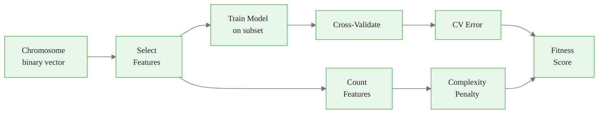
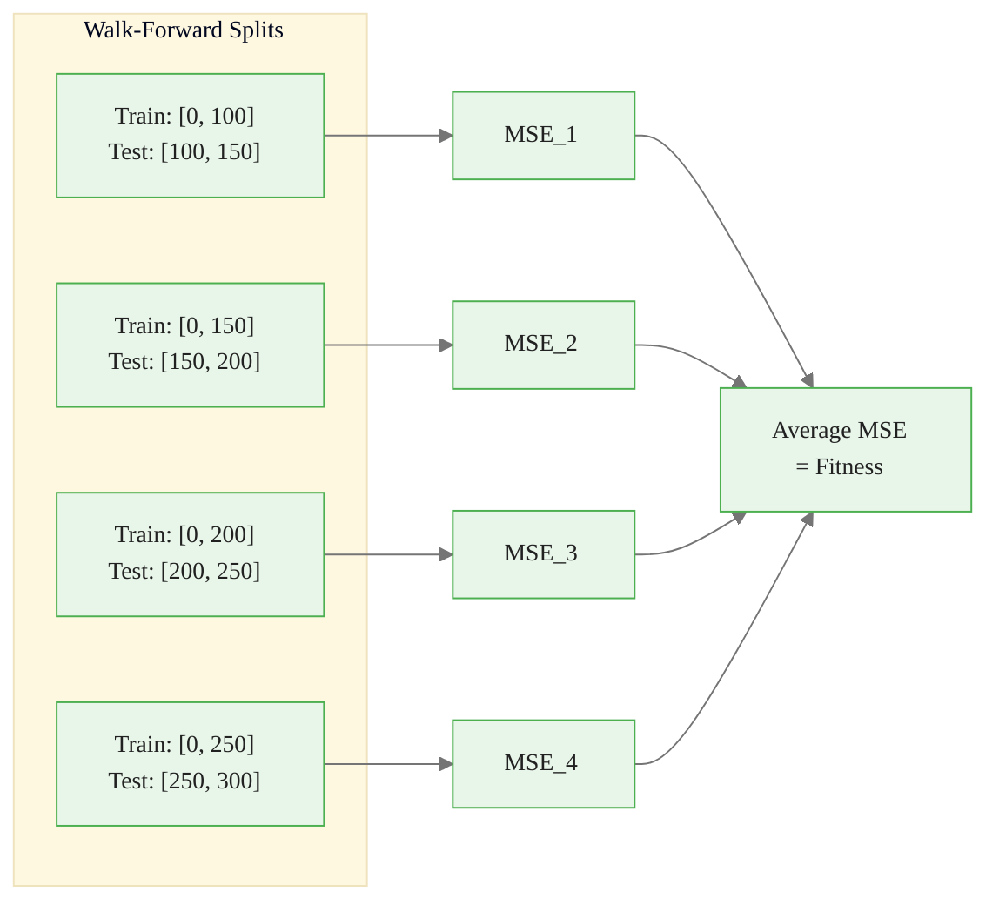
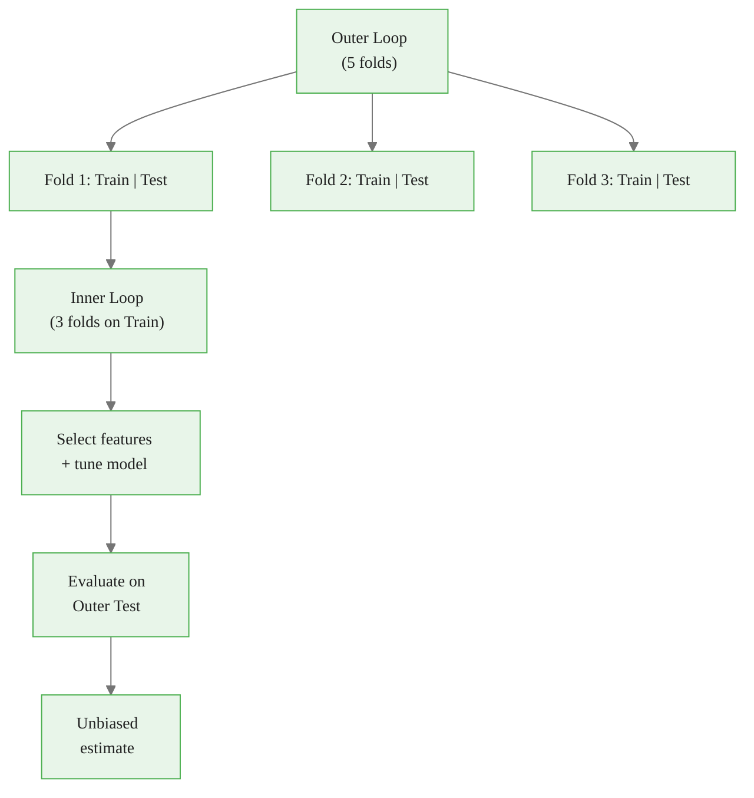
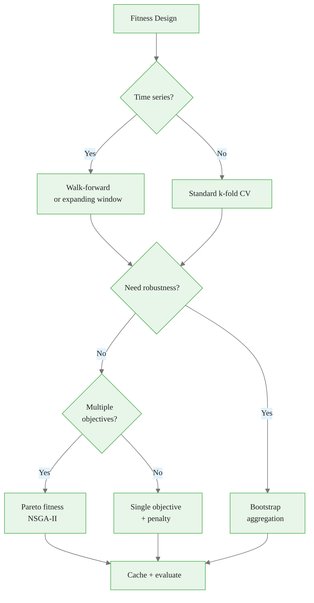

<!-- _class: lead -->
<!-- Speaker notes: This deck covers fitness function design, which is the single most important component of a GA. A poor fitness function will lead the GA to find useless solutions, no matter how good the operators are. The key equation: fitness = model error + complexity penalty. -->

# Fitness Function Design

## Module 02 — Fitness

The critical component that determines GA success

---

<!-- Speaker notes: Walk through the Mermaid flowchart from left to right. A chromosome (binary vector) determines which features are selected. Those features are used to train a model, which is cross-validated to get an error estimate. Separately, the number of features determines the complexity penalty. Both combine into the final fitness score. Lambda controls the accuracy-complexity tradeoff. -->

## The Fitness Equation

$$\text{fitness}(\mathbf{x}) = \text{model\_error}(\mathbf{x}) + \lambda \cdot \text{complexity}(\mathbf{x})$$



---

<!-- Speaker notes: This is the basic CV fitness function. The critical details: return infinity for empty selections (prevents crashes), use cross_val_score for out-of-sample estimation, and negate the score because sklearn uses negative MSE (so we negate again to get positive error for minimization). Never evaluate on training data alone -- that leads to overfitting to noise. -->

## Basic CV Fitness


<div class="code-window">
<div class="code-header">
<div class="dots"><span class="dot-red"></span><span class="dot-yellow"></span><span class="dot-green"></span></div>
<span class="filename">cv_fitness.py</span>
</div>

```python
def cv_fitness(chromosome, X, y, model_fn, cv_folds=5,
               scoring='neg_mean_squared_error'):
    selected = np.where(chromosome == 1)[0]

    if len(selected) == 0:
        return float('inf')  # Penalty for empty selection

    X_selected = X[:, selected]

    model = model_fn()
    scores = cross_val_score(
        model, X_selected, y, cv=cv_folds, scoring=scoring
    )

    return -scores.mean()  # Positive = bad (we minimize)
```

</div>

<div class="callout-key">

🔑 Never evaluate on training data alone -- always cross-validate.

</div>

---

<!-- Speaker notes: Multi-objective fitness separates accuracy and complexity into distinct objectives. The weighted sum approach (top function) collapses both into a single number. The Pareto approach (bottom function) returns a tuple, allowing NSGA-II to find the full tradeoff frontier. The Pareto approach is strictly more informative but requires a multi-objective optimizer. -->

## Multi-Objective Fitness


<div class="code-window">
<div class="code-header">
<div class="dots"><span class="dot-red"></span><span class="dot-yellow"></span><span class="dot-green"></span></div>
<span class="filename">multi_objective_fitness.py</span>
</div>

```python
def multi_objective_fitness(chromosome, X, y, model_fn,
                            cv_folds=5, feature_penalty=0.01):
    selected = np.where(chromosome == 1)[0]
    if len(selected) == 0:
        return float('inf')

    X_selected = X[:, selected]

    model = model_fn()
    scores = cross_val_score(model, X_selected, y,
                              cv=cv_folds, scoring='neg_mean_squared_error')
    error = -scores.mean()

    # Parsimony pressure
    complexity = len(selected) * feature_penalty

    return error + complexity

def pareto_fitness(chromosome, X, y, model_fn):
    """Return tuple for Pareto optimization."""
    selected = np.where(chromosome == 1)[0]
    if len(selected) == 0:
        return (float('inf'), float('inf'))

    scores = cross_val_score(model_fn(), X[:, selected], y,
                              cv=5, scoring='neg_mean_squared_error')
    return (-scores.mean(), len(selected))  # (error, count)
```

</div>

---

<!-- _class: lead -->
<!-- Speaker notes: Time series data requires special fitness functions that respect temporal ordering. Standard k-fold CV leaks future information into training, giving unrealistically optimistic performance estimates. This section shows how to do it correctly. -->

# Time Series Fitness

Temporal validation strategies

---

<!-- Speaker notes: The Mermaid diagram shows walk-forward validation: each split uses only past data for training and future data for testing. The training window grows (expanding) or slides (fixed). This mimics real forecasting where you always predict forward in time. The average MSE across all splits becomes the fitness score. -->

## Walk-Forward Validation



<div class="callout-key">

🔑 Training window always precedes test window -- no lookahead bias.

</div>

---

<!-- Speaker notes: The walk-forward implementation uses sklearn's TimeSeriesSplit for the fold structure. Key details: the test_size parameter controls how many samples are in each test window, and the function manually trains and predicts rather than using cross_val_score to have full control over the temporal splits. The feature penalty is added as a ratio to keep it scale-invariant. -->

## Walk-Forward Implementation


<div class="code-window">
<div class="code-header">
<div class="dots"><span class="dot-red"></span><span class="dot-yellow"></span><span class="dot-green"></span></div>
<span class="filename">walk_forward_fitness.py</span>
</div>

```python
from sklearn.model_selection import TimeSeriesSplit

def walk_forward_fitness(chromosome, X, y, model_fn,
                          n_splits=5, test_size=None):
    selected = np.where(chromosome == 1)[0]
    if len(selected) == 0:
        return float('inf')

    X_selected = X[:, selected]
    tscv = TimeSeriesSplit(n_splits=n_splits, test_size=test_size)

    errors = []
    for train_idx, test_idx in tscv.split(X_selected):
        X_train, X_test = X_selected[train_idx], X_selected[test_idx]
        y_train, y_test = y[train_idx], y[test_idx]

        model = model_fn()
        model.fit(X_train, y_train)
        predictions = model.predict(X_test)
        mse = np.mean((y_test - predictions) ** 2)
        errors.append(mse)

    return np.mean(errors)
```

</div>

---

<!-- Speaker notes: Expanding window fitness is an alternative to walk-forward that explicitly controls the minimum training size and step size. The training window starts at min_train_size and grows by step_size each iteration. This gives more control but requires more parameters. Use expanding window when you want to specify exact window sizes rather than number of splits. -->

## Expanding Window Fitness


<div class="code-window">
<div class="code-header">
<div class="dots"><span class="dot-red"></span><span class="dot-yellow"></span><span class="dot-green"></span></div>
<span class="filename">expanding_window_fitness.py</span>
</div>

```python
def expanding_window_fitness(chromosome, X, y, model_fn,
                              min_train_size=100, step_size=50):
    selected = np.where(chromosome == 1)[0]
    if len(selected) == 0:
        return float('inf')

    X_selected = X[:, selected]
    n_samples = len(y)
    errors = []
    train_end = min_train_size

    while train_end < n_samples - step_size:
        X_train = X_selected[:train_end]
        y_train = y[:train_end]

        test_end = min(train_end + step_size, n_samples)
        X_test = X_selected[train_end:test_end]
        y_test = y[train_end:test_end]

        model = model_fn()
        model.fit(X_train, y_train)
        predictions = model.predict(X_test)
        errors.append(np.mean((y_test - predictions) ** 2))
        train_end += step_size

    return np.mean(errors)
```

</div>

---

<!-- _class: lead -->
<!-- Speaker notes: Overfitting is the biggest risk in feature selection. The GA can exploit noise in the data to find feature subsets that appear optimal but do not generalize. This section covers techniques to prevent this. -->

# Avoiding Overfitting

---

<!-- Speaker notes: Nested CV is the gold standard for unbiased performance estimation when doing feature selection. The inner loop selects features and tunes the model. The outer loop evaluates how well the selection generalizes. Without nesting, the performance estimate is biased because the test data influenced the feature selection. The Mermaid diagram shows the two-level structure clearly. -->

## Nested Cross-Validation



> Inner loop: select features. Outer loop: evaluate selection quality.

---

<!-- Speaker notes: The nested CV implementation has two levels of cross-validation. The outer KFold creates train/test splits. For each outer fold, the GA runs on the outer training data to select features, then the selected features are evaluated on the outer test data. This gives an unbiased estimate of generalization performance. Note: this is computationally expensive (outer_cv x inner evaluations). -->

## Nested CV Implementation


<div class="code-window">
<div class="code-header">
<div class="dots"><span class="dot-red"></span><span class="dot-yellow"></span><span class="dot-green"></span></div>
<span class="filename">nested_cv_fitness.py</span>
</div>

```python
def nested_cv_fitness(chromosome, X, y, model_fn,
                      outer_cv=5, inner_cv=3):
    selected = np.where(chromosome == 1)[0]
    if len(selected) == 0:
        return float('inf')

    X_selected = X[:, selected]
    outer_scores = []
    outer_kfold = KFold(n_splits=outer_cv, shuffle=True, random_state=42)

    for train_idx, test_idx in outer_kfold.split(X_selected):
        X_outer_train = X_selected[train_idx]
        y_outer_train = y[train_idx]
        X_outer_test = X_selected[test_idx]
        y_outer_test = y[test_idx]

        model = model_fn()
        model.fit(X_outer_train, y_outer_train)
        predictions = model.predict(X_outer_test)
        mse = np.mean((y_outer_test - predictions) ** 2)
        outer_scores.append(mse)

    return np.mean(outer_scores)
```

</div>

---

<!-- Speaker notes: Regularized fitness applies double regularization: model-level (Ridge regression with alpha) and selection-level (feature count penalty). The multiplicative penalty (1 + complexity_penalty) is scale-invariant -- it increases the base error by a percentage proportional to the fraction of features selected. This creates a smoother fitness landscape that aids GA convergence. -->

## Regularized Fitness


<div class="code-window">
<div class="code-header">
<div class="dots"><span class="dot-red"></span><span class="dot-yellow"></span><span class="dot-green"></span></div>
<span class="filename">regularized_fitness.py</span>
</div>

```python
def regularized_fitness(chromosome, X, y, model_fn,
                        alpha=0.1, feature_penalty=0.05):
    selected = np.where(chromosome == 1)[0]
    if len(selected) == 0:
        return float('inf')

    X_selected = X[:, selected]

    # Use regularized model
    model = Ridge(alpha=alpha)
    scores = cross_val_score(model, X_selected, y,
                              cv=5, scoring='neg_mean_squared_error')
    base_error = -scores.mean()

    # Feature count penalty
    complexity_penalty = feature_penalty * (len(selected) / len(chromosome))

    return base_error * (1 + complexity_penalty)
```

</div>

> Double regularization: model-level (Ridge) + selection-level (feature penalty).

---

<!-- Speaker notes: Bootstrap fitness uses out-of-bag (OOB) samples for evaluation. Each bootstrap sample includes about 63% of the data (drawn with replacement), leaving 37% as OOB for testing. This is more robust than single-split evaluation because each bootstrap gives a different training set. The minimum 10 OOB samples check prevents unreliable estimates from very small OOB sets. -->

## Robust Estimation: Bootstrap


<div class="code-window">
<div class="code-header">
<div class="dots"><span class="dot-red"></span><span class="dot-yellow"></span><span class="dot-green"></span></div>
<span class="filename">bootstrap_fitness.py</span>
</div>

```python
def bootstrap_fitness(chromosome, X, y, model_fn, n_bootstrap=10):
    selected = np.where(chromosome == 1)[0]
    if len(selected) == 0:
        return float('inf')

    X_selected = X[:, selected]
    n_samples = len(y)
    errors = []

    for _ in range(n_bootstrap):
        boot_idx = np.random.choice(n_samples, size=n_samples, replace=True)
        oob_idx = np.setdiff1d(np.arange(n_samples), boot_idx)

        if len(oob_idx) < 10:
            continue

        model = model_fn()
        model.fit(X_selected[boot_idx], y[boot_idx])
        predictions = model.predict(X_selected[oob_idx])
        errors.append(np.mean((y[oob_idx] - predictions) ** 2))

    return np.mean(errors) if errors else float('inf')
```

</div>

---

<!-- Speaker notes: Fitness with uncertainty returns both the mean error and an upper confidence bound (UCB). The UCB is the pessimistic estimate: mean + 1.96 standard errors. Using UCB for selection prefers consistently good feature subsets over ones that are occasionally great but highly variable. This is risk-averse selection -- important in financial applications where stability matters more than occasional peaks. -->

## Fitness with Uncertainty


<div class="code-window">
<div class="code-header">
<div class="dots"><span class="dot-red"></span><span class="dot-yellow"></span><span class="dot-green"></span></div>
<span class="filename">fitness_with_uncertainty.py</span>
</div>

```python
def fitness_with_uncertainty(chromosome, X, y, model_fn, cv_folds=10):
    """Return fitness + confidence interval for risk-averse selection."""
    selected = np.where(chromosome == 1)[0]
    if len(selected) == 0:
        return float('inf'), float('inf')

    model = model_fn()
    scores = cross_val_score(model, X[:, selected], y,
                              cv=cv_folds, scoring='neg_mean_squared_error')
    errors = -scores
    mean_error = np.mean(errors)
    std_error = np.std(errors)

    # Upper confidence bound (pessimistic)
    ucb = mean_error + 1.96 * std_error / np.sqrt(cv_folds)

    return mean_error, ucb
```

</div>

> Use UCB for risk-averse selection -- prefer consistently good over occasionally great.

---

<!-- Speaker notes: Caching is essential for GA efficiency. The same chromosome often appears multiple times across generations (through crossover producing duplicates, or elitism carrying forward the same individual). The cache converts the chromosome to a hashable tuple and stores the fitness. This saves 20-40% of evaluations in a typical GA run. The eval_count attribute tracks how many unique evaluations were performed. -->

## Caching Fitness Evaluations


<div class="code-window">
<div class="code-header">
<div class="dots"><span class="dot-red"></span><span class="dot-yellow"></span><span class="dot-green"></span></div>
<span class="filename">cachedfitnessevaluator.py</span>
</div>

```python
class CachedFitnessEvaluator:
    def __init__(self, X, y, model_fn):
        self.X, self.y, self.model_fn = X, y, model_fn
        self.cache = {}
        self.eval_count = 0

    def evaluate(self, chromosome):
        key = tuple(chromosome.tolist())
        if key not in self.cache:
            self.eval_count += 1
            self.cache[key] = cv_fitness(
                chromosome, self.X, self.y, self.model_fn
            )
        return self.cache[key]
```

</div>

> Same chromosome = same fitness. Cache saves 20-40% of evaluations in a typical GA run.

---

<!-- Speaker notes: This decision flow is a practical guide for choosing the right fitness function. Start by asking whether the data is time series (use walk-forward or expanding window). Then decide on robustness needs (bootstrap) and whether you have multiple objectives (Pareto with NSGA-II). For single-objective, add a complexity penalty. Always cache results at the end. -->

## Fitness Design Decision Flow



---

<!-- Speaker notes: These takeaways are the essential principles for fitness function design. The most important: always cross-validate, always cache, and always penalize complexity. For time series, walk-forward is mandatory. Nested CV prevents the selection bias that occurs when the same data is used for both feature selection and performance estimation. -->

## Key Takeaways

| Principle | Recommendation |
|-----------|---------------|
| **CV is essential** | Never evaluate on training data alone |
| **Time series** | Walk-forward or expanding window |
| **Parsimony** | Penalize complex solutions ($\lambda > 0$) |
| **Nested CV** | Prevents selection bias |
| **Caching** | Same chromosome = same fitness (save compute) |
| **Robustness** | Bootstrap for noisy fitness landscapes |

---

<!-- Speaker notes: This ASCII summary is a quick reference showing the complete fitness function design space. The tree structure branches from the fitness equation into cross-validation strategies on the left and robustness/caching on the right. Encourage learners to keep this as a reference while implementing their own fitness functions. -->

<div class="callout-key">

🔑 **Key Point:** Always cross-validate, always cache, always penalize complexity. For time series, walk-forward is mandatory.

</div>

<div class="flow">
<div class="flow-step blue">Chromosome</div>
<div class="flow-arrow">→</div>
<div class="flow-step amber">CV Error</div>
<div class="flow-arrow">+</div>
<div class="flow-step mint">Penalty</div>
<div class="flow-arrow">=</div>
<div class="flow-step lavender">Fitness</div>
</div>

## Visual Summary

```
FITNESS FUNCTION DESIGN
========================

fitness(x) = model_error(x) + lambda * complexity(x)
               |                        |
    Cross-Validation              Feature Count
    - Standard k-fold             - Linear penalty
    - Walk-forward (TS)           - Ratio penalty
    - Expanding window (TS)       - Pareto (multi-obj)
               |                        |
         Robustness                 Caching
    - Bootstrap aggregation      - Hash chromosome
    - Nested CV                  - LRU cache
    - Confidence intervals       - Save 20-40% compute
```
