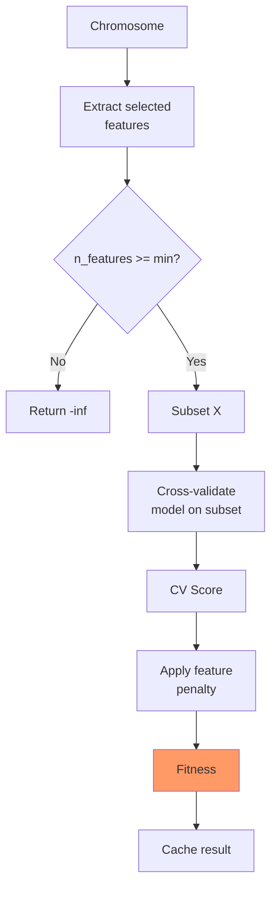
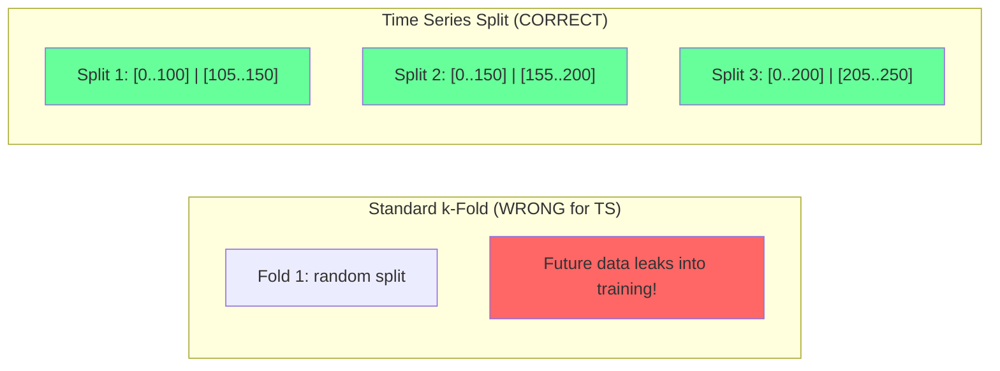
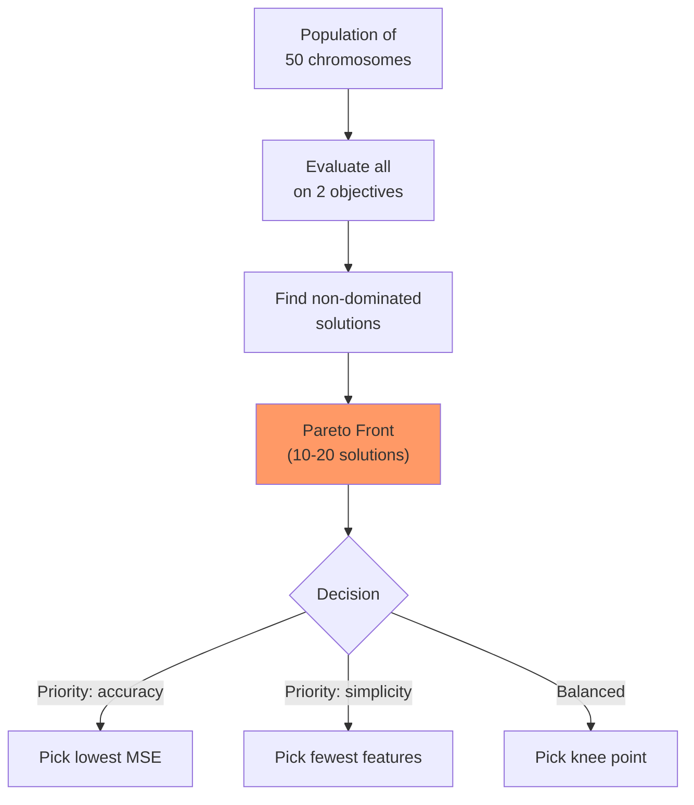
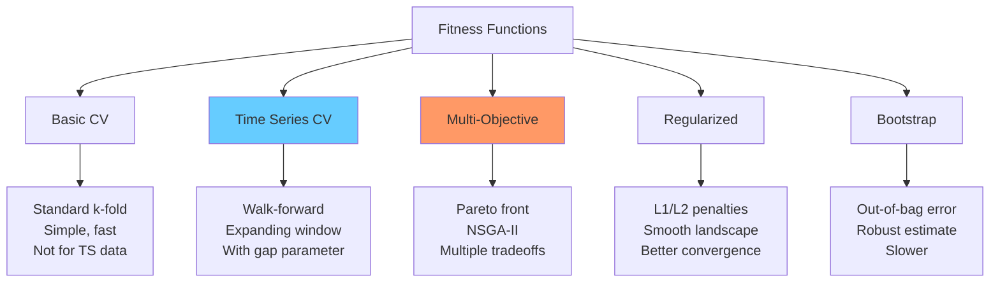

<!-- _class: lead -->
<!-- Speaker notes: This deck focuses specifically on cross-validation strategies for fitness evaluation. It builds on 01_fitness_functions by going deeper into CV variants, time series CV, multi-objective fitness, and efficient caching. The key message: the CV strategy determines whether your fitness estimates are reliable or misleading. -->

# Cross-Validation Based Fitness Functions

## Module 02 — Fitness

Robust evaluation of feature subsets using CV strategies

---

<!-- Speaker notes: This flowchart shows the complete CV fitness pipeline. Start with a chromosome, extract selected features, check minimum feature constraint, subset the data, cross-validate, apply the feature penalty, and cache the result. The cache at the end is critical for efficiency -- same chromosomes appear frequently across generations. -->

## The CV Fitness Framework



---

<!-- Speaker notes: The CVFitnessEvaluator class encapsulates everything needed for fitness evaluation. Key design decisions: the cache uses tuple(chromosome) as key for hashability, evaluation_count tracks compute budget, and the penalty_weight normalizes by n_features so the penalty is scale-invariant. The evaluate method checks the cache first and only computes if the chromosome is new. -->

## CVFitnessEvaluator Class

```python
class CVFitnessEvaluator:
    def __init__(self, X, y, model, cv=5, metric='neg_mse',
                 penalty_weight=0.01, min_features=1):
        self.X, self.y = np.array(X), np.array(y)
        self.model, self.cv = model, cv
        self.metric = metric
        self.penalty_weight = penalty_weight
        self.min_features = min_features
        self.n_features = X.shape[1]
        self.evaluation_count = 0
        self.cache = {}

    def evaluate(self, chromosome):
        self.evaluation_count += 1
        key = tuple(chromosome)
        if key in self.cache:
            return self.cache[key]

        selected = [i for i, x in enumerate(chromosome) if x == 1]
        if len(selected) < self.min_features:
            return -np.inf

        X_subset = self.X[:, selected]
        scores = cross_val_score(self.model, X_subset, self.y,
                                  cv=self.cv, scoring=self.metric)
        fitness = scores.mean() - self.penalty_weight * len(selected) / self.n_features
        self.cache[key] = fitness
        return fitness
```

---

<!-- Speaker notes: This example demonstrates the evaluator in action. Three test chromosomes show the tradeoff: first 10 features (targeted), all 50 features (kitchen sink), and every 5th feature (sparse). The fitness scores reveal how the penalty_weight affects the ranking. Run this code live to show learners the numbers. -->

## Example Usage

```python
from sklearn.datasets import make_regression
from sklearn.linear_model import Ridge

np.random.seed(42)
X, y = make_regression(n_samples=500, n_features=50,
                        n_informative=10, noise=10, random_state=42)

evaluator = CVFitnessEvaluator(
    X, y, model=Ridge(alpha=1.0), cv=5,
    metric='neg_mean_squared_error', penalty_weight=0.01
)

test_chromosomes = [
    [1]*10 + [0]*40,   # First 10 features
    [1]*50,             # All features
    [1 if i%5==0 else 0 for i in range(50)],  # Every 5th
]

for chrom in test_chromosomes:
    fitness = evaluator.evaluate(chrom)
    print(f"Features: {sum(chrom):2d}, Fitness: {fitness:.4f}")
```

---

<!-- _class: lead -->
<!-- Speaker notes: Time series cross-validation is the most important topic in this deck for financial and forecasting applications. Standard k-fold randomly assigns samples to train and test sets, which means future data can leak into training. This gives unrealistically optimistic performance estimates. -->

# Time Series Cross-Validation

Preventing lookahead bias in financial applications

---

<!-- Speaker notes: The Mermaid diagram contrasts the wrong approach (standard k-fold with random splits) against the correct approach (time series splits with gaps). The gap parameter prevents information leakage from autocorrelation: if yesterday's data is in training and today's is in testing, the strong autocorrelation means the model gets an unfair advantage. The red highlighting on the wrong approach and green on the correct approach reinforces which to use. -->

## Time Series CV Structure



> The `gap` parameter prevents information leakage between train and test.

---

<!-- Speaker notes: TimeSeriesFitnessEvaluator extends CVFitnessEvaluator by using TimeSeriesSplit instead of standard k-fold. The gap parameter is critical for autocorrelated data. The evaluate_with_details method returns a dictionary with CV mean, standard deviation, and individual fold scores -- useful for diagnosing unstable feature subsets. High CV standard deviation means the feature subset performs inconsistently across time periods. -->

## TimeSeriesFitnessEvaluator

```python
class TimeSeriesFitnessEvaluator(CVFitnessEvaluator):
    def __init__(self, X, y, model, n_splits=5, test_size=None,
                 gap=0, metric='neg_mse', **kwargs):
        cv = TimeSeriesSplit(n_splits=n_splits,
                              test_size=test_size, gap=gap)
        super().__init__(X, y, model, cv=cv, metric=metric, **kwargs)

    def evaluate_with_details(self, chromosome):
        selected = [i for i, x in enumerate(chromosome) if x == 1]
        if len(selected) < self.min_features:
            return {'fitness': -np.inf, 'cv_scores': []}

        X_subset = self.X[:, selected]
        scores = cross_val_score(self.model, X_subset, self.y,
                                  cv=self.cv, scoring=self.metric)
        fitness = scores.mean() - self.penalty_weight * len(selected) / self.n_features
        return {
            'fitness': fitness, 'cv_mean': scores.mean(),
            'cv_std': scores.std(), 'cv_scores': scores.tolist(),
            'n_features': len(selected)
        }
```

---

<!-- Speaker notes: This example shows how to use the time series evaluator with a 5-day gap. The gap=5 parameter ensures that the last 5 days of training data are not adjacent to the first day of test data, preventing autocorrelation leakage. The evaluate_with_details call returns rich diagnostics. High CV standard deviation is a warning sign that the feature subset is unstable across time periods. -->

## Time Series Example

```python
ts_evaluator = TimeSeriesFitnessEvaluator(
    X_ts, y_ts,
    model=Ridge(alpha=1.0),
    n_splits=5,
    test_size=50,
    gap=5,             # 5-day gap prevents lookahead
    penalty_weight=0.02
)

chrom = [1, 1, 1] + [0] * 27   # First 3 features
details = ts_evaluator.evaluate_with_details(chrom)

print(f"Fitness: {details['fitness']:.4f}")
print(f"CV Mean: {details['cv_mean']:.4f}")
print(f"CV Std:  {details['cv_std']:.4f}")
print(f"Scores:  {[f'{s:.4f}' for s in details['cv_scores']]}")
```

> High CV standard deviation = unstable features. Prefer low-variance subsets.

---

<!-- _class: lead -->
<!-- Speaker notes: Multi-objective fitness finds the full tradeoff frontier between accuracy and parsimony instead of collapsing them into a single number. This gives decision-makers flexibility to choose their preferred operating point after the GA has finished. -->

# Multi-Objective Fitness

Balancing accuracy vs. parsimony

---

<!-- Speaker notes: The MultiObjectiveFitness class returns a tuple of two objectives: accuracy (CV score, maximize) and negative feature count (minimize features, so negate to maximize). The dominates method implements Pareto dominance: solution A dominates B if A is at least as good on all objectives and strictly better on at least one. get_pareto_front filters the population to keep only non-dominated solutions. -->

## Multi-Objective Evaluator

```python
class MultiObjectiveFitness:
    """Objectives: 1) Maximize accuracy  2) Minimize features"""

    def __init__(self, X, y, model, cv=5, metric='neg_mse'):
        self.X, self.y = np.array(X), np.array(y)
        self.model, self.cv, self.metric = model, cv, metric
        self.n_features = X.shape[1]

    def evaluate(self, chromosome):
        selected = [i for i, x in enumerate(chromosome) if x == 1]
        if len(selected) == 0:
            return (-np.inf, 0)

        scores = cross_val_score(self.model, self.X[:, selected],
                                  self.y, cv=self.cv, scoring=self.metric)
        return (scores.mean(), -len(selected))  # Both to maximize

    def dominates(self, obj1, obj2):
        return (all(o1 >= o2 for o1, o2 in zip(obj1, obj2)) and
                any(o1 > o2 for o1, o2 in zip(obj1, obj2)))

    def get_pareto_front(self, population):
        objectives = [self.evaluate(ind) for ind in population]
        pareto = [(i, obj) for i, obj in enumerate(objectives)
                  if not any(self.dominates(objectives[j], obj)
                            for j in range(len(objectives)) if j != i)]
        return [population[i] for i, _ in pareto], [obj for _, obj in pareto]
```

---

<!-- Speaker notes: The ASCII art shows the Pareto front visually. Points marked with 'o' are Pareto optimal -- you cannot improve one objective without worsening the other. Points marked with '*' are dominated and should be discarded. The decision-maker picks from the Pareto front based on their priorities: best accuracy (most features), most sparse (worst accuracy), or a balanced knee point. -->

## Pareto Front Visualization

```
MSE (lower = better)
 ^
 |   *   Dominated solutions
 |     *
 |  o------o------o   Pareto Front
 |              o------o
 |                      o
 +-----------------------------> Features (fewer = better)

  Pareto optimal = can't improve one objective
                   without worsening the other
```

> The Pareto front gives decision-makers flexibility to choose their tradeoff.

---

<!-- Speaker notes: This Mermaid diagram shows the decision process after obtaining the Pareto front. With 10-20 solutions on the front, the decision-maker chooses based on priority: accuracy-focused picks the lowest MSE (most features), simplicity-focused picks the fewest features (worst accuracy), and balanced picks the knee point (maximum distance from the line connecting the extremes). -->

## Pareto Front Flow



---

<!-- _class: lead -->
<!-- Speaker notes: Regularized fitness combines model-level regularization (L1/L2 penalties on coefficients) with selection-level regularization (feature count penalty). This creates a smoother fitness landscape that helps the GA converge more reliably. -->

# Regularized Fitness

---

<!-- Speaker notes: The RegularizedFitness class adds L1 (Lasso) and L2 (Ridge) penalties to the CV score. L1 promotes sparsity in the coefficients (shrinks unimportant coefficients to zero). L2 prevents any single coefficient from becoming too large. These penalties smooth the fitness landscape, reducing the noise that comes from cross-validation variance. The model is fit separately to get coefficients for the penalty terms. -->

## L1/L2 Regularized Fitness

```python
class RegularizedFitness:
    def __init__(self, X, y, cv=5, alpha_l1=0.01, alpha_l2=0.01):
        self.X, self.y = np.array(X), np.array(y)
        self.cv = cv
        self.alpha_l1, self.alpha_l2 = alpha_l1, alpha_l2

    def evaluate(self, chromosome):
        selected = [i for i, x in enumerate(chromosome) if x == 1]
        if len(selected) == 0:
            return -np.inf

        X_subset = self.X[:, selected]
        model = LinearRegression()

        # CV score
        scores = cross_val_score(model, X_subset, self.y,
                                  cv=self.cv, scoring='neg_mean_squared_error')
        cv_score = scores.mean()

        # Fit for coefficients
        model.fit(X_subset, self.y)
        coefs = model.coef_

        # Regularization penalties
        l1 = self.alpha_l1 * np.sum(np.abs(coefs))
        l2 = self.alpha_l2 * np.sum(coefs ** 2)

        return cv_score - l1 - l2
```

---

<!-- Speaker notes: The EfficientFitnessEvaluator implements LRU (Least Recently Used) caching with a configurable maximum size. The OrderedDict maintains insertion order, and move_to_end on cache hits implements the LRU policy. When the cache exceeds its size limit, the oldest (least recently used) entry is evicted with popitem(last=False). The stats dictionary tracks evaluations, cache hits, and misses for monitoring. -->

## Efficient Caching

```python
class EfficientFitnessEvaluator:
    def __init__(self, X, y, model, cv=5, cache_size=10000):
        self.X, self.y, self.model, self.cv = X, y, model, cv
        from collections import OrderedDict
        self.cache = OrderedDict()
        self.cache_size = cache_size
        self.stats = {'evaluations': 0, 'cache_hits': 0, 'cache_misses': 0}

    def evaluate(self, chromosome):
        self.stats['evaluations'] += 1
        key = tuple(chromosome)

        if key in self.cache:
            self.stats['cache_hits'] += 1
            self.cache.move_to_end(key)  # LRU
            return self.cache[key]

        self.stats['cache_misses'] += 1
        selected = [i for i, x in enumerate(chromosome) if x == 1]
        if len(selected) == 0:
            fitness = -np.inf
        else:
            scores = cross_val_score(self.model, self.X[:, selected],
                                      self.y, cv=self.cv, scoring='neg_mean_squared_error')
            fitness = scores.mean()

        self.cache[key] = fitness
        if len(self.cache) > self.cache_size:
            self.cache.popitem(last=False)  # Evict oldest
        return fitness
```

---

<!-- Speaker notes: This Mermaid comparison diagram shows the five main fitness function types with their characteristics. Basic CV is the starting point. Time Series CV prevents lookahead bias. Multi-objective finds the Pareto frontier. Regularized creates smoother landscapes. Bootstrap provides robust estimates. The blue highlight on Time Series CV indicates it is the recommended choice for temporal data. -->

## Fitness Type Comparison



---

<!-- Speaker notes: These takeaways are the essential principles for CV-based fitness. Cross-validation is mandatory for reliable fitness estimates. Time series CV prevents lookahead bias. Feature penalties balance accuracy against parsimony. Multi-objective finds the full tradeoff frontier. Caching saves 20-40% of compute. Regularization creates smoother fitness landscapes that aid convergence. -->

## Key Takeaways

| Principle | Detail |
|-----------|--------|
| **Cross-validation** | Robust out-of-sample fitness estimates |
| **Time series CV** | Prevents lookahead bias (use gap parameter) |
| **Feature penalties** | Balance accuracy vs. parsimony |
| **Multi-objective** | Finds Pareto frontier of solutions |
| **Caching** | Dramatically speeds up GA (20-40% savings) |
| **Regularization** | Smoother fitness landscapes aid convergence |

---

<!-- Speaker notes: This ASCII summary shows the complete CV fitness framework as a tree. The chromosome flows through feature selection into either standard or time series CV, then into single-objective or multi-objective fitness. This is the reference architecture for fitness function design in this course. -->

## Visual Summary

```
CROSS-VALIDATION FITNESS FRAMEWORK
====================================

          Chromosome: [1,0,1,1,0,0,1,0]
                    |
          +-------- Select features --------+
          |                                  |
    Standard CV          Time Series CV
    (k-fold)             (walk-forward)
          |                    |
    +-----+-----+       +-----+-----+
    |           |       |           |
  Basic      Nested   Walk-fwd   Expanding
  5-fold     5x3      5 splits   100+50
          |                    |
          +-- Fitness Score ---+
          |                    |
    Single-Obj          Multi-Obj
    error + penalty     (error, features)
                        Pareto front
```
