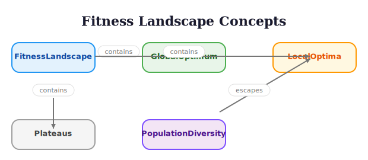

# Multi-Objective Feature Selection

> **Reading time:** ~13 min | **Module:** 2 — Fitness Functions | **Prerequisites:** 02 Cross-Validation Fitness

## In Brief

Multi-objective feature selection explicitly optimizes multiple conflicting goals simultaneously (e.g., prediction accuracy vs. feature count vs. computational cost) rather than combining them into a single weighted objective. This produces a Pareto frontier of non-dominated solutions, giving decision-makers flexibility to choose the final tradeoff.

<div class="callout-key">

**Key Concept Summary:** Instead of collapsing multiple goals into a single number (weighted sum), multi-objective optimization finds the *set of all best tradeoffs* -- the Pareto front. This lets you defer the "accuracy vs. simplicity" decision until after the GA runs, when you can inspect the options and choose based on deployment constraints.

</div>

<div class="callout-insight">

There is no single "best" feature subset—the optimal choice depends on which objectives you prioritize. Multi-objective optimization acknowledges this reality by finding all non-dominated solutions: subsets where improving one objective requires sacrificing another. This transforms feature selection from finding one answer to exploring tradeoff curves.

</div>




## Intuitive Explanation

Before diving into formal definitions, build intuition for what "Pareto optimality" means with a concrete analogy.

Imagine shopping for a laptop. You care about:
- **Performance** (higher is better)
- **Price** (lower is better)
- **Weight** (lighter is better)

There's no single "best" laptop because improving one often hurts another:
- High performance usually means high price
- Light weight often means lower performance
- Low price typically means compromises on both

The Pareto frontier consists of laptops where improving any feature requires accepting worse performance on another:

```
Performance
    ^
    |        A ●  (High perf, expensive, heavy)
    |
    |    B ●      (Medium perf, medium price, medium weight)
    |
    | C ●         (Low perf, cheap, light)
    |________________> Price (lower is better)
```

Laptops A, B, C are all Pareto optimal—which is "best" depends on your priorities. A laptop worse than B on all three dimensions is **dominated** and shouldn't be considered.

In feature selection:
- **Solution A**: 95% accuracy, 50 features (high accuracy, many features)
- **Solution B**: 93% accuracy, 20 features (medium accuracy, medium features)
- **Solution C**: 88% accuracy, 5 features (lower accuracy, very sparse)

All three are valid choices depending on whether you prioritize accuracy or simplicity.

Now let's formalize these ideas.

## Formal Definition

### Multi-Objective Optimization Problem

Find feature subsets that minimize multiple objectives:

$$\min_{s \in \{0,1\}^p} \mathbf{F}(s) = \begin{bmatrix} f_1(s) \\ f_2(s) \\ \vdots \\ f_m(s) \end{bmatrix}$$

Common objectives for feature selection:
- $f_1(s)$: Prediction error (MSE, MAE, etc.)
- $f_2(s)$: Number of features $||s||_0$
- $f_3(s)$: Computational cost
- $f_4(s)$: Feature correlation (diversity)
- $f_5(s)$: Acquisition cost

### Pareto Dominance

Returning to the laptop analogy: laptop A "dominates" laptop D if A is at least as good on every criterion and strictly better on at least one. Formally:

Solution $s_a$ **dominates** $s_b$ (written $s_a \prec s_b$) if:

$$\begin{cases}
f_i(s_a) \leq f_i(s_b) & \forall i \in \{1, \ldots, m\} \\
f_j(s_a) < f_j(s_b) & \exists j \in \{1, \ldots, m\}
\end{cases}$$

In words: $s_a$ is at least as good on all objectives and strictly better on at least one.

### Pareto Optimal Set

The **Pareto optimal set** (Pareto front) is:

$$\mathcal{P} = \{s \in S : \nexists s' \in S \text{ such that } s' \prec s\}$$

These are all non-dominated solutions—the best possible tradeoffs.

## Mathematical Formulation

### Bi-Objective Feature Selection

Most common: accuracy vs. complexity

$$\begin{align}
\min_{s} \quad & f_1(s) = \text{CV\_MSE}(s) \\
\min_{s} \quad & f_2(s) = \frac{||s||_0}{p}
\end{align}$$

The Pareto front traces the accuracy-sparsity tradeoff:

```
MSE
 ^
 |   ●
 |      ●
 |         ●
 |            ●
 |               ●
 |___________________> Features
 High  →  Low
```

### Crowding Distance

To maintain diversity along the Pareto front, NSGA-II uses **crowding distance**:

For objective $i$, the crowding distance of solution $k$ is:

$$d_k^i = \frac{f_i(s_{k+1}) - f_i(s_{k-1})}{f_i^{\max} - f_i^{\min}}$$

Total crowding distance:

$$d_k = \sum_{i=1}^m d_k^i$$

Higher $d_k$ means more isolated (preferred for diversity).

### Hypervolume Indicator

Measures quality of Pareto front approximation:

$$HV(\mathcal{P}) = \text{volume} \left( \bigcup_{s \in \mathcal{P}} [f_1(s), r_1] \times \cdots \times [f_m(s), r_m] \right)$$

Where $r = (r_1, \ldots, r_m)$ is a reference point (e.g., nadir point).

Larger hypervolume = better Pareto approximation.

## Code Implementation

### Basic Multi-Objective Fitness


<div class="code-window">
<div class="code-header">
<div class="dots"><span class="dot-red"></span><span class="dot-yellow"></span><span class="dot-green"></span></div>
<span class="filename">multi_objective_fitness.py</span>
</div>

```python
import numpy as np
from sklearn.model_selection import cross_val_score
from sklearn.linear_model import LinearRegression

def multi_objective_fitness(individual, X, y):
    """
    Evaluate feature subset on multiple objectives.

    Parameters:
    -----------
    individual : array-like
        Binary vector indicating selected features
    X : array, shape (n_samples, n_features)
        Feature matrix
    y : array, shape (n_samples,)
        Target variable

    Returns:
    --------
    objectives : tuple
        (accuracy, complexity) - both to minimize
    """
    # Extract selected features
    selected = np.array(individual, dtype=bool)

    if not np.any(selected):
        # No features selected - worst case
        return (1e10, 1.0)

    X_selected = X[:, selected]

    # Objective 1: Prediction error (to minimize)
    model = LinearRegression()
    cv_scores = cross_val_score(
        model, X_selected, y,
        cv=5,
        scoring='neg_mean_squared_error'
    )
    mse = -cv_scores.mean()

    # Objective 2: Feature complexity (to minimize)
    n_features = np.sum(selected)
    complexity = n_features / len(individual)

    return (mse, complexity)


# Example usage
np.random.seed(42)
n, p = 200, 30
X = np.random.randn(n, p)
y = X[:, 0] + 2*X[:, 1] - X[:, 2] + np.random.randn(n)*0.5

# Evaluate a candidate
individual = np.random.randint(0, 2, p)
objectives = multi_objective_fitness(individual, X, y)
print(f"MSE: {objectives[0]:.4f}, Complexity: {objectives[1]:.4f}")
```

</div>
</div>


### NSGA-II with DEAP


<div class="code-window">
<div class="code-header">
<div class="dots"><span class="dot-red"></span><span class="dot-yellow"></span><span class="dot-green"></span></div>
<span class="filename">nsga2_feature_selection.py</span>
</div>

```python
from deap import base, creator, tools, algorithms
import matplotlib.pyplot as plt

def setup_nsga2(n_features):
    """
    Setup NSGA-II for multi-objective feature selection.
    """
    # Create types
    # weights=(-1.0, -1.0) means minimize both objectives
    creator.create("FitnessMin", base.Fitness, weights=(-1.0, -1.0))
    creator.create("Individual", list, fitness=creator.FitnessMin)

    toolbox = base.Toolbox()

    # Binary genes
    toolbox.register("attr_bool", np.random.randint, 0, 2)

    # Individual and population
    toolbox.register("individual", tools.initRepeat,
                     creator.Individual, toolbox.attr_bool, n=n_features)
    toolbox.register("population", tools.initRepeat, list, toolbox.individual)

    # Genetic operators
    toolbox.register("mate", tools.cxTwoPoint)
    toolbox.register("mutate", tools.mutFlipBit, indpb=0.05)
    toolbox.register("select", tools.selNSGA2)  # Multi-objective selection

    return toolbox


def run_nsga2(X, y, population_size=100, n_generations=50):
    """
    Run NSGA-II for multi-objective feature selection.

    Returns:
    --------
    pareto_front : list
        Non-dominated solutions
    logbook : tools.Logbook
        Evolution statistics
    """
    n_features = X.shape[1]
    toolbox = setup_nsga2(n_features)

    # Register evaluation function
    toolbox.register("evaluate", multi_objective_fitness, X=X, y=y)

    # Statistics
    stats = tools.Statistics(lambda ind: ind.fitness.values)
    stats.register("avg", np.mean, axis=0)
    stats.register("std", np.std, axis=0)
    stats.register("min", np.min, axis=0)
    stats.register("max", np.max, axis=0)

    # Create population
    pop = toolbox.population(n=population_size)

    # Hall of Fame for Pareto front
    hof = tools.ParetoFront()

    # Run evolution
    pop, logbook = algorithms.eaMuPlusLambda(
        pop, toolbox,
        mu=population_size,
        lambda_=population_size,
        cxpb=0.7,
        mutpb=0.3,
        ngen=n_generations,
        stats=stats,
        halloffame=hof,
        verbose=True
    )

    return hof, logbook


# Run NSGA-II
pareto_front, logbook = run_nsga2(X, y, population_size=50, n_generations=30)

# Extract Pareto front objectives
front_mse = [ind.fitness.values[0] for ind in pareto_front]
front_complexity = [ind.fitness.values[1] for ind in pareto_front]

# Visualize Pareto front
plt.figure(figsize=(10, 6))
plt.scatter(front_complexity, front_mse, c='red', s=100,
            alpha=0.6, edgecolors='black', label='Pareto Front')
plt.xlabel('Complexity (fraction of features)', fontsize=12)
plt.ylabel('Cross-Validation MSE', fontsize=12)
plt.title('Multi-Objective Feature Selection: Pareto Front', fontsize=14)
plt.legend()
plt.grid(alpha=0.3)
plt.tight_layout()

# Print some solutions
print("\nPareto Front Solutions:")
print("=" * 60)
for i, ind in enumerate(pareto_front[:5]):
    n_features = sum(ind)
    mse, complexity = ind.fitness.values
    print(f"Solution {i+1}: {n_features} features, MSE={mse:.4f}, "
          f"Complexity={complexity:.4f}")
```

</div>
</div>

### Hypervolume Calculation

```python
def hypervolume_2d(pareto_front, reference_point):
    """
    Calculate hypervolume for 2D objectives.

    Parameters:
    -----------
    pareto_front : list of tuples
        List of (obj1, obj2) values
    reference_point : tuple
        Reference point (r1, r2) - typically worst values

    Returns:
    --------
    hv : float
        Hypervolume indicator
    """
    # Sort by first objective
    front = sorted(pareto_front)

    hv = 0.0
    prev_x = reference_point[0]

    for (x, y) in front:
        # Rectangle width × height
        width = prev_x - x
        height = reference_point[1] - y
        hv += width * height
        prev_x = x

    return hv


# Calculate hypervolume
reference = (max(front_mse) * 1.1, max(front_complexity) * 1.1)
hv = hypervolume_2d(list(zip(front_mse, front_complexity)), reference)
print(f"\nHypervolume: {hv:.4f}")
```

### Three-Objective Example

```python
def three_objective_fitness(individual, X, y, feature_costs):
    """
    Three objectives: accuracy, complexity, cost.
    """
    selected = np.array(individual, dtype=bool)

    if not np.any(selected):
        return (1e10, 1.0, 1e10)

    X_selected = X[:, selected]

    # Objective 1: Prediction error
    model = LinearRegression()
    mse = -cross_val_score(
        model, X_selected, y, cv=5,
        scoring='neg_mean_squared_error'
    ).mean()

    # Objective 2: Number of features
    n_features = np.sum(selected)

    # Objective 3: Total feature cost
    total_cost = sum(feature_costs[i] for i, s in enumerate(selected) if s)

    return (mse, n_features, total_cost)


# Example with feature costs
feature_costs = np.random.uniform(0.1, 10.0, p)  # Random costs

# Setup for 3 objectives
creator.create("Fitness3D", base.Fitness, weights=(-1.0, -1.0, -1.0))
creator.create("Individual3D", list, fitness=creator.Fitness3D)

# Visualize 3D Pareto front
from mpl_toolkits.mplot3d import Axes3D

# (Run NSGA-II with 3-objective fitness, then:)

# fig = plt.figure(figsize=(12, 9))

# ax = fig.add_subplot(111, projection='3d')

# ax.scatter(obj1_values, obj2_values, obj3_values, c='red', s=100)

# ax.set_xlabel('MSE')

# ax.set_ylabel('Number of Features')

# ax.set_zlabel('Total Cost')

# plt.title('3D Pareto Front')
```

### Decision Making: Choose from Pareto Front

```python
def select_from_pareto(pareto_front, strategy='balanced', max_features=None):
    """
    Select a solution from the Pareto front.

    Parameters:
    -----------
    pareto_front : list
        List of Pareto-optimal individuals
    strategy : str
        'accuracy': prefer low MSE
        'sparse': prefer few features
        'balanced': balance both
        'knee': find knee point
    max_features : int, optional
        Maximum features allowed

    Returns:
    --------
    selected : individual
        Chosen solution
    """
    objectives = [ind.fitness.values for ind in pareto_front]
    mse_values = np.array([obj[0] for obj in objectives])
    complexity_values = np.array([obj[1] for obj in objectives])

    if strategy == 'accuracy':
        # Minimize MSE
        idx = np.argmin(mse_values)

    elif strategy == 'sparse':
        # Minimize features
        idx = np.argmin(complexity_values)

    elif strategy == 'balanced':
        # Minimize sum of normalized objectives
        mse_norm = (mse_values - mse_values.min()) / (mse_values.max() - mse_values.min())
        comp_norm = (complexity_values - complexity_values.min()) / (complexity_values.max() - complexity_values.min())
        scores = mse_norm + comp_norm
        idx = np.argmin(scores)

    elif strategy == 'knee':
        # Find knee point (maximum distance to line connecting extremes)
        # Normalize objectives
        mse_norm = (mse_values - mse_values.min()) / (mse_values.max() - mse_values.min())
        comp_norm = (complexity_values - complexity_values.min()) / (complexity_values.max() - complexity_values.min())

        # Line from (0,1) to (1,0)
        distances = np.abs(mse_norm + comp_norm - 1) / np.sqrt(2)
        idx = np.argmax(distances)

    else:
        raise ValueError(f"Unknown strategy: {strategy}")

    selected = pareto_front[idx]

    # Apply max_features constraint if specified
    if max_features is not None:
        filtered = [ind for ind in pareto_front if sum(ind) <= max_features]
        if filtered:
            return select_from_pareto(filtered, strategy, max_features=None)

    return selected


# Demonstrate selection strategies
print("\nSelection Strategies:")
print("=" * 60)

for strategy in ['accuracy', 'sparse', 'balanced', 'knee']:
    solution = select_from_pareto(pareto_front, strategy=strategy)
    n_features = sum(solution)
    mse, complexity = solution.fitness.values
    print(f"\n{strategy.capitalize()}:")
    print(f"  Features: {n_features}/{p}")
    print(f"  MSE: {mse:.4f}")
    print(f"  Complexity: {complexity:.4f}")
```

## Common Pitfalls

<div class="callout-danger">

<strong>Danger:</strong> Converting multi-objective to single-objective with a weighted sum (e.g., 0.7 * error + 0.3 * features) permanently collapses the Pareto front into a single point. You lose all other trade-off options. This decision is irreversible once the GA has run.

</div>

### Pitfall 1: Converting to Single Objective Too Early

**Problem:** Using weighted sum $f(s) = w_1 f_1(s) + w_2 f_2(s)$ collapses the Pareto front to a single solution.

**Why it's wrong:** You lose all other Pareto-optimal tradeoffs and must know the correct weights beforehand.

**How to avoid:**
```python

# WRONG: Single weighted objective
def weighted_fitness(individual, X, y, w1=0.7, w2=0.3):
    mse, complexity = multi_objective_fitness(individual, X, y)
    return w1 * mse + w2 * complexity  # Only finds one solution!

# RIGHT: True multi-objective
def multi_obj_fitness(individual, X, y):
    mse, complexity = multi_objective_fitness(individual, X, y)
    return (mse, complexity)  # Returns tuple, NSGA-II finds Pareto front
```

### Pitfall 2: Ignoring Dominated Solutions in Population

**Problem:** Keeping dominated solutions wastes population diversity.

**Why it happens:** Simple GAs don't remove dominated solutions.

**How to avoid:** Use NSGA-II's non-dominated sorting:
```python

# NSGA-II automatically ranks by domination

# Rank 0: Non-dominated (Pareto front)

# Rank 1: Dominated only by Rank 0

# Rank 2: Dominated by Rank 0 and 1

# etc.

# Selection preferentially keeps lower ranks
pop = toolbox.select(pop, len(pop))  # NSGA-II selection
```

### Pitfall 3: Insufficient Population Diversity

**Problem:** Pareto front converges to a narrow region, missing other tradeoffs.

**Why it happens:** Genetic drift or selection pressure collapse diversity.

**How to avoid:** Use crowding distance to maintain spread:
```python

# NSGA-II uses crowding distance to prefer isolated solutions

# When comparing individuals with same rank, prefer higher crowding distance

# You can also use diversity-preserving operators
def diverse_mutation(individual, indpb=0.05):
    """Mutation that maintains diversity."""
    # Higher mutation rate if population diversity is low
    if current_diversity < threshold:
        indpb *= 2
    return tools.mutFlipBit(individual, indpb=indpb)
```

## Connections

<div class="callout-info">

ℹ️ **How this connects to the rest of the course:**


### Builds On
- **02_cross_validation_fitness.md**: Proper fitness evaluation
- **01_fitness_functions.md**: Single-objective fitness design
- **Module 1: GA Fundamentals**: GA operators and population management

### Leads To
- **Module 5: Advanced Topics**: NSGA-II implementation details
- **Module 5: Hybrid Methods**: Combining multi-objective with local search
- **Capstone Project**: Real-world multi-objective feature selection

### Related To
- **Hyperparameter optimization**: Similar multi-objective problems (accuracy vs. complexity)
- **Architecture search**: Multi-objective neural architecture optimization
- **Portfolio optimization**: Financial applications of Pareto optimization
- **Engineering design**: Tradeoffs in physical system design

<div class="callout-key">

<strong>Key Takeaway:</strong> The "knee point" of the Pareto front -- where further feature reduction causes disproportionate accuracy loss -- is usually the best practical choice. It represents the point of diminishing returns for model simplification.


## Practice Problems

### Problem 1: Manual Pareto Front

**Task:** Given these feature subsets, identify the Pareto front manually:

| Subset | MSE | # Features |
|--------|-----|------------|
| A | 2.5 | 10 |
| B | 2.0 | 15 |
| C | 3.0 | 8 |
| D | 2.2 | 12 |
| E | 1.8 | 20 |
| F | 2.5 | 9 |

**Solution:**
- B dominates D (better MSE, more features, but E dominates B)
- E dominates B, D, A (best MSE)
- C is Pareto-optimal (fewest features, acceptable MSE)
- F dominates A (same MSE, fewer features)
- F and C trade off: F has better MSE but more features

**Pareto Front: {E, F, C}**

### Problem 2: Implement Dominance Check

```python
def dominates(obj_a, obj_b):
    """
    Check if obj_a dominates obj_b (both minimizing).

    Parameters:
    -----------
    obj_a, obj_b : tuple
        Objective values

    Returns:
    --------
    dominates : bool
        True if obj_a dominates obj_b
    """
    # Check if at least as good on all objectives
    all_leq = all(a <= b for a, b in zip(obj_a, obj_b))

    # Check if strictly better on at least one
    any_less = any(a < b for a, b in zip(obj_a, obj_b))

    return all_leq and any_less


def find_pareto_front(solutions):
    """
    Find Pareto front from list of solutions.

    Parameters:
    -----------
    solutions : list of tuples
        List of (objective1, objective2, ...) tuples

    Returns:
    --------
    pareto_front : list
        Indices of Pareto-optimal solutions
    """
    n = len(solutions)
    is_dominated = [False] * n

    for i in range(n):
        for j in range(n):
            if i != j and dominates(solutions[j], solutions[i]):
                is_dominated[i] = True
                break

    pareto_indices = [i for i in range(n) if not is_dominated[i]]
    return pareto_indices


# Test with problem 1 data
solutions = [
    (2.5, 10),  # A
    (2.0, 15),  # B
    (3.0, 8),   # C
    (2.2, 12),  # D
    (1.8, 20),  # E
    (2.5, 9),   # F
]

pareto = find_pareto_front(solutions)
print("Pareto front indices:", pareto)
print("Pareto solutions:", [solutions[i] for i in pareto])
```

### Problem 3: Conceptual — Weighted Sum vs. True Multi-Objective

**Task:** Explain why converting a multi-objective problem to a weighted sum (e.g., `0.7 * error + 0.3 * feature_count`) can miss good solutions. Draw or describe a scenario where the Pareto front is concave and the weighted sum approach cannot find solutions in the concave region. What practical consequence does this have for feature selection?

### Problem 4: Conceptual — When Multi-Objective is Overkill

**Task:** Describe a feature selection scenario where single-objective fitness with a parsimony penalty is sufficient and multi-objective optimization adds unnecessary complexity. What characteristics of the problem make multi-objective unnecessary?

### Problem 5: Knee Point Detection

**Task:** Implement the "knee point" method to find the best balanced solution:

```python
def find_knee_point(pareto_front):
    """
    Find knee point on 2D Pareto front.

    The knee is the point with maximum perpendicular distance
    to the line connecting the extreme points.
    """
    objectives = np.array([ind.fitness.values for ind in pareto_front])

    # Normalize to [0, 1]
    obj_norm = (objectives - objectives.min(axis=0)) / (objectives.max(axis=0) - objectives.min(axis=0))

    # Find extreme points (assuming minimization)
    idx_min_obj1 = np.argmin(obj_norm[:, 0])
    idx_min_obj2 = np.argmin(obj_norm[:, 1])

    p1 = obj_norm[idx_min_obj1]
    p2 = obj_norm[idx_min_obj2]

    # Calculate perpendicular distances to line p1-p2
    distances = []
    for point in obj_norm:
        # Distance from point to line
        d = np.abs(np.cross(p2 - p1, p1 - point)) / np.linalg.norm(p2 - p1)
        distances.append(d)

    # Return point with maximum distance
    knee_idx = np.argmax(distances)
    return pareto_front[knee_idx]

# Find knee point
knee_solution = find_knee_point(pareto_front)
print(f"Knee solution: {sum(knee_solution)} features, "
      f"MSE={knee_solution.fitness.values[0]:.4f}")
```

## Further Reading

### Foundational Papers
- **Deb et al. (2002)**: "A Fast and Elitist Multiobjective Genetic Algorithm: NSGA-II" - The definitive NSGA-II paper, essential reading for multi-objective optimization.

- **Zitzler & Thiele (1999)**: "Multiobjective Evolutionary Algorithms: A Comparative Case Study and the Strength Pareto Approach" - Introduces performance metrics for multi-objective optimization.

### Feature Selection Specific
- **Xue et al. (2016)**: "Multi-objective Feature Selection Using NSGA-II for Classification" - Application of NSGA-II to feature selection with detailed experiments.

- **Zhang et al. (2008)**: "Multi-Objective Feature Selection Using MOEA/D" - Alternative decomposition-based approach to multi-objective feature selection.

### Performance Metrics
- **Zitzler et al. (2003)**: "Performance Assessment of Multiobjective Optimizers: An Analysis and Review" - Comprehensive overview of quality indicators including hypervolume.

### Decision Making
- **Branke et al. (2008)**: "Multiobjective Optimization: Interactive and Evolutionary Approaches" - How to select solutions from Pareto front in practice.

- **Deb & Sundar (2006)**: "Reference Point Based Multi-Objective Optimization Using Evolutionary Algorithms" - Interactive methods for decision-making.

### Advanced Topics
- **Li et al. (2015)**: "Many-Objective Evolutionary Algorithms: A Survey" - Extensions to more than 3 objectives (many-objective optimization).

- **Ishibuchi et al. (2008)**: "Evolutionary Many-Objective Optimization: A Short Review" - Challenges and solutions for high-dimensional objective spaces.
---

**Next:** [Companion Slides](./03_multi_objective_slides.md) | [Notebook](../notebooks/01_fitness_functions.ipynb)
