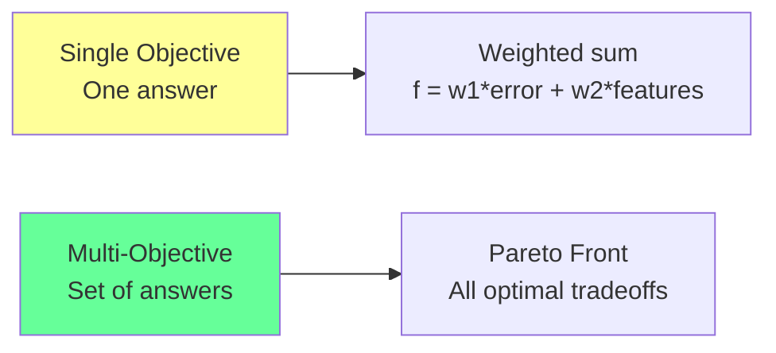
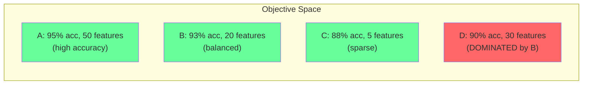
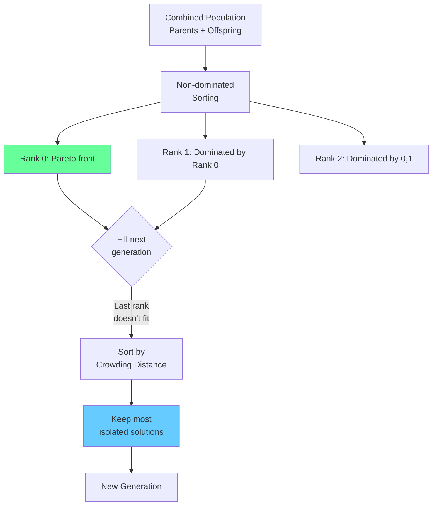
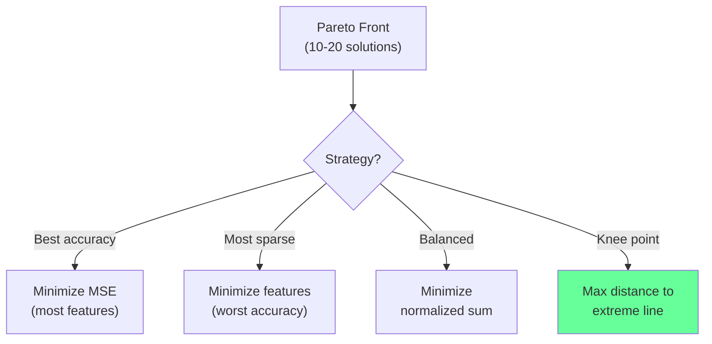

<!-- _class: lead -->
<!-- Speaker notes: This deck covers multi-objective feature selection in depth. The key insight: there is no single best feature subset -- the optimal choice depends on how you weigh competing objectives. Multi-objective optimization finds all non-dominated solutions, giving the decision-maker full flexibility. -->

# Multi-Objective Feature Selection

## Module 02 — Fitness

Finding optimal tradeoffs instead of single solutions

---

<!-- Speaker notes: The contrast between single-objective and multi-objective is fundamental. Single-objective collapses all objectives into one number using weights, which requires choosing the weights upfront. Multi-objective finds the entire Pareto front -- all solutions where improving one objective necessarily worsens another. This defers the weight decision to after optimization, which is strictly more informative. -->

## Why Multi-Objective?

There is no single "best" feature subset -- the optimal choice depends on priorities.



> Multi-objective finds ALL non-dominated solutions, giving decision-makers flexibility.

---

<!-- Speaker notes: The formal definition uses vector-valued objective functions. Each solution maps to m objective values. Common objectives for feature selection include prediction error, feature count, computational cost, feature correlation (diversity), and feature acquisition cost. The vector formulation means we minimize all objectives simultaneously. -->

## Formal Definition

Find feature subsets minimizing multiple objectives:

$$\min_{s \in \{0,1\}^p} \mathbf{F}(s) = \begin{bmatrix} f_1(s) \\ f_2(s) \\ \vdots \\ f_m(s) \end{bmatrix}$$

Common objectives:
- $f_1(s)$: Prediction error (MSE, MAE)
- $f_2(s)$: Number of features $||s||_0$
- $f_3(s)$: Computational cost
- $f_4(s)$: Feature correlation (diversity)
- $f_5(s)$: Acquisition cost

---

<!-- Speaker notes: Pareto dominance is the core concept. Solution A dominates B if A is at least as good on ALL objectives and strictly better on at LEAST one. The Pareto optimal set contains all non-dominated solutions. Note the conditions carefully: it requires being at least as good everywhere AND strictly better somewhere. Two solutions that trade off (one is better on objective 1, the other on objective 2) are both non-dominated. -->

## Pareto Dominance

Solution $s_a$ **dominates** $s_b$ ($s_a \prec s_b$) if:

$$\begin{cases}
f_i(s_a) \leq f_i(s_b) & \forall i \in \{1, \ldots, m\} \\
f_j(s_a) < f_j(s_b) & \exists j \in \{1, \ldots, m\}
\end{cases}$$

At least as good on ALL objectives, strictly better on at LEAST one.

**Pareto optimal set:**

$$\mathcal{P} = \{s \in S : \nexists s' \in S \text{ such that } s' \prec s\}$$

---

<!-- Speaker notes: The Mermaid diagram shows four solutions in objective space. A, B, C are Pareto optimal because no other solution beats them on both objectives. D is dominated by B (B has better accuracy AND fewer features than D). This visual makes the concept concrete. Ask the audience: why is D dominated? -->

## Pareto Front Visualization



A, B, C are Pareto optimal. D is dominated (B is better on both objectives).

---

<!-- Speaker notes: The laptop shopping analogy makes Pareto optimality intuitive for a general audience. Three laptops with different performance/price/weight profiles are all Pareto optimal if improving any metric requires sacrificing another. A laptop that is worse than another on ALL dimensions is dominated and should not be considered. This maps directly to feature selection: which subset is best depends on your priority. -->

## Intuitive Explanation: Laptop Shopping

You care about: **Performance**, **Price**, **Weight**

- **Laptop A**: High perf, expensive, heavy
- **Laptop B**: Medium perf, medium price, medium weight
- **Laptop C**: Low perf, cheap, light

All three are Pareto optimal -- improving any metric requires sacrificing another.

A laptop worse than B on ALL dimensions is **dominated** and shouldn't be considered.

> Same logic: which feature subset is "best" depends on your priority.

---

<!-- Speaker notes: The bi-objective formulation is the most common in practice: minimize CV error and minimize the fraction of features selected. The ASCII art shows the Pareto front as a curve in objective space. Each point on the curve represents a different tradeoff between accuracy and complexity. The curve's shape reveals how quickly accuracy degrades as you remove features. -->

## Bi-Objective Formulation

Most common: accuracy vs. complexity

$$\min_{s} \quad f_1(s) = \text{CV\_MSE}(s)$$
$$\min_{s} \quad f_2(s) = \frac{||s||_0}{p}$$

```
MSE
 ^
 |   o
 |      o
 |         o     <-- Pareto Front
 |            o
 |               o
 +-------------------> Fraction of Features
```

---

<!-- _class: lead -->
<!-- Speaker notes: Now we move to implementation. The code examples show how to set up multi-objective fitness evaluation and use NSGA-II (Non-dominated Sorting Genetic Algorithm II), which is the standard algorithm for multi-objective optimization. -->

# Implementation

---

<!-- Speaker notes: The basic multi-objective fitness function returns a tuple of two values: MSE and complexity (fraction of features). Both are to be minimized. The key difference from single-objective: we return a tuple instead of a single number. For empty selections, return worst-case values for both objectives. The LinearRegression model is used for simplicity; in practice, use whatever model you need. -->

## Basic Multi-Objective Fitness

```python
def multi_objective_fitness(individual, X, y):
    selected = np.array(individual, dtype=bool)
    if not np.any(selected):
        return (1e10, 1.0)

    X_selected = X[:, selected]

    # Objective 1: Prediction error
    model = LinearRegression()
    cv_scores = cross_val_score(model, X_selected, y,
                                 cv=5, scoring='neg_mean_squared_error')
    mse = -cv_scores.mean()

    # Objective 2: Feature complexity
    complexity = np.sum(selected) / len(individual)

    return (mse, complexity)  # Both to MINIMIZE
```

---

<!-- Speaker notes: DEAP's NSGA-II setup requires creating a multi-objective fitness type with weights=(-1.0, -1.0), meaning minimize both objectives. The toolbox registers standard operators: two-point crossover, bit-flip mutation, and NSGA-II selection. The selNSGA2 function handles non-dominated sorting and crowding distance automatically. The weights are the most critical parameter -- getting the signs wrong inverts the optimization direction. -->

## NSGA-II with DEAP

```python
from deap import base, creator, tools, algorithms

def setup_nsga2(n_features):
    creator.create("FitnessMin", base.Fitness, weights=(-1.0, -1.0))
    creator.create("Individual", list, fitness=creator.FitnessMin)

    toolbox = base.Toolbox()
    toolbox.register("attr_bool", np.random.randint, 0, 2)
    toolbox.register("individual", tools.initRepeat,
                     creator.Individual, toolbox.attr_bool, n=n_features)
    toolbox.register("population", tools.initRepeat, list, toolbox.individual)
    toolbox.register("mate", tools.cxTwoPoint)
    toolbox.register("mutate", tools.mutFlipBit, indpb=0.05)
    toolbox.register("select", tools.selNSGA2)
    return toolbox
```

> `weights=(-1.0, -1.0)` means minimize both objectives.

---

<!-- Speaker notes: The run_nsga2 function executes the multi-objective evolution. It uses eaMuPlusLambda which combines parents and offspring before selecting the next generation (mu+lambda strategy). The ParetoFront hall of fame preserves all non-dominated solutions found across all generations. The stats object tracks average and minimum objective values per generation for monitoring convergence. -->

## Running NSGA-II

```python
def run_nsga2(X, y, population_size=100, n_generations=50):
    toolbox = setup_nsga2(X.shape[1])
    toolbox.register("evaluate", multi_objective_fitness, X=X, y=y)

    stats = tools.Statistics(lambda ind: ind.fitness.values)
    stats.register("avg", np.mean, axis=0)
    stats.register("min", np.min, axis=0)

    pop = toolbox.population(n=population_size)
    hof = tools.ParetoFront()

    pop, logbook = algorithms.eaMuPlusLambda(
        pop, toolbox,
        mu=population_size, lambda_=population_size,
        cxpb=0.7, mutpb=0.3, ngen=n_generations,
        stats=stats, halloffame=hof, verbose=True
    )

    return hof, logbook
```

---

<!-- Speaker notes: The NSGA-II selection mechanism has two phases. First, non-dominated sorting ranks all solutions by Pareto dominance (Rank 0 is the current Pareto front, Rank 1 is dominated only by Rank 0, etc.). Second, within each rank, crowding distance measures how isolated each solution is along the front. When filling the next generation, prefer lower ranks first. For the last rank that partially fits, use crowding distance to keep the most isolated solutions, maintaining diversity. -->

## NSGA-II Selection Mechanism



---

<!-- Speaker notes: Crowding distance quantifies how isolated a solution is along the Pareto front. It sums the normalized distances to the nearest neighbors on each objective axis. Higher crowding distance means more isolated, which is preferred for diversity. The ASCII art shows how clustered solutions (low crowding) are less preferred than isolated ones (high crowding). Boundary solutions always get infinite crowding distance to ensure the front's extremes are preserved. -->

## Crowding Distance

Maintains diversity along the Pareto front:

$$d_k = \sum_{i=1}^m \frac{f_i(s_{k+1}) - f_i(s_{k-1})}{f_i^{\max} - f_i^{\min}}$$

Higher $d_k$ = more isolated = **preferred** for diversity.

```
MSE
 ^
 |  o         <-- high crowding (isolated)
 |
 |    ooo     <-- low crowding (clustered)
 |
 |        o   <-- high crowding (isolated)
 +-------------------> Features
```

---

<!-- Speaker notes: The hypervolume indicator measures the quality of a Pareto front approximation. It computes the volume of objective space dominated by the front and bounded by a reference point. Larger hypervolume means better coverage of the objective space. The 2D implementation sorts the front and computes the area of rectangles. This metric is useful for comparing different GA runs or different algorithms. -->

## Hypervolume Indicator

Measures quality of Pareto front approximation:

$$HV(\mathcal{P}) = \text{volume} \left( \bigcup_{s \in \mathcal{P}} [f_1(s), r_1] \times \cdots \times [f_m(s), r_m] \right)$$

```python
def hypervolume_2d(pareto_front, reference_point):
    front = sorted(pareto_front)
    hv = 0.0
    prev_x = reference_point[0]

    for (x, y) in front:
        width = prev_x - x
        height = reference_point[1] - y
        hv += width * height
        prev_x = x

    return hv
```

> Larger hypervolume = better Pareto approximation.

---

<!-- Speaker notes: Three-objective extension adds a third objective: feature acquisition cost. This is relevant in domains where different features have different costs to obtain (e.g., some require expensive lab tests, others are freely available). The DEAP setup for three objectives uses weights=(-1.0, -1.0, -1.0) to minimize all three. NSGA-II handles three or more objectives, though visualization becomes harder. -->

## Three-Objective Extension

```python
def three_objective_fitness(individual, X, y, feature_costs):
    selected = np.array(individual, dtype=bool)
    if not np.any(selected):
        return (1e10, 1.0, 1e10)

    X_selected = X[:, selected]

    # Objective 1: Prediction error
    mse = -cross_val_score(LinearRegression(), X_selected, y,
                            cv=5, scoring='neg_mean_squared_error').mean()

    # Objective 2: Number of features
    n_features = np.sum(selected)

    # Objective 3: Total feature acquisition cost
    total_cost = sum(feature_costs[i] for i, s in enumerate(selected) if s)

    return (mse, n_features, total_cost)
```

---

<!-- _class: lead -->
<!-- Speaker notes: Once the Pareto front is obtained, someone must decide which solution to use. This section covers the four main decision strategies. The choice depends on the application's priorities. -->

# Decision Making from Pareto Front

---

<!-- Speaker notes: The four decision strategies cover the most common scenarios. Best accuracy picks the solution with lowest MSE (usually the most features). Most sparse picks the fewest features (usually the worst accuracy). Balanced minimizes a normalized sum of both objectives. Knee point finds the solution with maximum distance from the line connecting the two extremes -- this is often the best default because it represents the point of diminishing returns. -->

## Selection Strategies



---

<!-- Speaker notes: The select_from_pareto function implements all four strategies. The accuracy strategy simply picks the lowest MSE. The sparse strategy picks the fewest features. The balanced strategy normalizes both objectives to [0,1] and minimizes their sum. The knee point strategy finds the solution with maximum distance from the diagonal line connecting the extremes -- this is the point of diminishing returns where adding more features gives progressively less improvement. The knee point is often the best default. -->

## Decision Implementation

```python
def select_from_pareto(pareto_front, strategy='knee'):
    objectives = [ind.fitness.values for ind in pareto_front]
    mse_values = np.array([obj[0] for obj in objectives])
    comp_values = np.array([obj[1] for obj in objectives])

    if strategy == 'accuracy':
        idx = np.argmin(mse_values)
    elif strategy == 'sparse':
        idx = np.argmin(comp_values)
    elif strategy == 'balanced':
        mse_n = (mse_values - mse_values.min()) / (mse_values.ptp())
        comp_n = (comp_values - comp_values.min()) / (comp_values.ptp())
        idx = np.argmin(mse_n + comp_n)
    elif strategy == 'knee':
        mse_n = (mse_values - mse_values.min()) / (mse_values.ptp())
        comp_n = (comp_values - comp_values.min()) / (comp_values.ptp())
        distances = np.abs(mse_n + comp_n - 1) / np.sqrt(2)
        idx = np.argmax(distances)

    return pareto_front[idx]
```

> The **knee point** is often the best default -- maximum distance from the line connecting extremes.

---

<!-- _class: lead -->
<!-- Speaker notes: These pitfalls are the most common mistakes when implementing multi-objective feature selection. Each one can significantly degrade the quality of the Pareto front or lead to misleading results. -->

# Common Pitfalls

---

<!-- Speaker notes: The most common pitfall is collapsing multiple objectives into a single weighted sum. This finds only ONE solution (determined by the weights) and misses the rest of the Pareto front. The weighted sum approach also cannot find solutions in non-convex regions of the Pareto front. The right approach uses true multi-objective optimization (NSGA-II) which finds the entire front. -->

## Pitfall 1: Collapsing to Single Objective

<div class="columns">
<div>

**WRONG** -- weighted sum:

```python
def weighted_fitness(ind, X, y,
                     w1=0.7, w2=0.3):
    mse, complexity = \
        multi_objective_fitness(ind, X, y)
    return w1 * mse + w2 * complexity
    # Only finds ONE solution!
```

</div>
<div>

**RIGHT** -- true multi-objective:

```python
def multi_obj_fitness(ind, X, y):
    mse, complexity = \
        multi_objective_fitness(ind, X, y)
    return (mse, complexity)
    # NSGA-II finds entire
    # Pareto front!
```

</div>
</div>

---

<!-- Speaker notes: Simple GAs keep dominated solutions in the population, wasting slots that could be used for non-dominated solutions. NSGA-II's non-dominated sorting assigns ranks: Rank 0 is the Pareto front, Rank 1 is dominated only by Rank 0, etc. Selection preferentially keeps lower ranks, ensuring the population converges toward the Pareto front over time. -->

## Pitfall 2: Ignoring Dominated Solutions

**Problem:** Simple GAs keep dominated solutions, wasting population slots.

**Fix:** Use NSGA-II's non-dominated sorting:

| Rank | Description |
|------|-------------|
| 0 | Non-dominated (Pareto front) |
| 1 | Dominated only by Rank 0 |
| 2 | Dominated by Rank 0 and 1 |
| ... | ... |

> Selection preferentially keeps lower ranks.

---

<!-- Speaker notes: Without crowding distance, the Pareto front can collapse to a narrow region where many solutions are clustered. Crowding distance ensures diversity by preferring isolated solutions over clustered ones. Additionally, if the population lacks diversity overall, increasing the mutation rate can help spread solutions along the front. The code snippet shows a simple diversity-responsive mutation rate adjustment. -->

## Pitfall 3: Insufficient Diversity

**Problem:** Pareto front converges to a narrow region.

**Fix:** Crowding distance preserves spread along the front.

```python
# NSGA-II uses crowding distance automatically
# When comparing same-rank individuals, prefer higher crowding distance

# Additional measure: diverse mutation
def diverse_mutation(individual, indpb=0.05):
    if current_diversity < threshold:
        indpb *= 2  # Double mutation rate when diversity low
    return tools.mutFlipBit(individual, indpb=indpb)
```

---

<!-- Speaker notes: Wrap up with connections to related topics. Multi-objective fitness builds on CV-based fitness and single-objective design from earlier in this module. It leads to Module 5's deep dive on NSGA-II details, hybrid methods, and real-world multi-objective feature selection applications. Related fields include hyperparameter optimization, neural architecture search, and portfolio optimization. -->

## Connections

<div class="columns">
<div>

**Builds On:**
- CV-based fitness evaluation
- Single-objective fitness design
- GA fundamentals (operators)

</div>
<div>

**Leads To:**
- Module 5: NSGA-II details
- Module 5: Hybrid methods
- Real-world multi-objective FS

</div>
</div>

**Related:** Hyperparameter optimization, architecture search, portfolio optimization

---

<!-- Speaker notes: This ASCII summary is a quick reference showing single-objective vs multi-objective, the Pareto front concept, and the three decision strategies. The key visual: dominated solutions (marked with asterisk) are discarded, Pareto optimal solutions (marked with o) form the front, and the decision-maker picks from the front based on their priority. -->

## Visual Summary

```
MULTI-OBJECTIVE FEATURE SELECTION
===================================

Single Objective:     Multi-Objective:
f = error + lambda*n  (error, n_features) separately

  -> One solution       -> Pareto Front (set of solutions)

                MSE
                 ^
                 |  o
                 |     o        Pareto Front
                 |        o     (all non-dominated)
                 |     *    o
                 |  *    *    o
                 +-------------------> Features
                    * = dominated (discard)
                    o = Pareto optimal (keep)

  Decision: pick from front using
    - Knee point (balanced)
    - Min MSE (accuracy focus)
    - Min features (parsimony focus)
```
