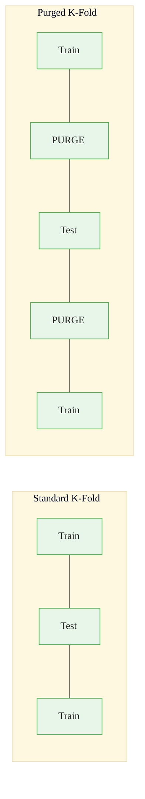
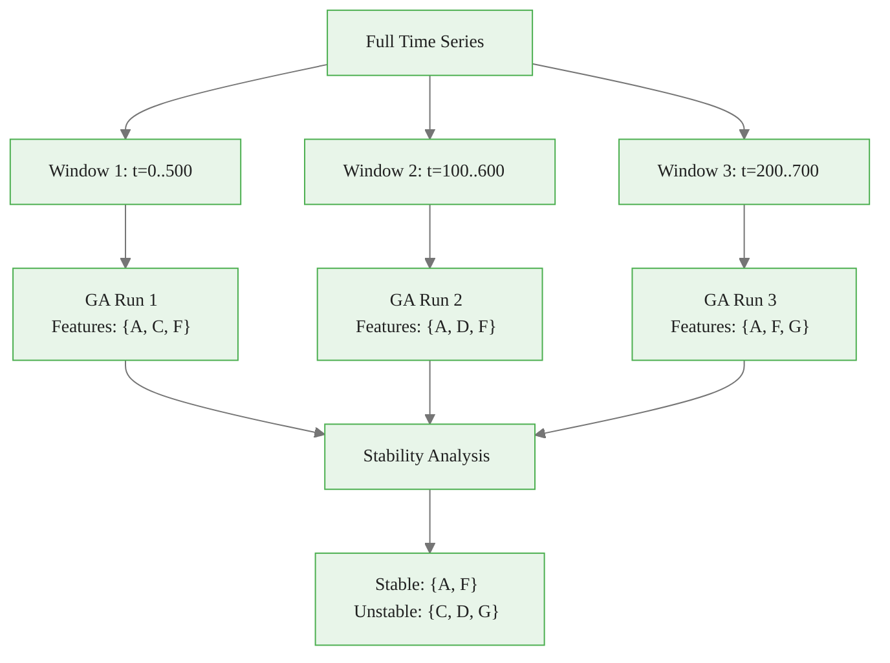
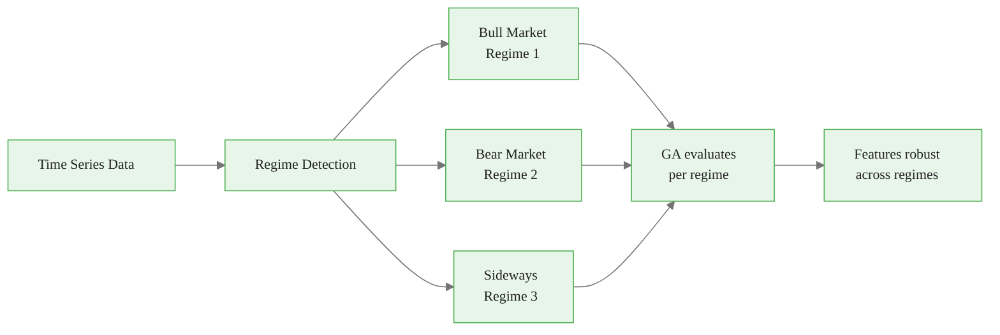

<!-- _class: lead -->
<!-- Speaker notes: This deck covers the unique challenges of applying GA feature selection to time series data. The three main issues: temporal validation (no future leakage), feature stability (relationships drift over time), and regime awareness (market conditions change). Standard ML assumptions of i.i.d. samples do not hold for time series. -->

# Time Series Considerations for GA Feature Selection

## Module 03 — Time Series

Temporal validation, rolling selection, and regime awareness

---

<!-- Speaker notes: This comparison table highlights the four key differences between standard ML and time series feature selection. The most dangerous is data ordering: standard ML assumes samples are independent, but time series samples are temporally dependent. Using random k-fold on time series leaks future information into training, giving unrealistically optimistic results. Walk through each row and emphasize the consequences of ignoring these differences. -->

## The Time Series Challenge

Time series feature selection has unique constraints that violate standard ML assumptions:


| Challenge | Standard ML | Time Series |
|-----------|------------|-------------|
| **Data ordering** | i.i.d. samples | Temporal dependence |
| **Validation** | Random k-fold | Walk-forward only |
| **Feature stability** | Static relationships | Relationships drift |
| **Data volume** | Collect more | Fixed history |

> Standard cross-validation **leaks future information** into training.

<div class="callout-warning">

**Warning:** Even a single future observation leaking into training can inflate accuracy metrics by 20-50% for autocorrelated financial data.

</div>

---

<!-- Speaker notes: The ASCII diagrams make the problem visually obvious. In standard k-fold, fold 3 uses future data (folds 4 and 5) for training to predict the past. This is cheating. Walk-forward always trains on past data and tests on future data, with a gap to prevent autocorrelation leakage. The checkmark and X marks reinforce which approach is correct. -->

## Why Standard CV Fails for Time Series

```
STANDARD K-FOLD (WRONG for time series):

Time: ──────────────────────────────────>
Fold 1: [TEST]  [TRAIN] [TRAIN] [TRAIN] [TRAIN]
Fold 2: [TRAIN] [TEST]  [TRAIN] [TRAIN] [TRAIN]
Fold 3: [TRAIN] [TRAIN] [TEST]  [TRAIN] [TRAIN]
                                  ^^^^^
                          Training on FUTURE data!

WALK-FORWARD (CORRECT):

Time: ──────────────────────────────────>
Fold 1: [TRAIN TRAIN TRAIN] gap [TEST]
Fold 2: [TRAIN TRAIN TRAIN TRAIN] gap [TEST]
Fold 3: [TRAIN TRAIN TRAIN TRAIN TRAIN] gap [TEST]

     ✓ Always train on past, test on future
```

---

<!-- Speaker notes: The walk_forward_split function generates train/test index pairs that respect temporal ordering. Key parameters: train_size controls the fraction of data used for training, gap prevents autocorrelation leakage between train and test sets. The function computes test_size from the remaining data divided by n_splits. Each split uses all data before the gap as training and a fixed-size window after the gap as testing. -->

## Walk-Forward Validation


<div class="code-window">
<div class="code-header">
<div class="dots"><span class="dot-red"></span><span class="dot-yellow"></span><span class="dot-green"></span></div>
<span class="filename">walk_forward_split.py</span>
</div>

```python
def walk_forward_split(
    n_samples: int,
    n_splits: int = 5,
    train_size: float = 0.7,
    gap: int = 0
) -> List[Tuple[np.ndarray, np.ndarray]]:
    """Generate walk-forward validation splits."""
    splits = []
    test_size = int(n_samples * (1 - train_size) / n_splits)

    for i in range(n_splits):
        test_end = n_samples - (n_splits - i - 1) * test_size
        test_start = test_end - test_size
        train_end = test_start - gap

        train_idx = np.arange(0, train_end)
        test_idx = np.arange(test_start, test_end)
        splits.append((train_idx, test_idx))

    return splits
```

</div>

---

<!-- Speaker notes: Purged k-fold goes beyond standard walk-forward by removing samples near the train/test boundary on BOTH sides of the test set. This prevents autocorrelation from leaking information across the boundary. The purge window should be set to the lag where the autocorrelation function drops below the significance threshold. The Mermaid diagram shows the purge zones (yellow) between train (left) and test (red) blocks. -->

## Purged K-Fold: Preventing Leakage



Purging removes samples near train/test boundaries to prevent autocorrelation leakage.

<div class="callout-insight">

**Insight:** Set the purge window to the lag where the autocorrelation function (ACF) drops below the significance threshold (typically 1.96/sqrt(n)).

</div>


<div class="code-window">
<div class="code-header">
<div class="dots"><span class="dot-red"></span><span class="dot-yellow"></span><span class="dot-green"></span></div>
<span class="filename">example.py</span>
</div>

```python
# Purge window removes samples within 10 steps of boundary
train_idx.extend(range(0, max(0, test_start - purge_window)))
train_idx.extend(range(min(n_samples, test_end + purge_window), n_samples))
```

</div>

---

<!-- Speaker notes: This GA fitness function uses proper temporal validation. The create_timeseries_fitness function creates a closure that captures the walk-forward splits. Each individual is evaluated by training a model on each temporal training set and testing on the corresponding test set. The feature penalty is normalized by chromosome length to be scale-invariant. The splits are computed once and reused for all evaluations. -->

## GA Fitness with Time Series CV


<div class="code-window">
<div class="code-header">
<div class="dots"><span class="dot-red"></span><span class="dot-yellow"></span><span class="dot-green"></span></div>
<span class="filename">create_timeseries_fitness.py</span>
</div>

```python
def create_timeseries_fitness(X, y, n_splits=5, gap=5):
    """Fitness function with proper temporal validation."""
    splits = walk_forward_split(len(y), n_splits=n_splits, gap=gap)

    def fitness_function(individual):
        selected = [i for i, bit in enumerate(individual) if bit == 1]
        if len(selected) == 0:
            return (float('inf'),)

        X_selected = X[:, selected]
        errors = []

        for train_idx, test_idx in splits:
            model = RandomForestRegressor(n_estimators=50, random_state=42)
            model.fit(X_selected[train_idx], y[train_idx])
            predictions = model.predict(X_selected[test_idx])
            mse = np.mean((y[test_idx] - predictions) ** 2)
            errors.append(mse)

        feature_penalty = 0.01 * len(selected) / len(individual)
        return (np.mean(errors) + feature_penalty,)

    return fitness_function
```

</div>

---

<!-- _class: lead -->
<!-- Speaker notes: Non-stationarity is the second major challenge for time series feature selection. Relationships between features and the target can change over time (concept drift, regime changes). Features that are predictive in one period may be useless in another. Rolling feature selection and stability analysis address this. -->

# Handling Non-Stationarity

---

<!-- Speaker notes: Rolling feature selection runs the GA on overlapping time windows and tracks which features are consistently selected. The Mermaid diagram shows three overlapping windows, each producing a different feature set. Stability analysis reveals which features are consistently selected (stable: A, F) versus those that appear only in certain windows (unstable: C, D, G). Stable features are more likely to generalize. -->

## Rolling Feature Selection



Run GA on rolling windows to track how selected features change over time.

<div class="callout-key">

**Key:** Features selected in >80% of rolling windows are "core features" -- they should form the baseline of any model, with regime-specific features added on top.

</div>

---

<!-- Speaker notes: The analyze_feature_stability function counts how often each feature is selected across rolling windows. Features selected in more than 50% of windows are considered stable. The bar chart visualization makes it easy to see which features are consistently selected (above 50% threshold) versus those that appear sporadically. The most_stable list returns the top 10 features by selection frequency. -->

## Feature Stability Analysis


<div class="code-window">
<div class="code-header">
<div class="dots"><span class="dot-red"></span><span class="dot-yellow"></span><span class="dot-green"></span></div>
<span class="filename">analyze_feature_stability.py</span>
</div>

```python
def analyze_feature_stability(rolling_results, n_features):
    """Analyze stability of selected features across windows."""
    feature_counts = np.zeros(n_features)

    for result in rolling_results:
        for feat in result['selected_features']:
            feature_counts[feat] += 1

    selection_frequency = feature_counts / len(rolling_results)
    stable_features = np.where(selection_frequency > 0.5)[0].tolist()

    return {
        'selection_frequency': selection_frequency,
        'stable_features': stable_features,
        'most_stable': np.argsort(selection_frequency)[::-1][:10].tolist()
    }
```

</div>

```
Feature Stability Over Rolling Windows:

Feature A: ████████████████████  100%  ← STABLE
Feature F: ████████████████░░░░   80%  ← STABLE
Feature C: ████████░░░░░░░░░░░░   40%  ← UNSTABLE
Feature D: ████░░░░░░░░░░░░░░░░   20%  ← UNSTABLE
```

---

<!-- Speaker notes: Regime-aware selection evaluates feature subsets across different market regimes (bull, bear, sideways). Features that perform well across all regimes are more robust than those that only work in one condition. The Mermaid diagram shows the data flowing through regime detection, then separate GA evaluations per regime, with the final output being features that are robust across all regimes. The fitness function averages errors across regimes. -->

## Regime-Aware Selection




<div class="code-window">
<div class="code-header">
<div class="dots"><span class="dot-red"></span><span class="dot-yellow"></span><span class="dot-green"></span></div>
<span class="filename">regime_aware_fitness.py</span>
</div>

```python
def regime_aware_fitness(X, y, regime_labels):
    """Evaluate feature subsets across market regimes."""
    def fitness_function(individual):
        regime_errors = []
        for regime in np.unique(regime_labels):
            mask = regime_labels == regime
            # Train/test within each regime
            error = evaluate_in_regime(X, y, mask, individual)
            regime_errors.append(error)
        return (np.mean(regime_errors),)
    return fitness_function
```

</div>

---

<!-- Speaker notes: Multi-horizon selection finds features that work across multiple forecast horizons. A feature that predicts 1-day returns may not predict 20-day returns. The y_dict parameter maps horizon names to target vectors. The horizon_weights parameter controls the importance of each horizon. Features selected across all horizons (like Feature A in the example) are the most robust and generalizable. -->

## Multi-Horizon Selection

Select features that perform well across multiple forecast horizons:

```
Horizon 1 (1-day):   Features {A, B, C}
Horizon 2 (5-day):   Features {A, C, D}
Horizon 3 (20-day):  Features {A, D, E}
                               ^
                         Feature A robust
                         across all horizons
```


<div class="code-window">
<div class="code-header">
<div class="dots"><span class="dot-red"></span><span class="dot-yellow"></span><span class="dot-green"></span></div>
<span class="filename">multi_horizon_fitness.py</span>
</div>

```python
def multi_horizon_fitness(X, y_dict, horizon_weights=None):
    """Select features across multiple forecast horizons."""
    def fitness_function(individual):
        weighted_error = 0
        for horizon, y in y_dict.items():
            weight = horizon_weights.get(horizon, 1.0 / len(y_dict))
            error = evaluate_horizon(X, y, individual)
            weighted_error += weight * error
        return (weighted_error,)
    return fitness_function
```

</div>

---

<!-- Speaker notes: Lag feature creation expands the feature space by creating lagged versions of each feature. With 3 original features and max_lag=3, you get 12 features total (3 original + 9 lagged). The GA then selects from this expanded feature space. The np.roll function shifts the data, and rows with NaN (from the shift) are removed. The key insight: the GA can discover which historical time steps are most predictive without manual lag specification. -->

## Lag Feature Handling


<div class="code-window">
<div class="code-header">
<div class="dots"><span class="dot-red"></span><span class="dot-yellow"></span><span class="dot-green"></span></div>
<span class="filename">create_lag_features.py</span>
</div>

```python
def create_lag_features(X, feature_names, max_lag=5):
    """Create lagged versions of features."""
    lag_features, lag_names = [], []
    for lag in range(1, max_lag + 1):
        lagged = np.roll(X, lag, axis=0)
        lagged[:lag] = np.nan  # Invalid rows
        lag_features.append(lagged)
        for name in feature_names:
            lag_names.append(f"{name}_lag{lag}")

    X_lagged = np.column_stack([X] + lag_features)
    valid_rows = ~np.any(np.isnan(X_lagged), axis=1)
    return X_lagged[valid_rows], lag_names, valid_rows
```

</div>

```
Original features:  [price, volume, sentiment]
With lag=3:         [price, volume, sentiment,
                     price_lag1, volume_lag1, sentiment_lag1,
                     price_lag2, volume_lag2, sentiment_lag2,
                     price_lag3, volume_lag3, sentiment_lag3]

GA selects from 12 features instead of 3
```

---

<!-- Speaker notes: These takeaways summarize the five essential principles for time series GA feature selection. Always use temporal validation (never shuffle). Walk-forward is the gold standard because it mimics real forecasting. Purging prevents autocorrelation leakage. Rolling analysis tracks feature drift. Multi-horizon testing ensures features generalize across different forecasting timeframes. -->

## Key Takeaways

| Principle | Implementation |
|-----------|---------------|
| **Always temporal validation** | Walk-forward, never shuffle |
| **Walk-forward is gold standard** | Mimics real forecasting |
| **Purging prevents leakage** | Remove boundary observations |
| **Rolling analysis for drift** | Track feature stability |
| **Multi-horizon robustness** | Features that generalize |

---

<!-- Speaker notes: This ASCII summary provides a quick reference for the three pillars of time series GA feature selection: validation (walk-forward), stability (rolling windows), and robustness (multi-horizon). Each column shows the approach and key takeaway. The checkmarks reinforce the correct practices. -->

<div class="callout-danger">

🚨 **Warning:** Standard k-fold on autocorrelated data can show 2-10x better performance than reality. Always use walk-forward for time series.

</div>

<div class="flow">
<div class="flow-step blue">Walk-Forward</div>
<div class="flow-arrow">→</div>
<div class="flow-step amber">Rolling Stability</div>
<div class="flow-arrow">→</div>
<div class="flow-step mint">Multi-Horizon</div>
</div>

## Visual Summary

```
TIME SERIES GA FEATURE SELECTION
=================================

1. VALIDATION         2. STABILITY          3. ROBUSTNESS
Walk-Forward Only     Rolling Windows       Multi-Horizon

Past ──> Future       Win1: {A,B,C}         1-day:  {A,B}
[TRAIN] gap [TEST]    Win2: {A,C,D}         5-day:  {A,C}
[TRAIN──] gap [TEST]  Win3: {A,B,D}         20-day: {A,D}
[TRAIN────] gap [TEST]                       ↓
                      Stable: {A}            Robust: {A}

     ✓ No future leak     ✓ Drift-aware       ✓ Generalizes
```

> **Next**: Walk-forward validation deep dive with expanding vs fixed windows.
