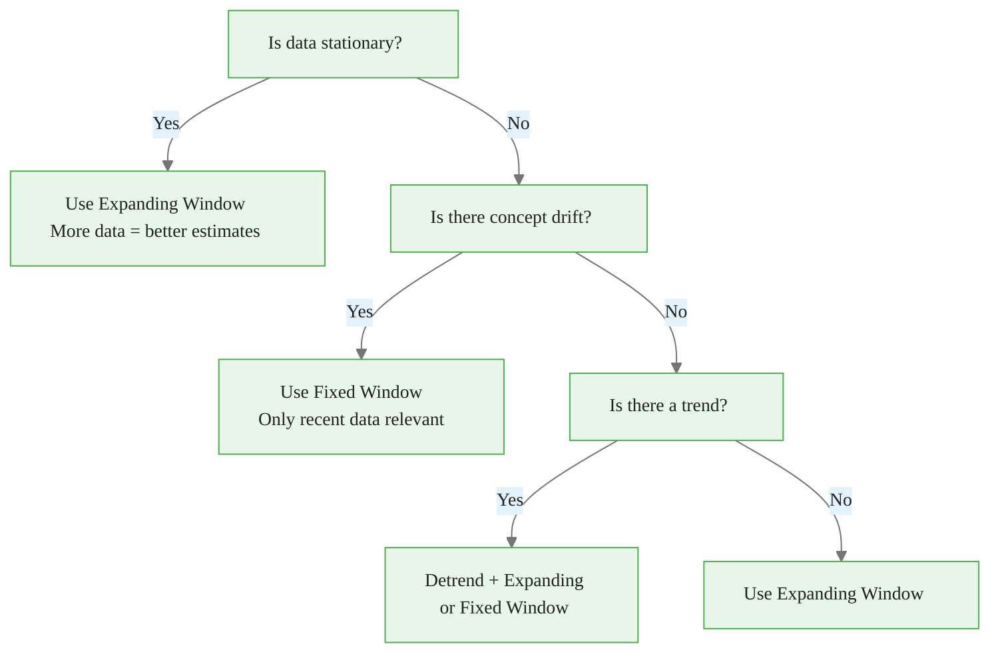

<!-- _class: lead -->
<!-- Speaker notes: This deck is a deep dive into walk-forward validation, the gold standard for temporal evaluation. It covers the temporal constraint, fixed vs expanding windows, the gap parameter, and common pitfalls. This is the most important validation topic for financial and time series applications. -->

# Walk-Forward Validation for Time Series

## Module 03 — Time Series

Respecting temporal ordering in feature selection

---

<!-- Speaker notes: The temporal constraint is absolute: all training data must precede all test data. The formal notation shows this clearly. Violations create unrealistically optimistic estimates because the model sees future information during training. The code example shows the wrong way (standard cross_val_score) and the right way (WalkForwardValidator). The statistic that standard k-fold on autocorrelated data shows 2-10x better performance than reality is a powerful motivator. -->

## Why Standard CV is Invalid for Time Series


Standard k-fold trains on future data to predict the past:

$$\forall (x_{train}, y_{train}) \in D_{train}, (x_{test}, y_{test}) \in D_{test}: t_{train} < t_{test}$$

This temporal constraint **must** hold. Violations create unrealistic optimistic estimates.


<div class="code-window">
<div class="code-header">
<div class="dots"><span class="dot-red"></span><span class="dot-yellow"></span><span class="dot-green"></span></div>
<span class="filename">example.py</span>
</div>

```python
# WRONG - trains on future to predict past!
from sklearn.model_selection import cross_val_score
scores = cross_val_score(model, X, y, cv=5)  # DON'T DO THIS

# RIGHT - respects temporal order
validator = WalkForwardValidator(n_splits=5, expanding=True)
```

</div>

<div class="callout-info">

ℹ️ Standard k-fold on autocorrelated data can show **2-10x better** performance than reality.

</div>

---

<!-- Speaker notes: The Mermaid diagram contrasts fixed-window and expanding-window walk-forward. Fixed window uses a sliding window of constant size -- only recent data is used for training. Expanding window starts small and grows, using all available history. Fixed is better for non-stationary data where old observations are irrelevant. Expanding is better for stationary data where more data always helps. -->

## Walk-Forward Procedure

```mermaid
%%{init: {"theme": "base", "themeVariables": {"primaryColor": "#e8f5e9", "primaryBorderColor": "#4caf50", "primaryTextColor": "#212121", "secondaryColor": "#e3f2fd", "tertiaryColor": "#fff8e1", "lineColor": "#757575", "fontFamily": "Inter, sans-serif", "fontSize": "14px"}}}%%
flowchart TD
    subgraph "Fixed-Window Walk-Forward"
        A1["[──TRAIN──][TEST]"] --> A2["   [──TRAIN──][TEST]"]
        A2 --> A3["      [──TRAIN──][TEST]"]
        A3 --> A4["         [──TRAIN──][TEST]"]
    end
    subgraph "Expanding-Window Walk-Forward"
        B1["[TRAIN][TEST]"] --> B2["[──TRAIN──][TEST]"]
        B2 --> B3["[────TRAIN────][TEST]"]
        B3 --> B4["[──────TRAIN──────][TEST]"]
    end
```



**Fixed Window**: $D_{[t-w:t]}$ — Only recent data (non-stationary series)
**Expanding Window**: $D_{[0:t]}$ — All historical data (stationary series)

---

<!-- Speaker notes: The performance metric is the average loss across all folds. Each fold tests on future data relative to its training data. The example shows four folds with decreasing scores (0.85 to 0.79 to 0.81), suggesting possible concept drift in fold 3. If scores consistently degrade over time, this is a signal that the feature-target relationships are changing. -->

## Performance Metric

$$\text{Score} = \frac{1}{n_{folds}} \sum_{i=1}^{n_{folds}} \text{Loss}(\hat{y}_i, y_i)$$

Each fold tests on **future data** relative to training data.

```
Fold 1: Train [0..600]       → Test [600..700]   Score: 0.85
Fold 2: Train [0..700]       → Test [700..800]   Score: 0.82
Fold 3: Train [0..800]       → Test [800..900]   Score: 0.79
Fold 4: Train [0..900]       → Test [900..1000]  Score: 0.81

Average Score: 0.8175

Note: Scores may degrade over time (concept drift signal)
```

---

<!-- Speaker notes: The WalkForwardValidator class generates fold objects with train and test indices. The expanding parameter controls whether the training window grows (True) or slides (False). The gap parameter adds a buffer between train and test to prevent autocorrelation leakage. For fixed window, min_train_size must be specified. The split method yields TimeSeriesFold objects containing the index arrays and fold number. -->

## WalkForwardValidator Implementation


<div class="code-window">
<div class="code-header">
<div class="dots"><span class="dot-red"></span><span class="dot-yellow"></span><span class="dot-green"></span></div>
<span class="filename">walkforwardvalidator.py</span>
</div>

```python
class WalkForwardValidator:
    def __init__(self, n_splits=5, test_size=None,
                 expanding=True, min_train_size=None, gap=0):
        self.n_splits = n_splits
        self.test_size = test_size
        self.expanding = expanding
        self.min_train_size = min_train_size
        self.gap = gap

    def split(self, X, y=None):
        n_samples = len(X)
        test_size = self.test_size or max(1, n_samples // (self.n_splits + 1))

        for i in range(self.n_splits):
            test_end = n_samples - (self.n_splits - i - 1) * test_size
            test_start = test_end - test_size
            train_end = test_start - self.gap

            if self.expanding:
                train_start = 0  # Use all history
            else:
                train_start = max(0, train_end - self.min_train_size)

            yield TimeSeriesFold(
                train_indices=np.arange(train_start, train_end),
                test_indices=np.arange(test_start, test_end),
                fold_number=i
            )
```

</div>

---

<!-- Speaker notes: The gap parameter is the most commonly overlooked detail. Without a gap, the last training sample and first test sample may be strongly autocorrelated, leaking information. The ASCII diagrams show the problem: adjacent samples share autocorrelation. With gap=10, a 10-sample buffer breaks the autocorrelation chain. The rule of thumb: set gap to the lag where the ACF drops below the significance threshold (typically 1.96/sqrt(n)). -->

## The Gap Parameter: Preventing Autocorrelation Leakage

```
WITHOUT GAP (Leakage risk):
Time: ─────────────────────────>
      [TRAIN TRAIN TRAIN][TEST TEST]
                        ^  ^
                 Adjacent samples share
                 autocorrelation info!

WITH GAP = 10 (Safe):
Time: ─────────────────────────>
      [TRAIN TRAIN][__GAP__][TEST TEST]
                   ^^^^^^^^^^
                   10 samples buffer
                   breaks autocorrelation
```

Rule of thumb: Set gap to the lag where ACF drops below significance threshold.


<div class="code-window">
<div class="code-header">
<div class="dots"><span class="dot-red"></span><span class="dot-yellow"></span><span class="dot-green"></span></div>
<span class="filename">example.py</span>
</div>

```python
# Bad - no gap
validator = WalkForwardValidator(gap=0)

# Good - gap prevents immediate autocorrelation leakage
validator = WalkForwardValidator(gap=10)
```

</div>

---

<!-- Speaker notes: This decision tree helps choose between fixed and expanding windows. If data is stationary, use expanding window (more data helps). If there is concept drift, use fixed window (only recent data is relevant). If there is a trend but no drift, detrend first then use expanding. The table summarizes: expanding is best for stationary data but risks including irrelevant old data; fixed handles drift but may have small training sets. -->

## Fixed vs Expanding Window Decision



| Window Type | Best For | Risk |
|-------------|----------|------|
| **Expanding** | Stationary series | Old irrelevant data |
| **Fixed** | Non-stationary, drift | Small training sets |

---

<!-- Speaker notes: This function evaluates a feature subset using walk-forward validation. It takes a chromosome, extracts selected features, and iterates over the validator's folds. For each fold, it trains a fresh model on the training set and evaluates on the test set. The mean fold score is the fitness value. This is the function that the GA calls for each individual during evolution. -->

## Feature Selection with Walk-Forward


<div class="code-window">
<div class="code-header">
<div class="dots"><span class="dot-red"></span><span class="dot-yellow"></span><span class="dot-green"></span></div>
<span class="filename">walk_forward_feature_selection.py</span>
</div>

```python
def walk_forward_feature_selection(
    X, y, chromosome, model_fn, validator, metric=None
):
    """Evaluate feature subset using walk-forward validation."""
    from sklearn.metrics import mean_squared_error
    metric = metric or mean_squared_error

    selected_features = np.where(chromosome == 1)[0]
    if len(selected_features) == 0:
        return float('inf')

    X_selected = X[:, selected_features]
    fold_scores = []

    for fold in validator.split(X_selected, y):
        X_train = X_selected[fold.train_indices]
        y_train = y[fold.train_indices]
        X_test = X_selected[fold.test_indices]
        y_test = y[fold.test_indices]

        model = model_fn()
        model.fit(X_train, y_train)
        y_pred = model.predict(X_test)
        fold_scores.append(metric(y_test, y_pred))

    return np.mean(fold_scores)
```

</div>

---

<!-- Speaker notes: Blocked walk-forward adds embargo periods on BOTH sides of the test set. Standard walk-forward only prevents training on future data, but in financial applications, information can also leak backward (e.g., a news event affects both recent training data and future test data). The symmetric gap prevents both forward and backward leakage. This is the standard approach for backtesting financial trading strategies. -->

## Advanced: Blocked Walk-Forward

For strongly autocorrelated data, add gaps on **both** sides of test set:

```
STANDARD:
[TRAIN TRAIN TRAIN][TEST TEST][next window...]

BLOCKED (Symmetric gap):
[TRAIN TRAIN][GAP][TEST TEST][GAP][TRAIN TRAIN]
              ^^^             ^^^
         Embargo period   Embargo period

Prevents information leakage from:
- Recent training observations (forward leakage)
- Future training observations (backward leakage)
```

Use case: Financial data where news spreads gradually and orders execute over time.

---

<!-- Speaker notes: This comparison demonstrates the magnitude of the problem. On highly autocorrelated data (AR coefficient 0.95), standard k-fold gives MSE of 0.012, but walk-forward gives 0.089 -- a 7x difference. The standard approach is 7 times more optimistic than reality. This is not a theoretical concern; it is a practical disaster that leads to selecting feature subsets that fail in production. Always use walk-forward for time series. -->

## Danger: Wrong CV Comparison


<div class="code-window">
<div class="code-header">
<div class="dots"><span class="dot-red"></span><span class="dot-yellow"></span><span class="dot-green"></span></div>
<span class="filename">example.py</span>
</div>

```python
# Generate highly autocorrelated data
y = np.zeros(1000)
for t in range(1, 1000):
    y[t] = 0.95 * y[t-1] + 0.1 * np.random.randn()

# WRONG: Standard k-fold
mse_wrong = -cross_val_score(model, X, y, cv=5,
                              scoring='neg_mean_squared_error').mean()

# RIGHT: Walk-forward
mse_right = walk_forward_evaluate(model, X, y)
```

</div>

```
Standard k-fold CV (WRONG):      MSE = 0.012  ← Overly optimistic!
Walk-forward CV (RIGHT):         MSE = 0.089  ← Realistic
Ratio (wrong/right):             0.13x

Standard k-fold gives 7x better performance than reality!
```

---

<!-- Speaker notes: This pitfall table is a practical reference. The five most common mistakes: using standard k-fold (trains on future), no gap (autocorrelation leaks), too few test samples (unreliable), expanding on non-stationary data (old data irrelevant), and single validation path (not robust). Each has a clear solution. Combinatorial purged CV is the advanced technique for maximum robustness. -->

## Common Pitfalls

| Pitfall | Problem | Solution |
|---------|---------|----------|
| **Standard k-fold** | Trains on future | Walk-forward only |
| **No gap** | Autocorrelation leaks | Set gap = ACF decay length |
| **Too few test samples** | Unreliable estimates | test_size >= 50 |
| **Expanding on non-stationary** | Old data irrelevant | Use fixed window |
| **Single validation path** | Not robust | Combinatorial purged CV |

---

<!-- Speaker notes: This ASCII decision tree is the key takeaway. Four simple questions determine the correct validation strategy: Is data time-ordered? Is it stationary? Is it autocorrelated? How much data is available? Following this tree leads to realistic performance estimates that match production behavior. The final line emphasizes the practical benefit: your backtested performance will match what you see in production. -->

<div class="callout-key">

🔑 **Key Point:** Walk-forward validation is the gold standard for time series. The gap parameter prevents autocorrelation leakage.

</div>

<div class="flow">
<div class="flow-step blue">Temporal Order</div>
<div class="flow-arrow">→</div>
<div class="flow-step amber">Walk-Forward</div>
<div class="flow-arrow">→</div>
<div class="flow-step mint">Realistic Estimates</div>
</div>

## Key Takeaways

```
WALK-FORWARD VALIDATION DECISION TREE
=======================================

1. Is data time-ordered?
   YES → Use walk-forward (NEVER random splits)

2. Is data stationary?
   YES → Expanding window (more data helps)
   NO  → Fixed window (only recent data)

3. Is data autocorrelated?
   YES → Add gap between train/test
   NO  → Gap = 0 is fine

4. How much data?
   LOTS → More splits, smaller test
   LITTLE → Fewer splits, larger test

Result: Realistic performance estimates
        that match production behavior!
```

> **Next**: Lag feature selection — which past values predict the future?
