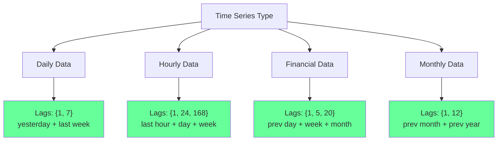
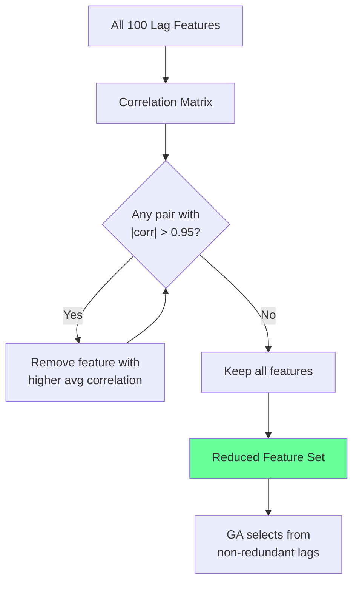

<!-- _class: lead -->
<!-- Speaker notes: This deck covers lag feature selection, which is the intersection of time series analysis and GA feature selection. The core tension: lag features capture temporal dependencies (beneficial) but introduce multicollinearity (harmful). The GA must navigate this tradeoff. -->

# Lag Feature Selection for Time Series

## Module 03 — Time Series

Balancing autocorrelation benefits against multicollinearity risks

---

<!-- Speaker notes: Lag features are simply past values of a variable used as predictors. Lag-1 of a daily series is yesterday's value, lag-7 is last week's same day. For multivariate series with p variables and L max lags, the feature space grows to p times L features. This expansion is exactly the kind of combinatorial problem where GAs excel -- too many combinations for exhaustive search, with interactions between lags that greedy methods miss. -->

## What Are Lag Features?

Given time series $\{y_1, y_2, ..., y_T\}$, a lag-$k$ feature is:

$$x_t^{(k)} = y_{t-k}$$

```
Original Series:  [10, 12, 15, 13, 18, 20, ...]
                    t1  t2  t3  t4  t5  t6

Lag-1 Feature:    [--  10, 12, 15, 13, 18, ...]
Lag-2 Feature:    [--  --  10, 12, 15, 13, ...]
Lag-7 Feature:    (same day last week)
Lag-365 Feature:  (same day last year)
```

For multivariate series: Total features = $p \times L$ (variables x max lag)

---

<!-- Speaker notes: ACF shows total correlation at each lag (includes indirect effects through intermediate lags). PACF shows the NEW information contributed by each lag after removing the effect of all shorter lags. The ASCII bar charts illustrate: ACF decays slowly (many seemingly significant lags that are actually redundant), while PACF cuts off sharply (only lags 1, 2, and 7 are truly informative). PACF is more useful for selecting specific lags because it removes redundant information. -->

## ACF vs PACF: Which Lags Matter?

```
ACF (Autocorrelation):            PACF (Partial Autocorrelation):
Shows total correlation            Shows NEW info at each lag

Lag:  1  2  3  4  5  6  7         Lag:  1  2  3  4  5  6  7
     ██                                ██
     ██ ██                             ██ ██
     ██ ██ █                           ██ ██
     ██ ██ █ █                         ██ ██          █
     ██ ██ █ █                         ██ ██          █
     ██ ██ █ █                         ██ ██          █
     ██ ██ █ █ . . . .                 ██ ██ . . . .  █ .

ACF decays slowly → many               PACF cuts off → lags 1,2,7
"significant" lags (redundant)          are truly informative
```

**PACF is more useful** for selecting specific lags (removes intermediate effects).

---

<!-- Speaker notes: Lag features are naturally correlated because consecutive lags share most of their values (lag-1 and lag-2 differ by only one observation). The VIF (Variance Inflation Factor) quantifies this: VIF > 10 indicates problematic multicollinearity. The correlation matrix shows how all lags are highly correlated (0.80 to 0.95). This causes numerical instability in regression and inflated coefficient variance. The GA fitness function should penalize high VIF. -->

## The Multicollinearity Problem

Lag features are naturally correlated:

$$\text{VIF}_j = \frac{1}{1 - R_j^2}$$

```
Correlation Matrix for Lags 1-5:

       Lag1  Lag2  Lag3  Lag4  Lag5
Lag1   1.00  0.95  0.90  0.85  0.80
Lag2   0.95  1.00  0.95  0.90  0.85
Lag3   0.90  0.95  1.00  0.95  0.90
Lag4   0.85  0.90  0.95  1.00  0.95
Lag5   0.80  0.85  0.90  0.95  1.00

VIF > 10 for all lags!
→ Numerical instability, inflated variance
```

> Rule of thumb: VIF > 10 indicates problematic multicollinearity.

---

<!-- Speaker notes: This Mermaid diagram shows common lag patterns by domain. Daily data typically uses lags 1 and 7 (yesterday and last week). Hourly data uses 1, 24, and 168 (last hour, day, week). Financial data uses 1, 5, and 20 (previous day, week, month). Monthly data uses 1 and 12 (previous month, previous year). The GA can discover these patterns automatically from data, but domain knowledge can guide the search space. -->

## Common Lag Patterns by Domain



GA can automatically discover these patterns without domain knowledge.

---

<!-- Speaker notes: The lag selection fitness function adds a VIF penalty to the standard walk-forward evaluation. Three penalties combine: prediction error (from walk-forward CV), complexity penalty (proportional to number of selected features), and VIF penalty (proportional to the number of features with VIF above the threshold). The VIF penalty discourages selecting redundant lag features that introduce multicollinearity. -->

## GA Fitness for Lag Selection

```python
def lag_selection_fitness(
    chromosome, X, y, model_fn, cv_splits,
    alpha_complexity=0.01, alpha_vif=0.05, vif_threshold=10.0
):
    """Fitness with multicollinearity penalty."""
    selected = np.where(chromosome == 1)[0]
    if len(selected) == 0:
        return float('inf')

    X_selected = X[:, selected]

    # Walk-forward evaluation
    fold_scores = []
    for fold in cv_splits:
        model = model_fn()
        model.fit(X_selected[fold.train_indices], y[fold.train_indices])
        y_pred = model.predict(X_selected[fold.test_indices])
        fold_scores.append(mean_squared_error(y[fold.test_indices], y_pred))

    avg_mse = np.mean(fold_scores)

    # Complexity penalty
    complexity_penalty = alpha_complexity * len(selected)

    # VIF penalty for multicollinearity
    vif_penalty = compute_vif_penalty(X_selected, alpha_vif, vif_threshold)

    return avg_mse + complexity_penalty + vif_penalty
```

---

<!-- Speaker notes: Lag-aware mutation respects the group structure of lag features. Standard mutation flips individual bits randomly, which can create inconsistent lag patterns (e.g., selecting lag 2 of variable X but not lag 1). Lag-aware mutation operates on entire variable groups, flipping all lags of a variable together. This produces more coherent mutations and converges faster because it respects the natural structure of the feature space. -->

## Lag-Aware Mutation

Standard mutation flips individual bits. Lag-aware mutation operates on groups:

```
Standard Mutation (random flips):
Before: [1,1,0, 0,1,0, 1,0,0]   # var1_lags, var2_lags, var3_lags
After:  [1,0,0, 0,1,1, 1,0,0]   # Inconsistent lag patterns

Lag-Aware Mutation (group flips):
Before: [1,1,0, 0,1,0, 1,0,0]
Groups: [var1  ] [var2  ] [var3  ]
After:  [1,1,0, 1,0,1, 1,0,0]   # Entire var2 group flipped
```

```python
def lag_aware_mutation(chromosome, lag_groups, mutation_rate=0.1):
    mutant = chromosome.copy()
    for group in lag_groups:
        if np.random.random() < mutation_rate:
            current_state = mutant[group[0]]
            mutant[group] = 1 - current_state  # Flip entire group
    return mutant
```

---

<!-- Speaker notes: The identify_significant_lags function uses ACF and PACF to find statistically significant lags. The 95% confidence interval is 1.96/sqrt(T). Lags where the ACF or PACF exceeds this threshold are candidates for inclusion. Using both ACF and PACF gives complementary information: ACF identifies general dependence, PACF identifies direct dependence. These significant lags form the candidate set for the GA search space. -->

## Identifying Significant Lags

```python
def identify_significant_lags(series, max_lag=40, method='both'):
    """Find statistically significant lags using ACF/PACF."""
    from statsmodels.tsa.stattools import acf, pacf

    acf_values = acf(series, nlags=max_lag, fft=True)
    pacf_values = pacf(series, nlags=max_lag, method='ywmle')

    # 95% confidence interval
    ci = 1.96 / np.sqrt(len(series))

    results = {}
    if method in ['acf', 'both']:
        results['acf'] = np.where(np.abs(acf_values[1:]) > ci)[0] + 1
    if method in ['pacf', 'both']:
        results['pacf'] = np.where(np.abs(pacf_values[1:]) > ci)[0] + 1

    return results
```

Significant lags: $|\rho(k)| > \frac{1.96}{\sqrt{T}}$ (95% confidence)

---

<!-- Speaker notes: Before running the GA, pre-filter redundant lag features by removing highly correlated pairs (correlation above 0.95). This reduces the search space and prevents the GA from wasting evaluations on near-duplicate features. The flowchart shows the iterative process: check correlation matrix, remove the feature with highest average correlation from any pair exceeding the threshold, repeat until no pairs remain. The GA then selects from this reduced, non-redundant set. -->

## Handling Redundant Lags



```python
def remove_redundant_lags(X, threshold=0.95):
    """Remove highly correlated lag features."""
    corr_matrix = X.corr().abs()
    upper = corr_matrix.where(np.triu(np.ones(corr_matrix.shape), k=1).astype(bool))
    to_drop = [col for col in upper.columns if any(upper[col] > threshold)]
    return X.drop(columns=to_drop)
```

---

<!-- Speaker notes: This ASCII pipeline shows the complete lag feature selection workflow from start to finish. Step 1 identifies candidate lags using ACF/PACF. Step 2 creates the feature matrix. Step 3 removes multicollinear features (VIF > 10). Step 4 runs the GA with lag-aware operators and VIF penalty. Step 5 uses walk-forward validation. Step 6 produces the final selected lag features. This is the reference workflow for lag feature selection. -->

## Complete Workflow

```
LAG FEATURE SELECTION PIPELINE
================================

Step 1: ACF/PACF Analysis
    → Identify candidate lags: {1, 2, 7, 14, 50}

Step 2: Create Lag Feature Matrix
    → 5 variables × 5 lags = 25 features

Step 3: Check Multicollinearity
    → Remove VIF > 10: down to 18 features

Step 4: GA with Lag-Aware Operators
    → Group mutation by variable
    → VIF penalty in fitness

Step 5: Walk-Forward Validation
    → Temporal evaluation (no future leakage)

Step 6: Selected Lags
    → {price_lag1, price_lag7, volume_lag1, sentiment_lag2}
```

---

<!-- Speaker notes: These five pitfalls cover the most common mistakes in lag feature selection. Too many lags causes overfitting and multicollinearity. Ignoring VIF leads to numerical instability. Wrong lag interpretation confuses prediction horizons. Missing seasonality loses important periodic patterns. No lag grouping creates inconsistent mutations. Each has a clear solution. -->

## Common Pitfalls

| Pitfall | Problem | Solution |
|---------|---------|----------|
| **Too many lags** | Overfitting + multicollinearity | Start with PACF-significant lags |
| **Ignoring VIF** | Numerical instability | Penalize VIF > 10 in fitness |
| **Wrong lag interpretation** | Lag-k ≠ k-step forecast | Lag-k predicts 1-step ahead using $y_{t-k}$ |
| **Missing seasonality** | Periodic patterns lost | Include seasonal lags (7, 30, 365) |
| **No lag grouping** | Inconsistent mutations | Use lag-aware operators |

---

<!-- Speaker notes: These takeaways summarize the key insights. PACF is more useful than ACF for selecting specific lags. Seasonal lags should always be included as candidates. Multicollinearity must be managed through VIF penalties. Domain knowledge helps narrow the search. Lag-aware operators respect the variable-lag group structure for more efficient search. -->

## Key Takeaways

| Insight | Detail |
|---------|--------|
| **PACF > ACF** | For selecting specific lags (removes intermediate effects) |
| **Seasonal lags critical** | Known cycles inform lag selection |
| **Multicollinearity management** | Penalize high VIF in fitness function |
| **Domain knowledge helps** | Known periods, reporting cycles |
| **Lag-aware operators** | Respect variable-lag group structure |

> **Next**: Stationarity requirements — ensuring features behave consistently over time.
