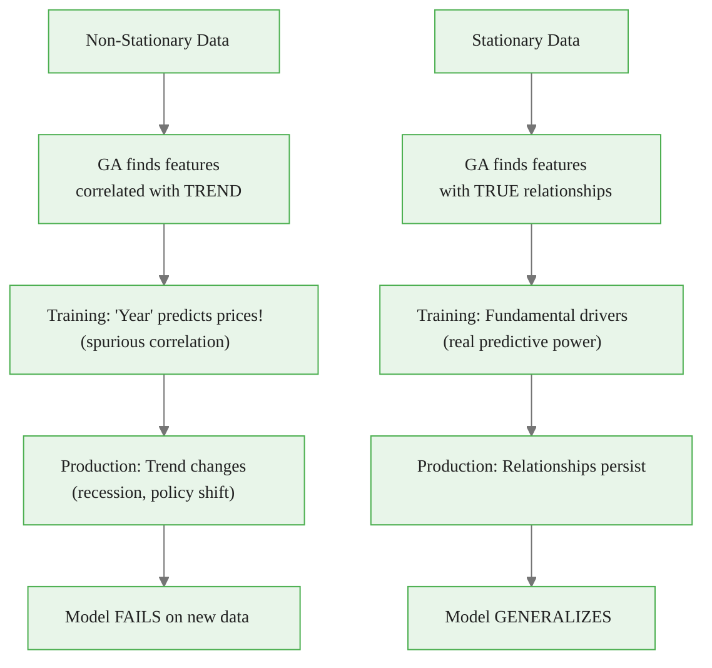
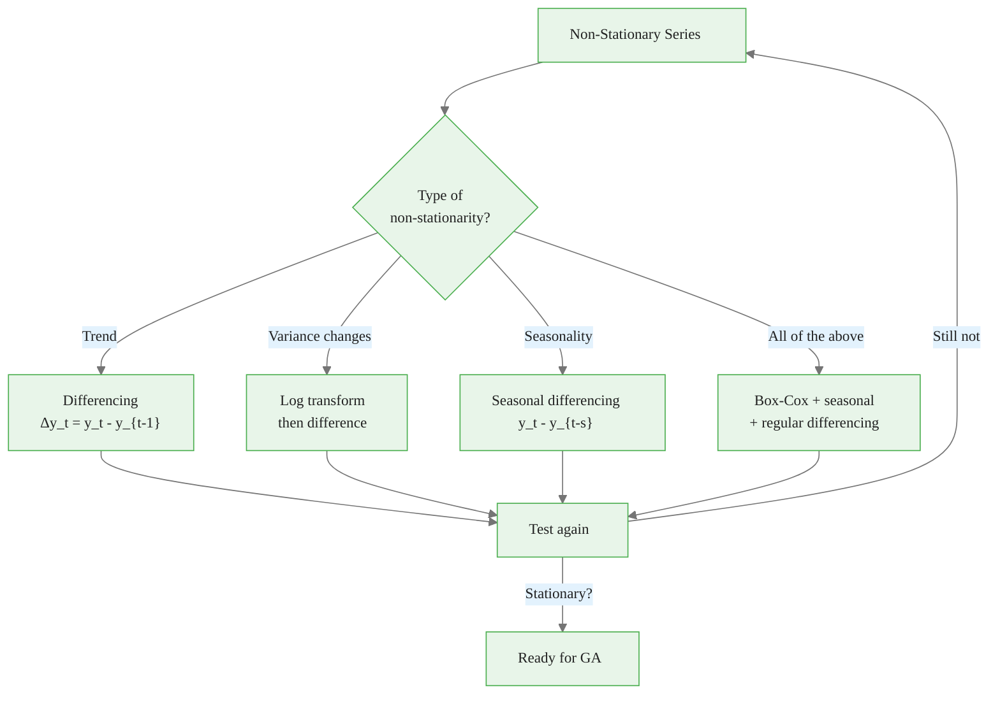

<!-- _class: lead -->
<!-- Speaker notes: This deck covers stationarity requirements for GA feature selection on time series. The core problem: non-stationary features create spurious correlations that fool the GA into selecting features with no real predictive power. Understanding and testing for stationarity is essential before running any feature selection. -->

# Stationarity Requirements for GA Feature Selection

## Module 03 — Time Series

Why non-stationary data causes spurious feature selection

---

<!-- Speaker notes: Weak stationarity requires three conditions: constant mean, constant variance, and time-invariant autocovariance. The ASCII diagrams show the difference visually. A stationary series oscillates around a fixed mean with consistent amplitude. A non-stationary series has a drifting mean or changing variance. When the GA encounters non-stationary features, it finds correlations that are artifacts of shared trends rather than genuine predictive relationships. -->

## What Is Stationarity?

A weakly stationary time series has:

1. **Constant mean**: $E[X_t] = \mu$ for all $t$
2. **Constant variance**: $\text{Var}(X_t) = \sigma^2$ for all $t$
3. **Time-invariant autocovariance**: $\text{Cov}(X_t, X_{t+k}) = \gamma(k)$

```
STATIONARY:                    NON-STATIONARY:

      ──/\──/\──/\──                    /
     /    \/    \/    \               /    ──/\
    /                  \            /    /    \
   Mean stays constant          Mean drifts over time
   Variance stays constant      Variance may change
```

> Non-stationarity causes GA to find **spurious relationships** that don't generalize.

---

<!-- Speaker notes: The Mermaid flowchart contrasts what happens with non-stationary vs stationary data. With non-stationary data, the GA finds features correlated with the TREND (spurious), which fails in production when the trend changes. With stationary data, the GA finds features with TRUE relationships (fundamental drivers), which persist in production. The red and green highlighting makes the consequences visually obvious. -->

## Why Stationarity Matters for Feature Selection



---

<!-- Speaker notes: This code example demonstrates the spurious correlation problem concretely. A random walk and a trend have NO real relationship with the target (which is built from stationary AR(1) and seasonal components), yet they show higher correlation (0.65 and 0.72) than the truly predictive features (0.48 and 0.35). The GA would naively select the random walk and trend because they appear more correlated. This is the fundamental danger of ignoring stationarity. -->

## The Spurious Correlation Problem


<div class="code-window">
<div class="code-header">
<div class="dots"><span class="dot-red"></span><span class="dot-yellow"></span><span class="dot-green"></span></div>
<span class="filename">example.py</span>
</div>

```python
# Non-stationary features
f1 = np.random.randn(500).cumsum()      # Random walk
f2 = np.arange(500) * 0.5 + noise       # Trend
f3 = 0.7*f3[t-1] + noise                # Stationary AR(1)

# Target built from STATIONARY components only
y = 2 * f3 + 1.5 * seasonal + noise

# Correlations with target:
Random_Walk:  correlation =  0.65  ← SPURIOUS!
Trend:        correlation =  0.72  ← SPURIOUS!
AR1:          correlation =  0.48  ← REAL
Seasonal:     correlation =  0.35  ← REAL
```

</div>

GA might select Random_Walk and Trend because they have **higher** correlation — but these are meaningless coincidences from shared trends!

---

<!-- Speaker notes: The ADF (Augmented Dickey-Fuller) test is the standard stationarity test. The null hypothesis is that the series has a unit root (non-stationary). A p-value below 0.05 means we reject the null and conclude stationarity. Best practice is to use both ADF and KPSS because they test different null hypotheses. The four possible combinations (both agree, both disagree, mixed) give a complete picture. KPSS tests the null that the series IS stationary, so the tests are complementary. -->

## Stationarity Testing

### ADF Test

Tests null hypothesis: series has a unit root (non-stationary)

$$\Delta y_t = \alpha + \beta t + \gamma y_{t-1} + \sum \delta_i \Delta y_{t-i} + \epsilon_t$$

| p-value | Conclusion |
|---------|------------|
| < 0.05 | Reject null → **Stationary** |
| >= 0.05 | Cannot reject → **Non-stationary** |

### Combined Testing (Best Practice)

| ADF | KPSS | Conclusion |
|-----|------|------------|
| Stationary | Stationary | **Stationary** |
| Non-stat | Non-stat | **Non-stationary** |
| Stationary | Non-stat | Difference-stationary |
| Non-stat | Stationary | Trend-stationary |

---

<!-- Speaker notes: The Mermaid flowchart shows the transformation pipeline for achieving stationarity. Depending on the type of non-stationarity (trend, variance changes, seasonality, or all), different transformations are applied. The key principle: transform, then test again, and repeat if necessary. The goal is to arrive at a stationary series that can be safely used for feature selection. -->

## Transformations to Achieve Stationarity



---

<!-- Speaker notes: The make_stationary function provides four transformation methods: first differencing (removes trends), log differencing (stabilizes variance and removes trends), detrending (subtracts linear trend), and seasonal differencing (removes periodic patterns). The auto_make_stationary function automatically tries increasing orders of differencing until the ADF test passes. This is the practical implementation for preparing features before GA selection. -->

## Transformation Code


<div class="code-window">
<div class="code-header">
<div class="dots"><span class="dot-red"></span><span class="dot-yellow"></span><span class="dot-green"></span></div>
<span class="filename">make_stationary.py</span>
</div>

```python
def make_stationary(series, method='diff', **kwargs):
    """Transform series to achieve stationarity."""
    if method == 'diff':
        return np.diff(series, n=kwargs.get('order', 1))
    elif method == 'log_diff':
        series_pos = series - series.min() + 1e-8
        return np.diff(np.log(series_pos))
    elif method == 'detrend':
        t = np.arange(len(series))
        coeffs = np.polyfit(t, series, deg=1)
        return series - np.polyval(coeffs, t)
    elif method == 'seasonal_diff':
        period = kwargs.get('period', 12)
        return series[period:] - series[:-period]

def auto_make_stationary(series, max_diff=2, alpha=0.05):
    """Automatically find and apply transformation."""
    for order in range(1, max_diff + 1):
        transformed = np.diff(series, n=order)
        if adf_test(transformed).is_stationary:
            return transformed, {'method': 'diff', 'order': order}
    return transformed, {'method': 'diff', 'order': max_diff}
```

</div>

---

<!-- Speaker notes: The stationarity penalty in the fitness function discourages the GA from selecting non-stationary features. Each selected feature is tested with ADF, and those that fail the stationarity test incur a penalty. This steers the GA toward stationary features that have genuine predictive power. The comparison at the bottom shows the dramatic difference: without the penalty, the GA selects spurious features; with the penalty, it selects the correct stationary features. -->

## GA Fitness with Stationarity Penalty


<div class="code-window">
<div class="code-header">
<div class="dots"><span class="dot-red"></span><span class="dot-yellow"></span><span class="dot-green"></span></div>
<span class="filename">stationary_feature_selection_fitness.py</span>
</div>

```python
def stationary_feature_selection_fitness(
    chromosome, X, y, model_fn, cv_splits,
    alpha_stationarity=0.1
):
    """Penalize selection of non-stationary features."""
    selected = np.where(chromosome == 1)[0]
    if len(selected) == 0:
        return float('inf')

    # Standard walk-forward evaluation
    avg_mse = evaluate_walk_forward(X[:, selected], y, model_fn, cv_splits)

    # Stationarity penalty
    n_nonstationary = 0
    for idx in selected:
        if not adf_test(X[:, idx]).is_stationary:
            n_nonstationary += 1

    penalty = alpha_stationarity * n_nonstationary

    return avg_mse + penalty
```

</div>

```
Feature Selection Comparison:
Without stationarity penalty: selects {Random_Walk, Trend, AR1}  ✗
With stationarity penalty:    selects {AR1, Seasonal, White_Noise}  ✓
```

---

<!-- Speaker notes: The prepare_stationary_features function transforms ALL features to stationary versions before running the GA. It tests each feature individually, applies auto-differencing to non-stationary ones, and returns the transformed dataset along with transformation metadata. The padding with NaN ensures length alignment, and dropna removes rows with missing values from the differencing. This preprocessing step should be done before GA selection. -->

## Preparing Stationary Features


<div class="code-window">
<div class="code-header">
<div class="dots"><span class="dot-red"></span><span class="dot-yellow"></span><span class="dot-green"></span></div>
<span class="filename">prepare_stationary_features.py</span>
</div>

```python
def prepare_stationary_features(X):
    """Transform all features to stationary versions."""
    X_stationary = pd.DataFrame(index=X.index)
    transform_info = {}

    for col in X.columns:
        series = X[col].values
        adf = adf_test(series)

        if adf.is_stationary:
            X_stationary[col] = series
            transform_info[col] = 'already stationary'
        else:
            transformed, info = auto_make_stationary(series)
            # Pad with NaN for length alignment
            padded = np.full(len(series), np.nan)
            padded[-len(transformed):] = transformed
            X_stationary[col] = padded
            transform_info[col] = info

    return X_stationary.dropna(), transform_info
```

</div>

---

<!-- Speaker notes: The before/after comparison is the most convincing slide. The random walk has correlation 0.65 with the target before transformation, but only 0.05 after first differencing. The trend drops from 0.72 to 0.02. These spurious correlations completely vanish after stationarity transformation, revealing that only the truly predictive features remain correlated. This is why stationarity testing and transformation are essential preprocessing steps. -->

## Before vs After Transformation

```
BEFORE (Non-Stationary):                AFTER (Stationary):

Random Walk:                            First Difference:
     /                                  ──/\──/\──/\──
    /  \                                    mean ≈ 0
   /    \     /                         variance constant
  /      \   /
 /        \_/                           Correlation with y: 0.05

Correlation with y: 0.65 (SPURIOUS)

Trend:                                  First Difference:
         /                              ──────────────
        /                                   mean ≈ 0.5
       /                                variance constant
      /
     /                                  Correlation with y: 0.02

Correlation with y: 0.72 (SPURIOUS)
```

> Spurious correlations **vanish** after stationarity transformation.

---

<!-- Speaker notes: This slide shows the six most common non-stationary patterns encountered in practice. Each has a characteristic shape: trend (linear increase), seasonality (repeating pattern), structural break (sudden jump), heteroscedasticity (growing variance), unit root (random walk), and the combination of trend plus seasonality. Recognizing these patterns helps choose the right transformation. -->

## Common Non-Stationary Patterns

```
1. TREND              2. SEASONALITY        3. STRUCTURAL BREAK
      /                    /\    /\               ────
     /                   /    \/    \                  ────────
    /                  /              \                     Jump!
   /

4. HETEROSCEDASTICITY 5. UNIT ROOT         6. TREND + SEASON
   ─/\─/\──          Random walk                /\    /\
         /\──/\──          /\  /                   /\
              /\──/\──    /  \/                        /\
  Variance grows       Unpredictable drift    Both problems!
```

---

<!-- Speaker notes: These five pitfalls cover the most dangerous mistakes when handling stationarity. Ignoring non-stationarity leads to spurious selection. Over-differencing introduces artificial autocorrelation. Mixing stationarity levels causes spurious regression. Not accounting for structural breaks makes the series appear non-stationary when it is actually piecewise stationary. Blind transformation (differencing already-stationary data) wastes information. -->

## Common Pitfalls

| Pitfall | Problem | Solution |
|---------|---------|----------|
| **Ignoring non-stationarity** | Spurious feature selection | Test all features before GA |
| **Over-differencing** | Introduces spurious autocorrelation | Test after each differencing |
| **Mixing stationarity levels** | Spurious regression | All features same level |
| **Not accounting for breaks** | Appears non-stationary | Detect breaks first |
| **Blind transformation** | Differencing stationary data | Test first, transform if needed |

---

<!-- Speaker notes: These takeaways and the decision flow are the practical reference for this topic. Always test stationarity before feature selection. Use both ADF and KPSS for complete diagnosis. Differencing handles most cases. Penalize non-stationary features in the fitness function. Consider cointegration for the advanced case where non-stationary features can be useful if they share a common stochastic trend with the target. -->

## Key Takeaways

<div class="flow">
<div class="flow-step blue">Test Stationarity</div>
<div class="flow-arrow">→</div>
<div class="flow-step amber">Transform if Needed</div>
<div class="flow-arrow">→</div>
<div class="flow-step mint">GA Feature Selection</div>
</div>

| Principle | Detail |
|-----------|--------|
| **Always test stationarity** | Before feature selection on time series |
| **Use both ADF and KPSS** | They test different null hypotheses |
| **Differencing usually sufficient** | First difference handles most cases |
| **Penalize non-stationary features** | In GA fitness function |
| **Consider cointegration** | Non-stationary features can be useful if cointegrated |

```
DECISION FLOW:
Test stationarity → Non-stationary?
  → Difference → Test again → Still non-stationary?
    → Log + difference → Test again → Ready for GA
```

> **Next**: Module 04 — Implementing GAs with DEAP framework.
