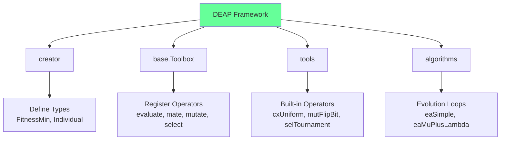
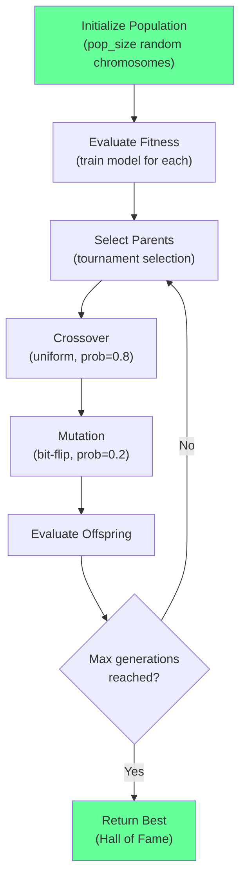

<!-- _class: lead -->

# Implementing GAs with DEAP

## Module 04 — Implementation

From toolbox setup to parallel evolution

<!-- Speaker notes: Introduce DEAP as the de facto Python framework for evolutionary algorithms. Emphasize that by the end of this deck, learners will have a complete working GA for feature selection. -->

---

## DEAP Architecture



```bash
pip install deap
```

<!-- Speaker notes: Walk through the four main DEAP components: creator defines types, Toolbox registers operators, tools provides built-in operators, and algorithms offers ready-made evolution loops. Ask learners to install DEAP before continuing. -->

---

## Step 1: Define Types

```python
from deap import base, creator, tools, algorithms
import numpy as np
import random

# Define fitness (minimize error)
creator.create("FitnessMin", base.Fitness, weights=(-1.0,))

# Define individual as list with attached fitness
creator.create("Individual", list, fitness=creator.FitnessMin)
```

```
Fitness weights determine optimization direction:
  weights=(-1.0,)  → MINIMIZE (error, loss)
  weights=(1.0,)   → MAXIMIZE (accuracy, score)
  weights=(-1.0, -1.0) → Multi-objective minimize
```

<!-- Speaker notes: Emphasize that the weights tuple determines optimization direction. The most common mistake is forgetting the trailing comma for single-objective fitness. Ask learners what weights they would use for maximizing accuracy. -->

---

## Step 2: Create Toolbox

```python
def setup_toolbox(n_features, X, y):
    """Setup DEAP toolbox for feature selection."""
    toolbox = base.Toolbox()

    # Gene: random 0 or 1
    toolbox.register("attr_bool", random.randint, 0, 1)

    # Individual: n_features binary genes
    toolbox.register("individual", tools.initRepeat,
                     creator.Individual, toolbox.attr_bool, n=n_features)

    # Population: list of individuals
    toolbox.register("population", tools.initRepeat, list, toolbox.individual)

    # Fitness function
    toolbox.register("evaluate", evaluate_features, X=X, y=y)

    # Genetic operators
    toolbox.register("mate", tools.cxUniform, indpb=0.5)
    toolbox.register("mutate", tools.mutFlipBit, indpb=0.05)
    toolbox.register("select", tools.selTournament, tournsize=3)

    return toolbox
```

<!-- Speaker notes: Walk through each register call step by step. Highlight that the toolbox is a central registry where you can swap operators easily without changing the rest of the code. Point out the key parameters: indpb for per-gene crossover probability, and tournsize for selection pressure. -->

---

## The Fitness Function

```python
def evaluate_features(individual, X, y):
    """Evaluate feature subset fitness."""
    selected = [i for i, bit in enumerate(individual) if bit == 1]

    if len(selected) == 0:
        return (float('inf'),)  # Must return tuple!

    X_selected = X[:, selected]
    model = RandomForestRegressor(n_estimators=50, random_state=42)
    scores = cross_val_score(
        model, X_selected, y,
        cv=5, scoring='neg_mean_squared_error'
    )
    return (-scores.mean(),)  # Tuple with single value
```

```
CRITICAL: Fitness must return a TUPLE, even for single-objective.

✗ return 0.85            # Wrong: not a tuple
✓ return (0.85,)         # Correct: single-element tuple
✓ return (0.85, 5.0)     # Correct: multi-objective tuple
```

<!-- Speaker notes: Stress that the fitness function MUST return a tuple, even for single objectives. This is the most common DEAP error. Also note the empty-selection guard returning infinity, which prevents crashes during evolution. -->

---

## Step 3: Run Evolution (Simple)

```python
def run_ga(X, y, pop_size=50, n_generations=50):
    toolbox = setup_toolbox(X.shape[1], X, y)

    population = toolbox.population(n=pop_size)

    # Statistics tracking
    stats = tools.Statistics(lambda ind: ind.fitness.values)
    stats.register("avg", np.mean)
    stats.register("min", np.min)
    stats.register("std", np.std)

    # Hall of Fame: preserve best individuals across all generations
    hof = tools.HallOfFame(5)

    # Run evolution
    population, logbook = algorithms.eaSimple(
        population, toolbox,
        cxpb=0.8,    # Crossover probability
        mutpb=0.2,   # Mutation probability
        ngen=n_generations,
        stats=stats,
        halloffame=hof,
        verbose=True
    )

    best = hof[0]
    return [i for i, bit in enumerate(best) if bit == 1]
```

<!-- Speaker notes: Explain the three key additions beyond basic evolution: Statistics tracking logs progress per generation, HallOfFame preserves the best individuals found across all generations (not just the final one), and verbose output helps monitor convergence during development. -->

---

## Evolution Flow



<!-- Speaker notes: Use this diagram to trace the evolution loop step by step. Emphasize the cyclic nature: select, crossover, mutate, evaluate, repeat. Ask learners what would happen if the mutation probability were set too high or too low. -->

---

## Custom Evolution Loop

```python
def custom_ga(X, y, pop_size=50, n_gens=50, elitism=2, early_stop=10):
    """Custom GA with elitism and early stopping."""
    toolbox = setup_toolbox(X.shape[1], X, y)
    population = toolbox.population(n=pop_size)

    # Evaluate initial population
    for ind in population:
        ind.fitness.values = toolbox.evaluate(ind)

    best_fitness = float('inf')
    stagnation = 0

    for gen in range(n_gens):
        # Preserve elite
        elite = tools.selBest(population, elitism)

        # Select, crossover, mutate
        offspring = toolbox.select(population, pop_size - elitism)
        offspring = list(map(toolbox.clone, offspring))
        # ... apply operators ...

        # Ensure at least one feature selected
        for ind in offspring:
            if sum(ind) == 0:
                ind[random.randint(0, len(ind)-1)] = 1

        population[:] = elite + offspring

        # Early stopping
        current_best = min(ind.fitness.values[0] for ind in population)
        if current_best < best_fitness:
            best_fitness = current_best
            stagnation = 0
        else:
            stagnation += 1
            if stagnation >= early_stop:
                break
```

<!-- Speaker notes: Highlight the three improvements over eaSimple: elitism ensures the best solutions are never lost, the empty-chromosome repair guarantees at least one feature is always selected, and early stopping prevents wasted computation when the search has stagnated. -->

---

## Time Series Feature Selection

```python
def setup_timeseries_toolbox(n_features, X, y):
    """Toolbox with temporal cross-validation."""
    toolbox = base.Toolbox()
    # ... register types ...

    def evaluate_timeseries(individual):
        selected = [i for i, bit in enumerate(individual) if bit == 1]
        if len(selected) == 0:
            return (float('inf'),)

        X_selected = X[:, selected]
        tscv = TimeSeriesSplit(n_splits=5)  # Temporal CV!
        errors = []

        for train_idx, test_idx in tscv.split(X_selected):
            model = RandomForestRegressor(n_estimators=50, random_state=42)
            model.fit(X_selected[train_idx], y[train_idx])
            pred = model.predict(X_selected[test_idx])
            errors.append(np.mean((y[test_idx] - pred) ** 2))

        feature_penalty = 0.01 * len(selected)
        return (np.mean(errors) + feature_penalty,)

    toolbox.register("evaluate", evaluate_timeseries)
    return toolbox
```

<!-- Speaker notes: Emphasize the critical difference from standard CV: TimeSeriesSplit preserves temporal order so the model never trains on future data. Also note the feature penalty term that encourages parsimony. Ask learners why standard k-fold would be dangerous for time series. -->

---

## Parallel Evaluation

```python
from multiprocessing import Pool

def run_parallel_ga(X, y, pop_size=50, n_generations=50, n_processes=4):
    """GA with parallel fitness evaluation."""
    toolbox = setup_toolbox(X.shape[1], X, y)

    # Register parallel map
    pool = Pool(processes=n_processes)
    toolbox.register("map", pool.map)

    try:
        population = toolbox.population(n=pop_size)
        hof = tools.HallOfFame(5)

        population, logbook = algorithms.eaSimple(
            population, toolbox,
            cxpb=0.8, mutpb=0.2, ngen=n_generations,
            halloffame=hof, verbose=True
        )
        return hof[0]
    finally:
        pool.close()
        pool.join()
```

```
Serial:   50 individuals × 10s each = 500s per generation
Parallel: 50 individuals ÷ 8 cores × 10s = 63s per generation
Speedup:  ~8x
```

<!-- Speaker notes: Point out that parallelization is nearly free in DEAP: just register a parallel map function. The speedup is almost linear because fitness evaluations are independent. Remind learners to always close the pool in a finally block to avoid zombie processes. -->

---

## Visualizing Evolution

```python
def plot_evolution(history):
    fig, (ax1, ax2) = plt.subplots(2, 1, figsize=(10, 8))

    ax1.plot(generations, best_fitness, 'b-', label='Best')
    ax1.plot(generations, avg_fitness, 'r--', label='Average')
    ax1.set_ylabel('Fitness (MSE)')
    ax1.legend()

    ax2.plot(generations, n_features, 'g-')
    ax2.set_ylabel('Number of Features')
    ax2.set_xlabel('Generation')
```

```
Fitness Evolution:                Feature Count:

Best ───                          15 ──
         ──────────────           10    ──────
Avg  ────                                     ──────  7
           ──────────             5
  0  10  20  30  40  50           0  10  20  30  40  50
        Generation                      Generation
```

<!-- Speaker notes: These two plots are essential for diagnosing GA behavior. The top plot shows convergence: best and average fitness should decrease and stabilize. The bottom plot shows feature parsimony: feature count should decrease as the GA eliminates redundant features. If average fitness does not improve, consider increasing population size or mutation rate. -->

---

## Key Takeaways

| Component | Implementation |
|-----------|---------------|
| **Types** | `creator.create()` for Fitness and Individual |
| **Toolbox** | Register all operators in one place |
| **Fitness** | Must return tuple; use CV for robustness |
| **Hall of Fame** | Preserves best solutions across all generations |
| **Early stopping** | Prevents wasted computation |
| **Parallel map** | Linear speedup with multiprocessing |

```
DEAP WORKFLOW:
creator.create → toolbox.register → toolbox.population
→ algorithms.eaSimple → tools.HallOfFame → Best Solution
```

<!-- Speaker notes: Summarize the DEAP workflow as a five-step process. Reinforce that the tuple return for fitness and HallOfFame for preservation are the two most important details to remember. Transition to custom operators for handling domain-specific constraints. -->

> **Next**: Custom genetic operators for domain-specific constraints.
