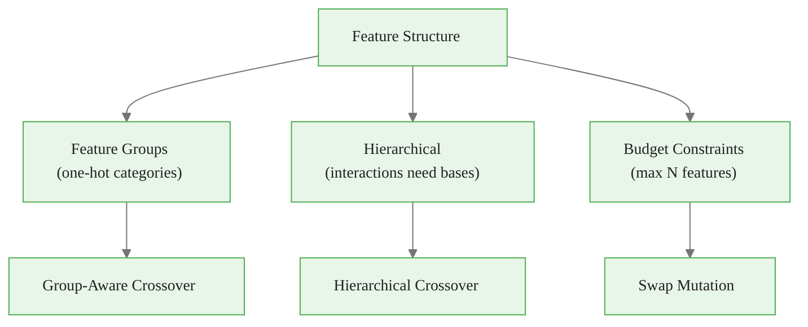
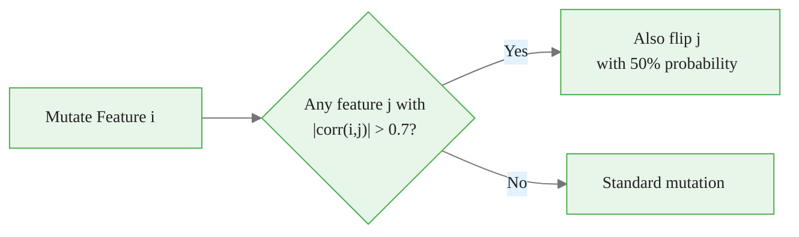
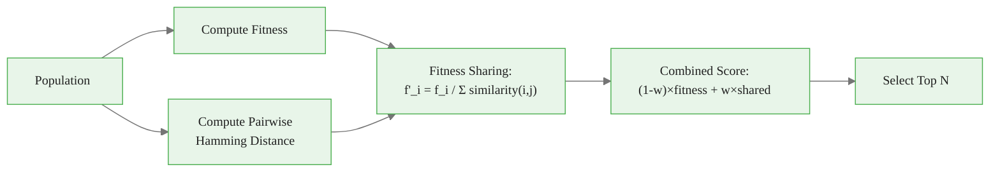

<!-- _class: lead -->

# Custom Genetic Operators

## Module 04 — Implementation

Crossover, mutation, and selection for feature selection

<!-- Speaker notes: Frame this deck as the practical bridge between standard DEAP operators and real-world feature selection problems. Custom operators are necessary because features have structure that generic operators ignore. -->

---

## Why Custom Operators?

Standard operators treat all genes equally. Features have **structure**:



Custom operators that respect structure converge **2-5x faster** than standard operators.

<!-- Speaker notes: Walk through the three types of feature structure: one-hot groups that must stay consistent, hierarchical features where interactions depend on base features, and budget constraints that limit the total count. Each requires a different custom operator. -->

---

## The One-Hot Problem

```
Features: [city_NYC, city_LA, city_CHI, income, age]

STANDARD CROSSOVER (breaks constraints):
Parent 1: [1, 0, 0, 1, 1]  (NYC)
Parent 2: [0, 1, 0, 1, 0]  (LA)
Child:    [1, 1, 0, 1, 1]  ✗ Both NYC AND LA!

GROUP-AWARE CROSSOVER (preserves validity):
Groups: {city: [0,1,2], other: [3,4]}
Swap entire city group:
Child:    [0, 1, 0, 1, 1]  ✓ LA only
```

<!-- Speaker notes: This is a concrete example of why standard crossover breaks with one-hot encoded features. A child selecting both NYC and LA simultaneously is invalid and would cause data leakage or multicollinearity. Ask learners if they have encountered this issue in their own projects. -->

---

## Feature-Group-Aware Crossover


<div class="code-window">
<div class="code-header">
<div class="dots"><span class="dot-red"></span><span class="dot-yellow"></span><span class="dot-green"></span></div>
<span class="filename">customcrossover.py</span>
</div>

```python
class CustomCrossover:
    def __init__(self, feature_groups):
        self.feature_groups = feature_groups

    def group_aware_crossover(self, parent1, parent2, prob=0.8):
        if np.random.random() > prob:
            return parent1.copy(), parent2.copy()

        child1, child2 = parent1.copy(), parent2.copy()

        for group in self.feature_groups:
            if group.group_type == 'one_hot':
                # Swap entire group to maintain validity
                if np.random.random() < 0.5:
                    child1[group.indices] = parent2[group.indices]
                    child2[group.indices] = parent1[group.indices]
            else:
                # Standard uniform crossover within group
                for idx in group.indices:
                    if np.random.random() < 0.5:
                        child1[idx], child2[idx] = parent2[idx], parent1[idx]

        return child1, child2
```

</div>

<!-- Speaker notes: Walk through the code line by line. The key insight is that one-hot groups are swapped as a whole unit, while other features use standard uniform crossover. This guarantees that the child always has exactly one city selected. -->

---

## Hierarchical Crossover

For interaction features that depend on base features:

```
Features: [X1, X2, X3, X1*X2, X1*X3, X2*X3]

Rule: If X1*X2 is selected, BOTH X1 and X2 must be selected.

STANDARD CROSSOVER:
Parent 1: [1, 1, 0, 1, 0, 0]  (X1, X2, X1*X2)
Parent 2: [1, 0, 1, 0, 1, 0]  (X1, X3, X1*X3)
Child:    [1, 0, 0, 1, 1, 0]  ✗ X1*X2 selected but X2 is NOT!

HIERARCHICAL CROSSOVER:
After repair: [1, 0, 0, 0, 1, 0]  ✓ Invalid interactions removed
```


<div class="code-window">
<div class="code-header">
<div class="dots"><span class="dot-red"></span><span class="dot-yellow"></span><span class="dot-green"></span></div>
<span class="filename">hierarchical_crossover.py</span>
</div>

```python
def hierarchical_crossover(child, interaction_map):
    for interaction_idx, base_indices in interaction_map.items():
        if any(child[base_idx] == 0 for base_idx in base_indices):
            child[interaction_idx] = 0  # Remove invalid interaction
    return child
```

</div>

<!-- Speaker notes: Highlight the repair-after-crossover approach: if any base feature for an interaction is missing, the interaction term is removed. This is simpler than preventing violations during crossover and equally effective. Ask learners what other dependency structures they can think of. -->

---

<!-- _class: lead -->

# Custom Mutation Operators

<!-- Speaker notes: Transition from crossover to mutation. The key idea is that mutation can be smarter than random bit flipping by incorporating domain knowledge about feature importance, correlation structure, or budget constraints. -->

---

## Importance-Weighted Mutation

```
Standard Mutation: All features p_m = 0.01

Importance-Weighted Mutation:
Feature    Importance  Mutation Rate
────────   ──────────  ────────────
price      0.15        0.05  ← Focus exploration here
volume     0.12        0.04
sentiment  0.03        0.02
noise_1    0.001       0.01  ← Less exploration
noise_2    0.001       0.01
```


<div class="code-window">
<div class="code-header">
<div class="dots"><span class="dot-red"></span><span class="dot-yellow"></span><span class="dot-green"></span></div>
<span class="filename">importance_weighted_mutation.py</span>
</div>

```python
def importance_weighted_mutation(individual, importances, base_rate=0.01):
    importances_scaled = importances / (importances.max() + 1e-10)
    mutation_rates = base_rate + (3 * base_rate) * importances_scaled

    mutant = individual.copy()
    for i in range(len(mutant)):
        if np.random.random() < mutation_rates[i]:
            mutant[i] = 1 - mutant[i]
    return mutant
```

</div>

<!-- Speaker notes: Explain the intuition: important features get higher mutation rates because we want the GA to explore their on/off status more aggressively. Less important features are explored less frequently. The scaling formula maps importance scores to mutation rates proportionally. -->

---

## Correlation-Aware Mutation

Highly correlated features should be mutated together:




<div class="code-window">
<div class="code-header">
<div class="dots"><span class="dot-red"></span><span class="dot-yellow"></span><span class="dot-green"></span></div>
<span class="filename">correlation_aware_mutation.py</span>
</div>

```python
def correlation_aware_mutation(individual, corr_matrix, base_rate=0.01,
                                threshold=0.7):
    mutant = individual.copy()
    for i in range(len(mutant)):
        if np.random.random() < base_rate:
            mutant[i] = 1 - mutant[i]
            # Find and flip correlated features
            high_corr = np.where(np.abs(corr_matrix[i]) > threshold)[0]
            for j in high_corr:
                if j != i and np.random.random() < 0.5:
                    mutant[j] = 1 - mutant[j]
    return mutant
```

</div>

<!-- Speaker notes: The core idea is that highly correlated features provide redundant information, so flipping one should trigger consideration of flipping its correlated partner. The 50% probability prevents deterministic coupling while still encouraging coordinated exploration. -->

---

## Swap Mutation (Budget-Preserving)

Maintains constant number of selected features:

```
Before: [1, 0, 1, 0, 0, 1, 0, 0, 1, 0]  (4 features)
Swap 1: Turn OFF feature 2, Turn ON feature 4
After:  [1, 0, 0, 0, 1, 1, 0, 0, 1, 0]  (4 features)

Feature count unchanged!
```


<div class="code-window">
<div class="code-header">
<div class="dots"><span class="dot-red"></span><span class="dot-yellow"></span><span class="dot-green"></span></div>
<span class="filename">swap_mutation.py</span>
</div>

```python
def swap_mutation(individual, n_swaps=1):
    mutant = individual.copy()
    selected = np.where(mutant == 1)[0]
    unselected = np.where(mutant == 0)[0]

    for _ in range(n_swaps):
        if len(selected) > 0 and len(unselected) > 0:
            turn_off = np.random.choice(selected)
            turn_on = np.random.choice(unselected)
            mutant[turn_off] = 0
            mutant[turn_on] = 1
            selected = np.where(mutant == 1)[0]
            unselected = np.where(mutant == 0)[0]

    return mutant
```

</div>

<!-- Speaker notes: Swap mutation is essential when you have a fixed feature budget, such as a model that can only handle N inputs for latency or interpretability reasons. It replaces one selected feature with one unselected feature, keeping the total count constant. -->

---

## Adaptive Mutation

Mutation rate decreases over generations (exploration → exploitation):

```
Mutation Rate Over Generations:

0.10 │██
     │████
     │██████
0.05 │████████
     │██████████
     │████████████
0.01 │██████████████
     └──────────────────────>
      0   25   50   75  100
            Generation
```

$$p_m(t) = p_{max} - \frac{t}{T_{max}} \cdot (p_{max} - p_{min})$$


<div class="code-window">
<div class="code-header">
<div class="dots"><span class="dot-red"></span><span class="dot-yellow"></span><span class="dot-green"></span></div>
<span class="filename">adaptive_mutation.py</span>
</div>

```python
def adaptive_mutation(individual, generation, max_gen,
                      initial_rate=0.1, final_rate=0.01):
    progress = generation / max_gen
    rate = initial_rate - progress * (initial_rate - final_rate)
    # Apply mutation at computed rate...
```

</div>

<!-- Speaker notes: Adaptive mutation follows the explore-then-exploit principle. High mutation early on helps discover diverse regions of the search space, while low mutation later preserves good solutions and fine-tunes. This will be covered in more depth in the adaptive operators deck. -->

---

<!-- _class: lead -->

# Custom Selection Operators

<!-- Speaker notes: Transition to selection. Standard tournament selection works well but can lead to premature convergence. Diversity-preserving and niching selection help maintain a broader search of the solution space. -->

---

## Diversity-Preserving Selection

Standard selection: pick the fittest (may lose diversity).
Diversity-preserving: balance fitness with uniqueness.



```
Without diversity: [A, A', A'', B, C] → All similar to A
With diversity:    [A, B, C, D, E]     → Diverse population

Population Diversity:
  Fitness-only selection: avg distance = 2.1
  Diversity-preserving:   avg distance = 5.8
```

<!-- Speaker notes: Explain fitness sharing: an individual in a crowded region has its fitness divided by the number of similar neighbors, reducing its selection advantage. This prevents the entire population from converging to one area and encourages exploration of alternative feature subsets. -->

---

## Niching Selection

Select best individual from each cluster (niche):


<div class="code-window">
<div class="code-header">
<div class="dots"><span class="dot-red"></span><span class="dot-yellow"></span><span class="dot-green"></span></div>
<span class="filename">niching_selection.py</span>
</div>

```python
def niching_selection(population, fitness_scores, n_niches=5):
    """Select best individual from each population niche."""
    from sklearn.cluster import KMeans

    pop_array = np.array(population)
    kmeans = KMeans(n_clusters=n_niches, random_state=42)
    labels = kmeans.fit_predict(pop_array)

    selected = []
    for niche_id in range(n_niches):
        mask = labels == niche_id
        if mask.sum() > 0:
            niche_fitness = fitness_scores[mask]
            best_idx = np.where(mask)[0][niche_fitness.argmax()]
            selected.append(population[best_idx])

    return selected
```

</div>

Ensures all regions of the search space are represented.

<!-- Speaker notes: Niching uses clustering to identify distinct regions of the search space and selects the best individual from each cluster. This guarantees that diverse solution types survive, even if one niche dominates on fitness alone. Ask learners when they would prefer niching over standard diversity-preserving selection. -->

---

## Common Pitfalls

| Pitfall | Symptom | Solution |
|---------|---------|----------|
| **Constraint violation** | Constant repairs needed | Design validity-preserving operators |
| **Over-complicated** | Worse than standard | Start simple, add complexity with evidence |
| **Expensive operators** | 10x slower GA | Precompute correlations, cache matrices |
| **Greedy mutation** | Premature convergence | Maintain randomness, don't always improve |
| **No testing** | Assumed superiority | A/B test custom vs standard operators |

<!-- Speaker notes: Emphasize these common mistakes. The most important takeaway is the last row: always A/B test custom operators against standard ones to verify they actually help. Complexity without evidence is a liability. -->

---

<div class="callout-insight">

💡 **Key Insight:** Custom operators that respect feature structure converge 2-5x faster than standard operators. Always A/B test to verify.

</div>

<div class="flow">
<div class="flow-step mint">Group-Aware</div>
<div class="flow-arrow">→</div>
<div class="flow-step amber">Importance-Weighted</div>
<div class="flow-arrow">→</div>
<div class="flow-step blue">Diversity-Preserving</div>
</div>

## Key Takeaways

| Operator | Use When |
|----------|----------|
| **Group-Aware Crossover** | One-hot encoded features, feature groups |
| **Hierarchical Crossover** | Interaction terms, polynomial features |
| **Importance-Weighted Mutation** | Prior knowledge of feature relevance |
| **Correlation-Aware Mutation** | Highly correlated feature sets |
| **Swap Mutation** | Fixed feature budget |
| **Adaptive Mutation** | Long evolution runs |
| **Diversity-Preserving Selection** | Risk of premature convergence |
| **Niching Selection** | Multi-modal fitness landscapes |

<!-- Speaker notes: This reference table summarizes when to use each custom operator. Encourage learners to start with standard operators and only add custom ones when they have evidence of constraint violations or premature convergence. Transition to production considerations next. -->

> **Next**: Production considerations — parallelization, caching, and reproducibility.
